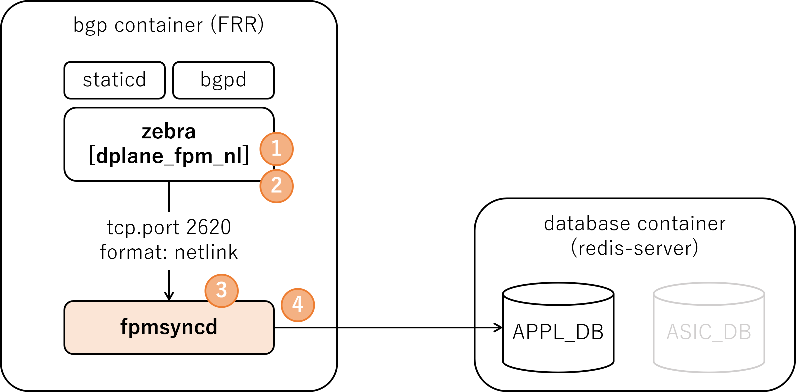
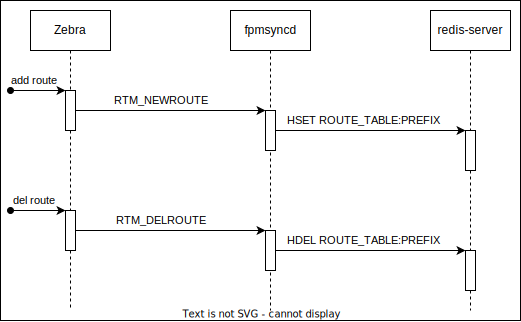
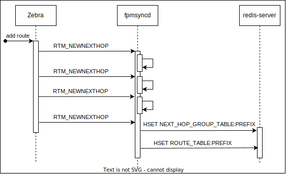
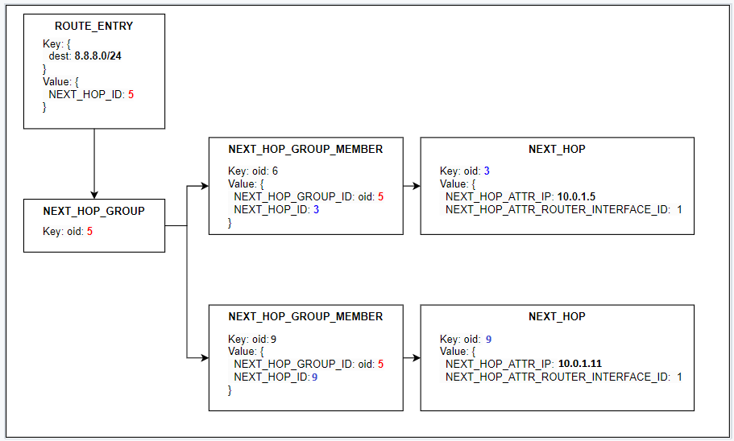

# `fpmsyncd` NextHop Group Enhancement High Level Design Document

<!-- omit in toc -->
## Table of Content 
- [Revision](#revision)
- [Scope](#scope)
- [Overview](#overview)
- [Requirements](#requirements)
- [Architecture Design](#architecture-design)
- [High-Level Design](#high-level-design)
  - [Current fpmsyncd processing flow (for reference)](#current-fpmsyncd-processing-flow-for-reference)
  - [Proposed fpmsyncd processing flow using NextHop Group](#proposed-fpmsyncd-processing-flow-using-nexthop-group)
  - [Value SET/DEL to APPL\_DB](#value-setdel-to-appl_db)
  - [Example of entries in APPL\_DB](#example-of-entries-in-appl_db)
  - [Example of entries in ASIC\_DB](#example-of-entries-in-asic_db)
- [SAI API](#sai-api)
- [Configuration and management](#configuration-and-management)
  - [Configuration data flow](#configuration-data-flow)
  - [CLI/YANG model Enhancements](#cliyang-model-enhancements)
  - [Config DB Enhancements](#config-db-enhancements)
- [Warmboot and Fastboot Design Impact](#warmboot-and-fastboot-design-impact)
- [Testing Requirements/Design](#testing-requirementsdesign)
  - [Unit Test cases](#unit-test-cases)
  - [Config test cases (feature enable/disable)](#config-test-cases-feature-enabledisable)
  - [System Test cases](#system-test-cases)
- [Open/Action items - if any](#openaction-items---if-any)
  - [libnl compatibility with upstream](#libnl-compatibility-with-upstream)
  - [Further performance improvements](#further-performance-improvements)
  - [Backward compatibility with current NHG creation logic (Fine-grain NHG, Ordered NHG/ECMP)](#backward-compatibility-with-current-nhg-creation-logic-fine-grain-nhg-ordered-nhgecmp)
  - [nexthop\_compat\_mode Kernel option](#nexthop_compat_mode-kernel-option)
  - [Warmboot/Fastboot support](#warmbootfastboot-support)
  - [No support for setting config enable/disable on runtime](#no-support-for-setting-config-enabledisable-on-runtime)
  - [Source of APPL\_DB entry related to NHG](#source-of-appl_db-entry-related-to-nhg)

### Revision  

|  Rev  |     Date     |                       Author                       | Change Description                                                                                                                                                          |
| :---: | :----------: | :------------------------------------------------: | --------------------------------------------------------------------------------------------------------------------------------------------------------------------------- |
|  0.1  | Jul 14, 2023 | Kanji Nakano, Kentaro Ebisawa, Hitoshi Irino (NTT) | Initial version                                                                                                                                                             |
|  0.2  | Jul 30, 2023 |               Kentaro Ebisawa (NTT)                | Remove description about VRF which is not nessesary for NHG. Add High Level Architecture diagram. Add note related to libnl, Routing WG. Fix typo and improve explanations. |
|  0.3  | Sep 18, 2023 |               Kentaro Ebisawa (NTT)                | Update based on discussion at Routing WG on Sep 14th (Scope, Warmboot/Fastboot, CONFIG_DB)                                                                                  |
|  0.4  | Sep 24, 2023 |               Kentaro Ebisawa (NTT)                | Add feature enable/disable design and CLI. Update test plan.                                                                                                                     |
|  0.5  | Nov 10, 2023 |               Kanji Nakano (NTT)                   | Update feature enable/disable design and CLI. Update test plan.                                                                                                                     |
|  0.6  | Feb 09, 2024 |               Nikhil Kelapure (BRCM)                   | Update multipath NHG handling.                                                                                                                     |

### Scope  

This document details the design and implementation of the "fpmsyncd extension" related to NextHop Group behavior in SONiC.
The goal of this "fpmsyncd extension" is to integrate NextHop Group (NHG) functionality into SONiC by writing NextHop Group entry from `fpmsyncd` to `APPL_DB` for NextHop Group operation in SONiC.

- Scope of this change is to extend `fpmsyncd` to handle `RTM_NEWNEXTHOP` and `RTM_DELNEXTHOP` messages from FPM.
- This change is backward compatible. Upgrade from a SONiC version that does not support this feature does not change the user's expected behavior as this feature is disabled by default.

### Overview 

SONIC system has support for programming routes using the NextHop Group feature through the NextHop Group table in `APPL_DB` database.
The idea is to have a more efficient system that would involve managing the NextHop Group in use by the route table separately, and simply have the route table specify a reference to which NextHop Group to use.
Since at scale many routes will use the same NextHop Groups, this requires much smaller occupancy per route, and so more efficient building, transmission and parsing of per-route information. 

The current version of `fpmsyncd` has no support to handle the NextHop Group netlink messages sent by zebra process via `FPM` using the `dplane_fpm_nl` module.
This implementation modifies the `fpmsyncd` code to handle `RTM_NEWNEXTHOP` and `RTM_DELNEXTHOP` events and write it to the database.
Also, the `fpmsyncd` was modified to use the NextHop Group ID (`nexthop_group`) when programming the route to the `ROUTE_TABLE` if `RTA_NH_ID` was included in the `RTM_NEWROUTE` message from zebra via `FPM`.

NHG ID and members are managed by `FRR`.
`fpmsyncd` will use NHG ID provided in FPM message from `FRR(zebra)`.
Thus, logic of either if updating NHG members or create NHG with new ID during topology change is managed by `FRR`.

Use case example of this feature would be BGP PIC, and recursive routes handling.
BGP PIC has started in design discussion in the SONiC Routing WG.
Recursive routes support would be discussed after.
See [09072023 Routing WG Meeting minutes](https://lists.sonicfoundation.dev/g/sonic-wg-routing/wiki/34786) for further information about BGP PIC discussion.

### Requirements

`Fpmsyncd extension` requires:
- `fpmsyncd` to handle `RTM_NEWNEXTHOP` and `RTM_DELNEXTHOP` events from zebra via `dplane_fpm_nl`
- `fpmsyncd` to SET/DEL routes to `APPL_DB: ROUTE_TABLE` using `nexthop_group`
- `fpmsyncd` to SET/DEL NextHop Group entry to `APPL_DB: NEXTHOP_GROUP_TABLE`

`Orchagent extension` requires:
- `orchagent` to handle member updates from `APPL_DB:NEXTHOP_GROUP_TABLE` for multipath NextHop Group

This feature must be disabled by default.
- When this feature is disabled, behavior will be the same as before introducing this feature.
  - i.e. `NEXTHOP_GROUP_TABLE` entry will not be created and `nexthop_group` will not be used in `ROUTE_TABLE` entry in `APPL_DB`.
- See section [Configuration and management](#configuration-and-management) for details on how this feature is disabled/enabled.

### Architecture Design 
<!--

This section covers the changes that are required in the SONiC architecture. In general, it is expected that the current architecture is not changed.
This section should explain how the new feature/enhancement (module/sub-module) fits in the existing architecture. 

If this feature is a SONiC Application Extension mention which changes (if any) needed in the Application Extension infrastructure to support new feature.
-->

This design modifies `fpmsyncd` to use the new `APPL_DB` tables.

The current `fpmsyncd` handle just the `RTM_NEWROUTE` and `RTM_DELROUTE` writing all route information for each route prefix to `ROUTE_TABLE` on Redis DB (`redis-server`).
When zebra process is initialized using the old fpm module, the `RTM_NEWROUTE` is sent with at least destination address, gateway, and interface id attributes.
For multipath route, the `RTM_NEWROUTE` is sent with a list of gateway and interface id.

This `Fpmsyncd extension` will modify `fpmsyncd` to handle  `RTM_NEWNEXTHOP` and `RTM_DELNEXTHOP` as below.

This feature enhances orchagent `NhgOrch` to handle `RTM_NEWNEXTHOP` events and update `NEXTHOP_GROUP_TABLE` entries accordingly

<!-- omit in toc -->
##### Figure: Fpmsyncd NHG High Level Architecture


- FRR configuration
  - (1) config zebra to use `dplane_fpm_nl` instead of `fpm` module (this is default since 202305 release)
  - (2) set `fpm use-nexthop-groups` option (this is disabled by default and enabled via `CONFIG_DB`)
- fpmsyncd enhancement
  - (3) Handle `RTM_NEWNEXTHOP` fpm message from zebra
  - (4) and create `NEXTHOP_GROUP_TABLE` entry


### High-Level Design 
<!--

This section covers the high level design of the feature/enhancement. This section covers the following points in detail.
		
	- Is it a built-in SONiC feature or a SONiC Application Extension?
	- What are the modules and sub-modules that are modified for this design?
	- What are the repositories that would be changed?
	- Module/sub-module interfaces and dependencies. 
	- SWSS and Syncd changes in detail
	- DB and Schema changes (APPL_DB, ASIC_DB, COUNTERS_DB, LOGLEVEL_DB, CONFIG_DB, STATE_DB)
	- Sequence diagram if required.
	- Linux dependencies and interface
	- Warm reboot requirements/dependencies
	- Fastboot requirements/dependencies
	- Scalability and performance requirements/impact
	- Memory requirements
	- Docker dependency
	- Build dependency if any
	- Management interfaces - SNMP, CLI, RestAPI, etc.,
	- Serviceability and Debug (logging, counters, trace etc) related design
	- Is this change specific to any platform? Are there dependencies for platforms to implement anything to make this feature work? If yes, explain in detail and inform community in advance.
	- SAI API requirements, CLI requirements, ConfigDB requirements. Design is covered in following sections.
-->

#### Current fpmsyncd processing flow (for reference)

For example, if one configure following routes:

```
B>*10.1.1.4/32 [20/0] via 10.0.0.1, Ethernet0, 00:00:08
  *                   via 10.0.0.3, Ethernet4, 00:00:08
```

it will generate the following `APPL_DB` entries:

```
admin@sonic:~$ sonic-db-cli APPL_DB hgetall "ROUTE_TABLE:10.1.1.4/32"
{'nexthop': '10.0.0.1,10.0.0.3', 'ifname': 'Ethernet0,Ethernet4', 'weight': '1,1'}

```

The flow below shows how `zebra`, `fpmsyncd` and `redis-server` interacts when using `fpm plugin` without NextHop Group:

<!-- omit in toc -->
##### Figure: Flow diagram without NextHop Group
  

#### Proposed fpmsyncd processing flow using NextHop Group

To support the nexthop group, `fpmsyncd` was modified to handle the new events `RTM_NEWNEXTHOP` and `RTM_DELNEXTHOP`.
`fpmsyncd` now has a new logic to associate routes to NextHop Groups.

The flow for the new NextHop Group feature is shown below:

<!-- omit in toc -->
##### Figure: Flow diagram new nexthop group feature



#### Value SET/DEL to APPL_DB

After enabling `use-next-hop-groups` in `dplane_fpm_nl` plugin, zebra will send `RTM_NEWNEXTHOP` to `fpmsyncd` when a new route is added.

`RTM_NEWNEXTHOP` is sent with 2 different attribute groups as shown in the table below:

<table>
  <tr><td>Event</td><td>Attributes</td><td>Description</td></tr>
  <tr><td rowspan="3">RTM_NEWNEXTHOP</td><td>NHA_ID</td><td>NextHop Group ID</td></tr>
  <tr><td>NHA_GATEWAY</td><td>gateway address</td></tr>
  <tr><td>NHA_OIF</td><td>The interface ID</td></tr>
  <tr><td rowspan="2">RTM_NEWNEXTHOP</td><td>NHA_ID</td><td>NextHop Group ID</td></tr>
  <tr><td>NHA_GROUP</td><td>A list of nexthop groups IDs with its respective weights.</td></tr>
</table>

After sending the `RTM_NEWNEXTHOP` events, zebra sends the `RTM_NEWROUTE` to `fpmsyncd` with NextHop Group ID as shown in the table below:

<table>
  <tr><td>Event</td><td>Attributes</td><td>Description</td></tr>
  <tr><td rowspan="2">RTM_NEWROUTE</td><td>RTA_DST</td><td>route prefix address</td></tr>
  <tr><td>RTA_NH_ID</td><td>NextHop Group ID</td></tr>
</table>

#### Example of entries in APPL_DB

For example. following route configuration will generate events show in the table below:

```
admin@sonic:~$ show ip route
B>*10.1.1.4/32 [20/0] via 10.0.0.1, Ethernet0, 00:00:08
  *                   via 10.0.0.3, Ethernet4, 00:00:08
```

```
admin@sonic:~$ sonic-db-cli APPL_DB keys \* | grep NEXT
NEXTHOP_GROUP_TABLE:ID127

admin@sonic:~$ sonic-db-cli APPL_DB HGETALL NEXTHOP_GROUP_TABLE:ID127
{'nexthop': '10.0.0.1,10.0.0.3', 'ifname': 'Ethernet0,Ethernet4', 'weight': '1,1'}

admin@sonic:~$ sonic-db-cli APPL_DB keys \* | grep ROUTE
ROUTE_TABLE:10.1.1.4

admin@sonic:~$ sonic-db-cli APPL_DB HGETALL ROUTE_TABLE:10.1.1.4
{'nexthop_group': 'ID127', 'protocol': 'bgp'}
```

<table>
  <tr><td>Seq</td><td>Event</td><td>Attributes</td><td>Value</td></tr>
  <tr><td rowspan="3">1</td><td rowspan="3">RTM_NEWNEXTHOP</td><td>NHA_ID</td><td>ID125</td></tr>
  <tr><td>NHA_GATEWAY</td><td>10.0.0.1</td></tr>
  <tr><td>NHA_OIF</td><td>22</td></tr>
  <tr><td rowspan="3">2</td><td rowspan="3">RTM_NEWNEXTHOP</td><td>NHA_ID</td><td>ID126</td></tr>
  <tr><td>NHA_GATEWAY</td><td>10.0.0.3</td></tr>
  <tr><td>NHA_OIF</td><td>23</td></tr>
  <tr><td rowspan="2">3</td><td rowspan="2">RTM_NEWNEXTHOP</td><td>NHA_ID</td><td>ID127</td></tr>
  <tr><td>NHA_GROUP</td><td>[{125,1},{126,1}]</td></tr>
  <tr><td rowspan="2">4</td><td rowspan="2">RTM_NEWROUTE</td><td>RTA_DST</td><td>10.1.1.4</td></tr>
  <tr><td>RTA_NH_ID</td><td>ID127</td></tr>
  <tr><td rowspan="2">5</td><td rowspan="2">RTM_NEWROUTE</td><td>RTA_DST</td><td>10.1.1.5</td></tr>
  <tr><td>RTA_NH_ID</td><td>ID127</td></tr>
  <tr><td rowspan="3">6</td><td rowspan="3">RTM_NEWNEXTHOP</td><td>NHA_ID</td><td>ID128</td></tr>
  <tr><td>NHA_GATEWAY</td><td>10.0.0.4</td></tr>
  <tr><td>NHA_OIF</td><td>22</td></tr>
  <tr><td rowspan="2">7</td><td rowspan="2">RTM_NEWNEXTHOP</td><td>NHA_ID</td><td>ID127</td></tr>
  <tr><td>NHA_GROUP</td><td>[{125,1},{128,1}]</td></tr>
</table>

A short description of `fpmsyncd` logic flow:

- When receiving `RTM_NEWNEXTHOP` events on sequence 1 and 2, `fpmsyncd` will write the information in `NEXTHOP_GROUP_TABLE` with NextHop Group `ID125` and `ID126` and with information of gateway and interface respectively. For sequence 3  multi path NextHop Group `ID127` the information in `NEXTHOP_GROUP_TABLE` will contain the list of IDs 125 and 126
- When `fpmsyncd` receive the `RTM_NEWROUTE` on sequence 4, the process will create a new route entry to `ROUTE_TABLE` with a `nexthop_group` field with value `ID127`.
- When `fpmsyncd` receives the next `RTM_NEWROUTE` on sequence 5, the process will create a new route entry (but no NextHop Group entry) in `ROUTE_TABLE` with `nexthop_group` field with value `ID127`. (Note: This NextHop Group entry was created when the `fpmsyncd` received the event sequence 4.)
- When receiving `RTM_NEWNEXTHOP` events on sequence 6 `fpmsyncd` will write the information in `NEXTHOP_GROUP_TABLE` with NextHop Group `ID128`
- When receiving `RTM_NEWNEXTHOP` events on sequence 7 `fpmsyncd` will update the information in `NEXTHOP_GROUP_TABLE` with NextHop Group `ID127` and the information will now contain list of IDs 125 and 128


#### Example of entries in ASIC_DB

The `ASIC_DB` entry is not changed by this enhancement.
Therefore, even after this enhancement, table entries will be created for `ROUTE_ENTRY`, `NEXT_HOP_GROUP`, `NEXT_HOP_GROUP_MEMBER`, and `NEXT_HOP` respectively, as shown in the example below

<!-- omit in toc -->
##### Figure: Example of ASIC_DB entry


After processing the NHG update the `ASIC_DB` entry will be updated to point to the new member `NEXT_HOP`
##### Figure: Example of ASIC_DB entry after NHG update


#### Orchestration Agent Changes to handle NEXTHOP_GROUP

Orchestration agent `NhgOrch` will be enhanced to handle the new NEXTHOP_GROUP_TABLE in APP_DB. For adding or updating an entry in the NEXTHOP_GROUP_TABLE, programming will depend on whether the group is configured with one or multiple next hops or is a recursive nexthop group i.e. it contains one or more nexthop group.

 - NhgOrch treats an NEXTHOP_GROUP as "recursive" if it has "nexthop_group" as the only field. This field contains "member" NEXTHOP_GROUP. The parent NEXTHOP_GROUP key is constructed by combining keys of the member NEXTHOP_GROUPs. Such an NEXTHOP_GROUP always uses a "NEXT_HOP_GROUP" object-id to represent the group
 - Singleton (non-recursive) NEXTHOP_GROUP contain various fields e.g. Inexthop, alias etc. Such NEXTHOP_GROUP form a key by combining these fields and query the NeighOrch with the "key" to get the corresponding SAI ID. So singleton (non-recursive) NEXTHOP_GROUP do not own the SAI ID rather they just reuse the SAI IDs owned by NeighOrch module.
 - If one or more members of a "recursive" NEXTHOP_GROUP are not available, then the "NEXTHOP_GROUP" object is created with just the available members as long as there is one. The msg is retained in NhgOrch's mToSync queue so that it keeps checking for the availability of all the member NEXTHOP_GROUP. As and when the member NEXTHOP_GROUP are available, the "NEXTHOP_GROUP" object is updated with the new members. The "recursive" NEXTHOP_GROUP allow for members to be updated without having to update the referring routes. Since the SAI ID remains unchanged, update is transparent to the RouteOrch modules.
 - When a port-down event is received from Syncd, the corresponding nexthops are removed from all the nexthop groups they're part of.

Dummy code for this logic:
```
if (nexthop_group NOT present)
	sai_id = sai ID of the next hop
else
	create next hop group
	add next hop group member for each next hop
	sai_id = sai ID of the next hop group
```

The handling of whether a next hop group member can be programmed or not, interfaces going up and down, etc. will match the same handling done by next hop groups managed by the route orchagent.

When the next hop group is deleted, the next hop group orchagent will remove the next hop group from the ASIC_DB if required, and remove the association between the group identifier from APP_DB and the SAI identifier from ASIC_DB.  This will only happen once the next hop group is no longer referenced by any routes - and so the next hop group will maintain a reference count within orchagent to ensure this.

The route orchagent will parse the new nexthop_group field, and call into the next hop group orchagent to find the corresponding SAI object ID to program as the next hop attribute.  If the next hop group does not exist, the route will remain on the list of routes to sync, and will be retried on future runs of the route orchagent.

If a next hop group cannot be programmed because the data plane limit has been reached, one next hop will be picked to be temporarily used for that group.  When a route is then programmed using that next hop group, it will be informed that a temporary form of the next hop group is in use, and so the route will remain on the pending list and will retry until the correct next hop group is programmed.  This mirrors the current behaviour in the route orchagent when the next hop group limit is reached. The APP_DB entries remain unchanged.

### SAI API 

No changes are being made in SAI.
The end result of what gets programmed via SAI will be the same as current implementation when manually adding `NEXTHOP_GROUP_TABLE` entries to `APPL_DB`.


### Configuration and management 

This NextHop Group feature is enabled/disabled by config option of zebra (BGP container): `[no] fpm use-next-hop-groups`

- To disable this feature (default): configure `no fpm use-next-hop-groups`
- To enable this feature: configure `fpm use-next-hop-groups`

On FRR, one can configure this zebra option via vtysh (zebra CLI) or `zebra.conf` (zebra startup config).

In SONiC, we will use CONFIG_DB data to enable/disable this option to be consistent with other SONiC features.
We will also use `config_db.json` to preserve config among system reboot.

Users (SONiC admin) are expected to use only SONiC CLI or edit `config_db.json` file to enable/disable this feature, and should not edit `zebra.conf` directly.


This configuration is backward compatible. Upgrade from a SONiC version that does not support this feature does not change the user's expected behavior as this flag is set to be disabled by default. (i.e. It's disabled if `FEATURE|nexthop_group` entry does not exist in CONFIG_DB)

This setting can NOT be enabled or disabled at runtime.
System reboot is required after enabling/disabling this feature to make sure route entry using and not using this NHG feature would not co-exisit in the `APPL_DB`.

#### Configuration data flow

Diagram shows how `zebra.conf` is genereated from CONFIG_DB data.

<!-- omit in toc -->
##### Figure: Configuration data flow


- CONFIG_DB entry is created via CLI or data stored in `config_db.json` file
- `sonic-cfggen` will generate `zebra.conf` based on template file named `zebra.conf.j2`
- FRR will use `zebra.conf` during startup to apply config stored in the file

This flow is existing framework and not specific to this feature.

Modification made for this feature is in `zebra.conf.j2` to generate config with `[no] fpm use-next-hop-groups` based on `DEVICE_METADATA|localhost` entry in CONFIG_DB.

As shown in below diff code, the template will generate config following below logic.

- If `DEVICE_METADATA|localhost` is present in CONFIG_DB but there is no "nexthop_group" attribute => disabled
- If `DEVICE_METADATA|localhost` is present in CONFIG_DB and "nexthop_group" attribute is "enabled" => enabled

```
> zebra.conf.j2

 {/% endblock banner /%}
 !
 {/% block fpm /%}
+{/% if ( ('localhost' in DEVICE_METADATA) and ('nexthop_group' in  DEVICE_METADATA['localhost']) and
+        (DEVICE_METADATA['localhost']['nexthop_group'] == 'enabled') ) /%}
+fpm use-next-hop-groups
+{/% else /%}
 ! Uses the old known FPM behavior of including next hop information in the route (e.g. RTM_NEWROUTE) messages
 no fpm use-next-hop-groups
+{/% endif /%}
 !
 fpm address 127.0.0.1
 {/% endblock fpm /%}
```

#### CLI/YANG model Enhancements 

<!--
This sub-section covers the addition/deletion/modification of CLI changes and YANG model changes needed for the feature in detail. If there is no change in CLI for HLD feature, it should be explicitly mentioned in this section. Note that the CLI changes should ensure downward compatibility with the previous/existing CLI. i.e. Users should be able to save and restore the CLI from previous release even after the new CLI is implemented. 
This should also explain the CLICK and/or KLISH related configuration/show in detail.
https://github.com/sonic-net/sonic-utilities/blob/master/doc/Command-Reference.md needs be updated with the corresponding CLI change.
-->

The output of 'show ip route' and 'show ipv6 route' will remain unchanged - the CLI code will resolve the NextHop Group ID referenced in the `ROUTE_TABLE` to display the next hops for the routes.

To enable/disable this feature, two new CLI (Klish) would be introduced.

- Enable: `feature next-hop-group enable`
- Disable: `no feature next-hop-group`

CONFIG_DB entry will be created (enable) or removed (disable) by entering above CLI command.

This setting is read at boot time during FRR startup so it requires a reboot once it’s changed and saved to startup configuration.
So after config is changed by CLI (KLISH via RESTCONF), user must run `sudo config save -y` in order for the configuration to be saved in `config_db.json` and take effect after system restart.

Below is example when using this CLI command to enable/disable the feature.

Enable

```sh
admin@sonic:~$ redis-cli -n 4 hget "DEVICE_METADATA|localhost" nexthop_group
(nil)

admin@sonic:~$ sonic-cli

sonic# configure terminal

sonic(config)#
  end        Exit to EXEC mode
  exit       Exit from current mode
  feature    Configure additional feature
  interface  Select an interface
  ip         Global IP configuration subcommands
  mclag      domain
  no         To delete / disable commands in config mode

sonic(config)# feature
  next-hop-group  Next-hop Groups feature

sonic(config)# feature next-hop-group
  enable  Enable Next-hop Groups feature

sonic(config)# feature next-hop-group enable

admin@sonic:~$ redis-cli -n 4 hget "DEVICE_METADATA|localhost" nexthop_group
"enabled"
```

Disable

```sh
sonic(config)# no
  feature  Disable additional feature
  ip       Global IP configuration subcommands
  mclag    domain

sonic(config)# no feature
  next-hop-group  Disable Next-hop Groups feature

sonic(config)# no feature next-hop-group

admin@sonic:~$ redis-cli -n 4 hget "DEVICE_METADATA|localhost" nexthop_group
(nil)
```

Implementation:

- New CLI actioner `sonic-cli-feature.py` will be added for this CLI command.
- The CLI command will be defined in a new cli-xml file: `/CLI/clitree/cli-xml/sonic-feature.xml`

When actioner `sonic-cli-feature.py` is called from the Klish framework, it will call RESTCONF to create / remove the CONFIG_DB entry.

- enable:  `$SONIC_CLI_ROOT/sonic-cli-feature.py configure_sonic_nexthop_groups 1`
- disable: `$SONIC_CLI_ROOT/sonic-cli-feature.py configure_sonic_nexthop_groups 0`
- RESTCONF URI called from `sonic-cli-feature.py`: `/restconf/data/sonic-feature:sonic-feature`

The model is not newly introduced but using pre-existing `sonic-device_metadata.yang` model present in the source code at https://github.com/sonic-net/sonicbuildimage/blob/master/src/sonic-yang-models/yang-models/sonic-device_metadata.yang

```
module: sonic-device_metadata
  +--rw sonic-device_metadata
     +--rw DEVICE_METADATA
        +--rw localhost
           +--rw hwsku?                           stypes:hwsku
           +--rw default_bgp_status?              enumeration
           +--rw docker_routing_config_mode?      string
           +--rw hostname?                        stypes:hostname
           +--rw platform?                        string
           +--rw mac?                             yang:mac-address
           +--rw default_pfcwd_status?            enumeration
           +--rw bgp_asn?                         inet:as-number
           +--rw deployment_id?                   uint32
           +--rw type?                            string
           +--rw buffer_model?                    string
           +--rw frr_mgmt_framework_config?       boolean
           +--rw synchronous_mode?                enumeration
           +--rw yang_config_validation?          stypes:mode-status
           +--rw cloudtype?                       string
           +--rw region?                          string
           +--rw sub_role?                        string
           +--rw downstream_subrole?              string
           +--rw resource_type?                   string
           +--rw cluster?                         string
           +--rw subtype?                         string
           +--rw peer_switch?                     stypes:hostname
           +--rw storage_device?                  boolean
           +--rw asic_name?                       string
           +--rw switch_id?                       uint16
           +--rw switch_type?                     string
           +--rw max_cores?                       uint8
           +--rw dhcp_server?                     stypes:admin_mode
           +--rw bgp_adv_lo_prefix_as_128?        boolean
           +--rw suppress-fib-pending?            enumeration
           +--rw rack_mgmt_map?                   string
           +--rw timezone?                        stypes:timezone-name-type
           +--rw create_only_config_db_buffers?   boolean
           +--rw nexthop_group?                   enumeration
```

#### Config DB Enhancements  

<!--
This sub-section covers the addition/deletion/modification of config DB changes needed for the feature. If there is no change in configuration for HLD feature, it should be explicitly mentioned in this section. This section should also ensure the downward compatibility for the change. 
-->

This feature should be disabled/enabled using the existing CONFIG_DB `DEVICE_METADATA` Table.
The key name will be `DEVICE_METADATA|localhost` with `nexthop_group` attribute.

Configuration schema in ABNF format:

```
; DEVICE_METADATA table
key = DEVICE_METADATA|localhost`        ; DEVICE_METADATA configuration table
nexthop_group = "enabled" or "disabled" ; Globally enable/disable next-hop group feature,
                                        ; by default this flag is disabled
```

Sample of CONFIG DB snippet given below:

```
    "DEVICE_METADATA": {
        "localhost": {
            "bgp_asn": "65100",
            "buffer_model": "traditional",
            "default_bgp_status": "up",
            "default_pfcwd_status": "disable",
            "hostname": "sonic",
            "hwsku": "Force10-S6000",
            "mac": "50:00:00:0f:00:00",
            "nexthop_group": "enabled",
            "platform": "x86_64-kvm_x86_64-r0",
            "timezone": "UTC",
            "type": "LeafRouter"
        }
    },
```
#### APPL DB Enhancements  

This feature extends the existing NEXT_HOP_GROUP_TABLE, to store next hop group information to be used by one or more routes. Recursive/ecmp routes are represented by referencing a list of nexthop group ids in the nexthop_group field. When this field is used, other fields will not be present.


```
### NEXT_HOP_GROUP_TABLE
  Stores a list of groups of one or more next hops
  Status: Mandatory
    key           = NEXT_HOP_GROUP_TABLE:string ; 
                    arbitrary string identifying the next hop 
                    group, as determined by the programming 
                    application.
    nexthop       = *prefix,           ; IP addresses separated
                     “,” (empty indicates no gateway)
    ifname        = *INTF_TABLE.key,   ; zero or more separated 
                     by “,” (zero indicates no interface)
    nexthop_group = NEXT_HOP_GROUP_TABLE:key, ; index within the
                    NEXT_HOP_GROUP_TABLE seperated by "," used 
                    for recursice/ecmp routes. (New field. When this field 
                    is present, other fields will not be present)

```
The ROUTE_TABLE is then extended to allow a reference to the nexthop_group to be specified, instead of the current nexthop and ifname fields.
```
### ROUTE_TABLE
    ;Stores a list of routes
    ;Status: Mandatory
    key           = ROUTE_TABLE:prefix
    nexthop       = *prefix, ;IP addresses separated “,” (empty
                     indicates no gateway) (existing)
    ifname        = *PORT_TABLE.key,   ; zero or more separated 
                    by “,” (zero indicates no interface) (existing)
    blackhole     = BIT ; Set to 1 if this route is a blackhole
                   (or null0) 
    nexthop_group = NEXT_HOP_GROUP_TABLE:key ; index within the
                    NEXT_HOP_GROUP_TABLE, optionally used instead
                    of nexthop and intf fields (new field)
```


### Warmboot and Fastboot Design Impact  

<!--
Mention whether this feature/enhancement has got any requirements/dependencies/impact w.r.t. warmboot and fastboot. Ensure that existing warmboot/fastboot feature is not affected due to this design and explain the same.
-->

- When the feature is disabled, there should be no impact to Warmboot and Fastboot.
- When the feature is enabled, there will be no impact to Fastboot support
- When the feature is enabled, there will be no warmboot support.
- Nexthop group ID reconciliation as part of the warm-boot is not currently supported

When the feature is enabled, NHG ID will be managed by FRR which will change after FRR related process or BGP container restart.
We need a way to either let FRR preserve the ID or a way to correlate the NHGs, IDs and it's members before and after the restart.

We will continue discussion on how we could support Warmboot/Fastboot for future enhancements.

### Testing Requirements/Design  

<!--
Explain what kind of unit testing, system testing, regression testing, warmboot/fastboot testing, etc.,
Ensure that the existing warmboot/fastboot requirements are met. For example, if the current warmboot feature expects maximum of 1 second or zero second data disruption, the same should be met even after the new feature/enhancement is implemented. Explain the same here.
Example sub-sections for unit test cases and system test cases are given below. 
-->

One can use `redis-cli` command to check entries in CONFIG_DB.

```sh
admin@sonic:/etc/sonic$ redis-cli -n 4 hget "DEVICE_METADATA|localhost" nexthop_group
    "enabled"
```


#### Unit Test cases  

#### Config test cases (feature enable/disable)

Confirm the feature is disabled by default.

1. Boot SONiC with default config (clean install)
2. Check there is no `DEVICE_METADATA|localhost` entry in CONFIG_DB
3. Log into BGP container. Check `/etc/sonic/frr/zebra.conf` has config `no fpm use-next-hop-groups`

CONFIG_DB entry add/del via Klish CLI

1. From CLI, enter `feature next-hop-group enable`
2. Confirm `DEVICE_METADATA|localhost` entry with attr `nexthop_group=enabled` is created CONFIG_DB
3. From CLI, enter `no feature next-hop-group`
4. Confirm `DEVICE_METADATA|localhost` entry does not exist in CONFIG_DB

`zebra.conf` option based on CONFIG_DB entry (disable)

1. Confirm `DEVICE_METADATA|localhost` entry does not exist in CONFIG_DB
2. Reboot system
3. Confirm `/etc/sonic/frr/zebra.conf` has config `no fpm use-next-hop-groups`

`zebra.conf` option based on CONFIG_DB entry (enable)

1. Confirm `DEVICE_METADATA|localhost` entry with attr `nexthop_group=enabled` exist in CONFIG_DB
2. Reboot system
3. Confirm `/etc/sonic/frr/zebra.conf` has config `fpm use-next-hop-groups`

#### System Test cases
##### Multiple NextHops
In case of multiple nexthops, Nexthop group will create it.
For multiple nexthops, ensure next hop group is created.

Add route

1. Create static route or bgp with 2 or more ECMP routes (which cause zebra to send `RTM_NEWNEXTHOP`)
2. Confirm `APPL_DB` entries are created as expected

Sample of APPL_DB output result when Add route.
```
admin@sonic:~$ show ip route
B>*10.1.1.2/32 [20/0] via 10.0.0.1, Ethernet0, 00:00:14
  *                   via 10.0.0.3, Ethernet4, 00:00:14

admin@sonic:~$ sonic-db-cli APPL_DB keys \* | grep NEXT
NEXTHOP_GROUP_TABLE:ID94

admin@sonic:~$ sonic-db-cli APPL_DB HGETALL NEXTHOP_GROUP_TABLE:ID94
{'nexthop': '10.0.0.1,10.0.0.3', 'ifname': 'Ethernet0,Ethernet4', 'weight': '1,1'}

admin@sonic:~$ sonic-db-cli APPL_DB keys \* | grep ROUTE
ROUTE_TABLE:10.1.1.2

admin@sonic:~$ sonic-db-cli APPL_DB HGETALL ROUTE_TABLE:10.1.1.2
{'nexthop_group': 'ID94', 'protocol': 'bgp'}
```

Del route

1. Delete nexthop(s) except one nexthop.
2. Confirm `APPL_DB` entries are deleted as expected

Sample of APPL_DB output result when Del route.
```
admin@sonic:~$ show ip route
B>*10.1.1.2/32 [20/0] via 10.0.0.3, Ethernet4, 00:00:14

admin@sonic:~$ sonic-db-cli APPL_DB keys \* | grep NEXT

admin@sonic:~$ sonic-db-cli APPL_DB keys \* | grep ROUTE
ROUTE_TABLE:10.1.1.2

admin@sonic:~$ sonic-db-cli APPL_DB HGETALL ROUTE_TABLE:10.1.1.2
{'nexthop': '10.0.0.3', 'ifname': 'Ethernet4', 'protocol': 'bgp'}
```

##### Single NextHops
For Single NextHop, ensure next hop group is not created.

Add route

1. Create static route or bgp with 1 routes
2. Confirm `APPL_DB` entries are created as expected

Sample of APPL_DB output result when Add route.
```
admin@sonic:~$ show ip route
B>*10.1.1.3/32 [20/0] via 10.0.0.1, Ethernet0, 00:00:34
B>*10.1.1.4/32 [20/0] via 10.0.0.3, Ethernet4, 00:00:34

admin@sonic:~$ sonic-db-cli APPL_DB keys \* | grep NEXT

admin@sonic:~$ sonic-db-cli APPL_DB keys \* | grep ROUTE
ROUTE_TABLE:10.1.1.3
ROUTE_TABLE:10.1.1.4

admin@sonic:~$ sonic-db-cli APPL_DB HGETALL ROUTE_TABLE:10.1.1.3
{'nexthop': '10.0.0.1', 'ifname': 'Ethernet0', 'protocol': 'bgp'}

admin@sonic:~$ sonic-db-cli APPL_DB HGETALL ROUTE_TABLE:10.1.1.4
{'nexthop': '10.0.0.3', 'ifname': 'Ethernet4', 'protocol': 'bgp'}
```

Del route

1. Delete static or bgp route created in previous test
2. Confirm `APPL_DB` entries are deleted as expected

Sample of APPL_DB output result when Del route.
```
admin@sonic:~$ show ip route
B>*10.1.1.4/32 [20/0] via 10.0.0.3, Ethernet4, 00:09:30

admin@sonic:~$ sonic-db-cli APPL_DB keys \* | grep NEXT

admin@sonic:~$ sonic-db-cli APPL_DB keys \* | grep ROUTE
ROUTE_TABLE:10.1.1.4

admin@sonic:~$ sonic-db-cli APPL_DB HGETALL ROUTE_TABLE:10.1.1.4
{'nexthop': '10.0.0.3', 'ifname': 'Ethernet4', 'protocol': 'bgp'}
```

### Open/Action items - if any 

<!--
NOTE: All the sections and sub-sections given above are mandatory in the design document. Users can add additional sections/sub-sections if required.
-->

#### libnl compatibility with upstream

To add this feature, we have extended `libnl` to support NextHop Group. (i.e. `nh_id`, `RTM_NEWNEXTHOP` etc.)

However, there is a proposal [libnl: PR#332](https://github.com/thom311/libnl/pull/332/) to support NextHop Group in upstream `libnl`.
We should review this PR (and any other related patches if found) so difference from the upstream code would be minimal.

#### Further performance improvements

Extention to fpmsyncd described in this HLD will only change how `fpmsyncd` will handle `RTM_NEWNEXTHOP` and `RTM_DELNEXTHOP`.

Further study is required for more fundamental improvements, e.g. how zebra handles NextHop Groups in scale, communication channel between zebra and fpmsyncd, improvements in FRR like BGP PIC support etc.

Refer to the meeting minutes [SONiC Routing Working Group](https://lists.sonicfoundation.dev/g/sonic-wg-routing/wiki) for discussions related to future improvements.
For the discussion specific to this HLD, check [07132023 Meeting Minutes](https://lists.sonicfoundation.dev/g/sonic-wg-routing/wiki/34321)

#### Backward compatibility with current NHG creation logic (Fine-grain NHG, Ordered NHG/ECMP)

This feature is disabled by default and thus backward compatible that it would not impact the current NHG creation logic in SWSS/Orchagent.

When enabled, NHG ID and member management will be handled by FRR, and the current NHG creation logic in SWSS/Orchagent will not be used.
i.e. behavior will be same as the current behavior of manually adding entry to `APPL_DB: NEXTHOP_GROUP_TABLE`.


#### nexthop_compat_mode Kernel option

In regards to NextHop Group, Linux Kernel runs in compatibility mode which sends netlink message using both old route format without `RTA_NH_ID` and new format using `RTA_NH_ID`.

There is a `sysctl` option `net.ipv4.nexthop_compat_mode nexthop_compat_mode` which is on by default but provides the ability to turn off compatibility mode allowing systems to only send route update with the new format which could potentially improve performance.

This option is not changed as part this HLD to avoid unexpected impact to the existing behavior.

One should carefully study the impact of this change before chainging this option.

#### Warmboot/Fastboot support

Currently this feature does not work with Warmboot/Fastboot.
We will continue discussion on how we could support Warmboot/Fastboot for future enhancements.

#### No support for setting config enable/disable on runtime

This feature can NOT be enabled or disabled at runtime.
Reboot is required after enabling/disabling this feature to make sure route entry using and not using this NHG feature would not co-exisit in the `APPL_DB`.

#### Source of APPL_DB entry related to NHG

Expectation today is there is only one source, FRR or some other routing container, to modify NHG related entries in `APPL_DB`.

If there is any use case to use more than one source, then design of `APPL_DB` schema and related logic need to be studied.
For example, we might need additional attr/entity to distinguish the source of the NHG/NH entry.

Not that this not specific to NHG feature but typical limitation when more than one entities are modifying same `APPL_DB` entry.
