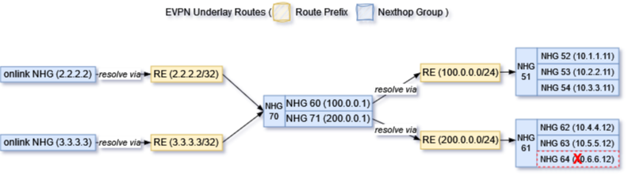
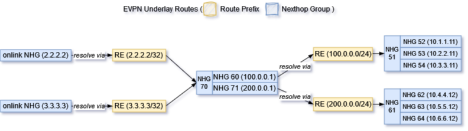
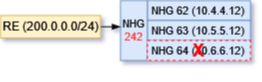
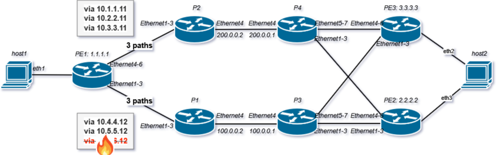

<!-- omit in toc -->
# Recursive Route Handling HLD
<!-- omit in toc -->
## Revision
| Rev |     Date    |       Author           | Change Description                |
|:---:|:-----------:|:----------------------:|-----------------------------------|
| 0.1 | Oct    2023 |  Yu Han / Yongxin Cao  | Initial Draft                     |

<!-- omit in toc -->
## Table of Content
- [Objective](#objective)
- [Requirements Overview](#requirements-overview)
- [Zebra Current Approach for Recursive Routes](#zebra-current-approach-for-recursive-routes)
  - [Data Structure for Recursive Handling](#data-structure-for-recursive-handling)
    - [Nexthop Hash Entry's Dependency Tree](#nexthop-hash-entrys-dependency-tree)
    - [NHT List from Route Entry](#nht-list-from-route-entry)
  - [Exiting Recursive Route Handling](#exiting-recursive-route-handling)
- [High Level Design](#high-level-design)
  - [Triggers Events for Recursive Handling](#triggers-events-for-recursive-handling)
  - [Nexthop Fixup Handling](#nexthop-fixup-handling)
    - [NHG ID](#nhg-id)
    - [zebra\_rnh\_fixup\_depends()](#zebra_rnh_fixup_depends)
    - [Step by step illustrations](#step-by-step-illustrations)
    - [Throttle protocol client's route update events](#throttle-protocol-clients-route-update-events)
  - [FPM and Orchagent Changes](#fpm-and-orchagent-changes)
- [Unit Test](#unit-test)
  - [Normal Case's Forwarding Chain Information](#normal-cases-forwarding-chain-information)
  - [Test Case 1: local link failure](#test-case-1-local-link-failure)
  - [Test Case 2: IGP remote link/node failure](#test-case-2-igp-remote-linknode-failure)
  - [Test Case 3: IGP remote PE failure](#test-case-3-igp-remote-pe-failure)
  - [Test Case 4: BGP remote PE node failure](#test-case-4-bgp-remote-pe-node-failure)
  - [Test Case 5: Remote PE-CE link failure](#test-case-5-remote-pe-ce-link-failure)
- [References](#references)

## Objective
The objective of this document is to minimize packet loss windows on SONiC devices during network outages. Since SONiC doesn't have MPLS VPN support in master, the testing focus would be on EVPN and SRv6 VPN only. 

## Requirements Overview
Due to the Linux kernel lacks support for recursive routes, FRR Zebra flattens the nexthop information when transferring recursive nexthop group information to dataplanes. Presently, when a path becomes unavailable, Zebra notifies corresponding protocol processes, allowing them to reissue route update events, which in turn update the forwarding chain of routes in the dataplane. This method contributes to the issue under discussion within the SONiC Routing Working Group.

<figure align=center>
    
    <figcaption>Figure 1. Alibaba issue Underlay routes flap affecting Overlay SRv6 routes <figcaption>
</figure>

To solve this issue, we need to introduce Prefix Independent Convergence (PIC) to FRR/SONiC. PIC concept is described in IEFT https://datatracker.ietf.org/doc/draft-ietf-rtgwg-bgp-pic/. It is not a BGP feature, but a RIB/FIB feature on the device. PIC has two basic concepts, PIC core and PIC edge. We use the following two HLD for achieving PIC supports in FRR/SONiC.

1. The following HLD focuses on PIC edge's enhancement https://github.com/eddieruan-alibaba/SONiC/blob/eruan-pic/doc/pic/bgp_pic_edge.md. 
2. This HLD outlines an approach which could minimize packet loss windows on SONiC devices during network outages, a.k.a PIC core approach for the recursive VPN route supports.

## Zebra Current Approach for Recursive Routes
### Data Structure for Recursive Handling
#### Nexthop Hash Entry's Dependency Tree
nhg_hash_entry uses the following two fields  *nhg_depends, *nhg_dependents to track NHG's dependencies. The usage is explained in the comments below. We plan to use nhg_dependents to perform needed backwalks. 

``` c
/*
 * Hashtables containing nhg entries is in `zebra_router`.
 */
struct nhg_hash_entry {
	uint32_t id;
	afi_t afi;
	vrf_id_t vrf_id;

    ...

	/* Dependency trees for other entries.
	 * For instance a group with two
	 * nexthops will have two dependencies
	 * pointing to those nhg_hash_entries.
	 *
	 * Using a rb tree here to make lookups
	 * faster with ID's.
	 *
	 * nhg_depends the RB tree of entries that this
	 * group contains.
	 *
	 * nhg_dependents the RB tree of entries that
	 * this group is being used by
	 *
	 * NHG id 3 with nexthops id 1/2
	 * nhg(3)->nhg_depends has 1 and 2 in the tree
	 * nhg(3)->nhg_dependents is empty
	 *
	 * nhg(1)->nhg_depends is empty
	 * nhg(1)->nhg_dependents is 3 in the tree
	 *
	 * nhg(2)->nhg_depends is empty
	 * nhg(2)->nhg_dependents is 3 in the tree
	 */
	struct nhg_connected_tree_head nhg_depends, nhg_dependents;

	struct event *timer;
```

#### NHT List from Route Entry
Each route entry (struct rib_dest_t) contains an nht field, which stores all nexthop addresses that get resolved via this route entry.

``` c
	/*
	 * The list of nht prefixes that have ended up
	 * depending on this route node.
	 * After route processing is returned from
	 * the data plane we will run evaluate_rnh
	 * on these prefixes.
	 */
	struct rnh_list_head nht;
```

Each rnh entry maintains a list of protocol clients in struct list *client_list, who are interested in this nexthop's state change events. zebra_rnh_notify_protocol_clients() uses this list to inform nexthop change events to registered clients.

``` c
/* Nexthop structure. */
struct rnh {
	uint8_t flags;

#define ZEBRA_NHT_CONNECTED 0x1
#define ZEBRA_NHT_DELETED 0x2
#define ZEBRA_NHT_RESOLVE_VIA_DEFAULT 0x4

    ...

	struct route_entry *state;
	struct prefix resolved_route;
	struct list *client_list;
```


### Exiting Recursive Route Handling
The following diagram provides a brief description of Zebra's current recursive convergence process.

<figure align=center>
    
    <figcaption>Figure 2. route convergence process<figcaption>
</figure>

The handling of recursive routes occurs within the process of managing route updates. The function zebra_rib_evaluate_rn_nexthops() serves as the starting point for this process. Zebra begins by retrieving the NHT list from the targeted route entry. Subsequently, it iterates through each nexthop in the NHT list and calls zebra_evaluate_rnh() to assess the reachability of the nexthop. If the state of the nexthop changes, Zebra utilizes zebra_rnh_notify_protocol_clients() to notify all clients to reissue corresponding routes to Zebra. This results in a period of traffic loss until the routes are rebound with updated Next Hop Groups (NHGs). The duration of the traffic loss window increases proportionally with the number of routes.

## High Level Design

### Triggers Events for Recursive Handling
Here are a list of trigger events which we want to take care via recursive route handling. The goals are to minimize traffic loss window for these cases.

| Trigger Types |     Events    |       Possible handling          | 
|:---|:-----------|:----------------------|
| Case 1: IGP local failure | A local link goes down | Currently Orchagent handles local link down event and triggers a quick fixup which removes the failed path in HW ECMP. Zebra will be triggered from connected_down() handling. BGP may be informed to install a backup path if needed. This is a special PIC core case, a.k.a PIC local |
| Case 2: IGP remote link/node failture  | A remote link goes down, IGP leaf's reachability is not changed, only IGP paths are updated. | IGP gets route withdraw events from IGP peer. It would inform zebra with updated paths.THere are two possilbe triggers. One is that zebra would be triggered from zread_route_add() with updated path list. The other is that zebra would be informed via zread_route_del(). In the second case, the impacted nexthop could be able to resolve its corresponding RNH via a less specific prefix. It is the PIC core handling case. |
| Case 3: IGP remote PE failure  | A remote PE node is unreachable in IGP domain. | IGP triggers IGP leaf delete event. Zebra will be triggered via zread_route_del() and zebra can't resolve its corresponding BGP NH via less specific prefix. It is the PIC edge handling case |
| Case 4: BGP remote PE node failure  | BGP remote node down | It should be detected by IGP remote node down first before BGP reacts, a.k.a the same as the above step. This is the PIC edge handling case.|
| Case 5: Remote PE-CE link failure | This is remote PE's PIC local case.  | Remote PE will trigger PIC local handling for quick traffic fix up. Local PE will be updated after BGP gets informed. |

### Nexthop Fixup Handling
To streamline the discussion and ensure generality, we employ the following recursive routes as an illustration to demonstrate the workflow of the new fixup and its potential to reduce the traffic loss window.

    B>  2.2.2.2/32 [200/0] via 100.0.0.1 (recursive), weight 1, 00:11:50
      *                      via 10.1.0.16, Ethernet1, weight 1, 00:11:50
      *                      via 10.1.0.17, Ethernet1, weight 1, 00:11:50
      *                      via 10.1.0.18, Ethernet1, weight 1, 00:11:50
                           via 200.0.0.1 (recursive), weight 1, 00:11:50
      *                      via 10.1.0.26, Ethernet1, weight 1, 00:11:50
      *                      via 10.1.0.27, Ethernet1, weight 1, 00:11:50
      *                      via 10.1.0.28, Ethernet1, weight 1, 00:11:50
    B>* 100.0.0.0/24 [200/0] via 10.1.0.16, Ethernet1, weight 1, 00:11:57
      *                      via 10.1.0.17, Ethernet1, weight 1, 00:11:57
      *                      via 10.1.0.18, Ethernet1, weight 1, 00:11:57
    B>* 200.0.0.0/24 [200/0] via 10.1.0.26, Ethernet1, weight 1, 00:11:50
      *                      via 10.1.0.27, Ethernet1, weight 1, 00:11:50
      *                      via 10.1.0.28, Ethernet1, weight 1, 00:11:50

If one of the paths (path 10.1.0.28) for prefix 200.0.0.0/24 is removed, Zebra will actively update two routes during the recursive convergence handling, facilitated by the BGP client. One route update pertains to 200.0.0.0/24, while the other update concerns 2.2.2.2/32. In this scenario, route 200.0.0.0/24 experiences the removal of one path, while the reachability of route 2.2.2.2/32 remains unaffected. To minimize the traffic loss window, it's essential to promptly address the affected nexthops in the dataplane before zebra completes its route convergence process.

<figure align=center>
    
    <figcaption>Figure 3. The starting point for a path removal<figcaption>
</figure>

For achieving this quick fixup, we need the following changes. 
1. Change NHG ID hash method
2. Add a new function zebra_rnh_fixup_depends() to make a quick fixup on involved NHGs in dataplanes.
3. Throttle protocol client's route update events if needed

We will describe each change in detail in the following sections. 

#### NHG ID
When zebra generates a hash entry for the recursive Next Hop Group (NHG), it presently utilizes both the nexthop addresses and their resolved nexthop addresses, along with additional information. The hash key is via nexthop_group_hash() shown below. Consequently, if the underlying paths undergo modifications, the recursive NHG must obtain a new NHG ID due to alterations in its key. This change in NHG ID results in the need for all routes to rebind with the new NHG, even if the recursive nexthops remain unchanged.


``` c
uint32_t nexthop_group_hash(const struct nexthop_group *nhg)
{
    struct nexthop *nh;
    uint32_t key = 0;

    for (ALL_NEXTHOPS_PTR(nhg, nh))
        key = jhash_1word(nexthop_hash(nh), key);

    return key;
}
```

We want to extend the hash function below to all NHGs. This change allows us to reuse recursive NHG when the recursive nexthops are not changed. One benefit from this change is that protocol client could decides not to reissue all routes and recursive NHG could be reused. 

``` c
uint32_t nexthop_group_hash_no_recurse(const struct nexthop_group *nhg)
{
	struct nexthop *nh;
	uint32_t key = 0;

	/*
	 * We are not interested in hashing over any recursively
	 * resolved nexthops
	 */
	for (nh = nhg->nexthop; nh; nh = nh->next)
		key = jhash_1word(nexthop_hash(nh), key);

	return key;
}
```

#### zebra_rnh_fixup_depends()

This newly added function is inserted into the existing route convergence work flow, which enables zebra to make a quick fixup on involved nexthop groups before notifying the protocol client for route updates. This quick fixup is made based on current information available in zebra. The goal is to make some quick bandage fix when some path is known to be broken. Protocol clients may provide different paths later after routes are converged.

<figure align=center>
    
    <figcaption>Figure 5. zebra_rnh_fixup_depends()<figcaption>
</figure>

The function marked in blue serves the quick fixup purpose. It gets triggered before the protocol clients get notified for routes updating. zebra_rnh_fixup_depends() is called from zebra_rnh_eval_nexthop_entry() after zebra decides that rnh's state is changed. 

``` c
static void zebra_rnh_eval_nexthop_entry(struct zebra_vrf *zvrf, afi_t afi,
					 int force, struct route_node *nrn,
					 struct rnh *rnh,
					 struct route_node *prn,
					 struct route_entry *re)
{
    ...
    zebra_rnh_remove_from_routing_table(rnh);
    if (!prefix_same(&rnh->resolved_route, prn ? &prn->p : NULL)) {
        if (prn)
            prefix_copy(&rnh->resolved_route, &prn->p);
        else {
                int family = rnh->resolved_route.family;

                memset(&rnh->resolved_route, 0, sizeof(struct prefix));
                rnh->resolved_route.family = family;
        }

        copy_state(rnh, re, nrn);
        state_changed = 1;
    } else if (compare_state(re, rnh->state)) {
        copy_state(rnh, re, nrn);
        state_changed = 1;
    }
    zebra_rnh_store_in_routing_table(rnh);

    if (state_changed || force) {
        /* 
         * New added for dataplane quick fixup 
         */
        zebra_rnh_fixup_depends(rnh);

        zebra_rnh_notify_protocol_clients(zvrf, afi, nrn, rnh, prn,
                              rnh->state);
        zebra_rnh_process_pseudowires(zvrf->vrf->vrf_id, rnh);
    }
}
```
The main work flow for zebra_rnh_fixup_depends() is the following
1. Find the nexthop hash entry for this rnh
2. Walk through this nexthop hash entry's nhg_dependents list and update each NHG involved in dataplane

Note: this function would only walk one level up to NHG. The further level if any would be triggered via protocol clients' further route updates.

#### Step by step illustrations

Assuming the initial state of EVPN underlay routes is the following

<figure align=center>
    
    <figcaption>Figure 6. initial state of the routes<figcaption>
</figure>

After BGP learns 200.0.0.0/24's path 10.0.1.28 is withdrew, BGP would send a route update for 200.0.0.0/24 to zebra with two remaining paths. After zebra updates this route, it reaches the state shown in Figure 7.

<figure align=center>
    
    <figcaption>Figure 7. one path is removed for route 200.0.0.0/24<figcaption>
</figure>

Zebra updates the route with new NHG 90 which has two paths, zebra sends the route update to dataplanes. This is the current approach, which would recover all traffic via route 200.0.0.0/24.

<figure align=center>
    
    <figcaption>Figure 8<figcaption>
</figure>

Then zebra walks through nht list of the route entry 200.0.0.0/24 and handle each rnh in the list via zebra_rnh_eval_nexthop_entry().
<figure align=center>
    
    <figcaption>Figure 9<figcaption>
</figure>

zebra_rnh_fixup_depends() would be triggered by zebra_rnh_eval_nexthop_entry() if rnh's state is changed. This function would use 200.0.0.1 to find out its corresponding nhg_hash_entry (NHG 74 in this example). From NHG 74, we back walk to all its dependent NHGs via NHG 74's *nhg_dependents list. At each dependent NHG (NHG 73 in this example), zebra performs a quick fixup to dataplanes. In this example, since rnh is resolved via 200.0.0.0/24 which has been updated to NHG 90, NHG 73 would update dataplanes with five paths. This quick fixup would help to stop traffic loss via these dependent NHGs and be independent from the number of routes pointing to them. 

<figure align=center>
    
    <figcaption>Figure 10<figcaption>
</figure>

After zebra_rnh_fixup_depends() is done, Zebra continues its original processing，calling zebra_rnh_notify_protocol_clients() to inform BGP that 200.0.0.1 as nexthop is changed.
BGP triggers 2.2.2.2 and other routes updates which are via 200.0.0.1. During 2.2.2.2's Zebra route handling, zebra would walk 2.2.2.2's rnh list if it is not empty.

Notes: 
1. Although this illustrations are on IGP remote link/node failure case, the similar work flow could be applied to local link failure and remote PE failure case as well.
2. The same logic and work flow could be applied to add paths to NHG, a.k.a zebra_rnh_fixup_depends() is a generic logic.

#### Throttle protocol client's route update events
Zebra will always inform protocol clients that nexthop is changed. Protocol client could decide if it needs to throttle the corresponding routes update events if there is no changes in reachability and metrics. For SONiC, we will only consider BGP's handling. 

| Cases |     Handling    |       Comments       | 
|:---|:-----------|:----------------------|
| Nexthop and routes are in the same global table | BGP will always reissue routes download | It could trigger fixup handling if there are recursive layers further |
| Nexthop and routes are in the different table, and nexthops' reachabilities are changed. | BGP will always reissue routes download. | This is PIC edge case for updating VPN context properly. |
| Nexthop and routes are in the different table. Nexthops' reachabilities are not changed and there is no metric change as well. |  BGP will skip reissue routes download. | This is the PIC core case which we could throttle routes updating. |
| Other cases | BGP will always reissue routes download. | safe net |


### FPM and Orchagent Changes
THis approach relies on the following two changes for updating NHG in dataplane.
1. Fpm needs to add a new schema to take each member as nexthop group ID and update APP DB. (Rely on BRCM and NTT's changes)
2. Orchagent picks up event from APP DB and trigger nexthop group programming. Neighorch needs to handle this new schema without change too much on existing codes. (Rely on BRCM and NTT's changes)

## Unit Test
### Normal Case's Forwarding Chain Information
### Test Case 1: local link failure
<figure align=center>
    
    <figcaption>Figure 11.local link failure <figcaption>
</figure>

### Test Case 2: IGP remote link/node failure
<figure align=center>
    
    <figcaption>Figure 12. IGP remote link/node failure
 <figcaption>
</figure>

### Test Case 3: IGP remote PE failure
<figure align=center>
    
    <figcaption>Figure 13. IGP remote PE failure
 <figcaption>
</figure>

### Test Case 4: BGP remote PE node failure
<figure align=center>
    
    <figcaption>Figure 14. BGP remote PE node failure
 <figcaption>
</figure>

### Test Case 5: Remote PE-CE link failure
<figure align=center>
    
    <figcaption>Figure 15. Remote PE-CE link failure
 <figcaption>
</figure>

## References
- https://github.com/sonic-net/SONiC/pull/1425
- https://datatracker.ietf.org/doc/draft-ietf-rtgwg-bgp-pic/
- https://github.com/sonic-net/SONiC/blob/master/doc/pic/bgp_pic_arch_doc.md
- https://github.com/eddieruan-alibaba/SONiC/blob/eruan-pic/doc/bgp_pic/bgp_pic.md
