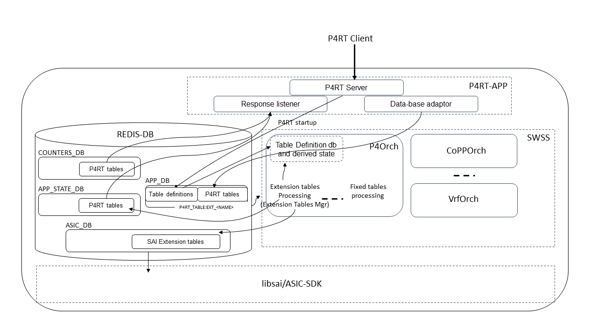

# PINS SONiC Control Plane for Generic SAI Extensions

## Table of Content
- [Introduction](#Itroduction)
- [Definitions](#Definitions)
- [Scope](#Scope)
- [Requirements](#Requirements)
- [Highlevel Design](#Highlevel-Design)
  - [P4RT-APP](#P4RT-APP)
  - [P4Orch](#P4Orch)
    - [Table Definition database](#Table-Definition-database)
    - [Demultiplexing SAI Extension entries](#Demultiplexing-SAI-Extension-entries)
    - [Extension Tables Manager](#Extension-Tables-Manager)
    - [Table processing precedence](#Table-processing-precedence)
    - [Cross Table dependencies](#Cross-Table-dependencies)
  - [Application Level Response](#Application-Level-Response)
  - [Counters and Meters](#Counters-and-Meters)
  - [CRM (Critical Resource Monitoring)](#CRM)
  - [Warm restart](#Warm-restart)
  - [Unit Test Automation](#Unit-Test-Automation)
- [Appendix](#Appendix)
  - [P4 Program for SAI Extensions and useful annotations](#P4-Program-annotations)
  - [Example](#Example)


## Revision
| Rev  |   Date    |                        Author                        | Change Description                 |
| :--: | :-------: | :--------------------------------------------------: | :--------------------------------: |
| 0.1  | 9/27/2022 | Intel - Shitanshu Shah, Reshma Sudarshan,            |  Initial Revision                  |
|      |           |         Brian O’Connor, Ravi Vantipalli, Sagar Balani|                                    |
|      |           | Google - Bhagat Janarthanan, Kishan, Runming Wu,     |                                    |
|      |           |          Robert Halstead, Kishore Gummadidala        |                                    |
| 0.2  | 9/29/2022 | Shitanshu Shah                                       |address review comments             |
| 0.3  |10/14/2022 | Shitanshu Shah                                       |terminology, Cross Table dep updates|
| 0.4  |11/14/2022 | Shitanshu Shah                                       |add section on unit-test automation |


## Introduction <a name="Introduction"></a>
P4 is a language for expressing how packets are processed by the data plane of a programmable network forwarding device. P4 programs specify how the various programmable blocks of a target architecture are programmed and connected. PINS (P4 Integrated Network Stack) is an architecture, described in the [PINS HLD](https://github.com/sonic-net/SONiC/blob/master/doc/pins/pins_hld.md), to implement a P4 program, in the SONiC framework, on top of the SAI pipeline. SAI pipeline is a well-documented forwarding behavior of a data-plane. In PINS architecture, a set of standard SAI capabilities are modeled in P4 and configurable behaviors, like ACLs, are defined using P4.

In this document, we describe how the modeling can be taken a step further, allowing P4 programs to model extensions to the SAI pipeline. Focus of this document is to design the SONiC control plane that implements the extensions specified in the user P4 and then translate them to the [SAI Extensions API](https://github.com/opencomputeproject/SAI/blob/master/doc/SAI_Proposal_Generic_Extensions.md) calls for implementation in HW.

Readers of this document are expected to have some familiarity with PINS Architecture and P4RT, P4Orch as designed today to support P4 over the SAI pipeline. Links to those documents are provided in the Reference section towards the end of this document.

## Definitions <a name="Definitions"></a>

SAI - Data-plane programming interface that defines forwarding behavior. Every functional block of SAI is explicitly defined with corresponding Objects and set of APIs to manipulate those objects

SAI Extension - Extension to SAI forwarding behavior achieved using API calls defined in (https://github.com/opencomputeproject/SAI/blob/master/doc/SAI_Proposal_Generic_Extensions.md)

PINS SAI path - refers to control plane flow via P4RT responsible for programming objects well defined in SAI pipeline

PINS SAI Extension path - refers to control plane flow via P4RT responsible for programming objects that extend the SAI pipeline

P4Info - Metadata that specifies the P4 entities which can be accessed via P4Runtime. The information is generated by a compiler from a P4 source program and communicated via the P4RT Client to the P4RT Server before any programming of P4 tables.

P4RT Client - A Software component that controls P4 target utilizing P4Runtime (P4RT) messages.

P4RT Server (P4RT-APP) - SONiC control plane component implements P4RT service acting as a server for P4RT messages from a P4RT Client.

P4RT Orchagent (P4Orch) - SONiC control plane component that translates P4RT table entries received from P4RT-APP (via APPL_DB) to SAI objects (in ASIC_DB).

Table Definition – It contains match/action fields and enough other details for P4Orch to derive the necessary state which is then referred to during table entries programming.


## Scope <a name="Scope"></a>
This document augments the PINS architecture for SAI pipeline extensions. The scope of this document is to zoom in with more details and enhance P4RT-APP and P4RT-Orchagent components of the SONiC framework. The document details the design of these components to generically support extensions to program forwarding tables leveraging SAI APIs and SAI Extension APIs.


## Requirements <a name="Requirements"></a>
The SAI Extension P4 program is expected to be extended based on a well-documented SAI P4 program.

The PINS SAI Extension path is expected to co-exist with the PINS SAI path. Existing PINS support of SAI P4 program should functionally continue to work as is.

In some cases, SAI Extension objects programmed via PINS SAI Extension path may have dependencies on other SAI objects. SAI Extension APIs require to pass OID of dependent object in such cases. The SONiC control plane is required to manage and maintain cache for the purpose of OID retrieval.

As highlighted earlier, the following components of the SONiC control-plane are targeted in this design document,
- P4RT-APP
- P4Orch
- A SAI Extension example P4 program will be implemented and supplied as a reference and for the test automation purpose.

## Highlevel Design <a name="Highlevel-Design"></a>
As described in the [PINS P4Orch HLD](https://github.com/Azure/SONiC/pull/825/files), P4RT-APP and P4Orch are two new components introduced in the SONiC control plane to support PINS. P4RT-APP interfaces to a P4RT Client, reads messages from a client and produces data in APPL_DB. P4Orch subscribes to APPL_DB tables produced by P4RT-APP, translates data received from APPL_DB to respective SAI attributes and after successful cross object dependency resolution calls appropriate SAI APIs.

The PINS SAI Extension path will continue to use the same control plane components with some enhancements to them. A few enhancements to note,
- Create a Table Definition database. P4Orch requires following state derived, from Table Definition database, before handling programming of any P4RT table entries. This data-base is to be created at initialization time.
  - Cross-table reference. When table-entry is received, this state helps in creating key and look-up in a dependent table to retrieve the OID of a dependent object if it exists.
  - Table processing precedence for draining APPL_DB entries received. From the batch of table-entries received from across P4RT tables, processing table entries in order of table precedence is important to avoid dependency validation failures. Table processing precedence is to be derived from a cross-table reference state.
  - Derive SAI attribute value type of each match/action fields
- Demux P4RT table entries from the APPL_DB to PINS SAI path vs PINS SAI Extension path
- A new manager (Extension Tables Manager) in P4Orch to handle extension table entries received from APPL_DB
- Dynamic initialization of table precedence for processing APPL_DB entries
- P4Orch to manage cross object dependencies from SAI Extension objects to SAI objects
- P4Orch to translate counters/meters, as specified by P4, to counter/meter objects conforming to SAI API calls



### P4RT-APP <a name="P4RT-APP"></a>
P4RT-APP runs in a separate container in SONiC and is a front-end component of SONiC interfacing with a P4RT client. It is responsible for reading table-entries received from the P4RT client and translating them to P4RT table schema in APPL_DB. P4RT-APP translates table-entries based on the P4Info pushed during forwarding pipeline initialization call by the P4RT client.

P4RT-APP is already designed to handle P4 elements in a generic manner irrespective of whether those elements represent the SAI pipeline or elements representing SAI Extensions. No additional changes are required in translation logic.

As highlighted earlier, one of the design goals is to create a Table Definition database in the P4Orch at the initialization time. This Table Definition database helps P4Orch to generically support programming of extension table entries. In PINS architecture, P4RT-APP can assist P4Orch to create such a database by supplying Table Definitions. P4RT-APP receives table definitions via means of p4info protobuf message from P4RT Client. Same schema can be used to convey table definitions from P4RT-APP to P4Orch, but the schema would be in json format instead of protobuf format. P4RT-APP, upon successful completion of the call to SetForwardingPipelineConfig(), would translate received p4info from protobuf format to json format and publish them to APPL_DB. [Note, currently there is a P4 Startup working group in progress to design persistence of forwarding pipeline configuration on the switch. In conclusion of that design, the trigger of pushing Table Definitions may move to a different point].

The APPL_DB table-name to carry table definitions - P4RT_TABLE_DEFINITION_SET. (Note that it is created only during  initialization time).
```text
; APPL_DB
P4RT_TABLE_DEFINITION_SET:{{context}}
“info”: {{ascii string value in json format}}
```

The naming convention for all the P4RT tables, responsible for carrying programming entries, remains the same as before, that is **P4RT_TABLE:<TableType><TableName>**, where TableType is **EXT** for all extension tables (as oppose to **FIXED** for currently supported tables).

### P4Orch <a name="P4Orch"></a>
The P4 Orchagent reads P4RT table entries from APPL_DB, parses, validates and resolves them and then creates necessary SAI objects in ASIC_DB. There are several enhancements to this P4Orch to support the PINS SAI Extension path.

#### Table Definition database <a name="Table-Definition-database"></a>
This is a database created at the initialization time, extension table entries programming during run-time refers to this data-base. Before processing any extension table entries, P4Orch must have created this database with necessary states like cross table reference, table precedence order for processing APPL_DB entries, mapping each match field and action parameters with associated SAI attribute data types. In PINS architecture, this state is created by processing table definitions supplied by P4RT-APP. P4Orch must have received the **P4RT_TABLE_DEFINITION_SET** entry before P4Orch can process any extension table-entries from APPL_DB. Until this database and necessary state is created, P4Orch should not process any extension table-entries from APPL_DB.

```text
struct ActionParamInfo
{
    std::string     name;
    std::string     fieldtype;
    std::string     datatype;
    std::map<std::string, std::string>  table_reference_map;
};

struct TableActionInfo
{
    std::string     name;
    std::map<std::string, ActionParamInfo> params;
};

struct TableMatchInfo
{
    std::string        name;
    std::string        fieldtype;
    std::string        datatype;
    std::map<std::string, std::string>  table_reference_map;
};

struct TableInfo
{
    std::string                            name;
    std::map<std::string, TableMatchInfo>  match_fields;
    std::map<std::string, TableActionInfo> action_fields;
    std::vector<std::string>               action_referenced_tables;
};

typedef std::map<std::string, TableInfo>   TableInfoMap;
```

#### Demultiplexing PINS SAI Extension entries <a name="Demultiplexing-PINS-SAI-Extension-entries"></a>
For PINS SAI path related tables, P4RT-APP publishes entries in a table in APPL_DB with prefix P4RT_TABLE:FIXED_<TableName> (with an exception for ACL table definition). With added support for tables related to PINS SAI Extension path, entries will be published in a table in APPL_DB with prefix **P4RT_TABLE:EXT_<TableName>**.

Table prefix for PINS SAI Path tables is **P4RT_TABLE:FIXED_<TableName>**
Table prefix for PINS SAI Extension tables would be **P4RT_TABLE:EXT_<TableName>**

Current P4Orch implementation of PINS SAI path maintains mapping from FIXED P4RT table name to the manager responsible for processing respective table entries to relevant SAI Objects. With added support of the PINS SAI Extension tables, control flow for FIXED P4RT tables remains as before, where-as EXT P4RT table entries will be directed to the newly introduced Extension Tables Manager.

#### Extension Tables Manager <a name="Extension-Tables-Manager"></a>
To handle different P4RT tables, the P4Orch is composed of multiple managers. Each P4Orch manager is responsible for handling table entries of a specific table. Examples are router_interface_manager, neighbor_manager, nexthop_manager and so forth. To this set of managers, a new manager will be added to handle all the extension P4RT tables. This new manager will handle all the extension tables. This manager is responsible for draining and processing extension table entries from APPL_DB and manipulating the respective SAI Extension Objects. The Extension Tables Manager would maintain each table’s related state in a segregated manner, and thus should be able to walk and lookup all the entries for a specific given extension table.

On receiving P4RT table entries from APPL_DB, P4Orch reads each table entry and performs the following tasks,
- Demux table entry to PINS SAI vs SAI Extension path
  Demuxed extension table entries are enqueued to the Extension Tables Manager

- For table entries enqueued to Extension Tables Manager
  - Retrieve each match field and action params associated values
  - For each retrieved field and parameter, check if any of them needs to be cross-referred to an entry in another table for cross-dependent OID retrieval. Update reference count of dependent objects based on CRUD operation
  - If field is a counter/meter directive, create respective SAI counter/meter object if one does not exist, or remove SAI counter/meter object in case of delete event
  - Prepare SAI Extension API parameters and call appropriate SAI Extension API


#### Table processing precedence <a name="Table-processing-precedence"></a>
SAI.P4 has well-defined ordering of functional blocks in the SAI pipeline. For the SAI pipeline relevant P4RT tables, P4Orch currently has a predefined order of processing APPL_DB entries belonging to those tables. This pre-defined table precedence helps avoid out-of-order processing of cross-dependent entries from a given batch. The same behavior of processing cross-dependent entries in a specific order of table precedence is necessary for entries across all extension tables, and even across tables related to PINS SAI path and PINS SAI Extension path.

For in-order processing of table entries across cross-dependent tables, a specific processing order of tables can be decided at the initialization time when the Table Definition database is built. After preparing a cross-reference state across all actions from all tables, a dependency graph can be built that can decide the processing order of tables. Note that this dependency graph is built once at the initialization time. At the time of draining table entries that are received from APPL_DB, P4Orch drains entries from tables in their precedence determined by pre-built dependency graph.

The Extension Tables Manager in the P4Orch, which caters to serving extension tables, maintains drained table entries separately per table. Each of these tables are tagged with an algorithmically determined precedence value based on dependency graph. At the time of draining table entries from APPL_DB, The Extension Tables Manager may be called multiple times, each time with a different precedence value and so allowing the Extension Tables Manager process table entries only from those tables matching the precedence value.

#### Cross Table dependencies <a name="Cross-Table-dependencies"></a>
Once the Table Definition database is built, the state created for each table would have cross-reference definitions. For any extension table entry received from APPL_DB, if any of the entry fields is defined to have a cross-reference, SAI Object OID of the dependent entry needs to be retrieved and passed as a field value in the SAI API call. It is considered validation failure if dependent SAI Object OID cannot be retrieved, in which case current extension table entry does not get programmed and retried again later for dependent OID retrieval.

There are two main distinctive operations performed for cross-dependent object retrieval. First is to form a pair of object-type/key value of a dependent object and then perform a look-up in the relevant cache, using object-type/key value pair, for OID retrieval.

P4Orch today has p4oidmapper frame-work in place, where p4oidmapper maintains data-base of object-type/key value mapping to OID and reference counts to that OID. For use-cases, where P4RT extension table entries have dependencies only on SAI Objects created by other P4RT table entries, p4oidmapper is the cache that needs to be queried for retrieval of dependent OID. To perform first step of forming object-type/key value pair, a respective P4Orch manager would be queried with relevant extension entry's field parameters. A new function vector getSaiObject is introduced in the ObjectManagerInterface class for this purpose. For an entry received by the Extension Tables Manager, where any of its field is dependent on a table that is implemented by one of the table managers in P4Orch, Extension Tables Manager composes field parameters which is then passed to getSaiObject() call implemented by the respective manager to get respective object-type/key value pair. The next step of OID retrieval leveraging p4oidmapper then remains same as is implemented today.

```text
    gP4Orch->m_p4TableToManagerMap[table_name]->getSaiObject(field_params, &object_type, &object_key);
    m_p4OidMapper->getOID(object_type, object_key, &oid);
```


Following diagram shows some of the orchs that maintain OID mappings and how OID value of dependent object is retrieved and passed as a field value in SAI API calls.


For use-cases, where P4RT extension table entries may also have dependency on SAI Objects created by SONiC control path outside of PINS control path, two main differences to note. First, in the table definition, cross-reference definition needs to be to a sai_object/sai_fields tuple, instead of a table/field names tuple (Please look at refers_to() annotation for more details in the Appendix example). Second, for dependent object's OID retrieval, dependent object's cache owner needs to be queried. These cache owners span beyond p4oidmapper. Ideally there should be one object owner in the orchagent for a given object-type. However, today in orchagent, multiple orchs may maintain key<->OID mapping cache for the same object-type. Each orch in this case maintains cache only for the objects created by that orch. For such a object type, during cross-dependency resolution, each of the cache owners need to be queried to check existence of a specific object unless all distributed cache consolidated under a single owner. Implementation supporting this use-case to be considered in subsequent phase.


### Application Level Response <a name="Application-Level-Response"></a>
The Extension Tables Manager will produce the status of each table entry programming in the same manner as is done today for other tables. There is no other change required in the rest of the system. Application level responses are expected to work in the same manner for extension tables as well.


### Counters and Meters <a name="Counter-and-Meters"></a>
There are no changes required in P4RT-APP to support counters and meters for extension tables. In P4Orch, for any table-entry received from APPL_DB, with a counter/meter directive, a respective meter/counter object gets created/removed according to CRUD operations. Those extension tables that receive table entries with a counter/meter directive, are tagged with counter/meter capability in the Extension Tables Manager.

Statistics collection for counters, from P4Orch, is periodic. At every timer interval, The Extension Tables Manager walks through those extension tables, that are tagged with counter/meter capability, and packs counter/meter stats to be produced in COUNTERS-DB, in the same way as it is done today for SAI pipeline tables in P4Orch.


### CRM (Critical Resource Monitoring) <a name="CRM"></a>
Availability count of entries of a programmable object (in reference to the P4RT table), can be queried using the same existing SAI API – sai_object_type_get_availability()


### Warm restart <a name="Warm-restart"></a>
To support warm restart, P4Orch is required to read the P4RT_TABLE_DEFINITION_SET table from APPL_DB first followed by all other P4RT_TABLEs in determined precedence order. Rest of the design remains the same as is supported today. With restart of P4RT-APP, it is expected that the P4RT client will read current table entries from the device and reconcile state to push necessary updates/deletes.


## Unit Test Automation <a name="Unit-Test-Automation"></a>
P4Orch pytest automation test-cases
- Add P4RT_TABLE:TABLES_DEFINITION_TABLE in APP-DB for an extension table
  - Reference extension table used is “vipv4_table” with match-key as ipv4 destination address and action as set-nexthop-id
  - set-nexthop-id refers to a nexthop created by NEXTHOP P4RT_TABLE
  - Validate that definitions table successfully got added in the APP-DB
- Create nexthop entry “n1” in P4RT_TABLE: FIXED_NEXTHOP_TABLE, with all dependent table entries also created (like in router-interface table)
  - Validate nexthop entry “n1” is created successfully for the fixed table in APP-DB, as well new oid for it created in ASIC-DB
- Create an entry in “vipv4_table” with an action set to nexthop entry “n1”
  - Validate table entry is successfully created in APP-DB for EXT table for vipv4_table
  - Validate that entry’s cross-reference to nexthop object for “n1” is successfully resolved and SAI API call for GENERIC_PRGRAMMABLE is successful
  - Validate a new oid got created in ASIC-DB for GENERIC_PROGRAMMABLE object
  - Validate a respective entry got created in APP-STATE-DB for the same extension table with the same key
- Create another nexthop entry “n2” in P4RT_TABLE: FIXED_NEXTHOP_TABLE, with all dependent table entries also created (like in router-interface table)
  - Validate nexthop entry “n2” is created successfully for the fixed table in APP-DB, as well new oid for it created in ASIC-DB
- Update earlier “vipv4_table” entry’s action set to this new nexthop entry “n2”
  - Validate no failure in cross-reference resolution of vipv4_table entry to nexthop object “n2”
  - If Generic SAI Extension API call was successful and ASIC-DB is updated successfully, in next step nexthop entry “n1” would be allowed to be deleted
- Delete nexthop entry “n1” from P4RT_TABLE: FIXED_NEXTHOP_TABLE
  - Validate entry is successfully deleted from APP-DB and ASIC-DB
- Delete earlier “vipv4_table” entry from APP-DB
  - Validate entry is successfully removed from APP-DB, ASIC-DB and APP-STATE-DB
- Try to create “vipv4_table” entry action set to non-existent nexthop “n3”
  - Validate entry creation fails due to failure in cross-reference resolution to non-existent nexthop object for “n3”
  - As a result, there should not be any new oid created for GENERIC_PROGRAMMABLE object in ASIC-DB


## Appendix <a name="Appendix"></a>

### P4 Program for SAI Extensions and useful annotations <a name="P4-Program-annotations"></a>
A typical P4 program for SAI Extension is an increment of some form of a modeled P4 program over the SAI pipeline. Such a P4 program may have additional tables described in a P4 pipeline, modeled based on SAI Extensions documented for a target data-plane. P4 primitives used for extension tables are expected in the same manner as they are used for the SAI P4 program. The only thing that differs is how annotations are used as special purpose directives for the SONiC control plane. Following are annotations of interest with descriptions on why they are required and how to use them.

- @refers_to(), to indicate dependency of a field’s value on existence of an entry in another table

  Meaning and purpose of match/action fields of any extension P4 tables are opaque to the SONiC control-plane. @refers_to() annotation acts as a directive for cross-table dependency while still keeping SONiC control-plane opaque to the actual meaning and purpose of each field.

```text
Example –
In following example, @refers_to() annotation specified in action id 3456, and use of that action in table “table_extension2” suggests that an entry programmed in table “table_extension2” with action id of 3456, has dependency on existence of a SAI object for entry in table “table_extension1” and look-up key to query dependent object's OID is a composite key with <match_e11:<value of param id 1>, match_e22:<value of param id 2>>
tables {
    preamble {
        id: 2345
                    name: "table_extension1"
    }
    match_fields {
        id: 1
	name: "match_e11"
	match_type: EXACT
	type_name: {
    	    name: "...."
	}
                    }
        match_fields {
	id: 2
	name: "match_e12"
	match_type: EXACT
	type_name: {
    	name: "...."
                    }
    }
    ....
    ....
    ....
}
tables {
    preamble {
        id: 2345
        name: "table_extension2"
    }
    match_fields {
        id: 1
        name: "match_e21"
        match_type: EXACT
        type_name: {
            name: "...."
        }
    }
    match_fields {
        id: 2
        name: "match_e22"
        match_type: EXACT
        type_name: {
            name: "...."
        }
    }
    ....
    ....
    action_refs {
        id: 3456
    }
}
actions {
    preamble {
         id: 3456
         name: "action_1"
    }
    params {
        id: 1
        name: "action_11"
        annotations: "@refers_to(table_extension1, match_e11)"
        type_name: {
            name: "...."
        }
    }
    params {
        id: 2
        name: "action_12"
        annotations: "@refers_to(table_extension1, match_e12)"
        type_name: {
            name: "...."
        }
    }
}
```

The example shown above is for a cross-reference directive in the form of prescribing dependency with table/field names. If dependency from SAI Extension field param is to be specified in the form of SAI Object/field names, the syntax would look like as shown below. This type of dependency definition is to be supported in subsequent phase.
params {
  id : <>
  name: "action"
  annotations: "@refers_to(@sai_object(SAI_OBJECT_TYPE_X), @sai_field(SAI_ATTR_X))"
}


- @format(), to indicate special format of the data-type of a field

  Certain fields carry a special meaning of a value. For example, while an IPv4 address value is of datatype of 32-bits width, user readability of that value makes more sense when it’s in the format of a dot notation IP address. IPv6 address, MAC address etc also fall in the same category. Readability of these fields is extremely useful when populated in SONiC DBs. For the SONiC control-plane to format these values appropriately, it is necessary for P4 programmers to use @format() annotation for such fields.


### Example <a name="Example"></a>


#### P4 Definition
[In protobuf format. The information is partial, not all elements are shown, enough for example illustration purposes.]

```text
tables {
  preamble {
    id: 1234
    name: "ingress.routing.vipv4_table"
  }
  match_fields {
    id: 2
    name: "ipv4_dst"
    bitwidth: 32
    match_type: EXACT
  }
  action_refs {
    id: 3456
  }
}

tables {
  preamble {
    id: 2345
    name: "ingress.routing.nexthop_table"
  }
  match_fields {
    id: 1
    name: "nexthop_id"
    match_type: EXACT
    type_name: {
      name: "nexthop_id_t"
    }    
  }
  ....
  ....
  ....
}

actions {
  preamble {
    id: 3456
    name: "ingress.routing.set_nexthop_id"
  }
  params {
    id: 1
    name: "nexthop_id"
    annotations: "@refers_to(ingress.routing.nexthop_table, nexthop_id)"    
    type_name: {
      name: "nexthop_id_t"
    }
  }
}
```

#### Table-entry from P4 Client
```text
updates {
  type: INSERT
  table_entry {
    ingress.routing.vipv4_table {
      match { ipv4_dst { value: "10.0.0.1" } }
      action { ingress.routing.set_nexthop_id { nexthop_id: "11" } }
    }
  }
}
```

#### Table-entry in APPL_DB
```text
>hgetall "P4RT_TABLE:EXT_VIPV4_TABLE:{\”match/ipv4_dst\”:\”10.0.0.1\"}”
“action”
“set_nexthop_id”
“param/nexthop_id”
“11”
```

#### SAI Extension API calls from P4Orch
```text
[An example logical code for illustration purpose, not an actual implementation]
vector<sai_attribute_t> attrs;
sai_attribute_t attr;
nlohmann::json sai_metadata_json;
nlohmann::json sai_values_json;
sai_object_id_t nexthop_oid;

sai_metadata_json["ipv4_dst"]["data_type"]  = SAI_ATTR_VALUE_TYPE_IPV4;
sai_values_json["ipv4_dst"]["value"] = "10.0.0.1";
sai_values_json["ipv4_dst"]["metadata"] = sai_metadata_json["ipv4_dst"].dump();

if (TableInfoMap.contains("vipv4_table")) {
  tableinfo = TableInfoMap.find("vipv4_table")->second;
  if (tableinfo.referee_table.contains("set_nexthop_id")) {
    sai_object_id_t object_type;
    std::string object_key;

    gP4Orch->m_p4TableToManagerMap[table_name]->getSaiObject(field_params_object, &object_type, &object_key);
    m_p4OidMapper->getOID(object_type, object_key, &nexthop_oid);
  }
}

sai_metadata_json["set_nexthop_id"]["data_type"]  = SAI_ATTR_VALUE_TYPE_OBJECT_ID;
sai_values_json["set_nexthop_id"][“value”] = nexthop_oid;
sai_values_json["set_nexthop_id"][“metadata”] = sai_metadata_json["set_nexthop_id"].dump();


attr.id = SAI_GENERIC_PROGRAMMABLE_ATTR_OBJECT_NAME;
attr.value = "vipv4_table";
attrs.push_back(attr);

attr.id = SAI_GENERIC_PROGRAMMABLE_ATTR_ENTRY;
attr.value = sai_values_json.dump();
attrs.push_back(attr);

sai_generic_programmable_api->create_generic_programmable(&sai_generic_oid, gSwitchId, attrs.size, attrs.data);
```

## References
[PINS HLD](https://github.com/sonic-net/SONiC/blob/master/doc/pins/pins_hld.md#supplementary-documents)

[P4RT Application HLD](https://github.com/sonic-net/SONiC/blob/master/doc/pins/p4rt_app_hld.md)

[PINS P4Orch HLD](https://github.com/Azure/SONiC/pull/825/files)

[SAI Generic Programmable Extensions](https://github.com/opencomputeproject/SAI/pull/1551)
