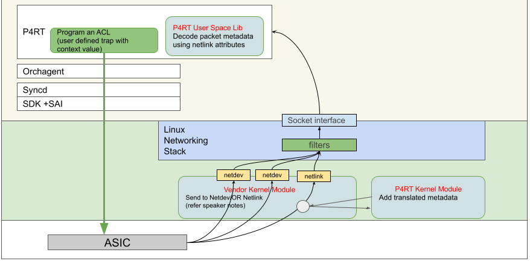

# **PacketIO**

_Rev v0.1_


## 
**Table of Content**


[TOC]


## Revision

Rev  | RevDate    | Author(s)   | Change Description
---- | ---------- | ----------- | ------------------
v0.1 | 06/23/2021 | Google, ONF | Initial Version
v0.2 | 03/31/2022 | Google, ONF | Extract Library


## Scope

This document covers the high level design aspects of Packet I/O in SONiC for both the P4Runtime application and any subsequent application that would benefit from packet exchange using Generic Netlink Sockets. 


## Overview

SONiC supports Packet I/O on Linux netdev interfaces but this does not meet some unique requirements of P4Runtime application. This document details the requirements and captures the design changes necessary to meet the new requirements. This document also explains the extraction of a library from the P4Runtime application in order to make the functionality available to other applications as required. In addition to the new library this document will explain a new application which serves as a model for using the library and allows for TCPDump like sniffing capability and packet generation using Generic Netlink Sockets.


**Requirements**


**Receive**


On the receive side, the controller needs to receive the CPU punted packets with the basic metadata information about the packet. Receive packets arrive on any of the configured L2, L3, LAG or VLAN interfaces created by the controller. Below are the specific requirements for the receive packets,


1. The SDN controller (via P4Runtime) installs its own punt flows and expects to receive ONLY those CPU punted packets. The controller is not interested in the punted flow packets of other local applications running on SONiC like LACP, LLDP etc. The controller for example, installs its own punt flows for ARP, LLDP, traceroute etc and such packets have to arrive exclusively on a separate channel.


2. On the received packets, the controller needs the input port and target egress port (path the packet would have forwarded by the switch pipeline) as part of the receive metadata information. Input port is a required standard field but certain applications on the controller like traceroute will also need the target egress port.


**Transmit**


There are 2 requirements on the transmit side,


1. Controller needs to be able to send packets out on any of the configured ports, this is generally called the directed transmit.  


2. The controller also needs a capability to leverage the ASIC’s forwarding pipeline instead of self determining which port the packet should be sent out. So, a new transmit mode called the ‘submit_to_ingress’ (aka ‘send_to_ingress’) is needed to transmit packets on the ingress pipeline to let the ASIC’s forwarding pipeline select the egress port.


## Architecture Design


## Receive path design 

In SONiC, netdev ports receive all punted packets by default and the packets have only the input port information in the metadata. However, P4Runtime is interested in only the punted packets for the traps it installs and needs additional metadata for those punted packets. P4Runtime uses user-defined traps and a generic netlink model as a solution to meet both of the above requirements. sFlow in SONiC also uses a generic netlink model to receive packet samples generated by the ASIC with metadata information like source port, destination port, packet size, sampling rate etc. 

Receive solution leverages on the existing SAI attributes (`SAI_HOSTIF_TYPE_GENETLINK` and `SAI_HOSTIF_ATTR_GENETLINK_MCGRP_NAME`) to create a host interface that is of the generic netlink type rather than the netdev type. The host interface table is then programmed to map a user defined trap (created for P4Runtime) to a special genetlink host interface so that packets matching that trap can be dispatched using this special host interface. 




Once the user defined traps and genetlink host interfaces are created, incoming punted packets matching the specific flow (with user defined trap) will carry a special tag in their packet header that identifies them as belonging to the special user defined trap. The kernel driver that processes the incoming DMA receive packets will distinguish them based on this tag in the packet header and redirect them to either the genetlink interface or the regular netdev interfaces.

CoppOrch will process the [new trap group per cpu queue](https://github.com/pins/sonic-buildimage/blob/pins/202012_20210206/files/image_config/copp/copp_cfg.j2#L67-L106) and create the required host interfaces, user-defined traps, etc. It will use a specific user-defined trap for each ACL entry that P4Runtime installs based on the specific CPU QoS queue the punted packets should take for that ACL.


## Vendor changes for Receive path 

Receive path changes come into picture when the packet is received by the host CPU (kernel DMA or via pcie path) and the packet has to be pre-processed before being sent out to the application. The pre-processing involves parsing the metadata information (vendor specific - steps 1 & 2) and sending the packet (along with the attributes) out via the generic netlink interface in a common manner (step 3). The 3 parts in the solution are:


**1. Determine packet path**

The vendor code needs to distinguish the packets that need to be sent via `netdev` vs `generic netlink` interface. This is left to vendor choice of implementation but typically involves maintaining a map of an unique packet identifier to dispatch method in the receive code. Incoming packet’s metadata field value is looked up in the table and the packet is dispatched via the corresponding method. 

The vendor specific work involved here are,


* Adding the additional block of code in the receive path to handle the new dispatch method for P4Runtime. For example, the below if statement captures a sample code to call the generic netlink packet send function for packets matching the genl_packet key.  

```
+ #define GENL_PACKET_NAME "genl_packet"
static int
knet_filter_cb(uint8_t * pkt, int size, int dev_no, void *meta,
                    int chan, kcom_filter_t *kf)
{
   /* check for filter callback handler */
   #ifdef PSAMPLE_SUPPORT
   if (strncmp(kf->desc, PSAMPLE_CB_NAME, KCOM_FILTER_DESC_MAX) == 0) {
       return psample_filter_cb (pkt, size, dev_no, meta, chan, kf);
   }
   #endif
+   if (strncmp(kf->desc, GENL_PACKET_NAME, KCOM_FILTER_DESC_MAX) == 0) {
+       return generic_filter_cb (pkt, size, dev_no, meta, chan, kf);
+   }
   return strip_tag_filter_cb (pkt, size, dev_no, meta, chan, kf);
}
```


**2. Extract and convert packet metadata** 

Pull out the packet metadata information from the header and convert it from a vendor specific format (like unit, port number) to a generic format (like ifindex) that is understandable by the application. We leave it to the vendors on how this conversion is done but they should be able to leverage a large part of this code from their Sflow implementation.


**3. Send packet on generic netlink interface**

The final step is to pack all the necessary packet attributes like ingress, egress ifindex number etc in a generic netlink format and send it on the generic netlink multicast socket (to be consumed by the application). 

We have a submodule that can accomplish this task in a vendor-independent way . 

The change required for P4Runtime integration is,


* Get all the packet metadata information in the generic format (from step 2) and invoke the generic netlink send function. The send function arguments will be able to accommodate all the different packet attributes supported and fit a variable argument list so that vendors can call it as per the packet type and their support for that attribute.


## Transmit Path 


## Transmit path design 

There is no major change involved in the directed transmit, P4Runtime will create sockets of the netdev ports during init and do a simple write on the appropriate socket to send packets out on a specific port.

For the “submit_to_ingress” path, the main change is the addition of a new netdev port that enables the injection of packets into the switch forwarding pipeline. 


The netdev port attributes are specified as below in the [copp_cfg.j2](https://github.com/Azure/sonic-buildimage-msft/blob/f6098c8c6d98ecc42e9a66711247aaf2c6fc4759/files/image_config/copp/copp_cfg.j2) file.


```
"trap.group.send_to_ingress" : {
                    "submit_to_ingress_name" : "send_to_ingress"
},
```


[Copporch.cpp](https://github.com/Azure/sonic-swss/blob/fb06c32b2e25e6057514e9455e997ff7edcb7340/orchagent/copporch.cpp) will parse the above fields and add the netdev port attributes for the CPU port and invoke the SAI hostif create API to create the netdev port for the new submit_to_ingress interface.

P4Runtime will create a socket for the “submit_to_ingress” netdev port and write into this socket for packets marked to send to “submit_to_ingress”. Packets egressing out of the socket end up as incoming packets on the CPU port of the switch. The packets now follow the regular switch pipeline to get forwarded out.


## Vendor work for Transmit path

Vendor work is needed to enable the creation of the “submit_to_ingress” port and allow packets in the CPU port. The additional vendor work needed are,


* Currently, SAI supports the creation of netdev type hostif only for physical port, vlan or LAG interface. Extend the SAI hostif create API to take care of creating a netdev port associated with the CPU port of the switch. 
* Vendor specific properties to enable packet forwarding in the ASIC when packets are ingressing via the CPU port instead of a front panel port.


## Event flows


## New Library Usage

The library functionality is defined in genl-packet/receive_genetlink.h. First a callback function must be defined with the following signature:

```
using ReceiveCallbackFunction = std::function<void(
    const std::string& src_port_name, const std::string& target_port_name,
    const std::string& payload)>;
```
Then the StartReceive function is called which returns a thread which calls the callback function on packet receipt. 
```
std::thread StartReceive(
    packet_metadata::ReceiveCallbackFunction callback_function,
    nl_recvmsg_msg_cb_t  process_callback_function);
```
A version of process_callback_function is implemented in genl-packet/receive_genenlink.cc and will be used if process_callback_function is NULL.  The purpose of process_callback_function is to extract the netlink attributes: source port, destination port and payload and pass them to the ReceiveCallbackFunction.  This can be implemented by the library user if the logic in the library is insufficient. 

## Library Phases 
- **Current:**
  - The current kernel module, documented in PacketIO.md, remains unchanged and is supplied by the asic vendor or delegates.
  - There is a single multicast group / queue that all producers and consumers can use.  All packets are sent to all consumers.  Filtering must be done post-consumption.
  - Packet meta-data is fixed.

- **Dynamic generic netlink:**
  - The kernel module will have an API that allows user space applications to manage multicast groups and queues at runtime.
  - The library will allow applications to specify which multicast group / queue to listen to and allow for basic filtering.
  - Packet meta-data continues to be fixed.
- **Dynamic meta-data:**
  - Kernel module is likely unchanged.
  - Multicast group / queue functionality is likely unchanged.
  - Packet meta-data can be specified by the using application.  

## Sniffer Application:
The sniffer provides the means of a tcpdump-like tool to listen to the genetlink device. The sniffer can be used for listening to traffic, as well as recording the traffic into a file or displaying to standard out. The resulting pcapng file can then be viewed using Wireshark. The sender can be used to send an example packet or packets from a pcap/pcapng file through genetlink. The sender also registers a new genetlink family and group called genl_packet and packets respectively. Both sniffer and sender use the pcapplusplus library which is an actively maintained open source library.

Both the sender and the sniffer can be compiled via bazel or sonic-buildimage. Either way, once compiled or the necessary binary installed the following commands can be used to use the two applications ([sniffer] indicates the sniffer application and [sender] indicates the sender application):
```
- [sniffer] : launches the sniffer and records all packets into a file named out.pcapng.
- [sniffer] -a : will either append the packets to out.pcapng or to a custom filename if given.
- [sniffer] -o=- : This will print the hex representation of the received packets to standard out.
- [sniffer] -o=hello.pcapng : By providing a filename you can write the genetlink packets into a given file. In this example it will be hello.pcapng.
- [sniffer] -verbose : will print out verbose information about the packets received including metadata and packet contents.
```

The packet metadata carried with process_callback_function gets put into a comment in the pcapng. If the sniffer is to be run outside of P4Runtime the user might want to construct their own custom receive thread using customCallbackReceive found in the header file for the sniffer, since the carried metadata might be different.

```
- sudo [sender] : will send a sample packet using genetlink.
- sudo [sender] -inputfile=hello.pcapng : will read the packets from a given file and send them via genetlink.
- sudo [sender] -packet=AABBCCDD : will send the given packet in hex representation via genetlink. 
```


