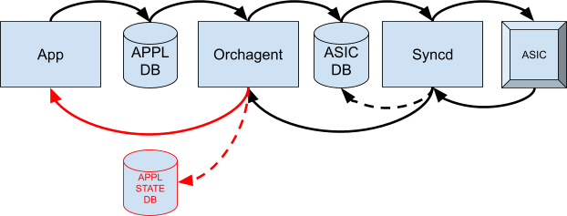
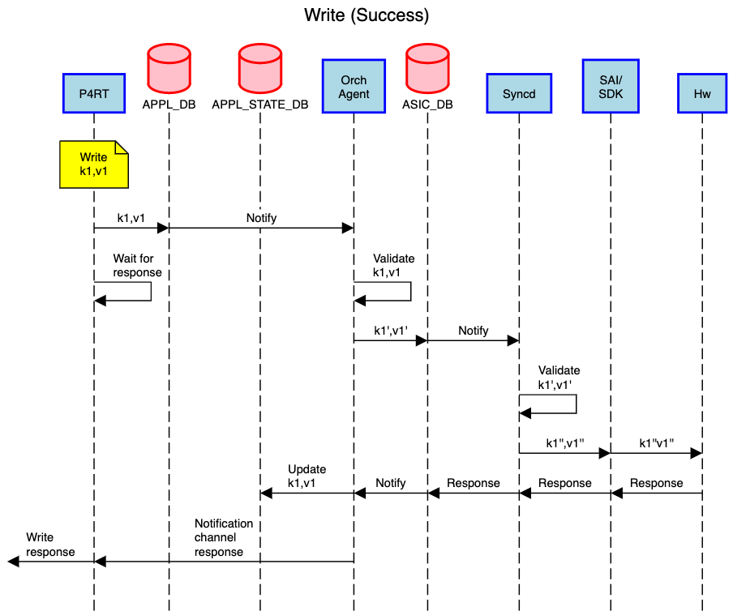
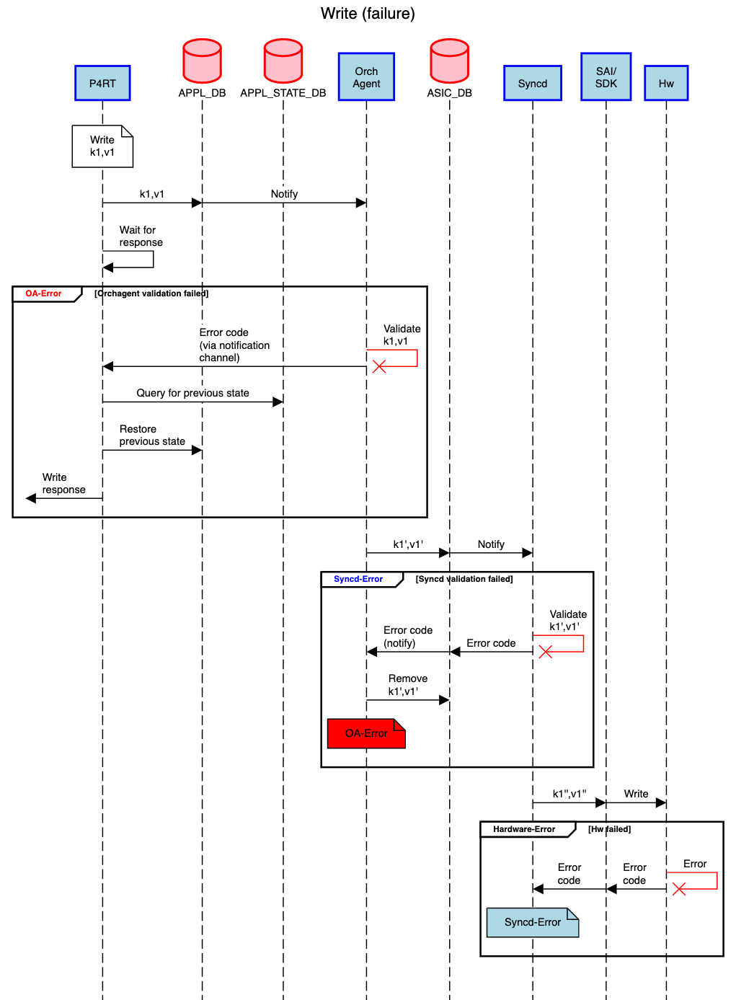
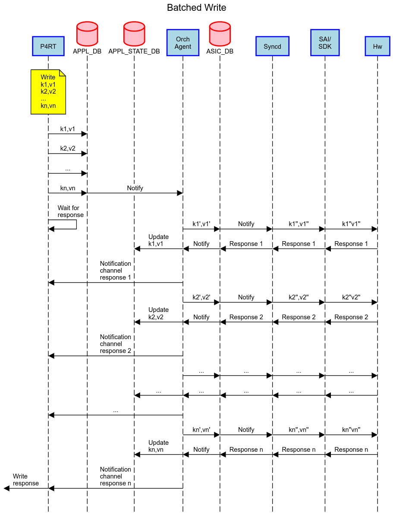

# APPL STATE DB & Response Path HLD

## Table of Content

* [Table of Content](#table-of-content)
* [Revision](#revision)
* [Scope](#scope)
* [Definitions/Abbreviations](#definitions-abbreviations)
* [Overview](#overview)
* [Requirements](#requirements)
  + [Functional Requirements](#functional-requirements)
* [Architecture Design](#architecture-design)
* [High-Level Design](#high-level-design)
  + [Application Layer Notification Channel](#application-layer-notification-channel)
  + [Return Status Code](#return-status-code)
  + [APPL STATE DB](#appl-state-db)
  + [PINS P4Orch](#pins-p4orch)
  + [APPL DB Cleanup](#appl-db-cleanup)
  + [PINS P4RT Examples](#pins-p4rt-examples)
    - [Success Case](#success-case)
    - [Failure Case (with APPL DB Cleanup)](#failure-case--with-appl-db-cleanup-)
    - [Batched Requests](#batched-requests)
* [SAI API](#sai-api)
* [Configuration and management](#configuration-and-management)
* [Warmboot and Fastboot Design Impact](#warmboot-and-fastboot-design-impact)
* [Restrictions/Limitations](#restrictions-limitations)
* [Testing Requirements/Design](#testing-requirements-design)
  + [Unit Test cases](#unit-test-cases)
* [Open/Action items - if any](#open-action-items---if-any)

## Revision

Rev  | Rev Date  | Author(s)                                   | Change Description
---- | --------- | --------------------------------------------| ------------------
v0.1 | 6/18/2021 | Runming Wu, Srikishen Pondicherry Shanmugam | Initial version

## Scope

This document describes the high-level design of the APPL State DB and the application response path feature.

## Definitions/Abbreviations

**PINS**: P4 Integrated Network Stack (PINS) is a project that provides a remote interface to SAI using P4.

## Overview

The current SONiC system follows an eventual consistency model to operate the switch. When an application desires to perform an action, it writes their "intent" into the APPL DB without receiving any indication of success. The lower layer of the system will make the best effort to fulfill the intent. When the intent cannot be satisfied, the APPL DB and the real state will be out of sync.

When applying PINS into a controller based SDN network, the eventual consistency model is not sufficient:

* The SDN controller needs to have the knowledge of the exact switch state. For each programming request, the controller should get an acknowledgement of success or failure in a timely manner. In current SONiC, applications only write their intents in APPL DB and receive no notification of success or failure. In PINS, when handling a P4 RPC request, the operation must be synchronous from application level down to hardware ASIC. The RPC response must contain the real system status.
* There is no real "state" DB to represent the system state in the application layer in current SONiC.
    * APPL DB is mostly intent-based as explained above.
    * The existing STATE DB is mainly used for resolving dependencies between different components. It does not include the detailed entry status that is programmed by the applications.
    * In synchronous mode, ASIC DB represents the hardware state. However, its schema is defined in SAI format. It is not meant for applications.

    In PINS, there are applications such as P4RT and telemetry that need to report the real system state to the SDN controller. Those applications cannot easily read the system state from the DBs.

This document introduces the application response path feature, where the application can receive timely notifications of the status of their program request. It also introduces a new DB, APPL STATE DB, for applications to easily query the system status.

## Requirements

### Functional Requirements

* A notification channel to notify the applications that their requests have been fulfilled or not. The result should carry the status code and failure reason in case of failure.
* The new DB that represents the real system state for applications to access the system state information.

## Architecture Design



As illustrated in the above diagram, the red components are the SONiC architectural change of this feature:

* Enable synchronous mode in orchagent and syncd. This enables the return path from syncd to orchagent.
    * Orchagent will receive the correct hardware response of a SAI call.
    * ASIC DB will represent the real hardware state instead of the intent.
    * Syncd won't throw an exception to shutdown the system in case of SAI error.
* Add a new notification channel from orchagent to the applications to report the return status.
* Add the new APPL STATE DB. Orchagent will write an APPL DB entry into APPL STATE DB if the entry has been successfully programmed. The APPL STATE DB will have the exact same schema of APPL DB. But it only contains the successfully programmed entries in APPL DB.

## High-Level Design

### Application Layer Notification Channel

The application layer will use NotificationProducer & NotificationConsumer APIs for returning the status. These APIs use pure redis channels in implementation. So that the redis DB namespace doesn't apply to these APIs. Each APPL DB table will use a different response channel name. The channel name format is: APPL_DB_&lt;table_name>_RESPONSE_CHANNEL. Orchagent will write the response status into the response channel whether the programming is successful or failed. Applications can listen to the response channel to receive the return status if they need to.

A message in the NotificationProducer & NotificationConsumer APIs contains an operation, data, and a list of field-value-pairs. In the pop() API, the arguments are operation, data, and field-value-pair list. However, in the pops() API, the three arguments are represented in a KeyOpFieldsValuesTuple structure. The corresponding fields in KeyOpFieldsValuesTuple are operation, key, and values. The document will refer to the arguments by using the pop() API naming. The notification channel will have the following schema:

* data: Exact same key format in APPL DB tables. This should uniquely identify an entry in an APPL DB table. This field is the key field in KeyOpFieldsValuesTuple for pops() API.
* operation: The string representation of the return status. This field is the operation field in KeyOpFieldsValuesTuple for pops() API.
* field-value-pair list: The first field will be "err_str" which contains the error message of the status. The "err_str" field will always be the first field. If there is no error string, "err_str" field will be an empty string. The rest of the fields will be exactly the same as the original request attributes. For delete operation, the list will only include the "err_str".

There are certain scenarios that the applications need to be aware of:

* Different applications might write to the same APPL DB table. If so, each application needs to be able to identify the entries that they manage. When an application receives a response, the response might be intended for other applications.
* One application might write to multiple APPL DB tables. And there will be multiple NotificationConsumer to listen to multiple channels. When a response is received, the application needs to be able to identify the NotificationConsumer or the channel. So that the application can get the corresponding table.
* When an application sends multiple requests for the same key in a short time, the orchagent might receive the aggregated request. The notifications orchagent sends will be a single aggregated entry instead of the original requests. It is recommended that the application should wait for the response of the previous request before sending a request of the same key. In a batched request scenario, it is recommended that the application to not send multiple requests of the same key in a single batch.
* Application should wait for the response with a timeout. In a rare case that the application does not receive the response from the orchagent, the application can assume failure instead of waiting indefinitely.
* In a scenario where a failed APPL DB request is partially programmed into the hardware (this can happen in certain update requests), the response does not include the fine-grained details on which attributes are succeeded or failed. Application could check the APPL STATE DB for details on which attributes are successfully programmed. In P4Orch, it handles the P4RT table request atomically. So it is not a concern in the P4RT application for partially programmed requests. Please refer to the [PINS P4Orch](#pins-p4orch) section for more details.


### Return Status Code

A list of return codes will be defined for application layer response. The string representation of the code is encoded in the "operation" field in the notification channel as mentioned before. For SAI errors, orchagent will map the SAI error into the corresponding return code.

Return Status Code        | SAI Error
------------------------- | ---------
SWSS_RC_SUCCESS           | SAI_STATUS_SUCCESS
SWSS_RC_INVALID_PARAM     | SAI_STATUS_INVALID_PARAMETER
SWSS_RC_DEADLINE_EXCEEDED |
SWSS_RC_UNAVAIL           |
SWSS_RC_NOT_FOUND         | SAI_STATUS_ITEM_NOT_FOUND
SWSS_RC_NO_MEMORY         | SAI_STATUS_NO_MEMORY
SWSS_RC_EXISTS            | SAI_STATUS_ITEM_ALREADY_EXISTS
SWSS_RC_PERMISSION_DENIED |
SWSS_RC_FULL              | SAI_STATUS_INSUFFICIENT_RESOURCES<br>SAI_STATUS_TABLE_FULL
SWSS_RC_IN_USE            | SAI_STATUS_OBJECT_IN_USE
SWSS_RC_INTERNAL          |
SWSS_RC_UNIMPLEMENTED     | SAI_STATUS_NOT_SUPPORTED<br>SAI_STATUS_NOT_IMPLEMENTED
SWSS_RC_UNKNOWN           | Other SAI errors

### APPL STATE DB

To record the successfully programmed entries in the APPL DB, a new DB is introduced: APPL STATE DB (ID: APPL_STATE_DB):

* The APPL STATE DB will use a new redis DB namespace, since all the keys are the same as the APPL DB.
* The APPL STATE DB will use the exact same keys, same schema as the existing APPL DB.
* When an orchagent operation is successful, orchagent will update the APPL STATE DB exactly the same as the request from the APPL DB. When an orchagent operation is failed, orchagent will not update the APPL STATE DB, so that the APPL STATE DB will have the correct system state.
* Applications can read/subscribe to the APPL STATE DB to get the system state.
* In a scenario where a failed APPL DB request is partially programmed into the hardware (this can happen in certain update requests), it is recommended for orchagent to only update the programmed attributes in the APPL STATE DB instead of all requested attributes. In P4Orch, it handles the P4RT table request atomically. So there is no partially programmed scenario in the P4RT table, and P4Orch will only update APPL STATE DB after a request is fully programmed. Please refer to the [PINS P4Orch](#pins-p4orch) section for more details.

While the new APPL STATE DB is introduced, the existing APPL DB's purpose is unchanged. It serves as the system configuration intent. In a clean scenario where the system does not encounter any error, the APPL DB and the APPL STATE DB should be the same. Only in an error scenario, the APPL STATE DB will be different from the APPL DB.

In implementation, there will be no specific APIs for APPL STATE DB. This is different from the APPL DB, which uses ProducerStateTable and ConsumerStateTable as APIs. The APPL STATE DB will simply be a redis hash:

* Orchagent will directly set the redis hash once it needs to update the APPL STATE DB. This can be done by using the raw table APIs.
* Application can read the APPL STATE DB by using raw table APIs. Or it can subscribe to the APPL STATE DB tables by using the SubscriberStateTable API.

### PINS P4Orch

P4Orch is a new orch introduced in PINS that first implemented the response path. More details on P4Orch can be found in the [P4 Orchagent HLD](#p4orch_hld.md). P4Orch has some differences from the other existing SONiC orch that relates to the response path handling:

* P4Orch does not retry on failed requests. \
In the existing SONiC orch, failed requests will be queued and retried indefinitely until success. However, P4Orch does not retry any failed requests. The decision of retry can be done in the controller. If the orchagent does retry indefinitely, it should only send the response and update APPL STATE DB after the request is successfully programmed. In P4Orch, response can be sent immediately after noticing a success or failure since there is no retry.
* P4Orch handles each P4RT request atomically. \
From the controller perspective, each RPC is better to be an atomic operation. And hence P4Orch handles each P4RT request atomically. If there is any failure encountered during the attribute programming, P4Orch will do the best to revert the already programmed attributes. (If the reversion fails, P4Orch will notify the system with a critical error.) With this, P4Orch does not need to update the APPL STATE DB for a partially programmed request. It will only update APPL STATE DB after it fully programs a request.

### APPL DB Cleanup

Optionally, applications can choose to remove an intent from APPL DB if it failed to program into the hardware. This can be useful in warmboot since the device after warmboot should have the same hardware programming as before. Removing the failed entries from APPL DB can prevent those entries to be re-program after warmboot. Since the previous intent has failed, this cleanup operation in APPL DB is only at the DB level; orchagent does not need to process the cleanup operation. Applications should not use the ProducerStateTable to do the cleanup operation since it will trigger notifications to the orchagent to process the cleanup. Applications should directly modify APPL DB to revert the failed intent.

The following are the types of failed intent and the possible cleanup operations:

* Failed create \
Delete the new key in APPL DB to cleanup.
* Failed modify \
Read APPL STATE DB for the original entry. Wipe the entry in APPL DB, and re-write it with the APPL STATE DB entry to cleanup.
* Failed delete \
Read APPL STATE DB for the original entry. Write it into APPL DB to cleanup.

### PINS P4RT Examples

#### Success Case



#### Failure Case (with APPL DB Cleanup)



#### Batched Requests



## SAI API

N/A

## Configuration and management

A new configuration file will be added to enable the response channel and the APPL STATE DB for the selected APPL DB tables. There are two configurations: response channel and APPL STATE DB. They are defined in separate section of the configuration file. The configuration will contain a list of APPL DB table names. Only the tables in the list will have the feature enabled.

An example configuration file will look like this:
```
{
    "response_channel": [
        "P4RT",
        "SWITCH_TABLE",
        "HASH_TABLE"
    ],
    "appl_state_db": [
        "P4RT",
        "HASH_TABLE"
    ]
}
```

## Warmboot and Fastboot Design Impact

N/A

## Restrictions/Limitations

N/A

## Testing Requirements/Design

### Unit Test cases

The notification channel and APPL STATE DB are tested in the swss py test. The test verifies:

* The correct schema in the notification channel.
* The correct schema in the APPL STATE DB.
* In both the success case and fail case.

## Open/Action items - if any

N/A
