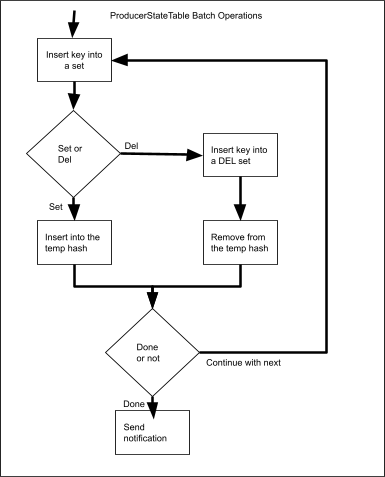
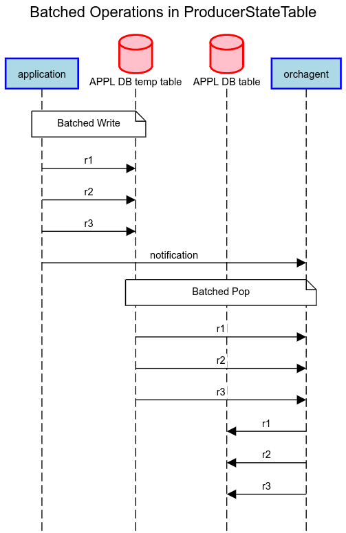
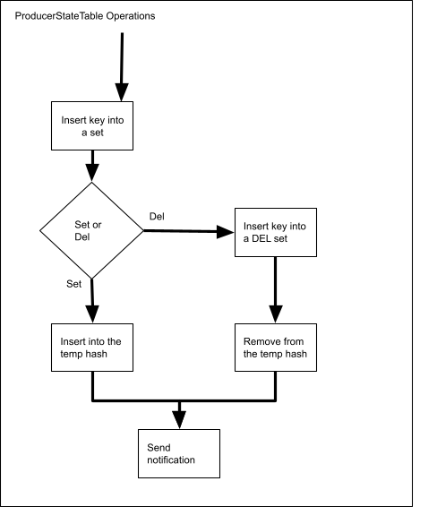

# Batch Requests API HLD

## Table of Content

* [Table of Content](#table-of-content)
* [Revision](#revision)
* [Scope](#scope)
* [Definitions/Abbreviations](#definitions-abbreviations)
* [Overview](#overview)
* [Requirements](#requirements)
* [Architecture Design](#architecture-design)
* [High-Level Design](#high-level-design)
  + [Batched APIs](#batched-apis)
  + [Batched API Operations](#batched-api-operations)
  + [Orchagent Update](#orchagent-update)
  + [PINS P4RT](#pins-p4rt)
* [SAI API](#sai-api)
* [Configuration and management](#configuration-and-management)
* [Warmboot and Fastboot Design Impact](#warmboot-and-fastboot-design-impact)
* [Restrictions/Limitations](#restrictions-limitations)
* [Testing Requirements/Design](#testing-requirements-design)
  + [Unit Test cases](#unit-test-cases)
* [Open/Action items - if any](#open-action-items---if-any)
* [Appendix](#appendix)
  + [Current ProducerStateTable APIs](#current-producerstatetable-apis)
  + [Current ProducerStateTable Operations](#current-producerstatetable-operations)

## Revision

Rev  | Rev Date  | Author(s)                                   | Change Description
---- | --------- | --------------------------------------------| ------------------
v0.1 | 02/15/2022 | Runming Wu, Srikishen Pondicherry Shanmugam | Initial version

## Scope

This document describes the high-level design of the batch request API in APPL DB.

## Definitions/Abbreviations

**PINS**: P4 Integrated Network Stack (PINS) provides a remote interface to SAI using P4.

## Overview

When an application writes an entry into APPL DB, it uses the ProducerStateTable API. Currently, the ProducerStateTable API does not support batched writes. In the current form, the application needs to call the API multiple times for programming a batch of requests. This HLD proposes a new API in ProducerStateTable that can allow applications to program multiple entries in a single invocation. This can reduce the number of Redis DB notifications and potentially reduce the latency for responses when the response path is enabled.

## Requirements

* Support a batched write API in ProcuderStateTable.

## Architecture Design

N/A

## High-Level Design

Two new APIs will be introduced into the ProducerStateTable. There will be no change in the existing ProducerStateTable method implementations. There is also no change in the ConsumerStateTable implementation as it can already process batches. The entire change is backward compatible. 

### Batched APIs

The following are the proposed batched APIs:

```
    virtual void set(const std::vector<KeyOpFieldsValuesTuple> &values) override;

    virtual void del(const std::vector<std::string> &keys) override;
```

The new API will be added into the ProducerStateTable as new methods. The current set() and del() method will not be impacted.

### Batched API Operations

The Redis DB operation sequence will be the same as the current sequence as calling the current API multiple times, except sending the notification once at the end. There is no change in the consumer API and behavior. (Refer to the appendix for the current API operation.)



The sequence of operations are:

* Inserts all new keys into a Redis set "&lt;table_name>_KEY_SET".
* For del() operation, also inserts the keys into another set "&lt;table_name>_DEL_SET".
* Inserts the entries into a temporary Redis hash "_&lt;table_name>&lt;separator>&lt;key>".
* After all entries are written, write a message "G" to the notification channel "&lt;table_name>_CHANNEL". This will notify the consumer.
* All the above Redis operations will happen in a Redis transaction (LUA script), which is atomic.

The following sequence diagram shows the detailed batched operation in the ProducerStateTable. The Redis new key set and the temporary hash are abstracted as the "APPL DB temp table" in the graph.



### Orchagent Update

The current consumer implementation is capable of handling batches. The batch size is configurable in the orchagent argument. A recent change in orchagent makes orchagent to pop in a loop until all requests are drained. This handles the case that the producer writes a batch larger than the orchagent pop size. Overall, there is no change required in the orchagent.

### PINS P4RT

The P4RT application will be the first application to use the batch APIs. P4Orch route manager will utilize the batching to maximize the performance. To handle APPL DB updates, we are proposing the batched API in the Table class in a similar fashion to the ProducerStateTable:

```
    virtual void set(const std::vector<KeyOpFieldsValuesTuple> &values);

    virtual void del(const std::vector<std::string> &keys);
```

## SAI API

N/A

## Configuration and management

N/A

## Warmboot and Fastboot Design Impact

N/A

## Restrictions/Limitations

* In the current proposed APIs, a batched request can only contain similar entries - for example - either all SET or all DEL entries. A mix of SET and DEL in a batch is not supported.
* A batched request can only apply to a single APPL DB table. Requests to different tables cannot be batched.
* Order is not maintained in a batch request. The entries within a single batched request will be handled in any order.

## Testing Requirements/Design

### Unit Test cases

Unit tests on the batch API will be provided in the swss-common library unit testing.

## Open/Action items - if any

N/A

## Appendix

Below is an example code snippet of the new API usage:

```
// Non-batched Set
for (KeyOpFieldsValuesTuple entry : entries) {
    table.set(kfvKey(entry), kfvFieldsValues(entry));
}

// Non-batched Del
for (std::string entry : entries) {
    table.del(entry);
}

// Batched Set
table.set(entries);

// Batched Del
table.del(entries);
```

### Current ProducerStateTable APIs

The following are the existing ProducerStateTable APIs:

```
    virtual void set(const std::string &key,
                     const std::vector<FieldValueTuple> &values,
                     const std::string &op = SET_COMMAND,
                     const std::string &prefix = EMPTY_PREFIX);

    virtual void del(const std::string &key,
                     const std::string &op = DEL_COMMAND,
                     const std::string &prefix = EMPTY_PREFIX);
```

The operation input and the prefix are currently not used. In the proposed batched APIs, those unused arguments will not be included.

### Current ProducerStateTable Operations

There are a few Redis DB operations involved in a ProducerStateTable API call. Here is a summary of the DB operation sequence when set() or del() is called:

* Inserts the key into a Redis set "&lt;table_name>_KEY_SET".
* For del() operation, also inserts the key into another set "&lt;table_name>_DEL_SET".
* Inserts the entry into a temporary Redis hash "_&lt;table_name>&lt;separator>&lt;key>".
* Writes a message "G" to the notification channel "&lt;table_name>_CHANNEL". This will notify the consumer.
* When the consumer pops, it will pop "&lt;table_name>_KEY_SET" for the new keys.
* For each new key, the consumer will also check "&lt;table_name>_DEL_SET" to decide if it is a del() operation or not.
* For a del() operation, the consumer will delete the entry in the Redis hash "&lt;table_name>&lt;separator>&lt;key>" and the temporary hash "_&lt;table_name>&lt;separator>&lt;key>".
* For a set() operation, the consumer will read the new key in the temporary hash "_&lt;table_name>&lt;separator>&lt;key>" and read it into the Redis hash "&lt;table_name>&lt;separator>&lt;key>". Delete the entry in the temporary hash.



In a batch operation, the notification channel step can be reduced from the above sequence. The producer only needs to send one single notification at the end. The current consumer already pops entries in a batch. In the new batched API, the Redis notification can be reduced.
