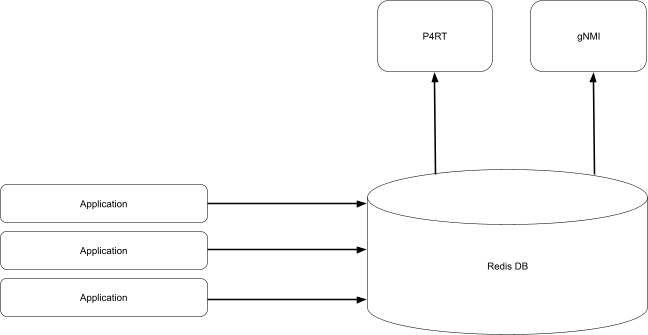
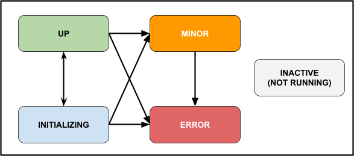

# Critical State HLD

## Table of Content

TBD in Markdown with links

## Revision

Rev  | Rev Date   | Author(s)  | Change Description
---- | ---------- | -----------| ------------------
v0.1 | 12/20/2021 | Runming Wu | Initial version

## Scope

This document describes the high-level design of the critical state feature.

## Definitions/Abbreviations

**PINS**: P4 Integrated Network Stack (PINS) is a project that provides a remote interface to SAI using P4.

## Overview

There are unavoidable error conditions, like hardware errors or software bugs, that can bring a system into an inconsistent state. In critical error situations (uncaught exception, fatal exit, etc), SONiC automatically resolves the error by restarting the containers/processes. When a critical error occurs, the SONiC process will raise an exception and then crash or exit with error. The container or the process will be restarted in response, and hopefully the restart could resolve the error. In an SDN environment, such recovery mechanism is not desired for the following reasons:

* Restarting certain containers/processes might cause packet drop.
* The controller should be fully aware of the system state of the switch. Auto recovery can cause inconsistency between the controller and the switch.
* Auto restart will modify the switch's state before a human even has the option of analyzing the switch to triage the problem.
* There is little indication to the external world on what has happened when the restart recovery occurs.

In this HLD, we propose a different error handling mechanism: critical state. In short summary, when a critical error happens, the system will:

* Not crash or exit.
* Not attempt to self recover.
* Enter the critical state, which indicates that a critical error has occurred.
* Preserve the current state as much as possible. Stop further programming into hardware.
* Continue to forward packets based on the existing rules.
* Raise an alarm to notify external entities, so that external entities can decide further actions (recover, debug etc).

There is an on-going [proposal](https://github.com/Azure/SONiC/pull/761) on the SONiC event and alarm framework, which can provide the alarm raising feature for critical state. As the event and alarm framework design and implementation are still under review, this HLD will propose orthogonal gNMI alarm raising. When the event and alarm framework is ready, the critical state library can use the new alarm framework to raise gNMI alarms.

### Non-SDN Applications

In the initial release of the critical state feature, it will mainly target SDN components (such as P4RT and gNMI). However, the feature provides the following advantages, and they can be beneficial to the on-box control plan as well (such as BGP):

* No auto restart to prevent potential packet drop and network disruption.
* Freeze state on error events to provide debug opportunities.
* Indication to the external world that an error has occurred by raising alarms.

For an orchestrated system, this feature can be enabled on the non-SDN applications:

* User friendly libraries will be provided in various languages, so that any application can easily report and check critical state.
* Configuration will be provided to enable/disable the feature on common shared components (such as orchagent).

## Requirements

### Functional Requirements

* Library to enter critical state and raise alarm.
* Library to listen on system critical state.
* DB schema on system critical state information.
* Configuration on the recovery mechanism: critical state & crash restart.

## Architecture Design



Redis DB will be used as the main source of critical state and alarm information. Applications/system will write the critical error information into the DB. External exposing interfaces, such as P4RT and gNMI, will subscribe to the system critical state information. When the system is in critical state, external facing APIs will block further write requests while allowing read requests. The gNMI component will also raise an [OpenConfig alarm](https://github.com/openconfig/public/blob/master/release/models/system/openconfig-alarms.yang) when the system is in critical state.

## High-Level Design

### Component State

The critical state information will be reported on the component basis. A component is defined by a unique string in the DB/API. A component can be a process, a container, or a service. We define the following states to represent the status of each component:

<table>
  <tr>
   <td><strong>Component State</strong>
   </td>
   <td><strong>Description</strong>
   </td>
  </tr>
  <tr>
   <td><strong>INITIALIZING</strong>
   </td>
   <td>Service is running but not yet ready to serve. External intervention is not required. This is an optional state. A component can directly move to UP state when starting. If no state is ever reported for a component, it is also considered as in INITIALIZING state.
   </td>
  </tr>
  <tr>
   <td><strong>UP</strong>
   </td>
   <td>Service is ready and fully functional.
   </td>
  </tr>
  <tr>
   <td><strong>MINOR</strong>
   </td>
   <td>Service is running but encountered a minor error. Service is not impacted.
   </td>
  </tr>
  <tr>
   <td><strong>ERROR</strong>
   </td>
   <td>Service is running but encountered an uncorrectable error. Service may be impacted. External intervention is required to recover.
   </td>
  </tr>
  <tr>
   <td><strong>INACTIVE</strong>
   </td>
   <td>Service is not running and the system has given up on restarting the service.
   </td>
  </tr>
</table>

Each component can report one of the four states { INITIALIZING, UP, MINOR, ERROR } by itself. However, it cannot report INACTIVE state if it has been stopped. The system monitor daemon will report INACTIVE state for the inactive components.



### Entering Critical State

If any component is in ERROR or INACTIVE state, the system is considered to be in the critical state. For the purpose of raising system critical state, only ERROR state and INACTIVE state are required in component state, but the other component states can provide more information about each service even when the system is not in critical condition.

For INACTIVE state, the component has been stopped, and the INACTIVE state is reported by the system monitoring daemon. For ERROR state, it is reported by the component when an uncorrectable error occurs. Examples of uncorrectable errors include:

* There is an uncorrectable memory error (i.e. ECC failure).
* An application runs out of memory.
* An application hits a code path that was wrongfully considered unreachable.
* An application receives an unknown error code from the hardware SAI layer.
* An application detects a synchronization error between hardware and software state.

### Expected Behavior in Critical State

When the system is in critical state, the system should have the following behaviors:

* Reject external write requests. This includes any P4RT and gNMI write requests. The purpose of this is to preserve the error state of the system and hardware. This can help in debugging and prevent more critical errors from happening.
* Continue to respond to external read requests. This includes any P4RT and gNMI read requests.
* Continue to forward packets with programmed rules. However, the system cannot program new rules as write requests will be rejected.
* Continue to perform packet IO with programmed rules.

To achieve the above behavior, two external facing components will subscribe to the critical state information: P4RT and gNMI. When the system is in critical state, those two components will reject the corresponding write requests while allowing read requests. The error returned to the SDN controller will indicate that the system is in critical state. For the gNMI component, an OpenConfig alarm with CRITICAL severity will be raised to indicate that the system is in critical state.

### Exiting Critical State

The system can only exit critical state via reboot. Applications cannot clear critical state since critical state implies fatal error. In operational scenarios, when the switch reports critical state in gNMI alarm, SDN controller or network administrator will need to drain the switch. External entities can log into the switch, collect debug information, and finally reboot the switch to exit the critical state.

### DB Schema

To store the component state information. A new table will be defined in the STATE DB, called COMPONENT_STATE_TABLE. The system critical state information can be obtained from the component state information, hence there is no direct system critical state information stored in the DB.

The COMPONENT_STATE_TABLE will have the following schema:

* The table name is COMPONENT_STATE_TABLE in STATE DB.
* The table key will be the component ID. Component ID is a unique string identifier for each component.
* The table content will be a list of attributes and values:
    * state: A string representation of the state code. It can be one of {"INITIALIZING", "UP", "MINOR", "ERROR", "INACTIVE"}.
    * reason: A string representing the last state update reason. This field can be an empty string.
    * timestamp: A human readable string that represents the last state update timestamp (in local time), with format "yyyy-MM-dd HH:mm:ss".
    * timestamp-seconds: An integer that represents the tv_sec field in timespec for the last state update timestamp (in local time). The timespec needs to match with the human readable timestamp field.
    * timestamp-nanoseconds: An integer that represents the tv_nsec field in timespec for the last state update timestamp (in local time). The timespec needs to match with the human readable timestamp field.

Example of the COMPONENT_STATE_TABLE:

```
select 6
hgetall COMPONENT_STATE_TABLE|P4RT_APP
1) state
2) ERROR
3) reason
4) SAI error in route programming
5) timestamp
6) 2021-01-26 08:45:08
7) timestamp-seconds
8) 1611693908
9) timestamp-nanoseconds
10) 999
```

The COMPONENT_STATE_TABLE only stores the latest component states. It does not store state history. The API will log the state transition history for each component.

### API

APIs will be provided in the swss-common library. It will be available in C++ and Python language. There will also be a Golang version of the APIs in the telemetry application.

The following are the C++ API examples:

```
enum class ComponentState {
  kInitializing,  // Default state.
  kUp,
  kMinor,
  kError,
  kInactive,
};

struct ComponentStateInfo {
  ComponentState state = ComponentState::kInitializing;
  std::string reason = "";
  timespec timestamp = {};
};

class ComponentStateHelper {
 public:
  // Returns a singleton instance of the class for a component.
  static ComponentStateHelper& GetInstance(std::string component);

  // Reports a component state update.
  // Returns true if the state update was successful.
  // Returns false if the state update did not happen.
  // Update will fail for invalid transitions
  // (e.g. kError -> kUp).
  bool ReportComponentState(ComponentState state,
                            const std::string& reason);

  // Returns the self component state information.
  // Returns the default value of ComponentStateInfo if
  // the component did not report any state.
  ComponentStateInfo StateInfo() const;
};

class SystemStateHelper {
 public:
  // Returns a singleton of the class.
  static SystemStateHelper& GetInstance();

  // Returns true if the system is in critical state.
  // The system is in critical state if a component is in kError
  // state or kInactive state.
  bool IsSystemCritical() const;

  // Returns a description of why the system is in critical state.
  // Returns empty string if the system is not in critical state.
  std::string GetSystemCriticalReason() const;

  // Returns state information for each component that has
  // reported their state to the DB.
  std::unordered_map<std::string, ComponentStateInfo>
    AllComponentStates() const;
};
```

### System Health Monitor

When a component is inactive, the [system health monitor daemon](https://github.com/Azure/SONiC/blob/master/doc/system_health_monitoring/system-health-HLD.md) will need to report INACTIVE state for that component. Currently, the system health monitor daemon periodically checks the status of various services and processes. Changes will need to be made in the monitor daemon so that it will write INACTIVE state into the DB when a component is inactive:

* The monitor daemon should write INACTIVE state only. No other state should be written by the monitor daemon.
* Since INACTIVE is a terminate state (cannot change from INACTIVE to other states), the monitor daemon should only write INACTIVE state when the system has given up restarting the service.

### System LED

When the system is in critical state, we would like the system LED to reflect the fault state. Currently, the system health monitor daemon updates the LED color base on a configuration file and the overall system health during the periodic service check. A change will be made in the monitor daemon to also check the critical state information in the DB. If the system is in critical state, the monitor daemon will update the LED color to "fault" state (exact color will depend on the configuration).

### gNMI Alarm

An OpenConfig alarm with CRITICAL severity will be raised when the system is in critical state (when any component is in ERROR or INACTIVE state). An alarm can also be raised when a component is in MINOR state, but with MINOR severity. The following are the details of the gNMI alarm paths:

<table>
  <tr>
   <td><strong>OpenConfig Path</strong>
   </td>
   <td><strong>Description</strong>
   </td>
  </tr>
  <tr>
   <td>/system/alarms/alarm[id=&lt;alarm_id>]/state/id
   </td>
   <td>Format:
<p>
&lt;component_id>_&lt;timestamp_in_nanoseconds>
<p>
Example:
<p>
P4RT_1604617315000000000
   </td>
  </tr>
  <tr>
   <td>/system/alarms/alarm[id=&lt;alarm_id>]/state/text
   </td>
   <td>Format:
<p>
&lt;component_state_string>: &lt;reason>
<p>
Example:
<p>
ERROR: SAI error in route programming
   </td>
  </tr>
  <tr>
   <td>/system/alarms/alarm[id=&lt;alarm_id>]/state/type-id
   </td>
   <td>SOFTWARE
   </td>
  </tr>
  <tr>
   <td>/system/alarms/alarm[id=&lt;alarm_id>]/state/resource
   </td>
   <td>The component ID.
   </td>
  </tr>
  <tr>
   <td>/system/alarms/alarm[id=&lt;alarm_id>]/state/severity
   </td>
   <td>CRITICAL or MINOR
   </td>
  </tr>
  <tr>
   <td>/system/alarms/alarm[id=&lt;alarm_id>]/state/time-created
   </td>
   <td>Component state update timestamp in nanoseconds.
   </td>
  </tr>
</table>

### Summary of Changes

In the initial release of the critical state feature, we will target for P4RT, orchange, and syncd to report critical state for fatal errors. Here is the summary of the changes needed:

* Library change
    * Provide API library in swss common, which includes C++ and Python.
    * Provide API library in Golang, which is used in the telemetry application.
* P4RT application
    * Report ERROR state (via API) in critical errors.
    * Listen to critical state information in the DB. When the system is in critical state, reject write requests.
* Telemetry (gNMI) application
    * Listen to critical state information in the DB. When the system is in critical state, reject gNMI write requests.
    * Raise gNMI alarms if a component is in MINOR, ERROR, or INACTIVE state.
* Orchagent
    * In each exit line, handle the error with a critical state or response path (instead of exiting).
    * In each uncaught exception, handle the error with a critical state (instead of crashing).
    * P4Orch will report ERROR state in uncorrectable errors.
* Syncd
    * In each exit line, handle the error with a critical state (instead of exiting).
    * In each uncaught exception, handle the error with a critical state (instead of crashing).
* System monitor daemon
    * In each periodic poll, report INACTIVE state for the services that are permanently inactive.
    * In each periodic poll, check system critical state information and update the system LED if the system is in critical state.

## SAI API

N/A

## Configuration and management

The change of exception and exit behaviors in orchagent and syncd will differ from the current SONiC. We will provide a command line flag in orchagent and syncd to control such error handling behaviors (whether to crash or raise critical state).

## Warmboot and Fastboot Design Impact

N/A

## Restrictions/Limitations

* In the initial release of the critical state, the feature is targeted for syncd, orchagent, P4RT application, and telemetry(gNMI) application.
* The feature depends on Redis DB to store critical state information. If the Redis DB goes down, the system will no longer be able to read & write critical state information. There might be no gNMI alarm raised in such a case. However, the system will not perform further programming as the DB is down. And all requests to the system, whether read or write, will return errors.
* If the system health monitor daemon goes down, the system can no longer detect inactive components.

## Testing Requirements/Design

* Unit tests will be provided in testing the library codes.
* Unit tests will be provided in testing the P4RT changes and P4Orch changes.
* Component tests will be provided in testing the P4RT changes, telemetry changes, and P4Orch changes.

## Open/Action items - if any

N/A