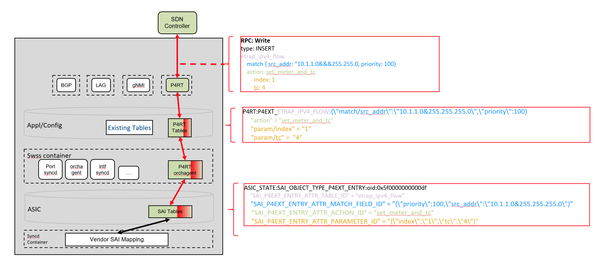

# SAI P4 Extensions HLD

_Rev v0.1_

## Table of Contents

- [Revision](#revision)
- [Scope](#scope)
- [Definitions / Abbreviations](#definitions--abbreviations)
- [Overview](#overview)
- [Requirements](#requirements)
- [Architecture](#architecture)
- [High-Level Design](#high-level-design)
- [SAI API](#sai-api)
- [Configuration and management](#configuration-and-management)
  - [CLI / YANG model Enhancements](#cli--yang-model-enhancements)
  - [Config DB Enhancements](#config-db-enhancements)
- [Warmboot and Fastboot Design Impact](#warmboot-and-fastboot-design-impact)
- [Restrictions / Limitations](#restrictions--limitations)
- [Testing Requirements / Design](#testing-requirements--design)
- [Open / Action items - if any](#open--action-items---if-any)
- [Appendix A](#appendix-a)
- [Appendix B](#appendix-b)

## Revision
| Rev  | Rev Date   | Author(s)          | Change Description |
|------|------------|--------------------|--------------------|
| v0.1 | 08/11/2021 | Ravi Vantipalli (Intel) Sagar Balani (Intel), Reshma Sudarshan (Intel), Brian O’Connor (ONF)  | Initial version |


## Scope

This document describes the high-level design for adding support for SAI P4 extensions to PINS.

## Definitions / Abbreviations
**P4**: Programming Protocol-independent Packet Processors (P4) is a domain-specific language for network devices, specifying how data plane devices (switches, NICs, routers, filters, etc.) process packets

**SAI**: Switch Abstraction Interface (SAI) is a standardized interface which allows programming and managing different switch ASICs in a vendor-independent fashion.

## Overview

User applications which are custom built with proprietary IP or niche use cases pertaining to specific markets (Telco/BNG) need to program the pipeline differently than the SAI implementation today or append to it. For edge use cases where there are stringent pipeline restrictions, tighter control of features is also required.

Goals of SAI P4 extensions
* Provide a mechanism to support vendor differentiation
* Ability to add exclusive features
* Expose device specific capabilities
* Rapid application prototyping

SAI P4 Extensions via PINS attempts to solve this using the unique programming model afforded by PINS. The [sai.p4] program is a well defined data plane specification with a fixed feature set modelling the SAI behavioral model. The P4 language offers a unique top-down way to extend this pipeline while keeping the base functionality unchanged. Just by extending the P4 program offered by PINS to describe
non-SAI features, supporting these custom features would virtually **require no changes to the SONiC stack**. Prototyping or productizing these custom features can be done in weeks or even days with SONiC.


## Requirements

The following components are targeted for the SONiC 2021-11 release together with the requirements specified in the PINS HLD.


* P4RT application that runs in its own container,
* P4RT-Orchagent that runs as part of SWSS, and
* New saip4ext.h object type in SAI
* Minor changes to sai-redis to incorporate saip4ext.h

Additional functionality will be made available in future releases.


## Architecture

Please refer to the “Architecture" section of the PINS HLD document. The original figure describing the SAI P4 pipeline is shown below.


## High-Level Design

The design piggybacks on the new P4RT app and utilizes a new SAI header file proposed for this extensibility. A snippet of this file is listed in Appendix A.

The new SAI object type, SAI_OBJECT_TYPE_P4EXT_ENTRY, has attributes which mirror a typical P4 match-action table. This allows for the protobuf message arriving at the P4RT app to be intercepted and translated to a standard APP DB table format described in the below figure. The users are free to author the P4 table with any supported match kind, annotations or other tools provided in the P4 language.


To distinguish between these new non-SAI P4 tables and the existing SAI tables, both visually and programmatically, an annotation “@saip4ext” should be used in the P4 program.

From SONiC PINS perspective, supporting this new extension path requires minimal change. A common P4 Extensions manager in SWSS orchagent can handle any new non-SAI P4 tables. The changes needed in various SONiC layers SAI Redis/syncd, swss, swss-common need to be made just once for the new non-SAI tables. This makes adding new proprietary features on top of standard SAI features trivial. New changes required to support non-SAI P4 tables in SONiC are highlighted in red in the picture below.



The main and only difference between this entry and P4RT fixed table is the naming convention used for the key. P4FIXED_ will be replaced with P4EXT_ for all new extension tables.

## SAI API

saip4ext.h is a new header file added to the SAI specification. It introduces a new object type, SAI_OBJECT_TYPE_P4EXT_ENTRY, and a set of attributes which mirror a P4 program's match and action semantics. This feature is described in detail in the SAI repo specific HLD here (TBD).

A snippet of the header file content is added in Appendix A for quick reference.


## Configuration and management


### CLI / YANG model Enhancements

There are no CLI changes.


### Config DB Enhancements

There are no Config DB changes.


## Warmboot and Fastboot Design Impact

For this release of PINS, warmboot and fastboot are not supported. SAI P4 extensions will support these features when they are supported by P4RT. There is no impact to current warmboot implementation. Only objects that are added through P4EXT will not be supported across warmboot.


## Restrictions / Limitations

In this release, the SWSS implementation of the P4 extensions will not support referring to other SAI objects. This means, the P4 programmer has to add new P4 tables with minimal to no references to existing SAI tables or vice-versa.


## Testing Requirements / Design

The entire PINS code, including the P4RT Application and P4Orch, is well unit tested. The coverage goal is at least 90% which is already achieved. Integration tests will be added in the following release.


## Open / Action items - if any


## Appendix A

saip4ext.h - This code is added here only for reference. Please refer to the SAI HLD for a more detailed explanation.


```
/**
 * @brief Attribute Id for P4 ext
 */
typedef enum _sai_p4ext_entry_attr_t
{
    /**
     * @brief Start of attributes
     */
    SAI_P4EXT_ENTRY_ATTR_START,

    /**
     * @brief SAI P4 EXT table name
     *
     * @type sai_s8_list_t
     * @flags CREATE
     * @default empty
     */
    SAI_P4EXT_ENTRY_ATTR_TABLE_NAME = SAI_P4EXT_ENTRY_ATTR_START,

    /**
     * @brief SAI P4 EXT Match field
     *
     * @type sai_s8_list_t
     * @flags CREATE
     * @default empty
     */
    SAI_P4EXT_ENTRY_ATTR_MATCH_FIELD_ID,

    /**
     * @brief SAI P4 EXT Action id
     *
     * @type sai_s8_list_t
     * @flags CREATE_AND_SET
     * @default empty
     */
    SAI_P4EXT_ENTRY_ATTR_ACTION_ID,

    /**
     * @brief SAI P4 EXT Action parameters
     *
     * @type sai_s8_list_t
     * @flags CREATE_AND_SET
     * @default empty
     */
    SAI_P4EXT_ENTRY_ATTR_PARAMETER_ID,

    /**
     * @brief End of attributes
     */
    SAI_P4EXT_ENTRY_ATTR_END,

    /** Custom range base value */
    SAI_P4EXT_ENTRY_ATTR_CUSTOM_RANGE_START = 0x10000000,

    /** End of custom range base */
    SAI_P4EXT_ENTRY_ATTR_CUSTOM_RANGE_END

} sai_p4ext_entry_attr_t;

typedef sai_status_t (*sai_create_p4ext_entry_fn)(
        _Out_ sai_object_id_t *p4ext_entry_id,
        _In_ sai_object_id_t switch_id,
        _In_ uint32_t attr_count,
        _In_ const sai_attribute_t *attr_list);

typedef sai_status_t (*sai_remove_p4ext_entry_fn)(
        _In_ sai_object_id_t p4ext_entry_id);

typedef sai_status_t (*sai_set_p4ext_entry_attribute_fn)(
        _In_ sai_object_id_t p4ext_entry_id,
        _In_ const sai_attribute_t *attr);

typedef sai_status_t (*sai_get_p4ext_entry_attribute_fn)(
        _In_ sai_object_id_t p4ext_entry_id,
        _In_ uint32_t attr_count,
        _Inout_ sai_attribute_t *attr_list);

typedef struct _sai_p4ext_api_t
{
    sai_create_p4ext_entry_fn               create_p4ext_entry;
    sai_remove_p4ext_entry_fn               remove_p4ext_entry;
    sai_set_p4ext_entry_attribute_fn        set_p4ext_entry_attribute;
    sai_get_p4ext_entry_attribute_fn        get_p4ext_entry_attribute;
} sai_p4ext_api_t;
```

## Appendix B

### Example P4 extension table
```
    action set_meter_and_tc(etrap_index_t index, traffic_class_t tc) {
        etrap_index_value = index;
        etrap_tc_value = tc;
    }
    @saip4ext()
    table etrap_ipv4_flow {
        key = {
            headers.ipv4.src_addr : ternary @format(IPV4_ADDRESS) @name("src_addr");
            headers.ipv4.dst_addr : ternary @format(IPV4_ADDRESS) @name("dst_addr");
        }
        actions = {
            @proto_id(1) set_meter_and_tc;
        }
        size = 1000;
    }
```

### gRPC protobuf message
```
TBD
```

### APP DB schema
```
HGETALL "P4RT:P4EXT_ETRAP_IPV4_FLOW:{\"match/src_addr\":\"10.10.10.0&255.255.255.0\",\"priority\":100}"
1) "action"
2) "set_meter_and_tc"
3) "param/index"
4) "1"
5) "param/tc"
6) "2"
```

### ASIC DB schema
```
HGETALL "ASIC_STATE:SAI_OBJECT_TYPE_P4EXT_ENTRY:oid:0x5f00000000011d"
1) "SAI_P4EXT_ENTRY_ATTR_TABLE_ID"
2) "etrap_ipv4_flow"
3) "SAI_P4EXT_ENTRY_ATTR_MATCH_FIELD_ID"
4) "{\"priority\":100,\"src_addr\":\"10.10.10.0&255.255.255.0\"}"
5) "SAI_P4EXT_ENTRY_ATTR_ACTION_ID"
6) "set_meter_and_tc"
7) "SAI_P4EXT_ENTRY_ATTR_PARAMETER_ID"
8) "{\"index\":\"1\",\"tc\":\"2\"}"
```
