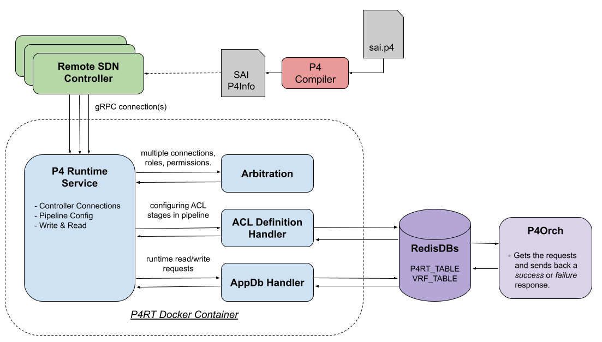
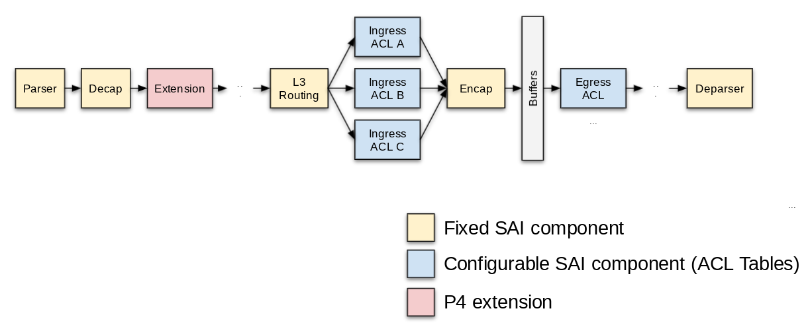

# P4RT Application HLD

_Rev v0.1_

- [Revision](#revision)
- [Scope](#scope)
- [Definitions/Abbreviations](#definitions-abbreviations)
- [Overview](#overview)
- [Requirements](#requirements)
- [P4RT Application High-Level Design](#p4rt-application-high-level-design)
  * [Arbitration & Controller Roles](#arbitration---controller-roles)
  * [P4 programs & P4Info](#p4-programs---p4info)
  * [ACL Table Definitions](#acl-table-definitions)
  * [Writing (insert/modify/delete) into the P4RT APPL_DB Table](#writing--insert-modify-delete--into-the-p4rt-appl-db-table)
  * [WCMP/Hashing](#wcmp-hashing)
  * [Response path](#response-path)
- [APPL DB Schema High-Level Design](#appl-db-schema-high-level-design)
- [Testing Requirements/Design](#testing-requirements-design)
- [Configuring P4RT Application](#configuring-p4rt-application)
- [Open/Action items - if any](#open-action-items---if-any)

## Revision

Rev  | RevDate    | Author(s)   | Change Description
---- | ---------- | ----------- | ------------------
v0.1 | 06/30/2021 | Google, ONF | Initial Version

## Scope

This document describes the high-level design for adding a P4Runtime gRPC service into SONiC which will run on [port 9559](https://www.iana.org/assignments/service-names-port-numbers/service-names-port-numbers.xhtml?search=9559).


## Definitions/Abbreviations

**P4**: Programming Protocol-independent Packet Processors (P4) is a domain-specific language for network devices, specifying how data plane devices (switches, NICs, routers, filters, etc.) process packets

**P4RT**: P4Runtime (P4RT) is a control plane specification for controlling the data plane elements of a device defined or described by a P4 program.

**PI**: Platform Independent representation of P4RT messages, which does not change if the P4 program changes.

**PD**: Program Dependent representation of P4RT messages which improves the readability and type safety of P4 program.

**ECMP**: Equal Cost Multipath (ECMP) is a routing protocol that uniformly distributes traffic among the shortest paths toward a destination.

**WCMP**: Weighted Cost Multipath (WCMP) is a routing protocol which distributes traffic among available next hops according to the available link capacity based on the changing network topology.

**PINS**: P4 Integrated Network Stack (PINS) is a project that provides additional components and changes to SONiC and allows the stack to be remotely controlled using P4 and P4Runtime.

**SAI**: Switch Abstraction Interface (SAI) is a standardized interface which allows programming and managing different switch ASICs in a vendor-independent fashion.

**SDN**: Software Defined Networking (SDN) is the practice of disaggregating the data, control, and management planes of networks, and implementing the control and management planes outside the switch.


## Overview

The P4RT application is a new component being introduced into SONiC as part of the PINS proposal. P4RT is an API which allows a controller to push a forwarding pipeline configuration (compiled from a P4 program) and control different elements of that pipeline over a gRPC connection.


## Requirements

Functional requirements:
* P4RT application should be compliant with the open standard maintained by p4.org: [https://p4lang.github.io/p4runtime/spec/v1.3.0/P4Runtime-Spec.html](https://p4lang.github.io/p4runtime/spec/v1.3.0/P4Runtime-Spec.html)
* Support an SDN controller connecting and sending requests over gRPC.
* Arbitrate between multiple active SDN controller connections.
* Validate forwarding pipeline configurations (ACLs, PacketIO), and reject any configs that cannot be realized in the SAI pipeline.
* Allow P4 table entries to be inserted, modified or deleted from the P4RT table in the APPL_DB.
* Respond back with the success or failure of each request.
* Allow P4RT table entries in the APPL_DB to be read back.
* Support Packet I/O for punt rules defined by P4RT (TODO: reference PacketIO doc).


## P4RT Application High-Level Design

The P4RT application is responsible for implementing the [P4Runtime Specification](https://p4lang.github.io/p4runtime/spec/v1.3.0/P4Runtime-Spec.html) as a gRPC service. The application will run in its own Docker container. A controller (or multiple controllers) can connect as clients to the gRPC service, and write P4 table entries that correspond to SAI tables (specified by a P4 program). These entries are intended for the ASIC database, but following the SONiC architecture, the P4RT application will translate/format the gRPC request and write its output into the APPL_DB. From there, the P4Orch (TODO: reference OA HLD) handles the request.




### Arbitration & Controller Roles

As part of the P4RT specification, [multiple controllers can connect to the gRPC service](https://p4lang.github.io/p4runtime/spec/v1.3.0/P4Runtime-Spec.html#sec-client-arbitration-and-controller-replication). Each controller can have a unique role which limits its access to specific tables. A default role can also be used which gives full pipeline access. Multiple connections for the same role are allowed. In this case, the P4RT application will arbitrate between all the connections using an election ID provided by each client. A single primary connection is selected for each role and that client is allowed to update tables; all other connections become backups which have read-only access to the pipeline.


### P4 programs & P4Info



The PINS effort will model the SAI pipeline as a P4 program which will be compiled using a [P4 compiler](https://github.com/p4lang/p4c). The compiler generates a P4Info file which describes all parts of the SAI pipeline controllable from the P4RT application (e.g. tables, counters, or groups).

When a SDN controller first connects to the P4RT application it should push a P4Info. The P4RT App will enforce SONiC requirements needed by any P4Info:
* PacketIO metadata matches expectations.
* Field types used by fixed SAI components are supportable.

Once the P4RT App has done its validation any configurable information needed by the lower layers will be written into the APPL_DB. Any failures either by the P4RT App itself or the lower layers (reported back through the response path (TODO: reference Response path HLD) will cause the config to be rejected.


### ACL Table Definitions

The configurable parts of the SAI pipeline like ACL tables are switch dependent, and must respect hardware limitations. These limitations can be difficult to verify at the P4 program level, but are much simpler to verify on actual hardware. For example:

* ACL table taking up too many resources
* ACL action or qualifier not available at a specific stage in the pipeline.

P4 annotations are used when modeling configurable parts of the SAI pipeline in the P4 program. These annotations are sent to the P4RT application during the P4Info push, and the P4RT application will translate them into P4RT:DEFINITION entries in the APPL_DB (format outlined in the AppDb schema section). The OA layer will read the definition and try to realize the configuration. The P4RT application will wait for it to report back success or failure.

As an example of how the P4 program may model a SAI forwarding action using the @sai_action annotation consider:

```
// A SAI forwarding action for use during ACL ingress.
//
// The packet is assigned a color to be used by rate limiting checks if needed, and
// increments the ACL counter for this rule.
 @sai_action(SAI_PACKET_ACTION_FORWARD)
 action forward() {
   acl_ingress_meter.read(local_metadata.color);
   acl_ingress_counter.count();
 }
```

similarly a match qualifier for IPv4 packets may use a @sai_field like:

```
// Model the ACL Ingress stage.
table acl_ingress_table {
   key = {
     // Allow flows to match on IPv4 packets. ACL qualifiers are marked 'optional'
     // and will be ignored if unset.
     //
     // If set and the packet has a valid IPv4 header when reaching the ACL Ingress
     // stage the qualifier will match.
     headers.ipv4.isValid() : optional @name("is_ipv4") @id(2)
         @sai_field(SAI_ACL_TABLE_ATTR_FIELD_ACL_IP_TYPE/IPV4ANY);
   }
}
```


### Writing (insert/modify/delete) into the P4RT APPL_DB Table

P4 Runtime uses a Platform Independent (PI) request format for all writes & reads. The P4RT application is responsible for translating these requests into APPL_DB entries according to the AppDb schema (covered later). Table entry updates are only allowed from a primary connection. These table entries can further be restricted based on controller roles. Reads can be done from either a primary or backup connection. The entries can also be restricted based on roles.


### WCMP/Hashing

WCMP group enables the weight adjusted selection of members as an action for a route entry match. Depending on the hash value computed from selected fields of the packet header, one of the members is chosen for packet forwarding.

There are 2 parts to the WCMP feature in P4RT, first is the selection of the packet header fields for different packets, the hashing algorithm to be used etc and the second is the actual WCMP group, member and route entry definitions. The values for the former come in the P4Info file and the latter in the Write request.

OrchAgent added a new orchestrator HashOrch to take care of programming the hash related SAI attributes in the SWITCH_TABLE. The APP_DB format for hashing entry is described in the P4RT Schema HLD.


### Response path

P4RT application needs a response status for every request (success and failure) that is sent southwards to the OrchAgent. This ensures the external client making the request is aware of the status and can respond appropriately.

At a high level, syncd operates in synchronous mode and OrchAgent relays the hardware status of the operation back to P4RT application via a separate notification channel and writes all successful responses into the APPL_STATE_DB. This abstraction differs from the existing STATE_DB which does not provide an application level response. P4RT application uses the APPL_STATE_DB to restore the entry in APPL_DB when a particular request fails. More details on the response path design is captured in the AppDb Shema HLD.


## APPL DB Schema High-Level Design

P4RT application introduces new tables that are written to APPL_DB for the tables it intends to program via the P4Orch. The schema of the P4RT tables and other details are captured in the P4RT DB Schema HLD (TODO: add reference to AppDb Schema HLD).


## Testing Requirements/Design

The P4RT application code will have unit & component tests that together will give >80% code coverage.

## Configuring P4RT Application

The P4RT application is configured at the start-up by reading the P4RT configuration from the CONFIG_DB. If no valid config exists in CONFIG_DB, it uses the default values. The configuration can be added to the CONFIG_DB by being manually added to the config_db.json file. The P4RT container will need to be restarted if the configuration is changed.

Below is an example of adding P4RT configuration to config_db.json. The user can modify this block based on their environment settings. 

```
"P4RT": {
  "certs": {
    "server_crt": "/keys/server_cert.lnk",
    "server_key": "/keys/server_key.lnk",
    "ca_crt": "/keys/ca_cert.lnk",
    "cert_crl_dir": "/keys/crl"
  },
  "p4rt_app": {
    "port": "9559",
    "use_genetlink": "false",
    "use_port_ids": "false",
    "save_forwarding_config_file" : "/etc/sonic/p4rt_forwarding_config.pb.txt",
    "authz_policy": "/keys/authorization_policy.json"
  }
}
```

## Open/Action items - if any

N/A
