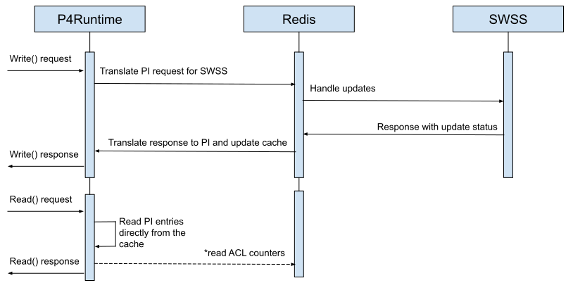

# P4RT Read Cache HLD

## Revision

Rev  | RevDate    | Author(s) | Change Description
---- | ---------- | --------- | ------------------
v0.1 | 02/06/2023 | Google    | Initial Version

## Definitions/Abbreviations

**P4**: Programming Protocol-independent Packet Processors (P4) is a domain-specific language for network devices, specifying how data plane devices (switches, NICs, routers, filters, etc.) process packets.

**P4RT**: P4 Runtime (P4RT) is a control plane specification for controlling the data plane elements of a device defined or described by a P4 program.

**PI**: Platform Independent representation of P4RT messages, which does not change if the P4 program changes.

## Overview

A P4 Runtime server provides multiple services for a controller to interact with the switch. However, during normal operation we expect most controllers will only rely on 3:

*   Stream - to ensure the connection is healthy, and send/receive PacketIO requests.
*   Write - to update forwarding state.
*   Read - to verify forwarding state.

Today the read performance can be significantly slower than the other operations, and because we only handle one outstanding request at a time this performance can affect other operations due to lock contention.

## P4RT Cache Design

The P4RuntimeImpl will maintain a table entry cache with values already stored in the PI format. This will eliminate any translations.

*   absl::flat\_hash\_map\<TableEntryKey, p4::v1::TableEntry> table\_entry\_cache\_

The cache will be updated for each P4RT App write request based on the P4Orch agents response.

**Write Operation** | **Status** | **Changes to the cache**
------------------- | ---------- | ------------------------
\<any\>             | FAIL       | Do nothing
INSERT              | SUCCESS    | Create a new PI entry
MODIFY              | SUCCESS    | Update an existing PI entry
DELETE              | SUCCESS    | Remove an existing PI entry

The P4Orch should not unilaterally update P4 entries which means we should not need to regularly monitor the AppDb for changes.
However, because there are 2 sources of truth we will also implement verification logic that ensures the cache and AppDb entries are in sync.
Operators can choose how often they wish to run these checks.
Specifically it will:

* Read all P4RT\_TABLE entries from Redis.
* Translate each entry back into its PI encoding.
* Compare the Redis entries with the cache.
* Report back any differences between existing entries, and any missing entries in either the cache or Redis.

While warmboot is not currently supported in the P4RT App.
When it is, we should be able to read any data back from Redis (i.e. same as we do today, and will also do for the verification logic) and use those values to pre-populate the cache before warmboot completes.

## Experiments

We ran a series of experiments to better understand the performance of read requests. 

### Experiment 1: Measuring end-to-end performance.

When handling a read request today the P4RT app will send multiple redis requests:

1. Get all the P4RT\_TABLE keys in the AppDb 
    1. (e.g. KEYS P4RT\_TABLE:\*) .
2. Individually read all the data for each table entry
    2. (e.g. HGETALL P4RT\_TABLE:FIXED\_IPV4\_TABLE{...}).
3. Individually read any counter data from the CountersDb) for ACL table entries.

In this experiment we programmed 16,000 flows (mostly IPv4) and measured the time end-to-end on the switch. We found that in total the request takes ~1.30s:

*   19ms is spent getting all 16,000 keys from the AppDb.
*   1.28s is spent reading all the data for the 16,000 entries.
*   The remaining time is spent parsing the request, verifying permissions, and packaging the final results for sending back to the client.

In conclusion, we see that the 16,000 individual reads from ReadisDB are our bottleneck. Further we see that the entire request takes >1s which is too long. The P4RT server handles only one outstanding request at a time (e.g. a write request will not be handled until the read request is completed) so the read performance can indirectly affect timely handling of other requests.

### Experiment 2: Breaking down performance of the individual reads.

Reading back individual table entries can be further broken down into the following phases:

1. Reading raw data back from Redis.
2. Translating the Redis values into PI for sending back to the controller.

In this experiment we programmed 22,152 flows, but varied the type (e.g. IPv4, IPv6, WCMP, RIFs, Neighbors, etc.). We found the end-to-end performance was similar at ~1.60s, and the breakdown for ONLY reading and translating the entries was:

*   1.27s for getting the raw data from Redis
*   0.29s for translating the raw data into PI for the controller.

In conclusion, the majority of time was spent getting the raw data from Redis. However, a non-negotiable amount of time was also spent translating the Redis data into PI.

### Experiment 3: Caching write requests.

In this experiment we programmed 22,152 flows and measured the read response time as well as the memory utilization of the cache.
The flow breakdown is as follows:

*   64 VRFs
*   64 RIFs
*   512 Neighbors
*   512 Nexthops
*   10,000 IPv4
*   10,000 IPv6
*   1000 WCMP groups with 2 members each.

Reading from the cache took 40ms. Compared to the current design which takes ~1.6s.
The memory utilization for the PI breakdown is as follows:

*   VRFs use \~1.8KB total space (\~29B per entry)
*   RIFs use \~4KB total space (\~61B per entry)
*   Neighbors use \~40KB total space (\~79B per entry)
*   Nexthops use \~47KB total space (\~91B per entry)
*   IPv4 use \~685KB total space (\~68B per entry)
*   IPv6 use \~805KB total space (\~80B per entry)
*   WCMP use \~100KB total space (\~100B per entry)
