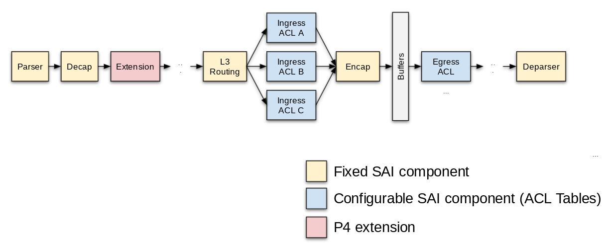

# PINS HLD

_Rev v0.1_

## Table of Contents
<!--
  Table of contents generated with markdown-toc:
    http://ecotrust-canada.github.io/markdown-toc/
-->
* [Revisions](#revisions)
* [Scope](#scope)
* [Definitions/Abbreviations](#definitions-abbreviations)
* [Overview](#overview)
    + [Open Source](#open-source)
    + [Opt-In Path Towards SDN](#opt-in-path-towards-sdn)
    + [Familiar Interface](#familiar-interface)
    + [Unambiguous Documentation](#unambiguous-documentation)
* [Requirements](#requirements)
* [Architecture Design](#architecture-design)
* [High-Level Design](#high-level-design)
    + [P4RT Application](#p4rt-application)
    + [P4 Programs & P4 Info](#p4-programs---p4-info)
    + [P4 APPL DB Tables](#p4-appl-db-tables)
    + [P4 Orchagent](#p4-orchagent)
    + [Application Level Responses](#application-level-responses)
    + [Packet IO](#packet-io)
    + [Repositories](#repositories)
* [SAI API](#sai-api)
* [Configuration and management](#configuration-and-management)
    + [CLI/YANG model Enhancements](#cli-yang-model-enhancements)
    + [Config DB Enhancements](#config-db-enhancements)
* [Warmboot and Fastboot Design Impact](#warmboot-and-fastboot-design-impact)
* [Restrictions/Limitations](#restrictions-limitations)
* [Testing Requirements/Design](#testing-requirements-design)
* [Open/Action items - if any](#open-action-items---if-any)
* [Supplementary Documents](#supplementary-documents)

<!-- Initial markdown generated using Docs to Markdown plugin for Google Docs -->

## Revisions

| Rev  | RevDate    | Author(s)          | Change Description
|------|------------|--------------------|--------------------
| v0.1 | 06/24/2021 | Google, ONF, Intel | Initial version

## Scope
This document describes the high level design of PINS - P4 Integrated Network Stack. It provides a detailed explanation of the components that need to be added and modified in the SONiC framework to support a remote controller to program the forwarding tables.

## Definitions/Abbreviations

**P4**: Programming Protocol-independent Packet Processors (P4) is a domain-specific language for network devices, specifying how data plane devices (switches, NICs, routers, filters, etc.) process packets

**P4RT**: P4Runtime (P4RT) is a control plane specification for controlling the data plane elements of a device defined or described by a P4 program.

**PINS**: P4 Integrated Network Stack (PINS) is a project that provides additional components and changes to SONiC and allows the stack to be remotely controlled using P4 and P4Runtime.

**SAI**: Switch Abstraction Interface (SAI) is a standardized interface which allows programming and managing different switch ASICs in a vendor-independent fashion.

**SDN**: Software Defined Networking (SDN) is the practice of disaggregating the data, control, and management planes of networks, and implementing the control and management planes outside the switch.


##  Overview
This document describes **PINS (P4 Integrated Network Stack)**, a P4Runtime (P4RT) based SDN interface for programming the forwarding tables through SAI APIs. P4Runtime for SAI is open sourceable, is opt-in, has familiar interfaces, enables rapid innovation, provides automated validation, and serves as unambiguous documentation.

A canonical family of P4 programs (included in the repository) documents the packet forwarding pipeline of SAI. Remote SDN controllers will use these P4 programs to control the switch forwarding behavior over the P4RT API.

### Open Source
The family of P4 programs, the P4RT server, the orchagent code to translate from P4RT to SAI, the validation framework, and any P4 compiler extensions will all be open sourced. The user and vendor specific aspects of a switch pipeline are cleanly separated into extension and configurable tables.

### Opt-In Path Towards SDN
The P4RT Application is completely opt-in. If the P4RT interface is not used, the remaining parts of SONiC will continue to work the way it does today. This new interface allows interested operators to gradually move towards SDN without needing a full-fledged SDN controller right from the start. It is possible to continue relying on SONiC-provided protocols for some aspects, and to start using P4RT for others.

### Familiar Interface
The family of P4 programs models the SAI forwarding pipeline, making the P4RT interface familiar to anyone who has worked with SONiC/SAI before. The P4RT interface provides  essential networking features (L2 bridging, L3 routing, ACLs, etc.) allowing users to quickly get up to speed on how to use this new API.

### Unambiguous Documentation
The SAI P4 programs will serve as an unambiguous documentation of the SAI pipeline. This will help to minimize differences between SAI implementation provided by various vendors, and serve as a reference for the community at large. The P4 program for L3 routing will be modeled after the SAI pipeline for L3 (the full SAI pipeline is described [here](https://github.com/opencomputeproject/SAI/blob/master/doc/object-model/pipeline_object_model.pdf)). 

## Requirements
The following components are targeted for the SONiC 2021-11 Release
*   P4RT application server that runs in its own container. 
*   P4RT-Orchagent that runs as part of SWSS
*   P4 program

The following functionality will be available 
*   P4RT clients can use P4Runtime to program IP route entries, next hop members and groups, and ACL entries to drop or punt packets to the control plane.
*   P4RT clients can program ACLs to punt packets received in the ingress pipeline. These packets will be punted to the P4RT application running in the switch and will be forwarded to the client over grpc.
*   Users can introduce custom private extensions to the pipeline by adding other elements to the P4 program.

Additional functionality will be made available in future releases.

## Architecture Design

SONiC is structured into various containers that communicate through multiple logical databases via a shared Redis instance. To add SDN support, PINS introduces a few new components into the SONiC system:
*   P4RT: An application that receives P4 programming requests from the controller and programs the requests to the lower layers.
*   P4RT tables: a new APPL DB table that defines the P4 programming requests.
*   P4orch: A new orch that programs the P4RT table from APPL DB to ASIC DB. It also sends response notifications to P4RT and manages the APPL STATE DB.
*   APPL STATE DB: A new DB for applications to query the system status. It has the same schema of the APPL DB.


The P4RT application listens to a remote SDN controller and creates entries in the APPL and CONFIG databases. Following the SONiC architecture, the P4RT application writes its output to a new table in the APPL database. From there, the new P4RT orchestration agent (orchagent) picks up the changes and writes the entries into the existing ASIC tables, where they get picked up by syncd. This path is highlighted in solid purple in the following figure. There is an alternative path (in dotted pink) that some SAI objects might choose to take, which is going through existing APP database tables, and then following the existing agents in the SWSS container down to the ASIC database. Note that whether the dotted pink or solid purple path is taken is a static decision made by the implementer of the P4RT app. For every kind of object, we statically decide which path is taken, and then only implement that path. The P4 program is not changed due to this change, it is an implementation detail of the switch not exposed to the outside (the controller, or even the vendor layer).


## High-Level Design
The high level architecture can be broken down into a set of modules that interact and work together to provide the functionality.

### P4RT Application
The P4RT application runs in its own container and supports multiple gRPC client sessions. The application is responsible for parsing the requests from its clients, verifying them and writing the intent to the new P4 tables in APPL DB and notifying the clients of the eventual success/failure of the intent.  The P4RT application also supports read requests from its clients. The read requests provide clients with current state information of the switch. More detailed information regarding the P4RT application is provided in the supplementary document [P4RT and APPL DB Schema](#bookmark=id.4o11cru31903).

### P4 Programs & P4 Info
The P4RT Application comes along with a canonical family of P4 programs (also open-source) that outline the packet forwarding pipeline of SAI. Remote SDN controllers will use these P4 programs to control the switch forwarding behavior over the P4RT API. The SAI P4 programs will serve as an unambiguous documentation of the SAI pipeline. This will help to minimize differences between SAI implementation provided by various vendors, and serve as a reference for the community at large.

The SAI pipeline is modeled as a P4 program which can be compiled using a P4 compiler ([https://github.com/p4lang/p4c](https://github.com/p4lang/p4c)). The output of the compiler is a P4Info file with a description of the various tables and other objects in the P4 program. This is used by the P4RT Application. Assuming a switch vendor supports the SAI pipeline nothing more is needed. Vendors supporting a P4 backend may use other outputs from the compiler.



Fixed SAI components are modeled after the [SAI Pipeline Object Model](https://github.com/opencomputeproject/SAI/blob/master/doc/object-model/pipeline_object_model.pdf).

Yellow boxes represent the fixed components of the SAI pipeline. These will be the same in every P4 program. Blue boxes represent the configurable components of the SAI pipeline, namely Access Control Lists (ACLs). Every ACL follows the same basic schema, but can be customized for the use-case by changing the match fields and actions (subject to restrictions w.r.t. what SAI allows).

### P4 APPL DB Tables
This is the interface between the P4RT app and the P4RT orch agent. The set of tables are collectively called the _P4RT Tables_. 

In SONiC, the APPL DB contains high level details of the programming as compared to the ASIC DB tables. Unlike traditional SONiC applications, the SDN controller provides low level details and such a level of detailed programming is not supported by most of the existing APPL DB tables.

To overcome this limitation, the PINS architecture defines new APPL_DB tables that allow more detailed definitions. The P4RT application writes to these tables. The new tables are written by the P4RT application and consumed by the P4RT Orchagent. 

Readability is an important criteria for SONiC DB tables. The new tables are no different in this respect and use consistent formatting. The new tables are named with the prefix P4RT to easily identify them as P4RT application tables.  The naming follows the convention of `P4RT:<TableType><TableName>` where TableType is of FIXED or configurable (only ACL for now) and TableName is the specific table in the SAI pipeline specification like router interface, neighbor, nexthop, IPV4/IPV6 tables etc.

An example table definition is shown below.

```
P4RT:FIXED_NEXTHOP_TABLE:{"match/nexthop_id":"node-1234:eth-1/2/3"}
  "action" = "set_nexthop"
  "param/router_interface_id" = "intf-eth-1/2/3"
  "param/neighbor_id" = "10.0.0.22" 
  "controller_metadata" = "..."
```

Detailed information regarding the schema of the tables and a set of guidelines for consistency are provided in the supplementary documentation on [P4RT and APPL DB Schema](#broken-todo).

### P4 Orchagent
The P4Orchagent processes the entries added to the new P4 tables in APPL DB by the P4RT application, parses and resolves them and then invokes the necessary SAI APIs to create ASIC DB entries. SAI objects created by the P4RTOrch could refer to SAI objects created by other orchagents. In these cases,  the P4Orchagent will interact with the corresponding orchagents to reference those objects and increase reference counters where necessary. Detailed information regarding the operation of the P4 Orchagent is provided in the supplementary documentation on [P4 Orchagent](#broken-todo).

### Application Level Responses
PINS introduces the concept of application level responses. SONiC currently supports synchronous communication between SWSS and Syncd containers. PINS extends synchronized communication to applications.

Most SDN controllers require an acknowledgement of success or failure for each programming request. Subsequent programming from the controller depends on the response. SDN controllers are intelligent and can adapt to failures quickly. If one of the switches encounters a failure, the controller can utilize the other switches to achieve its goals. 

The controller requires state information from the switches in order to quickly identify any failures. This is accomplished by the addition of application level responses and state. More information regarding this is provided in the supplementary documentation [Response path and Application DB](#broken-todo).

### Packet IO
P4RT clients can program ACLs to punt packets received in the ingress pipeline. These packets will be trapped and punted to the P4RT application running in the switch and will be forwarded to the client over grpc. 

SONiC relied on basic packet I/O support that uses netdev ports to send and receive packets. P4Runtime applications require additional packet attributes like the target egress port which are not available via netdev. Similarly directed Tx from application level is not currently supported in the SONiC framework. This is required to support scenarios where the remote SDN controller needs to send a packet via one of the front panel ports of the switch.

To support the above requirements, a model similar to sFlow is used. The receive solution creates a netlink type host interface. It programs a user defined trap for packets that are interesting to the controller and maps them to the netlink host interface. A generic ASIC independent model is defined for passing parameters such as “target egress port” to the application container. A detailed description of the receive path is present in the supplementary document on [Packet IO](#broken-todo).

### Repositories
This design adds the following new repositories:
*   P4RT Application

It also has modifications in the following repositories:
*   SWSS
*   SONiC Build Image

## SAI API
There are no changes to SAI. 

For programmable hardware targets, PINS introduces an additional SAI header, saip4ext.h, to map user-defined private P4 extensions to vendor SAI implementations. More details on saip4ext.h can be found in the supplemental document [P4 Extensions for SAI](#broken-todo).

## Configuration and management

### CLI/YANG model Enhancements
There are no CLI changes.

### Config DB Enhancements
There are no Config DB changes.

## Warmboot and Fastboot Design Impact
Similar to other orchagents, the P4Orchagent needs to perform actions for successful warm boot and fast boot operation. These changes are being planned for the next phase ( next SONiC release). In this phase, warmboot and fastboot features will not be supported for objects created through the P4RT application.

When the P4RT application is not used, warm boot and fastboot will continue to operate as before. There will be no impact on existing warmboot and fastboot design.

## Restrictions/Limitations
In this introductory phase, limited functionality and features will be supported through the P4RT application. The details of supported features are provided in the requirements section.


## Testing Requirements/Design
The entire PINS code, including the P4RT Application, P4 orchagent, etc is well unit tested. The coverage goal is at least 90% which is already achieved. Integration tests will be added in the following release.

## Open/Action items - if any
None
