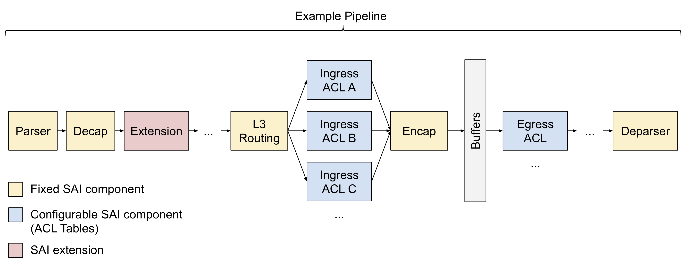
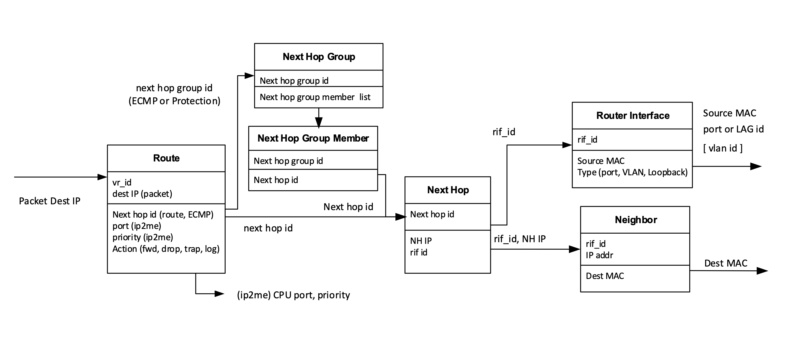

# SAI P4

_Rev v0.1_


## Table of Content

- [Revision](#revision)
- [Scope](#scope)
- [Definitions/Abbreviations](#definitions-abbreviations)
- [Overview](#overview)
- [SAI P4 in Detail](#sai-p4-in-detail)
  - [Fixed Elements of the SAI Pipeline](#fixed-elements-of-the-sai-pipeline)
  - [Configurable Elements of the SAI Pipeline](#configurable-elements-of-the-sai-pipeline)
  - [Extensions to the SAI Pipeline](#extensions-to-the-sai-pipeline)
- [Advantages](#advantages)
  - [Unambiguous and Machine-Readable Specification](#unambiguous-and-machine-readable-specification)
  - [Automated Validation](#automated-validation)
  - [Living Documentation](#living-documentation)
  - [Familiar Interface](#familiar-interface)
  - [Rapid Innovation](#rapid-innovation)

<!--
  Table of contents generated using
    http://ecotrust-canada.github.io/markdown-toc/
-->


## Revision

Rev  | RevDate    | Author(s)   | Change Description
---- | ---------- | ----------- | ------------------
v0.1 | 09/01/2021 | Steffen Smolka (Google), Google, ONF | Initial Version


## Scope

This document describes the high-level design of a canonical family of P4 programs that model the packet forwarding pipeline of SAI, and thus, PINS switches.


## Definitions/Abbreviations

**P4**: A [standardized](https://p4.org/specs/), domain-specific language for programming the forwarding pipelines of programmable packet processors, or [modeling the forwarding pipelines of fixed-function packet processors](https://www.youtube.com/watch?v=VoUKAIg4zNE).

**P4RT**: P4Runtime, a [standardized](https://p4.org/specs/), RPC-based API to remotely program dataplane elements of a device described by a P4 program.

**PINS**: P4 Integrated Network Stack, a SONIC-based switch stack allowing switches to be programmed remotely via P4Runtime.

**SAI**: Switch Abstraction Interface, a standardized API to program networking ASICs from various vendors in a uniform way.

**SAI pipeline**: The logical packet forwarding pipeline defined by SAI and the SAI [Pipeline Object Model](https://github.com/opencomputeproject/SAI/blob/master/doc/object-model/pipeline_object_model.pdf).

**SAI P4**: A canonical family of P4 programs modeling the SAI pipeline.

**SDN**: Software-defined networking, a network architecture in which a logically centralized controller programs the forwarding behavior of the switches in a network via a standardized API.


## Overview

This document describes the high-level design of a canonical family of P4 programs, called *SAI P4*, that model the packet forwarding pipeline of SAI following the [SAI Pipeline Object Model](https://github.com/opencomputeproject/SAI/blob/master/doc/object-model/pipeline_object_model.pdf).

Recall that PINS is an SDN switch stack, meaning it can be remote-controlled. In the context of PINS, SAI P4 serves as the definition of the API for remote controlling the forwarding behavior of the switch.

The key motivation behind using P4 to specify PINS's forwarding API is to have an unambiguous and executable specification that can be understood both by humans and machines. This enables high-coverage, automated testing.

The family of SAI P4 programs all share a common set of libraries modeling the fixed elements of the SAI pipeline; they differ in how they instantiate the configurable elements of the SAI pipeline, such as ACLs and hashing parameters.

In more detail:

1. Each SAI P4 instantiation is an exact specification of the API exposed by PINS to program the switch forwarding behavior. In particular, it captures precisely the tables exposed by PINS through the P4Runtime API. This includes a specification of when a table entry is well-formed and will be accepted by the switch, and when it may be rejected (e.g., due to being malformed or exceeding the resource guarantees of the switch). Remote SDN controllers will use this API to program the switch forwarding behavior. PINS must implement the API following the [open P4Runtime standard](https://p4.org/specs/). We use automated validation tools to enforce that PINS is strictly standard-compliant.

2. Each SAI P4 instantiation is an executable model of the forwarding behavior of PINS, following the [open P4 language standard](https://p4.org/specs/). PINS must forward packets according to this model. We use automated validation tools to enforce that PINS is model-compliant.

3. Each SAI P4 instantiation fixes the configurable components of the SAI pipeline (i.e., the ACLs). It can also fix various  parameters, e.g. how to hash packets for WCMP or how many table entries must be supported at a minimum for various tables. A compilation artifact of the program, called P4Info, will be pushed to the switch at initialization time to configure these parameters. 

4. Optionally, a SAI P4 instantiation may define SAI extensions -- this is discussed separately in the *SAI P4 Extensions HLD*.

The diagram below illustrates an example P4 program:



Yellow boxes represent the fixed components of the SAI pipeline. These will be the same in every P4 program. Blue boxes represent the configurable components of the SAI pipeline, namely Access Control Lists (ACLs). Every ACL follows the same basic schema, but can be customized for the use-case by changing the match fields and actions (subject to restrictions w.r.t. what SAI allows). Red boxes represent SAI extensions that are provided by vendors/network-operators and accessed through P4RT.


## SAI P4 in Detail

SAI P4 is written in P4_16.

### Fixed Elements of the SAI Pipeline

SAI P4 provides a set of common P4 libraries -- shared among all SAI P4 instantiations -- that model the fixed elements of the SAI pipeline as P4 tables, following the [SAI object model](https://github.com/opencomputeproject/SAI/blob/master/doc/object-model/pipeline_object_model.pdf).
In particular, the P4 library for L3 routing defines tables for all objects in the SAI L3 object model:



For instance, the P4 library for L3 routing includes an `ipv4_table` to model `Route` objects matching on an IPv4 destination:

```P4
table ipv4_table {
  key = {
    // Sets `vr_id` in `sai_route_entry_t`.
    local_metadata.vrf_id : exact;
    // Sets `destination` in `sai_route_entry_t` to an IPv4 prefix.
    headers.ipv4.dst_addr : lpm;
  }
  // Sets `SAI_ROUTE_ENTRY_ATTR_PACKET_ACTION`.
  actions = {
    drop;
    set_nexthop_id;
    set_wcmp_group_id;
  }
  const default_action = drop;
  // The SIZE macro used below default to 0.
  // It can be redefined by SAI P4 instantiations as desired, to better reflect
  // the capabilities of the hardware.
  size = ROUTING_IPV4_TABLE_MINIMUM_GUARANTEED_SIZE;
}
```

There are also an `ipv6_table`, `wcmp_group_table`, `nexthop_table`, `router_interface_table`, etc. in the same library. When PINS receives a table entry for one of these tables via P4RT, it knows how to map it to the corresponding SAI APIs.

There are similar P4 libraries to model the Parser, Decap, Encap, Deparser, etc.

### Configurable Elements of the SAI Pipeline

Network-operator specific ACLs use a common SAI ACL template, parameterized with use-case specific, annotated matches and actions. For example:

```P4
control ingress_acl(inout parsed_packet_t hdr,
                    inout local_metadata_t local_metadata,
                    inout standard_metadata_t standard_metadata) {

  @sai_action(SAI_PACKET_ACTION_FORWARD)
  action forward() {}

  @sai_action(SAI_PACKET_ACTION_DROP)
  action drop() {
    mark_to_drop();
  }

  @sai_acl(INGRESS)
  table ingress_acl_table {
    key = {
      hdr.ipv4_base.src_addr: ternary
        @sai_field(SAI_ACL_ENTRY_ATTR_FIELD_SRC_IP);
      hdr.ipv4_base.protocol: ternary
        @sai_field(SAI_ACL_ENTRY_ATTR_FIELD_IP_PROTOCOL);
      standard_metadata.ingress_port: ternary
        @sai_field(SAI_ACL_ENTRY_ATTR_FIELD_IN_PORT);
    }
    actions = {
      forward;
      drop;
    }
    size = INGRESS_ACL_TABLE_SIZE;
  }
}
```

The `@sai_action` and `@sai_field` annotations instruct PINS how to map the P4 actions and keys to their SAI equivalents.

### Extensions to the SAI Pipeline

SAI extensions are not in scope for this document and are explained separately in the  *SAI P4 Extensions HLD*.


## Advantages

### Unambiguous and Machine-Readable Specification

SAI P4 is an unambiguous specification of the SAI pipeline. This specification can be executed using P4 simulators or analyzed by validation tools for automated testing. This will help to minimize differences between SAI implementations provided by different vendors, and serve as a reference for the community at large.

### Automated Validation

P4RT is a behavioral interface, meaning that every P4RT operation has precisely defined meaning through the associated P4 program. This is in contrast to non-behavioral interfaces, like BGP, gNMI, etc, where the meaning of operations is only defined in English. The behavioral nature of P4RT can be used to aid validation. For example, one can first analyze a P4 program to automatically generate packets to hit every table entry installed on the switch, and one can then verify that the switch forwards these packets correctly, by comparing the switch's output packets with the output packets of a P4 simulator.

### Living Documentation
P4 programs are highly incentivized to stay up-to-date because they can be used for automated validation and compiled and executed on a programmable chip. This quality makes them invaluable as documentation since one can always expect them to exactly capture the most recent state of the system.

### Familiar Interface

The SAI P4 programs models the SAI forwarding pipeline, making their P4RT interface familiar to anyone who has worked with SONiC/SAI before. The P4RT interface provides all the essential networking features (L2 bridging, L3 routing, ACLs, tunnels, etc.) right out of the box, allowing users to quickly get up to speed on how to use this new API.

### Rapid Innovation

Network administrators often cannot exploit innovative hardware features, because it takes a long time for these features to be exposed through SAI, and to be propagated through the NOS and standards based protocols (like BGP). This proposal is designed for rapid innovation, where new extensions can be modeled in P4 and then be exposed rapidly. For example, on a programmable chip with a P4 compiler, network administrators could just extend the P4 program, recompile it, and immediately gain access to the new hardware capabilities. On a fixed function chip, a vendor can extend the P4 program to expose new hardware capabilities.
