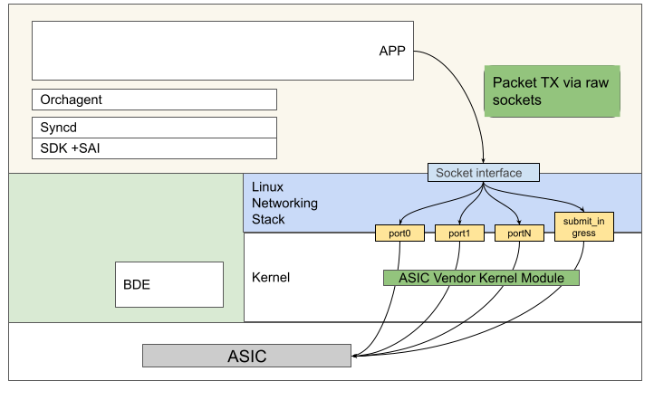

# Send to Ingress HLD

## Table of Content

* [Table of Content](#table-of-content)
* [Revision](#revision)
* [Scope](#scope)
* [Definitions/Abbreviations](#definitions-abbreviations)
* [Overview](#overview)
  + [Direct transmit](#direct-transmit)
  + [Ingress pipeline inject](#ingress-pipeline-inject)
* [Requirements](#requirements)
* [Architecture Design](#architecture-design)
* [High-Level Design](#high-level-design)
  + [CONFIG DB schema](#config-db-schema)
  + [SWSS](#swss)
  + [Multi-Asic consideration](#multi-asic-consideration)
* [SAI API](#sai-api)
* [Configuration and management](#configuration-and-management)
  + [CLI/YANG model Enhancements](#cli-yang-model-enhancements)
  + [Config DB Enhancements](#config-db-enhancements)
* [Warmboot and Fastboot Design Impact](#warmboot-and-fastboot-design-impact)
* [Restrictions/Limitations](#restrictions-limitations)
* [Testing Requirements/Design](#testing-requirements-design)
  + [Unit Test cases](#unit-test-cases)
  + [System Test cases](#system-test-cases)
* [Open/Action items - if any](#open-action-items---if-any)

## Revision

Rev  | Rev Date   | Author(s)              | Change Description
---- | ---------- | -----------------------| ------------------
v0.1 | 10/25/2022 | Yilan Ji, Stephen Wang | Initial version

## Scope

Send to ingress feature in GPINs is to support [Packet I/O](https://github.com/sonic-net/SONiC/blob/master/doc/pins/Packet_io.md) transmit path that injects packets into the dataplane by the CPU. This doc is to extend the availability of ingress inject packet I/O to all applications in Packet I/O Transmit Path design.

## Definitions/Abbreviations

**PINS**: P4 Integrated Network Stack (PINS) provides a remote interface to SAI using P4.

## Overview

Packet I/O transmit involves taking care of 2 types of packets that have to be transmitted: Direct transmit and Ingress pipeline inject.

### Direct transmit

If the sender(applications like LACP or P4RT) already know the egress port that the packet should be sent out on, it is done by placing the packet on the socket interface of the corresponding netdev interface.

### Ingress pipeline inject

In the SDN scenario, the controller has the complete view of the whole network and programs the switch ASIC with the optimized routing rules that the switch NOS is not aware of. Also in some other scenario, that the ASIC has a better understanding of the current bandwidth/queue depth of each port that it can choose a better egress port from the ECMP/WCMP group. The sender application on the switch would like to inject the packet to the ASIC’s ingress pipeline to allow the switch ASIC to make the final decision.

Injecting packets to the ingress pipeline can also be used as a way to test ASIC routing behavior in the standalone test environment.

## Requirements

* Provide configuration support of send to ingress in the port table.

## Architecture Design



Details of the transmit path in GPINs Packet I/O can be found in this [HLD](https://github.com/sonic-net/SONiC/blob/master/doc/pins/Packet_io.md#transmit-path).

## High-Level Design

This HLD introduces a new “Send To Ingress” port type in the port table that SWSS will create a corresponding netdev/host interface. Any application can inject the packet to the ASIC’s ingress pipeline and let the ASIC decide which port to send packet out based on the routing table and current state of the network.

Note that the Send to Ingress host interface is only for packet out as it is only used in TX path, no packet ins are expected.

### CONFIG DB schema

Add knob in PORT table in CONFIG DB or config_db.json to enable send to ingress

```
  "PORT": {
    "Ethernet0": {
      "admin_status": "up",
      "alias": "NoAliasEth0/1",
      "index": "1",
      "lanes": "9,10,11,12,13,14,15,16",
      "mtu": "9100",
      "speed": "400000"
    },
    …
  },
  "SEND_TO_INGRESS_PORT": {
     "SEND_TO_INGRESS": {}
  },
```

### SWSS

1. PortsMgr will process `SEND_TO_INGRESS_PORT|SEND_TO_INGRESS` in config_db.json during initialization, or add the `SEND_TO_INGRESS_PORT|SEND_TO_INGRESS` entry in CONFIG DB during runtime. It will be mapped to APPL_DB `SEND_TO_INGRESS_PORT_TABLE:SEND_TO_INGRESS` table entry.
2. PortsOrch then picks up the entry in `SEND_TO_INGRESS_PORT_TABLE` in APPL DB and calls `sai_hostif_api->create_hostif` or `sai_hostif_api->delete_hostif` to  add/delete the send_to_ingress netdev.

```
sai_attribute_t attr;
vector<sai_attribute_t> &ingress_attribs;

attr.id = SAI_HOSTIF_ATTR_TYPE;
attr.value.s32 = SAI_HOSTIF_TYPE_NETDEV;
ingress_attribs.push_back(attr);
attr.id = SAI_HOSTIF_ATTR_NAME;
auto size = sizeof(attr.value.chardata);
strncpy(attr.value.chardata, send_to_ingress_name.c_str(), size - 1);
attr.value.chardata[size - 1] = '\0';
ingress_attribs.push_back(attr);
// If this isn't passed in true, the false setting makes
// the device unready for later attempts to set UP/RUNNING
attr.id = SAI_HOSTIF_ATTR_OPER_STATUS;
attr.value.booldata = true;
ingress_attribs.push_back(attr);
// Get CPU port object id to signal send to ingress
attr.id = SAI_SWITCH_ATTR_CPU_PORT;
auto status = sai_switch_api->get_switch_attribute(gSwitchId, 1, &attr);
if (status != SAI_STATUS_SUCCESS)
{
    SWSS_LOG_ERROR("Unable to get CPU port");
    return false;
}
attr.id = SAI_HOSTIF_ATTR_OBJ_ID;
ingress_attribs.push_back(attr);
sai_status = sai_hostif_api->create_hostif(&m_send_to_ingress_id,
                                               gSwitchId,
                                               (uint32_t)ingress_attribs.size(),
                                               ingress_attribs.data()
                                               );
```

SEND_TO_INGRESS port adds a netdev, similar to the behavior for the physical ports in the PORT table in CONFIG DB. As the PORT table in CONFIG DB [only holds physical ports](https://github.com/sonic-net/sonic-swss/blob/master/doc/swss-schema.md#port_table-1), the new type of port introduced is added in the new `SEND_TO_INGRESS_PORT` table. Users can choose to enable the SEND_TO_INGRESS port or not by editing the entry in `SEND_TO_INGRESS_PORT` table.

Vendor work is needed to enable the creation of the “SEND_TO_INGRESS” port and allow packets in the CPU port. Current support of the creation of netdev type hostif is only for physical port, vlan or LAG interface, vendors need to extend the SAI hostif create API to allow creation of a netdev port associated with the CPU port.

### Multi-Asic consideration

Per [SONiC multi asic HLD](https://github.com/sonic-net/SONiC/blob/master/doc/multi_asic/SONiC_multi_asic_hld.md), each ASIC will have its own replica of SWSS/SYNCD and configuration. So each ASIC can create its own send to ingress port. Each netdev will be in their own namespace.

## SAI API

N/A

## Configuration and management

New configuration of send to ingress will be added in the port table as mentioned in the design.

### CLI/YANG model Enhancements

N/A

### Config DB Enhancements

N/A

## Warmboot and Fastboot Design Impact

N/A

## Restrictions/Limitations

N/A

## Testing Requirements/Design


### Unit Test cases

PortsMgr and PortsOrch behaviors will be tested in swss portsorch_ut and pytest.

### System Test cases

System Packet I/O behaviors will be tested in Thinkit end-to-end testing.

## Open/Action items - if any

N/A
