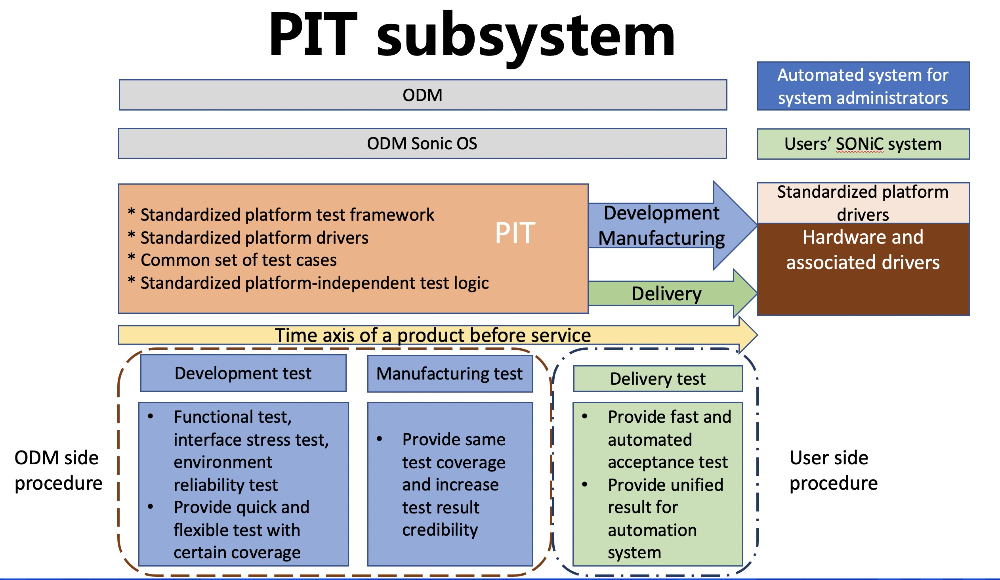
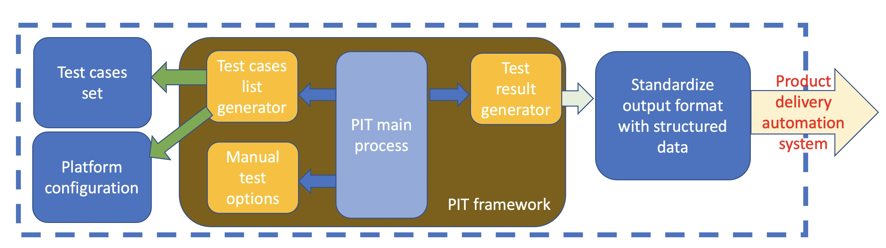
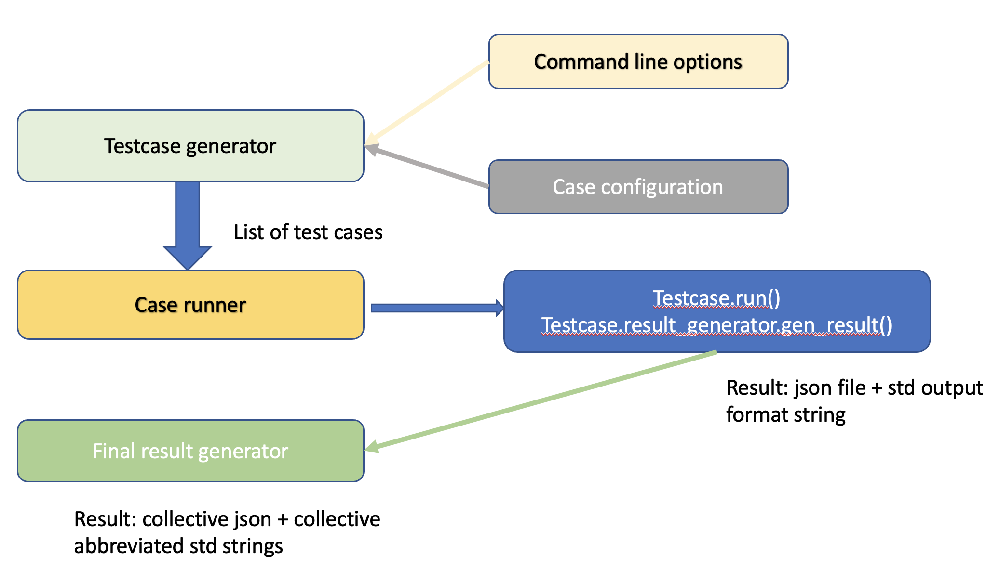
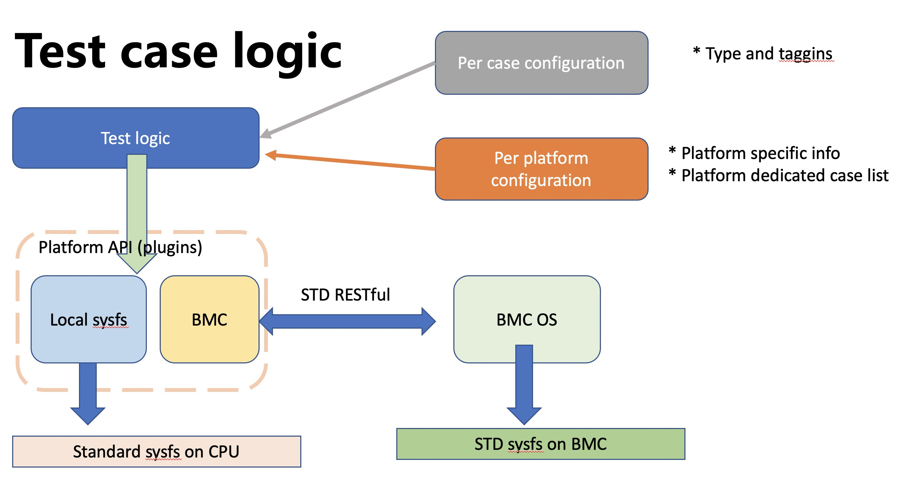
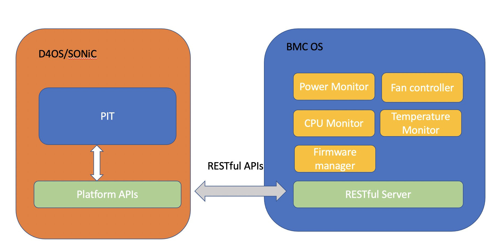

# Platform Integration Test High Level Design

### Document History

Date        Version     Authors                                 Description
2022/03/01  V0.1        Clark Lee (guizhao.lh@alibaba-inc.com)  Initial version
2022/04/29  V0.2        Clark Lee (guizhao.lh@alibaba-inc.com)  Detail added for platform plugins, RESTful APIs

# Scope

This document describes a subsystem for Platform Integration Test, aka. PIT. PIT system concentrates on standardize and automate white-box switch hardware functionalities verification, along with their driver and firmware. As a result, it will be easier to port SONiC on a new white-box platform which is PIT-verified. Current scope covers all hardware components, such as CPU, memory, SSD, power system, fan, system sensors of various kind, and logical device firmware management, BMC subsystem etc.

# 1. Platform Integration Test (aka. PIT) background

In the blooming SONiC community, lots of users build their software on open hardware（especially white-box switches）. As the devices hardware are built by ODM vendor, not end users (users' SONiC development team), it's necessary to have a systematic method to verify whether the hardware, firmware (such as CPLD, FPGA, BMC, BIOS) and their drivers meet the users' requirement. At this point, PIT system (Platform Integration Test) is introduced for this purpose.

PIT system could lighten up workload for both ODM and end-user because it not only automates hardware, firmware, driver verification efforts, but also it acheive this in a platform independent way, ias it provide a set of platform APIs to unify platform functions, so that hardware from different ODM have a unique view to the users. PIT is the first standard target to simplified SONiC porting on white-box switch in SONiC community. The simplified porting job may attract more and more user and ODM partners to join the SONiC community.

# 2. Platform Integration Test subsystem overview

## 2.1 PIT feature overview

PIT is a sub-system, dedicated for the verification of white-box switch hardware, firmware, and driver.
PIT provides:

  1) An automation test framework for platform hardware, firmware, and driver test;
  2) A set of test cases written in platform-independent (CPU, ASIC, product) manner;
  3) A set of platform APIs to provide hardware function abstraction (complementary to SONiC platform APIs), which help test case logic platform-independent.

## 2.2 PIT deploy scenario

Figure2-1 shows where PIT is used.

Figure 2-1

PIT runs in SONiC variant(which is called D4OS, aka. Datacenter Development Diagnostic and Delivery OS, SONiC based, tailored to focus on the developing process of a switch product, co-develop by ODM and users, added users' tools for delivery process, system default configuation, etc). It can be deployed in 3 stage of a switch device developing time axis. Development stage and manufacturing stage which take place in ODM side. Delivery stage which happen on the IDC users. The verified hardware drivers can be added and run in the user SONiC system without changes.

### 2.2.1 Development test

This happens on the ODM vendor side, product development stage. PIT can be used to:

  1) Run as daily regression test to check if any new feature breaks the other feature.
  2) Run in a stress test for any given function.
  3) Run in environment reliability test, check if environment changes (such as high/low temperature, humidity changes) affect device functions.

### 2.2.2 Manufacturing test

This happens on the ODM vendor side, product manufacturing stage. PIT can be used to:

  1) Run in the process of manufacturing, PIT test can automatically test the devices, with exactly the test logic from user requirement, avoiding mis-understanding between users' requirement and ODM implementation.
  2) Provide users' minimum test coverage.

### 2.2.3 Delivery test

This happens on the user side, product delivery stage. PIT can be used to:

  1) Provide a fast and automated test for the product, checking the basic functionality of the device hardware, firmware and drivers.
  2) Provide a structured data as the result of the test, and it can be easily checked by the users' acceptance checking system.

# 3. PIT system design

## 3.1 System view

PIT is supposed to run in a docker, as a component of SONiC. It can be enable/disable in the build process. Also, it's a docker, so it can be deploy/upgrade flexibly on demands.

## 3.2 Objective

* PIT should run in different scenario, with simple user input.
* PIT should use exactly the same test logic for different product.
* PIT should generate standard outputs for specific test item.
* PIT should be extensible.

## 3.3 PIT software architecture

Figure 3-1 shows the high-level software architecture of PIT.

Figure 3-1

PIT main process parses and interpret user input command and options, invoke test case list generator to generate test case list. The later reads platform configuration and test case congiuration, traverse test case set and selects those cases with desired tags, then generates final list of test cases. Then main process iterates each case selected, run it, then invoke test result generator to generate test result. After all test cases in the list finished, result generator gother them and form a collective final result. The result is passed to users' automation system for acceptance test.

Besides auto generated test cases list, PIT also support single case or user specific case list as input.

## 3.4 PIT component detailed
Figure 3-2 shows the softawre component of PIT.

### 3.4.1 Test cases list generator

Test case list generator is used to generate a list of test cases, it parses users' input options, product specific platform configuration, and generate test case list from all test case database. This is used in the daily regression test and delivery test scenario.

Each test case has a list of tags, denoting type, stage, etc. Current tag for stage includes: production, development, delivery. Tags for type include: auto, manual, utility. Other tags can be added, to provide extra information so that they can be grouped together for new scenario.

### 3.4.2 Manual test options

Alternatively, user can specify which case or a list of test cases to run. Optionally, users are able to specify how many times to run the cases. This is used in development stage for developers to debug/test a single feature, or be used in stress test scenario.

### 3.4.3 Test result generator

Test result is generated per case. There are 2 result formats:

  1) Formatted strings, contains test case name, ID, result, type, etc. This standardized output is used in manufacturing process, so that output strings can be mapped to hardware/software/firmware/configuration fault easily.
  2) Structured result, per current design, we're using JSON format, as it's commonly used and can be interfaced with users' automated acceptance checking system in the product delivery process.

Besides test case result, a collective result is also generated, as a summary of the whole test. Similar to per test case result, it composes of standardized output string and structured data format (JSON).

Figure 3-3 shows an example of final test result JSON.

Figure 3-3

### 3.4.4 Test case logic

Figure 3-4 shows the test case logic and interaction

Figure 3-4

Each test case has a configuration file, containing information such as test case name, description, type, and tag list.
Each platform has a platform configuration file, containing platform specific (product specific) information such as CPU architecture, boot loader, CPU error monitor capability, peripheral related information (e.g. FAN number, PSU control options, etc.).
Logic of each test case should be platform-independent. From figure 3-3, test logic configures or fetch information using platform APIs. These platform APIs' implementation should be standardized if the drivers are standardized(optional). In case of some system with BMC integrated, platform APIs will access this information via a set of RESTful APIs to BMC. Test case will load per case configuration and get platform specific information during test. These ensure the test logic itself platform independent.

# 4. Platform plugin APIs

## 4.1 Extended platform plugins

Platform plugins are intended to provide abstraction for device function, in order to test full functionality, we extend some APIs for testing purpose. Most of them are not intended to be used in a running deployment , they are defined to have fine grain test only. Extended/added plugins are as follow:

* device/$platform_name/plugins/sfputil.py
* device/$platform_name/plugins/fanutil.py
* device/$platform_name/plugins/psuutil.py
* device/$platform_name/plugins/sensorutil.py
* device/$platform_name/plugins/fwmgrutil.py
* device/$platform_name/plugins/led_control.py
* device/$platform_name/plugins/bmcutil.py
* device/$platform_name/plugins/mgmt.port.py
* device/$platform_name/plugins/fruidutil.py

# 5. BMC component

## 5.1 System with BMC support

Some systems are built along with a BMC subsystem. The BMC subsystem provide extra functionality for management/maintenances. Usually, systems with BMC may offload some hardware monitoring feature, power management feature, firmware management feature to BMC. As such, it is necessary to have a standardized way to communicate between SONiC and BMC subsystem. Hence, we define a set of RESTful APIs, so that the plugins implementation can be unified.

Figure 5-1

## 5.2 RESTful APIs

These RESTful APIs are defined to control various hardware component through BMC. Because these RESTful APIs are standardized, the platform plugins may have the same implementation over these functions.

* api/fan/info
* api/fan/number
* api/psu/info
* api/psu/number
* api/sensor/info
* api/bmc/info
* api/bmc/nextboot
* api/bmc/reboot
* api/bmc/status
* api/firmware/biosnextboot
* api/firmware/upgrade
* api/firmware/refresh
* api/firmware/cpldversion
* api/misc/biosbootstatus
* api/bmc/raw
