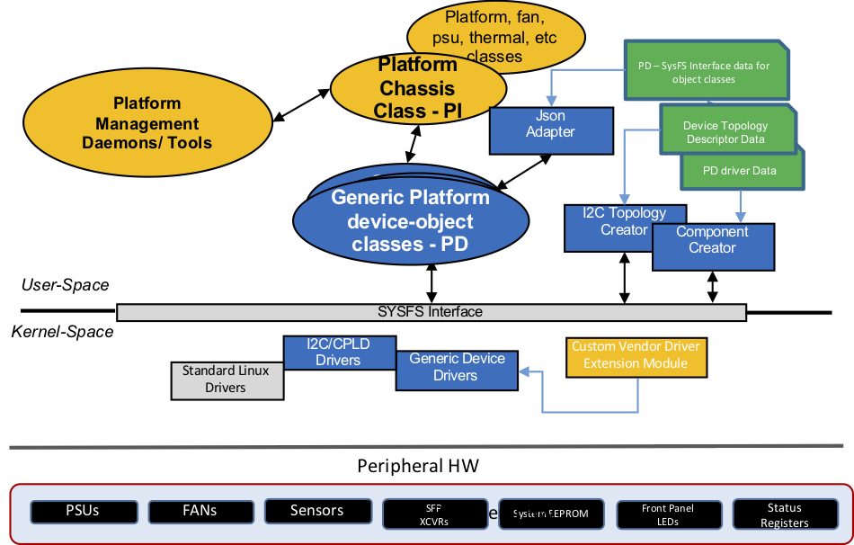
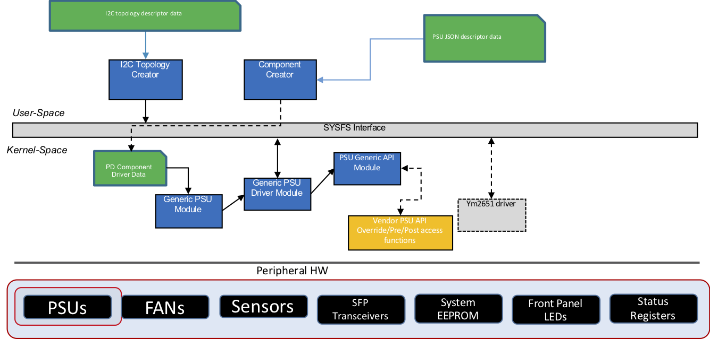
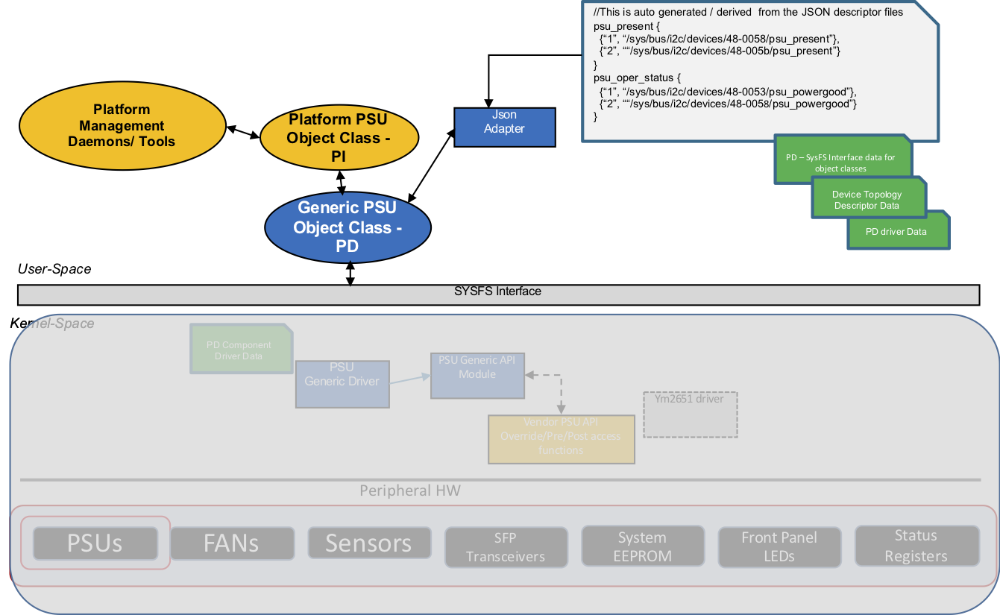
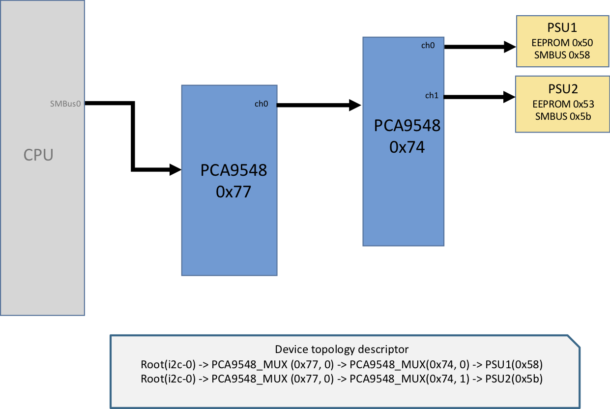
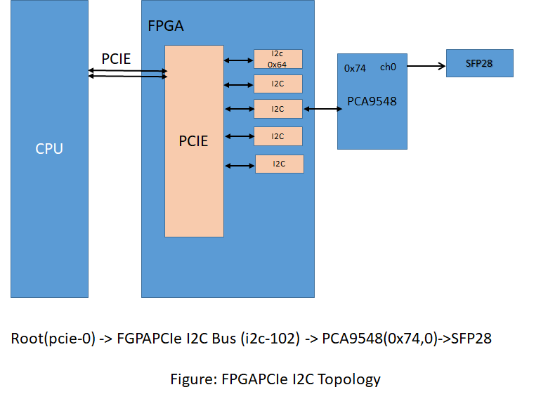
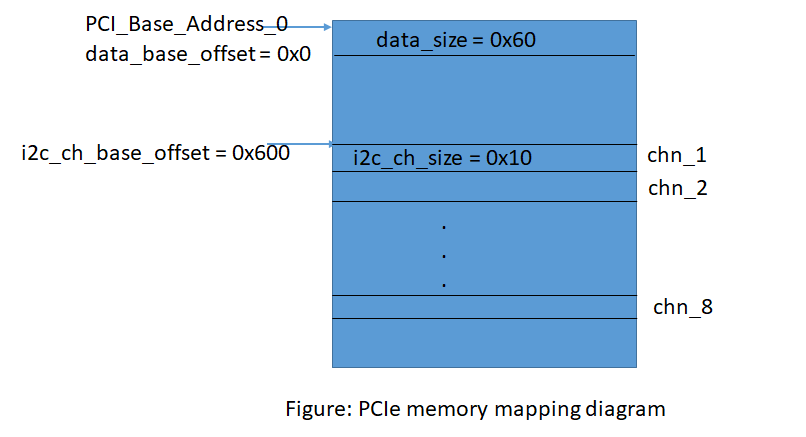


## Feature Name
**Platform Driver Development Framework (PDDF)**

## High Level Design Document
**Rev 0.7**

## Table of Contents
 * [List of Tables](#list-of-tables)
 * [Revision](#revision)
 * [About This Manual](#about-this-manual)
 * [Scope](#scope)
 * [Definition/Abbreviation](#definitionabbreviation)
 * [Requirements Overview](#requirements-overview)
	  * [Functional Requirements](#functional-requirements)
	  * [Scalability Requirements](#scalability-requirements)
	  * [Warmboot Requirements](#warmboot-requirements)
	  * [Configuration and Management Requirements](#configuration-and-management-requirements)
 * [Functional Description](#functional-description)
 * [Design](#design)
	 * [Overview](#overview)
		 * [Generic PDDF HW Device Drivers](#generic-pddf-hw-device-drivers)
		 * [PDDF Platform APIs](#pddf-platform-apis)
	 * [Generic Driver Design](#generic-driver-design)
		 * [PDDF Device Driver Modules](#pddf-device-driver-modules)
		 * [PDDF Device Modules](#pddf-device-modules)
		 * [Driver Extension Framework](#driver-extension-framework)
	 * [Generic Device Object-Class Design](#generic-device-object-class-design)
	 * [PDDF I2C Component Design](#pddf-i2c-component-design)
		 * [List of Supported Components](#list-of-supported-components)
		 * [I2C Topology Descriptor](#i2c-topology-descriptor)
		 * [PSU Component](#psu-component)
		 * [FAN Component](#fan-component)
		 * [LED Component](#led-component)
		 * [Sensors](#sensors)
		 * [System EEPROM Component](#system-eeprom-component)
		 * [FPGAI2C Component](#fpgai2c-component)
		 * [System Status Registers](#system-status-registers)
		 * [Optics Component](#optics-component)
		 * [lm-sensors](#lm-sensors-tools)
	     * [FPGAPCIe Component](#pddf-fpgapcie-component)
	 * [PDDF BMC Component Design](#pddf-bmc-component-design)
		 * [PSU JSON](#psu-json)
		 * [FAN JSON](#fan-json)
		 * [Temp Sensor JSON](#temp-json)
		 * [IPMITOOL Outputs](#temp-json)
	 * [PDDF Platform APIs Design](#pddf-platform-apis-design)
		 * [PSU Class](#psu-class)
		 * [FAN Class](#fan-class)
		 * [LED Class](#led-class)
		 * [System EEPROM Class](#system-eeprom-class)
		 * [Optics Class](#optics-class)
 * [SAI](#sai)
 * [CLI](#cli)
 * [Serviceability and DEBUG](#serviceability-and-debug)
 * [Warm Boot Support](#warm-boot-support)
 * [Unit Test](#unit-test)


# List of Tables
[Table 1: Abbreviations](#table-1-abbreviations)

# Revision
| Rev |     Date    |       Author       | Change Description                |
|:---:|:-----------:|:------------------:|-----------------------------------|
| 0.1 | 05/27/2019  |  Fuzail Khan, Precy Lee     | Initial version                   |
| 0.2 | 06/06/2019  |  Fuzail Khan, Precy Lee     | Incorporated feedback             |
| 0.3 | 10/21/2019  |  Fuzail Khan, Precy Lee     | GPIO JSON object support          |
| 0.4 | 10/22/2019  |  Fuzail Khan, Precy Lee     | Platform 2.0 API support          |
| 0.5 | 10/31/2019  |  Fuzail Khan, Precy Lee     | BMC Support                       |
| 0.6 | 10/01/2020  |  Fuzail Khan, Precy Lee     | FPGAI2C component support         |
| 0.7 | 01/05/2023  |  Fuzail Khan, Precy Lee     | FPGAPCIe component support        |

# About this Manual
Platform Driver Development Framework (PDDF) is part of SONiC Platform Development Kit (PDK), which enables rapid development of platform drivers and APIs for SONiC platforms. PDK consists of
 - PDDF (Platform Driver Development Framework): For optimized data-driven platform driver and SONiC platform APIs development
 - PDE (Platform Development Environment): For optimized build and test of platform and SAI code

PDE details are covered in another document. This document describes Platform Driver Development Framework (PDDF) which can be used as an alternative to the existing manually-written SONiC platform driver framework. It enables platform vendors to rapidly develop the device specific custom drivers and SONiC user space python device object-classes, using a data-driven architecture, to manage platform devices like Fan, PSUs, LEDs, Optics, System EEPROM, etc., and validate a platform on SONiC.

# Scope
This document describes the high level design details of PDDF and its components. The PDDF consists of generic device drivers and user space platform APIs which use the per platform specific data in the JSON descriptor files. This document describes the interaction between all the components and the tools used to support these drivers and platform APIs.


# Definition/Abbreviation
### Table 1: Abbreviations
| **Term**                 | **Meaning**                         |
|--------------------------|-------------------------------------|
| ODM                      | Original Design Manufacturer        |
| OEM                      | Original Equipment Manufacturer        |
| PDDF                      | Platform Driver Development Framework         |
| PDE                       | Platform Development Environment              |
| PDK                      | Platform Development Kit              |
| SAI                      | Switch Abstraction Interface |
| GPIO                     | General Purpose Input Output |
| PSU                      | Power Supply Unit |
| I2C                      | Inter-integrated Circuit communication protocol |
| SysFS                    | Virtual File System provided by the Linux Kernel |
| BMC                      | Baseboard Management Controller |


## 1 Requirements Overview
SONiC OS is portable across different network devices with supported ASIC via Switch Abstraction Interface (SAI). These devices primarily differ in the way various device specific hardware components are accessed, and thus require custom device drivers and python platform APIs. Each platform vendor implements these custom device drivers and platform APIs. The feature requirement is to support a SONiC platform driver development framework to enable rapid development of custom device drivers and APIs.

### 1.1	Functional Requirements
Define Platform driver development framework to enable platform vendors to develop custom device drivers and platform APIs rapidly to accelerate development and validation of platforms in SONiC environment. Hardware components can be accessed via I2C, BMC, or both.  PDDF supports both I2C and BMC access methods. The following requirements need to be satisfied by the framework.
 - PDDF to provide a data driven framework to access platform HW devices.
 - PDDF shall support I2C based HW designs with I2C controllers on the Host CPU.
 - PDDF shall support BMC based HW designs with BMC SoC on the Host motherboard.
 - Provide reusable generic device drivers for the following components
	 - FAN
	 - PSU (Power supply units)
	 - System EEPROM
	 - Optic Transceivers (SFP, QSFP)
	 - CPLD
	 - CPLDMUX (a multiplexer where channel selection is controlled by external CPLD)
	 - FPGA
	 - System Status Registers
	 - System LED
 - Generic drivers would expose device attributes via SysFS interface
 - PDDF shall support reusing custom device driver or standard linux driver to be used along with the generic drivers. This would allow  platform HW devices to be managed by PDDF generic drivers or custom/standard Linux drivers.
 - Custom drivers should expose device attributes via SysFS interface
 - Support platform vendors to extend generic drivers with custom implementations to support initialization, exit, pre and post access for get / set of attributes
 - Provide generic SONiC python based platform APIs to access various attributes for the following devices
     - FAN
	 - PSU (Power supply units)
	 - System EEPROM
	 - Optic Transceivers (SFP, QSFP)
	 - System Status Registers
	 - System LED
 - Support data driven framework using the descriptor files to represent the following platform specific information
   - I2C/BMC HW topology representing the various devices and their interconnections
   - Per platform data to enable get / set of various attributes in each device
 - PDDF generic drivers shall not require a reboot after installation
 - PDDF generic drivers shall support initialization and de-initialization
 - Platform drivers developed using the PDDF framework shall support the current SONiC platform CLIs
 - PDDF developer guide	shall be provided

 ### 1.2 Configuration and Management Requirements
 - There are no configuration commands
 - The generic PDDF platform API classes use the 2.0 platform base classes from src/sonic-platform-common for the following
    components:
     - Platform (sonic_platform_base/platform_base.py)
     - Chassis (sonic_platform_base/chassis_base.py)
     - Fan (sonic_platform_base/fan_base.py)
	 - PSU (sonic_platform_base/psu_base.py)
	 - Optic Transceivers (sonic_platform_base/sfp_base.py)
	 - EEPROM (sonic_platform_base/sonic_eeprom)
     - Thermals (sonic_platform_base/thermal_base.py)
	
 - Current SONiC platform CLIs shall be supported

### 1.3 Scalability Requirements
NA
### 1.4 Warmboot Requirements
NA
## 2 Functional Description

SONiC platform bring up typically involves the following steps:

 - Support Switching ASIC
 - Vendor platform specific drivers and platform APIs to manage platform devices

Generally, the SAI support for a given switching silicon is pre-validated, and the platform vendor mostly focuses on the platform devices during platform bring up. The platform components involve the following:

 - port_config.ini (Port / Lane mappings)
 - config.bcm
 - Platform Device drivers (FAN/PSU/Optics/Sensors/CPLD,etc.)
 - SONiC platform APIs

Most of the platform bring up effort goes in developing the platform device drivers, APIs and validating them. Typically each platform vendor writes their own drivers and classes which is very tailor made to that platform. This involves writing code, building, installing it on the target platform devices and testing. Many of the details of the platform are hard coded into these drivers, from the HW spec. They go through this cycle repetitively till everything works fine, and is validated before upstreaming the code.

PDDF aims to make this platform driver and platform APIs development process much simpler by providing a data driven development framework. This is enabled by:

 - JSON descriptor files for platform data
 - Generic data-driven drivers for various devices
 - Generic SONiC platform APIs
 - Vendor specific extensions for customization and extensibility

This makes the development and testing much simpler. Any change in the platform data can be made on the target in the JSON files and validated instantly. This helps improve the productivity of the platform developers significantly.

## 3 Design

### 3.1 Overview



 SONiC PDDF (Platform driver development framework) supports the following HW devices on a given platform:

 - Fan
 - PSU
 - System EEPROM
 - CPLD
 - FPGA
 - Optic Transceivers
 - System LED control via CPLD or FPGA
 - System Status Registers in CPLD
 - Temp Sensors

 High level architecture of the PDDF consists of the following:

 - PDDF JSON Descriptor files
 - Generic PDDF Python object classes for various devices implementing the Platform APIs
 - PDDF Tools
 - Generic PDDF HW device drivers in kernel space
 - Custom vendor driver extensions modules

#### 3.1.1	JSON Descriptor files

The descriptor files are used to represent the following information for a given platform:

I2C based HW components:
 - I2C Topology descriptor
	 - Representation of the I2C bus
   - I2C client devices
   - Inter connection of I2C devices
 - I2C Device Access attributes
	 - Each device exposes a set of data attributes to read/write
		 - e.g. PSU(psu_present), SFP/QSFP(sfp_present, lpmode) via CPLD/FPGA registers/offsets/masks, etc.
	 - For each device, platform specific attributes to help access the data attributes

BMC based HW components:
 - BMC descriptor
   - BMC client devices
   - Access attributes of BMC devices
 - Reference to a standard Linux driver if available and used
	 - pca954x,   lm75, etc.,
 - Value Map for each device in a platform
	 - Each  device or a platform can represent values to be interpreted in a different way.
		 - For eg., on some platforms “1” can represent “Port Side Intake”, whereas on another platform it could be “0”. This map provides how to interpret the values.

#### 3.1.2 Generic PDDF HW Device Drivers


For I2C based HW components, PDDF provides generic drivers for the following I2C based devices: FAN/PSU/EEPROM/Optics Transceivers/ System LED/ CPLDs/ CPLDMUX FPGA. These drivers in kernel space, rely on the per-platform data in JSON descriptor files to expose data via SysFS interface. They provide a generic interface to get/set of these attributes. There are two types of data, a driver works on:

 - Device data – Attributes exposed by the device itself
 - Platform access data – Information on how/ where to access the device attributes

These generic PDDF drivers provide capabilities to:

 - Extend using vendor implementations
 - Mix and match generic and standard drivers
 - Support any existing driver for a given component

For BMC based HW components such as FAN/PSU/TEMP sensors, PDDF does not need to provide generic drivers to manage these components. The management is done by BMCs which are located on IPMI-compliant hardware. IPMI is an open-standard hardware management interface to monitor and manage HW components. IPMItool utility is provided for users to monitor and manage BMC based components.


#### 3.1.3 PDDF Platform APIs
PDDF provides generic user space python APIs which are derived from 2.0 platform base classes defined under:
 - src/sonic-platform-common/sonic_platform_base/sfp_base.py (Optic transceivers)
 - src/sonic-platform-common/sonic_platform_base/psu_base.py (PSU base class)
 - src/sonic-platform-common/sonic_platform_base/fan_base.py (FAN base class)
 - src/sonic-platform-common/sonic_platform_base/thermal_base.py (Thermal sensor base class)
 - src/sonic-platform-common/sonic_platform_base/platform_base.py (Platform base class)
 - src/sonic-platform-common/sonic_platform_base/chassis_base.py (Chassis base class)
 - src/sonic-platform-common/sonic_platform_base/watchdog_base.py (Watchdog base class)

The PDDF generic APIs make use of the per platform JSON descriptor files and use the appropriate attributes to get and set. The final platform APIs would be derived from these PDDF generic APIs and provide users the ability to override/re-define generic get/set implementation under PDDF.
Final component based platform APIs are placed under sonic-buildimage/platform/\<chip-vendor\>/\<hw-vendor\>/\<platform\>/sonic_platform.

#### 3.1.4 Source code organization and Packaging
PDDF source code is mainly organized into platform dependent data files(JSON descriptors), generic PDDF driver modules, generic platform APIs, generic utils, and start up scripts.

 - /service/sonic-buildimage/platform/pddf/i2c
	  - modules
	  - scripts

 - /service/sonic-buildimage/platform/pddf/platform-api-pddf-base
	  - sonic_platform_pddf_base (PDDF generic platform APIs based on 2.0 platform base classes)
	  - sonic_platform_ref (reference code for pddf derived platform APIs)

 - JSON descriptor files should be placed in the "pddf" directory under the respective "/sonic-buildimage/device/\<ODM\>/\<platform\>" directory path. For example:
	 - sonic-buildimage/device/accton/x86_64-accton_as7712_32x-r0/pddf/\<descriptor.json\>

From SONiC build, all the PDDF utils and kernel modules shall be built and packaged into a common pddf Debian package *sonic-platform-pddf*. Every platform builds and packages per platform specific drivers, utilities, scripts, etc.,into a platform Debian package. As for the 2.0 platform APIs, PDDF base classes are packaged into a python wheel package *sonic_platform_pddf_common* which is installed in host and PMON docker. Every platform will generate a sonic-platform python wheel package which would consist of PDDF derived classes.

#### 3.1.5 Deployment details
For the Runtime environment, PDDF shall provide a init script pddf_util.py. Any per platform init script would be called from this script. This will load the PDDF modules and APIs and will use the per platform JSON descriptor files for initializing the platform service.

### 3.2 Generic Driver Design
Vendors write platform specific component drivers and deploy them as kernel loadable modules. In PDDF, drivers are generic, with platform specific data populated in JSON descriptor files. The JSON descriptor files are provided by the PDDF developer. Usually two different kernel modules are associated with each component. One is *Device Driver Module* and other is *Device Module*.

For a generic device driver, there are 2 types of data.
 - Device-Data Attributes
 - Access-Data

**Device-Data Attributes:**
	These are the attributes exposed to the user by the driver. These attributes provide device-related information. These attributes can be read-only or read-write. These attributes are dynamically associated with the device driver using the input from data JSON file. Examples of Device-Data attributes include,
	*psu_present* and *psu_power_good* for PSU, and
	*fan1_presence* and *fan1_input* for FAN device drivers.

**Access-Data:**
	This is platform specific data used to retrieve values from hardware. This includes per-Device Data attribute device addresses, register offsets, masks, expected values and length. This access-data varies for various components. The per-platform data is read from JSON file and passed to the kernel space as driver platform_data using the access-data attributes.


#### 3.2.1 PDDF Device Driver Modules
PDDF device driver modules are generic. Access-Data is attached to the I2C device data structure during I2C device instantiation. This access-data also specifies which Device-Data attributes are supported, along with the platform dependent data for each attribute. The supported Device-Data attributes are dynamically created as SysFS attributes. This design is helpful in linking different Device-Data attributes to different I2C client devices, if applicable. The additional *driver_data* for the client, which consist of values of the attributes, last updated time, mutex lock, name etc, is also allocated dynamically and maintained *per-attribute* wise.




#### 3.2.2 PDDF Device Modules
PDDF device module is an intermediate module to manage the actual device driver module. It helps populate the per-platform access data, and manages the access data attributes via SysFS interface. It also helps in I2C device instantiation using the I2C topology data and access-data. It defines a SysFs attribute *dev_ops* to trigger instantiation or detachment of the devices. This module has a dependency on the driver-module.


#### 3.2.3 Driver Extension Framework
There is a provision to have a *pre* and *post* APIs for important driver/module functions such as probe, init, exit. These pre and post functionalities can be vendor specific, if required, and need to be defined by each vendor in a separate vendor-specific API module. A generic implementation of *show* or *store* APIs are provided for each Device-Data attribute. However, if needed vendor can provide their own implementation for these APIs. Such definitions should also go into the vendor-specific API module.


#### 3.2.4 JSON Descriptor Files
There are multiple JSON files which must be provided by a PDDF developer.  The list of information provided by the JSON files is below,

 - Platform Inventory Info:
	 -  Details like number of fans, PSUs, ports etc
 - Device Parsing Info
 - I2C Topology Info
 - Device Access info via I2C or BMC
 - Value Maps Info for various device-data Attributes, etc.


### 3.3 Generic Platform API Design




Generic platform APIs are extended from respective base classes but do not have any platform specific data. All the platform specific data mentioned below, is retrieved from JSON files.
  * Platform inventory
  * SysFS paths of various device attributes
  * Platform dependent interpretations of some of the attribute values

Important thing to note in this type of design is that the PDDF has standardized the attribute names, and it provides the ability to map it to driver supported attribute names. Since PDDF provides the drivers for most of the devices, it maintains a list of device attributes. If there is a need to use a non-PDDF custom/standard driver, user must provide the list of attributes supported (which might be used by the generic API classes) by that driver. If such driver uses different name for an attribute, then it is incumbent that the user also define the driver attribute name.
Example below shows the usage of a driver 'ym2651' for a PSU1-PMBUS device. Generic PSU and FAN API class uses an attribute name *psu_fan_dir*. However, if the same information is denoted in the driver by *psu_fan_direction*, then user indicates this by the field *drv_attr_name*.
```
"PSU1-PMBUS": {
	"dev_info": {
		"device_type": "PSU-PMBUS",
		"device_name": "PSU1-PMBUS",
		"device_parent": "MUX3",
		"virt_parent": "PSU1"
	},
	"i2c": {
		"topo_info": {
		    "parent_bus": "0x30",
		    "dev_addr": "0x58",
		    "dev_type": "ym2851"
		},
		"attr_list": [
			{ "attr_name": "psu_fan1_fault" },
			{ "attr_name": "psu_v_out" },
			{ "attr_name": "psu_i_out" },
			{ "attr_name": "psu_p_out" },
			{ "attr_name": "psu_temp1_input" },
			{ "attr_name": "psu_fan1_speed_rpm" },
			{ "attr_name":"psu_fan_dir", "drv_attr_name": "psu_fan_direction"},
			{ "attr_name": "psu_mfr_id" }
		]
	}
}
```
List of supported attribute names are mentioned under each device's generic platform API class. Path for each attribute's SysFS is retrieved and is cached so that each time platform API is used, it doesn't calculate the path again.


### 3.4 PDDF I2C Component Design

#### 3.4.1 List of Supported HW Components
PDDF supports I2C based HW design consisting of the following components:

 - Fan Controller (CPLD or dedicated Controller EM2305)
 - PSUs (YM2651, Ym2851, etc.,)
 - Temp Sensors (LM75, LM90, TMP411, etc.,)
 - Optics (SFP/QSFPs, EEPROM, etc.,)
 - System EEPROM (at24, etc.,)
 - CPLDs
 - FPGAs
 - CPLDMUX (a multiplexer where channel selection is controlled by external CPLD)
 - MUX  (PCA954x,..)
 - GPIO  (PCA955x,..)
 - System LEDs managed by CPLD etc.,

#### 3.4.2 I2C Topology Descriptor
Generally a platform consist of fans, PSUs, temperature sensors, CPLDs, FPGAs, optics (SFP, QSFPs etc), eeproms and multiplexing devices. I2C topology refers to the parent-child and other connectivity details of the I2C devices for a platform. The path to reach any device can be discerned using the I2C topology.

Example,




I2C topology data consist of information such as *parent_bus*, *dev_addr* (for I2C devices), *dev_id* (for platform devices) and *dev_type*. Users would describe the I2C topology data using a JSON Topology descriptor file.
*dev_info* object is used to represent the logical device.
*i2c* and *topo_info* are used for creating the I2C client or a platform device.

```
"FAN-CTRL":
    {
        "dev_info": {
	        "device_type":"FAN",
	        "device_name":"FAN-CTRL",
	        "device_parent":"MUX2"
		},
        "i2c":
        {
	        "topo_info": {
		        "parent_bus":"0x20",
		        "dev_addr":"0x66",
		        "dev_type":"fan_ctrl"
		        },
	        ...
		}
}
```
Here is a brief explanation of the fields in topology JSON

> **device_type**: This mentions the generic device type. It can be either of these, PSU, FAN, CPLD, CPLDMUX, MUX, GPIO, EEPROM, SFP, etc. This is a mandatory field.

> **device_name**: This is the name of the device in the I2C topology. There can be a number or a substring appended to uniquely identify the device. e.g. FAN-CTRL, PSU1, PSU2, PORT1, MUX2, CPLDMUX2, GPIO1 etc. This is a mandatory field.

> **device_parent**: This gives the name of the parent device in the topology. It is also a mandatory field.

> **i2c** object is put to differentiate with other mode of access such as PCI or BMC etc. **topo_info** gives the info to generate the I2C client/ platform device.

> **parent_bus**: This denotes the bus number to which device is connected.

> **dev_addr**: This denotes the I2C address in the range of <0x0-0xff>.

> **dev_type**: This denotes the name/type of device. This should match with the device id /chip name of the device inside the supporting driver.

> **dev_id**: This denotes the id of the device with **dev_type**. This field is used in platform drivers.


If there is a MUX in path, its connected devices are mentioned under an array *channel*. Here is an example,

```
"MUX2": {
	"dev_info": {
		"device_type":"MUX",
		"device_name":"MUX2",
		"device_parent":"MUX1"
	},
	"i2c": {
		"topo_info": {
		    "parent_bus":"0x10",
		    "dev_addr":"0x76",
		    "dev_type":"pca9548"
		},
		"dev_attr": {"virt_bus":"0x20"},
		"channel": [
		    { "chn":"0", "dev":"FAN-CTRL" },
		    { "chn":"2", "dev":"CPLD1" }
		]
	}
}
```


If the object is a MUX, then
> **virt_bus**: This is an information used internally to denote the base address for the channels of the mux. So if the virt_bus is 0x20 for a pca9548 then channel-buses are addressed as (0x20+0), (0x20+1), (0x20+2) ....  , (0x20+7).

> **channel**: This array gives info about the child devices for a mux. It mentions **chn** denoting the channel number, and **dev** denoting the device_name connected to this channel.


If object is a CPLDMUX i.e. a multiplexer where channel selection is controlled by external CPLD, then
> **base_chan**: This denotes the base bus number for the cpldmux. Every channel will be allotted bus number (base_chan+chan).

> **num_chan**: Total number of channels multiplexed by the cpldmux.

> **cpld_name**: Object name of the cpld in the JSON which controls the cpldmux.

> **chan_cache**: Enable caching while selecting the channels. Its value can be 1 or 0.

> **channel**: This is an array of channels multiplxed by the cpldmux.

> **dev**: It is an array to denote the devices connected to the a particular channel.

> **cpld_devaddr**: I2C address of the cpld device which controls the channel selection.

> **cpld_offset**: Register offset in the cpld which controls the channel.

> **cpld_sel**: Value to be written in the **cpld_offset** to select a particular channel.

> **cpld_desel**: Value to be written in the **cpld_offset** to deselect a particular channel.

Example of a CPLDMUX JSON object
```
"CPLDMUX1":
{
    "dev_info": { "device_type":"CPLDMUX", "device_name":"CPLDMUX1", "device_parent":"SMBUS0"},
    "i2c":
    {
        "topo_info": { "parent_bus":"0x0", "dev_type":"cpld_mux", "dev_id":"1" },
        "dev_attr": { "base_chan":"0x1", "num_chan":"3", "cpld_name":"CPLD-CPU", "chan_cache": "1"},
        "channel":
        [
            { "chan":"0", "dev":["EEPROM1"], "cpld_devaddr":"0x31", "cpld_offset":"0x14", "cpld_sel":"0xfc"},
            { "chan":"1", "dev":["MUX1"], "cpld_devaddr":"0x31", "cpld_offset":"0x14", "cpld_sel":"0xfd"},
            { "chan":"2", "dev":["CPLD-MASTER", "CPLD-SW1","CPLD-SW2", "CPLDMUX2"], "cpld_devaddr":"0x31", "cpld_offset":"0x14", "cpld_sel":"0xff" }
        ]
    }
}
```


If an object is a GPIO (IO expander), then
> **gpio_base**: This mentions the base number for GPIO pin. Ports/Pins would be assigned the number (gpio_base+i) where i port number within the IO expander.

> **ports**: This represents the list of the ports IO expander. Only those ports are mentioned in this list for which some initialization setting is required. It gives the values for various SysFs attributes for initialization.
```
"GPIO1":
{
    "dev_info": { "device_type":"GPIO", "device_name":"GPIO1", "device_parent":"MUX1"},
    "i2c":
    {
        "topo_info": { "parent_bus":"0x13", "dev_addr":"0x23", "dev_type":"pca9555"},
        "dev_attr": { "gpio_base":"0x10"},
        "ports":
        [
            {"port_num":"5", "direction":"out", "value":"1", "edge":"", "active_low":""}
        ]
    }
}
```
Some platforms require initialization settings to be performed with respect to the GPIOs. The **ports** list in the JSON object takes care of these initialization after the I2C device creation takes place. Following are the names of
GPIO's SysFs attributes created by the standard linux driver.

> **port_num**: GPIO Port/Pin number.

> **direction**: Either "in" or "out". Generally this value is to be written. Writing as "out" defaults to initializing the value as low. It is optional field, i.e. if GPIO pin requires initialization by setting th
 provided here.

> **value**: Either "0" or "1". This value must be written if the GPIO is configured as output.

> **edge**: Either "none", "rising", "falling" or "both". Mentions the signal edge where the **value** is polled.

> **active_low**: Either "0" or "1".


If the object is PSU, then
> **psu_idx**: This is used internally to denote the PSU number. It is also a mandatory field.

> **interface**: Here the user needs to define the PSU interface, eeprom and pmbus, for which I2C clients would be created. If user needs to use only pmbus client to get all the information, then only that should be mentioned.

```
"PSU1":
{
    "dev_info": {
	    "device_type":"PSU",
	    "device_name":"PSU1",
	    "device_parent":"MUX3"
	},
    "dev_attr": { "psu_idx":"1"},
    "i2c": {
	    "interface": [
			{ "itf":"pmbus", "dev":"PSU1-PMBUS" },
			{ "itf":"eeprom", "dev":"PSU1-EEPROM" }
		]
    },
}
```

PDDF tools will use descriptor file data to instantiate I2C client devices and populate per-platform data.

#### 3.4.3 PSU Component
PDDF has a PSU module and a PSU driver module.
##### 3.4.3.1 PSU Driver Modules
PDDF PSU module is used to
  * Create the access data attributes to transfer the access data from user space to kernel.
  * Populates the access data into PSU client's *platform_data*
  * Create the PSU I2C client

Usually every PSU device has two interfaces and hence two I2C clients.
  1. EEPROM interface
  2. SMBUS interface

It is possible that all the required PSU info can be read using SMBUS interface itself. In such cases, only one SMBUS device needs to be created, and all the SysFS attributes shall be  created under this device.

PDDF PSU driver is used for both the interfaces and SysFS attributes are divided among the two. PSU driver module has the following functionalities,
  * Create the SysFS data attributes
  * Get/Set  attribute's value from/to HW

Currently supported PSU SysFS Attributes are:
```
psu_present
psu_model_name
psu_power_good
psu_mfr_id
psu_serial_num
psu_fan_dir
psu_v_in
psu_v_out
psu_i_in
psu_i_out
psu_p_out
psu_fan1_speed_rpm
psu_temp1_input
```
##### 3.4.3.2 PSU JSON Design
PSU JSON is structured to include the access-data for all the supported SysFS attributes.
*attr_list* is an array object which stores the array of access-data for multiple  attributes. If some of the field in the attribute object is not applicable to some particular attribute, it can be left and not filled.

Description of the fields inside *attr_list*
> **attr_name**:  This field denotes the name of SysFS attribute associated with this device I2C client. It is a mandatory field.

> **attr_devaddr**: This denotes the I2C address of device from where this SysFS attribute value is to be read. e.g if *psu_present* is the SysFS attribute, and it needs to be read from a CPLD, the I2C address of that CPLD is to be mentioned here.

> **attr_devtype**: Source device type of the value of SysFS attribute.

> **attr_offset**: Register offset of the SysFS attribute.

> **attr_mask**: Mask to be applied to read value.

> **attr_cmpval**: Expected reg value after applying the mask.  This is used to provide a Boolean value to the attribute. e.g `attr_val = ((reg_val & attr_mask) == attr_cmpval)` .

> **attr_len**: Length of the SysFS attribute in bytes.


```
"PSU1-EEPROM": {
	"i2c": {
		"attr_list": [
			{
				"attr_name":"psu_present",
				"attr_devaddr":"0x60",
				"attr_devtype":"cpld",
				"attr_offset":"0x2",
				"attr_mask":"0x2",
				"attr_cmpval":"0x0",
				"attr_len":"1"
			},
			{
				"attr_name":"psu_model_name",
				"attr_devaddr":"0x50",
				"attr_devtype":"eeprom",
				"attr_offset":"0x20",
				"attr_mask":"0x0",
				"attr_len":"9"
			},
		...
        ]
    }
},
```

#### 3.4.4 FAN Component
Fan has a PDDF device module and a PDDF device driver module.

##### 3.4.4.1 FAN Driver Modules
PDDF fan module is used to
  * Create the access data attributes to transfer the access data from user space to kernel.
  * Populates the access data into FAN client's *platform_data*
  * Create the fan I2C client

There could be one or multiple client for fan controller. If any other controller is used, such as EMC2305 or EMC2302 etc, then there might be multiple fan controller clients .

PDDF fan driver is used for all the fan clients and SysFS attributes are divided. Fan driver module has the following functionalities,
  * Create the SysFS attributes
  * Get/Set SysFS attribute's value from/to Fan controller devices

Supported Fan SysFS attributes are:

```
fan<idx>_present
fan<idx>_direction
fan<idx>_input  # denoting fan speed
fan<idx>_pwm
fan<idx>_fault
where idx represents the Fan index [1..32]
```

Since PDDF has been changed to support platform 2.0 APIs, general design considers all the FANs inside a fantray as seperate FANs. If a fantray consist of two fans, front and rear, JSON object for FAN not only provides the access details for the front fan but also for the rear fan.

##### 3.4.4.2 FAN JSON Design
FAN JSON is structured to include the access-data for all the supported SysFS attributes.
*attr_list* is an array object which stores the array of access-data for multiple  attributes. If some of the field in the attribute object is not applicable to some particular attribute, it can be left out.

Description of the objects inside *attr_list* which are very specific to Fan components are:

> **attr_mult**: Multiplication factor to the value to get the FAN rpm.

> **attr_is_divisor**: If the register value is a divisor  to the multiplication factor  to get the FAN rpm.


```
"FAN-CTRL": {
	"i2c": {
		"dev_attr": { "num_fan":"6"},
		"attr_list": [
			{
				"attr_name":"fan1_present",
				"attr_devtype":"cpld",
				"attr_devaddr":"0x60",
				"attr_devname":"CPLD1",
				"attr_offset":"0x0F",
				"attr_mask":"0x1",
				"attr_cmpval":"0x0",
				"attr_len":"1"
			},
			...
			{
				"attr_name":"fan1_direction",
				"attr_devtype":"cpld",
				"attr_devaddr":"0x60",
				"attr_devname":"CPLD1",
				"attr_offset":"0x10",
				"attr_mask":"0x1",
				"attr_cmpval":"0x1",
				"attr_len":"1"
			},
			...
			{
				"attr_name":"fan1_input",
				"attr_devtype":"cpld",
				"attr_devaddr":"0x60",
				"attr_devname":"CPLD1",
				"attr_offset":"0x12",
				"attr_mask":"0xFF",
				"attr_len":"1",
				"attr_mult":"100",
				"attr_is_divisor": 0
			},
		]
	}
}
```


#### 3.4.5 LED Component
Network switches have a variety of LED lights, system LEDs, Fan Tray LEDs, and port LEDs, used to act as indicators of switch status and network port status.  The system LEDs are used to indicate the status of power and the system. The fan tray LEDs indicate each fan-tray status. The port LEDs are used to indicate the state of the links such as link up, Tx/RX activity and speed. The Port LEDs are in general managed by the LED controller provided by switch vendors. The scope of this LED section is for system LEDs and fan-tray LED.

##### 3.4.5.1 LED Driver Design
LEDs are controlled via CPLDs. LEDs status can be read and set via I2C interfaces. A platform-independent driver is designed to access CPLDs via I2c interfaces. CPLD/register address data is stored in platform-specific JSON file. User python platform APIs trigger drivers to read/write LED statuses via SysFS. This generic LED driver is implemented to control System LED and Fan Tray LED.

##### 3.4.5.2 JSON Design
   This section provides examples of configuring platform, System LED and Fantray LED.  They consist of key/value pairs. Each pair has a unique name. The table describes the naming convention for each unique key.


| **Key**                  | **Description**                         |
|--------------------------|-----------------------------------------|
| PLATFORM                 | Numbers of power supply LED, fan tray LED        |
| SYS_LED                  | System LED indicates System         |
| PSU\<x\>_LED             |Power Supply Status LED  X is an integer starting with 1 Example: PSU1_LED, PSU2_LED             |
| LOC_LED                  | Flashing by remote management command.  Assists the technician in finding the right device for service in the rack |
| FAN_LED                  | Fan Status LED for all fans |
| DIAG_LED                 | System self-diagnostic test status LED |
| FANTRAY\<x\>_LED         | Status LED for individual fan. X is an integer starting with 1 Example: FANTRAY1_LED, FANTRAY2_LED |

Samples:

    "PLATFORM" :  { "num_psu_led":"1",  "num_fantray_led" : "4"}
    "PSU1_LED" :  { "dev_info": { "device_type":"LED", "device_name":"PSU_LED"},
                       "dev_attr": { "index":"0"},
                       "i2c": {
                                [
                                  {"attr_name":"on",  "bits" : "6:5", "color" : "Green", "value" : "0x1", "swpld_addr" : "0x60", "swpld_addr_offset" : "0x66"},
                                  {"attr_name":"faulty",  "bits" : "6:5", "color" : "Amber", "value" : "0x2", "swpld_addr" : "0x60", "swpld_addr_offset" : "0x66"},
                                  {"attr_name":"off",  "bits" : "6:5", "color" : "Off", "value" : "0x3", "swpld_addr" : "0x60", "swpld_addr_offset" : "0x66"}
                                ]
                              }
                    }


#### 3.4.6 Sensors

##### 3.4.6.1 Driver Design
The Linux driver supports LM75/LM90 compatible temperature sensors.  It is used to support communication through the I2C bus and interfaces with the hardware monitoring sub-system. A SysFS interface is added to let the user provides the temperature sensors information to the kernel to instantiate I2C devices.

##### 3.4.6.2 JSON Design
Platform specific temperature sensor configuration file is designed to instantiate I2c devices and provides access information for platform APIs. These data are grouped into three sections: PLATFORM, I2C Topology and TEMP Data. PLATFORM section provides the number of temperature sensors. I2C Topology section and TEMP Data are used for instantiating I2C devices and accessing temperature sensors vis SysFS attributes.
They consist of key/value sections. Each section has a unique name. The table describes the naming convention for each unique key.

| **Key**                 | **Description**                         |
|--------------------------|-------------------------------------|
| PLATFORM                      | Numbers of temperature sensors        |
| TEMP\<x\>                     | Temperature sensor. x is an integer starting with 1         |
| MUX\<x\>                      | This section is part of I2C topology configuration         |

Samples:

    "PLATFORM" :  { "num_temp_sensors":"3"}
    "TEMP1" :  { "dev_info": {"device_type":"TEMP_SENSOR", "device_name":"TEMP1"},
                 "dev_attr": {"display_name": "TEMP_CPU"},
                 "i2c": {
                     "topo_info": { "parent_bus":"0x21", "dev_addr":"0x48", "dev_type":"lm75"},
                     "attr_list": [
                         { "attr_name": "temp1_high_threshold", "drv_attr_name":"temp1_max"},
                         { "attr_name": "temp1_input"}
                     ]
                 }
               }
##### 3.4.6.3 Thermal Object Class Design
A generic user space python API class **Thermal** is designed to access temperature sensors via SysFS interface. It gets SysFS path information from platform-specific JSON File, pal-device.json. It also uses the ThermalBase class. It provides various APIs to retrieve the number of temp sensors, temperature sensor readings and get high&low threshold temperatures etc.
```
Class Thermal(ThermalBase):
    def get_temperature(self):
        """
        Retrieves current temperature reading from thermal
        Returns:
            A float number of current temperature in Celsius up to nearest thousandth
            of one degree Celsius, e.g. 30.125
        """
        raise NotImplementedError

    def set_low_threshold(self, temperature):
        """
        Sets the low threshold temperature of thermal
        Args :
            temperature: A float number up to nearest thousandth of one degree Celsius,
            e.g. 30.125
        Returns:
            A boolean, True if threshold is set successfully, False if not
        """
        raise NotImplementedError
```

SysFS Path Example:

> /sys/bus/i2c/devices/i2c-1/i2c-17/17-0048/hwmon/hwmon2/temp1_max

> /sys/bus/i2c/devices/i2c-1/i2c-17/17-0048/hwmon/hwmon2/temp1_max_hyst

> /sys/bus/i2c/devices/i2c-1/i2c-17/17-0048/hwmon/hwmon2/temp1_input

#### 3.4.7 System EEPROM Component

##### 3.4.7.1 Driver Design
For SYS EEPROM component, PDDF leverages the existing Linux standard driver **at24**. This driver supports multiple variations of the EEPROM viz. 24c00, 24c01, 24c08, 24c16, 24c512 and many more. This driver provides one SysFS device-data attribute named **eeprom**. Since standard driver is being used for EEPROM, PDDF uses user-space command to instantiate the EEPROM device.
Example,
> echo 24c02 0x57 > /sys/bus/i2c/devices/i2c-0/new_device

##### 3.4.7.2 JSON Design
For SYS EEPROM, the client creation information is present in I2C Topology JSON file. Since the driver is standard and attribute-name is fixed, *eeprom*, there is no component specific JSON file representing the access-data. Example of the SYS EEPROM entry in the topology JSON is mentioned below.
```
"EEPROM1": {
  "dev_info": {
    "device_type": "EEPROM",
    "device_name": "EEPROM1",
    "device_parent": "SMBUS0"
  },
  "i2c": {
    "topo_info": {
      "parent_bus": "0x0",
      "dev_addr": "0x57",
      "dev_type": "at24"
    },
    "dev_attr": {"access_mode": "BLOCK"}
  }
},
```

#### 3.4.8 FPGAI2C Component
FPGAs on the board can be used in two different ways. Their driver implementations, **access-data** attributes and usage differ in each case. This section deals with FPGA component which is similar to a CPLD in terms of its function. It is connected to an I2C bus with a specific I2C device address. Data is read or written from different offsets on the FPGA using simple smbus_read/smbus_write APIs. Such FPGA is termed as FPGAI2C in PDDF.
PDDF has a FPGAI2C module and a FPGAI2C driver module. FPGAI2C module takes care of access-data attributes to transfer the platform and device specific information to kernel space using SysFS interface. FPGAI2C driver module generates the SysFS interface for the device-data attributes. It also provides the read/write functionality for the FPGA.

##### 3.4.8.1 FPGAI2C JSON Design
FPGAI2C JSON object is simple where I2C topolcy is defined under **i2c** keyword. There are no device-data SysFS attributes as the information being read from FPGA is not fixed. Here is a typical FPGAI2C JSON object.
```
"FPGAI2C1":
{
    "dev_info": { "device_type":"FPGA_I2C", "device_name":"FPGAI2C1", "device_parent":"SMBUS0"},
    "i2c":
    {
        "topo_info": { "parent_bus":"0x0", "dev_addr":"0x5E", "dev_type":"i2c_fpga"},
        "dev_attr": { }
    }
},
```

#### 3.4.9 System Status Registers

##### 3.4.9.1 Driver Design
System Status information is present in CPLD registers. These information can be retrieved from CPLD using I2C interface to the CPLDs. Access-data to retrieve *system status* information is provided by the user in a JSON file. A generic driver is written in PDDF to store all the access-data in kernel space, and use it to read information from CPLDs. The system status data attributes are created under `/sys/kernel/pal/devices/sysstatus/data/`.

##### 3.4.9.2 JSON Design
An example of object from system status JSON file is shown below,
```
"SYSSTATUS": {
  "attr_list": [
    { "attr_name":"board_info","attr_devaddr":"0x60", "attr_offset":"0x0","attr_mask":"0x1f","attr_len":1},
    { "attr_name":"cpld1_version","attr_devaddr":"0x60","attr_offset":"0x1","attr_mask":"0xff","attr_len":1},
    { "attr_name":"power_module_status","attr_devaddr":"0x60","attr_offset":"0x2","attr_mask":"0x1f","attr_len":1},
    { "attr_name":"system_reset5","attr_devaddr":"0x60","attr_offset":"0x50","attr_mask":"0xff","attr_len":1},
    { "attr_name":"system_reset6","attr_devaddr":"0x60", "attr_offset":"0x51","attr_mask":"0xff","attr_len":1},
    { "attr_name":"system_reset7","attr_devaddr":"0x60","attr_offset":"0x52","attr_mask":"0xff","attr_len":1},
    { "attr_name":"system_reset8","attr_devaddr":"0x60","attr_offset":"0x53","attr_mask":"0xff","attr_len":1},
    { "attr_name":"misc1","attr_devaddr":"0x60","attr_offset":"0x68","attr_mask":"0xff","attr_len":1},
    { "attr_name":"cpld2_version","attr_devaddr":"0x62","attr_offset":"0x1","attr_mask":"0xff","attr_len":1},
    { "attr_name":"interrupt_status","attr_devaddr":"0x62","attr_offset":"0x2","attr_mask":"0xf","attr_len":1},
    { "attr_name":"system_reset","attr_devaddr":"0x62","attr_offset":"0x3","attr_mask":"0x1","attr_len":1},
    { "attr_name":"misc2","attr_devaddr":"0x62","attr_offset":"0x68","attr_mask":"0x2","attr_len":1}
  ]
},
```
This SYSTATUS JSON object can be used to get miscellaneous info from various CPLDs/devices based on the platform. Currently there is no generic class/plugin defined for system status registers.

#### 3.4.10 Optics Component
##### 3.4.10.1	Driver design

Transceiver devices (SFP, QSFP etc.) expose mainly two kinds of access/control methods.
  * EEPROM read/write access on linear address space of 256\*128 byte paged memory.
  * Device control attributes exposed as control pins via external CPLD/FPGA device.

In existing implementations, the drivers that access these attributes are very platform dependent. They depend on exactly which CPLD is managing which pin on each SFP device. And that’s different for every switch, even for similar switches from the same vendor. In SONiC, this is handled by having the switch vendor provide that driver, for each platform.

For eeprom access, OOM based 'optoe' is leveraged which exposes the eeprom as a binary attribute under the device tree. Optoe is independent of switches, because it only depends on I2C, and the EEPROM architecture, both of which are standardized. Linux provides a common I2C interface, which hides the switch dependent addressing to get to the device.

Each of of these SysFS attributes are distributed across multiple devices based on their implementation. The PDDF generic drivers provide a common interface to initialize and manage all the attributes. PDDF model for optics requires that every given port on switch should be associated with optoe as well as PAL optic driver to expose and support SysFS attributes related to optical transceivers.

The commonly used Optic SysFS attribute list include:
```
EEPROM bin
Module presence
Low power mode
Module reset
Rx LOS
Tx Disable
Tx Fault etc..
```
**Generic Optic PDDF drivers:**

PDDF has the following three different drivers for optics.
* Optoe driver
* Optic_pddf_module
* Optic_pddf_driver_module

#### Optoe driver:
* Responsible for creation of SFP I2C client under the given parent bus.
	1) Devices with one I2C address (eg QSFP) use I2C address 0x50 (A0h)
	2) Devices with two I2C addresses (eg SFP) use I2C address 0x50(A0h) and 0x51(A2h)
* Expose eeprom bin attribute under the same path.

#### Optic_pddf_module:
  * Create the access data attributes to transfer the access data from user space to kernel.
  * Populates the access data into SFP client's *platform_data*. (Information collected from the JSON parsing)
  * Registers a virtual SFP I2C client with address 0x60 (User defined).
#### Optic_pddf_driver_module:
Driver module has the following functionalities,
  * Allocate the memory dynamically to *driver_data* and supported SysFS attributes
  * Create the SysFS attributes and link it to Optic_Pal client's kernel object
  * Retrieve the SysFS attribute's value from HW and update the *driver_data*

##### 3.4.10.2 JSON Design

Optic JSON is structured to include the access-data for all the supported SysFS attributes.
*attr_list* is an array object which stores the array of access-datas for multiple attributes. Some of these values can be left empty if they are not applicable.

```
"PORT1":
    {
        "dev_info": { "device_type":"SFP/QSFP", "device_name":"PORT1", "device_parent":"MUX4"},
        "dev_attr": { "dev_idx":"1"},
        "i2c":
        {
            "interface":
            [
                { "itf":"eeprom", "dev":"PORT1-EEPROM" },
                { "itf":"control", "dev":"PORT1-CTRL" }
            ]
        },
    },
    "PORT1-EEPROM":
    {
        "dev_info": { "device_type":"", "device_name":"PORT1-EEPROM", "device_parent":"MUX4", "virt_parent":"PORT1"},
        "i2c":
        {
            "i2c_info": { "parent_bus":"0x40", "dev_addr":"0x50", "dev_type":"optoe1"},
            "attr_list":
            [
                { "attr_name":"eeprom"}
            ]
        }
    },
    "PORT1-CTRL":
    {
        "dev_info": { "device_type":"", "device_name":"PORT1-CTRL", "device_parent":"MUX4", "virt_parent":"PORT1"},
        "i2c":
        {
            "i2c_info": { "parent_bus":"0x40", "dev_addr":"0x53", "dev_type":"pal_xcvr"},
		    "attr_list": [
			    {
				    "attr_name":"xcvr_present",
				    "attr_devaddr":"0x60",
				    "attr_devtype":"cpld",
				    "attr_offset":"0x2",
				    "attr_mask":"0x2",
				    "attr_cmpval":"0x0",
				    "attr_len":"1"
			    },
			    {
				    "attr_name":"xcvr_lp_mode",
				    "attr_devaddr":"0x60",
				    "attr_devtype":"cpld",
				    "attr_offset":"0x30",
			  	    "attr_mask":"0x0",
				    "attr_len":"9"
			    }
			    ...
        }
    }

```

#### 3.4.11 lm-sensors Tools
lm-sensors package (Linux monitoring sensors) provides tools and drivers for monitoring temperatures, voltages, and fan speeds via command line. It can monitoring hardware such the LM75 and LM78. These tools are described below. These tools would continue to work with PDDF framework too.

##### 3.4.11.1 sensors.conf
/etc/sensors.conf is a user customized configuration file for libsensors. It describes how libsensors, and so all programs using it, should translate the raw readings from the kernel modules to real-world values. A user can configure each chip, feature and sub-feature that makes sense for his/her system.

    Example:
    sensors.conf:
         bus "i2c-3" "i2c-1-mux (chan_id 1)"
         chip "lm75-i2c-3-49"
         label temp1 "Temp Sensor"
         set temp1_max 60
         set temp1_max_hyst 56

     admin@sonic:~$ sensors
         lm75-i2c-3-49
         Adapter: i2c-1-mux (chan_id 1)
         Temp Sensor:        +27.0 C  (high = +60.0 C, hyst = +56.0 C)

This would continue to be supported using PDDF driver framework as well.

##### 3.4.11.2 fancontrol:

fancontrol is a shell script for use with lm_sensors. It reads its configuration from a file, /etc/fancontrol, then calculates fan speeds from temperatures and sets the corresponding PWM outputs to the computed values.

    # fancontrol /etc/fancontrol

    Example of configuration file
    INTERVAL=10
    FCTEMPS=/sys/bus/i2c/devices/2-0066/pwm1=/sys/bus/i2c/devices/2-0066/sys_temp
    FCFANS=/sys/bus/i2c/devices/2-0066/pwm1=/sys/bus/i2c/devices/2-0066/fan1_input     /sys/bus/i2c/devices/2-0066/pwm1=/sys/bus/i2c/devices/2-0066/fan2_input /sys/bus/i2c/devices/2-0066/pwm1=/sys/bus/i2c/devices/2-0066/fan3_input /sys/bus/i2c/devices/2-0066/pwm1=/sys/bus/i2c/devices/2-0066/fan4_input /sys/bus/i2c/devices/2-0066/pwm1=/sys/bus/i2c/devices/2-0066/fan5_input /sys/bus/i2c/devices/2-0066/pwm1=/sys/bus/i2c/devices/2-0066/fan6_input /sys/bus/i2c/devices/2-0066/pwm1=/sys/bus/i2c/devices/2-0066/fan11_input /sys/bus/i2c/devices/2-0066/pwm1=/sys/bus/i2c/devices/2-0066/fan12_input /sys/bus/i2c/devices/2-0066/pwm1=/sys/bus/i2c/devices/2-0066/fan13_input /sys/bus/i2c/devices/2-0066/pwm1=/sys/bus/i2c/devices/2-0066/fan14_input /sys/bus/i2c/devices/2-0066/pwm1=/sys/bus/i2c/devices/2-0066/fan15_input /sys/bus/i2c/devices/2-0066/pwm1=/sys/bus/i2c/devices/2-0066/fan16_input
    MINTEMP=/sys/bus/i2c/devices/2-0066/pwm1=135
    MAXTEMP=/sys/bus/i2c/devices/2-0066/pwm1=160
    MINSTART=/sys/bus/i2c/devices/2-0066/pwm1=100
    MINSTOP=/sys/bus/i2c/devices/2-0066/pwm1=32
    MINPWM=/sys/bus/i2c/devices/2-0066/pwm1=32
    MAXPWM=/sys/bus/i2c/devices/2-0066/pwm1=69

The SysFS paths should be given as per the PDDF I2C topology description and the attributes.


#### 3.4.12 PFGAPCIe Component



FPGA can be programmed as a I2C master controller. Some platforms use a FPGAPCIe card to control I2C devices and  the communication with the CPU is by PCIe interface. PDDF supports a FPGAPCIe card by providing the following modules:

* FPGAPCIe Data Module:
    - Mange access data defined in JSON via SysFS interface
    - Populate data and trigger FPGAPCIe instantiation
* FPGAPCIe Driver Module:
    - PCIe device instantiation
    - Logical I2C bus instantiation
* I2C Algorithm Module:
    - Device specific I2C communication protocol
    - Register algorithm to I2C adaptor.

PDDF PFGAPCIe common driver supports only the FPGAPCIe model where FPGA is acting as I2C master controller. Any other kind of use case of a PCIe
connected FPGA, vendors need to provide the FPGA driver.

##### 3.4.12.1 FPGAPCIe JSON Design

FPGAPCIe JSON object follows PDDF I2C topology JSON object design concept. FPGAPCIE object is under i2c keyword becuase it is programmed as I2c buses to control I2C client devices.


```
    "SYSTEM":
    {
        "dev_info": {"device_type":"CPU", "device_name":"ROOT_COMPLEX", "device_parent":null},
        "i2c":
        {
            "CONTROLLERS":
            [
                { "dev_name":"i2c-0", "dev":"SMBUS0" },
                { "dev_name":"pcie-0", "dev":"PCIE0" }
            ]
        }
    },

    "PCIE0"
    {
        "dev_info": {"device_type": "PCIE", "device_name": "PCIE0", "device_parent": "SYSTEM"},
        "i2c":
        {
            "DEVICES":
            [
               {"dev": "FPGAPCIE0"}
            ]
        }
    },

   "FPGAPCIE0":
   {
       "dev_info": {"device_type": "FPGAPCIE", "device_name": "FPGAPCIE0", "device_parent": "PCIE0"},
       "i2c":
       {
          "dev_attr": { "vendor_id":"0x10EE", "device_id": "0x7021", "virt_bus": "0x64", "data_base_offset":"0x0", "data_size":"0x60", "i2c_ch_base_offset":"0x600", "i2c_ch_size":"0x10",  "virt_i2c_ch":"8"},
          "channel":
          [
              { "chn":"3", "dev":"MUX1" }
          ]
       }
   },

```




Description of the fields inside *dev_attr*

> **vendor_id**: The 16-bit register specifies the PCI vendor.

> **device_id**: The 16-bit register selected by the PCI vendor.

> **virt_bus**: This is an information used internally to denote the base address for the channels of the mux. So if the virt_bus is 0x64 for a pca9548 then channel-buses are addressed as (0x64+0), (0x64+1), (0x64+2) .... , (0x64+7).

> **data_base_offset**: PCIe user-defined memory mapping offset address from PCIE BAR 0

> **data_size**: User-defined memory allocation size

> **i2c_ch_base_offset**: I2C channel 1 offset address from PCIE BAR 0

> **i2c_ch_size**: Memory offset for each I2C channel.

> **virt_i2c_ch**: The total numbers of logical I2C channels


### 3.6 PDDF BMC Component Design

This section covers the JSON design for BMC based hardware components. PDDF utilizes ipmitool to monitor components.
PDDF supports BMC based HW design consisting of the following components:

 - PSUs
 - Fan Controller
 - Temp Sensors

```
BMC Component JSON Template:
\<Device Name\> : {
	"bmc" : {
              "dev_attr" : { "display_name" : "<desired display name>"},
              "ipmitool" : {
                 "attr_list":
                 [
                    {"attr_name: <pre-defined list>, "bmc_cmd": <ipmitool non raw request>, "field_name":<field name of ipmitool output>, "delimiter": <delimiter used for separattion of fields>, "field_index": <number 1,..>, "mult": <multiplication factor>, "raw"="0" },
                    {"attr_name: <pre-defined list>, "bmc_cmd": <ipmitool raw request>, "raw"="1", "type":"ascii"},
                    {"attr_name: <pre-defined list>, "bmc_cmd": <ipmitool raw request>, "raw"="1", "type":"raw"},
                    {"attr_name: <pre-defined list>, "bmc_cmd": <ipmitool raw request>, "raw"="1", "type":"mask", "mask":"hex_num"}
                 ]
              },
              "ipmiapi" : {
              }

	}

}
```

> **display_name**:
If this field exists, the device name is displayed using this field. Otherwise, the device_name content is shown.

> **ipmitool, ipmiapi**:
ipmitool and ipmiapi are two methods of getting ipmi data. ipmitool uses ipmitool command to get data from BMC while ipmiapi will use kernel ipmi interfaces to retrieve the data. ipmiapi will be implemented in the future.

> **attr_name**:
The PDDF BMC JSON design has the pre-defined list of the attribute names which is platform independent. IPMI is an standardized interface specification, but the naming convention of ipmitool output is vendor specific. The pre-defined attribue name list provides the ability to use generic PDDF generic platform APIs to retrieve information for all platforms.

> **bmc_cmd**:
There are two types of cmds: raw ipmi request and non raw ipmi request. The list of available ipmitool commands can be found by
    #ipmitool help

> **raw**:
This indicates if bmc_cmd is a RAW IPMI request or not. 1: raw ipmi request and 0: non-raw ipmi request.

> **field_name**:
This is the first field of an ipmitool command output. Each vendor has different naming conventions. Please check vendor specific documents.

> **delimiter**:
For a non-raw ipmi request, delimiter is used for deciding the **field_pos**.

> **field_pos**:
For a non-raw ipmi request, this field is used to select a specific field position.

> **mult**:
For a non-raw ipmi request, this field is used to specify multiplication factor for the attribute value. It is an optional field only to be defined for numeric attribute values.


> **type**:
This field indicates the output presentation. It is a pre-defined list, "ascii", "raw", and "mask".
  >- "ascii": the output is converted from hex string to ascii.
  >- "raw": the output is not required further conversion.
  >- "mask": the output needs to be masked with the value of "mask" field.

> **mask**:
This is a hex number to mask the output


| Name       |non-raw ipmi request    |raw ipmi request     |
|------------|------------------------|---------------------|
| attr_name  |   mandatory            |  mandatory          |
| bmc_cmd    |   mandatory            |  mandatory          |
| raw        |   mandatory            |  mandatory          |
| field_name |   mandatory            |  not required       |
| field_pos  |   mandatory            |  not required       |
| mult       |   optional             |  not required       |
| type       |   not required         |  mandatory          |
| mask       |   not required         |  mandatory: "mask" type; not required: "ascii" and "raw" types |

  Example:
  non-raw ipmi request:

    { "attr_name":"psu_power_good", "bmc_cmd":"ipmitool sdr", "field_name":"PSU1_POWER_IN", "field_index":"3"},
    # ipmitool sdr | grep PSU1_POWER_IN
    PSU1_POWER_IN    | 135 Watts         | ok

    The output of PSU1_POWER_IN is "ok" because the field_index is 3.

    raw ipmi request:
    { "attr_name":"psu_model_name", "bmc_cmd":"ipmitool raw 0x36 0xBB 0x4C 0x1C 0x00 0x9a 0x01", "raw":"1"}
    # ipmitool raw 0x36 0xBB 0x4C 0x1C 0x00 0x9a 0x01
      37 30 30 2d 30 31 33 36 38 34 2d 30 31 30 30
      The field of type is "ascii", so the output is converted from hex to string. The ascii format is 700-013684-0100.

    { "attr_name":"psu_present", "bmc_cmd":"ipmitool raw 0x36 0xB9 0x4C 0x1C 0x00 0x02", "raw":"1", "type": "mask", "mask": "0x01"},
    # ipmitool raw 0x36 0xB9 0x4C 0x1C 0x00 0x02
       c2
       The field of type is "mask". For example, bit value of 1:absent and bit value of 0:present. PSU1 is present.

    { "attr_name":"fan1_direction", "bmc_cmd":"ipmitool raw 0x0a 0x11 0x00 0x19 0x00 0x01",  "raw": "1", "type":"raw"},
    # ipmitool raw 0x0a 0x11 0x00 0x19 0x00 0x01
      The field of type is "raw". The output does not need further conversion.


#### 3.6.1 PSU JSON

> **Device Name**: PSU\<index\>
  index: denote the PSU number starting with 1

> **Predefined attribute names**:

 >- psu_power_good: the powergood status of PSU
 >- psu_present: the present status of PSU
 >- psu_model_name: the model name of PSU
 >- psu_serial_num: the serial number of PSU
 >- psu_mfr_id: the manufacture id of PSU
 >- psu_power: present energy supplied by PSU
 >- psu_voltage: present PSU voltage output
 >- psu_current: present electric current supplied by PSU


    "PSU1":
    {

       "bmc": {
                 "ipmitool" : {
                    "attr_list":
                     [
                         { "attr_name":"psu_power_good", "bmc_cmd":"ipmitool sdr", "raw": "0", "field_name":"PSU1_POWER_IN", "field_pos":"3"},
                         { "attr_name":"psu_present", "bmc_cmd":"ipmitool raw 0x36 0xB9 0x4C 0x1C 0x00 0x02", "raw": "1", "type":"mask", "mask":"0x01"},
                         { "attr_name":"psu_model_name", "bmc_cmd":"ipmitool raw 0x36 0xBB 0x4C 0x1C 0x00 0x9a 0x01", "raw":"1", "type":"ascii"},
                         { "attr_name":"psu_serial_num", "bmc_cmd":"ipmitool raw 0x36 0xBB 0x4C 0x1C 0x00 0x9e 0x01", "raw":"1", "type":"ascii"},
                         { "attr_name":"psu_mfr_id", "bmc_cmd":"ipmitool raw 0x36 0xBB 0x4C 0x1C 0x00 0x99 0x01", "raw":"1", "type":"ascii"},
                         { "attr_name":"psu_power", "bmc_cmd":"ipmitool sdr", "raw": "0", "field_name":"PSU1_POWER_IN", "field_pos":"2"},
                         { "attr_name":"psu_voltage", "bmc_cmd":"ipmitool sdr", "raw":"0", "field_name" : "PSU1_VOLTAGE_OUT", "field_pos":"2"},
                         { "attr_name":"psu_current", "bmc_cmd":"ipmitool sdr", "raw":"0", "field_name" : "PSU1_CURRENT_OUT", "field_pos":"2"}
                     ]
                }
	     }
    }

#### 3.6.2 FAN JSON

> **Device Name**: FAN-CTRL

> **Predefined attribute names**:
index: Fan index starting with 1
 >- fan\<index\>_present: present status of FAN
 >- fan\<index\>_input: rpm speed of front FAN
 >- fan\<index\>_pwm: puls-width modulation of FAN
 >- fan\<index\>_direction: direction of FAN


    "FAN-CTRL":
    {

       "bmc": {
                 "ipmitool" : {
                      "attr_list":
                     [
                         { "attr_name":"fan1_present", "bmc_cmd":"ipmitool raw 0x36 0xB9 0x4C 0x1C 0x00 0x02", "raw": "1", "type":"mask", "mask":"0x01"},
                         { "attr_name":"fan1_direction", "bmc_cmd":"ipmitool raw 0x0a 0x11 0x00 0x19 0x00 0x01",  "raw": "1", "type":"raw"},
                         { "attr_name":"fan1_input", "bmc_cmd":"ipmitool sensor", "raw":"0", "field_name" : "Fan_SYS_1_1", "field_pos":"2"},
                         { "attr_name":"fan1_pwm", "bmc_cmd":"ipmitool raw 0x30 0xd6 0x00 0x00", "raw": "1", "type":"raw"}
                     ]
                 }
	     }
    }

> NOTE: Rear fans and front fans are considered separate fans. In above output, <xxx>1_1: front fan of fan1 and <xxx>1_2: rear fan of fan1

#### 3.6.3 TEMP Sensors JSON

> **Device Name**: TEMP\<index\>
  index: denote the TEMP number starting with 1

> **Predefined attribute names**:
 >- temp1_high_threshold: Upper non-critical (high) threshold temperature setting
 >- temp1_high_crit_threshold: Upper critical threshold temperature setting
 >- temp1_low_threshold: Lower non-critical threshold temperature setting
 >- temp1_low_crit_threshold: Lower critical threshold temperature setting
 >- temp1_input: current temperature reading from theraml

"TEMP1":
{

       "dev_attr" : {"display_name":"Temp_Ambient_1"},
       "bmc": {
                  "ipmitool" : {
                      "attr_list":
                     [
                         { "attr_name":"temp1_high_threshold", "bmc_cmd":"ipmitool sensor", "raw":"0", "field_name":"Temp_Ambient_1", "field_pos":"10"},
                         { "attr_name":"temp1_input", "bmc_cmd":"ipmitool sensor", "raw":"0", "field_name" : "Temp_Ambient_1", "field_pos":"2"}

                     ]
                  }
              }
}

#### 3.6.4 IPMITOOL OUTPUTS

This section shows  examples of ipmitool outputs.

    # ipmitool sdr | grep PSU1_POWER_IN
      PSU1_POWER_IN    | 135 Watts         | ok

    # ipmitool sdr | grep PSU1_VOLTAGE_OUT
      PSU1_VOLTAGE_OUT | 12.18 Volts       | ok

    # ipmitool sdr | grep PSU1_CURRENT_OUT
      PSU1_CURRENT_OUT | 9.10 Amps         | ok

    # ipmitool sensor | grep Fan_SYS_1_1
      Fan_SYS_1_1      | 7840.000   | RPM        | ok    | na        | 480.000   | 960.000   | 30560.000 | 30720.000 | na

    # ipmitool sensor | grep Fan_SYS_1_2
      Fan_SYS_1_2      | 6720.000   | RPM        | ok    | na        | 480.000   | 960.000   | 30560.000 | 30720.000 | na

    # ipmitool sensor | grep Fan_SYS_2_1
      Fan_SYS_2_1      | na         | RPM        | na    | na        | 480.000   | 960.000   | 30560.000 | 30720.000 | na

    # ipmitool sensor | grep Fan_SYS_2_2
      Fan_SYS_2_2      | na         | RPM        | na    | na        | 480.000   | 960.000   | 30560.000 | 30720.000 | na

    # ipmitool sensor | grep Temp_Ambient_1
      Temp_Ambient_1   | 37.000     | degrees C  | ok    | na        | na        | na        | 55.000    | 62.000    | 65.000


### 3.7 PDDF Platform APIs Design
As mentioned in the section 3.3, platform devices/components are provided with a python platform API class which interacts with the SysFs interface to get the HW information. Below are the component specific examples for such class.

#### 3.7.1 PSU Class
PsuBase is the base PSU class, which declares various APIs to get/set information from the PSU devices. PDDF PSU generic platform API class **PddfPsu** shall extend from PsuBase and implement the platform specific APIs, using the platform specific information in the JSON descriptor files

Example,
```
def get_voltage(self):
    """
    Retrieves current PSU voltage output

    Returns:
        A float number, the output voltage in volts,
        e.g. 12.1
    """
    # Implementation to get PSU output voltage using the JSON descriptor files
```

#### 3.7.2 FAN Class
FanBase is the base FAN class, which declares various APIs to get/set information from the Fan devices. PDDF Fan generic platform API class **PddfFan** shall extend from FanBase and implement the platform specific APIs, using the platform specific information in the JSON descriptor files. FanBase is part of the new platform API framework in SONiC.

Example,
```
	def get_direction(self):
		"""
		Retrieves the direction of fan
		Returns:
		A string, either FAN_DIRECTION_INTAKE or FAN_DIRECTION_EXHAUST
		depending on fan direction
		"""
        # Implementation using JSON descriptor files

	def get_speed(self):
        """
        Retrieves the speed of fan as a percentage of full speed

        Returns:
            An integer, the percentage of full fan speed, in the range 0 (off)
                 to 100 (full speed)
        """
        # Implementation using JSON descriptor files

```


#### 3.7.3 LED Class
There is no generic LED API class defined in PDDF. LED APIs related to a component has been made part of thats component's platform API class. System LED APIs are made part of PddfChassis class.
```
class PddfChassis(ChassisBase):
    def set_system_led(self, device_name, color):
        """
        Sets the state of one system status
        Args:
            color: A string representing the color with which to set the
               system status LED
        Returns:
            bool: True if status LED state is set successfully, False if not
        """
        raise NotImplementedError

    def get_system_led(self, device_name):
        """
        Gets the state of the system status LED
        Returns:
            A string, one of the predefined STATUS_LED_COLOR_* strings
        """
        raise NotImplementedError
```

PDDF PSU class provides get/set method to access PSU system LED
```
class PddfPsu(PsuBase):
    def set_status_led(self, color):
        """
        Sets the state of the PSU status LED
        Args:
            color: A string representing the color with which to set the
               PSU status LED
        Returns:
            bool: True if status LED state is set successfully, False if not
        """
        raise NotImplementedError

    def get_status_led(self):
        """
        Gets the state of the PSU status LED
        Returns:
            A string, one of the predefined STATUS_LED_COLOR_* strings
        """
        raise NotImplementedError
```


PDDF FAN class provides get/set method to access Fantray LED
```
class PddfFan(FanBase):
    def set_status_led(self, color):
        """
        Sets the state of the fan module status LED
        Args:
            color: A string representing the color with which to set the
               fan module status LED
        Returns:
            bool: True if status LED state is set successfully, False if not
        """
        raise NotImplementedError

    def get_status_led(self):
        """
        Gets the state of the fan status LED
        Returns:
            A string, one of the predefined STATUS_LED_COLOR_* strings
        """
        raise NotImplementedError

```


#### 3.7.4 System EEPROM Class
A generic user space platform API class **PddfEeprom** is written for EEPROM. Internally it leverages eeprom_base and eeprom_tlvinfo base classes. The SysFS path for driver supported attribute is retrieved from the user provided JSON file. An example of the API definition form eeprom_base is shown below,
```
def check_status(self):
    if self.u != '':
        F = open(self.u, "r")
        d = F.readline().rstrip()
        F.close()
        return d
    else:
        return 'ok'

def set_cache_name(self, name):
    # before accessing the eeprom we acquire an exclusive lock on the eeprom file.
    # this will prevent a race condition where multiple instances of this app
    # could try to update the cache at the same time
    self.cache_name = name
    self.lock_file = open(self.p, 'r')
    fcntl.flock(self.lock_file, fcntl.LOCK_EX)
```
Generic API class may provide further initialization steps and definitions for new APIs.

#### 3.7.5 Optics Class
SfpBase is the base Optic class, which declares various APIs to get/set information from the optic transceivers. PDDF generic platform API class **PddfSfp** shall extend from SfpBase and implement the platform specific APIs, using the platform specific information in the JSON descriptor files.

Example,
```
    def get_transceiver_info(self):
        """
        Retrieves transceiver info of this SFP

        Returns:
            A dict which contains following keys/values :
        ========================================================================
        keys                       |Value Format   |Information
        ---------------------------|---------------|----------------------------
        type                       |1*255VCHAR     |type of SFP
        hardwarerev                |1*255VCHAR     |hardware version of SFP
        serialnum                  |1*255VCHAR     |serial number of the SFP
        manufacturename            |1*255VCHAR     |SFP vendor name
        modelname                  |1*255VCHAR     |SFP model name
        Connector                  |1*255VCHAR     |connector information
        encoding                   |1*255VCHAR     |encoding information
        ext_identifier             |1*255VCHAR     |extend identifier
        ext_rateselect_compliance  |1*255VCHAR     |extended rateSelect compliance
        cable_length               |INT            |cable length in m
        mominal_bit_rate           |INT            |nominal bit rate by 100Mbs
        specification_compliance   |1*255VCHAR     |specification compliance
        vendor_date                |1*255VCHAR     |vendor date
        vendor_oui                 |1*255VCHAR     |vendor OUI
        ========================================================================
        """
        # Implementation using the JSON descriptor file
```


## 4 SAI
Not applicable

## 5 CLI

SONiC provides various platform related CLIs to manage various platform devices. Some of the existing CLIs are:

 - psuutil
 - sfputil
 - show interface status
 - show interface transceiver eeprom
 - show interface transceiver presence
 - decode-syseeprom
 - show reboot-cause
 - show platform summary
 - show environment

In addition,  the following CLI utils will also be added.

### 5.1  PDDF_PSUUTIL
```
root@sonic:/home/admin# pddf_psuutil --help
Usage: pddf_psuutil [OPTIONS] COMMAND [ARGS]...

  pddf_psuutil - Command line utility for providing PSU status

Options:
  --help  Show this message and exit.

Commands:
  debug    pddf_psuutil debug commands
  mfrinfo  Display PSU manufacturer info
  numpsus  Display number of supported PSUs on device
  seninfo  Display PSU sensor info
  status   Display PSU status
  version  Display version info
root@sonic:/home/admin#
```
Example output of the above commands,
```
root@sonic:/home/admin# pddf_psuutil numpsus
2
root@sonic:/home/admin# pddf_psuutil status
PSU    Status
-----  --------
PSU1   OK
PSU2   NOT OK

root@sonic:/home/admin# pddf_psuutil mfrinfo
PSU1 is OK
Manufacture Id: 3Y POWER
Model: YM-2651
Serial Number: SA290N091739133083
Fan Direction: Intake

PSU2 is Not OK

root@sonic:/home/admin#
root@sonic:/home/admin# pddf_psuutil seninfo
PSU1 is OK
Output Voltage: 11984.0 mv
Output Current: 11265.0 ma
Output Power: 136000.0 mw
Fan1 Speed: 5000 rpm

PSU2 is Not OK

root@sonic:/home/admin#
```
### 5.2 PDDF_FANUTIL
```
root@sonic:/home/admin# pddf_fanutil
Usage: pddf_fanutil [OPTIONS] COMMAND [ARGS]...

  pddf_fanutil - Command line utility for providing FAN information

Options:
  --help  Show this message and exit.

Commands:
  debug      pddf_fanutil debug commands
  direction  Display FAN airflow direction
  getspeed   Display FAN speed in RPM
  numfans    Display number of FANs installed on device
  setspeed   Set FAN speed in percentage
  status     Display FAN status
  version    Display version info
root@sonic:/home/admin#
```
Example output of the above commands,
```
root@sonic:/home/admin# pddf_fanutil numfans
12
root@sonic:/home/admin# pddf_fanutil status
FAN         Status
------      --------
Fantray1_1  OK
Fantray1_2  OK
Fantray2_1  OK
Fantray2_2  OK
Fantray3_1  OK
Fantray3_2  OK
Fantray4_1  OK
Fantray4_2  OK
Fantray5_1  OK
Fantray5_2  OK
Fantray6_1  OK
Fantray6_2  OK
root@sonic:/home/admin# pddf_fanutil direction
FAN         Direction
------      -----------
Fantray1_1  Intake
Fantray1_2  Intake
Fantray2_1  Intake
Fantray2_2  Intake
Fantray3_1  Intake
Fantray3_2  Intake
Fantray4_1  Intake
Fantray4_2  Intake
Fantray5_1  Intake
Fantray5_2  Intake
Fantray6_1  Intake
Fantray6_2  Intake
root@sonic:/home/admin#
root@sonic:/home/admin# pddf_fanutil getspeed
FAN         SPEED (RPM)
------      -----------
Fantray1_1         8800
Fantray1_2         7500
Fantray2_1         8600
Fantray2_2         7300
Fantray3_1         8800
Fantray3_2         7500
Fantray4_1         8800
Fantray4_2         7500
Fantray5_1         8600
Fantray5_2         7300
Fantray6_1         8600
Fantray6_2         7300
root@sonic:/home/admin#
root@sonic:/home/admin# pddf_fanutil setspeed 100
Successful
root@sonic:/home/admin#
```


> NOTE: Above output differs from the ouput in PDDF v1.0. This is because of the fact that FAN numbering scheme changed due to introduction of 2.0 platform APIs. Rear fans are now considered separate fans. In above output,
> Fantray1_1: Front fan of frantray1
> Fantray1_2: Rear fan of fantray1

### 5.3 PDDF_LEDUTIL
```
# pddf_ledutil
Usage: pddf_ledutil [OPTIONS] COMMAND [ARGS]...

  pddf_ledutil - Command line utility for providing System LED information

Options:
  --help  Show this message and exit.

Commands:
  getstatusled
  setstatusled
  version       Display version info

# pddf_ledutil version
PDDF ledutil version 2.0

# pddf_ledutil setstatusled \<device_name\> \<color\>
   device_name: configured in the JSON configuration file such as LOC_LED and DIAG_LED
   color: green, red, off
        green maps to LED at normal state
        red maps to LED at faulty state
        off maps to LED at off state

# pddf_ledutil setstatusled LOC_LED green
True

# pddf_ledutil getstatusled LOC_LED
green
```
### 5.4 PDDF_Thermalutil
```
# pddf_thermalutil
Usage: pddf_thermalutil [OPTIONS] COMMAND [ARGS]...

  pddf_thermalutil - Command line utility for providing Temp Sensors
  information

Options:
  --help  Show this message and exit.

# pddf_thermalutil version
PDDF thermalutil version 2.0

# example of i2c based thermals
# pddf_thermalutil gettemp

# pddf_thermalutil gettemp
Temp Sensor    Label           Value
-------------  --------------  -------------------------------
Temp_1         lm75-i2c-17-48  temp1	 +28.5 C (high = +80.0 C)
Temp_2         lm75-i2c-17-49  temp1	 +25.5 C (high = +80.0 C)
Temp_3         lm75-i2c-17-4a  temp1	 +26.0 C (high = +80.0 C)
Temp_CPU       lm75-i2c-17-4b  temp1	 +24.0 C (high = +80.0 C)

#
#example of bmc based thermals
# pddf_thermalutil gettemp
Temp Sensor     Value
--------------  -----------------------------------------------
Temp_Ambient_0  temp1	 +38.0 C (high = +68.0 C, crit = +65.0 C)
Temp_Ambient_1  temp1	 +34.0 C (high = +65.0 C, crit = +62.0 C)
Temp_Ambient_2  temp1	 +28.0 C (high = +59.0 C, crit = +56.0 C)
Temp_Ambient_3  temp1	 +27.0 C (high = +63.0 C, crit = +60.0 C)
Temp_Ambient_4  temp1	 +33.0 C (high = +67.0 C, crit = +64.0 C)
Temp_Ambient_5  temp1	 +33.0 C (high = +69.0 C, crit = +66.0 C)
Temp_Ambient_6  temp1	 +29.0 C (high = +66.0 C, crit = +63.0 C)
Temp_CPU        temp1	 +34.0 C (crit = +98.0 C)


# pddf_thermalutil numthermals
4
```
### 5.5 SHOW PLATFORM PSUSUMMARY
```
root@sonic:/home/admin# show platform psusum --help
Usage: show platform psusum [OPTIONS]

  Show PSU summary information

Options:
  -i, --index INTEGER  the index of PSU
  --verbose            Enable verbose output
  -?, -h, --help       Show this message and exit.
root@sonic:/home/admin#
```
Examples of the above commands,
```
root@sonic:/home/admin# show platform psusummary
PSU 1: OK
Manufacturer Id: 3Y POWER
Model: YM-2651
Serial Number: SA290N091739133083
Output Voltage (mV): 12109.0
Output Current (mA): 11171.0
Output Power (mW): 135000.0
Fan Direction: Intake
Fan Speed (RPM): 4896

PSU 2: NOT OK
root@sonic:/home/admin#
root@sonic:/home/admin#
root@sonic:/home/admin# show platform psusummary -i 1
PSU 1: OK
Manufacturer Id: 3Y POWER
Model: YM-2651
Serial Number: SA290N091739133083
Output Voltage (mV): 12046.0
Output Current (mA): 11265.0
Output Power (mW): 135000.0
Fan Direction: Intake
Fan Speed (RPM): 4896
root@sonic:/home/admin#
```

### 5.6 SHOW PLATFORM FANSTATUS
```
root@sonic:/home/admin# show platform fanstatus --help
Usage: show platform fanstatus [OPTIONS]

  Show fan status information

Options:
  -i, --index INTEGER  the index of fan
  --verbose            Enable verbose output
  -?, -h, --help       Show this message and exit.
root@sonic:/home/admin#
```
Example output of the above commands,
```
root@sonic:/home/admin#
root@sonic:/home/admin# show platform fanstatus -i 3
FAN         Status      Speed (RPM)  Direction
------      --------  -------------  -----------
Fantray2_1  OK                 8600  Intake
root@sonic:/home/admin#
root@sonic:/home/admin# show platform fanstatus
FAN         Status      Speed (RPM)  Direction
------      --------  -------------  -----------
Fantray1_1  OK                 8700  Intake
Fantray1_2  OK                 7500  Intake
Fantray2_1  OK                 8600  Intake
Fantray2_2  OK                 7300  Intake
Fantray3_1  OK                 8800  Intake
Fantray3_2  OK                 7500  Intake
Fantray4_1  OK                 8800  Intake
Fantray4_2  OK                 7500  Intake
Fantray5_1  OK                 8500  Intake
Fantray5_2  OK                 7300  Intake
Fantray6_1  OK                 8600  Intake
Fantray6_2  OK                 7300  Intake
root@sonic:/home/admin#
```

## 6 Serviceability and DEBUG

### Debug Utils
 - lsmod  | grep -i pddf
	 - Check if all pddf modules are loaded correctly
 - systemctl  | grep -i pddf
	 - Check if pddf platform service is running
 - pddf_fanutil debug dump_sysfs
	 - Dump all Fan related SysFS path and attributes
 - pddf_psuutil debug dump_sysfs
     - Dump all PSU related SysFS path and attributes
 - pddf_ledutil debug dump_sysfs
 	 - Dump all LED related SysFS path and attributes
 - pddf_sfputil debug dump_sysfs
 	 - Dump all Optics related SysFS path and attributes
 - pddf_eepromutil debug dump_sysfs
	 - Dump all EEPROM related SysFS path and attributes
### Debug logs
All the logs can be found under /var/log/pddf.


## 7 Warm Boot Support
Platform service restart should be supported without having to reboot the device

## 8 Scalability
NA
## 9 Unit Test
Generic unit tests are listed below. These should be extended to all the components where they are applicable.
1. JSON descriptor file - Schema validation and error detection
2. Test descriptor file Parsing
3. Check if all the modules are loaded successfully.
4. Check if the device-data SysFS attributes are created successfully.
5. Provide wrong data in descriptor files and check if the errors are handled properly.
6. Test to check for kernel memory leak.
7. Remove the driver and ensure that all the device artifacts, memory etc are cleaned up.
8. Stop and start the platform service.
