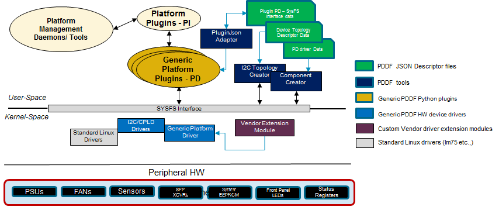
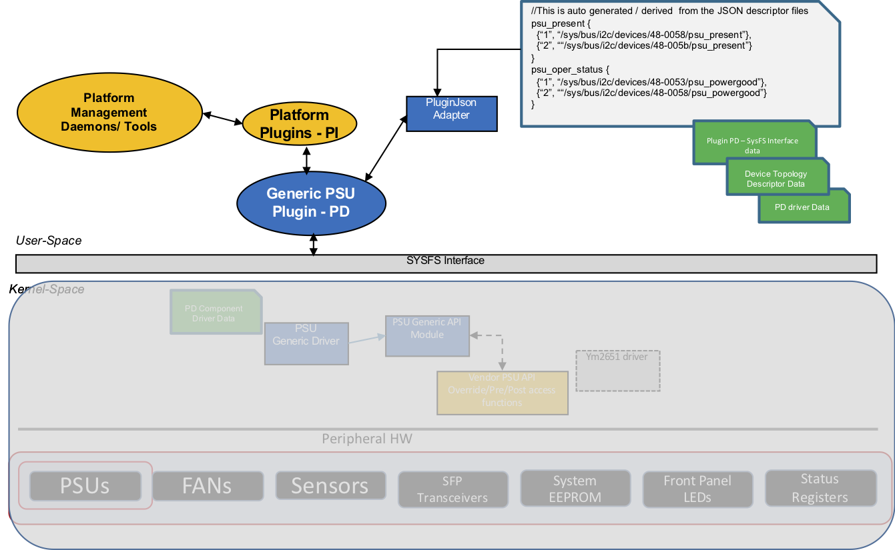

## Feature Name
Platform Driver Development Framework (PDDF)

## High Level Design Document
**Rev 0.1**

## Table of Contents
 * [List of Tables](#list-of-tables)
 * [Revision](#revision)
 * [About This Manual](#about-this-manual)
 * [Scope](#scope)
 * [Definition/Abbreviation](#definitionabbreviation)
 * [Requirements Overview](#requirements-overview)
	  * [Functional Requirements](#functional-requirements)
	  * [Scalability Requirements](#scalability-requirements)
	  * [Warmboot Requirements](#warmboot-requirements)
	  * [Configuration and Management Requirements](#configuration-and-management-requirements)
 * [Functional Description](#functional-description)
 * [Design](#design)
	 * [Overview](#overview)
		 * [Generic PDDF HW Device Drivers](#generic-pddf-hw-device-drivers)
		 * [PDDF Platform API plugins](#pddf-platform-api-plugins)
	 * [Generic Driver Design](#generic-driver-design)
		 * [PDDF Device Driver Modules](#pddf-device-driver-modules)
		 * [PDDF Device Modules](#pddf-device-modules)
		 * [Driver Extension Framework](#driver-extension-framework)
	 * [Generic Plugin Design](#generic-plugin-design)
	 *  [PDDF I2C Component Design](#pddf-i2c-component-design)
		 * [List of Supported Components](#list-of-supported-components)
		 * [I2C Topology Descriptor](#i2c-topology-descriptor)
		 * [PSU Component](#psu-component)
		 * [FAN Component](#fan-component)
		 * [LED Component](#led-component)
		 * [Sensors](#sensors)
		 * [System EEPROM Component](#system-eeprom-component)
		 * [System Status Registers](#system-status-registers)
		 * [Optics Component](#optics-component)
		 * [lm-sensors](#lm-sensors-tools)
 * [SAI](#sai)
 * [CLI](#cli)
 * [Serviceability and DEBUG](#serviceability-and-debug)
 * [Warm Boot Support](#warm-boot-support)
 * [Unit Test](#unit-test)


# List of Tables
[Table 1: Abbreviations](#table-1-abbreviations)

# Revision
| Rev |     Date    |       Author       | Change Description                |
|:---:|:-----------:|:------------------:|-----------------------------------|
| 0.1 | 05/27/2019  |  Systems Infra Team     | Initial version                   |
| 0.2 | 06/06/2019  |  Systems Infra Team     | Incorporated feedback             |

# About this Manual
Platform Driver Development Framework (PDDF) is part of SONiC Platform Development Kit (PDK) which optimizes the platform development. PDK consists of 
 - PDDF (Platform Driver Development Framework): For optimized data-driven platform driver and SONiC plugin development
 - PDE (Platform Development Environment): For optimized build and test of platform and SAI code

PDE details are covered in another document. This document describes Platform Driver Development Framework (PDDF) which can be used as an alternative to the existing manually-written SONiC platform driver framework. It enables platform vendors to rapidly develop the device specific custom drivers and SONiC user space python plugins, using a data-driven architecture, to manage platform devices like Fan, PSUs, LEDs, Optics, System EEPROM, etc., and validate a platform on SONiC. 

# Scope
This document describes the high level design details of PDDF and its components. The PDDF consists of generic device drivers and user space platform API plugins which use the per platform specific data in the JSON descriptor files. This document describes the interaction between all the components and the tools used to support these drivers and plugins.  


# Definition/Abbreviation
### Table 1: Abbreviations
| **Term**                 | **Meaning**                         |
|--------------------------|-------------------------------------|
| ODM                      | Original Design Manufacturer        |
| OEM                      | Original Equipment Manufacturer        |
| PDDF                      | Platform Driver Development Framework         |
| PDE                       | Platform Development Environment              |
| PDK                      | Platform Development Kit              |
| SAI                      | Switch Abstraction Interface |
| PSU                      | Power Supply Unit |
| I2C                      | Inter-integrated Circuit communication protocol |
| SysFS                    | Virtual File System provided by the Linux Kernel |


## 1 Requirements Overview
SONiC OS is portable across different network devices with supported ASIC via Switch Abstraction Interface (SAI). These devices primarily differ in the way various device specific hardware components are accessed, and thus require custom device drivers and python plugins. Each platform vendor implements these custom device drivers and plugins. The feature requirement is to support a SONiC platform driver development framework to enable rapid development of custom device drivers and plugins.

### 1.1	Functional Requirements
Define Platform driver development framework to enable platform vendors to develop custom device drivers and plugins rapidly to accelerate development and validation of platforms in SONiC environment. The following requirements need to be satisfied by the framework.
 - PDDF to provide a data driven      framework to access platform HW devices.
 - PDDF shall support I2C based HW    designs with I2C controllers on the Host CPU.
 - Provide reusable generic device drivers for the following components
	 - FAN		 
	 - PSU (Power supply units)
	 - System EEPROM
	 - Optic Transceivers (SFP, QSFP)
	 - CPLD
	 - System Status Registers
	 - System LED
 - Generic drivers would expose device attributes via SysFS interface
 - PDDF shall support reusing custom device driver or standard linux driver to be used along with the generic drivers. This would allow  platform HW devices to be managed by PDDF generic drivers or custom/standard Linux drivers.
 - Custom drivers should expose device attributes via SysFS interface
 - Support platform vendors to extend generic drivers with custom implementations to support initialization, exit, pre and post access for get / set of attributes    
 - Provide generic SONiC python plugins to access  various attributes for the following devices
	 - FAN 		
	 - PSU (Power supply units) 		
	 - System EEPROM 		
	 - Optic Transceivers (SFP, QSFP) 		
	 - System Status Registers 		
	 - System LED
 - Support data driven framework using the descriptor files to represent the following platform specific information
   - I2C HW topology representing the various devices and their interconnections
   - Per platform data to enable get / set of various attributes in each device
 - PDDF generic drivers shall not require a reboot after installation
 - PDDF generic drivers shall support initialization and de-initialization
 - Platform drivers developed using the PDDF framework shall support the current SONiC platform CLIs  
 - PDDF developer guide	shall be provided 

 ### 1.2 Configuration and Management Requirements
 - There are no configuration commands
 - The generic PDDF plugins use the base classes from src/sonic-platform-common for the following
    components:
	 - PSU (sonic_psu)
	 - Optic Transceivers (sonic_sfp)
	 - EEPROM (sonic_eeprom)
	 - LED (sonic_led)
 - Current SONiC platform CLIs shall be supported

### 1.3 Scalability Requirements
NA
### 1.4 Warmboot Requirements
NA
## 2 Functional Description

SONiC platform bring up typically involves the following steps:

 - Support Switching ASIC
 - Vendor platform specific drivers and plugins to manage platform devices

Generally, the SAI support for a given switching silicon is pre-validated, and the platform vendor mostly focuses on the platform devices during platform bring up. The platform components involve the following:

 - port_config.ini (Port / Lane mappings)
 - config.bcm
 - Platform Device drivers (FAN/PSU/Optics/Sensors/CPLD,etc.)
 - SONiC platform python plugins

Most of the platform bring up effort goes in developing the platform device drivers, SONiC plugins and validating them. Typically each platform vendor writes their own drivers and plugins which is very tailor made to that platform. This involves writing code, building, installing it on the target platform devices and testing. Many of the details of the platform are hard coded into these drivers, from the HW spec. They go through this cycle repetitively till everything works fine, and is validated before upstreaming the code.

PDDF aims to make this platform driver and plugin development process much simpler by providing a data driven development framework. This is enabled by:

 - JSON descriptor files for platform data
 - Generic data-driven drivers for various devices
 - Generic SONiC plugins
 - Vendor specific extensions for customization and extensibility

This makes the development and testing much simpler. Any change in the platform data can be made on the target in the JSON files and validated instantly. This helps improve the productivity of the platform developers significantly.

## 3 Design

### 3.1 Overview



 SONiC PDDF (Platform driver development framework) supports the following HW devices on a given platform: 
 
 - Fan
 - PSU
 - System EEPROM
 - CPLD
 - Optic Transceivers
 - System LED control via CPLD 
 - System Status Registers in CPLD
 - Temp Sensors 
 
 High level architecture of the PDDF consists of the following:

 - PDDF JSON Descriptor files  
 - Generic PDDF Python plugins for various devices implementing the Platform APIs
 - PDDF Tools
 - Generic PDDF HW device drivers in kernel space
 - Custom vendor driver extensions modules

#### 3.1.1	JSON Descriptor files

 The descriptor files are used to represent the following information for a given platform: 	
 - I2C Topology descriptor
	 - Representation of the I2C bus
   - I2C client devices
   - Inter connection of I2C devices	 	
 - I2C Device Access attributes 		
	 - Each device exposes a set of data attributes to read/write  		
		 - Eg., PSU(psu_present), SFP/QSFP(sfp_present, lpmode) - CPLD registers/offsets/ masks, etc., 		
	 - For each device, platform specific attributes to help access the data attributes 		
 -  Reference to a standard Linux driver, if available and used, for I2C device
	 - pca954x,   lm75, etc., 	
 - Value Map for each device in a platform 		
	 - Each  device or a platform can represent values to be interpreted in a different way.
		 - For eg., on some platforms “1” can represent “Port Side Intake”, whereas on another platform it could be “0”. This map provides how to interpret the values.

#### 3.1.2 Generic PDDF HW Device Drivers


PDDF generic drivers are device drivers for the following devices: FAN/PSU/EEPROM/Optics Transceivers/ System LED/ CPLDs. These drivers in kernel space, rely on the per-platform data in JSON descriptor files to expose data via SysFS interface. They provide a generic interface to get/set of these attributes. There are two types of data, a driver works on:

 - Device data – Attributes exposed by the device itself
 - Platform access data – Information on how/ where to access the device attributes

These generic PDDF drivers provide capabilities to:

 - Extend using vendor implementations
 - Mix and match generic and standard drivers
 - Support any existing driver for a given component

#### 3.1.3 PDDF Platform API plugins
PDDF provides generic user space python plugins which implement the platform APIs defined under:
 - src/sonic-platform-common/sonic_sfp (Optic transceivers)
 - src/sonic-platform-common/sonic_psu (PSU Util)
 - src/sonic-platform-common/sonic_led (Port LED plugin)

These plugins use the per platform JSON descriptor files to use the appropriate SysFS attributes to get and set.

#### 3.1.4 Source code organization and Packaging
PDDF source code is mainly organized into platform dependent data files(JSON descriptors), generic PDDF  driver modules, generic  plugins, generic utils, and start up scripts.

 - /service/sonic-buildimage/platform/pddf
	  - modules
	  - init

 - /service/sonic-buildimage/src/sonic-platform-common/pddf
	  - plugins
	  - utils
	  
 - JSON descriptor files should be placed in the "pddf/json" directory under the respective "/sonic-buildimage/platform/" directory path. For example:
	 - sonic-buildimage/platform/broadcom/sonic-platform-modules-accton/as7712-32x/pddf/json/\<descriptor.json\>)

From SONiC build, all the PDDF components shall be built and packaged into a common pddf Debian package. Every platform builds and packages per platform specific drivers, utilities, scripts, etc.,  into a platform Debian package. 

#### 3.1.5 Deployment details
For the Runtime environment, PDDF shall provide a init script which shall be integrated into the per platform init script. This will load the PDDF modules and plugins and will use the per platform JSON descriptor files for initializing the platform service. 

### 3.2 Generic Driver Design
Vendors write platform specific component drivers and deploy them as kernel loadable modules. In PDDF, drivers are generic, with platform specific data populated in JSON descriptor files. The JSON descriptor files are provided by the PDDF developer. Usually two different kernel modules are associated with each component. One is *Device Driver Module* and other is *Device Module*.

For a generic device driver, there are 2 types of data.
 - Device-Data Attributes
 - Access-Data

**Device-Data Attributes:**
	These are the attributes exposed to the user by the driver. These attributes provide device-related information. These attributes can be read-only or read-write. These attributes are dynamically associated with the device driver using the input from data JSON file. Examples of Device-Data attributes include,
	*psu_present* and *psu_power_good* for PSU, and
	*fan1_front_rpm* and *fan1_rear_rpm* for FAN device drivers.

**Access-Data:**
	This is platform specific data used to retrieve values from hardware. This includes per-Device Data attribute device addresses, register offsets, masks, expected values and length. This access-data varies for various components. The per-platform data is read from JSON file and passed to the kernel space as driver platform_data using the access-data attributes.


#### 3.2.1 PDDF Device Driver Modules
PDDF device driver modules are generic. Access-Data is attached to the I2C device data structure during I2C device instantiation. This access-data also specifies which Device-Data attributes are supported, along with the platform dependent data for each attribute. The supported Device-Data attributes are dynamically created as SysFS attributes. This design is helpful in linking different Device-Data attributes to different I2C client devices, if applicable. The additional *driver_data* for the client, which consist of values of the attributes, last updated time, mutex lock, name etc, is also allocated dynamically and maintained *per-attribute* wise.


#### 3.2.2 PDDF Device Modules
PDDF device module is an intermediate module to manage the actual device driver module. It helps populate the per-platform access data, and manages the access data attributes via SysFS interface. It also helps in I2C device instantiation using the I2C topology data and access-data. It defines a SysFs attribute *dev_ops* to trigger instantiation or detachment of the devices. This module has a dependency on the driver-module.


#### 3.2.3 Driver Extension Framework
There is a provision to have a *pre* and *post* APIs for important driver/module functions such as probe, init, exit. These pre and post functionalities can be vendor specific, if required, and need to be defined by each vendor in a separate vendor-specific API module. A generic implementation of *show* or *store* APIs are provided for each Device-Data attribute. However, if needed vendor can provide their own implementation for these APIs. Such definitions should also go into the vendor-specific API module.


#### 3.2.4 JSON Descriptor Files
There are multiple JSON files which must be provided by a PDDF developer.  The list of information provided by the JSON files is below,

 - Platform Inventory Info:
	 -  Details like number of fans, PSUs, ports etc
 - Device Parsing Info
 - I2C Topology Info
 - Device Access info
 - Value Maps Info for various device-data Attributes, etc.


### 3.3 Generic Plugin Design




Generic plugins are extended from respective base classes but do not have any platform specific data. All the platform specific data mentioned below, is retrieved from JSON files.
  * Platform inventory
  * SysFS paths of various device attributes
  * Platform dependent interpretations of some of the attribute values 

Important thing to note in this type of design is that the PDDF has standardized the attribute names, and it provides the ability to map it to driver supported attribute names. Since PDDF provides the drivers for most of the devices, it maintains a list of device attributes. If there is a need to use a non-PDDF custom/standard driver, user must provide the list of attributes supported (which might be used by the generic plugin) by that driver. If such driver uses different name for an attribute, then it is incumbent that the user also define the driver attribute name.
Example below shows the usage of a driver 'ym2651' for a PSU1-PMBUS device. Generic plugin has an attribute name *psu_fan_dir*. However, if the same information is denoted in the driver by *psu_fan_direction*, then user indicates this by the field *drv_attr_name*.
```
"PSU1-PMBUS": {
	"dev_info": {
		"device_type": "PSU-PMBUS",
		"device_name": "PSU1-PMBUS",
		"device_parent": "MUX3",
		"virt_parent": "PSU1"
	},
	"i2c": {
		"topo_info": {
		    "parent_bus": "0x30",
		    "dev_addr": "0x58",
		    "dev_type": "ym2851"
		},
		"attr_list": [
			{ "attr_name": "psu_fan1_fault" },
			{ "attr_name": "psu_v_out" },
			{ "attr_name": "psu_i_out" },
			{ "attr_name": "psu_p_out" },
			{ "attr_name": "psu_temp1_input" },
			{ "attr_name": "psu_fan1_speed_rpm" },
			{
				"attr_name":"psu_fan_dir",
				"drv_attr_name": "psu_fan_direction"
			},
			{ "attr_name": "psu_mfr_id" }
		]
	}
}
```
List of supported attribute names are mentioned under each device's plugin util. Path for each attribute's SysFS is retrieved and is cached so that each time plugin util is called, it doesn't calculate the path again.


### 3.4 PDDF I2C Component Design

#### 3.4.1 List of Supported HW Components
PDDF supports I2C based HW design consisting of the following components:

 - Fan Controller (CPLD or dedicated Controller EM2305) 
 - PSUs (YM2651, Ym2851, etc.,) 
 - Temp Sensors (LM75, LM90, TMP411, etc.,) 
 - Optics (SFP/QSFPs, EEPROM, etc.,) 
 - System EEPROM (at24, etc.,) 
 - CPLDs 
 - MUX  (PCA954x,..) 
 - System LEDs managed by CPLD etc.,

#### 3.4.2 I2C Topology Descriptor
Generally a platform consist of fans, PSUs, temperature sensors, CPLDs, optics (SFP, QSFPs etc), eeproms and multiplexing devices. I2C topology refers to the parent-child and other connectivity details of the I2C devices for a platform. The path to reach any device can be discerned using the I2C topology.

Example,


I2C topology data consist of information such as *parent_bus*, *dev_addr* and *dev_type*. Users would describe the I2C topology data using a JSON Topology descriptor file .
*dev_info* object is used to represent the logical device.
*i2c* and *topo_info* are used for creating the I2C client.

```
"FAN-CPLD":
    {
        "dev_info": {
	        "device_type":"FAN",
	        "device_name":"FAN-CPLD",
	        "device_parent":"MUX2"
		},
        "i2c":
        {
	        "topo_info": {
		        "parent_bus":"0x20",
		        "dev_addr":"0x66",
		        "dev_type":"fan_ctrl"
		        },
	        ...
		}
}
```
Here is a brief explanation of the fields in topology JSON

> **device_type**: This mentions the generic device type. It can be either of these, PSU, FAN, CPLD, MUX, EEPROM, SFP, etc. This is a mandatory field.

> **device_name**: This is the name of the device in the I2C topology. There can be a number or a substring appended to uniquely identify the device. e.g. FAN-CPLD, PSU1, PSU2, PORT1, MUX2 etc. This is an optional field.

> **device_parent**: This gives the name of the parent device in the topology. It is also a mandatory field.

> **i2c** object is put to differentiate with other mode of access such as PCI or BMC etc. **topo_info** gives the info to generate the I2C client. All the fields inside topo_info are mandatory.

> **parent_bus**: This denotes the bus number to which device is connected.

> **dev_addr**: This denotes the I2C address in the range of <0x0-0xff>.

> **dev_type**: This denotes the name/type of device. This should match with the dev_id of the device inside the supporting driver.


If there is a MUX in path, its connected devices are mentioned under an array *channel*. Here is an example,

```
"MUX2": {
	"dev_info": {
		"device_type":"MUX",
		"device_name":"MUX2",
		"device_parent":"MUX1"
	},
	"i2c": {
		"topo_info": {
		    "parent_bus":"0x10",
		    "dev_addr":"0x76",
		    "dev_type":"pca9548"
		},
		"dev_attr": {"virt_bus":"0x20"},
		"channel": [ 
		    { "chn":"0", "dev":"FAN-CPLD" },
		    { "chn":"2", "dev":"CPLD1" }
		]
	}
}
```
If the object is a MUX, then
> **virt_bus**: This is an information used internally to denote the base address for the channels of the mux. So if the virt_bus is 0x20 for a pca9548 then channel-buses are addressed as (0x20+0), (0x20+1), (0x20+2) ....  , (0x20+7).

> **channel**: This array gives info about the child devices for a mux. It mentions **chn** denoting the channel number, and **dev** denoting the device_name connected to this channel.

If the object is PSU, then
> **psu_idx**: This is used internally to denote the PSU number. It is also a mandatory field.

> **interface**: Here the user needs to define the PSU interface, eeprom and pmbus, for which I2C clients would be created. If user needs to use only pmbus client to get all the information, then only that should be mentioned.

```
"PSU1":
{
    "dev_info": {
	    "device_type":"PSU",
	    "device_name":"PSU1",
	    "device_parent":"MUX3"
	},
    "dev_attr": { "psu_idx":"1"},
    "i2c": {
	    "interface": [  
			{ "itf":"pmbus", "dev":"PSU1-PMBUS" },
			{ "itf":"eeprom", "dev":"PSU1-EEPROM" }
		]
    },
}
```

PDDF tools will use descriptor file data to instantiate I2C client devices and populate per-platform data.

#### 3.4.3 PSU Component
PDDF has a PSU module and a PSU driver module.
##### 3.4.3.1 PSU Driver Modules
PDDF PSU module is used to
  * Create the access data attributes to transfer the access data from user space to kernel.
  * Populates the access data into PSU client's *platform_data*
  * Create the PSU I2C client

Usually every PSU device has two interfaces and hence two I2C clients.
  1. EEPROM interface
  2. SMBUS interface

It is possible that all the required PSU info can be read using SMBUS interface itself. In such cases, only one SMBUS device needs to be created, and all the SysFS attributes shall be  created under this device.

PDDF PSU driver is used for both the interfaces and SysFS attributes are divided among the two. PSU driver module has the following functionalities,
  * Create the SysFS data attributes 
  * Get/Set  attribute's value from/to HW 

Currently supported PSU SysFS Attributes are:
```
psu_present  
psu_model_name  
psu_power_good  
psu_mfr_id  
psu_serial_num  
psu_fan_dir  
psu_v_out  
psu_i_out  
psu_p_out  
psu_fan1_speed_rpm
```
##### 3.4.3.2 PSU JSON Design
PSU JSON is structured to include the access-data for all the supported SysFS attributes.
*attr_list* is an array object which stores the array of access-data for multiple  attributes. If some of the field in the attribute object is not applicable to some particular attribute, it can be left and not filled.

Description of the fields inside *attr_list*
> **attr_name**:  This field denotes the name of SysFS attribute associated with this device I2C client. It is a mandatory field.

> **attr_devaddr**: This denotes the I2C address of device from where this SysFS attribute value is to be read. e.g if *psu_present* is the SysFS attribute, and it needs to be read from a CPLD, the I2C address of that CPLD is to be mentioned here.

> **attr_devtype**: Source device type of the value of SysFS attribute.

> **attr_offset**: Register offset of the SysFS attribute.

> **attr_mask**: Mask to be applied to read value.

> **attr_cmpval**: Expected reg value after applying the mask.  This is used to provide a Boolean value to the attribute. e.g `attr_val = ((reg_val & attr_mask) == attr_cmpval)` .

> **attr_len**: Length of the SysFS attribute in bytes.


```
"PSU1-EEPROM": {
	"i2c": {
		"attr_list": [
			{
				"attr_name":"psu_present",
				"attr_devaddr":"0x60",
				"attr_devtype":"cpld",
				"attr_offset":"0x2",
				"attr_mask":"0x2",
				"attr_cmpval":"0x0",
				"attr_len":"1"
			},
			{
				"attr_name":"psu_model_name",
				"attr_devaddr":"0x50",
				"attr_devtype":"eeprom",
				"attr_offset":"0x20",
				"attr_mask":"0x0",
				"attr_len":"9"
			},
		...
        ]
    }
},
```


##### 3.4.3.3 PSU Plugin Design
PsuBase is the base PSU plugin class, which defines various APIs to get/set information from the PSU devices. PDDF PSU generic plugin shall extend from PsuBase and implement the platform specific APIs, using the platform specific information in the JSON descriptor files

Example,
```
def get_num_psus(self):
	"""
	Retrieves the number of PSUs supported on the device
	:return: An integer, the number of PSUs supported on the device
	"""
	return 0
```

#### 3.4.4 FAN Component
Fan has a PDDF device module and a PDDF device driver module.

##### 3.4.4.1 FAN Driver Modules
PDDF fan module is used to
  * Create the access data attributes to transfer the access data from user space to kernel.
  * Populates the access data into PSU client's *platform_data*
  * Create the fan I2C client

There could be one or multiple client for fan controller. If any other controller is used, such as EMC2305 or EMC2302 etc, then there might be multiple fan controller clients .

PDDF fan driver is used for all the fan clients and SysFS attributes are divided. Fan driver module has the following functionalities,
 * Create the SysFS attributes 
  * Get/Set SysFS attribute's value from/to Fan controller devices

Supported Fan SysFS attributes are:

```
fan<idx>_present  
fan<idx>_direction  
fan<idx>_front_rpm  
fan<idx>_rear_rpm  
fan<idx>_pwm  
fan<idx>_duty_cycle  
fan<idx>_fault  
where idx represents the Fan index [1..8]
```
##### 3.4.4.2 FAN JSON Design
FAN JSON is structured to include the access-data for all the supported SysFS attributes.
*attr_list* is an array object which stores the array of access-data for multiple  attributes. If some of the field in the attribute object is not applicable to some particular attribute, it can be left out.

Description of the objects inside *attr_list* which are very specific to Fan components are:

> **attr_mult**: Multiplication factor to the value to get the FAN rpm.

> **attr_is_divisor**: If the register value is a divisor  to the multiplication factor  to get the FAN rpm.


```
"FAN-CPLD": {
	"i2c": {
		"dev_attr": { "num_fan":"6"},
		"attr_list": [
			{
				"attr_name":"fan1_present",
				"attr_devtype":"FAN-CPLD",
				"attr_offset":"0x0F",
				"attr_mask":"0x1",
				"attr_cmpval":"0x0",
				"attr_len":"1"
			},
			...
			{
				"attr_name":"fan1_direction",
				"attr_devtype":"FAN-CPLD",
				"attr_offset":"0x10",
				"attr_mask":"0x1",
				"attr_cmpval":"0x1",
				"attr_len":"1"
			},
			...
			{
				"attr_name":"fan1_front_rpm",
				"attr_devtype":"FAN-CPLD",
				"attr_offset":"0x12",
				"attr_mask":"0xFF",
				"attr_len":"1",
				"attr_mult":"100",
				"attr_is_divisor": 0
			},
		]
	}
}
```


##### 3.4.4.3 FAN Plugin Design
FanBase is the base FAN plugin class, which defines various APIs to get/set information from the Fan devices. PDDF Fan generic plugin shall extend from FanBase and implement the platform specific APIs, using the platform specific information in the JSON descriptor files. FanBase is part of the new platform API framework in SONiC.

Example,
```
	def get_direction(self):
		"""
		Retrieves the direction of fan
		Returns:
		A string, either FAN_DIRECTION_INTAKE or FAN_DIRECTION_EXHAUST
		depending on fan direction
		"""

	def get_speed(self):
		"""
		Retrieves the speed of fan in rpms
		Returns:
		An integer, denoting the rpm (revolutions per minute) speed
		"""

```

#### 3.4.5 LED Component
Network switches have a variety of LED lights, system LEDs, Fan Tray LEDs, and port LEDs, used to act as indicators of switch status and network port status.  The system LEDs are used to indicate the status of power and the system. The fan tray LEDs indicate each fan status. The port LEDs are used to indicate the state of the links such as link up, Tx/RX activity and speed. The Port LEDs are in general managed by the LED controller provided by switch vendors. The scope of this LED section  is for system LEDs and fan tray LEDs.     

##### 3.4.5.1 LED Driver Design    
LEDs are controlled via CPLDs. LEDs status can be read and set via I2C interfaces. A platform-independent driver is designed to access CPLDs via I2c interfaces. CPLD/register address data is stored in platform-specific JSON file. User can run plugins to trigger drivers to read/write LED statuses via SysFS. This generic LED driver is implemented to control System LED and Fan Tray LED.  

##### 3.4.5.2 JSON Design    
   This section provides examples of configuring platform, System LED and Fantray LED.  They are consisted of key/value pairs. Each pair has a unique name. The table describes the naming convention for each unique key.       


| **Key**                 | **Description**                         |
|--------------------------|-------------------------------------|
| PLATFORM                      | Numbers of power supply LED, fan tray LED        |
| SYS_LED                      | System LED indicates System         |
| PSU<x>_LED                      |Power Supply Status LED  X is an integer starting with 1 Example: PSU1_LED, PSU2_LED             |
| LOC_LED                      | Flashing by remote management command.  Assists the technician in finding the right device for service in the rack |
| FAN_LED                      | Fan Status LED for all fans |
| DIAG_LED                      | System self-diagnostic test status LED |
| FANTRAY<x>_LED         | Status LED for individual fan. X is an integer starting with 1 Example: FANTRAY1_LED, FANTRAY2_LED |  

Samples:

    "PLATFORM" :  { "num_psu_led":"1",  "num_fantray_led" : "4"}  
    "PSU1_LED" :  { "dev_info": { "device_type":"LED", "device_name":"PSU_LED"},    
                       "dev_attr": { "index":"0"},   
                       "i2c": {   
                                [  
                                  {"attr_name":"on",  "bits" : "6:5", "color" : "Green", "value" : "0x1", "swpld_addr" : "0x60", "swpld_addr_offset" : "0x66"},  
                                  {"attr_name":"faulty",  "bits" : "6:5", "color" : "Amber", "value" : "0x2", "swpld_addr" : "0x60", "swpld_addr_offset" : "0x66"},  
                                  {"attr_name":"off",  "bits" : "6:5", "color" : "Off", "value" : "0x3", "swpld_addr" : "0x60", "swpld_addr_offset" : "0x66"}  
                                ]  
                              }  
                    }  


##### 3.4.5.3 LED Plugin Design
A generic user space Python plugin is designed to access LEDs via SysFS interface.  The plugin reads SysFS path information from platform-specific JSON File.               The PddfLedUtil class provides set/get APIs to set LED color and retrieve LED color.    


                  class PddfLedUtil:
                         # Possible status LED colors
                            GREEN = “on”
                            RED= “faulty”
                            OFF=”off”  
                           def set_status_led(self, device_name, index,  color, color_state):
                               Args:   
                                    device_name: A string representing device: FAN, LOC, DIAG, SYS, PSU and FANTRAY
                                    index: An integer, 1-based index to query status
                                    color: A string representing the color with which to set the status LED: GREEN, RED, OFF
                                    color_state: A string representing the color state: SOLD, BLINK  
                               Returns:
                                    Boolean: True is status LED state is set successfully, False if not.   

                           def get_status_led(self, device_name, index):
                               Args:   
                                    device_name: A string representing device: FAN, LOC, DIAG, SYS and PSU
                                    index: An integer, 1-based index of the PSU of which to query status
                              Returns:
                                    Color and color state information                      
                   SysFS Path Example:
                             /sys/kernel/pal/led/cur_state/
                                       color
                                       color_state   
                   Examples:
                           #./ledutil.py –set <device> <index> <color> <state>
                           #./ledutil.py –set PSU 1 GREEN SOLID  
                           #./ledutil.py –get <device> <index>
                           #./ledutil.py –get PSU 1
                                        PSU1_LED : Green
                                        Color State: Solid


#### 3.4.6 Sensors

##### 3.4.6.1 Driver Design  
The Linux driver supports LM75/LM90 compatible temperature sensors.  It is used to support communication through the I2C bus and interfaces with the hardware monitoring sub-system. A SysFS interface is added to let the user provides the temperature sensors information to the kernel to instantiate I2C devices.   

##### 3.4.6.2 JSON Design
Platform specific temperature sensor configuration file is designed to instantiate I2c devices and provides access information for plugin. These data are grouped into three sections: PLATFORM, I2C Topology and TEMP Data. PLATFORM section provides the number of temperature sensors. I2C Topology section and TEMP Data are used for instantiating I2C devices and accessing temperature sensors vis SysFS attributes.      
They are consisted of key/value sections. Each section has a unique name. The table describes the naming convention for each unique key.     

| **Key**                 | **Description**                         |
|--------------------------|-------------------------------------|
| PLATFORM                      | Numbers of temperature sensors        |
| TEMP<x>                      | Temperature sensor. x is an integer starting with 1         |  
| MUX<x>                      | This section is part of I2C topology configuration         |

    Samples:

    "PLATFORM" :  { "num_temp_sensors":"3"}  
    "TEMP1" :  { "dev_info": { "device_type":"TEMP_SENSOR", "device_name":"TEMP1", "display_name" : "CPU Temp Sensor" },       
                 "dev_attr": { "index":"0"},   
                 "i2c": {  
                             "topo_info": { "parent_bus":"0x21", "dev_addr":"0x48", "dev_type":"lm75"},
                             "attr_list":
                       		 [
                                		{ "attr_name": "temp1_max"},
                               			{ "attr_name": "temp1_max_hyst"},
                                		{ "attr_name": "temp1_input"}
                       		 ]                     
                        }  
                }  
##### 3.4.6.3 Plugin Design  
A generic user space Python plugin is designed to access temperature sensors via SysFS interface. The plugin gets SysFS path information from platform-specific JSON File, pal-device.json.  The PddfThermailUtil class provides two APIs to retrieve the number of temp sensors and to show temperature sensor readings.  

    Class PddfThermalUtil:  
	def get_num_thermals(self):
		Retrieves the number of temp sensors supported on the device 
		Return: An integer, the number of temperature sensors on the device  
	def show_temp_values(self):
		Prints out readings from all temp sensors on the device
		Return: Boolean, True if reading successfully, False if not

    Example:
    Reading Display:
    #./thermalutil.py
     lm75-i2c-33-48  
     CPU Temp Sensor     +25.5 C (high = +80.0 C, hyst = +75.0 C)
     lm75-i2c-33-49
     CPU Temp Sensor    +23.0 C (high = +80.0 C, hyst = +75.0 C)
     lm75-i2c-33-4a
      CPU Temp Sensor    +28.0 C (high = +80.0 C, hyst = +75.0 C)

     SysFS Path Example:
     /sys/bus/i2c/devices/i2c-0/i2c-16/i2c-33/33-0048/hwmon/hwmon0/temp1_max
     /sys/bus/i2c/devices/i2c-0/i2c-16/i2c-33/33-0048/hwmon/hwmon0/temp1_max_hyst
     /sys/bus/i2c/devices/i2c-0/i2c-16/i2c-33/33-0048/hwmon/hwmon0/temp1_input


#### 3.4.7 System EEPROM Component

##### 3.4.7.1 Driver Design
For SYS EEPROM component, PDDF leverages the existing Linux standard driver **at24**. This driver supports multiple variations of the EEPROM viz. 24c00, 24c01, 24c08, 24c16, 24c512 and many more. This driver provides one SysFS device-data attribute named **eeprom**. Since standard driver is being used for EEPROM, PDDF uses user-space command to instantiate the EEPROM device.
Example,
> echo 24c02 0x57 > /sys/bus/i2c/devices/i2c-0/new_device

##### 3.4.7.2 JSON Design
For SYS EEPROM, the client creation information is present in I2C Topology JSON file. Since the driver is standard and attribute-name is fixed, *eeprom*, there is no component specific JSON file representing the access-data. Example of the SYS EEPROM entry in the topology JSON is mentioned below.
```
"EEPROM1": {
  "dev_info": {
    "device_type": "EEPROM",
    "device_name": "EEPROM1",
    "device_parent": "SMBUS0"
  },
  "i2c": {
    "topo_info": {
      "parent_bus": "0x0",
      "dev_addr": "0x57",
      "dev_type": "at24"
    },
    "dev_attr": {"access_mode": "BLOCK"}
  }
},
```

##### 3.4.7.3 Plugin Design
A generic user space plugin is written for EEPROM. Internally it leverages eeprom_base and eeprom_tlvinfo base classes. The SysFS path for driver supported attribute is retrieved from the user provided JSON file. An example of the API definition form eeprom_base is shown below,
```
def check_status(self):
    if self.u != '':
        F = open(self.u, "r")
        d = F.readline().rstrip()
        F.close()
        return d
    else:
        return 'ok'
def set_cache_name(self, name):
    # before accessing the eeprom we acquire an exclusive lock on the eeprom file.
    # this will prevent a race condition where multiple instances of this app
    # could try to update the cache at the same time
    self.cache_name = name
    self.lock_file = open(self.p, 'r')
    fcntl.flock(self.lock_file, fcntl.LOCK_EX)
```
Generic plugin may provide further initialization steps and definitions for new APIs.


#### 3.4.8 System Status Registers

##### 3.4.8.1 Driver Design
System Status information is present in CPLD registers. These information can be retrieved from CPLD using I2C interface to the CPLDs. Access-data to retrieve *system status* information is provided by the user in a JSON file. A generic driver is written in PDDF to store all the access-data in kernel space, and use it to read information from CPLDs. User space plugin would trigger the retrieval of *system status* data using generic module. The system status data attributes are created under `/sys/kernel/pal/devices/sysstatus/data/`.

##### 3.4.8.2 JSON Design
An example of object from system status JSON file is shown below,
```
"SYSSTATUS": {
  "attr_list": [
    { "attr_name":"board_info","attr_devaddr":"0x60", "attr_offset":"0x0","attr_mask":"0x1f","attr_len":1},
    { "attr_name":"cpld1_version","attr_devaddr":"0x60","attr_offset":"0x1","attr_mask":"0xff","attr_len":1},
    { "attr_name":"power_module_status","attr_devaddr":"0x60","attr_offset":"0x2","attr_mask":"0x1f","attr_len":1},
    { "attr_name":"system_reset5","attr_devaddr":"0x60","attr_offset":"0x50","attr_mask":"0xff","attr_len":1},
    { "attr_name":"system_reset6","attr_devaddr":"0x60", "attr_offset":"0x51","attr_mask":"0xff","attr_len":1},
    { "attr_name":"system_reset7","attr_devaddr":"0x60","attr_offset":"0x52","attr_mask":"0xff","attr_len":1},
    { "attr_name":"system_reset8","attr_devaddr":"0x60","attr_offset":"0x53","attr_mask":"0xff","attr_len":1},
    { "attr_name":"misc1","attr_devaddr":"0x60","attr_offset":"0x68","attr_mask":"0xff","attr_len":1},
    { "attr_name":"cpld2_version","attr_devaddr":"0x62","attr_offset":"0x1","attr_mask":"0xff","attr_len":1},
    { "attr_name":"interrupt_status","attr_devaddr":"0x62","attr_offset":"0x2","attr_mask":"0xf","attr_len":1},
    { "attr_name":"system_reset","attr_devaddr":"0x62","attr_offset":"0x3","attr_mask":"0x1","attr_len":1},
    { "attr_name":"misc2","attr_devaddr":"0x62","attr_offset":"0x68","attr_mask":"0x2","attr_len":1}
  ]
},
```
##### 3.4.8.3 Plugin Design
A generic user-space plugin is added to read the system status information. The SysFS path of the info-data attribute is retrieved from the user provided JSON file. Example of the API definition is given below,
```
def get_system_reset_info(self, str):
    Args:
      str: Name of the system status data attribute.
    Returns:
      Integer: Value of the system status data attribute.

```
#### 3.4.9 Optics Component
##### 3.4.9.1	Driver design

Transceiver devices (SFP, QSFP etc.) expose mainly two kinds of access/control methods.  
  * EEPROM read/write access on linear address space of 256\*128 byte paged memory.
  * Device control attributes exposed as control pins via external CPLD/FPGA device.

In existing implementations, the drivers that access these attributes are very platform dependent. They depend on exactly which CPLD is managing which pin on each SFP device. And that’s different for every switch, even for similar switches from the same vendor. In SONiC, this is handled by having the switch vendor provide that driver, for each platform.

For eeprom access, OOM based 'optoe' is leveraged which exposes the eeprom as a binary attribute under the device tree. Optoe is independent of switches, because it only depends on I2C, and the EEPROM architecture, both of which are standardized. Linux provides a common I2C interface, which hides the switch dependent addressing to get to the device.

Each of of these SysFS attributes are distributed across multiple devices based on their implementation. The PDDF generic drivers provide a common interface to initialize and manage all the attributes. PDDF model for optics requires that every given port on switch should be associated with optoe as well as PAL optic driver to expose and support SysFS attributes related to optical transceivers.

The commonly used Optic SysFS attribute list include:
```
EEPROM bin        
Module presence
Low power mode
Module reset
Rx LOS
Tx Disable
Tx Fault etc..
```
**Generic Optic PDDF drivers:**

PDDF has the following three different drivers for optics.
* Optoe driver
* Optic_pddf_module
* Optic_pddf_driver_module

#### Optoe driver:
* Responsible for creation of SFP I2C client under the given parent bus.
	1) Devices with one I2C address (eg QSFP) use I2C address 0x50 (A0h)
	2) Devices with two I2C addresses (eg SFP) use I2C address 0x50(A0h) and 0x51(A2h)
* Expose eeprom bin attribute under the same path.

#### Optic_pddf_module:
  * Create the access data attributes to transfer the access data from user space to kernel.
  * Populates the access data into SFP client's *platform_data*. (Information collected from the JSON parsing)
  * Registers a virtual SFP I2C client with address 0x60 (User defined).
#### Optic_pddf_driver_module:
Driver module has the following functionalities,
  * Allocate the memory dynamically to *driver_data* and supported SysFS attributes
  * Create the SysFS attributes and link it to Optic_Pal client's kernel object
  * Retrieve the SysFS attribute's value from HW and update the *driver_data*

 ##### 3.4.9.2 JSON Design

Optic JSON is structured to include the access-data for all the supported SysFS attributes.
*attr_list* is an array object which stores the array of access-datas for multiple attributes. Some of these values can be left empty if they are not applicable.

```
"PORT1":
    {
        "dev_info": { "device_type":"SFP/QSFP", "device_name":"PORT1", "device_parent":"MUX4"},
        "dev_attr": { "dev_idx":"1"},
        "i2c":
        {
            "interface":
            [
                { "itf":"eeprom", "dev":"PORT1-EEPROM" },
                { "itf":"control", "dev":"PORT1-CTRL" }
            ]
        },
    },
    "PORT1-EEPROM":
    {
        "dev_info": { "device_type":"", "device_name":"PORT1-EEPROM", "device_parent":"MUX4", "virt_parent":"PORT1"},
        "i2c":
        {
            "i2c_info": { "parent_bus":"0x40", "dev_addr":"0x50", "dev_type":"optoe1"},
            "attr_list":
            [
                { "attr_name":"eeprom"}
            ]
        }
    },
    "PORT1-CTRL":
    {
        "dev_info": { "device_type":"", "device_name":"PORT1-CTRL", "device_parent":"MUX4", "virt_parent":"PORT1"},
        "i2c":
        {
            "i2c_info": { "parent_bus":"0x40", "dev_addr":"0x53", "dev_type":"pal_xcvr"},
		    "attr_list": [
			    {
				    "attr_name":"xcvr_present",
				    "attr_devaddr":"0x60",
				    "attr_devtype":"cpld",
				    "attr_offset":"0x2",
				    "attr_mask":"0x2",
				    "attr_cmpval":"0x0",
				    "attr_len":"1"
			    },
			    {
				    "attr_name":"xcvr_lp_mode",
				    "attr_devaddr":"0x60",
				    "attr_devtype":"cpld",
				    "attr_offset":"0x30",
			  	    "attr_mask":"0x0",
				    "attr_len":"9"
			    }
			    ...
        }
    }

```

##### 3.4.9.3 Plugin design

SfpUtilBase is the base Optic plugin class, which defines various APIs to get/set information from the optic transceivers. PDDF generic plugin shall extend from SfpUtilBase and implement the platform specific APIs, using the platform specific information in the JSON descriptor files.

Example,
```
def get_presence(self, portNum):
	"""

	"""
	return 0
```

#### 3.4.10 lm-sensors Tools
lm-sensors package (Linux monitoring sensors) provides tools and drivers for monitoring temperatures, voltages, and fan speeds via command line. It can monitoring hardware such the LM75 and LM78. These tools are described below. These tools would continue to work with PDDF framework too.

##### 3.4.10.1 sensors.conf  
/etc/sensors.conf is a user customized configuration file for libsensors. It describes how libsensors, and so all programs using it, should translate the raw readings from the kernel modules to real-world values. A user can configure each chip, feature and sub-feature that makes sense for his/her system.     

    Example:
    sensors.conf:
         bus "i2c-3" "i2c-1-mux (chan_id 1)"
         chip "lm75-i2c-3-49"  
         label temp1 "Temp Sensor"
         set temp1_max 60
         set temp1_max_hyst 56

     admin@sonic:~$ sensors  
         lm75-i2c-3-49
         Adapter: i2c-1-mux (chan_id 1)
         Temp Sensor:        +27.0 C  (high = +60.0 C, hyst = +56.0 C)

This would continue to be supported using PDDF driver framework as well.

##### 3.4.10.2 fancontrol:

fancontrol is a shell script for use with lm_sensors. It reads its configuration from a file, /etc/fancontrol, then calculates fan speeds from temperatures and sets the corresponding PWM outputs to the computed values.  

    # fancontrol /etc/fancontrol

    Example of configuration file   
    INTERVAL=10
    FCTEMPS=/sys/bus/i2c/devices/2-0066/pwm1=/sys/bus/i2c/devices/2-0066/sys_temp
    FCFANS=/sys/bus/i2c/devices/2-0066/pwm1=/sys/bus/i2c/devices/2-0066/fan1_input     /sys/bus/i2c/devices/2-0066/pwm1=/sys/bus/i2c/devices/2-0066/fan2_input /sys/bus/i2c/devices/2-0066/pwm1=/sys/bus/i2c/devices/2-0066/fan3_input /sys/bus/i2c/devices/2-0066/pwm1=/sys/bus/i2c/devices/2-0066/fan4_input /sys/bus/i2c/devices/2-0066/pwm1=/sys/bus/i2c/devices/2-0066/fan5_input /sys/bus/i2c/devices/2-0066/pwm1=/sys/bus/i2c/devices/2-0066/fan6_input /sys/bus/i2c/devices/2-0066/pwm1=/sys/bus/i2c/devices/2-0066/fan11_input /sys/bus/i2c/devices/2-0066/pwm1=/sys/bus/i2c/devices/2-0066/fan12_input /sys/bus/i2c/devices/2-0066/pwm1=/sys/bus/i2c/devices/2-0066/fan13_input /sys/bus/i2c/devices/2-0066/pwm1=/sys/bus/i2c/devices/2-0066/fan14_input /sys/bus/i2c/devices/2-0066/pwm1=/sys/bus/i2c/devices/2-0066/fan15_input /sys/bus/i2c/devices/2-0066/pwm1=/sys/bus/i2c/devices/2-0066/fan16_input
    MINTEMP=/sys/bus/i2c/devices/2-0066/pwm1=135
    MAXTEMP=/sys/bus/i2c/devices/2-0066/pwm1=160
    MINSTART=/sys/bus/i2c/devices/2-0066/pwm1=100
    MINSTOP=/sys/bus/i2c/devices/2-0066/pwm1=32
    MINPWM=/sys/bus/i2c/devices/2-0066/pwm1=32
    MAXPWM=/sys/bus/i2c/devices/2-0066/pwm1=69

The SysFS paths should be given as per the PDDF I2C topology description and the attributes.

## 4 SAI
Not applicable

## 5 CLI

SONiC provides various platform related CLIs to manage various platform devices. Some of the existing CLIs are: 

 - psuutil
 - sfputil
 - show interface status
 - show interface transceiver eeprom
 - show interface transceiver presence
 - decode-syseeprom
 - show reboot-cause
 - show platform summary
 - show environment

In addition,  the following CLI utils will also be added.

### 5.1  PDDF_PSUUTIL
```
root@sonic:/home/admin# pddf_psuutil
Usage: pddf_psuutil [OPTIONS] COMMAND [ARGS]...

  pddf_psuutil - Command line utility for providing PSU status

Options:
  --help  Show this message and exit.

Commands:
  numpsus  Display number of supported PSUs on device
  status   Display PSU status
  version  Display version info
  info     Display PSU manufacture and running info
root@sonic:/home/admin#
```
Example output of the above commands,
```
root@sonic:/home/admin# pddf_psuutil numpsus
Total number of PSUs: 2
root@sonic:/home/admin#
root@sonic:/home/admin# pddf_psuutil info
PSU1: Power Not OK


PSU2: Power OK
Manufacture Id: 3Y POWER
Model: YM-2851F
Serial Number: SA070U461826011272
Fan Direction: FAN_DIRECTION_INTAKE
root@sonic:/home/admin#
```
### 5.2 PDDF_FANUTIL
```
root@sonic:/home/admin# pddf_fanutil
Usage: pddf_fanutil [OPTIONS] COMMAND [ARGS]...

  pddf_fanutil- Command line utility for providing FAN info

Options:
  --help  Show this message and exit.

Commands:
  numfans   Display number of supported FANs on device
  direction Display FAN status
  getspeed  Display FAN speeds
  setspeed  Set FAN speed
root@sonic:/home/admin#
```
Example output of the above commands,
```
root@sonic:/home/admin# pddf_fanutil direction
FAN-1 direction is FAN_DIRECTION_INTAKE
FAN-2 direction is FAN_DIRECTION_INTAKE
FAN-3 direction is FAN_DIRECTION_INTAKE
FAN-4 direction is FAN_DIRECTION_INTAKE
FAN-5 direction is FAN_DIRECTION_INTAKE
FAN-6 direction is FAN_DIRECTION_INTAKE
root@sonic:/home/admin#
root@sonic:/home/admin# pddf_fanutil getspeed

FAN_INDEX		FRONT_RPM		REAR_RPM
FAN-1			12200			10200
FAN-2			12400			10400
FAN-3			12200			10300
FAN-4			12300			10400
FAN-5			12400			10500
FAN-6			12600			10500
root@sonic:/home/admin#
root@sonic:/home/admin# pddf_fanutil setspeed 100
New Fan Speed: 100%

FAN_INDEX		FRONT_RPM		REAR_RPM
FAN-1			  21100			17200
FAN-2			  21100			18000
FAN-3			  20700			17800
FAN-4			  20800			18200
FAN-5			  20300			18100
FAN-6			  20600			18100
root@sonic:/home/admin#
```
### 5.3 PDDF_LEDUTIL
```
#./pddf_ledutil.py –set <device> <index> <color> <state>
#./pddf_ledutil.py –set PSU 1 GREEN SOLID  
#./pddf_ledutil.py –get <device> <index>
#./pddf_ledutil.py –get PSU 1
	PSU1_LED : Green
	Color State: Solid
```    
### 5.4 PDDF_Thermalutil
    Example:
    Reading Display:
    #./thermalutil.py
     lm75-i2c-33-48  
     CPU Temp Sensor     +25.5 C (high = +80.0 C, hyst = +75.0 C)
     lm75-i2c-33-49
     CPU Temp Sensor    +23.0 C (high = +80.0 C, hyst = +75.0 C)
     lm75-i2c-33-4a
     CPU Temp Sensor    +28.0 C (high = +80.0 C, hyst = +75.0 C)


## 6 Serviceability and DEBUG

### Debug Utils
 - pal-parse --create
	 - Create I2C topology script to verify
 - pal-parse --load
	 - Create led population information to verify platform data population
 - lsmod  | grep -i pddf
	 - Check if all pddf modules are loaded correctly
 - systemctl  | grep -i pddf
	 - Check if pddf platform service is running
 - pddf_fanutil debug dump_sysfs
	 - Dump all Fan related SysFS path and attributes
 - pddf_psuutil debug dump_sysfs
	 - 	Dump all PSU related SysFS path and attributes
 - pddf_ledutil debug dump_sysfs
 	 - Dump all LED related SysFS path and attributes
 - pddf_sfputil debug dump_sysfs
 	 - Dump all Optics related SysFS path and attributes
 - pddf_eepromutil debug dump_sysfs
	 - Dump all EEPROM related SysFS path and attributes
 - sysutil debug dump_sysfs
 	 - Dump all System Status register related SysFS path and attributes
### Debug logs
All the logs can be found under /var/log/pddf.


## 7 Warm Boot Support
Platform service restart should be supported without having to reboot the device

## 8 Scalability
NA
## 9 Unit Test
Generic unit tests are listed below. These should be extended to all the components where they are applicable.
1. JSON descriptor file - Schema validation and error detection
2. Test descriptor file Parsing
3. Check if all the modules are loaded successfully.
4. Check if the device-data SysFS attributes are created successfully.
5. Provide wrong data in descriptor files and check if the errors are handled properly.
6. Test to check for kernel memory leak.
7. Remove the driver and ensure that all the device artifacts, memory etc are cleaned up.
8. Stop and start of the platform service.
