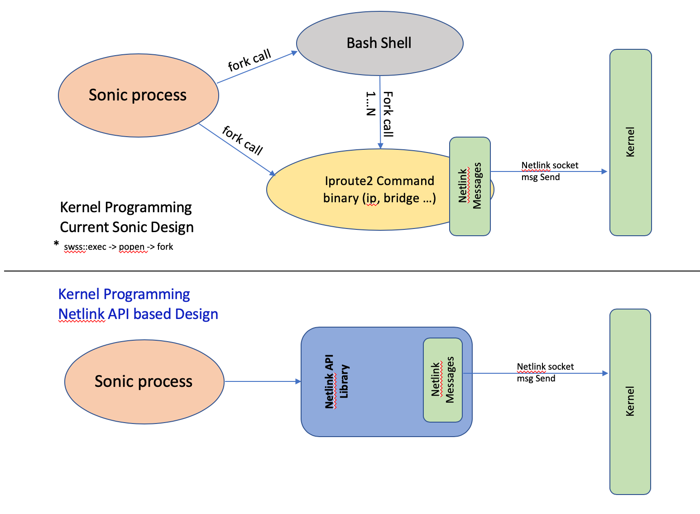

# Feature Name  
Kernel programming performance enhancement - Netlink API

# High Level Design Document  
#### Rev 0.1  
  
# Table of Contents  
* [List of Tables](#list-of-tables)  
* [Revision](#revision)  
* [About This Manual](#about-this-manual)  
* [Scope](#scope)  
* [Definition/Abbreviation](#definitionabbreviation)   
* [Requirement Overview](#requirement-overview)  
* [Functionality](#functionality)  
* [Design](#design)  
* [Flow Diagrams](#flow-diagrams)   
* [Serviceability and Debug](#serviceability-and-debug)  
* [Warm Boot Support](#warm-boot-support)  
* [Scalability](#scalability)  
* [Unit Test](#unit-test)
  
# List of Tables  
[Table 1: Abbreviations](#table-1-abbreviations)  
[Table 2: Performance comparison](#table-2-performance-comparison)  
[Table 3: Unit test cases](#table-3-unit-test-cases)  

  
# Revision  
| Rev | Date | Author | Change Description |  
|:---:|:-----------:|:------------------:|-----------------------------------|  
| 0.1 | 09/24/2019 | Naveen Suvarna | Initial version |  
  
# About this Manual  
This document provides general information about the SONiC Linux kernel programming performance enhancement using Netlink based APIs.  

# Scope  
This document describes the high level design of  Linux kernel programming performance enhancement using netlink based API calls replacing system() calls executing iproute2 commands on linux shell. 

# Definition/Abbreviation  
### Table 1: Abbreviations  
| **Term** | **Meaning** |  
|--------------------------|-------------------------------------|  
| NL | Netlink |  
| API | Application Program Interface |
| NLAPI | Netlink API |

  
# 1 Requirement Overview  
## 1.1 Functional Requirements  
1. Support Netlink API calls to replace all exec calls of iproute2 ip and bridge commands found in SONiC modules. 
 
## 1.2 Configuration and Management Requirements  
NA
  
## 1.3 Scalability Requirements  
NA
  
## 1.4 Warm Boot Requirements  
NA  
  
# 2 Functionality  
## 2.1 Target Deployment Use Cases  
Performance improvement in scaled configuration during bulk config or system restart.
  
## 2.2 Functional Description  
This document provides functional design and specifications of kernel programming performance enhancement by replacing system() calls with netlink APIs for kernel interaction.
 
SONiC modules program the kernel constructs like bridge, VLAN, IP-link, VRF, IP Address into kernel using unix iproute-2 utility commands. Within a sonic process, this is being done by forking new process using fork (thru popen) system call and then executing required  iproute2 ip and/or bridge commands in it. This system() call invocation is slow (compared to netlink APIs) and executed synchronously and process executing this waits for its completion, impacting the performance. Kernel programming using this method is primarily used in config managers of SwSS components. Config managers predominantly use the popen call based kernel programming during user configuration or config replay at restart or system bringup. 

Execution or forking a new process inside a module is expensive in terms of CPU load and CPU time.  For instance, during bulk configuration like VLAN range config or during scaled config restart replay, it is observed that invoking fork call based kernel programming uses lot of time to program  the kernel which in tern results in higher completion time within SwSS as well as slower hardware programming.

Iproute2 ip and bridge commands internally use Netlink based messaging to program the kernel constructs like bridge, VLAN, link, VRF etc. 

Objective of this enhancement is to implement the Netlink based Library function calls or APIs instead of using fork based iproute2 command execution. The API calls make use of netlink library to construct netlink messages and configure the kernel as per user request. Library API functions will perform the same functionality as the iproute2 ip and bridge commands invoked by SONiC Modules.
 
  
# 3 Design  
   
## 3.1 Overview  
Kernel programming using fork based iproute2 command call and newly proposed Netlink API call based Kernel programming is as shown below.
  
  
  
  
__Figure 1: Kernel Programming current verses new design__  
  
 API function class will be introduced to serve specific set of command functionality. All these APIs are bundled into a library called nlapi. Applications needing to replace the exec calls can include this nlapi library and use the API calls.

An example code snippet of the fork based call and Netlink API based call from SwSS VlanManager  is as below

     popen fork based execution:
     std::string res;
     const std::string cmd = "/sbin/ip link add Bridge up type bridge" 
     EXEC_WITH_ERROR_THROW(cmds, res); 
       
     Netlink API:
     int ret = nlapi_req_ip_link_add_dev("Bridge", "bridge", "up");
     NLAPI_STATUS_ERROR_THROW(ret);      

### 3.1.1    Performance comparison

In order to benchmark the performance improvement, SwSS Vlan manager was considered for measuring the performance difference between fork and API based execution. Significant performance improvement in SwSS Vlan configuration manager kernel programming was observed.  Measured data is as shown in table below. 

Total time taken at SwSS: Shell fork calls vs Netlink API calls  

| **Config Operation** | **Fork Calls** | **Netlink API Calls** | **Performance gain** |  
|:---------------------|:--------------:|:---------------------:|:---------------------------:|  
| One VLAN config when system is loaded     | 115 msec    | 08 msec    | 14 times |  
| 4000 VLAN configuration                   | 305 seconds | 21 seconds | 14 times |  
| 4000 VLAN config using VLAN range command | 309 seconds | 13 seconds | 23 times |  
| 4000 VLAN config with system restart      | 406 seconds | 15 seconds | 27 times |  
| 4000 VLAN config  with config file load   | 404 seconds | 17 seconds | 23 times |  

### Table 2: Performance comparision  

Command set used for above performance measurement.  

       One Vlan config: 
           config vlan add 9  
           config vlan member add 9 Ethernet20  
           config vlan member add 9 PortChannel005  
       4000 Vlan config:   
            config vlan range add 10 4009   
            config vlan member range add 10 4009 Ethernet20  
            config vlan member range add 10 4009 PortChannel005     

Netlink API library will be placed in sonic-swss path with directory named 'nlapi'.
Following APIs will be supported in current release

      
      int nlapi_req_ip_link_add_dev(const char *dev, const char *type, const char *admin)
      int nlapi_req_ip_link_add_vrf(const char *vrf_name, unsigned int vrf_table)
      int nlapi_req_ip_link_add_vxlan(const char *vx_lan_if)
      int nlapi_req_ip_link_add_vxlan_id(const char *dev, int vxlan_id, const char *lcl_addr, int dest_port)
      int nlapi_req_ip_link_add_link_vlan(const char *dev, unsigned int vlan_id, const char *admin, const char *mac_addr)
      int nlapi_req_ip_link_set_admin(const char *dev, const char *admin)
      int nlapi_req_ip_link_set_mtu(const char *dev, unsigned int mtu)
      int nlapi_req_ip_link_set_vlan(unsigned int vlan_id, const char *admin)
      int nlapi_req_ip_link_set_master(const char *dev, const char *master, const char *admin)
      int nlapi_req_ip_link_set_filtering(const char *dev, const char *type, unsigned int filter_id)
      int nlapi_req_ip_link_del_dev(const char *dev)
      int nlapi_req_ip_link_list(const char *dev, unsigned int display, int *count)
      int nlapi_req_ip_link_list_type(const char *type, int display, int *count)
      int nlapi_req_ip_link_list_master_ifs(const char *dev, int display, int *count)
      int nlapi_req_ip_address_cmd(const char *action, int version, const char *prefix, const char *dev)
      int nlapi_req_ip_nbr_flush(const char *dev, const char *prefix)
      int nlapi_req_bridge_vlan_add(const char *dev, int vlan_id, const char *tagging, int pvid, int self)
      int nlapi_req_bridge_vlan_del(const char *dev, int vlan_id, const char *tagging, int pvid, int self)
      int nlapi_req_bridge_vlan_list(const char *dev, unsigned int display, int *count)
      int nlapi_req_bridge_vlan_count(const char *dev, int *vlan_count)
      int nlapi_req_bridge_fdb_entry(const char *action_str, const char *dev, const char *maddr, const char *type, int vlan_id, const char *dest, int flag)
      int nlapi_req_bridge_link_set_neigh_suppress(const char *dev, const char *suppress)
      int nlapi_req_brctl_add_if(const char *dev, const char *link)
      int nlapi_req_brctl_del_if(const char *dev, const char *link)
         

## 3.2 CLI  
NA

### 3.2.1 Data Models  
NA  
  
### 3.2.3 Show Commands  
NA 
  
# 4 Flow Diagrams  
NA 
  
# 5 Serviceability and Debug  
 NA
 
# 6 Warm Boot Support  
NA
   
# 7 Scalability  
NA 
  
# 9 Unit Test  
Unit test cases for this specification are as listed below:  
  
| Rev | Date       |     Author     |  
|:---:|:----------:|:--------------:|  
| 0.1 | 10/02/2019 | Naveen Suvarna |  

### Table 3: Unit Test Cases 

| **Test-Case ID** | **Test Title** | **Test Scenario** |  
|------------------|----------------|-------------------|  
|1| System Bringup | |   
| | 1.1 |Verify that default bridge devices are up upon system bring up|  
| | 1.2 |Verify that IP address configuration on default interfaces are valid per config file |     
|2|Vlan configurations|  |  
| | 2.1 |Verify ip-link and bridge-vlan after Configuring Vlan and Add Interface and Port Channels to Vlan |  
| | 2.2 |Verify ip-link and bridge-vlan after removing Interface and Port channels to from Vlan and deleting vlan |  
| | 2.3 |Verify ip-link and bridge-vlan after Configuring Vlan ranges |  
| | 2.4 |Verify ip-link and bridge-vlan after removing Vlan ranges |  
|3|Ip Link configurations |  |  
| | 3.1 |Verify configure and unconfigure IPv4 addresses |  
| | 3.2 |Verify configure and unconfigure IPv6 addresses |    
| | 3.3 |Verify ip Link MTU configure and unconfigure |       
| | 3.4 |Verify ip Link admin status up/down configure |    
|4|VRF configurations |  |  
| | 4.1 |Verify configure and unconfigure vrf  |  
| | 4.2 |Verify configure and unconfigure attach interface to vrf  |   
|5|Scale and restart configurations |  |  
| | 5.1 |Configure 4k vlan and add ports to vlans, save config and verify system restart |  
| | 5.2 |Configure 4k vlan and add ports to vlans, save config and verify docker restart | 

# 9 Internal Design Information  
NA

