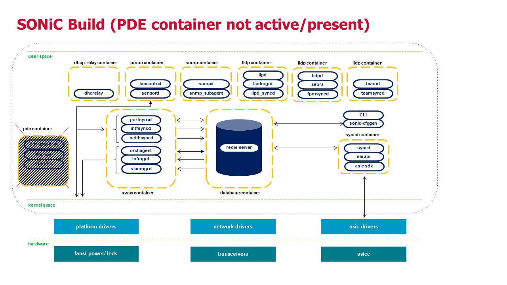

# Feature Name
SONiC Platform Development Environment (PDE)
# High Level Design Document
#### Rev 1.2

# Table of Contents
  * [List of Tables](#list-of-tables)
  * [Revision](#revision)
  * [About This Manual](#about-this-manual)
  * [Scope](#scope)
  * [Definition/Abbreviation](#definitionabbreviation)

# List of Tables
[Table 1: Abbreviations](#table-1-abbreviations)

# Revision
| Rev |     Date    |       Author       | Change Description                                                               |
|:---:|:-----------:|:------------------:|----------------------------------------------------------------------------------|
| 1.2 | 06/24/2019  |  Bill Schwartz     | Updated document and images to reflect new build infrastructure changes          |
| 1.1 | 06/17/2019  |  Bill Schwartz     | Rename Platform Development Kit (PDK) to Platform Development Environment (PDE)  |
| 0.1 | 05/17/2019  |  Bill Schwartz     | Initial version                                                                  |

# About this Manual
This document provides general information about the SONiC Platform Development Environment (PDE).  The SONiC PDE is part of the SONiC Platform Development Kit (PDK) which optimizes platform development.  The SONiC PDK consists of:

-PDDF (Platform Driver Development Framework): For optimized data-driven platform driver and SONiC plugin development. The PDDF details are covered in a separate document.

-PDE  (Platform Development Environment): For optimized build and testing of platform and SAI code.  

The SONiC PDE is generated from the SONiC "sonic-buildimage" repository and is intended to provide ODM and external customers with a means to quickly add, compile and test their platform drivers and static device data required for a fully functional SONiC distribution.  

# Scope
This document describes the high level design details on how the SONiC PDE is constructed as well as details on the PDE test suite. The PDE is available to ODMs and others looking to add new platform support, and it optimizes the development and qualification process. It offers a pre-canned, minimal code package to which the ODM can add their necessary platform driver files and static configuration files (required by SONiC to properly initialize SAI and the switching silicon). Furthermore, the PDE will provide a test suite where platform developers can quickly test their drivers and configuration files to resolve issues more easily without relying on the full SONiC application and infrastructure to be in place.

# Definition/Abbreviation
### Table 1: Abbreviations
| **Term**                 | **Meaning**                           |
|--------------------------|---------------------------------------|
| ODM                      | Original Design Manufacturer          |
| PDE                      | Platform Development Environment      |
| PDK                      | Platform Development Kit              |
| PDDF                     | Platform Driver Development Framework |

# 1 Requirements Overview

## 1.1 Base SONiC PDE Requirements

The requirements for the SONiC PDE are:
1.  The SONiC PDE repository is generated from the "sonic-buildimage" repository.
2.  The SONiC PDE source code tree is generated by a "make initpde" command and generates a codebase that can be provided to an ODM for development.
3.  The SONiC PDE is packaged with all existing SONiC supported platforms.
4.  The SONiC PDE build generates a fully functional ONIE installable image supporting any of the existing included ODM platforms as well as new platforms added.
5.  The PDE is designed to be used on a typical software developer system or virtual machine and does not require a more powerful build server.  
    The minimum requirement for a SONiC PDE build system is a Ubuntu 16.04 LTS (VM or dedicated system), with 8GB of RAM and at least 4 CPU cores.
6.  A new PDE SONiC container is created during the SONiC PDE build process.
7.  All new unit tests (scripts, binaries, etc) which are generated by or for the PDE reside in the PDE container.  
8.  All platform drivers and device files will reside in their original SONiC locations as part of the PDE build process.
9.  The PDE uses the base SONiC build generated Linux kernel, Debian bootstrap image, SAI, root filesystem, and other pre-compiled binaries necessary for booting the PDE ONIE image.
10. All PDE makefiles and associated supporting files reside in the base SONiC repository as part of the "sonic-buildimage" repository and will not interfere or execute as part of the normal SONiC build process.
11. The PDE supports the existing SONiC porting guide for adding new platform support.  Please refer to [link](https://github.com/sonic-net/SONiC/wiki/Porting-Guide) for more information.  

As the PDE New platform changes added in the PDE are seamlessly integrated into the SONiC base repository.

## 1.2 SONiC PDE Test Suite Requirements

1.  Test and verify that the ODM provided configuration files (config.bcm, port_config.ini, sai.profile) initialize the ports through SAI accordingly.
2.  Test and verify that all ports (including expandable or flex ports) will link up and pass L2 traffic. 
3.  Test and verify all front panel port LEDS work according to hardware specification / customer requirements.
4.  Test and verify all system LEDS (power, attention, locate, other) work according to hardware specification / customer requirements.
5.  Test and verify platform specific pre-emphasis settings are programmed properly in internal / external PHYs according to the media type, cable length, etc according to the hardware specification.
6.  Test and verify that power mode for QSFP transceivers can be configured properly for high or lower power operation. 
7.  Test and verify that Forward Error Correction (FEC) is properly enabled based on inserted transceiver / DAC.
8.  Test and verify that the platform drivers load without error both in switch OS reboot conditions and full AC power cycles. 
9.  Test and verify that system EEPROM contents can be read without error.
10. Test and verify that transceiver EEPROM contents for all ports can be read without error.
11. Test and verify that warmboot, when supported by the underlying switching silicon, works without error on the platform.
12. Test and verify SONiC first boot behavior specifically vs secondary boot process.  Specifically ensure that all platform drivers, configuration files, and other packages are installed without error.
13. Test and verify that ODM and customer supported optical modules as well as DACs can operate properly within SONiC.
14. Test and verify that platform drivers can be loaded and unloaded without requiring a reboot.
15. All PDE tests will run at the platform layer plugin / sysfs layer.  These tests are targeted to ensure the ODM added plugin scripts and drivers interact properly and will work when interfacing to the higher level SONiC application.

### 1.1.2 Configuration and Management Requirements
None

### 1.1.3 Scalability Requirements
None

### 1.1.4 Warm Boot Requirements
Warmboot is an important feature in SONiC and a requirement for many datacenter customers. All platforms and their platform drivers are tested as part of the PDE test suite to ensure they do not break the warmboot feature.  The PDE test suite checks to ensure that traffic is not lost during a warm boot.

## 1.2 Design Overview
### 1.2.1 Basic Approach
The PDE source code base is generated from a successfully compiled SONiC build and will contain all the pre-built binaries, scripts, and support infrastructure needed to create a lightweight development infrastructure for platform development.  The PDE will be provided to ODMs and new customers looking to add platform support, where they can add their necessary platform driver files and static configuration files required by SONiC to properly initialize SAI and the switching silicon.  Furthermore, the PDE will provide a test suite where platform developers can quickly test their drivers and configuration files to resolve issues more easily without relying on the full SONiC application and infrastructure to be in place.

### 1.2.2 Container
The PDE build creates a new "docker-pde" container which contains all necessary scripts, binaries, and static configuration data needed to support the PDE and the PDE test suite. Platform drivers and device configuration files remain in their existing locations within the SONiC build and runtime filesystem.

# 2 Functionality
## 2.1 Target Deployment Use Cases

The PDE does not target any type of feature deployment within SONiC. The primary use case is to enable an ODM or customer to quickly add new platform support and run a test suite to ensure that it is compatible with the full SONiC application.

As seen in the diagram below, the PDE consists of a subset of the full SONiC build.  As the SONiC control plane is not needed for platform validation, it is replaced with a PDE test harness which focuses on testing and validating the platform as well as basic functionality of the switching silicon. The PDE is intended to validate and qualify the hardware platform such that it is seamlessly integrated into SONiC where the full function application can be used on the platform.

  
## 2.2 Functional Description

The SONiC build process has build times that exceed an hour for a full build.  Furthermore, the build system itself has to have at least 50GB of disk storage and multiple CPU cores available for maximum performance.  From an ODM perspective, adding platform driver support, static configuration necessary for SONiC and SAI, and platform plugins is not a complicated process.  The PDE utilizes the pre-compiled binaries (kernel, necessary file system, etc) that were generated in a full SONiC build, and then only compiles and packages the new platform drivers that an ODM adds. This speeds up the build time tremendously and allow for quick turnaround for platform development.

Furthermore, platform developer / enablers do not need to be concerned with a majority of the SONiC application and features. The PDE creates and packages a set of automated and manual tests that ensure the platform drivers are stable and work as required for full SONiC operation, and the switch configuration is correct and allows full traffic flow across the supported port configurations.

### 2.2.3 SAI Overview
The PDE incorporates the necessary SAI / SDK version for the ODM to bring up the ASIC on the target platform.  It is assumed that the base SAI support for the switching silicon has already been tested and verified.

# 3 Design
## 3.1 Overview

The below diagram shows the build process for generating the initial PDE repository.  

The below diagram depicts the normal sonic build running with its associated docker containers. The PDE container is not included / active in a regular SONiC build.

The below diagram shows the PDE build containing the PDE container.  In a PDE build, this container is active and responsible for interacting with the switching silicon and platform drivers/hardware.  There is no dependency on the remaining SONiC containers in the PDE test environment.

## 3.2 DB Changes
### 3.2.1 CONFIG DB
N/A
### 3.2.2 APP DB
N/A
### 3.2.3 STATE DB
N/A
### 3.2.4 ASIC DB
N/A
### 3.2.5 COUNTER DB
N/A

## 3.3 Switch State Service Design
### 3.3.1 Orchestration Agent
N/A
### 3.3.2 Other Process 
N/A

## 3.4 SyncD
N/A

## 3.5 SAI
No new SAI APIs are expected to be required to support the PDE.

## 3.6 CLI

The PDE has no dependency on the SONiC CLI.

# 4 Flow Diagrams
N/A

# 5 Error Handling
N/A

# 6 Serviceability and Debug
N/A

# 7 Warm Boot Support
N/A

# 8 Scalability
N/A

# 9 Unit Test
The unit test cases provided by the PDE will cover the detailed requirements list from section 1.2 above.
