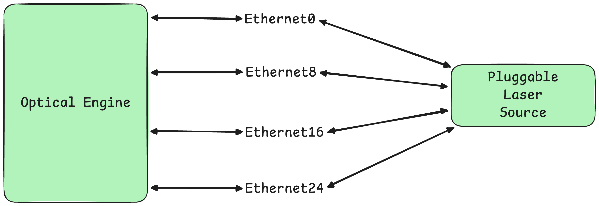
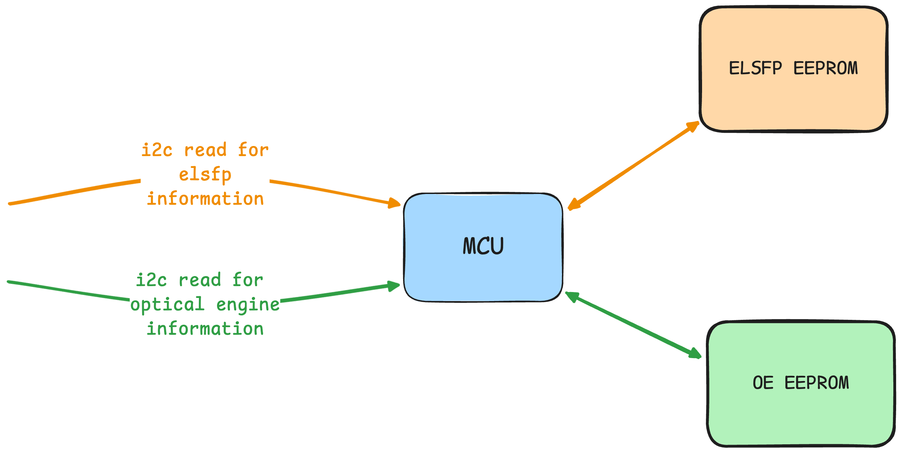

# Port Mapping for CPO #

## Table of Content 

- [1. Revision](#1-revision)
- [2. Scope](#2-scope)
- [3. Definitions/Abbreviations](#3-definitionsabbreviations)
- [4. Overview](#4-overview)
- [5. Requirements](#5-requirements)
- [6. Architecture Design](#6-architecture-design)
- [7. High-Level Design](#7-high-level-design)
  - [7.1 Configuration Data Model](#71-configuration-data-model)
  - [7.2 Future Proofing](#72-future-proofing)
  - [7.3 Platform API Changes](#73-platform-api-changes)
- [8. SAI API](#8-sai-api)
- [9. Configuration and management](#9-configuration-and-management)
- [10. Warmboot and Fastboot Design Impact](#10-warmboot-and-fastboot-design-impact)
- [11. Memory Consumption](#11-memory-consumption)
- [12. Restrictions/Limitations](#12-restrictionslimitations)
- [13. Testing Requirements/Design](#13-testing-requirementsdesign)
  - [13.1 Unit Test cases](#131-unit-test-cases)
  - [13.2 System Test cases](#132-system-test-cases)

### 1. Revision  

| Rev | Date       | Author | Change Description |
|-----|------------|--------|--------------------|
| 0.1 | 2026-02-01 | bgallagher-nexthop      | Initial version    |

### 2. Scope  

For past generations of transceiver hardware, there has typically been a 1:1 relationship between ports and the i2c configurable device that drives traffic through that port. Co-packaged optics disrupt this notion, by introducing a 1:many relationship between ports and i2c configurable devices driving traffic through that port. For instance, this could include configuring a pluggable laser source device and an optical engine device for each port on a switch.

<br>


*<div align="center">Each port/interface is driven by multiple i2c configurable devices (highlighted in green). Both devices need to be operational in order for the port to be usable.</div>*<br>

As a concrete example, you could have a hardware platform with the following characteristics:

* A switching ASIC with 16 optical engines, each with 32 serdes lanes for a total of 512 lanes overall.  
* 16 pluggable external laser sources, each pluggable module supplying 8 laser sources for a total of 128 laser sources overall.
* 64 ports on the front-panel of the switch, each capable of 1.6Tb/s.
* This means each port/interface will use multiple devices (one optical engine and one external laser source) and will share those devices with other ports/interfaces.

As a result, we need the ability to model the following information:

* The mapping of serdes lanes from the switching ASIC to the interface level.
* The mapping of serdes lanes from the switching ASIC to the optical engine (“which optical engine is handling lane 41?”)
* The mapping of laser sources to an optical engine or interface (“which optical engine, and therefore interface, is using the laser sources from pluggable module 1?”).
* Various supported breakout configurations for each interface and how the above mappings are affected by that.
* Our configuration should be generic enough to be easily adapted to future hardware that has an arbitrary number of devices associated with a single port/interface.

### 3. Definitions/Abbreviations 

| Term | Definition |
|------|------------|
| CMIS | Common Management Interface Specification |
| I2C | Inter-Integrated Circuit |
| CPO | Co-packaged Optics |
| OE | Optical Engine |
| ELSFP | External Laser Small Factor Pluggable |
| MCU | Microcontroller Unit |
| SerDes | Serializer/Deserializer |
| ASIC | Application-Specific Integrated Circuit |
| EEPROM | Electrically Erasable Programmable Read-Only Memory |

### 4. Overview 

This HLD proposes adding a new configuration file called `optical_devices.json` that will contain information about the hardware devices used to drive traffic through the ports of a switch, and how each device is mapped to each port/interface on the switch. Specifically, this will enable configuration of hardware where:
- hardware devices are shared amongst multiple ports/interfaces.
- multiple hardware devices are used by a single port/interface.

### 5. Requirements

- The HLD should provide support for configuring upcoming generations of hardware using co-packaged optics.
- The HLD should provide a mechanism generic enough to cover future hardware with complex topologies where ports/interfaces either share hardware devices, or leverage multiple hardware devices per port/interface.
- The HLD will not support configuration for ports/interfaces that span multiple CMIS banks (a transceiver wider than 8 lanes for instance).

### 6. Architecture Design 

This HLD proposes no architectural change to SONiC.

### 7. High-Level Design 

#### 7.1 Configuration Data Model

We can achieve modeling of complex multi-device topologies via the **platform.json** file and a new **optical\_devices.json** file.

```json
# platform.json
// No changes to platform.json
{
  "interfaces": {
    "Ethernet0": {
      "index": "1,1,1,1,1,1,1,1",
      "lanes": "41,42,43,44,45,46,47,48",
      "breakout_modes": {
        "1x1600G": [
          "Port1"
        ],
        "2x800G": [
          "Port1/1",
          "Port1/2"
        ]
      }
    }
  }
}

# optical_devices.json
{
  // devices provides a description of devices that are involved in driving
  // traffic through ports on the switch.
  // For instance, this is where we store information about CPO hardware
  // such as how many ASIC lanes an optical engine is responsible for.
  "devices": {
    "OE1": {
      // device_type is an indicator for what type of device we are dealing with.
      // This allows arbitrary devices to be added easily -- for instance,
      // if there were separate TX and RX optical engines that required different
      // configuration in the future, these could be accommodated without any
      // schema change by simply adding new device types of optical_engine_rx
      // and optical_engine_tx.
      "device_type": "optical_engine",
      // The number of CMIS banks associated with this device.
      "max_banks": 4,
      // The overall number of physical lanes available in this device.
      "lanes": "41,42,43,44,45,46,47,48,49,50,51,52,53,54,55,56,...",
      // If a vendor needs to encode I2C mapping information, that information
      // can be included here. However, this is platform dependent and may be
      // achieved via other mechanisms.
      "i2c_path": "/sys/bus/i2c/devices/32-0050"
    },
    "ELS1": {
      "device_type": "external_laser_source",
      // Number of individual lasers this device provides.
      "lasers": 8,
      "max_banks": 1,
      // laser_to_lane_mapping provides a mapping of laser to which lane it is powering.
      "laser_to_lane_mapping": {
        "1": "41,42",
        "2": "43,44",
        "3": "45,46",
        "4": "47,48",
        ...
      }
    }
  },
  "interfaces": {
    "Ethernet0": {
      "associated_devices": [
        {
          "device_id": "OE1",
          // This maps the interface to the specific CMIS bank of the device.
          // If we ever have interfaces using multiple CMIS banks, we can change
          // this to a list of banks quite easily.
          "bank": 0
        },
        {
          "device_id": "ELS1",
          "bank": 0
        }
      ]
    }
  },
}
```

The key details of this configuration approach are as follows:
* platform.json remains the same, providing information about how ASIC lanes map to interfaces, what breakout modes are supported and mapping information about interfaces to physical front-panel ports.
* A new file called optical_devices.json is introduced. This file describes all the optical devices present in the chassis in the "devices" section. It also describes how each of those devices are used by the interfaces defined in platform.json in the "interfaces" section.
* The association of CMIS banks for each device is also encoded in the "interfaces" section of the optical_devices.json file. This can be used by banking logic in SONiC platform APIs, per the [banking HLD](https://github.com/sonic-net/SONiC/pull/2183).
* `optical_devices.json` will be located in `/usr/share/sonic/device/<platform>/`, alongside `platform.json`.

#### **7.2 Future Proofing**

This approach to modeling the topology of devices in CPO is flexible enough to accommodate future hardware:

* In the hardware example used above, there is a 1:1 relationship between optical engines and pluggable laser modules, but imagine if we had 16 optical engines and eight pluggable laser modules. If we need to support hardware with a variable number of optical engines and external lasers like that, this schema supports that since you can define the number of lasers and how they map to lanes in the devices section.
* If more independent devices were introduced, the devices field remains generic enough to define an arbitrary number of devices. For instance, if there was a third I2C component introduced in addition to the optical engine and a pluggable laser module, this schema can support that.

#### 7.3 Platform API Changes

We will require some changes to the SONiC platform APIs in order to support multiple devices. Note: this section assumes the banking functionality outlined in [this HLD](https://github.com/sonic-net/SONiC/pull/2183/) is implemented.

We will define a `CompositeSfp` interface, so that it is possible to define composite "logical" SFPs that consist of multiple independent `SfpBase` derived objects. This allows us to present a single logical view/transceiver to application code despite there being multiple independent, and possibly shared, hardware devices backing the logical transceiver. An important consequence of the below `CompositeSfp` interface is that there is no concept in software that the underlying hardware is shared -- software treats each Sfp as an independent device, even if that is not true in reality. As a result, protection against issues like concurrent I2C operations is left up to downstream components (for instance, the optoe driver for reading/writing to transceiver EEPROMs over I2C acquires a lock for each I2C read/write).
```python
import abc

class CompositeSfp(abc.ABC, SfpBase):
  """Interface for a class that composes multiple SfpBase derived objects to present a single logical transceiver."""
  @abc.abstractmethod
  def get_all_sfps(self) -> typing.List[SfpBase]:
    pass
  
  @abc.abstractmethod
  def get_number_of_sfps(self) -> int:
    pass

  @abc.abstractmethod
  def get_sfp(self, name: str) -> SfpBase:
    pass

  @abc.abstractmethod
  def get_xcvr_api(self):
    pass
```

We will need a dedicated composite sfp for each permutation of hardware devices that requires a unique API. For instance, CPO hardware with optical engines and external laser sources will require a dedicated class with its own API.
```python
class CpoSeparateModeSfp(CompositeSfp):
  """Composite Sfp for CPO with separate OE and ELSFP devices."""

  def __init__(self, oe: SfpBase, elsfp: SfpBase):
    super(CpoSeparateModeSfp, self).__init__()
    self._oe = oe
    self._elsfp = elsfp
    self._xcvr_api = None

  def get_xcvr_api(self):
    if self._xcvr_api is None:
      self._xcvr_api = CpoSeparateModeCmisApi(
        self._oe.get_xcvr_api(),
        self._elsfp.get_xcvr_api()
      )
    return self._xcvr_api

  def __getattr__(self, name):
    """Delegate all other methods to underlying optical engine SFP."""
    return getattr(self._oe, name)

  def get_all_sfps(self) -> typing.List[SfpBase]:
    return [self._oe, self._elsfp]
  
  def get_number_of_sfps(self) -> int:
    return len(self.get_all_sfps())

  def get_sfp(self, name: str) -> SfpBase:
    if "OE" in name:
      return self._oe
    elif "ELS" in name:
      return self._elsfp
    raise RuntimeError(f"Unable to find sfp for name {name}")
  
  # CPO specific methods can be defined in this class, like methods for fetching
  # information related to the ELSFP or the optical engine.
  def get_elsfp_lane_output_power_alarm(self):
    return self.get_xcvr_api().get_elsfp_lane_output_power_alarm()
```

It is worth noting that the above implementation delegates all method calls to the optical engine SFP by default, since the optical engine reports most information on CPO hardware. The individual methods for each underlying SFP object (optical engine and ELSFP) are still available through the `get_all_sfps()` and `get_sfp()` methods. For instance, to access the ELSFP's `read_eeprom` method, you could just do `get_sfp("ELS1").read_eeprom(...)`. Composite sfps do not use XcvrApiFactory for API creation because the device topology is known at chassis initialization time from optical_devices.json. The factory pattern remains used for the underlying sfp objects.

Composite sfps will require a corresponding unique CMIS API implementation. See the usage of `CpoSeparateModeCmisApi` as the `xcvr_api` for the composite sfp implementation above. For instance, for CPO hardware where separate access to the optical engine and external laser source is desired the following CMIS API classes would be defined.
```python
class CpoSeparateModeCmisApi(CmisApi):
  def __init__(self, oe_api, elsfp_api):
    # Optical engine API will just be a regular CmisApi class
    super().__init__(oe_api.xcvr_eeprom)
    self.oe_api = oe_api
    # ELSFP API will be a dedicated class, since the spec differs from traditional CMIS.
    self.elsfp_api = elsfp_api

  def __getattr__(self, name):
    """Delegate all other methods to underlying optical engine CMIS API."""
    return getattr(self.oe_api, name)
  
  def get_elsfp_lane_output_power_alarm(self):
    return self.elsfp_api.get_lane_output_power_alarm()

class ElsfpCmisApi(XcvrApi):
  def get_elsfp_lane_output_power_alarm(self):
    return self.xcvr_eeprom.read(consts.ELSFP_LANE_OUTPUT_POWER_ALARM)
```

Vendors can then leverage data parsed from the `optical_devices.json` file to instantiate composite SFPs where appropriate. A shared utility function will be provided to easily parse the `optical_devices.json` file. For example, a vendor could implement logic like the below for a CPO hardware platform with optical engines and external laser sources.
```python
from sonic_py_common import device_info

class ChassisBase:
  ...
  def __init__(self):
    ...
    # List of SfpBase-derived objects representing all sfps
    # available on the chassis
    self._sfp_list = []
    optical_device_data = device_info.get_optical_devices_data()
    if optical_device_data:
      self.construct_sfp_list(optical_device_data)

  def construct_sfp_list_for_topology(self, optical_device_data):
    """Subclasses should implement this method to create sfp objects based on topology data in optical_devices.json"""
    raise NotImplementedError

class VendorCpoChassis(ChassisBase):
  ...
  def construct_sfp_list_for_topology(self, optical_device_data):
      for interface in optical_device_data.interfaces:
        assert len(interface.associated_devices) == 2, "We expect 2 devices per interface on this CPO hardware platform"

        # Construct individual SFP objects for the optical engine and external laser source.
        oe = None
        elsfp = None
        for dvc_info in interface.associated_devices:
          device = optical_device_data.devices[dvc_info.device_id]
          if device.device_type == "optical_engine":
            oe = VendorSfp(..., bank=dvc_info.bank)
          elif device.device_type == "external_laser_source":
            elsfp = Elsfp(..., bank=dvc_info.bank)

        # Create a composite SFP to represent this interface
        assert oe, "No optical engine found for this interface"
        assert elsfp, "No ELSFP found for this interface"
        self._sfp_list.append(CpoSeparateModeSfp(oe=oe, elsfp=elsfp))
```

To use another example, there is a mode of operation for CPO hardware called "joint mode" where a single I2C device called an "MCU" handles all reads/writes, redirecting them to the optical engine EEPROM or the ELSFP EEPROM appropriately.

<br>


<br>

The platform API implementation for this hardware configuration would look like the below.

```python
class CpoJointModeSfp(SfpBase):
  """Sfp for joint mode CPO"""
  def get_xcvr_api(self):
    if self._xcvr_api is None:
      self._xcvr_api = CpoJointModeCmisApi(
        self.get_xcvr_api(),
      )
    return self._xcvr_api
    
  # CPO specific methods can be defined in this class, like methods for fetching
  # information related to the ELSFP or the optical engine.
  def get_elsfp_lane_output_power_alarm(self):
    return self.get_xcvr_api().get_elsfp_lane_output_power_alarm()

class CpoJointModeCmisApi(CmisApi):
  # Inherit existing functionality from CmisApi.
  # Define further CPO specific functions in this class, like 
  # methods to access ELSFP information.
  def get_elsfp_lane_output_power_alarm(self):
    return self.xcvr_eeprom.read(consts.ELSFP_LANE_OUTPUT_POWER_ALARM)
```

### 8. SAI API 

There are no changes to SAI API in this HLD.

### 9. Configuration and management 
This HLD proposes no changes to configuration, or SONiC's database contents/schema, beyond the introduction of the `optical_devices.json` file.

### 10. Warmboot and Fastboot Design Impact  
There is no warmboot/fastboot design impact for this HLD.

### 11. Memory Consumption
There should be no noteworthy change in memory consumption from the changes in this HLD.

### 12. Restrictions/Limitations  

This approach does not support configuration of interfaces that use multiple CMIS banks of a hardware device, since it seems unlikely a transceiver wider than 8 lanes will be required soon. However, adding support for this would require only minor changes to the schema.

### 13. Testing Requirements/Design  
Given the additional complexity of configuring the `optical_devices.json` file and its dependency on the information in the `platform.json` file, this HLD proposes adding validation tooling that can be leveraged manually after altering the `optical_devices.json` file and used at build-time as part of unit-tests to validate `optical_devices.json` files being included in a SONiC image.

A validation script will be implemented at `sonic-buildimage/src/sonic-device-data/tests/optical_devices_checker`, following the precedent of scripts already present in the `sonic-buildimage/src/sonic-device-data/tests/` directory.

#### 13.1. Unit Test cases  

This validation script will verify:

1. **JSON Syntax Validation**
   - Valid JSON format
   - No trailing commas
   - Proper encoding (UTF-8)

2. **JSON Schema Validation**
   - Required fields present (`devices`, `interfaces`)
   - Correct data types for all fields
   - Valid enumeration values (e.g., `device_type`)

3. **Semantic Validation**
   - All device IDs referenced in `interfaces` section exist in `devices` section
   - Bank numbers are valid for CMIS devices (0-3)
   - No duplicate device IDs
   - Interface names are valid (match expected patterns)
   - Device-to-interface associations are consistent

4. **Cross-File Validation**
   - Interface names in `optical_devices.json` match interfaces defined in `platform.json`
   - Consistency between port counts and device counts
   - Assigned lanes in each file are consistent across both files for each interface, and that interfaces don't have conflicting configuration for devices that are shared across multiple interfaces (overlapping lane assignment for instance)

#### 13.2. System Test cases

| Test Case |
|------------------------------------------------|
| Load proposed configuration onto a real device with co-packaged optics. Ensure that links come up successfully. |
