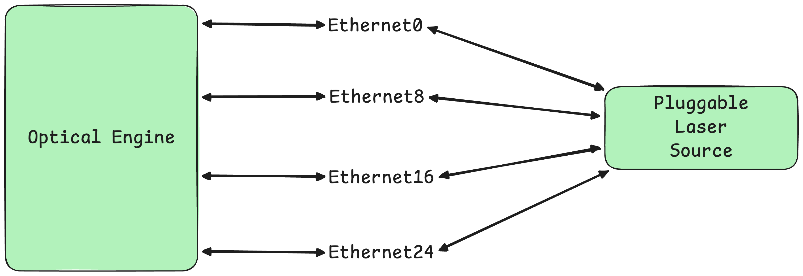
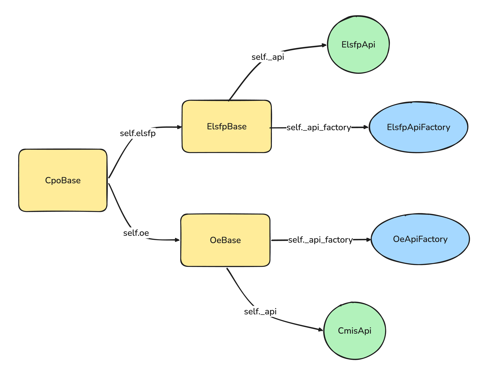
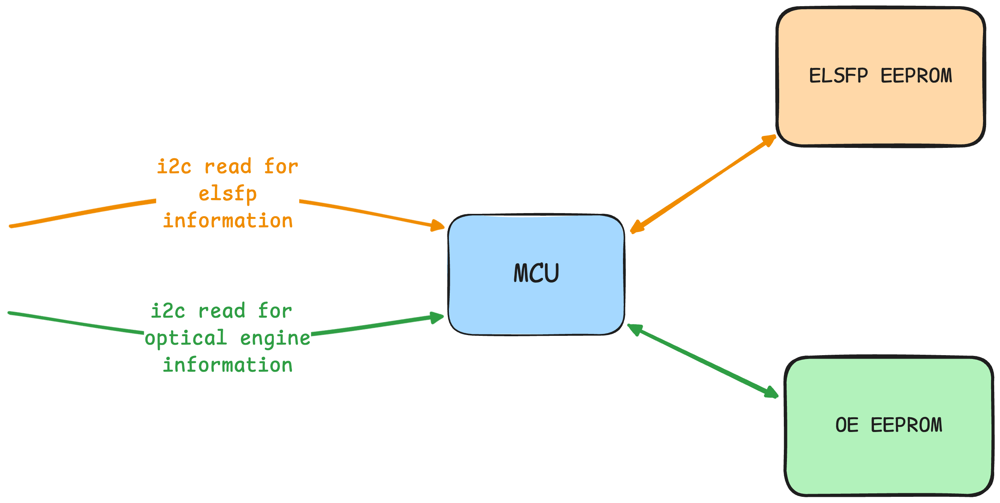
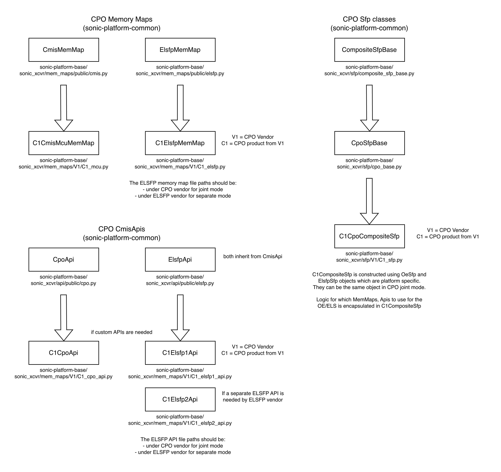

# Port Mapping for CPO #

## Table of Content 

- [1. Revision](#1-revision)
- [2. Scope](#2-scope)
- [3. Definitions/Abbreviations](#3-definitionsabbreviations)
- [4. Overview](#4-overview)
- [5. Requirements](#5-requirements)
- [6. Architecture Design](#6-architecture-design)
- [7. High-Level Design](#7-high-level-design)
  - [7.1 Configuration Data Model](#71-configuration-data-model)
  - [7.2 Future Proofing](#72-future-proofing)
  - [7.3 Platform API Changes](#73-platform-api-changes)
    - [7.3.1 CPO API Classes](#731-cpo-api-classes)
      - [7.3.1.1 CpoBase](#7311-cpobase)
      - [7.3.1.2 ElsfpBase](#7312-elsfpbase)
      - [7.3.1.3 OeBase](#7313-oebase)
      - [7.3.1.4 ELSFP and OE API Factories](#7314-elsfp-and-oe-api-factories)
    - [7.3.2 Chassis and CPO Object Creation](#732-chassis-and-cpo-object-creation)
    - [7.3.3 CPO Joint Mode](#733-cpo-joint-mode)
    - [7.3.4 File Structure](#734-file-structure)
    - [7.3.5 Adding Support for Custom Vendor Registers](#735-adding-support-for-custom-vendor-registers)
- [8. SAI API](#8-sai-api)
- [9. Configuration and management](#9-configuration-and-management)
  - [9.1 Config DB Enhancements](#91-config-db-enhancements)
- [10. Warmboot and Fastboot Design Impact](#10-warmboot-and-fastboot-design-impact)
- [11. Memory Consumption](#11-memory-consumption)
- [12. Restrictions/Limitations](#12-restrictionslimitations)
- [13. Testing Requirements/Design](#13-testing-requirementsdesign)
  - [13.1 Unit Test cases](#131-unit-test-cases)
  - [13.2 System Test cases](#132-system-test-cases)

### 1. Revision  

| Rev | Date       | Author | Change Description |
|-----|------------|--------|--------------------|
| 0.1 | 2026-02-01 | bgallagher-nexthop      | Initial version    |

### 2. Scope  

For past generations of transceiver hardware, there has typically been a 1:1 relationship between ports and the i2c configurable device that drives traffic through that port. Co-packaged optics disrupt this notion, by introducing a 1:many relationship between ports and i2c configurable devices driving traffic through that port. For instance, this could include configuring a pluggable laser source device and an optical engine device for each port on a switch.

<br>


*<div align="center">Each port/interface is driven by multiple i2c configurable devices (highlighted in green). Both devices need to be operational in order for the port to be usable.</div>*<br>

As a concrete example, you could have a hardware platform with the following characteristics:

* A switching ASIC with 16 optical engines, each with 32 serdes lanes for a total of 512 lanes overall.  
* 16 pluggable external laser sources, each pluggable module supplying 8 laser sources for a total of 128 laser sources overall.
* 64 ports on the front-panel of the switch, each capable of 1.6Tb/s.
* This means each port/interface will use multiple devices (one optical engine and one external laser source) and will share those devices with other ports/interfaces.

As a result, we need the ability to model the following information:

* The mapping of serdes lanes from the switching ASIC to the interface level.
* The mapping of serdes lanes from the switching ASIC to the optical engine (“which optical engine is handling lane 41?”)
* The mapping of laser sources to an optical engine or interface (“which optical engine, and therefore interface, is using the laser sources from pluggable module 1?”).
* Various supported breakout configurations for each interface and how the above mappings are affected by that.
* Our configuration should be generic enough to be easily adapted to future hardware that has an arbitrary number of devices associated with a single port/interface.

### 3. Definitions/Abbreviations 

| Term | Definition |
|------|------------|
| CMIS | Common Management Interface Specification |
| I2C | Inter-Integrated Circuit |
| CPO | Co-packaged Optics |
| OE | Optical Engine |
| ELSFP | External Laser Small Factor Pluggable |
| MCU | Microcontroller Unit |
| SerDes | Serializer/Deserializer |
| ASIC | Application-Specific Integrated Circuit |
| EEPROM | Electrically Erasable Programmable Read-Only Memory |

### 4. Overview 

This HLD proposes adding a new configuration file called `optical_devices.json` that will contain information about the hardware devices used to drive traffic through the ports of a switch, and how each device is mapped to each port/interface on the switch. Specifically, this will enable configuration of hardware where:
- hardware devices are shared amongst multiple ports/interfaces.
- multiple hardware devices are used by a single port/interface.

### 5. Requirements

- The HLD should provide support for configuring upcoming generations of hardware using co-packaged optics.
- The HLD should provide support for both "joint" (OE and ELSFP configuration managed through a single i2c controller) and "separate" (OE and ELSFP configuration managed independently) modes of operation of co-packaged optics hardware.
- The HLD should provide a mechanism generic enough to cover future hardware with complex topologies where ports/interfaces either share hardware devices, or leverage multiple hardware devices per port/interface.
- The HLD will not support configuration for ports/interfaces that span multiple CMIS banks (a transceiver wider than 8 lanes for instance).

### 6. Architecture Design 

This HLD proposes no architectural change to SONiC.

### 7. High-Level Design 

#### 7.1 Configuration Data Model

We can achieve modeling of complex multi-device topologies via the **platform.json** file and a new **optical\_devices.json** file.

```json
# platform.json
// No changes to platform.json
{
  "interfaces": {
    "Ethernet0": {
      "index": "1,1,1,1,1,1,1,1",
      "lanes": "41,42,43,44,45,46,47,48",
      "breakout_modes": {
        "1x1600G": [
          "Port1"
        ],
        "2x800G": [
          "Port1/1",
          "Port1/2"
        ]
      }
    }
  }
}

# optical_devices.json
{
  // devices provides a description of devices that are involved in driving
  // traffic through ports on the switch.
  // For instance, this is where we store information about CPO hardware
  // such as how many ASIC lanes an optical engine is responsible for.
  "devices": {
    "OE1": {
      // device_type is an indicator for what type of device we are dealing with.
      // This allows arbitrary devices to be added easily -- for instance,
      // if there were separate TX and RX optical engines that required different
      // configuration in the future, these could be accommodated without any
      // schema change by simply adding new device types of optical_engine_rx
      // and optical_engine_tx.
      "device_type": "optical_engine",
      // The number of CMIS banks associated with this device.
      "max_banks": 4,
      // The overall number of physical lanes available in this device.
      "lanes": "41,42,43,44,45,46,47,48,49,50,51,52,53,54,55,56,...",
      // If a vendor needs to encode I2C mapping information, that information
      // can be included here. However, this is platform dependent and may be
      // achieved via other mechanisms.
      "i2c_path": "/sys/bus/i2c/devices/32-0050"
    },
    "ELS1": {
      "device_type": "external_laser_source",
      // Number of individual lasers this device provides.
      "lasers": 8,
      "max_banks": 1,
      // laser_to_lane_mapping provides a mapping of laser to which lane it is powering.
      "laser_to_lane_mapping": {
        "1": "41,42",
        "2": "43,44",
        "3": "45,46",
        "4": "47,48",
        ...
      }
    },
    "OE2": {...},
    "ELS2": {...},
    ...
  },
  "interfaces": {
    "Ethernet0": {
      "associated_devices": [
        {
          "device_id": "OE1",
          // This maps the interface to the specific CMIS bank of the device.
          // If we ever have interfaces using multiple CMIS banks, we can change
          // this to a list of banks quite easily.
          "bank": 0
        },
        {
          "device_id": "ELS1",
          "bank": 0
        }
      ]
    },
    "Ethernet8": {...},
    ...
  },
}
```

The key details of this configuration approach are as follows:
* platform.json remains the same, providing information about how ASIC lanes map to interfaces, what breakout modes are supported and mapping information about interfaces to physical front-panel ports.
* A new file called optical_devices.json is introduced. This file describes all the optical devices present in the chassis in the "devices" section. It also describes how each of those devices are used by the interfaces defined in platform.json in the "interfaces" section.
* The association of CMIS banks for each device is also encoded in the "interfaces" section of the optical_devices.json file. This can be used by banking logic in SONiC platform APIs, per the [banking HLD](https://github.com/sonic-net/SONiC/pull/2183).
* `optical_devices.json` supports a two-stage lookup to accommodate hwsku-specific port mappings. Different SKUs under the same platform may wire logical interfaces to physical optical devices differently, so the file can be placed in either the hwsku or platform directory:
  1. First, look for `optical_devices.json` in the current hwsku directory: `/usr/share/sonic/device/<platform>/<hwsku>/optical_devices.json`. If found, use it.
  2. If no hwsku-specific file is found, fall back to the platform directory: `/usr/share/sonic/device/<platform>/optical_devices.json`.

  This allows a single file to be shared across many hwskus under the same platform while still permitting per-hwsku overrides when the port mapping differs.

#### **7.2 Future Proofing**

This approach to modeling the topology of devices in CPO is flexible enough to accommodate future hardware:

* In the hardware example used above, there is a 1:1 relationship between optical engines and pluggable laser modules, but imagine if we had 16 optical engines and eight pluggable laser modules. If we need to support hardware with a variable number of optical engines and external lasers like that, this schema supports that since you can define the number of lasers and how they map to lanes in the devices section.
* If more independent devices were introduced, the devices field remains generic enough to define an arbitrary number of devices. For instance, if there was a third I2C component introduced in addition to the optical engine and a pluggable laser module, this schema can support that.

#### 7.3 Platform API Changes

We will require some changes to the SONiC platform APIs in order to support multiple devices. Note: this section assumes the banking functionality outlined in [this HLD](https://github.com/sonic-net/SONiC/pull/2183/) is implemented.
The initial code for the ideas proposed in this section has been implemented in [this PR](https://github.com/sonic-net/sonic-platform-common/pull/682).

##### 7.3.1 CPO API Classes



###### 7.3.1.1 CpoBase

`CpoBase` is the object that SONiC application code like `xcvrd` will interact most with. It acts as a unified interface for interacting with the ELSFP and OE associated with a given port. For instance, `xcvrd` can call `get_presence` on CpoBase, and it will internally delegate that call to the ELSFP (since the OE has no concept of presence). It can also be used to aggregate results from both the OE and ELSFP and return a combined result to a caller -- if `xcvrd` wanted to collect DOM telemetry for both the OE and ELSFP in one call, `CpoBase` can perform that aggregation logic.

It also offers direct access to the ELSFP and OE objects themselves, so application code can interact directly with the OE or ELSFP if it desires. The OE and ELSFP objects are described in the next section.

###### 7.3.1.2 ElsfpBase

The ELSFP object will have its own dedicated factory and API classes that are specific to an ELSFP. The `ElsfpApiFactory` will handle instantiation of the correct API and memory map for the `ElsfpBase` object. The `ElsfpBase` object will also have its own dedicated `XcvrApi` variant called `ElsfpApi` that will provide API methods for interacting with the module (including the new ELSFP-specific 1Ah and 1Bh pages).

###### 7.3.1.3 OeBase
The OE object will have its own dedicated factory for instantiating the appropriate API and memory map, but will reuse the existing CmisApi for interacting with the device since optical engines are CMIS compliant devices.

###### 7.3.1.4 ELSFP and OE API Factories

The ELSFP and OE API factories are responsible for instantiation of the correct API and memory map for a given device. Since CPO hardware has notable differences between various vendors, multiple different APIs and memory maps for each hardware platform are likely going to be required.

As a result, new API factories for both the OE and ELSFP have been introduced. They take a `CpoHardwareId` datatype containing information that identifies a given hardware platform. This `CpoHardwareId` will be passed in by vendor platform code when creating the `CpoBase` object for a given interface.
```python
class OeId(Enum):
    ...

class ElsfpId(Enum):
    ...

@dataclass
class CpoHardwareId:
    oe_id: OeId
    elsfp_id: Optional[ElsfpId]
```

The OE API factory picks the appropriate API and memory map to use based on the `OeId` passed in. This will be a simple 1:1 mapping from `OeId` to API.
```python
class OeApiFactory(CpoApiFactory):
    def create_api(self):
        if self._device.hardware_id.oe_id == OeId.EXAMPLE:
            self._create_api(...)

        raise ValueError(f"Could not determine what OE API to use for OE ID: {self._device.hardware_id.oe_id}")
```

The ELSFP API factory is a little more complex. An `ElsfpId` can be passed in if a hardware platform is using an internal laser that is not pluggable, statically mapping the `ElsfpId` to an API like we do for the OE. If a platform is using a pluggable laser source, then the `ElsfpId` can be omitted and an appropriate API will be dynamically selected by reading the vendor information from the module's EEPROM.

```python
class ElsfpApiFactory(CpoApiFactory):
    def _get_elsfp_lower_mem_offset(self) -> int:
        offsets = {}
        return offsets.get(self._device.hardware_id.oe_id, 0)

    def _get_elsfp_info(self) -> ElsfpInfo:
        eeprom_info = ModuleEepromLowerMemoryInfo(
            self._device.read_eeprom,
            offset=self._get_elsfp_lower_mem_offset()
        )
        return ElsfpInfo(
            vendor_name=eeprom_info.get_vendor_name(),
            vendor_part_number=eeprom_info.get_vendor_part_num(),
        )

    def create_api(self):
        if self._device.hardware_id.elsfp_id is None:
            # Read vendor name & part number from EEPROM
            # and determine the correct memory map to use
            # based on that information.
            elsfp_info = self._get_elsfp_info()

        if self._device.hardware_id.elsfp_id == ElsfpId.EXAMPLE:
             self._create_api(...)

        raise ValueError(
            f"Could not determine what ELSFP API to use for CPO HW ID. "
            f"OE ID: {self._device.hardware_id.oe_id}, ELSFP ID: {self._device.hardware_id.elsfp_id}"
        )
```

##### 7.3.2 Chassis and CPO Object Creation

Vendors can leverage data parsed from the `optical_devices.json` file to instantiate CPO API objects where appropriate. A shared utility function will be provided to easily parse the `optical_devices.json` file. For example, a vendor could implement logic like the below for a CPO hardware platform with optical engines and external laser sources.
```python
from sonic_py_common import device_info

class ChassisBase:
  ...
  def __init__(self):
    ...
    # List of SfpBase-derived objects representing all sfps
    # available on the chassis
    self._sfp_list = []
    optical_device_data = device_info.get_optical_devices_data()
    if optical_device_data:
      self.construct_sfp_list(optical_device_data)

  def construct_sfp_list_for_topology(self, optical_device_data):
    """Subclasses should implement this method to create sfp objects based on topology data in optical_devices.json"""
    raise NotImplementedError

class VendorCpoChassis(ChassisBase):
  ...
  def construct_sfp_list_for_topology(self, optical_device_data):
      for interface in optical_device_data.interfaces:
        assert len(interface.associated_devices) == 2, "We expect 2 devices per interface on this CPO hardware platform"

        # Construct OE/ELSFP objects
        oe = None
        elsfp = None
        for dvc_info in interface.associated_devices:
          device = optical_device_data.devices[dvc_info.device_id]
          if device.device_type == "optical_engine":
            oe = VendorOe(hardware_id=self.hw_id, bank=dvc_info.bank)
          elif device.device_type == "external_laser_source":
            elsfp = VendorElsfp(hardware_id=self.hw_id, bank=dvc_info.bank)

        # Create a CpoBase-derived object to represent this interface
        assert oe, "No optical engine found for this interface"
        assert elsfp, "No ELSFP found for this interface"
        # VendorCpoSfp would be a subclass of CpoSfpBase here.
        self._sfp_list.append(VendorCpo(hardware_id=self.hw_id, oe=oe, els=elsfp))
```

##### 7.3.3 CPO Joint Mode
There is a mode of operation for CPO hardware called "joint mode" where a single I2C device called an "MCU" handles all reads/writes, redirecting them to the optical engine EEPROM or the ELSFP EEPROM appropriately.

<br>


<br>

The only differences in the above platform API design required to support joint mode is the following:
  - Both the optical engine Sfp and ELSFP Sfp objects' I2C sysfs EEPROM paths should be set to the same sysfs path (the MCU's I2C sysfs EEPROM path).
  - The ELSFP should be initialized with a memory map that is aware of the memory layout that the MCU exposes (in joint mode, the ELSFP EEPROM will likely be mapped into some part of the MCU's address space).

So, in order to instantiate a CpoBase-derived object for a port of a hardware platform using CPO joint mode, the vendor defines a memory map that describes where the ELSFP memory has been remapped to using the approach outlined in [the companion HLD for ELSFP memory map layout here](https://github.com/sonic-net/SONiC/pull/2207). Each existing page class (both common CMIS pages and ELSFP-specific pages) accepts an optional `page` parameter that defaults to its spec-defined location, so vendors can remap a page simply by passing a different page number at construction time -- no page subclassing is required:

```python
class CustomVendorElsfpMemMap(CmisFlatMemMap):
    def __init__(self, codes, bank=0):
        self._bank = bank
        super(CmisFlatMemMap, self).__init__(codes)
        self.pages = []

        # Remap ELSFP pages to B0 - B5 page range
        self.add_pages(
            CmisAdministrativeLowerPage(codes, page=0xB0),
            CmisAdministrativeUpperPage(codes, page=0xB1),
            CmisAdvertisingPage(codes, page=0xB2),
            CmisThresholdsPage(codes, page=0xB3),
            ElsfpAdvertisementsFlagsCtrlPage(codes, bank=bank, page=0xB4),
            ElsfpSetpointsMonitorsPage(codes, bank=bank, page=0xB5),
        )
```

Then the `ElsfpApiFactory` can be extended to create an API using this memory map for the hardware ID associated with this memory map's hardware platform.

##### 7.3.4 File Structure

All of the above classes (memory maps, APIs and composite SFPs) will be available in the sonic-platform-common repository.

- Base classes providing CMIS spec-compliant behaviour will be available for extension in the sonic-platform-common repository.
- Vendor and product specific classes should also be made present in the sonic-platform-common repository, so that vendors can re-use classes for various CPO hardware products.

See the below diagram that explains how the various base platform classes can be extended by vendors, and where that code should live.



##### 7.3.5 Adding Support for Custom Vendor Registers

If a vendor requires the ability to register custom fields within a page or entirely new pages that are not described in any CMIS spec, then a new API and/or memory map subclass can be authored for that vendor's hardware.

For instance, if a vendor wanted to expose some new ELSFP register in the memory map and make it accessible in the API, they could simply add the following code:
```python
# Memory Map
class VendorElsfpCustomPage(CmisPage):
    def __init__(self, codes, page=0xB6):
        super().__init__(codes, page=page)

        self.fields["CUSTOM_FIELD"] = [
            NumberRegField(
                "CUSTOM_FIELD",
                self.getaddr(142),
                RegBitField("Custom", 0),
                size=1,
                format="B",
            ),
        ]

class CustomVendorElsfpMemMap(ElsfpMemMap):
    def __init__(self, codes, bank=0):
        super().__init__(codes, bank=bank)
        self.add_pages(VendorElsfpCustomPage(codes))

# API
class CustomVendorElsfpApi(ElsfpApi):
    def get_custom_field(self):
        # Read/write new field defined in above memory map
        pass
```

Again, the `ElsfpApiFactory` can then be extended to create this API and memory map for the relevant hardware ID so this API is instantiated for the vendor's hardware platform.

### 8. SAI API

There are no changes to SAI API in this HLD.

### 9. Configuration and management
This HLD does not propose any changes to CLI commands, though there will be later HLDs that address how CLI commands must change to support CPO hardware.

#### 9.1 Config DB Enhancements

Schema changes will be required in CONFIG_DB to store the information encoded in optical_devices.json.

The `associated_devices` field will be added to the PORT table, so that the mapping of interface to devices is stored in CONFIG_DB.
```yang
list associated_devices {
    description "List of optical devices associated with this interface";
    key "device_id";

    leaf device_id {
        description "Reference to an optical device";
        type string {
            length 1..16;
        }
    }

    leaf bank {
        description "CMIS bank number on the device that this interface uses."
        type uint8 {
            range "0..7";
        }
    }
}
```

A new OPTICAL_DEVICES table will be added to CONFIG_DB to store information about each device associated with a port (optical engine, external laser source, etc.).
```yang
// sonic-yang-models/yang-models/sonic-optical-devices.yang

module sonic-optical-devices {

    yang-version 1.1;

    namespace "http://github.com/sonic-net/sonic-optical-devices";
    prefix optical;

    import sonic-types {
        prefix stypes;
    }

    import sonic-extension {
        prefix ext;
    }

    import sonic-port {
        prefix port;
    }

    description "OPTICAL_DEVICES yang Module for SONiC OS - Configuration for optical engines,
                 external laser sources, and other optical devices";

    revision 2026-02-23 {
        description "Initial revision";
    }

    typedef device-type {
        type enumeration {
            enum optical_engine {
                description "Optical engine device (e.g., CPO optical engine)";
            }
            enum external_laser_source {
                description "External laser source device";
            }
            enum optical_engine_rx {
                description "Receive-only optical engine";
            }
            enum optical_engine_tx {
                description "Transmit-only optical engine";
            }
        }
        description "Type of optical device";
    }

    container sonic-optical-devices {

        container OPTICAL_DEVICE {

            description "OPTICAL_DEVICE part of config_db.json - Defines optical devices
                         such as optical engines and external laser sources";

            list OPTICAL_DEVICE_LIST {

                key "device_id";

                leaf device_id {
                    description "Unique identifier for the optical device (e.g., OE1, ELS1)";
                    type string {
                        length 1..16;
                    };
                    mandatory true;
                }

                leaf device_type {
                    description "Type of optical device - determines which fields are applicable";
                    type device-type;
                    mandatory true;
                }

                leaf max_banks {
                    description "Number of CMIS banks associated with this device";
                    type uint8 {
                        range "1..8";
                    }
                }

                leaf lanes {
                    description "Comma-separated list of physical lane numbers available in this device.
                                 Example: '41,42,43,44,45,46,47,48'";
                    type string {
                        length 1..1024;
                    }
                }

                leaf lasers {
                    description "Number of individual lasers this device provides (for external_laser_source type)";
                    type uint16 {
                        range "1..256";
                    }
                }

                leaf i2c_path {
                    description "I2C device path for accessing this device (platform-dependent).
                                 Example: '/sys/bus/i2c/devices/32-0050'";
                    type string {
                        length 1..256;
                    }
                }

                list laser_to_lane_mapping {
                    description "Mapping of laser number to the lanes it powers (for external_laser_source type)";
                    key "laser_id";

                    leaf laser_id {
                        description "Laser identifier (1-based index)";
                        type uint16 {
                            range "1..256";
                        }
                    }

                    leaf lanes {
                        description "Comma-separated list of lane numbers powered by this laser.
                                     Example: '41,42'";
                        type string {
                            length 1..256;
                        }
                        mandatory true;
                    }
                }
            }
            /* end of list OPTICAL_DEVICE_LIST */
        }
        /* end of container OPTICAL_DEVICE */
    }
    /* end of container sonic-optical-devices */
}
/* end of module sonic-optical-devices */
```


### 10. Warmboot and Fastboot Design Impact  
There is no warmboot/fastboot design impact for this HLD.

### 11. Memory Consumption
There should be no noteworthy change in memory consumption from the changes in this HLD.

### 12. Restrictions/Limitations  

This approach does not support configuration of interfaces that use multiple CMIS banks of a hardware device, since it seems unlikely a transceiver wider than 8 lanes will be required soon. However, adding support for this would require only minor changes to the schema.

### 13. Testing Requirements/Design  
Given the additional complexity of configuring the `optical_devices.json` file and its dependency on the information in the `platform.json` file, this HLD proposes adding validation tooling that can be leveraged manually after altering the `optical_devices.json` file and used at build-time as part of unit-tests to validate `optical_devices.json` files being included in a SONiC image.

A validation script will be implemented at `sonic-buildimage/src/sonic-device-data/tests/optical_devices_checker`, following the precedent of scripts already present in the `sonic-buildimage/src/sonic-device-data/tests/` directory.

#### 13.1 Unit Test cases  

This validation script will verify:

1. **JSON Syntax Validation**
   - Valid JSON format
   - No trailing commas
   - Proper encoding (UTF-8)

2. **JSON Schema Validation**
   - Required fields present (`devices`, `interfaces`)
   - Correct data types for all fields
   - Valid enumeration values (e.g., `device_type`)

3. **Semantic Validation**
   - All device IDs referenced in `interfaces` section exist in `devices` section
   - Bank numbers are valid for CMIS devices (0-3)
   - No duplicate device IDs
   - Interface names are valid (match expected patterns)
   - Device-to-interface associations are consistent

4. **Cross-File Validation**
   - Interface names in `optical_devices.json` match interfaces defined in `platform.json`
   - Consistency between port counts and device counts
   - Assigned lanes in each file are consistent across both files for each interface, and that interfaces don't have conflicting configuration for devices that are shared across multiple interfaces (overlapping lane assignment for instance)

#### 13.2 System Test cases

| Test Case |
|------------------------------------------------|
| Load proposed configuration onto a real device with co-packaged optics. Ensure that links come up successfully. |
