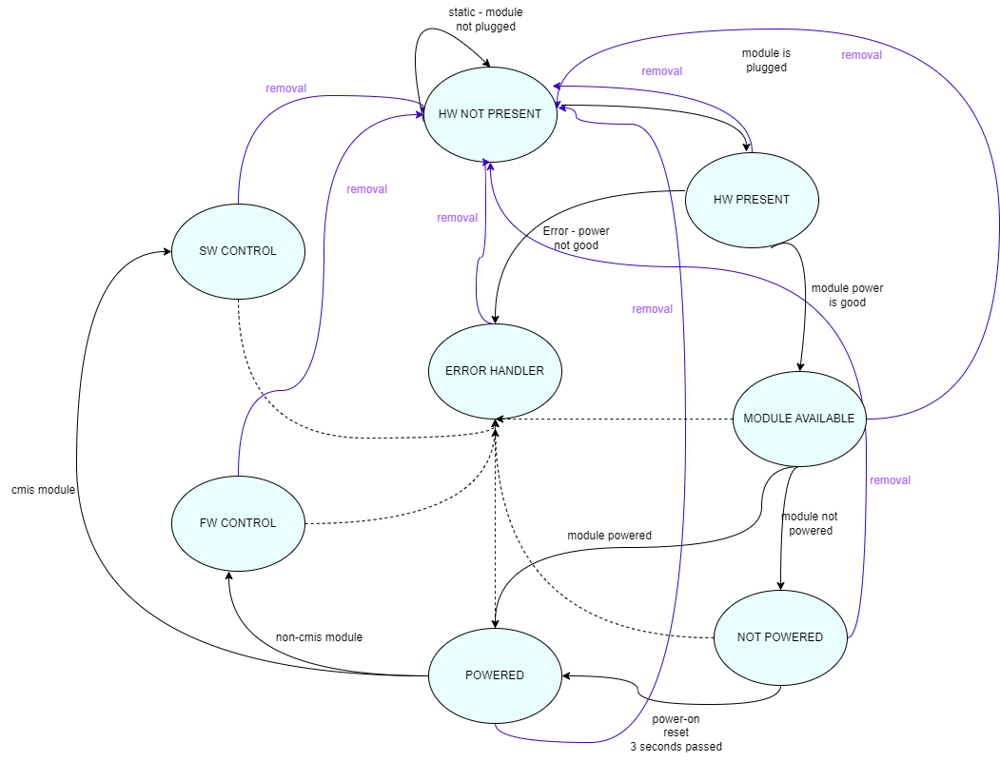
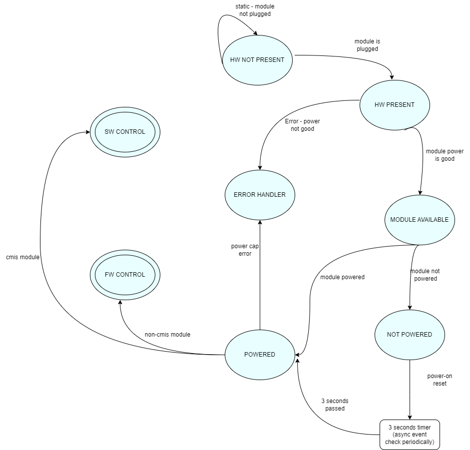

# CMIS management state machine HLD

# High Level Design Document
## Rev 0.1

# Table of Contents
- [1. Revision](#1-revision)
- [2. Scope](#2-scope)
- [3. Motivation](#3-motivation)
- [4. Abbreviations](#4-abbreviations)
- [5. Introduction](#5-introduction)
- [6. HLD design](#6-hld-design)
  - [6.1 The Requirement](#61-the-requirement)
  - [6.2 CMIS Management Platform Support](#62-cmis-management-platform-support)
  - [6.3 Modules Management Thread](#63-modules-management-thread)
  - [6.4 General Module Detection Flow](#64-general-module-detection-flow)
  - [6.5 Module Detection Flow States And Description](#65-module-detection-flow-states-and-description)
  - [6.6 Module Detection Flow States And Functions](#66-module-detection-flow-states-and-functions)

# 1. Revision
| Rev | Date | Author | Change description |
|:----------:|:----------:|:--------------:|:----------------------:|
| 0.1 | 23/10/2023 | Doron Barashi | Initial version|
| | | | |

# 2. Scope
This document provides high level design for CMIS management state machine flow

# 3. Motivation
Customers want to have complete flexibility and independence between switch vendors and optical cables.
The goal of this feature is to allow them to take our switches and easily use them interchangeably with other vendors modules, and vice versa.
Hence, a decision has been made to transition the management of CMIS modules from FW to software SW.

# 4. Abbreviations

| Term | Meaning |
|:--------:|:---------------------------------------------:|
| SONiC| Software for Open Networking in the Cloud|
| CMIS | Common Management Interface Specification|
| MDF | Module Detection Flow|
| SW | Software |
| FW | Firmware |
| Independent module|SW controlled|

# 5. Introduction

Currently, on a switch the low level FW handles all ports and cables transcievers:

The goal of this feature is to let SONiC handle and control CMIS transcievers
- to let unqualified new cables run on a switch
- adjust existing cables 

The above is done with JSON files holding SI params for both ASIC (ports) and transcievers sides

before using the JSON provided, SNOiC need to determine whether it's a CMIS cable that will be controlled by SW (SW control)
or non CMIS that will be controlled by FW (FW control)
in current phase only QSPF-DD and OSFP active cables will be SW controlled (non flat memory cables)

Today, ASIC and modules are configured entirely by PHY FW, with frequent interactions between the XCVRD and PHY FW through Sysfs..

These interactions involve tasks such as monitoring temperature, setting modules to low power mode, resetting modules, etc.

# 6. HLD design

## 6.1 The Requirement

Have state machine flow for each cable from initialization of it until final decision (SW/FW control)

In addition, pmon process uses a Boolean to indicate whether CmisManager thread should start and configure modules (by SW).

Today, SONiC Nvidia are not triggering the thread start, because our modules are configured by FW.

To start configuring modules by SW, we should indicate to start CmisManager thread.

pmon_daemon_control.json, set "skip_xcvrd_cmis_mgr": false.

## 6.2 CMIS Management Platform Support
Before starting MDF and modules handling by SW, we would like to know whether the system supports independent mode or not. 

To achieve that, Pmon will check the content in the above created file - /$HWSKU_DIR/independent_mode_support.profile.
According to the mode in configuration file, new module management thread will know which FD it should check for each port and whether it needs to start MDF or not. 

SysFs indicating the presence of the module, is different between FW/SW controlled modules:
For FW controlled modules, the same SysFs named /sys/module/sx_netdev/$port_dev/module/present will be used.
For SW controlled modules, a new SysFs named /sys/module/sx_core/$asic/$module/hw_present will be used.

## 6.3 Modules Management Thread
In new flow, when Nvidia platform chassis calls get_change_event() for the first time, a new module mgmt thread will start running. Its purpose is to monitor modules plug-in/plug-out events and to notify chassis when requests.

Different from old flow, in new flow when calling get_change_event() function, the only thing to do it reading from the common list of changes sent from the thread via a shared queue (python Queue)

## 6.4 General Module Detection Flow
In case the platform is an independent module supporting platform, at the beginning, all modules will be recognized as SW controlled modules (meaning, hw_present sysfs shall be used). 

Module Detection Flow (MDF) purpose, is to recognize all plugged-in modules, and to distinguish between SW controlled and FW controlled modules.
Note that this flow will be triggered only for independent modules, or at the beginning for independent modules supporting system.

For each module (as the number of modules we can have in the system), we will have a state machine to represent the current state.

** All states can move to state HW_NOT_PRESENT in case the module was plugged out.
** All states can move to state ERROR_HANDLER in case of read/write error.

In static part, we will go over all of the possible modules in the system. 
In dynamic part, this state machine will be triggered by an event - when a module plug-in/plug-out event occurs, the flow will start.

## 6.5 Module Detection Flow States And Description
States List:

|State Name|Description|
|:--------:|:---------------------------------------------:|
|STATE_HW_NOT_PRESENT|Initial state. module is not plugged to cage.|
|STATE_HW_PRESENT|Module is plugged to cage|
|STATE_MODULE_AVAILABLE|Module hw present and power is good|
|STATE_POWERED|Module power in already loaded|
|STATE_NOT_POWERED|Module power is not loaded|
|STATE_FW_CONTROL**|The module is not CMIS and FW needs to handle|
|STATE_SW_CONTROL**|The module is CMIS and SW needs to handle|
|STATE_ERROR_HANDLER|An error occurred - read/write error, power limit or power cap.|
|STATE_POWER_LIMIT_ERROR|The cage has not enough power for the plugged module|
|STATE_SYSFS_ERROR|An error occurred while writing/reading SySFS.|

** Final state

## 6.6 Module Detection Flow States And Functions

|State Name|State Action Function Name|Next Possible State|Description|Comments|
|:--------:|:------------------------:|:------------------|:----------|:-------|
|STATE_HW_NOT_PRESENT|Check_if_hw_present()|STATE_HW_NOT_PRESENT - if module not plugged in, the state will stay the same.  STATE_HW_PRESENT - if module plugged in to cage.   STATE_ERROR_HANDLER - if a read/write error occur.|This function will check if module is plugged to cage. The check will be done by reading  /sys/module/sx_core/$asic/$module/hw_present Sysfs. 0 = hw is not present. 1 = hw is present. In case hw is present, next state will be STATE_HW_PRESENT. In case the module is not plugged, state will stay STATE_HW_NOT_PRESENT. In case of an error, the module will be counted as not presented.|In Static flow (after reboot), we will manually check for all ports if the module is plugged. In Dynamic flow (event driven), we will get an event that hw_present file has been changed for one of the modules.|
|STATE_HW_PRESENT|check_if_module_available()|STATE_MODULE_AVAILABLE - if power is good. STATE_HW_NOT_PRESENT - If a removal event happened, or if power is not good. STATE_ERROR_HANDLER - if a read/write error occur.|This function purpose is to check that module doesn't consume more power than the system allows. It will be done by checking /sys/module/sx_core/$asic/$module/power_good Sysfs.  0 = module consumes excessive power. 1 = module power is as expected. MODULE_AVAILABLE = HW_PRESENT + POWER_GOOD If the power is good, next state will be STATE_MODULE_AVAILABLE.  If the power is not valid, a log will be printed to user, and module will be considered as not present.|NOTE: In case of invalid power, the next state will not be STATE_ERROR, but STATE_HW_NOT_PRESENT.|
STATE_MODULE_AVAILABLE|check_if_power_on()|STATE_POWERED - If module power is loaded. STATE_NOT_POWERED - If module power is not loaded. STATE_HW_NOT_PRESENT - If a removal event happened. STATE_ERROR_HANDLER - if a read/write error occur. This function purpose is to check if module power is on.|<li>In case the system started from cold-boot, or if this is a new plugged module, the power will not be on.</li>Next state will be STATE_NOT_POWERED. <li>In case the system started from fast/warm boot, the power will be on.</li>Next state will be STATE_POWERED.|In order to know if module power is on or not, we will need to read value in  /sys/module/sx_core/$asic/$module/power_on file. 0 = power is off. 1 = power is on. Note: This has to be done in order for us to have access to module's EEPROM.|
STATE_NOT_POWERED|power_on_module()|STATE_POWERED - If power on & reset & 3 seconds passed (using timer function, no sleep). STATE_HW_NOT_PRESENT - If a removal event happened. STATE_ERROR_HANDLER - if a read/write error occur.|This function purpose is to power on the module. It will be done in 2 phases: 1.echo 1 > /sys/module/sx_core/$asic/$module/power_on 2.echo 0 > /sys/module/sx_core/$asic/$module/hw_reset After hw_reset is starting, SONiC needs to wait 3 seconds, to make sure the reset is done and power is loaded to the module. Next state will be STATE_POWERED.|We want to prevent "sleep" use to not waste time, and to keep the main thread available to listen to changes and continue with other modules and events. For that, a special logic will be introduced regarding the 3 seconds wait. The idea will be to not use any sleep() functionality, but to check periodically if 3 seconds has passed and if the module can be considered as powered-on. A timer function will wake up each 1 second and will check which modules from the "waiting list" can already be considered as powered and move to next state.|
STATE_POWERED|check_module_type()|STATE_FW_CONTROL - if the module type is non-cmis. STATE_SW_CONTROL - if the module is cmis and power limit is valid. STATE_ERROR_HANDLER -  if a read/write error occur, or if power limit hit. STATE_HW_NOT_PRESENT - If a removal event happened.|This function purpose is to check the module type and decide whether it works with legacy / independent mode. This will be done by reading the module type from its EEPROM.<li>In case the type is not QSFP-DD / OSFP, the module will work in legacy flow and next state will be STATE_FW_CONTROL (final state). SONiC will notify SDK/FW that this module is under their control by using: echo 0 > /sys/module/sx_core/$asic/$module/control. In addition, the final state of the module will be saved in an inner list and in the shared queue.</li><li>In case the type is QSFP-DD / OSFP, a check for power-cap will need to be performed. check_power_cap() function will be triggered. This function needs to make sure that module power (read from EEPROM), and cage power (read from Sysfs) match. Meaning, module is not exceeding the cage power limit.</li>In case power-cap is OK, we will need to set the maximum supported clock speed to SDK/FW. To do it, we will read the module maximum supported clock of Management Comm Interface (MCI) from module EEPROM. Then, set it to frequency Sysfs using: echo <val> > /sys/module/sx_core/$asic/$module/frequency   //  val: 0 - up to 400KHz, 1 - up to 1MHz In case power-cap is OK and we set max clock speed, state will change to STATE_SW_CONTROL. SONiC will not need to notify SDK/FW that this module is under their control - it's the default value. In addition, the final state of the module will be saved in an inner list and in the shared queue. In case power-cap is not OK, we will do the following: Log to user that module and cage power does not match. Module state will change to STATE_HW_NOT_PRESENT and we will exit.|The cage power limit will be read from /sys/module/sx_core/$asic/$module/power_limit.|
STATE_FW_CONTROL STATE_SW_CONTROL|save_module_control_mode()|STATE_ERROR_HANDLER -  if a read/write error occur. STATE_HW_NOT_PRESENT - If a removal event happened.|If we got to this function, it means we are in a final state - STATE_FW_CONTROL / STATE_SW_CONTROL. We will need to update FW whether the module is FW-control/SW-control.<li>In case FW-control: echo 0 > /sys/module/sx_core/$asic/$module/control</li><li>In case SW-control: do nothing</li>|We will update a new table in State DB called 'TRANSCEIVER_MODULES_MGMT' we will save the port number and in each field we'll have the following key-value pair:<li>key: "control_type" </li><li>value: "FW_CONTROL" or "SW_CONTROL"</li> Note: Once "0" (fw-control) is written to /sys/module/sx_core/$asic/$module/control, we cannot re-write "1" there. and "0" is the only value control sysfs accepts.|
