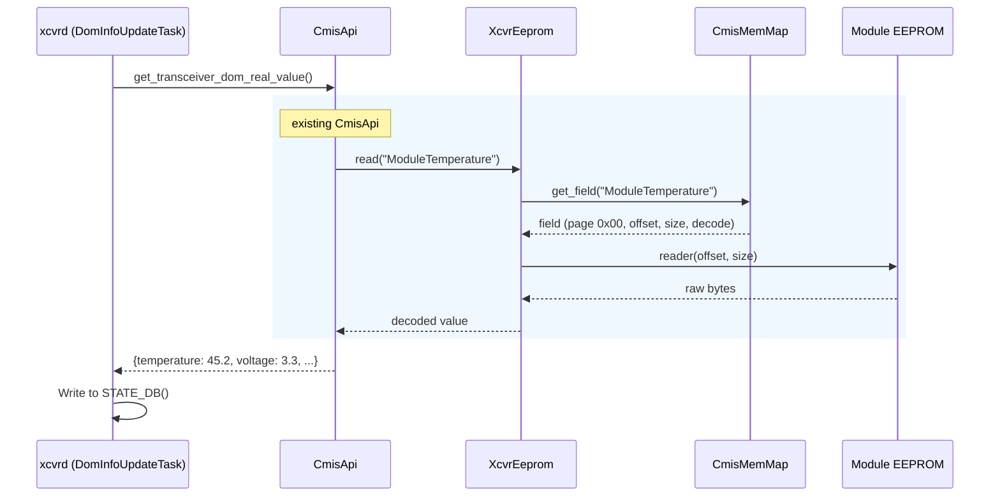
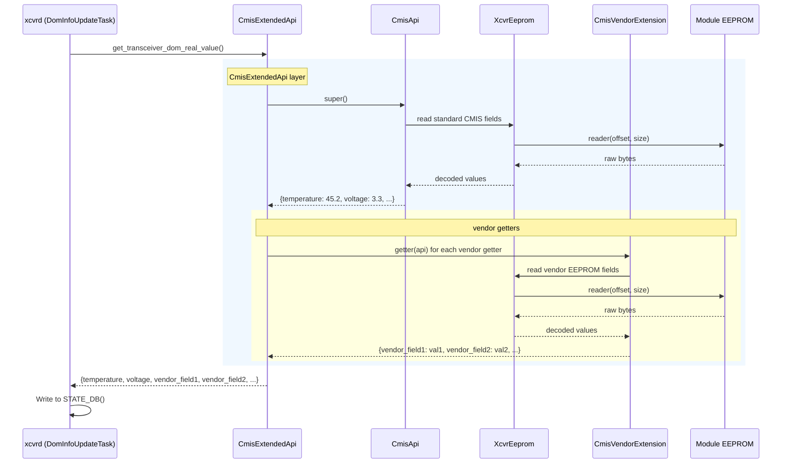
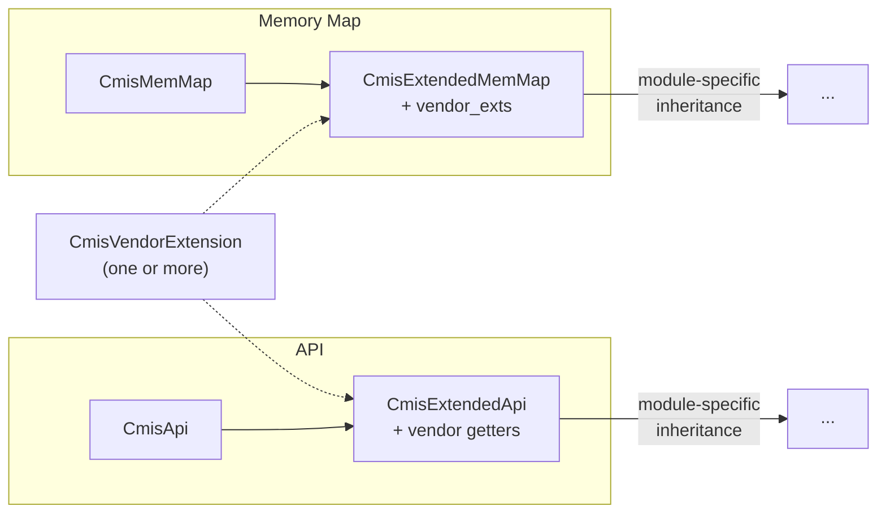

# Vendor-Specific DOM Extensions for CMIS Modules

## Table of Contents

- [Vendor-Specific DOM Extensions for CMIS Modules](#vendor-specific-dom-extensions-for-cmis-modules)
  - [Table of Contents](#table-of-contents)
  - [1. Revision](#1-revision)
  - [2. Scope](#2-scope)
  - [3. Definitions/Abbreviations](#3-definitionsabbreviations)
  - [4. Overview](#4-overview)
        - [Diagram 1 - Current DOM flow](#diagram-1---current-dom-flow)
  - [5. Requirements](#5-requirements)
  - [6. Architecture Design](#6-architecture-design)
  - [7. High-Level Design](#7-high-level-design)
        - [Diagram 2 - With vendor extension](#diagram-2---with-vendor-extension)
    - [7.1 Vendor Extension Pattern](#71-vendor-extension-pattern)
      - [7.1.1 CmisVendorExtension Base Class](#711-cmisvendorextension-base-class)
      - [7.1.2 Vendor Extension Subclass Example](#712-vendor-extension-subclass-example)
    - [7.2 Class Hierarchy](#72-class-hierarchy)
    - [7.3 Memory Map - CmisExtendedMemMap](#73-memory-map---cmisextendedmemmap)
    - [7.4 API - CmisExtendedApi](#74-api---cmisextendedapi)
    - [7.5 Factory Integration](#75-factory-integration)
    - [7.6 CDB - Vendor Telemetry Commands](#76-cdb---vendor-telemetry-commands)
      - [7.6.1 Vendor CDB commands](#761-vendor-cdb-commands)
      - [7.6.2 Vendor contribution format](#762-vendor-contribution-format)
      - [7.6.3 CmisExtendedCdbMemMap](#763-cmisextendedcdbmemmap)
    - [7.7 VDM - Vendor Monitoring Types and DB Mapping](#77-vdm---vendor-monitoring-types-and-db-mapping)
  - [8. STATE\_DB Schema Impact](#8-state_db-schema-impact)
    - [8.1 Aggregator-to-table mapping and trigger](#81-aggregator-to-table-mapping-and-trigger)
    - [8.2 Vendor field naming](#82-vendor-field-naming)
    - [8.3 Example - vendor fields produced by `Vendor1CmisVendorExtension`](#83-example---vendor-fields-produced-by-vendor1cmisvendorextension)
  - [9. SAI API](#9-sai-api)
  - [10. Configuration and Management](#10-configuration-and-management)
  - [11. Warmboot and Fastboot Design Impact](#11-warmboot-and-fastboot-design-impact)
  - [12. Memory Consumption](#12-memory-consumption)
  - [13. Restrictions/Limitations](#13-restrictionslimitations)
  - [14. Testing Requirements/Design](#14-testing-requirementsdesign)
    - [14.1 Unit Test Cases](#141-unit-test-cases)
    - [14.2 System Test Cases](#142-system-test-cases)
  - [15. Open/Action Items](#15-openaction-items)

---
<br>

## 1. Revision

| Rev | Date       | Author        | Change Description |
|-----|------------|---------------|--------------------|
| 0.1 | 2026-04-12 | Natanel Gerbi | Initial version. |
| 0.2 | 2026-04-27 | Natanel Gerbi | Factory accepts a list of vendor extensions via `set_xcvr_params(vendor_exts=[...])`, supporting modules composed of multiple sub-devices. |
| 0.3 | 2026-04-28 | Natanel Gerbi | Vendor-extension classes (`CmisVendorExtension` subclasses) now live in common code under `sonic_xcvr/api/<vendor>/`, alongside the existing per-vendor folders (`amphenol/`, `credo/`, `innolight/`, `public/`). Platform code imports and registers them. §7.6.1 collapsed to a single case: any vendor CDB command not in upstream `CdbMemMap` is contributed via `get_vendor_cdb_commands()` on the common-namespaced extension class. Threaded through §4, §7.1, §7.3, §7.5. |

<br>

## 2. Scope

This document defines a **generic vendor extension framework** for CMIS-based transceiver modules in SONiC. The framework allows platform vendors to inject vendor-specific EEPROM fields, API getters, CDB commands, and VDM mappings into the existing DOM telemetry pipeline without modifying common `sonic_xcvr` code.

The framework is module-type agnostic. It applies to any CMIS module that needs vendor-specific telemetry beyond what is defined in the standard CMIS specification. Specific module-type implementations (e.g., CPO, LPO, etc.) build on top of this framework by inheriting from `CmisExtendedMemMap` / `CmisExtendedApi` and adding their module-specific fields and getters.

<br>

## 3. Definitions/Abbreviations

| Term   | Definition |
|--------|------------|
| CMIS   | Common Management Interface Specification |
| DOM    | Digital Optical Monitoring |
| VDM    | Versatile Diagnostics Monitoring |
| CDB    | Command Data Block |
| LPL    | Local Payload Length|
| EPL    | Extended Payload Length|
| EEPROM | Electrically Erasable Programmable Read-Only Memory |

<br>

## 4. Overview

SONiC monitors transceiver modules through the `sonic_xcvr` library and the `xcvrd` daemon. The architecture has three layers:

- **Memory Map (`XcvrMemMap`)** - Defines the EEPROM layout: which bytes on which pages correspond to which fields, and how to decode them (format, scale, register type). For CMIS modules, `CmisMemMap` defines all standard pages (low memory, pages 0x00-0x02, 0x10-0x11, etc.). The memory map does not read hardware - it is a declarative description of the EEPROM structure.

- **API (`XcvrApi`)** - Reads data from the EEPROM using the memory map and returns it as Python dicts. For CMIS modules, `CmisApi` provides aggregator methods like `get_transceiver_info()`, `get_transceiver_dom_real_value()`, etc. Each method reads the relevant fields from the EEPROM via `XcvrEeprom` (which bridges the memory map to the hardware reader) and returns a flat dict of `{field_name: value}`.

- **DOM thread** - Periodically calls the API aggregator methods and posts the returned dicts to STATE_DB tables. The posting mechanism is generic: it iterates `dict.items()` and writes all key-value pairs as-is to the corresponding STATE_DB table (`TRANSCEIVER_INFO`, `TRANSCEIVER_DOM_SENSOR`, `TRANSCEIVER_DOM_FLAG`, etc.). This means any new key added to the API return dict automatically appears in STATE_DB - no xcvrd changes needed.

##### Diagram 1 - Current DOM flow



Today, `CmisApi` and `CmisMemMap` define only standard CMIS fields. Vendors that need additional telemetry - such as vendor-specific EEPROM pages, proprietary CDB commands, or custom VDM observables - have no standard extension point. Without a framework, each vendor implementation would need to either modify common code or duplicate large parts of the CMIS infrastructure.

This document introduces a vendor extension framework composed of:

- **`CmisVendorExtension`** - a base class that vendors subclass to define their custom EEPROM fields, getter functions, VDM mappings, and CDB commands.
- **`CmisExtendedMemMap`** - a memory map layer that inherits `CmisMemMap` and injects vendor EEPROM fields at construction time.
- **`CmisExtendedCdbMemMap`** - a CDB memory map layer that inherits `CdbMemMap` and injects vendor CDB reply fields and `CDBCommand` instances at construction time.
- **`CmisExtendedApi`** - an API layer that inherits `CmisApi` and merges vendor getter results into every aggregator method.
- **Factory integration** - platform registers a list of vendor extensions on `XcvrApiFactory` via `set_xcvr_params(vendor_exts=[...])` after `SfpBase` construction; the factory extracts the list when creating the API and the CDB handler. A module with a single extension passes a one-element list.

`CmisVendorExtension` subclasses live in common code, in `sonic_xcvr/api/<vendor>/`, alongside the existing per-vendor folders (`amphenol/`, `credo/`, `innolight/`, `public/`). Platform code in `platform/<vendor>/...` imports the class and registers it at SFP-construction time. Switch platforms that use the same SFP can register the same extension, provided their switch firmware implements the vendor-specific commands the extension calls.

These components are module-type agnostic and reusable. Any CMIS-derived module type can use them by inheriting `CmisExtendedMemMap` / `CmisExtendedApi` as their base classes.

<br>

## 5. Requirements

**Functional:**
- The framework shall support vendor-specific EEPROM fields (static pages), VDM observables (including Custom Observables 100-127), and CDB-based telemetry.
- The framework shall reuse the existing CMIS monitoring infrastructure (`sonic_xcvr`, `xcvrd`) as much as possible, without requiring changes to common code.

**Non-Functional:**
- The framework shall be transparent to modules that do not provide a vendor extension.
- Vendor extension failures shall not crash the DOM polling loop.

<br>

## 6. Architecture Design


## 7. High-Level Design

With vendor extensions, the read path gains an additional layer. `CmisExtendedApi` sits between `CmisApi` and any module-specific API. It calls `super()` to collect the standard CMIS data, then invokes vendor-registered getter functions (EEPROM reads from vendor-specific pages, CDB commands) and merges their results. The final merged dict flows to xcvrd unchanged - no xcvrd modifications are needed.

##### Diagram 2 - With vendor extension



### 7.1 Vendor Extension Pattern

All vendor-specific configuration is encapsulated in a single class. The vendor subclasses `CmisVendorExtension` and overrides methods to provide vendor-specific EEPROM fields, getter functions, CDB commands, and VDM mappings.

Each subclass lives in common code under `sonic_xcvr/api/<vendor>/`, alongside the existing per-vendor folders (`amphenol/`, `credo/`, `innolight/`) and `public/`, and is wired in from `platform/<vendor>/...` via `set_xcvr_params(vendor_exts=[...])` (Section 7.5).

Reusability follows from this split: switch platforms that use the same SFP can register the same extension, as long as their switch firmware implements the vendor-specific commands the extension calls.

A single port may compose more than one `CmisVendorExtension` instance when a module is physically built from multiple vendor-supplied sub-devices (for example, a module composed of two sub-assemblies sharing one CMIS interface). The platform passes all relevant extensions in one list via `set_xcvr_params(vendor_exts=[...])` (Section 7.5); the framework merges their contributions at construction time. Each extension must remain scoped to a single sub-device so it stays composable in any combination, and two extensions registering the same EEPROM field name or CDB command id is rejected at construction with `ValueError` - extension authors are responsible for keeping their fields and commands distinct.

#### 7.1.1 CmisVendorExtension Base Class

```python
class CmisVendorExtension:
    """Base class for vendor extensions. Platform subclasses override methods."""

    def get_vendor_fields(self, getaddr):
        """Return vendor-specific EEPROM field groups for the memory map.

        Args:
            getaddr: CmisMemMap.getaddr(page, offset) -> linear address.

        Returns:
            dict of {attr_name: RegGroupField}.
            Each RegGroupField uses getaddr to compute addresses on vendor pages.
            Example: {'VENDOR_SENSORS': RegGroupField(getaddr(0xB0, 128), ...)}
        """
        return {}

    def get_vendor_getters(self):
        """Return vendor-specific getter functions.

        Returns:
            dict of {aggregator_name: [func(api) -> dict | None]}.
            aggregator_name must match a CmisApi aggregator method name.
            Each function receives the API instance, is called synchronously,
            and returns a dict of {key: value} pairs to merge into the
            aggregator result.
            Example: {'get_transceiver_dom_real_value': [self._read_vendor_sensors]}
        """
        return {}

    def get_vdm_db_map(self):
        """Return vendor-specific VDM observable-to-STATE_DB key prefix mappings.

        Returns:
            dict of {vdm_observable_name: db_prefix}.
            Merged into _get_vdm_key_to_db_prefix_map() so that
            vendor-specific VDM observables are posted to STATE_DB
            only for modules using this extension.
            Example: {"Vendor Observable [unit]": "vendor_observable"}
        """
        return {}

    def get_vdm_custom_types(self):
        """Return vendor-specific VDM custom observable type definitions.

        CMIS reserves type IDs 100-127 for Custom Observables (spec [28]).
        Vendors use this method to define their custom type decodings.

        Returns:
            dict of {type_id: (observable_name, lane_applicable)}.
            type_id must be in the range 100-127.
            observable_name is the human-readable string (e.g., "Laser Age [%]").
            lane_applicable is True if per-lane, False if module-level.
            Example: {100: ("Laser Age [%]", False), 101: ("ELS Bias Current [mA]", True)}
        """
        return {}

    def get_vendor_cdb_commands(self, getaddr):
        """Return vendor-specific CDB commands and their reply layouts.

        Args:
            getaddr: CdbMemMap.getaddr(page, offset) -> linear address.

        Returns:
            list of (CDBCommand, XcvrField | None) tuples. For each tuple,
            the field's .name must match the command's rpl_field; pass None
            for trigger-only commands. Reply fields live in the LPL reply
            area (page 0x9F, bytes 136-255).
        """
        return []
```


#### 7.1.2 Vendor Extension Subclass Example

The example class below lives in `sonic_xcvr/api/vendor1/vendor1_cmis_vendor_ext.py` (one file per vendor extension under `sonic_xcvr/api/<vendor>/`). Platform code imports `Vendor1CmisVendorExtension` from there and passes it to `set_xcvr_params` (Section 7.5).

```python
VENDOR_VOLTAGE_TELEM         = "vendor_voltage_telem"
VENDOR_VOLTAGE_MV            = "vendor_voltage_mv"
VENDOR_GET_VOLTAGE_TELEM_CMD = 0xFF01

class VendorGetVoltageTelem(CDBCommand):
    def __init__(self):
        super().__init__(cmd_id=VENDOR_GET_VOLTAGE_TELEM_CMD,
                         epl=0, lpl=0,
                         rpl_field=VENDOR_VOLTAGE_TELEM)


class Vendor1CmisVendorExtension(CmisVendorExtension):

    def get_vendor_fields(self, getaddr):
        return {
            'VENDOR_SENSORS': RegGroupField(getaddr(0xB0, 128),
                NumberRegField("vendor_temperature", ...),
                NumberRegField("vendor_voltage", ...),
            ),
        }

    def get_vendor_getters(self):
        return {
            'get_transceiver_dom_real_value':
                [self._get_vendor_sensors, self._get_vendor_voltage_via_cdb],
        }

    def get_vendor_cdb_commands(self, getaddr):
        voltage_field = RegGroupField(VENDOR_VOLTAGE_TELEM,
            NumberRegField(VENDOR_VOLTAGE_MV,
                           getaddr(LPL_PAGE, 136), size=2, format=">H"),
        )
        return [(VendorGetVoltageTelem(), voltage_field)]

    def _get_vendor_sensors(self, api):
        data = api.xcvr_eeprom.read('VENDOR_SENSORS') or {}
        return {
            'vendor_temperature': data.get('vendor_temperature', 'N/A'),
            'vendor_voltage':     data.get('vendor_voltage', 'N/A'),
        }

    def _get_vendor_voltage_via_cdb(self, api):
        if not api.cdb_cmd_hdlr.send_cmd(VENDOR_GET_VOLTAGE_TELEM_CMD):
            return None
        data = api.cdb_cmd_hdlr.read_reply(VENDOR_GET_VOLTAGE_TELEM_CMD)
        return {VENDOR_VOLTAGE_MV: data.get(VENDOR_VOLTAGE_MV)}

    def get_vdm_db_map(self):
        return {"Vendor Observable A [unit]": "vendor_obs_a"}

    def get_vdm_custom_types(self):
        return {100: ("Vendor Observable A [unit]", False)}
```

### 7.2 Class Hierarchy

The vendor extension introduces a single intermediate layer between the standard CMIS classes and any module-specific classes:



Module-specific implementations (e.g., CPO vModules, ELSFP devices) inherit from `CmisExtendedMemMap` / `CmisExtendedApi` and add their own fields and getters. This two-layer pattern separates the generic vendor extension mechanism from the module-specific logic.

### 7.3 Memory Map - CmisExtendedMemMap

`CmisExtendedMemMap` inherits from `CmisMemMap` and adds vendor field injection. At construction time, the memory map iterates `vendor_exts` (a list of extensions, possibly empty) and calls `get_vendor_fields()` on each with the memory map's `getaddr` function. The returned fields are set as attributes on the memory map, making them available to `XcvrEeprom.read()` just like any standard CMIS field. Two extensions registering the same field name (or one colliding with an existing CMIS field) is a programming error and is rejected at construction with `ValueError`.

The vendor field definitions returned by `get_vendor_fields()` live in the same vendor-extension class file under `sonic_xcvr/api/<vendor>/` (Section 7.1), so the EEPROM layout, CDB commands, and VDM mappings for one SFP are kept in a single place.

```python
class CmisExtendedMemMap(CmisMemMap):
    def __init__(self, codes, vendor_exts=None):
        super().__init__(codes)
        self.vendor_exts = list(vendor_exts) if vendor_exts else []
        for ext in self.vendor_exts:
            for attr_name, field in ext.get_vendor_fields(self.getaddr).items():
                if hasattr(self, attr_name):
                    raise ValueError(f"Vendor field '{attr_name}' collides")
                setattr(self, attr_name, field)
```

The `vendor_exts` list is stored on the memory map so the API layer can retrieve it later without requiring a separate initialization path.

### 7.4 API - CmisExtendedApi

`CmisExtendedApi` inherits from `CmisApi` and overrides all aggregator methods (`get_transceiver_info`, `get_transceiver_dom_real_value`, etc.). Each override calls `super()` then invokes the vendor getter functions from each `CmisVendorExtension` registered on the module and merges their results. It also overrides VDM maps to merge vendor-specific VDM entries (see Section 7.7). Iteration order matches the registration order in `vendor_exts`.

```python
class CmisExtendedApi(CmisApi):
    def __init__(self, xcvr_eeprom):
        super().__init__(xcvr_eeprom)
        vendor_exts = getattr(xcvr_eeprom.mem_map, 'vendor_exts', [])

        # Per-aggregator getter lists: concatenated in registration order.
        self._vendor_getters = {}
        for ext in vendor_exts:
            for aggr_name, getters in ext.get_vendor_getters().items():
                self._vendor_getters.setdefault(aggr_name, []).extend(getters)

        # VDM maps: dict.update() per extension, in registration order
        # (last writer wins on conflicts).
        self._vendor_vdm_db_map = {}
        self._vendor_vdm_custom_types = {}
        for ext in vendor_exts:
            self._vendor_vdm_db_map.update(ext.get_vdm_db_map())
            self._vendor_vdm_custom_types.update(ext.get_vdm_custom_types())

        cdb_mem_map = CmisExtendedCdbMemMap(CdbCodes, vendor_exts=vendor_exts)
        self.cdb_cmd_hdlr = CdbCmdHandler(xcvr_eeprom.reader, xcvr_eeprom.writer, cdb_mem_map)

    def _merge_vendor_getters(self, aggregator_name, result):
        for getter in self._vendor_getters.get(aggregator_name, []):
            try:
                data = getter(self)
                if data:
                    result.update(data)
            except Exception:
                logger.exception("Vendor getter failed for %s", aggregator_name)

    def get_transceiver_dom_real_value(self):
        result = super().get_transceiver_dom_real_value()
        if result is None:
            return None
        self._merge_vendor_getters('get_transceiver_dom_real_value', result)
        return result

    # Same pattern for get_transceiver_info, get_transceiver_status, etc.
```

### 7.5 Factory Integration

`XcvrApiFactory` exposes a `set_xcvr_params(**kwargs)` method that allows the platform to inject module-specific parameters after `SfpBase` construction. The factory stores them in `_xcvr_params`. Each factory `_create_*` method extracts only the parameters it needs via `self._xcvr_params.get()`, passing them explicitly to the memory map and API constructors. This design allows future module-type HLDs to introduce new parameters (e.g., bank configuration, lane mapping) without modifying the `SfpBase` or `XcvrApiFactory` signatures, and without threading kwargs through the SFP inheritance chain.

Vendor extensions are registered as a list under the `vendor_exts` key. A module with a single extension passes a one-element list (`vendor_exts=[X]`); a module composed of multiple sub-devices passes one extension per sub-device (`vendor_exts=[X, Y]`), and the framework merges their contributions at construction time in registration order (Sections 7.3, 7.4, 7.6.3).

```python
# XcvrApiFactory (common code)
class XcvrApiFactory(object):
    def __init__(self, reader, writer):
        self.reader = reader
        self.writer = writer
        self._xcvr_params = {}

    def set_xcvr_params(self, **kwargs):
        self._xcvr_params.update(kwargs)

    def _create_cmis_extended_api(self):
        vendor_exts = self._xcvr_params.get('vendor_exts', None)
        mem_map = CmisExtendedMemMap(CmisCodes, vendor_exts=vendor_exts)
        xcvr_eeprom = XcvrEeprom(self.reader, self.writer, mem_map)
        return CmisExtendedApi(xcvr_eeprom)
```

The factory only wires the DOM path. The CDB handler and its extended mem map are built inside `CmisExtendedApi.__init__` (Section 7.4), which pulls `vendor_exts` from the mem map it receives.

```python
# Platform SFP object (e.g., platform/<vendor>/.../sfp.py) - imports the
# extension class from common code and passes it after construction.

from sonic_platform_base.sonic_xcvr.api.vendor1.vendor1_cmis_vendor_ext import (
    Vendor1CmisVendorExtension,
)

# Single extension - the simplest case:
class PlatformSfp(SfpBase):
    def __init__(self, index):
        super().__init__()
        self._xcvr_api_factory.set_xcvr_params(
            vendor_exts=[Vendor1CmisVendorExtension()],
        )

# Multiple extensions - one per sub-device on a composed module:
from sonic_platform_base.sonic_xcvr.api.vendor1.vendor1_sub_a_ext import Vendor1SubAExtension
from sonic_platform_base.sonic_xcvr.api.vendor1.vendor1_sub_b_ext import Vendor1SubBExtension

class ComposedPlatformSfp(SfpBase):
    def __init__(self, index):
        super().__init__()
        self._xcvr_api_factory.set_xcvr_params(
            vendor_exts=[
                Vendor1SubAExtension(),
                Vendor1SubBExtension(),
            ],
        )
```

Standard (non-extended) SFP objects don't call `set_xcvr_params()` - the factory starts with an empty `_xcvr_params` dict and existing `_create_*` methods are unaffected.

### 7.6 CDB - Vendor Telemetry Commands

This HLD aligns with the CDB architecture from upstream PR [sonic-net/sonic-platform-common#658](https://github.com/sonic-net/sonic-platform-common/pull/658):

- **`CdbMemMap`** - holds reply fields and `CDBCommand` instances as attributes; multiplexes commands by `cmd_id`, reply fields by name.
- **`CDBCommand`** - one command: `cmd_id`, LPL/EPL **request** sizes, optional `encode()`, and `rpl_field` (the **string name** of its reply field on the mem map).
- **`CdbCmdHandler`** - runtime driver: `send_cmd(cmd_id)` / `read_reply(cmd_id)`. `read_reply()` resolves the field by name via `mem_map.get_field(name)`, which means **reply fields must live on the mem map**.

#### 7.6.1 Vendor CDB commands

A vendor CDB command is one whose `cmd_id` and reply layout are not part of the upstream `CdbMemMap`, because it is specific to a particular SFP and to the switch firmware that knows how to issue it. The command and its reply field are contributed through `CmisVendorExtension.get_vendor_cdb_commands(getaddr)` (Section 7.1.1) and registered on `CmisExtendedCdbMemMap` (Section 7.6.3).

The vendor-extension class itself lives in common code, in `sonic_xcvr/api/<vendor>/`, alongside the existing per-vendor folders (`amphenol/`, `credo/`, `innolight/`, `public/`). Platform code in `platform/<vendor>/...` imports the class and registers it on the SFP via `set_xcvr_params(vendor_exts=[...])` (Section 7.5). Switch platforms that use the same SFP can register the same extension, provided their switch firmware implements the vendor-specific commands it calls. The getter shape on the platform side is unchanged - see `_get_vendor_voltage_via_cdb` in Section 7.1.2.

#### 7.6.2 Vendor contribution format

Vendors return a list of `(CDBCommand, XcvrField | None)` tuples from `get_vendor_cdb_commands(getaddr)` (Section 7.1.1). Each tuple carries one command and the single top-level field (typically a `RegGroupField`) describing its **reply** layout. The field's `.name` must equal the command's `rpl_field`. Use `None` for trigger-only commands with no reply.

The request and reply sides are intentionally asymmetric, mirroring the upstream pattern:

- **Request** - packed imperatively inside the `CDBCommand` subclass's `encode(payload)` method (e.g., `struct.pack(...)`). No `RegGroupField` is involved because the request bytes come from caller-supplied values and are written once to the fixed command slot at page 0x9F offset 128.
- **Reply** - described declaratively by the `RegGroupField` on the mem map. `CdbCmdHandler.read_reply()` resolves it by name via `XcvrEeprom.read()`, which slices and decodes the module's returned bytes.

Reply fields may live in either the LPL reply area (page 0x9F, bytes 136-255 → up to ~119 bytes) or the EPL range. Field addresses are computed the same way for both via `getaddr(page, offset)`.

#### 7.6.3 CmisExtendedCdbMemMap

```python
class CmisExtendedCdbMemMap(CdbMemMap):
    def __init__(self, codes, vendor_exts=None):
        super().__init__(codes)
        for ext in (vendor_exts or []):
            for cmd, field in ext.get_vendor_cdb_commands(self.getaddr):
                if field is not None:
                    if hasattr(self, field.name):
                        raise ValueError(f"Vendor CDB field '{field.name}' collides")
                    setattr(self, field.name, field)
                cmd_attr = f"_vendor_cdb_cmd_{cmd.cmd_id:#06x}"
                if hasattr(self, cmd_attr):
                    raise ValueError(f"Vendor CDB command {cmd.cmd_id:#06x} collides")
                setattr(self, cmd_attr, cmd)
```

The inherited `dir(self)` walks in `_get_all_fields()` and `_get_all_cdb_cmds()` pick up vendor attributes alongside upstream ones on first access - no overrides needed. Collisions with upstream attributes, or between two registered extensions, raise at construction time.

`CmisExtendedCdbMemMap` is instantiated by `CmisExtendedApi.__init__` (Section 7.4), which wraps it in a plain `CdbCmdHandler` exposed as `api.cdb_cmd_hdlr`. This handler is independent from the upstream firmware handler at `api.cdb_fw_hdlr`; both talk to the same physical CDB slot, each with its own mem map. Because the CDB slot is a single hardware resource, `send_cmd` → poll → `read_reply` always runs sequentially per module - this is a property of CDB itself, not of this framework.

### 7.7 VDM - Vendor Monitoring Types and DB Mapping

VDM (Versatile Diagnostics Monitoring) is self-describing in CMIS - the module advertises which observables it supports in its descriptors (pages 0x20-0x23), and the common VDM mechanism decodes them automatically using two mappings:

1. **Type map** (`CmisCodes.VDM_TYPE`) - maps type IDs to observable names (e.g., `21 -> "Laser Age [%]"`). This is the decoding step.
2. **DB map** (`_get_vdm_key_to_db_prefix_map()`) - maps observable names to STATE_DB key prefixes (e.g., `"Laser Age [%]" -> "laser_age"`). This controls which decoded observables are published.

Both mappings are passive - if a module does not advertise a given type ID, the entry is never used; unknown IDs are silently skipped.

The vendor extension provides two methods that extend these mappings per-module, without modifying the common dictionaries:

- **`get_vdm_custom_types()`** - returns vendor-specific type IDs in the CMIS Custom Observables range 100-127 (see spec [28]). Merged into the type map by `CmisExtendedApi`:

```python
    def _get_vdm_type_map(self):
        base_map = super()._get_vdm_type_map()
        if self._vendor_vdm_custom_types:
            base_map.update(self._vendor_vdm_custom_types)
        return base_map
```

- **`get_vdm_db_map()`** - returns vendor-specific observable-name-to-STATE_DB-prefix mappings. Merged into the DB map by `CmisExtendedApi`:

```python
    def _get_vdm_key_to_db_prefix_map(self):
        base_map = super()._get_vdm_key_to_db_prefix_map()
        if self._vendor_vdm_db_map:
            base_map.update(self._vendor_vdm_db_map)
        return base_map
```

Both overrides are scoped to modules that have a vendor extension provided. Standard CMIS modules are unaffected. No changes to the common VDM read, freeze, or flag logic are needed.

## 8. STATE_DB Schema Impact

This framework does **not** introduce new STATE_DB tables. Vendor-specific data is published into the **existing** `TRANSCEIVER_*` tables that `xcvrd` already owns, by piggy-backing on the generic pattern: each `xcvrd` posting helper calls an API aggregator method (e.g. `get_transceiver_dom_real_value()`), iterates `dict.items()` on the returned dict, and writes every key/value to the target table as-is. Any vendor key that `CmisExtendedApi` merges into the aggregator result therefore appears in STATE_DB automatically, with no `xcvrd` changes.

### 8.1 Aggregator-to-table mapping and trigger

The **trigger** column indicates when `xcvrd` posts the data to STATE_DB:

- **Plug-in**: posted by `SfpStateUpdateTask` on module insertion (and at daemon init for already-present modules and on retry after a failed EEPROM read).
- **Polling**: posted by `DomInfoUpdateTask` on every `DOM_INFO_UPDATE_PERIOD_SECS` cycle.
- **Link change**: in addition to polling, re-posted by `DomInfoUpdateTask` whenever the port's host-lane link state transitions (e.g. `oper_status` up/down), after a short debounce. This exists so flags set by a link transition (loss-of-signal, CDR unlock, etc.) are captured promptly instead of waiting for the next polling cycle.

For flag aggregators, `xcvrd` also derives three companion metadata tables from the same dict the aggregator returns - `_CHANGE_COUNT`, `_SET_TIME`, `_CLEAR_TIME` - by diffing current values against what's already in STATE_DB (see `_update_flag_metadata_tables()`). The companion tables share the same field names (one per flag) as the primary table. Below, `+ metadata` is shorthand for these three companion tables.

| `CmisApi` aggregator method | STATE_DB table(s) | Trigger |
|---|---|---|
| `get_transceiver_info()` | `TRANSCEIVER_INFO` | Plug-in |
| `get_transceiver_info_firmware_versions()` | `TRANSCEIVER_FIRMWARE_INFO` | Polling |
| `get_transceiver_dom_real_value()` | `TRANSCEIVER_DOM_SENSOR` | Polling |
| `get_transceiver_dom_flags()` | `TRANSCEIVER_DOM_FLAG` + metadata | Polling + Link change |
| `get_transceiver_threshold_info()` | `TRANSCEIVER_DOM_THRESHOLD` | Plug-in |
| `get_transceiver_status()` | `TRANSCEIVER_STATUS` | Polling |
| `get_transceiver_status_flags()` | `TRANSCEIVER_STATUS_FLAG` + metadata | Polling + Link change |
| `get_transceiver_vdm_real_value()` | `TRANSCEIVER_VDM_REAL_VALUE` | Polling |
| `get_transceiver_vdm_flags()` | `TRANSCEIVER_VDM_{HALARM,LALARM,HWARN,LWARN}_FLAG` + metadata (per threshold type) | Polling + Link change |
| `get_transceiver_vdm_thresholds()` | `TRANSCEIVER_VDM_{HALARM,LALARM,HWARN,LWARN}_THRESHOLD` | Plug-in |

A vendor getter registered under an aggregator name in `get_vendor_getters()` (Section 7.1.1) inherits that aggregator's trigger and target table. For example, `{'get_transceiver_dom_real_value': [self._get_vendor_sensors]}` causes `_get_vendor_sensors`'s returned keys to land in `TRANSCEIVER_DOM_SENSOR` on every polling cycle.

### 8.2 Vendor field naming

In both the aggregator path and the VDM path the vendor fully controls the STATE_DB key name - either as a dict key returned by the vendor getter (consumed by `CmisExtendedApi._merge_vendor_getters()` via `dict.update()`), or as the key prefix declared in `get_vdm_db_map()` (Section 7.7). No naming scheme is enforced by the framework, so vendor authors are responsible for choosing keys that do not collide with existing standard CMIS keys in the same table - collisions silently overwrite the standard value. Recommended practice is to use a descriptive vendor-scoped prefix (e.g. `vendor_<descriptor>_`) and follow the upstream per-lane convention `...{lane_num}...` (lanes 1..N) for lane-indexed fields.

One naming rule is enforced implicitly for VDM flags and thresholds: `xcvrd` splits the dicts returned by `get_transceiver_vdm_flags()` and `get_transceiver_vdm_thresholds()` into four primary tables (`TRANSCEIVER_VDM_{HALARM,LALARM,HWARN,LWARN}_{FLAG,THRESHOLD}`) by matching the substrings `_halarm`, `_lalarm`, `_hwarn`, `_lwarn` in each key. Keys that do not contain one of these substrings are silently dropped. A vendor getter hooked into either aggregator must therefore emit keys like `vendor_<descriptor>_halarm`, `vendor_<descriptor>_lwarn`, etc. - the suffix is stripped before the value is written, so the column in STATE_DB is `vendor_<descriptor>`.

### 8.3 Example - vendor fields produced by `Vendor1CmisVendorExtension`

Using `Vendor1CmisVendorExtension` from Section 7.1.2 on port `Ethernet0`, these are the STATE_DB rows that appear in addition to the standard CMIS rows. The fields come from three sources in that extension: `_get_vendor_sensors` (vendor EEPROM page 0xB0 via `get_vendor_fields`), `_get_vendor_voltage_via_cdb` (vendor CDB command `0xFF01` via `get_vendor_cdb_commands`), and `get_vdm_db_map` / `get_vdm_custom_types` (VDM custom observable 100).

`TRANSCEIVER_DOM_SENSOR` (posted every polling cycle):

```plaintext
    ; Defines Transceiver DOM sensor information for a port
    key                              = TRANSCEIVER_DOM_SENSOR|Ethernet0
    ; field                          = value

    ;--- Standard CMIS fields (from CmisApi, unchanged) ---
    last_update_time                 = STR     ; last update time for diagnostic data
    temperature                      = FLOAT   ; temperature in Celsius
    voltage                          = FLOAT   ; voltage in V
    tx{lane_num}power                = FLOAT   ; tx power in dBm for each lane
    rx{lane_num}power                = FLOAT   ; rx power in dBm for each lane
    ; ...

    ;--- Vendor-specific fields (added by Vendor1CmisVendorExtension) ---
    vendor_temperature               = FLOAT   ; from _get_vendor_sensors (vendor EEPROM page 0xB0)
    vendor_voltage                   = FLOAT   ; from _get_vendor_sensors
    vendor_voltage_mv                = INT     ; module-level voltage in mV from vendor CDB 0xFF01 reply
```

`TRANSCEIVER_VDM_REAL_VALUE` (posted every polling cycle when the module advertises VDM type 100):

```plaintext
    ; Defines Transceiver VDM sample for a port
    key                              = TRANSCEIVER_VDM_REAL_VALUE|Ethernet0
    ; field                          = value

    ;--- Standard CMIS VDM observables (from CmisApi, unchanged) ---
    last_update_time                 = STR     ; last update time for diagnostic data
    laser_temperature_media{lane_num} = FLOAT  ; laser temperature in Celsius for media input
    esnr_media_input{lane_num}       = FLOAT   ; eSNR value in dB for media input
    ; ...

    ;--- Vendor-specific VDM observable (added by Vendor1CmisVendorExtension) ---
    vendor_obs_a                     = FLOAT   ; VDM Custom Observable type 100
                                               ; ("Vendor Observable A [unit]" -> "vendor_obs_a",
                                               ;  declared in get_vdm_db_map / get_vdm_custom_types,
                                               ;  lane_applicable=False -> single module-level key)
```

No schema changes to the tables themselves are required - these rows simply appear alongside the standard ones for modules that provide this vendor extension. VDM observables declared with `lane_applicable=True` in `get_vdm_custom_types` would instead produce per-lane keys following the upstream `{lane_num}` convention (e.g. `vendor_obs_b{lane_num}`).

## 9. SAI API

## 10. Configuration and Management

## 11. Warmboot and Fastboot Design Impact

## 12. Memory Consumption

## 13. Restrictions/Limitations

- **No STATE_DB key namespacing is enforced.** Vendor keys coexist with standard CMIS keys in the same table (see Section 8). A vendor getter key that collides with a standard CMIS key will silently overwrite it via `dict.update()` in `CmisExtendedApi._merge_vendor_getters()`. Vendor authors are responsible for avoiding collisions.
- **CDB slot is a single per-module hardware resource.** All CDB-backed getters (vendor and upstream firmware) share the same CDB slot; `send_cmd` → poll → `read_reply` is therefore serial per module. This is a CMIS/CDB property, not a framework limitation.
- **Vendor getter failures are swallowed.** `_merge_vendor_getters` catches exceptions per getter so that one vendor bug cannot break the aggregator or the DOM polling loop. Failures are logged only.

## 14. Testing Requirements/Design

### 14.1 Unit Test Cases

### 14.2 System Test Cases

## 15. Open/Action Items
