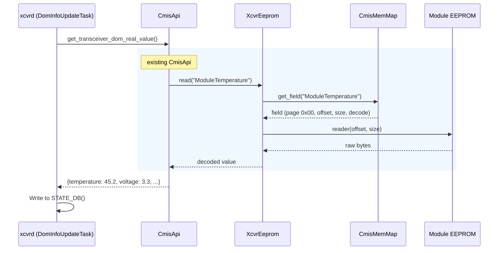
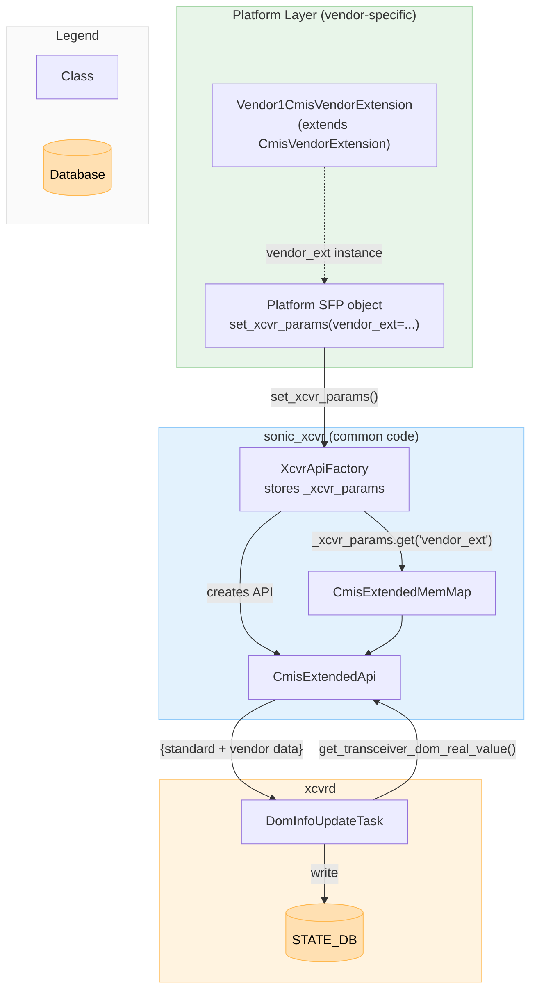
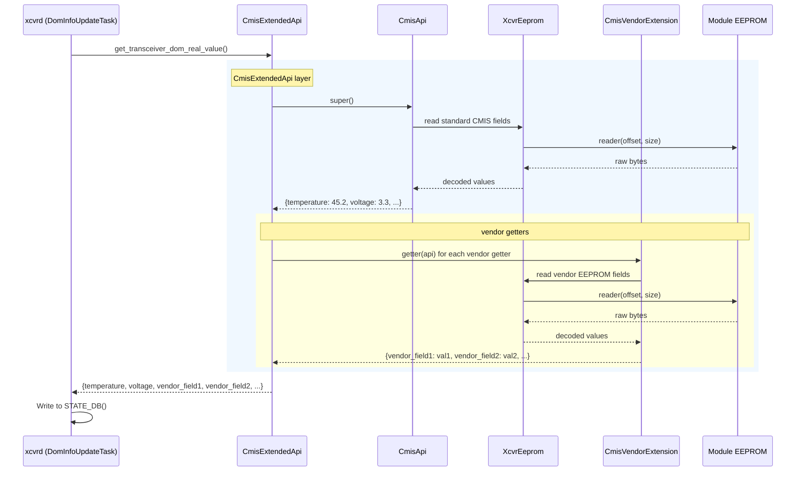
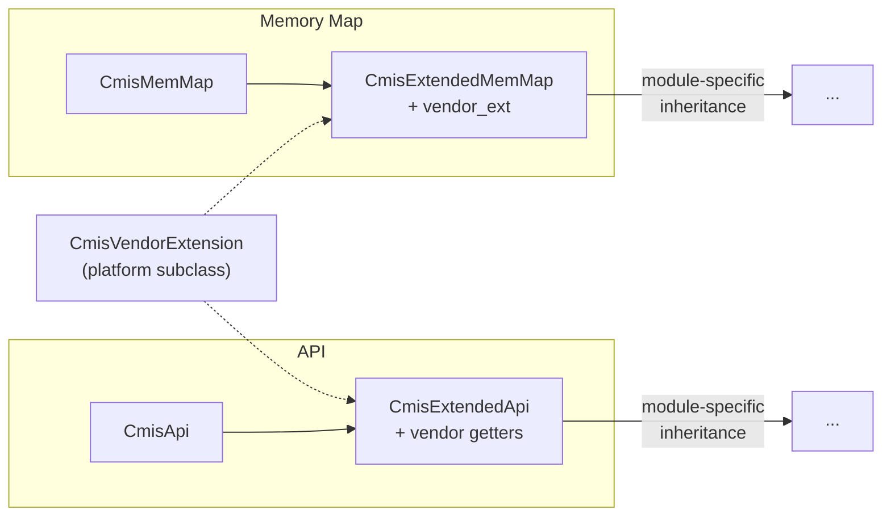

# Vendor-Specific DOM Extensions for CMIS Modules

## Table of Contents

- [Vendor-Specific DOM Extensions for CMIS Modules](#vendor-specific-dom-extensions-for-cmis-modules)
  - [Table of Contents](#table-of-contents)
  - [1. Revision](#1-revision)
  - [2. Scope](#2-scope)
  - [3. Definitions/Abbreviations](#3-definitionsabbreviations)
  - [4. Overview](#4-overview)
        - [Diagram 1 - Current DOM flow](#diagram-1---current-dom-flow)
  - [5. Requirements](#5-requirements)
  - [6. Architecture Design](#6-architecture-design)
  - [7. High-Level Design](#7-high-level-design)
        - [Diagram 2 - With vendor extension](#diagram-2---with-vendor-extension)
    - [7.1 Vendor Extension Pattern](#71-vendor-extension-pattern)
      - [7.1.1 CmisVendorExtension Base Class](#711-cmisvendorextension-base-class)
      - [7.1.2 Vendor Extension Subclass Example](#712-vendor-extension-subclass-example)
    - [7.2 Class Hierarchy](#72-class-hierarchy)
    - [7.3 Memory Map - CmisExtendedMemMap](#73-memory-map---cmisextendedmemmap)
    - [7.4 API - CmisExtendedApi](#74-api---cmisextendedapi)
    - [7.5 Factory Integration](#75-factory-integration)
    - [7.6 CDB - Vendor Telemetry Commands](#76-cdb---vendor-telemetry-commands)
    - [7.7 VDM - Vendor Monitoring Types and DB Mapping](#77-vdm---vendor-monitoring-types-and-db-mapping)
  - [8. SAI API](#8-sai-api)
  - [9. Configuration and Management](#9-configuration-and-management)
  - [10. Warmboot and Fastboot Design Impact](#10-warmboot-and-fastboot-design-impact)
  - [11. Memory Consumption](#11-memory-consumption)
  - [12. Restrictions/Limitations](#12-restrictionslimitations)
  - [13. Testing Requirements/Design](#13-testing-requirementsdesign)
    - [13.1 Unit Test Cases](#131-unit-test-cases)
    - [13.2 System Test Cases](#132-system-test-cases)
  - [14. Open/Action Items](#14-openaction-items)

---
<br>

## 1. Revision

| Rev | Date       | Author        | Change Description |
|-----|------------|---------------|--------------------|
| 0.1 | 2026-04-12 | Natanel Gerbi | Initial version. |

<br>

## 2. Scope

This document defines a **generic vendor extension framework** for CMIS-based transceiver modules in SONiC. The framework allows platform vendors to inject vendor-specific EEPROM fields, API getters, CDB commands, and VDM mappings into the existing DOM telemetry pipeline without modifying common `sonic_xcvr` code.

The framework is module-type agnostic. It applies to any CMIS module that needs vendor-specific telemetry beyond what is defined in the standard CMIS specification. Specific module-type implementations (e.g., CPO, LPO, etc.) build on top of this framework by inheriting from `CmisExtendedMemMap` / `CmisExtendedApi` and adding their module-specific fields and getters.

<br>

## 3. Definitions/Abbreviations

| Term   | Definition |
|--------|------------|
| CMIS   | Common Management Interface Specification |
| DOM    | Digital Optical Monitoring |
| VDM    | Versatile Diagnostics Monitoring |
| CDB    | Command Data Block |
| LPL    | Local Payload Length (CDB response in page 0x9F) |
| EPL    | Extended Payload Length (CDB response in pages 0xA0+) |
| EEPROM | Electrically Erasable Programmable Read-Only Memory |

<br>

## 4. Overview

SONiC monitors transceiver modules through the `sonic_xcvr` library and the `xcvrd` daemon. The architecture has three layers:

- **Memory Map (`XcvrMemMap`)** - Defines the EEPROM layout: which bytes on which pages correspond to which fields, and how to decode them (format, scale, register type). For CMIS modules, `CmisMemMap` defines all standard pages (low memory, pages 0x00-0x02, 0x10-0x11, etc.). The memory map does not read hardware - it is a declarative description of the EEPROM structure.

- **API (`XcvrApi`)** - Reads data from the EEPROM using the memory map and returns it as Python dicts. For CMIS modules, `CmisApi` provides aggregator methods like `get_transceiver_info()`, `get_transceiver_dom_real_value()`, etc. Each method reads the relevant fields from the EEPROM via `XcvrEeprom` (which bridges the memory map to the hardware reader) and returns a flat dict of `{field_name: value}`.

- **DOM thread** - Periodically calls the API aggregator methods and posts the returned dicts to STATE_DB tables. The posting mechanism is generic: it iterates `dict.items()` and writes all key-value pairs as-is to the corresponding STATE_DB table (`TRANSCEIVER_INFO`, `TRANSCEIVER_DOM_SENSOR`, `TRANSCEIVER_DOM_FLAG`, etc.). This means any new key added to the API return dict automatically appears in STATE_DB - no xcvrd changes needed.

##### Diagram 1 - Current DOM flow



Today, `CmisApi` and `CmisMemMap` define only standard CMIS fields. Vendors that need additional telemetry - such as vendor-specific EEPROM pages, proprietary CDB commands, or custom VDM observables - have no standard extension point. Without a framework, each vendor implementation would need to either modify common code or duplicate large parts of the CMIS infrastructure.

This document introduces a vendor extension framework composed of:

- **`CmisVendorExtension`** - a base class that vendors subclass to define their custom EEPROM fields, getter functions, and VDM mappings.
- **`CmisExtendedMemMap`** - a memory map layer that inherits `CmisMemMap` and injects vendor fields at construction time.
- **`CmisExtendedApi`** - an API layer that inherits `CmisApi` and merges vendor getter results into every aggregator method.
- **Factory integration** - platform passes `vendor_ext` via `**kwargs` at `SfpBase` construction time; the factory extracts it when creating the API.

These components are module-type agnostic and reusable. Any CMIS-derived module type can use them by inheriting `CmisExtendedMemMap` / `CmisExtendedApi` as their base classes.

<br>

## 5. Requirements

**Functional:**
- The framework shall support vendor-specific EEPROM fields (static pages), VDM observables (including Custom Observables 100-127), and CDB-based telemetry.
- The framework shall reuse the existing CMIS monitoring infrastructure (`sonic_xcvr`, `xcvrd`) as much as possible, without requiring changes to common code.

**Non-Functional:**
- The framework shall be transparent to modules that do not provide a vendor extension.
- Vendor extension failures shall not crash the DOM polling loop.

<br>

## 6. Architecture Design

The vendor extension framework operates entirely within the `sonic_xcvr` library. No changes to the SONiC architecture, SAI, or `xcvrd` are required.

The platform passes module-specific parameters - including the vendor extension instance - via `set_xcvr_params()` on the `XcvrApiFactory` after `SfpBase` construction. The factory stores them in `_xcvr_params`. When the factory creates an API object, the relevant `_create_*` method extracts only the parameters it needs via `self._xcvr_params.get()`. This mechanism allows future module-type HLDs to introduce new factory parameters (e.g., bank configuration, lane mapping) without modifying the `SfpBase` or `XcvrApiFactory` signatures, and without threading kwargs through the SFP inheritance chain. The `xcvrd` DOM thread is unaware of vendor extensions - it calls the same aggregator methods as before and receives a merged dict.



<br>

## 7. High-Level Design

With vendor extensions, the read path gains an additional layer. `CmisExtendedApi` sits between `CmisApi` and any module-specific API. It calls `super()` to collect the standard CMIS data, then invokes vendor-registered getter functions (EEPROM reads from vendor-specific pages, CDB commands) and merges their results. The final merged dict flows to xcvrd unchanged - no xcvrd modifications are needed.

##### Diagram 2 - With vendor extension



### 7.1 Vendor Extension Pattern

All vendor-specific configuration is encapsulated in a single class. The platform subclasses `CmisVendorExtension` and overrides methods to provide vendor-specific EEPROM fields, getter functions, and VDM mappings.

#### 7.1.1 CmisVendorExtension Base Class

```python
class CmisVendorExtension:
    """Base class for vendor extensions. Platform subclasses override methods."""

    def get_vendor_fields(self, getaddr):
        """Return vendor-specific EEPROM field groups for the memory map.

        Args:
            getaddr: CmisMemMap.getaddr(page, offset) -> linear address.

        Returns:
            dict of {attr_name: RegGroupField}.
            Each RegGroupField uses getaddr to compute addresses on vendor pages.
            Example: {'VENDOR_SENSORS': RegGroupField(getaddr(0xB0, 128), ...)}
        """
        return {}

    def get_vendor_getters(self):
        """Return vendor-specific getter functions.

        Returns:
            dict of {aggregator_name: [func(api) -> dict | None]}.
            aggregator_name must match a CmisApi aggregator method name.
            Each function receives the API instance, is called synchronously,
            and returns a dict of {key: value} pairs to merge into the
            aggregator result.
            Example: {'get_transceiver_dom_real_value': [self._read_vendor_sensors]}
        """
        return {}

    def get_vdm_db_map(self):
        """Return vendor-specific VDM observable-to-STATE_DB key prefix mappings.

        Returns:
            dict of {vdm_observable_name: db_prefix}.
            Merged into _get_vdm_key_to_db_prefix_map() so that
            vendor-specific VDM observables are posted to STATE_DB
            only for modules using this extension.
            Example: {"Vendor Observable [unit]": "vendor_observable"}
        """
        return {}

    def get_vdm_custom_types(self):
        """Return vendor-specific VDM custom observable type definitions.

        CMIS reserves type IDs 100-127 for Custom Observables (spec [28]).
        Vendors use this method to define their custom type decodings.

        Returns:
            dict of {type_id: (observable_name, lane_applicable)}.
            type_id must be in the range 100-127.
            observable_name is the human-readable string (e.g., "Laser Age [%]").
            lane_applicable is True if per-lane, False if module-level.
            Example: {100: ("Laser Age [%]", False), 101: ("ELS Bias Current [mA]", True)}
        """
        return {}
```

The platform instantiates its subclass and passes it via `vendor_ext=...` kwarg at `SfpBase` construction time. The common code never imports or references the subclass directly.

#### 7.1.2 Vendor Extension Subclass Example

```python
class Vendor1CmisVendorExtension(CmisVendorExtension):

    def get_vendor_fields(self, getaddr):
        return {
            'VENDOR_SENSORS': RegGroupField(getaddr(0xB0, 128),
                NumberRegField("vendor_temperature", ...),
                NumberRegField("vendor_voltage", ...),
            ),
            'VENDOR_STATUS': RegGroupField(getaddr(0xB0, 131),
                RegBitField("vendor_ready", ...),
                CodeRegField("vendor_state", ...),
            ),
        }

    def get_vendor_getters(self):
        return {
            'get_transceiver_dom_real_value': [self._get_vendor_sensors],
        }

    def _get_vendor_sensors(self, api):
        result = {}
        data = api.xcvr_eeprom.read('VENDOR_SENSORS')
        if data:
            result['vendor_temperature'] = data.get('vendor_temperature', 'N/A')
            result['vendor_voltage'] = data.get('vendor_voltage', 'N/A')
        return result

    def get_vdm_db_map(self):
        return {
            "Vendor Observable A [unit]": "vendor_obs_a",
            "Vendor Observable B [unit]": "vendor_obs_b",
        }

    def get_vdm_custom_types(self):
        return {
            100: ("Vendor Observable A [unit]", False),
            101: ("Vendor Observable B [unit]", True),
        }
```

### 7.2 Class Hierarchy

The vendor extension introduces a single intermediate layer between the standard CMIS classes and any module-specific classes:



Module-specific implementations (e.g., CPO vModules, ELSFP devices) inherit from `CmisExtendedMemMap` / `CmisExtendedApi` and add their own fields and getters. This two-layer pattern separates the generic vendor extension mechanism from the module-specific logic.

### 7.3 Memory Map - CmisExtendedMemMap

`CmisExtendedMemMap` inherits from `CmisMemMap` and adds vendor field injection. At construction time, if a `vendor_ext` is provided, its `get_vendor_fields()` method is called with the memory map's `getaddr` function. The returned fields are set as attributes on the memory map, making them available to `XcvrEeprom.read()` just like any standard CMIS field.

```python
class CmisExtendedMemMap(CmisMemMap):
    def __init__(self, codes, vendor_ext=None):
        super().__init__(codes)
        self.vendor_ext = vendor_ext
        if vendor_ext:
            for attr_name, field in vendor_ext.get_vendor_fields(self.getaddr).items():
                setattr(self, attr_name, field)
```

The `vendor_ext` reference is stored on the memory map so the API layer can retrieve it later without requiring a separate initialization path.

### 7.4 API - CmisExtendedApi

`CmisExtendedApi` inherits from `CmisApi` and overrides all aggregator methods (`get_transceiver_info`, `get_transceiver_dom_real_value`, etc.). Each override calls `super()` then invokes the vendor getter functions from `CmisVendorExtension` (if defined) and merges their results. It also overrides VDM maps to merge vendor-specific VDM entries (see Section 7.7).

```python
class CmisExtendedApi(CmisApi):
    def __init__(self, xcvr_eeprom):
        super().__init__(xcvr_eeprom)
        vendor_ext = getattr(xcvr_eeprom.mem_map, 'vendor_ext', None)
        self._vendor_getters = vendor_ext.get_vendor_getters() if vendor_ext else {}
        self._vendor_vdm_db_map = vendor_ext.get_vdm_db_map() if vendor_ext else {}
        self._vendor_vdm_custom_types = vendor_ext.get_vdm_custom_types() if vendor_ext else {}

    def _merge_vendor_getters(self, aggregator_name, result):
        for getter in self._vendor_getters.get(aggregator_name, []):
            try:
                data = getter(self)
                if data:
                    result.update(data)
            except Exception:
                logger.exception("Vendor getter failed for %s", aggregator_name)

    def get_transceiver_dom_real_value(self):
        result = super().get_transceiver_dom_real_value()
        if result is None:
            return None
        self._merge_vendor_getters('get_transceiver_dom_real_value', result)
        return result

    # Same pattern for get_transceiver_info, get_transceiver_status, etc.
```

### 7.5 Factory Integration

`XcvrApiFactory` exposes a `set_xcvr_params(**kwargs)` method that allows the platform to inject module-specific parameters after `SfpBase` construction. The factory stores them in `_xcvr_params`. Each factory `_create_*` method extracts only the parameters it needs via `self._xcvr_params.get()`, passing them explicitly to the memory map and API constructors. This design allows future module-type HLDs to introduce new parameters (e.g., bank configuration, lane mapping) without modifying the `SfpBase` or `XcvrApiFactory` signatures, and without threading kwargs through the SFP inheritance chain.

```python
# XcvrApiFactory (common code)
class XcvrApiFactory(object):
    def __init__(self, reader, writer):
        self.reader = reader
        self.writer = writer
        self._xcvr_params = {}

    def set_xcvr_params(self, **kwargs):
        self._xcvr_params.update(kwargs)

    def _create_cmis_extended_api(self):
        vendor_ext = self._xcvr_params.get('vendor_ext', None)
        mem_map = CmisExtendedMemMap(CmisCodes, vendor_ext=vendor_ext)
        xcvr_eeprom = XcvrEeprom(self.reader, self.writer, mem_map)
        return CmisExtendedApi(xcvr_eeprom)
```

```python
# Platform SFP object (e.g., sfp.py) - passes vendor_ext after construction
class PlatformSfp(SfpBase):
    def __init__(self, index):
        super().__init__()
        self._xcvr_api_factory.set_xcvr_params(
            vendor_ext=Vendor1CmisVendorExtension(),
        )
```

Standard (non-extended) SFP objects don't call `set_xcvr_params()` - the factory starts with an empty `_xcvr_params` dict and existing `_create_*` methods are unaffected.

### 7.6 CDB - Vendor Telemetry Commands

CDB (Command Data Block) is the command/reply messaging mechanism between the host and the module, used for operations that need more than simple fixed registers - such as bulk data transfer, firmware updates, monitoring, or diagnostics.

Two generic methods are added to the existing `CmisCdbApi` base class:

- `send_cdb_command(cmd_id, lpl_payload, epl_len)` - builds and sends a CDB command, returns status.
- `read_epl(epl_len)` - reads Extended Payload (EPL) response from pages 0xA0+.

These are primitives that any vendor getter can use. A vendor extension subclass implements CDB-based telemetry as getter functions:

```python
class Vendor1CmisVendorExtension(CmisVendorExtension):

    def get_vendor_getters(self):
        return {
            'get_transceiver_dom_real_value': [self._get_cdb_monitoring],
        }

    def _get_cdb_monitoring(self, api):
        """Send vendor CDB command, parse response, return dict."""
        status = api.cdb.send_cdb_command(cmd_id=..., lpl_payload=..., epl_len=0)
        if status is None:
            return None
        response = api.cdb.read_cdb(...) # or api.cdb.read_epl() if needed to read from epl
        result = {}
        # ... vendor-specific response parsing ...
        return result
```

The specific command IDs, payload formats, and response parsing logic are entirely vendor-defined and opaque to the common code. The common code only provides the CDB transport primitives.

### 7.7 VDM - Vendor Monitoring Types and DB Mapping

VDM (Versatile Diagnostics Monitoring) is self-describing in CMIS - the module advertises which observables it supports in its descriptors (pages 0x20-0x23), and the common VDM mechanism decodes them automatically using two mappings:

1. **Type map** (`CmisCodes.VDM_TYPE`) - maps type IDs to observable names (e.g., `21 -> "Laser Age [%]"`). This is the decoding step.
2. **DB map** (`_get_vdm_key_to_db_prefix_map()`) - maps observable names to STATE_DB key prefixes (e.g., `"Laser Age [%]" -> "laser_age"`). This controls which decoded observables are published.

Both mappings are passive - if a module does not advertise a given type ID, the entry is never used; unknown IDs are silently skipped.

The vendor extension provides two methods that extend these mappings per-module, without modifying the common dictionaries:

- **`get_vdm_custom_types()`** - returns vendor-specific type IDs in the CMIS Custom Observables range 100-127 (see spec [28]). Merged into the type map by `CmisExtendedApi`:

```python
    def _get_vdm_type_map(self):
        base_map = super()._get_vdm_type_map()
        if self._vendor_vdm_custom_types:
            base_map.update(self._vendor_vdm_custom_types)
        return base_map
```

- **`get_vdm_db_map()`** - returns vendor-specific observable-name-to-STATE_DB-prefix mappings. Merged into the DB map by `CmisExtendedApi`:

```python
    def _get_vdm_key_to_db_prefix_map(self):
        base_map = super()._get_vdm_key_to_db_prefix_map()
        if self._vendor_vdm_db_map:
            base_map.update(self._vendor_vdm_db_map)
        return base_map
```

Both overrides are scoped to modules that have a vendor extension provided. Standard CMIS modules are unaffected. No changes to the common VDM read, freeze, or flag logic are needed.

## 8. SAI API

## 9. Configuration and Management

## 10. Warmboot and Fastboot Design Impact

## 11. Memory Consumption

## 12. Restrictions/Limitations

## 13. Testing Requirements/Design

### 13.1 Unit Test Cases

**CmisVendorExtension base class:**
- Default methods return empty dicts.

**CmisExtendedMemMap:**
- Construction without `vendor_ext` behaves identically to `CmisMemMap`.
- Construction with `vendor_ext` injects vendor fields as attributes.
- Vendor field name collision with existing CMIS field logs a warning and overwrites.

**CmisExtendedApi:**
- Construction without `vendor_ext` behaves identically to `CmisApi`.
- Vendor getters are called during each aggregator override and results are merged.
- Vendor getter exceptions are caught, logged, and do not affect the aggregator result.
- VDM DB map is extended with vendor mappings only for modules with the extension.
- VDM custom types (100-127) are merged into the type map only for modules with the extension.

### 13.2 System Test Cases

- Verify vendor-specific keys appear in STATE_DB for modules with vendor extension.
- Verify existing CMIS DOM functionality is unaffected when no vendor extension is provided (empty kwargs).

## 14. Open/Action Items
