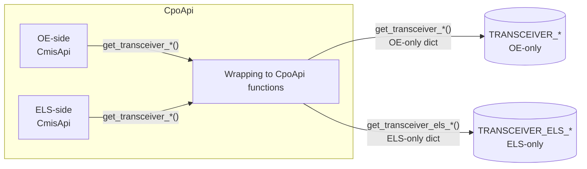
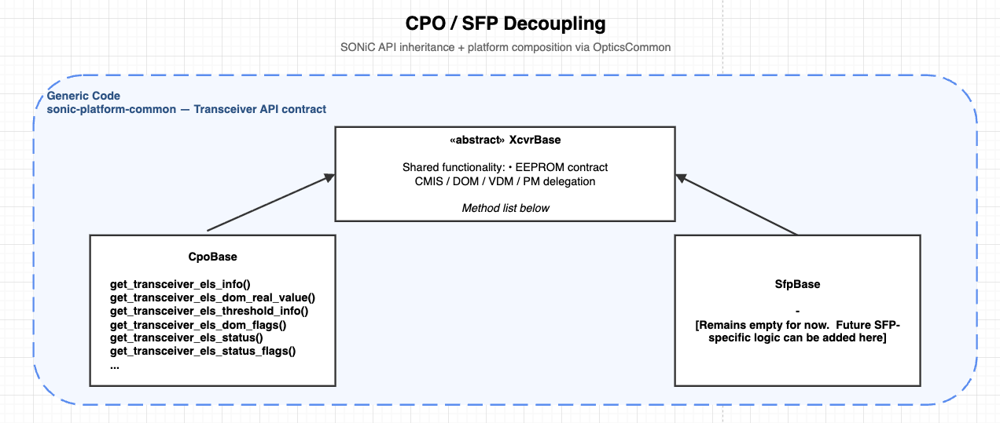
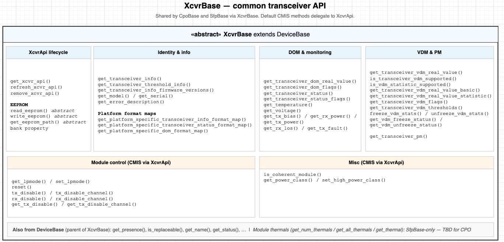

# DOM monitoring for CPO and transceiver API refactor

## 1. Revision

| Rev | Date       | Author        | Change Description |
| --- | ---------- | ------------- | ------------------ |
| 0.1 | 2026-06-16 | Natanel Gerbi | Initial version.   |

## 2. Scope

This HLD covers two related changes:

1. **STATE_DB schema split.** Split CPO telemetry so the legacy `TRANSCEIVER_*` tables carry **OE/Vmodule-only** data and a new
   parallel `TRANSCEIVER_ELS_*` family carries **ELS-only** data, both keyed by the same logical port.
2. **Transceiver API refactor in `sonic-platform-common`.** Introduce a shared abstract base class (`XcvrBase`) that owns the common
   transceiver API contract (EEPROM access, CMIS / DOM / VDM / PM delegation). `CpoBase` and `SfpBase` inherit from `XcvrBase`
   directly, so CPO is no longer modeled as a special case sitting on top of the SFP class.

## 3. Definitions

| Term | Definition |
| ---- | ---------- |
| CPO  | Co-Packaged Optics |
| OE   | Optical Engine|
| ELS  | External Laser Source|
| CMIS | Common Management Interface Specification |

## 4. Background

## 5. Design

**what we are proposing:**

- **Two `CmisApi` backends** inside `CpoApi`, one bound to the OE and one bound to the ELS.
- **Two STATE_DB table families.** The OE backend feeds the existing `TRANSCEIVER_*` tables (now OE-only); the ELS backend feeds a new
  parallel `TRANSCEIVER_ELS_*` family. Same logical-port row key on both sides.



### 5.1 STATE_DB schema

Two parallel table families, keyed by the same logical port. The legacy `TRANSCEIVER_*` family is OE-only; the new `TRANSCEIVER_ELS_*` family is ELS-only.

**Legacy `TRANSCEIVER_*` family — OE-only:**

| Table                       |
| --------------------------- |
| `TRANSCEIVER_INFO`          |
| `TRANSCEIVER_DOM_SENSOR`    |
| `TRANSCEIVER_DOM_FLAG`      |
| `TRANSCEIVER_DOM_THRESHOLD` |
| `TRANSCEIVER_STATUS`        |
| `TRANSCEIVER_STATUS_FLAG`   |

**New `TRANSCEIVER_ELS_*` family — ELS-only:**

| Table                             |
| --------------------------------- |
| `TRANSCEIVER_ELS_INFO`            |
| `TRANSCEIVER_ELS_DOM_SENSOR`      |
| `TRANSCEIVER_ELS_DOM_FLAG`        |
| `TRANSCEIVER_ELS_DOM_THRESHOLD`   |
| `TRANSCEIVER_ELS_STATUS`          |
| `TRANSCEIVER_ELS_STATUS_FLAG`     |

For non-CPO ports the new ELS tables are never populated.

### 5.2 Data sample

Two rows for the same logical port after a poll cycle on a CPO module.

**OE-only — legacy table -** TRANSCEIVER_DOM_SENSOR:

```
TRANSCEIVER_DOM_SENSOR | Ethernet0  →  {
    temperature        : "47.5",
    voltage            : "N/A", # Not relevant for OE - set N/A
    tx1power..tx8power : "-2.310", ...,
    rx1power..rx8power : "-3.115", ...,
    tx1bias..tx8bias   : "N/A", ..., # Not relevant for OE - set N/A
    laser_temperature  : "N/A", # Not relevant for OE - set N/A
}
```

**ELS-only — new table -** TRANSCEIVER_**ELS**_DOM_SENSOR:

```
TRANSCEIVER_ELS_DOM_SENSOR | Ethernet0  →  {
    temperature                : "32.8",
    voltage                    : "3.3000",
    icc                        : "0.4200",
    bias_current_monitor1..8   : "85.0", ...,
    opt_power_monitor1..8      : "1.230", ...,
    voltage_monitor1..8        : "3.295", ...,
    laser_mpd1..8              : "1.50", ...,
    tec_voltage_laser1..8      : "0.85", ...,
    power_consumption          : "8.4",
}
```

### 5.3 Class hierarchy

A new abstract class `CpoBaseApi` is introduced between `CmisApi` and the new `CpoApi`. `CpoBaseApi` declares the new ELS aggregator methods
(`get_transceiver_els_*()`) — one per new `TRANSCEIVER_ELS_*` table.
 `CpoBaseApi` also serves as the **capability marker**: `xcvrd` (see §5.4) detects the need to populate the ELS tables with a single `isinstance(api, CpoBaseApi)` check, without needing to know about the `CpoApi` class itself.

```python
class CpoBaseApi(CmisApi):
    """Abstract. Inherits the full CmisApi surface.
    Adds: ELS aggregator methods (declared, not implemented)."""
    @abstractmethod
    def get_transceiver_els_info(self):
        pass

    @abstractmethod
    def get_transceiver_els_dom_real_value(self):
        pass

    # ... one per new TRANSCEIVER_ELS_* table
```

`CpoApi` is the implementation of `CpoBaseApi`. It holds **two `CmisApi` instances** — one bound to the **OE**, one bound to the
**ELS** — both implementing the standard `CmisApi` contract (`get_transceiver_*()`); `CpoApi` routes each call to the relevant
backend so its result lands in the right STATE_DB table.

```python
class CpoApi(CpoBaseApi):
    """Inherits the CmisApi surface and the ELS surface from CpoBaseApi.
    Adds: two CmisApi backends + routing (see below)."""
    def __init__(self, optical_engine_xcvr_api, external_laser_source_xcvr_api):
        self.optical_engine_xcvr_api = optical_engine_xcvr_api          # OE backend
        self.external_laser_source_xcvr_api = external_laser_source_xcvr_api  # ELS backend
```

Routing inside `CpoApi` (one method shown per side; the rest follow
the same shape on their respective backends):

- **OE -** the legacy `get_transceiver_*()` methods are thin pass-throughs to the **same legacy `get_transceiver_*()` methods** on the **OE
  backend** → feed the legacy `TRANSCEIVER_*` tables.

```python
class CpoApi(CpoBaseApi):
    # OE side: legacy CmisApi method → OE backend → legacy table.
    def get_transceiver_dom_real_value(self):
        return self.optical_engine_xcvr_api.get_transceiver_dom_real_value()
```

- **ELS -** the new `get_transceiver_els_*()` methods are thin pass-throughs to the **same legacy `get_transceiver_*()` methods** on the **ELS
  backend** → feed the new `TRANSCEIVER_ELS_*` tables.

```python
class CpoApi(CpoBaseApi):
    # ELS side: new CpoBaseApi method → ELS backend's SAME legacy
    # CmisApi method → new TRANSCEIVER_ELS_* table.
    def get_transceiver_els_dom_real_value(self):
        return self.external_laser_source_xcvr_api.get_transceiver_dom_real_value()
```

### 5.4 `xcvrd` integration

`xcvrd`'s DOM info update task (`dom_mgr.DomInfoUpdateTask`) has two entry points that touch STATE_DB: the periodic write path
(`task_worker` → per-port `post_port_*` writers) and the delete path (`on_remove_logical_port`). Both are extended with the same
**capability gate**, `isinstance(api, CpoBaseApi)`:

- **Write path** — for every CPO port, in addition to today's  `post_port_*` writers, call each `get_transceiver_els_*()` method on
  the api and write its dict to the matching `TRANSCEIVER_ELS_*`  table. Non-CPO ports skip these calls entirely.

> *Illustrative only — not the real code. Used to show the conceptual
> shape of the change; the actual code uses `post_port_*_to_db`
> helpers around these api calls.*

```python
def task_worker(self):
    ...
    for physical_port, logical_ports in self.port_mapping.physical_to_logical.items():
        ...
        api = self.xcvr_obj_dict[physical_port].get_xcvr_api()

        # --- existing OE-side, unchanged ---
        oe_dom_sensor = api.get_transceiver_dom_real_value()   # → TRANSCEIVER_DOM_SENSOR
        oe_dom_flags  = api.get_transceiver_dom_flags()        # → TRANSCEIVER_DOM_FLAG
        ...

        # --- NEW: ELS-side, gated on the capability ---
        if isinstance(api, CpoBaseApi):
            els_dom_sensor = api.get_transceiver_els_dom_real_value()  # → TRANSCEIVER_ELS_DOM_SENSOR
            els_dom_flags  = api.get_transceiver_els_dom_flags()       # → TRANSCEIVER_ELS_DOM_FLAG
            # ... one (api.get_transceiver_els_*() → TRANSCEIVER_ELS_* table) per family
```

- **Delete path** — for every CPO port, in addition to today's list of legacy `TRANSCEIVER_*` tables, also drop the corresponding
  `TRANSCEIVER_ELS_*` rows. Non-CPO ports drop only the legacy rows (today's behavior).

```python
def on_remove_logical_port(self, port_change_event):
    asic_id = port_change_event.asic_id

    # --- existing legacy table list, unchanged ---
    tables_to_clear = [
        self.xcvr_table_helper.get_dom_tbl(asic_id),
        self.xcvr_table_helper.get_dom_flag_tbl(asic_id),
        ...
    ]

    # --- NEW: also drop the parallel ELS rows for CPO ports ---
    api = self.xcvr_obj_dict[port_change_event.port_index].get_xcvr_api()
    if isinstance(api, CpoBaseApi):
        tables_to_clear += [
            self.xcvr_table_helper.get_els_dom_tbl(asic_id),
            self.xcvr_table_helper.get_els_dom_flag_tbl(asic_id),
            # ... one per TRANSCEIVER_ELS_* table
        ]

    common.del_port_sfp_dom_info_from_db(port_change_event.port_name,
                                         self.port_mapping,
                                         tables_to_clear)
```

Non-CPO ports are bit-for-bit identical to today: the `isinstance(api, CpoBaseApi)` check is false, the new branches are
skipped, and no `TRANSCEIVER_ELS_*` row is ever created.

## 6. Transceiver API refactor (`XcvrBase`)



