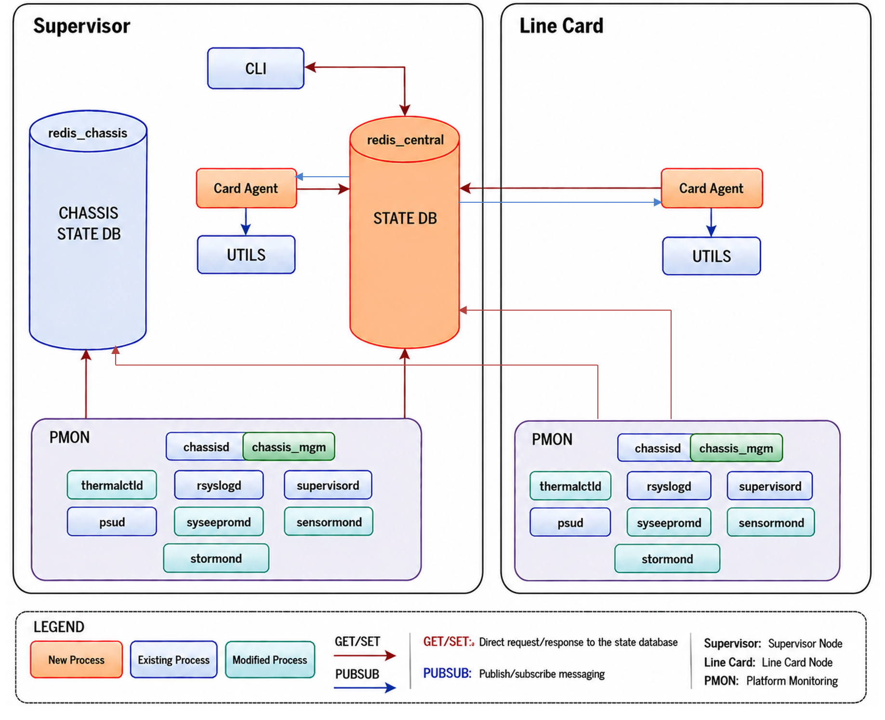
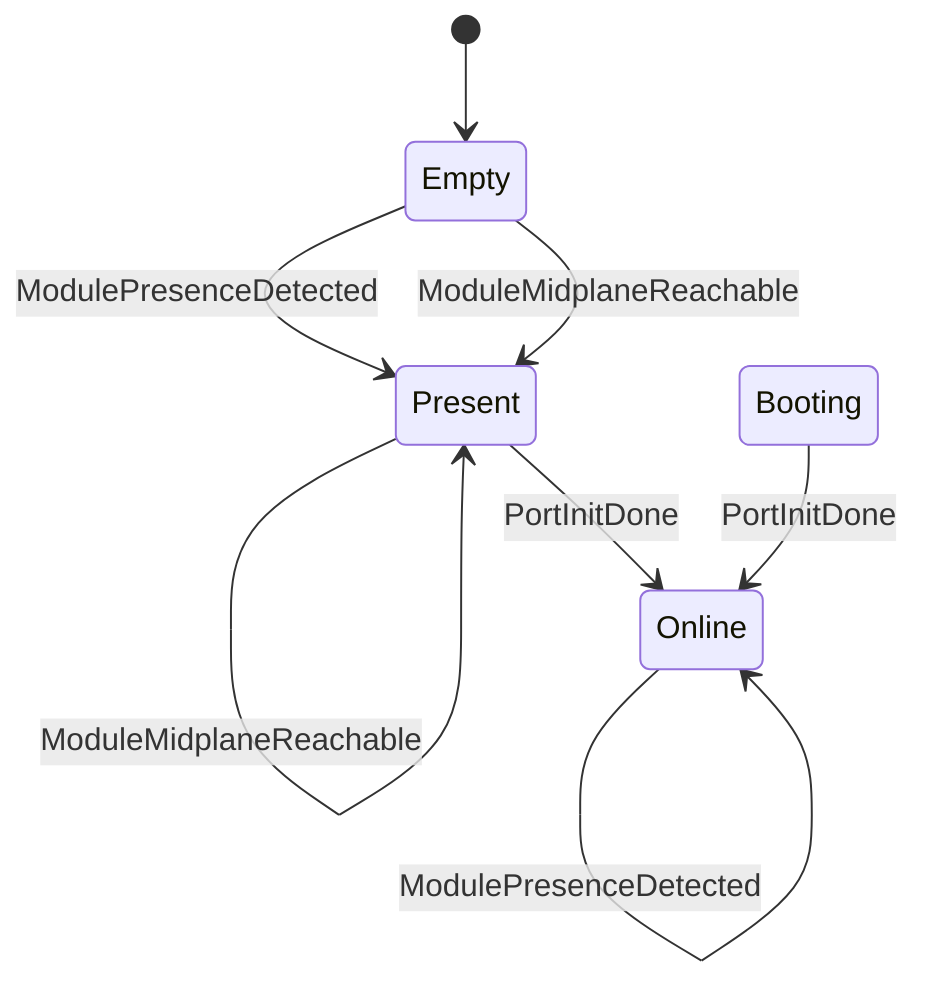
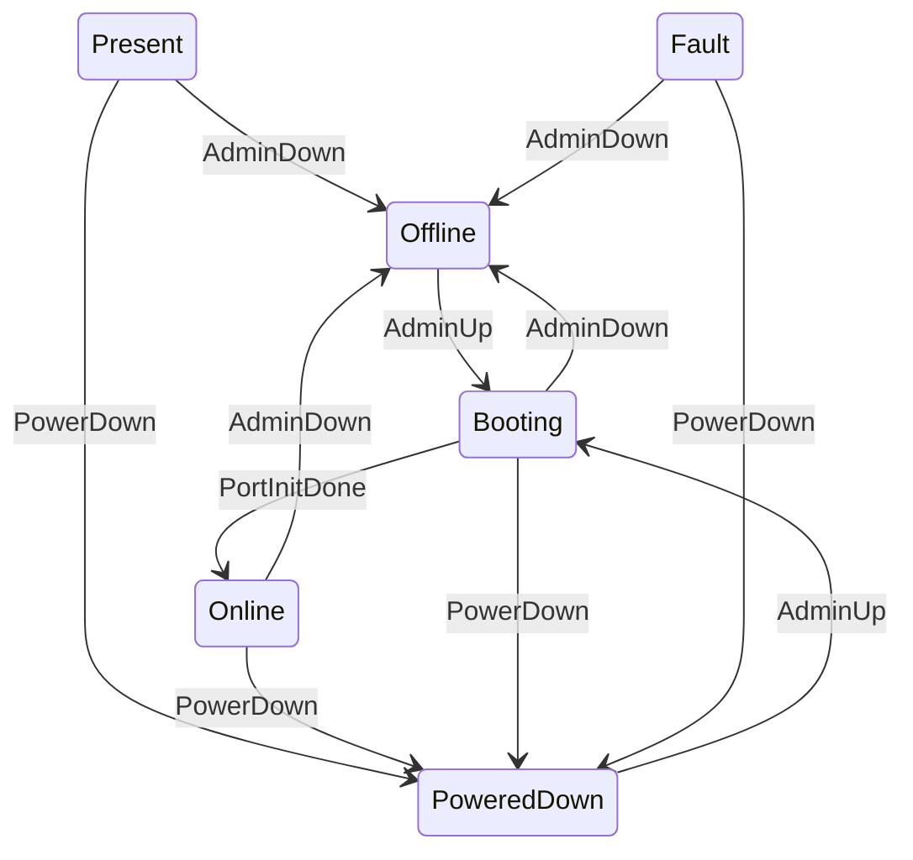
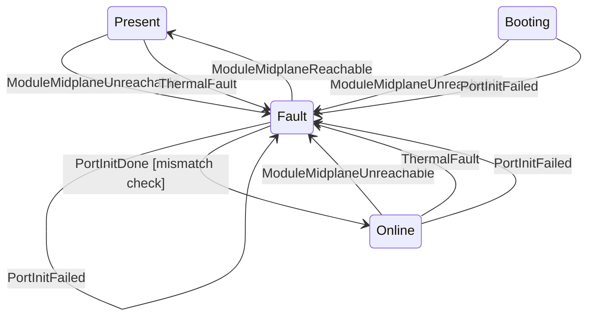
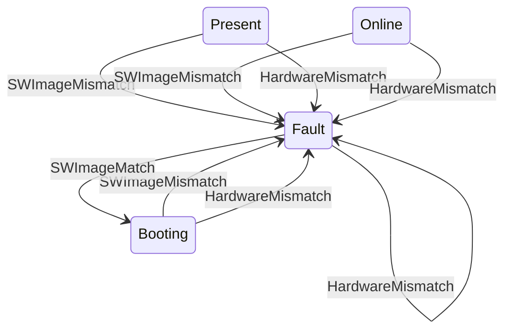
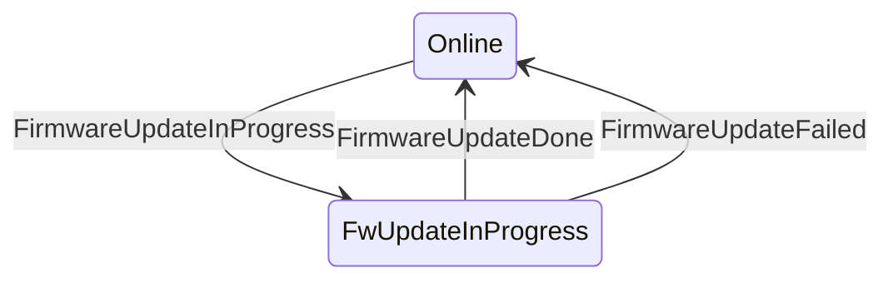
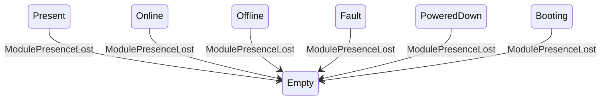
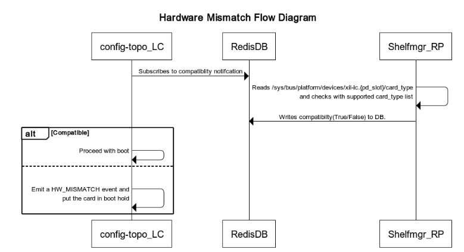
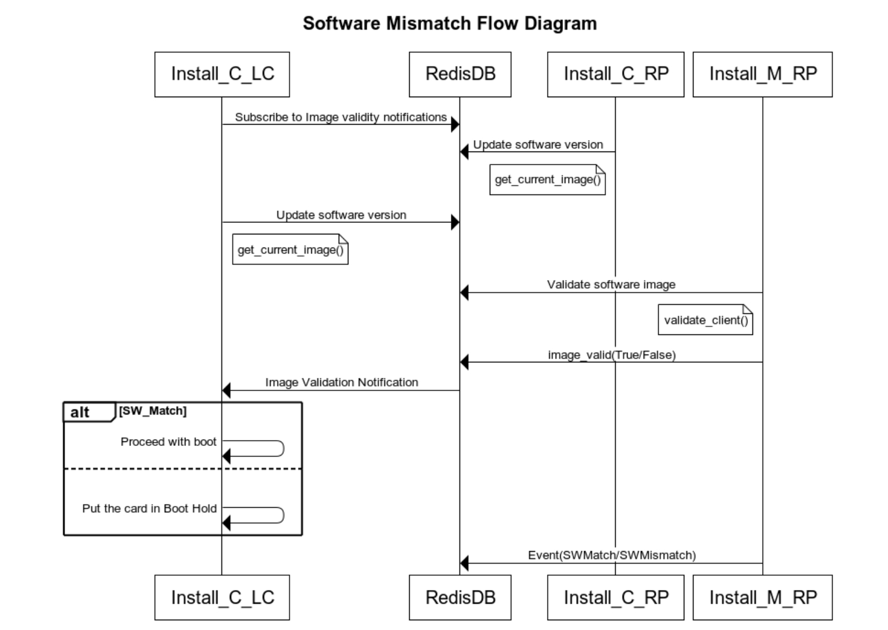

# SONiC Centralized Chassis Platform Management & Monitoring #

### Rev 0.1 ###

# Table of Contents

  * [Revision](#revision)
  * [About this Manual](#about-this-manual)
  * [Scope](#scope)
  * [Acronyms](#acronyms)
  * [1. Overall Architecture / Design](#1-overall-architecture--design)
    * [1.1 Problem Statement](#11-problem-statement)
    * [1.2 Functional Requirements](#12-functional-requirements)
    * [1.3 Chassis Platform Stack](#13-chassis-platform-stack)
      * [1.3.1 Process Model](#131-process-model)
      * [1.3.2 Data Model](#132-data-model)
  * [2. Event Infrastructure](#2-event-infrastructure)
  * [3. chassis-db-init](#3-chassis-db-init)
  * [4. chassisd](#4-chassisd)
    * [4.1 Card State Machine](#41-card-state-machine)
    * [4.2 Hardware Mismatch Detection](#42-hardware-mismatch-detection)
    * [4.3 Software Mismatch Detection](#43-software-mismatch-detection)
    * [4.4 Platform State Policy Management](#44-platform-state-policy-management)
  * [5. sensormond](#5-sensormond)
  * [6. thermalctld](#6-thermalctld)
  * [7. syseepromd](#7-syseepromd)
  * [8. Firmware Management](#8-firmware-management)
  * [9. ledd](#9-ledd)
  * [10. xcvrd](#10-xcvrd)
  * [11. healthd](#11-healthd)
  * [12. stormond](#12-stormond)
  * [13. psud](#13-psud)
  * [14. CLI Commands](#14-cli-commands)
  * [15. Review Comments](#15-review-comments)
    * [15.1 Future Items](#151-future-items)

### Revision ###

 | Rev |     Date    |                    Author                    | Change Description                |
 |:---:|:-----------:|:--------------------------------------------:|-----------------------------------|
 | 0.1 | 06/12/2026  | Chanabasappa Gundapi<br>Shravan Upadhyaya<br>Huan Lee | Initial version                   |

# About this Manual
This document provides design requirements and changes required for platform management stack for SONiC on VOQ centralized chassis with line-card CPUs.

# Scope
In the first phase of design, this document covers high-level platform management design in centralized VOQ chassis environment. The document assumes all line-cards and supervisor-cards have a CPU complex where SONiC would be running. It assumes CPU-less fabric-cards or even if CPU is available, that SONiC isn't running on fabric-cards.

# Acronyms
* RP - Route Processor (Supervisor)
* LC - Line Card
* FC - Fabric Card
* PMON - Platform Monitoring
* NPU - Network Processing Unit
* DB - Database
* CLI - Command Line Interface

## 1. Overall Architecture / Design
Overall centralized architecture is a prerequisite for this design.
Refer to the [Centralized Architecture HLD](https://github.com/huanlev/SONiC/blob/f4c462700e6b89532f39e7e199b95745320366bc/doc/centralized-chassis/voq_chassis_hld.md) for the overall centralized chassis architecture.

### 1.1 Problem Statement

The existing SONiC modular chassis model is distributed: each line card runs a full SONiC instance with its own management, routing, control-plane, platform-management, and data-plane orchestration services. This makes each line card look like an independently managed router, which increases duplicated services, configuration surfaces, and operational complexity.
Centralized VOQ chassis changes the service ownership model. The Supervisor / Route Processor (RP) is the chassis-wide owner of control and management operations, including external management access, configuration, routing/control-plane services, chassis inventory, module lifecycle management, firmware orchestration, and operator-facing platform commands.
Line cards remain SONiC-capable modules, but their role is focused on the data plane. A line card runs the local multi-ASIC data-plane stack needed to program and monitor its ASICs, including `orchagent`, `syncd`, SAI, ASIC-local databases, and local platform daemons required for sensors, transceivers, LEDs, thermals, and health reporting. Line-card services publish local state to the supervisor and execute supervisor-directed actions, but they do not expose an independent external management or control-plane surface.
This PMON centralized design defines how platform-management services are divided across that architecture: RP-hosted services provide chassis-wide control, policy, aggregation, and operator interfaces, while line-card services provide local data-plane orchestration and hardware telemetry for their own slot / ASIC namespaces. Fabric cards are assumed to be CPU-less, or to not run SONiC in this phase. 

### 1.2 Functional Requirements
The requirements below capture the key areas required to operate a centralized VOQ chassis.

* All functional requirements defined in the PMON chassis design remain applicable, except for line card management connectivity. Line cards shall NOT have external management connectivity.
* The supervisor shall use the existing Redis Pub/Sub channel to send action requests (for example, reboot and firmware upgrade) to line cards.
* The supervisor shall maintain the card state machine and determine card operational status based on received events.
* The supervisor shall prevent unsupported line cards from booting.
* The supervisor shall prevent line cards running an incompatible software version from booting.
* The supervisor shall track and monitor the status of all actions executed on line cards (for example, reboot and firmware upgrade).
* The supervisor-hosted Chassisd shall perform platform-specific recovery actions as defined by the hardware vendor.
* Line cards push all the required data to central DB running on the supervisor.
* Line cards can be reached from the supervisor via the mid-plane using internal IP addresses.

### 1.3 Chassis Platform Stack
* sonic_platform_base/chassis_base.py to have is_centralized_chassis() to be implemented by vendors.
```
    def is_centralized_chassis(self):
```
* sonic_py_common/device_info.py shall support the is_chassis_centralized() API which can read the platform env file to return true/false.
This API can be used by applications that are not aware of the chassis object.
```
  def is_chassis_centralized():
```
#### 1.3.1 Process Model



* All PMON daemons will continue to work as-is to update the STATE-DB with required info except chassisd.
* Chassisd on the supervisor shall manage all the line card states.

Card Agent:
* Acts as a proxy which subscribes to STATE_DB of central Redis DB for CARD_EVENT channel.
* CARD_EVENT channel will be used to convey actions on the card, such as firmware upgrade, LED set, etc.
* Processes these messages and takes appropriate actions for the local card by calling the required scripts/utils.

Chassis_mgmt:
* Python package which manages all the functionality of the current modular chassis.
* Monitors the state of each line card through event subscription and drives the state machine.
* It performs recovery of modules in the case of failures.


#### 1.3.2 Data Model
* PMON daemons shall continue to publish data to STATE_DB; however, in centralized systems, STATE_DB shall reside on the supervisor's central Redis instance.
* PMON daemons shall include `<MODULE_NAME>` in the database key when writing/reading to and from STATE_DB.
* PMON daemons shall support the hierarchical port naming scheme: `Ethernet<slot_number>_<port_number>`.
* PMON daemons shall filter database notifications based on the module name when processing data on centralized platforms.
* STATE_DB is preferred over CHASSIS_STATE_DB for the following reasons: 
  * Applications can continue writing to STATE_DB without modification, as the DB connector abstracts the underlying Redis instance.
  * A centralized STATE_DB enables a unified database schema across all SONiC platform form factors, simplifying application development and maintenance.


## 2. Event Infrastructure
* A common event framework shall be provided for services and daemons to publish module lifecycle events to STATE_DB.
* An API shall be exposed through the sonic_py_common.event_base class to simplify event publication.
* The event_base class shall maintain a per-module event history in STATE_DB, with a configurable upper limit of 200 events per module.
* chassisd shall subscribe to relevant events from STATE_DB and use them to drive the module state machine.
* sonic_platform_base.module_base shall be extended to define the standard set of module event names that platform vendors can generate and publish.
Snippet of the module_base.py which has event definitions.
```
    # Module event is ModulePresenceDetected when module presence is detected
    MODULE_EVT_PRESENCE_DETECTED  = "ModulePresenceDetected"
    # Module event is ModulePresenceLost when module presence is lost
    MODULE_EVT_PRESENCE_LOST  = "ModulePresenceLost"
    # Module event is ModuleMidplaneReachable when module is reachable via midplane
    MODULE_EVT_MIDPLANE_REACHABLE  = "ModuleMidplaneReachable"
    # Module event is ModuleMidplaneUnreachable when module is not reachable via midplane
    MODULE_EVT_MIDPLANE_UNREACHABLE  = "ModuleMidplaneUnreachable"
    # Module event is HardwareMismatch if module is not supported on a given platform
    MODULE_EVT_HW_MISMATCH  = "HardwareMismatch"
    # Module event is SWImageMismatch if RP and LC image versions are different
    MODULE_EVT_SW_MISMATCH  = "SWImageMismatch"
    # Module event is SWImageMatch if RP and LC SW versions match
    MODULE_EVT_SW_MATCH  = "SWImageMatch"
    # Module event is FirmwareUpdateInProgress when module is updating the firmware.
    MODULE_EVT_FW_UPGD_IN_PROGRESS  = "FirmwareUpdateInProgress"
    # Module event is FirmwareUpdateFailed when firmware update on the module is failed.
    MODULE_EVT_FW_UPGD_FAILED  = "FirmwareUpdateFailed"
    # Module event is FirmwareUpdateDone when firmware update on the module is successful.
    MODULE_EVT_FW_UPGD_DONE  = "FirmwareUpdateDone"
    # Module event is PortInitDone when system ports are ready (line cards: APPL_DB PORT_TABLE;
    # fabric cards: same event when FABRIC_PORT_TABLE in STATE_DB reports completion for the module ASICs)
    MODULE_EVT_PORT_INIT_DONE  = "PortInitDone"
    # Module event is PortInitFailed if any of the port initialization fails on any namespace(debugging only)
    MODULE_EVT_PORT_INIT_FAILED  = "PortInitFailed"
    # Module event is Powerdown if user requested power down
    MODULE_EVT_POWER_DOWN  = "PowerDown"
    # Module event is AdminDown if user requested admin down
    MODULE_EVT_ADMIN_DOWN  = "AdminDown"
    # Module event is AdminUp if user requested admin up
    MODULE_EVT_ADMIN_UP  = "AdminUp"
  ```

```
def update_event(self, module_name, evt_name, evt_source, evt_description=None):
        """
        Update module event information to CHASSIS_MODULE_EVENT table in STATE-DB.
        """

def get_last_event(self, module_name):
        """
        This method retrieves the most recent event information for the specified
        module from the CHASSIS_MODULE_EVENT table.
        """
```
DB Schema:
* **DB Instance:** `redis_chassis.server[6381]`
* **Partition:** `STATE_DB`
```
  "CHASSIS_MODULE_EVENT|FABRIC-CARD5": {
    "expireat": 1781289038.655516,
    "ttl": -0.001,
    "type": "hash",
    "value": {
      "description": "At least one asic is up",
      "event_name": "PortInitDone",
      "module_name": "FABRIC-CARD5",
      "source": "chassisd",
      "timestamp": "2026-06-12 18:22:22.725 UTC"
    }
  },

  "CHASSIS_MODULE_EVENT_HISTORY|SUPERVISOR0": {
    "expireat": 1781289038.6555202,
    "ttl": -0.001,
    "type": "list",
    "value": [
      "{\"module_name\": \"SUPERVISOR0\", \"event_name\": \"SWImageMatch\", \"timestamp\": \"2026-06-12 18:16:42.310 UTC\", \"source\": \"install_manager\", \"description\": \"Image version matched\"}",
      "{\"module_name\": \"SUPERVISOR0\", \"event_name\": \"ModulePresenceDetected\", \"timestamp\": \"2026-06-12 18:20:42.744 UTC\", \"source\": \"chassisd-detection\", \"description\": \"Presence detected\"}",
      "{\"module_name\": \"SUPERVISOR0\", \"event_name\": \"PortInitDone\", \"timestamp\": \"2026-06-12 18:22:16.805 UTC\", \"source\": \"chassisd\", \"description\": \"At least one fabric asic is up\"}"
    ]
  },

```

## 3. chassis-db-init
chassis_db_init is a one-shot utility launched by PMON during startup and retains its existing behavior.
In a centralized architecture, it populates STATE_DB.CHASSIS_INFO in the supervisor's central Redis instance with module-specific keys (`<MODULE_NAME>`), containing the static platform information required by commands such as show platform summary.
```
{
  "CHASSIS_INFO|SUPERVISOR0": {
    "expireat": 1781210253.4680336,
    "ttl": -0.001,
    "type": "hash",
    "value": {
      "asic_count": "0",
      "asic_type": "cisco-8000",
      "hwsku": "Cisco-8808-SI",
      "model": "8800-RP-O",
      "platform": "x86_64-88_si_chassis",
      "revision": "0.12",
      "serial": "PCBPCWWMNEE",
      "switch_type": "voq"
    }
  }
}
```

## 4. chassisd
chassisd shall be implemented as part of the chassis_mgmt package, avoiding additional centralized-platform-specific logic in the existing standalone chassisd script.

* SONiC currently defines a set of module states for chassis components. The set will be extended to include a few new states.
```
    MODULE_STATUS_BOOTING = "Booting"
    MODULE_STATUS_FW_UPD_IN_PROGRESS = "FwUpdateInProgress"
```

* New events shall be added to ModuleBase to serve as triggers for module state transitions.
* An API shall be provided through sonic_py_common to enable services running on the host or within containers to publish events to STATE_DB.
* chassisd running on the supervisor shall subscribe to these events and use them to drive the module state machine.
* Client applications shall be able to subscribe to STATE_DB to monitor changes in module operational status.
* Platform vendors shall be able to define recovery actions for specific module failure and timeout conditions.
* chassisd shall detect and act on both hardware incompatibilities (unsupported line cards) and software version mismatches between line cards and the supervisor.

### 4.1 Card State Machine
The diagrams below depict the high-level state machine. Note that the state machine is split into multiple logical diagrams for better visualization.

#### 1. Insertion & initial boot
Focus states: `Empty`, `Present`, `Online`.


2. Admin & power control
Focus states: Offline, PoweredDown (exit), Booting (re-entry pivot)


3. Operational faults & recovery
Focus states: Fault (sticky), Online (recovery target)


4. SW / HW mismatch & image-match recovery
Focus states: Fault (sticky), Booting (recovery via image match)

5. Firmware update
Focus states: Online, FwUpdateInProgress


6. Module removal
Focus state: Empty


### 4.2 Hardware Mismatch Detection
The hardware mismatch feature ensures that, upon line card (LC) insertion, the supervisor verifies whether the LC hardware type is supported by the platform. If the card type is not in the platform's supported hardware list, a hardware mismatch event is generated. The line card is then placed in a boot-hold state, prevented from completing the boot process, and may subsequently be shut down based on platform policy.

* **RP** — `shelfmgr.service` (RP-only) reads each LC's `card_type` from sysfs (`/sys/bus/platform/devices/xil-lc.<pd_slot>/card_type`), compares it against the platform's supported-cards list, and publishes the verdict to `STATE_DB` as `LC_SUPPORT_INFO|LC{pi_slot}` = `OK` or `FAIL`.
chassis.py shall be extended to return the list of supported cards for a given vendor platform. This list shall be used by shelfmgr.service during hardware compatibility validation.
```
def get_supported_cards(self):
    """
    Return supported line card types for this chassis platform.
    Returns:
        list: list of the supported cards by the platform
    """ 
```


* **LC** — during `config-topology.service` startup the LC polls `LC_SUPPORT_INFO|LC{pi_slot}` until the RP populates it. On `OK` the boot hold is released; on `FAIL` a hardware-mismatch event is raised and the LC remains held until the RP powers it down.

### 4.3 Software Mismatch Detection
The software mismatch feature ensures that a line card (LC) runs the same software image as the supervisor (RP). A software mismatch event is generated when an LC boots with an image version that differs from the RP image. This feature is configurable and can be enabled or disabled on a per-platform basis.

* **RP** — the chassis install manager compares the LC image version to the RP image. On match it publishes `SwImageMatch` and sends *pass* to the LC; on mismatch it raises `SwImageMismatch` and the state machine moves the LC to `Fault`.
* **LC** — the chassis install client is a systemd notify service, considered activated only after the RP sends *pass*. On match the LC proceeds past boot hold; on mismatch it stays held and the state-machine callback can download and install the matching image.



### 4.4 Platform State Policy Management
The chassis_mgmt framework allows platform vendors to define recovery actions for module failure and timeout scenarios.
Recovery policies are loaded during chassisd startup. If a platform does not provide custom recovery policies, chassisd shall use the default SONiC recovery actions.
Supported actions include log_info, log_warning, log_notice, reboot_module and power_down.
Example policy file (JSON):
```
{
  "metadata": {
    "platform": "cisco-8000",
    "version": "1.0",
    "description": "State machine action and timeout management for Cisco 8000 series",
    "_possible_actions": "log_info, log_warning, log_notice, reboot_module, power_down",
    "_timeout_value_units": "seconds"
  },
  "module_state_timeout_actions": {
    "Present": {
      "timeout": 180,
      "action": "log_warning",
      "message": "Module has not reached Online state within the expected time"
    },
    "Booting": {
      "timeout": 600,
      "action": "log_warning",
      "message": "Module boot is taking longer than expected"
    },
    "Fault": {
      "timeout": 0,
      "action": "reboot_module",
      "message": "Module entered Fault state; initiating recovery action"
    },
    "FwUpdateInProgress": {
      "timeout": 1800,
      "action": "log_notice",
      "message": "Firmware update has exceeded the expected completion time"
    }
  }
}
```

## 5. sensormond
The overall design for sensormond remains the same, except sensor data is updated to the central Redis instance with module name in the key.

* **DB Instance:** `redis_chassis.server[6381]`
* **Partition:** `STATE_DB`

LC and RP sensors — keys:

```
CURRENT_INFO|<MODULE_NAME>|<sensor_name>
VOLTAGE_INFO|<MODULE_NAME>|<sensor_name>
```

For RP-managed sensors on fabric cards — keys:

```
CURRENT_INFO|RP0|<FCn>_<sensor_name>
VOLTAGE_INFO|RP0|<FCn>_<sensor_name>
```

Example:
```
{
  "CURRENT_INFO|SUPERVISOR0|FC0_HOTSWAP_IIN": {
    "expireat": 1761082688.7976916,
    "ttl": -0.001,
    "type": "hash",
    "value": {
      "critical_high_threshold": "N/A",
      "critical_low_threshold": "N/A",
      "current": "6080",
      .
      .
    }
  }
}

{
  "VOLTAGE_INFO|LINE-CARD1|VP1P0_XGE": {
    "expireat": 1761082733.216871,
    "ttl": -0.001,
    "type": "hash",
    "value": {
      "critical_high_threshold": "N/A",
      "critical_low_threshold": "N/A",
      .
      .
    }
  }
}
```
## 6. thermalctld
Overall thermal cooling algorithm remains distributed, as on the modular chassis. The changes will be with respect to the DB schema while updating the required temperature sensors to the DB.
The thermal control daemon shall fetch all the required temperature sensors according to the new schema for PWM calculations.

* `THERMAL_ALGO` already has the module name and hence shall be reused.
* ASIC temperature sensors will be pushed to central DB, instead of per-ASIC DB, and will have slot and NPU.
* `PHYSICAL_ENTITY_INFO` shall have module_name in the key.
* In centralized mode the central STATE-DB carries `TEMPERATURE_INFO`, `THERMAL_INFO` and `PHYSICAL_ENTITY_INFO` entries for every card, so each thermalctld instance must filter subscription events on the `<MODULE_NAME>` portion of the key before processing.
* LC thermalctld processes only the `LINE-CARD<n>` keys for its own slot; RP thermalctld processes `SUPERVISOR<n>` keys plus the `RP0|<FCn>_*` fabric-card sensors it manages.
* The shared `TempUpdater` / `ThermalUpdater` base classes shall accept a module allow-list (derived from `device_info.get_hostname()` / slot) and drop unmatched keys early, before any PWM or threshold evaluation.

* DB Instance: `redis_chassis.server[6381]`
* Partition: `STATE_DB`
LC and RP sensors — keys:
```
TEMPERATURE_INFO|<MODULE_NAME>|<sensor_name>
```

For RP-managed sensors on fabric cards — keys:

```
TEMPERATURE_INFO|RP0|<FCn>_<sensor_name>
```

Example:
```
  "TEMPERATURE_INFO|LINE-CARD0|X86_CORE_3_T": {
    "expireat": 1781136677.095212,
    "ttl": -0.001,
    "type": "hash",
    "value": {
      "critical_high_threshold": "105.0",
      "critical_low_threshold": "-10.0",
      .
      .
    }
  },

"ASIC_TEMPERATURE_INFO|RP0|asic11|": {
    "expireat": 1778105871.7578347,
    "ttl": -0.001,
    "type": "hash",
    "value": {
      "average_temperature": "42",
      "maximum_temperature": "44",
      "temperature_0": "39",
      .
      .
    }
  },
 "ASIC_TEMPERATURE_INFO|0|asic2|": {
    "expireat": 1778105871.7577698,
    "ttl": -0.001,
    "type": "hash",
    "value": {
      "average_temperature": "58",
      "maximum_temperature": "62",
      "temperature_0": "58",
      .
      .
    }
  },
```

#### Physical Entity Info
* **DB Instance:** `redis_chassis.server[6381]`
* **Partition:** `STATE_DB`

Keys:
```
PHYSICAL_ENTITY_INFO|<MODULE_NAME>|<Entity_name>
PHYSICAL_ENTITY_INFO|<MODULE_NAME>|FC_<Entity_name>
```

Example:
```
  "PHYSICAL_ENTITY_INFO|LINE-CARD1|X86_PKG_TEMP": {
    "expireat": 1781123052.179014,
    .
    .
    }
  "PHYSICAL_ENTITY_INFO|SUPERVISOR0|FC0_BRD_OVER_TEMP1": {
    "expireat": 1781123052.1791534,
    .
    .
    }
```

## 7. syseepromd
syseepromd does not require any additional changes for centralized platforms except the DB schema changes while updating the DB.

* **DB Instance:** `redis_chassis.server[6381]`
* **Partition:** `STATE_DB`
```
  "EEPROM_INFO|LINE-CARD1|TlvHeader": {
    "expireat": 1781198589.0327568,
    "ttl": -0.001,
    "type": "hash",
    "value": {
      "Id String": "TlvInfo",
      "Total Length": "98",
      "Version": "1"
    }
  },
  "EEPROM_INFO|SUPERVISOR0|0x21": {
    "expireat": 1781198589.032679,
    "ttl": -0.001,
    "type": "hash",
    "value": {
      "Len": "7",
      "Name": "Product Name",
      "Value": "8800-RP"
    }
  }
  ```

## 8. Firmware Management
SONiC already supports manual and automatic firmware upgrades. As platforms add FPGA and related components, those devices are listed in platform.json.
For the first time, the card agent running on each card updates the STATE-DB with firmware info.
The card agent running on each card subscribes to the CARD_EVENT channel for any firmware upgrade commands.
The fwutil update command will be extended with a "location" keyword which shall update the firmware on the intended card.
In the current design, firmware information is not stored in any database. Hence, a new table will be introduced.

* **DB Instance:** `redis_chassis.server[6381]`
* **Partition:** `STATE_DB`
Key:
```
FIRMWARE_INFO_TABLE|<module_name>:<component_name>
```
```
Example:
{
  "FIRMWARE_INFO_TABLE|LINE-CARD1:Aldrin": {
    "expireat": 1777064163.9386604,
    "ttl": -0.001,
    "type": "hash",
    "value": {
      "description": "Marvell - Aldrin Ethernet switch",
      "firmware_path": "/opt/cisco/fpd/sf_mod_lc_aldrin_upgrade.img",
      "status": "up-to-date",
      "update_status": "no-active-update",
      "version_available": "1.4",
      "version_current": "1.4"
    }
  }
}
```
## 9. ledd
ledd subscribes to APP_DB:PORT_TABLE to control front-panel port LEDs. In a centralized VOQ chassis, all line card port entries are present in a shared, chassis-wide APP_DB, causing each line card's ledd instance to receive notifications for ports across the entire chassis.

To address this, ledd shall apply slot-based filtering and process only the port updates that belong to its local line card. This approach is consistent with other SONiC chassis-aware services that operate on chassis-wide data while acting only on locally relevant resources.

## 10. xcvrd
* For centralized platforms, port naming follows the hierarchical format `Ethernet<slot_number>_<port_number>` (ex: `Ethernet0_2`). Due to this port naming convention, `TRANSCEIVER_INFO`, `TRANSCEIVER_DOM_SENSOR`, `TRANSCEIVER_DOM_THRESHOLD`, `TRANSCEIVER_STATUS`, `TRANSCEIVER_PM` and `TRANSCEIVER_FIRMWARE_INFO` do not require any change while updating.
* Any port update from STATE-DB, APP-DB and CONFIG-DB to xcvrd is for all the ports. Before processing the event, slot filtering has to be done for centralized platforms to avoid unnecessary processing/updates. `PortChangeObserver` shall be modified for the same.

## 11. healthd

* Each module shall continue to run its own healthd instance, performing periodic health checks, controlling the module status LED, and publishing health information to the central STATE_DB.
* To support multiple modules sharing a centralized database, each healthd instance shall associate its data with the local module name and update only its own database entries, ensuring isolation between modules.
* Unlike the current modular chassis implementation, where only failures are stored in the local STATE_DB and health data is collected on demand by the CLI, the centralized architecture shall persist complete health information in the central STATE_DB under the SYSTEM_HEALTH_INFO table using module-specific keys. This allows CLI commands to retrieve health information directly from the database without querying each module.

```
{
  "SYSTEM_HEALTH_INFO|LINE-CARD0|Services": {
    "expireat": 1781215284.6951854,
    "ttl": -0.001,
    "type": "hash",
    "value": {
      "apm": "Not OK|Service|Container 'apm' is not running",
      "arp_update_checker": "OK|Program",
      "container_checker": "Not OK|Program|container_checker is not Status ok",
      "container_eventd": "OK|Program",
      "container_memory_bmp": "OK|Program",
      "container_memory_gnmi": "OK|Program",
      "container_memory_snmp": "OK|Program",
      "controlPlaneDropCheck": "OK|Program",
      "database:redis": "OK|Process",
      "database:redis_bmp": "OK|Process",
      "dhcp_relay": "Not OK|Service|Container 'dhcp_relay' is not running",
      "diskCheck": "OK|Program",
      "dualtorNeighborCheck": "OK|Program",
      "memory_check": "OK|Program",
      "mgmtOperStatus": "Not OK|Program|mgmtOperStatus is not Status ok",
      "pmon": "Not OK|Service|Container 'pmon' is not running",
      "root-overlay": "OK|Filesystem",
      "routeCheck": "Not OK|Program|routeCheck is not Status ok",
      "rsyslog": "OK|Process",
      "sonic": "OK|System",
      "var-log": "OK|Filesystem",
      "vnetRouteCheck": "OK|Program"
    }
  },
  "SYSTEM_HEALTH_INFO|LINE-CARD0|Summary": {
    "expireat": 1781215284.6952245,
    "ttl": -0.001,
    "type": "hash",
    "value": {
      "last_update": "2026-06-11T22:00:42.870510+00:00",
      "led": "red_blink",
      "summary": "Not OK"
    }
  },
    "SYSTEM_HEALTH_INFO|SUPERVISOR0|Hardware": {
    "expireat": 1781215724.3224316,
    "ttl": -0.001,
    "type": "hash",
    "value": {
      "fantray0.fan0": "OK|Fan",
      .
      .

    }
  },
}
```

## 12. stormond
No functional changes are required in stormond. The only change is to include the module name in the database key when publishing data to STATE_DB to support the centralized chassis database schema.
```
  "STORAGE_INFO|LINE-CARD0|sda": {
    "expireat": 1781197876.4890335,
    "ttl": -0.001,
    "type": "hash",
    "value": {
      "device_model": "Micron_5300_MTFDDAV240TDS",
      "disk_io_reads": "55723",
      "disk_io_writes": "359348",
      "firmware": "XC311132",
      .
      .
    }
  }

```
Currently, `show platform ssdhealth` does not use this data for CLI, instead it uses the util functions directly.
Any management interface (CLI/GNMI/Telemetry) fetching the data from DB has the trade-off of data staleness up to default daemon_polling_interval which defaults to 1 hour.

## 13. psud
No changes are required for centralized platforms.

## 14. CLI Commands

This section captures the CLIs that were extended to include a location (module) filter, the CLIs whose output format changed, and the new CLIs added for the centralized chassis. Wherever a per-module view is supported, the command accepts `-l <module>` and the same short labels (`LC0`, `LC1`, `RP0`, …) used elsewhere in the chassis.
Scripts in sonic-utilities shall be modified to filter on a per-location basis and also read from the central Redis DB as applicable.

### Command summary

| Command | Purpose |
|---|---|
| `show chassis modules state-transitions` | Per-module state-machine transitions (optionally `-l`) |
| `show chassis modules event-history` | Per-module event log (optionally `-l`) |
| `show chassis modules state-policy` | Timeouts and logging actions per state |
| `show chassis modules install-status` | SONiC image current/next, validation, and install status per module |
| `show chassis modules install-history` | Install history status per module |
| `show platform summary` | Per-module platform, SKU, ASIC, serial, model, hardware rev, switch type |
| `show platform current` | Per-location current sensor readings (mA); optional `-l` filter |
| `show platform voltage` | Per-location voltage sensors (mV); optional `-l` filter |
| `show platform temperature` | Per-location temperature sensors; optional `-l` filter |
| `show platform syseeprom` | TlvInfo system EEPROM contents per module; optional `-l` filter |
| `show platform firmware status` | Installed firmware versions per component by location; optional `-l` |
| `show platform firmware updates` | Upgrade image paths, version compare, and status; optional `-l` |
| `show system-health summary` | Per-module system status LED, service summary, and hardware status; optional `-l` filter |
| `show system-health detail` | Per-module system health summary plus per-service / per-device monitor list; optional `-l` filter |
| `show reboot-cause` | Per-module last reboot cause, timestamp, and user; optional `-l` filter |
| `show reboot-cause history` | Per-module reboot-cause history with cause, time, user, and comment; optional `-l` filter |

### `show chassis modules state-transitions`

Recent state-machine transitions per module — source, destination, trigger, UTC timestamp. Without `-l` it iterates all modules; with `-l LC0` it filters to a single module.

```text
admin@siVoq8808:~$ show chassis modules state-transitions -l LC0
State Transitions for LINE-CARD0:
Source    Destination    Trigger                  Timestamp
--------  -------------  -----------------------  ---------------------------
Present   Online         PortInitDone             2026-04-22 00:34:56.599 UTC
Fault     Present        ModuleMidplaneReachable  2026-04-22 00:33:21.134 UTC
Empty     Present        ModulePresenceDetected   2026-04-22 00:26:37.134 UTC
```

### `show chassis modules event-history`

Per-module event log: event name, source component, description, UTC timestamp.

```text
admin@siVoq8808:~$ show chassis modules event-history -l LC1
Event History for LINE-CARD1:
Event                      Source              Description              Timestamp
-------------------------  ------------------  -----------------------  ---------------------------
PortInitDone               chassisd            At least one asic is up  2026-04-22 00:38:06.575 UTC
SWImageMatch               install_manager     Image version matched    2026-04-22 00:37:50.478 UTC
ModuleMidplaneReachable    chassisd            Midplane reachable       2026-04-22 00:36:50.665 UTC
ModulePresenceDetected     chassisd-detection  Presence detected        2026-04-22 00:26:37.133 UTC
```

### `show chassis modules state-policy`

Per-state timeout and the syslog-style action taken if the timeout is hit.

```text
admin@siVoq8808:~$ show chassis modules state-policy
Sonic Defaults: False
State                 Timeout (seconds)  Action
------------------  -------------------  -----------
Present                             900  log_notice
Booting                             600  log_warning
Offline                            3600  log_notice
Fault                              1800  log_notice
FwUpdateInProgress                 1800  log_notice
```

### `show chassis modules install-status` / `install-history`

`install-status` reports any in-flight install and a per-module table of current/next SONiC image version, validity, module status and validation status. `install-history` is the per-module record of past installs.

```text
admin@siVoq8808:~$ show chassis modules install-status
No install operations found.
+-------------+-----------------------------------------------+-----------------------------------------------+-------+--------+-------------------+
| Name        | Current-Image-Ver                             | Next-Image-Ver                                | Valid | Status | Install-Status    |
+=============+===============================================+===============================================+=======+========+===================+
| LINE-CARD0  | SONiC-OS-c-master.39330-dirty-20260409.011615 | SONiC-OS-c-master.39330-dirty-20260409.011615 | true  | active | validation passed |
| SUPERVISOR0 | SONiC-OS-c-master.39330-dirty-20260409.011615 | SONiC-OS-c-master.39330-dirty-20260409.011615 | true  | active | validation passed |
+-------------+-----------------------------------------------+-----------------------------------------------+-------+--------+-------------------+
```

### `show platform summary`

Hardware/software identity per module: platform name, HwSKU, ASIC, ASIC count, serial, model, hardware rev, switch type.

```text
admin@siVoq8808:~$ show platform summary
Module       Platform              HwSKU          ASIC        ASIC Count    Serial Number    Model Number    Hardware Revision    Switch Type
-----------  --------------------  -------------  ----------  ------------  ---------------  --------------  -------------------  -------------
SUPERVISOR0  x86_64-88_si_chassis  Cisco-8808-SI  cisco-8000  0             PCBXHNWKANE      8800-RP-O       0.12                 voq
LINE-CARD0   x86_64-88_si_chassis  Cisco-8808-SI  cisco-8000  3             PCBNIADR8PK      88-LC0-36FH-O   0.21                 voq
```

### `show platform current` / `show platform voltage` / `show platform temperature`

Per-location sensor readings (mA / mV / °C), warning/critical thresholds, warning flag and timestamp. Output is grouped by `Location:` (e.g. `LINE-CARD0`, `SUPERVISOR0`); `-l <module>` restricts the output to one location. The three commands share the same table shape — only the units and threshold columns differ.

```text
admin@siVoq8808:~$ show platform temperature -l SUPERVISOR0
Location: SUPERVISOR0
                        Sensor    Temperature    High TH    Low TH    Crit High TH    Crit Low TH    Warning          Timestamp
------------------------------  -------------  ---------  --------  --------------  -------------  ---------  -----------------
                Control_Sensor           25.0       45.0      -5.0            48.0          -10.0      False  20260410 21:12:09
            FC0_BRD_OVER_TEMP1           25.0      130.0      -5.0           135.0          -10.0      False  20260410 21:11:21
                    Inlet_Temp           25.0       45.0      -5.0            48.0          -10.0      False  20260410 21:12:09
                   Outlet_Temp           25.0       85.0      -5.0            90.0          -10.0      False  20260410 21:12:09
     PSUTRAY0.PSU0 Outlet_Temp         28.961       67.0      -5.0            70.0          -10.0      False  20260410 21:11:10
```

### `show platform syseeprom`

Decoded TlvInfo system-EEPROM contents per module. With `-l LC0` the header reads `Module: LC0` while the content is the same as `LINE-CARD0`.

```text
admin@siVoq8808:~$ show platform syseeprom -l LC0
================================================================================
Module: LC0
================================================================================
TlvInfo Header:
   Id String:    TlvInfo
   Version:      1
   Total Length: 100
TLV Name             Code      Len  Value
-------------------  ------  -----  -----------------------
Product Name         0x21       13  88-LC0-36FH-O
Serial Number        0x23       11  PCBNIADR8PK
Base MAC Address     0x24        6  78:F3:94:ED:88:00
Platform Name        0x28       23  x86_64-88_lc0_36fh_o-r0
Vendor Name          0x2D        5  Cisco
CRC-32               0xFE        4  0x46E4196C
(checksum valid)
```

### `show platform firmware status` / `show platform firmware updates`

`firmware status` lists installed component versions and descriptions, grouped by `Location:` (`RP`, `LINE-CARD0`, …). `firmware updates` adds the packaged image path, the *current / available* version compare, and whether an update is required.

```text
admin@siVoq8808:~$ show platform firmware updates -l LINE-CARD1
Location: LINE-CARD1
Component    Firmware Path                                                     Version      Status
-----------  ----------------------------------------------------------------  -----------  ------------------
Aikido       /opt/cisco/fpd/x86fpga/sf_mod_lc_exeter_v_x86_aikido_upgrade.img  0.33 / 1.43  update is required
BIOS         /opt/cisco/fpd/spf-bios-upgrade.img                               9.5 / 1.201  update is required
Aldrin       /opt/cisco/fpd/sf_mod_lc_aldrin_upgrade.img                       0.0 / 1.4    update is required
```

### `show system-health summary`

Per-module system health rollup: status LED, service summary (running and not running), and hardware status. With `-l <module>` the output is filtered to a single module.

```text
show system-health summary -l LC0

================================================================================
Module: LINE-CARD0
================================================================================
Data age: 52 seconds

System status summary

  System status LED  red_blink
  Services:
    Status: Not OK
    Not Running: container_checker, dhcp_relay, mgmtOperStatus, routeCheck, swss-central
  Hardware:
    Status: OK
```

### `show system-health detail`

Same rollup as `show system-health summary`, plus a per-service / per-device monitor list with Name, Status, and Type. With `-l <module>` the output is filtered to a single module.

```text
show system-health detail -l LC0
Data age: 59 seconds

System status summary

  System status LED  red_blink
  Services:
    Status: Not OK
    Not Running: container_checker, dhcp_relay, mgmtOperStatus, routeCheck, swss-central
  Hardware:
    Status: OK

System services and devices monitor list

Name                    Status    Type
----------------------  --------  ----------
container_checker       Not OK    Program
dhcp_relay              Not OK    Service
mgmtOperStatus          Not OK    Program
.
.
```
### `show reboot-cause`

Per-module last reboot cause: module name, reboot timestamp, cause, time, and user who initiated the reboot. With `-l <module>` the output is filtered to a single module.

```text
show reboot-cause -l LC0
Device      Name                 Cause                   Time                             User
----------  -------------------  ----------------------  -------------------------------  ------
LINE-CARD0  2026_06_15_23_21_07  reboot from Supervisor  N/A                              N/A
```

### `show reboot-cause history`

Per-module reboot-cause history: each row reports the module, reboot timestamp, cause, time, user, and comment. With `-l <module>` the output is filtered to a single module.

```text
admin@siVoq8808:~$ show reboot-cause history -l SUPERVISOR0
Device       Name                 Cause                   Time                             User    Comment
-----------  -------------------  ----------------------  -------------------------------  ------  ---------
SUPERVISOR0  2026_06_15_23_33_09  Kernel Panic            Mon Jun 15 11:26:39 PM UTC 2026  N/A     N/A
SUPERVISOR0  2026_06_15_23_21_07  reboot                  Mon Jun 15 11:06:31 PM UTC 2026  cisco
.
.
```

## 15. Review Comments

### 15.1 Future Items
Items that are out of scope of this HLD will need to be taken up in the future. As part of the review, the following items were identified:

* Automatic upgrade of firmware with install operation
* Firmware upgrade of third-party vendor
* Integration of chassisd with Fault Management modules
* SW mismatch detection enable/disable feature by config knob
* Document the behavior of SW mismatch / HW mismatch in the case of centralized and non-centralized images.
* Support for attention LED
