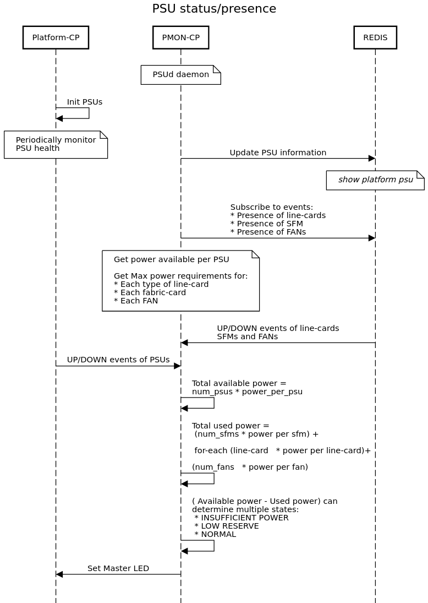
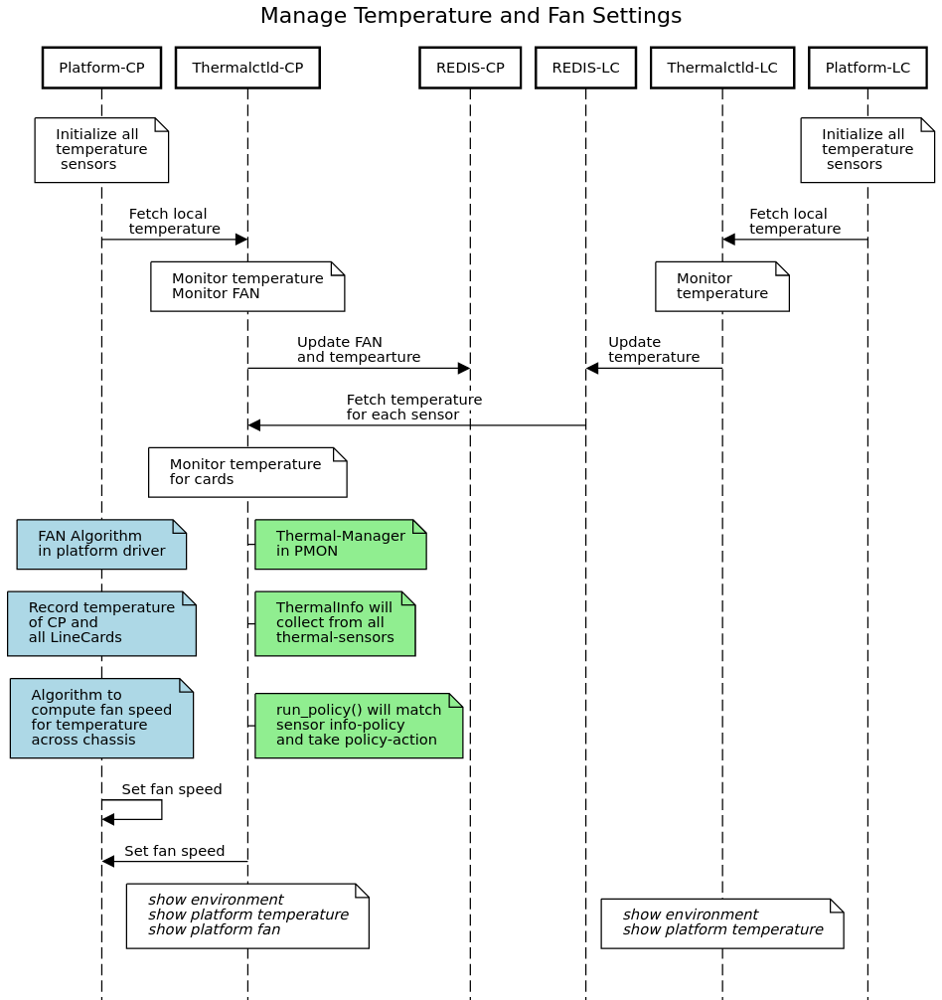

# SONiC Chassis Platform Management & Monitoring #

### Rev 1.1 ###

# Table of Contents

  * [Revision](#revision)
  * [About this Manual](#about-this-manual)
  * [Scope](#scope)
  * [Acronyms](#acronyms)
  * [1. Modular VOQ Chassis Reference](#1-modular-voq-chassis-reference)
  * [2. SONiC Platform Management and Monitoring](#2-sonic-platform-management-and-monitoring)
    * [2.1 Functional Requirements](#21-functional-requirements)
    * [2.2 Chassis Platform Stack](#22-chassis-platform-stack)
  * [3. Detailed Workflow](#3-detailed-workflow)
    * [3.1 Chassis Boot Process](#31-chassis-boot-process)
      * [3.1.1 Supervisor Boot Process](#311-supervisor-boot-process)
      * [3.1.2 Linecard Boot Process](#312-linecard-boot-process)
    * [3.2 Chassis Platform Management](#32-chassis-platform-management)
      * [3.2.1 Midplane Ethernet](#321-midplane-ethernet)
      * [3.2.2 Chassis Monitoring and ChassisD](#322-chassis-monitoring-and-chassisd)
      * [3.2.3 Chassis Local Sonic Image Hosting Service](#323-chassis-local-sonic-image-hosting-service)
      * [3.2.4 Disaggregated vs Global DB](#324-disaggregated-vs-global-db)
    * [3.3 Peripheral Management](#33-peripheral-management)
      * [3.3.1 PSUd](#331-psud)
      * [3.3.2 Thermalctld](#332-thermalctld)
      * [3.3.3 Xcvrd/SFP](#333-xcvrdsfp)
      * [3.3.4 LEDd](#334-ledd)
      * [3.3.5 Syseepromd](#335-syseepromd)
      * [3.3.6 Midplane Ethernet](#336-midplane-ethernet)
  * [4. Review Comments](#4-review-comments)
    * [4.1 Future Items](#41-future-items)
      
### Revision ###

 | Rev |     Date    |       Author                                                            | Change Description                |
 |:---:|:-----------:|:-----------------------------------------------------------------------:|-----------------------------------|
 | 1.0 |             |  Manjunath Prabhu, Sureshkannan Duraisamy, Marty Lok, Marc Snider       | Initial version                   |
 | 1.1 | 06/18/2021  |  Vedavinayagam Ganesan                                                  | chassis_modules command change    |

# About this Manual
This document provides design requirements and interactions between platform drivers and PMON for SONiC on VOQ chassis with line-card CPUs.

# Scope
In the first phase of design, this document covers high level platform support and its interactions with PMON in a VOQ chassis environment. Design or support of operations like firmware upgrade will be added in the next stage of the development. Items that are out of scope are listed at the end of this document. The document assumes all line-cards and supervisor-cards have a CPU complex where SONiC would be running. It assumes CPU-less fabric-cards or even if CPU is available, that SONiC isn't running on fabric-cards. Also, it assumes that line-cards can't be powered on without the Supervisor being operationally up and running. 

# Acronyms
Control Card - Supervisor Card of the Chassis

PSU - Power Supply Unit

SFM - Switch Fabric Module

Platform Stack - Set of Processes, Daemons, Dockers implementing functional requirements of a platform & its perpherals. (i.e PMON docker, Thermalctld, Database docker, etc)

Management Stack - Set of Processes, Daemons, Dockers implementing management interface of chassis, line-card and per-asic. (i.e CLI, SNMP, DHCP, etc). 

Control Plane Stack - Set of Processes, Daemons, Dockers implementing control plane protocols suchs as BGP, EVPN and also providing complete APP/ASIC DB Orchestration(OrchAgent).

Datapath Stack - Set of Processes, Daemons, Dockers, APIs implementing datapath ASIC hardware programming via SAI interface.

PMON - Platform Monitor. Used in the context of Platform monitoring docker/processes.

## 1. Modular VOQ Chassis Reference
The below picture shows reference of VOQ chassis highlevel hardware architecture. Chassis has 1 or 2 supervisor cards, 1 or more line-cards and 1 or more switch fabric-cards. It also has 1 or more FAN tray, 1 or more PSUs and midplane ethernet. In general, the Supervisor manages the perpherals like fan, psu, midplane ethernet, etc.


## 2. SONiC Platform Management and Monitoring
### 2.1. Functional Requirements
At a functional level of a chassis, SONiC will manage supervisor-cards, line cards and all other peripheral devices of the chassis as required by chassis platform vendor specification. Below requirements capture some of the key areas required to operate a VOQ chassis. 

* Chassis supervisor-cards & line-cards should be able to boot using ONIE or any vendor specific boot method. 
* Line-cards should be managed via the Supervisor to support operations like power up/down, get operational status.
* In a typical chassis, the Supervisor manages the fan speed based on various temperature sensors readings from line-cards and a chassis.
* The Supervisor monitors PSUs of the chassis. 
* LEDs and Transceivers are present on line-cards and can be managed via line-card's SONiC platform instances. 
* Some of these perpherals are plug-able and hot-swap capable.
* In general, VOQ chassis has midplane ethernet which interconnects line-cards and supervisor together for its internal communication. This should be initalized upon platform booting and can be used as IP connectivity between supervisor, line-cards.
* Each line-card will have management interface either directly to external management interface or via internal midplane ethernet.

### 2.2. Chassis Platform Stack
In a modular disaggregated SONiC software architecture, each line-card will run an instance of SONiC platform stack and the Supervisor would run its own instance of SONiC platform stack. Each line-card resources are manged as independent fixed platform and also providing all the above functional requirements to operate the chassis. Below picture describes high level view of the platform stack.


* Each line-card & supervisor-card will have its own ONIE_PLATFORM string to differentiate between each other and also variation of it.
* The Supervisor wont run any protocol stack except SWSS, SyncD dockers for managing Switch Fabric.
* Each line-card & supervisor-card would run one instance of PMON container. 
* Each line-card & supervisor-card would run one instance of redis server for common platform monitoring (host network) and also uses per-asic redis for SFP monitoring.
* The supervisor-card & line-card could communicate over midplane ethernet. In order to provide this IP connectivty between supervisor & line card, midplane ethernet drivers are run on host network namespace. 
* Each line-card & supervisor-card gets IP address (internal network) assigned to this midplane ethernet based on slot information.
* The supervisor-card PMON will have all sensors readings via either fetching line-card redis servers(subscribe to multiple servers) or global redis db on the Supervisor(publish to single server). 
* SONiC on a fixed platform has put together PMON 2.0 API's for platform vendors to implement peripheral drivers (kernel or userspace). Most of the existing PMON 2.0 API's will be used for chassis and some key changes and enhancments required as detailed below.
* The supervisor-card will provide driver implementation to obtain line-card status such as present, empty.

## 3. Detailed Workflow
### 3.1 Chassis Boot Process
    
SONiC supports ONIE as a boot method and also provides vendor specific boot method. In either boot method, the Supervisor of chassis will be booted first and followed by line-card. For first phase of design, it assumes that the Supervisor should be operationally ready before line-cards to boot. This is important because some of the sensors and fan settings are managed by the Supervisor and it has to set with correct values when line-cards are running to make chassis healthy and avoid over heating.
    
#### 3.1.1 Supervisor Boot Process
    
Supervisor card can be booted using ONiE method. Upon boot, unique ONIE_PLATFORM string will be provided in a ONIE firmware to differentiate the cards and services/dockers it could start via systemd-generator. In case of supervisor card, there wont be dockers like BGP, LLDP, etc started. This service list is included as part of platform specific service list file.

```
    device/
|-- <VENDOR_NAME>/
|   |-- <ONIE_PLATFORM_STRING>/
|   |   |-- <HARDWARE_SKU>/
|   |   |   |-- port_config.ini
|   |   |   |-- sai.profile
|   |   |   |-- xxx.config.bcm
|   |   |-- default_sku
|   |   |-- fancontrol
|   |   |-- installer.conf
|   |   |-- platform_env.conf
|   |   |-- led_proc_init.soc
|   |   |-- platform_reboot
|   |   |-- pmon_daemon_control.json
|   |   |-- sensors.conf
|   |   |-- asic.conf 
|   |   |-- services.conf [NEWFILE]
```

```
sonic-buildimage/device/nokia/x86_64-nokia_ixr7250_36x400g-r0$ cat asic.conf
NUM_ASIC=1
HW_TYPE=IOM
sonic-buildimage/device/nokia/x86_64-nokia_ixr7250_36x400g-r0$
```

#### 3.1.2 Linecard Boot Process
Line-card boot process is very similar to the Supervisor and main difference is services that is started on line-card will include protocol dockers such BGP, LLDP, etc. Also, SyncD docker will started for VOQ ASIC instead of SF ASIC.

### 3.2 Chassis Platform Management

#### 3.2.1 Midplane Ethernet
In a typical modular modern chassis includes a midplane ethernet to interconnect the Supervisor & line-cards. This is new component (peripheral?) needs to be added to SONiC. This document proposes midplane ethernet as platform perpherical management and captures the design as follows. 

* Upon line-card or the Supervisor booted and part of its initialization, midplane ethernet gets initialized. 
* Slot number is generally used in assigning an IP address to these interfaces.

In order to allow direct access to line-cards from outside of the chassis over external management network, chassis midplane ethernet network and external management networks needs to be connected to each other. There are couple of options to consider. 

1. Supervisor can create virtual switch (linux bridge) and all add midplane ethernet and external management interface on this bridge. This is the L2 mode of operation but internal communication and external L2 stations traffic will be seen inside this midplane ethernet. 
2. IP Routing: Midplane ethernet could be configured with externally reachable network (announced via any routing protocols), this requires mgmt interface on the Supervisor to run routing protocol which isn't common deployment. 
3. Statically assigned externally reachable management IP address per line-card via chassis-d and use NAT to map external/internal midplane IP address. In this case, internal midplane ethernet traffic wont be seen in a external management network and only direct communication allowed using NAT rules. 

Allowing DHCP relay or DHCP client on these internal midplane ethernet aren't considered for first phase of the design. 

Approach 1 will be the preferred approach. The external management and midplane ethernet networks will be isolated.

#### 3.2.2 Chassis Monitoring and ChassisD

Modular Chassis has supervisors, line-cards and fabric-cards along with other peripherals. The different types of cards have to be managed and monitored. 

#### Functional Requirements

* Identify a central entity that has visibility of the entire chassis.
* Monitor the status of the line-card, fabric-card etc using new PMON 2.0 APIs. The assumption is that each vendor will have platform drivers or implementation to detect the status of the cards in the chassis.
* The status will need to be stored in REDIS DB.
* PMON processes can subscribe to UP/DOWN events of these cards.
* The UP/DOWN events will be added to syslog. 
* Vendor-specific API will be provided to take action on any change event.

#### State-DB Schema

The schema for CHASSIS_MODULE_TABLE in State DB is:
```
key                                   = CHASSIS_MODULE_INFO | <card index>; 
; field                               = value
name                                  = STRING                          ; name of the card
instance                              = 1*2DIGIT                        ; slot number in the chassis for cards
status                                = "Empty" | "Online" | "Offline"  ; status of the card
device-type                           = "SUPERVISOR"| "LINE-CARD" | "FABRIC-CARD"    ; card-type
```

#### Prototype Code
The line-card status update will happen in the main monitoring loop. In src/sonic-platform-daemons/sonic-chassisd/scripts/chassisd:
```
class DaemonChassisd(DaemonBase):

    # Connect to STATE_DB and create linecard/chassis info tables
    state_db = daemon_base.db_connect(swsscommon.STATE_DB)
    linecard_tbl = swsscommon.Table(state_db, LINECARD_INFO_TABLE)

    # Start main loop
    logger.log_info("Start daemon main loop")

    while not self.stop.wait(LINECARD_INFO_UPDATE_PERIOD_SECS):
        linecard_db_update(linecard_tbl, num_linecard)

    logger.log_info("Stop daemon main loop")
```

The existing ModuleBase class is modified to represent line-cards in a chassis. In src/sonic-platform-common/sonic_platform_base/module_base.py:

```
class ModuleBase(device_base.DeviceBase):
        
    def get_name(self):
    
    def get_description(self):
    
    def get_slot(self):

    def get_status(self):
    
    def reboot_slot(self):
    
    def set_admin_state(self, state): # enable or disable
```

Additionally, `get_change_event()` can be implemented to handle asynchronous notification of the line-card UP/DOWN events.

#### Configuration
Configuration will be provided to administratively bring down a line-card or fabric-card. This can be further extended to other components of the chassis like PSUs and FANs.

```
Configuration to administratively bring down the module
#config chassis modules shutdown <module_name>

Configuration to remove the adminstrative down state of module
#config chassis modules startup <module_name>
```
#### Config-DB Schema
The schema for CHASSIS_MODULE table in Config DB is:
```
key                                   = CHASSIS_MODULE | LINE-CARD<index>            ;//SUPERVISOR-CARD or FABRIC-CARD are other options 
; field                               = value
admin-status                          = "up" | "down"                                ; admin-status
```

#### Show command
A new show command is introduced to show the status of the modules in a chassis

**show chassis modules status**
```
        Name                      Description    Physical-Slot    Oper-Status    Admin-Status
------------  -------------------------------  ---------------  -------------  --------------
FABRIC-CARD0                             SFM1               17          Empty              up
FABRIC-CARD1                             SFM2               18          Empty              up
FABRIC-CARD2                             SFM3               19          Empty              up
FABRIC-CARD3                             SFM4               20          Empty              up
FABRIC-CARD4                             SFM5               21         Online              up
FABRIC-CARD5                             SFM6               22          Empty              up
  LINE-CARD0                imm36-400g-qsfpdd                1         Online              up
  LINE-CARD1                        line-card                2          Empty              up
  LINE-CARD2                        line-card                3          Empty              up
  LINE-CARD3  imm32-100g-qsfp28+4-400g-qsfpdd                4         Online              up
 SUPERVISOR0                         cpm2-ixr               16         Online              up

```
#### 3.2.3 Chassis Local Sonic Image Hosting Service

In some environments, the supervisor and the line-card may not necessarily have reachability to external networks. Linecards without external USB slot, could use the Supervisor as image server to download the SONiC image assuming the Supervisor will have external USB storage or internal storage hosting the images. We propose that chassisd on the Supervisor can be a place-holder for the sonic bootable images and run an http-server for image download by the line-cards. 

#### 3.2.4 Disaggregated vs Global DB

In a chassis environment, processes monitoring peripherals will need to have a view of the components across multiple cards. The requirement would be aggregate the data on the Supervisor. There are 2 options:

* Disaggregated DB - Each card updates to local REDIS-DB. Monitoring process will pull or subscribe to the table updates of each card.
* Global DB - Each card will updated their state to a line-card-table in the Global-DB


`Option 2` using the Global DB is the preferred approach for implementation.

### 3.3 Peripheral Management

Processes running ina the PMON container would differ based on the HWSKU. In the chassis, the Supervisor and Line-cards would be running a subset of the PMON processes. Existing control file */device/\<vendor\>/\<platform\>/\<hwsku\>/pmon\_daemon\_control.json* is used to start processes ina each of the cards. A new template */dockers/docker-platform-monitor/critical\_processes.j2* is introduced to dynamically generate the *critical\_processes* instead of current statically defined list.

#### 3.3.1 PSUd
PSUd in PMON will monitor the PSUs and maintain state in REDIS-DB. On a chassis, the PSUs are fully managed by the Supervisor. Currently, platform exposes APIs for PSUd to periodically query the PSU status/presence.

#### Functional Requirement
One of the functional requirement for chassis is to manage and monitor the power available vs power required. The total number of PSUs required is a function of number of line-card, SFMs and FANs. 

#### Proposal
*  PSUd will get the power-capacity of each PSU.
*  PSUd will calculate the total power capacity from power-capacity of each PSU multiplied by number of PSUs with valid status.
*  PSUd will get fixed maximum power requirements of each type of line-card, each SFM and each FAN.
*  PSUd will calculate the total power required as a sum total of power-required of each type of card multipled by maxium power requirement of that card.
*  PSUd will set a Master-LED state based on power available vs power required.

We do not see a requirement for real-time monitoring of current power usage of each card.




**show platform psustatus**
```
admin@sonic:~$ show platform psustatus
PSU    Status
-----  -----------
PSU 1  OK
PSU 2  OK
PSU 3  OK
PSU 4  NOT PRESENT
PSU 5  NOT PRESENT
PSU 6  NOT PRESENT
```

#### 3.3.2 Thermalctld
Thermalctld is monitoring temperatures, monitoring fan speed and allowing policies to control the fan speed.

#### Functional Requirement
1. There are multiple temperature sensors that need to be monitored. All these need to be available on the Supervisor.
    * Temperature sensors are on the Supervisor
    * Temperature sensors are on the line-card
    * Temperature sensors are on the SFMs.
2. All thermal sensor info should be available to the Supervisor.
3. The fan-control is limited to the Supervisor. The Fan algorithm could be implemented as part of thermal-policy or by the platform.



#### Proposal
1.  Chassisd notifies line-card up/down events to REDIS DB. These events can be subscribed by Thermalctld.
2.  All local temperatures sensors are recorded on both control and line-cards for monitoring. The Supervisor monitors temperature sensors of SFMs.
3.  Chassisd on Supervisor will periodically fetch/subscribe the thermal-sensors info from each of the line-cards. Alternatively, the thermalctld on line-card can directly update the DB on the Supervisor.
5.  The local-temperatures of the Supervisor, line-cards and fabric-cards are passed onto the fan-control algorithm.
6.  The fan-control algorithm can be implemented in PMON docker or in the platform-driver. 

Changes in thermalctld would follow one of the 2 approaches:
1. Have a TemperatureUpdater class for each line-card. Each of the updater class will fetch the values for all temperature senosors of the line-card from the REDIS-DB of the line-card and update the DB on the Supervisor.
2. The TemperatureUpdater class in each line-card will update the local-DB on its card as well as the global-DB on the Supervisor.

We have chosen to take Approach 2. A GLOBAL_STATE_DB will be added in the chassis-redis instance similar to the STATE_DB in the local-redis instance.

#### GLOBAL_STATE_DB Schema
```
key                                   = TEMPERATURE_INFO_<card-index> | <Sensor-Name>; 
; field                               = value
critical_high_threshold               = float;
critical_low_threshold                = float;   
high_threshold                        = float;
low_threshold                         = float;
maximum_temperature                   = float; //Maximum recorded temperature
minimum_temperature                   = float; //Minimum recorded temperature
temperature                           = float;

```
#### New APIs

2 additional APIs are introduced in src/sonic-platform-common/sonic_platform_base/thermal_base.py:
```
def get_maximum_recorded():
def get_minimum_recorded():
```
#### Code Modifications
In src/sonic-platform-daemons/sonic-thermalctld/scripts/thermalctld:

```
class TemperatureUpdater():
    def updater_per_slot(slot):
        # Connect to State-DB of given slot
        # Record all thermal sensor values
        self.chassis._linecard_list[index].set_thermal_info()

class ThermalMonitor(ProcessTaskBase):
    def __init__:
        if platform_chassis.get_supervisor_slot() == platform_chassis.get_my_slot():
            for card in platform_chassis.get_all_linecards():
                slot = card.get_slot()
                self.temperature_updater[slot] = TemperatureUpdater(chassis, slot)
        else
            slot = card.get_my_slot()
            self.temperature_updater = TemperatureUpdater(chassis, slot)
            
    def task_worker(self):
        while not self.task_stopping_event(wait_time):
            #Only on conntrol card
            if platform_chassis.get_supervisor_slot() == platform_chassis.get_my_slot():
                for updater in self.temperature_updater:
                    updater.update_per_slot(slot)
            else:
                self.temperature_updater.update()
```

The `thermal_infos.py` and `thermal_actions.py` will continue to be vendor specific. In the collect() function, the vendor will have information to all the sensors of the chassis. In platform/broadcom/<vendor>/sonic_platform/thermal_infos.py:

```
class ThermalInfo(ThermalPolicyInfoBase):
    def collect(self, chassis):
        #Vendor specific calculation from all available sensor values on chassis
```

There could be 2 approaches for where the Fan-Control algorithm could be implemented.

In approach-1, the thermal_policy.json can provide additional action to check if line-card temperature exceeded the threshold etc. The thermalctld.run_policy() will match the required condition and take the appropriate action to set fan speed.

In approach-2, the sensors information could be passed on the platform-driver which can then control the fan speed.

**show platform fan**
```
admin@sonic:~$ show platform fan
     FAN    Speed              Direction    Presence    Status          Timestamp
--------  -------  ---------------------  ----------  --------  -----------------
FanTray1      50%  FAN_DIRECTION_EXHAUST     Present        OK  20200429 06:11:16
FanTray2      50%  FAN_DIRECTION_EXHAUST     Present        OK  20200429 06:11:17
FanTray3      50%  FAN_DIRECTION_EXHAUST     Present        OK  20200429 06:11:18
```

**show platform temperature**
```
admin@sonic:~$ show platform temperature
   Sensor    Temperature    High TH    Low TH    Crit High TH    Crit Low TH    Warning          Timestamp
---------   -------------  ---------  --------  --------------  -------------  ---------  -----------------
Thermal 0        28           50         0             N/A            N/A        False     20200529 01:49:39
Thermal 1        37           50         0             N/A            N/A        False     20200529 01:49:39
Thermal 2        40           68         0             N/A            N/A        False     20200529 01:49:39
Thermal 3        45           68         0             N/A            N/A        False     20200529 01:49:39
Thermal 4        32           68         0             N/A            N/A        False     20200529 01:49:39
Thermal 5        59           68         0             N/A            N/A        False     20200529 01:49:39
```

#### 3.3.3 Xcvrd/SFP

#### Requirements
* Database connections per namespace - Database dockers run per namespace and PMON processes need to connect to each of these database instances. 
* Update per namespace port status - The pmon processes will need to run per-asic specific functinality ina a separate thread.

Two approaches were discussed as part of the design:
* Approach-1 - Existing process and threads will connect/subscribe to all databases across per-asic namespace. This is the preferred approach and has been documented in https://github.com/sonic-net/SONiC/blob/master/doc/pmon/pmon_multiasic_design.md.
* Approach-2 - Create separate threads per-asic and that thread will connect/subscribe to databases in per-asic namespace. Approach-2 is outlined below for the sake of completeness. However, it is not the preferred approach. The maximum number of ports seen in a multi-asic environment for fixed platform or for line-cards in a chassis would not be greater than 64. Monitoring and subscribing for events for these ports can easily be accommodated by Approach-1. Additional management of per-asic threads will also add to the complexity of the design.   

#### Database Connections

Below is a code snippet to introduce a new API *db_unix_connect*. In src/sonic-daemon-base/sonic_daemon_base/daemon_base.py:

```
def db_unix_connect(db, namespace):
    from swsscommon import swsscommon
    return swsscommon.DBConnector(db,
                                  REDIS_UNIX_SOCKET_PATH+str(namespace)+REDIS_UNIX_SOCKET_INFO,
                                  REDIS_TIMEOUT_MSECS)
```

Below is a code snippet to connect to State-DB. In src/sonic-platform-daemons/sonic-xcvrd/scripts/xcvrd:

```
 use_unix_sockets = False
 
 # Check if environment is multi-asic
 if check_multiasic():
    use_unix_sockets = True
    
 # Connect to STATE_DB and create transceiver dom/sfp info tables
 if not use_unix_sockets:
    state_db = daemon_base.db_connect(swsscommon.STATE_DB)
 else:
    state_db = daemon_base.db_unix_connect(swsscommon.STATE_DB, namespace)
```

#### Multi-thread support


Below is a code snippet to run namespace specific funtionality per thread. In src/sonic-platform-daemons/sonic-xcvrd/scripts/xcvrd:
```
  # Run daemon
    def run(self):
        logger.log_info("Starting up...")
        
        # Start daemon initialization sequence
        self.init()
        
        if num_asics == 1:
            use_unix_sockets = False
            self.run_per_asic(0)
        else:
            self.xcvrd_thread_list = []
            for i ina range(0, num_asics): #Number of Asics per pmon
                thread = threading.Thread(target=self.run_per_asic, args=(i,))
                thread.setName('Xcvrd Thread '+str(i))
                self.xcvrd_thread_list.append(thread)
                
            for thread ina self.xcvrd_thread_list:
                thread.start()
                
            for thread ina self.xcvrd_thread_list:
                thread.join()
                
        # Start daemon deinitialization sequence
        self.deinit()


```
Additonal new APIs like *set_namespace()* and *get_namespace()* can be provided ina chassis_base.py which can be set by PMON processes. This will enable modules supporting platform 2.0 to be aware or query which namespace they are running ina.

#### Callflow


 
#### Show commands

 **show interfaces status**
 ```
admin@sonic:~$ sudo ip netns exec asic0 show interfaces status
  Interface                    Lanes    Speed    MTU         Alias    Vlan    Oper    Admin                                             Type    Asym PFC
-----------  -----------------------  -------  -----  ------------  ------  ------  -------  -----------------------------------------------  ----------
  Ethernet1    8,9,10,11,12,13,14,15     400G   9100   Ethernet1/1  routed    down     down                                              N/A         N/A
  Ethernet2          0,1,2,3,4,5,6,7     400G   9100   Ethernet1/2  routed    down     down                                              N/A         N/A
  Ethernet3  24,25,26,27,28,29,30,31     400G   9100   Ethernet1/3  routed      up       up  QSFP-DD Double Density 8X Pluggable Transceiver         N/A
  Ethernet4  16,17,18,19,20,21,22,23     400G   9100   Ethernet1/4  routed    down     down                                              N/A         N/A
  Ethernet5  40,41,42,43,44,45,46,47     400G   9100   Ethernet1/5  routed    down     down                                              N/A         N/A
  Ethernet6  32,33,34,35,36,37,38,39     400G   9100   Ethernet1/6  routed    down     down                                              N/A         N/A
  Ethernet7  80,81,82,83,84,85,86,87     400G   9100   Ethernet1/7  routed    down     down  QSFP-DD Double Density 8X Pluggable Transceiver         N/A
  Ethernet8  88,89,90,91,92,93,94,95     400G   9100   Ethernet1/8  routed    down     down                                              N/A         N/A
  Ethernet9  64,65,66,67,68,69,70,71     400G   9100   Ethernet1/9  routed    down     down                                              N/A         N/A
 Ethernet10  72,73,74,75,76,77,78,79     400G   9100  Ethernet1/10  routed    down     down                                              N/A         N/A
 Ethernet11  48,49,50,51,52,53,54,55     400G   9100  Ethernet1/11  routed    down     down                                              N/A         N/A
 Ethernet12  56,57,58,59,60,61,62,63     400G   9100  Ethernet1/12  routed    down     down                                              N/A         N/A
 ```
 
 **show interfaces transceiver presence**
 ```
admin@sonic:~$ sudo ip netns exec asic0 show interfaces transceiver presence
Port        Presence
----------  -----------
Ethernet1   Not present
Ethernet2   Not present
Ethernet3   Present
Ethernet4   Not present
Ethernet5   Not present
Ethernet6   Not present
Ethernet7   Present
Ethernet8   Not present
Ethernet9   Not present
Ethernet10  Not present
Ethernet11  Not present
Ethernet12  Not present
 ```
 
#### 3.3.4 LEDd

#### Functional Requirements

The requirements are similar to Xcvrd
* LeDd needs to subscribe to REDIS-DB in each namespace to receive updates of PORT UP/DOWN.
* LeDd needs to been modified to be namespace aware. The LED monitoring tasks are run per namespace.

#### Callflow


#### Show command
**show led status**

```
admin@sonic:~$ show led status

FRONT-PANEL INTERFACE STATUS TABLE
----------------------------------------------
| Interface     | Status                     |
----------------------------------------------
| Ethernet1     | state=fast-blink  amber    |
| Ethernet2     | state=fast-blink  amber    |
| Ethernet3     | state=on          green    |
| Ethernet4     | state=fast-blink  amber    |
| Ethernet5     | state=fast-blink  amber    |
| Ethernet6     | state=fast-blink  amber    |
| Ethernet7     | state=fast-blink  amber    |
| Ethernet8     | state=fast-blink  amber    |
| Ethernet9     | state=fast-blink  amber    |
| Ethernet10    | state=fast-blink  amber    |
| Ethernet11    | state=fast-blink  amber    |
| Ethernet12    | state=fast-blink  amber    |
| Ethernet13    | state=fast-blink  amber    |
| Ethernet14    | state=fast-blink  amber    |
| Ethernet15    | state=on          green    |
| Ethernet16    | state=fast-blink  amber    |
| Ethernet17    | state=fast-blink  amber    |
| Ethernet18    | state=fast-blink  amber    |
| Ethernet19    | state=fast-blink  amber    |
| Ethernet20    | state=fast-blink  amber    |
| Ethernet21    | state=fast-blink  amber    |
| Ethernet22    | state=fast-blink  amber    |
| Ethernet23    | state=fast-blink  amber    |
| Ethernet24    | state=fast-blink  amber    |
| Ethernet25    | state=fast-blink  amber    |
| Ethernet26    | state=fast-blink  amber    |
| Ethernet27    | state=fast-blink  amber    |
| Ethernet28    | state=fast-blink  amber    |
| Ethernet29    | state=fast-blink  amber    |
| Ethernet30    | state=fast-blink  amber    |
| Ethernet31    | state=fast-blink  amber    |
| Ethernet32    | state=fast-blink  amber    |
| Ethernet33    | state=fast-blink  amber    |
| Ethernet34    | state=fast-blink  amber    |
| Ethernet35    | state=fast-blink  amber    |
| Ethernet36    | state=fast-blink  amber    |
----------------------------------------------
```

#### 3.3.5 Syseepromd

Syseepromd will run on supervisor and line-cards indepenedently and monitor for any changes in syseeprom. The functionality is similar to fixed platform devices.

#### 3.3.6 Midplane Ethernet

To manage and monitor midplace ethernet, the following vendor-specific PMON 2.0 APIs can be introduced:

*  API to initialize the midplane on both supervisor and line cards - init_midplane_switch()
    * This API will *not* be used to intialize the drivers or configure the IP-address. The drivers should be initialized and IP-addresses should be configured before the Database-dockers are brought up.  
*  APIs to check midplane connectivity:
    *  On line-card to check if the Supervisor is reachable via midplane  - is_midplane_supervisor_reachable() 
    *  On the Supervisor to check if line-card on slot is reachable via midplane - is_midplane_linecard_reachable(slot)
*  APIs to get slot and IP-addresses of supervisor and line cards.

In platform/broadcom/<vendor>/sonic_platform/chassis.py:

```
def init_midplane_switch():

def is_midplane_supervisor_reachable():

def is_midplane_linecard_reachable(slot):

def get_my_slot():

def get_supervisor_slot():

def get_supervisor_midplane_ip():

def get_linecard_midplane_ip(slot):
```

The proposal would be to use Chassisd to implement this functionality. In src/sonic-platform-daemons/sonic-chassisd/scripts/chassid:
```
class midplane_monitor_task:
    def task_worker(self): 
        # Create midplane network
        if platform_chassis is not None:
            platform_chassis.init_midplane_switch()
        else:
            sys.exit(NOT_IMPLEMENTED)
            
    
        logger.log_info("Start midplane task loop")
    
        while not self.stop.wait(MIDPLANE_MONITOR_PERIOD_SECS):
            if platform_chassis.get_supervisor_slot() == platform_chassis.get_my_slot():
                for card in platform_chassis.get_all_linecards():
                    platform_chassis.is_midplane_linecard_reachable(card.get_slot())
            else:
                platform_chassis.is_midplane_supervisor_reachable()
                
        logger.log_info("Stop midplane task loop")
```

## 4. Review Comments
### 4.1 Future Items

Items that are out of scope of this HLD will need to be taken up in the future. As part of the review, the following items were identified:
* Infra - Hardware upgrades of Chassis components like firmware, BIOS etc. This will need to cover high level work-flow, responsibilities of the Supervisor vs line-card in the upgrade process, supported commands etc.
* Infra - Support for operational commands. As part of chassis will need support of reload and reboot commands.
* Chassisd - Reboot with reason option. In module_base.py, reboot() API to be enhanced with reboot-cause. The level of reboot can also be taken as input – power reset, linux reboot, cpu module reset etc. 
* Chassisd - Get_change_event() notification handling to detect async card up/down events. 
* Infra - Platform (software) driven fault management handling - bottom up approach. 
* Infra - Add new LED daemon (different from the one used for port LEDs) to monitor and manage all different LEDs like board, master-status for peripherals like FAN, PSUs. Also, add CLI command 'show led status' CLI to display them. Can this be captured as part of system health-monitoring process? 
* Thermalctld - HLD needs to add section for Voltage, current environmental as TODO section. Required for managing these sensors and their use-cases - impact on board, LC & FC power consumption calculation. 
* Thermalctld - Certain vendors/platforms have three categories to measure temperature severity - minor, major and critical - and raise alarms and perform actions accordingly. Requirement would be to have low_minor_threshold, high_minor_threshold, low_major_threshold, high_major_threshold, low_critical_threshold, high_critical_threshold. 
* Infra - API for platform to provide this polling interval. For example, polling interval is set to 60s in thermalctld. This could be too relaxed for some vendor board(s). Like some operate at 10 s polling for thermal. 
