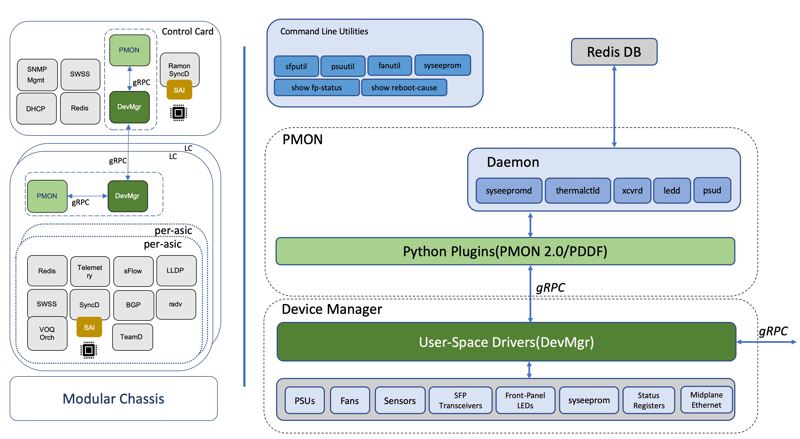
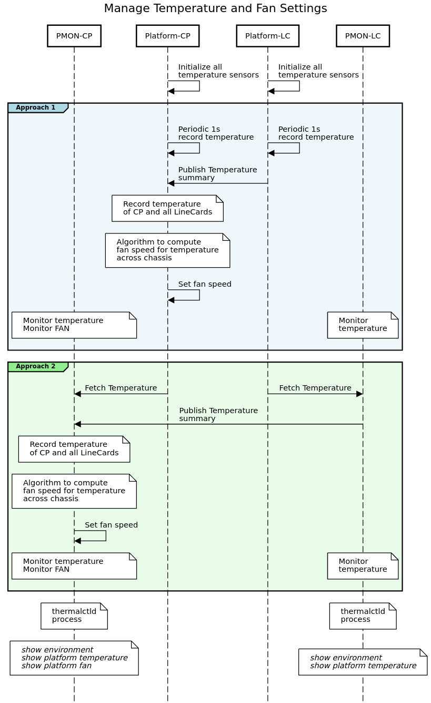

# Platform Monitor Chassis Design #

### Rev 0.1 ###

# Table of Contents

  * [Revision](#revision)

  * [About this Manual](#about-this-manual)

  * [Scope](#scope)

  * [Acronyms](#acronyms)
 
  * [1 Requirements ](#1-requirements)
    * [1.1 Functional requirements](#11-functional-requirements)

  * [2 Chassis Architecture](#2-chassis-architecture)
    * [2.1 Chassis Platform Stack](#21-chassis-platform-stack)
    * [2.2 Chassis Support](#22-chassis-support)
      * [2.2.1 Chassis Boot Sequence](#221-chassis-boot-sequence)
      * [2.2.2 Line-Card Boot Sequence](#222-line-card-boot-sequence)
      * [2.2.3 Chassis Monitoring Daemon](#223-chassis-monitoring-daemon)
      * [2.2.4 Chassis Midplane Connectivity](#224-chassis-midplane-connectivity)
    * [2.3 Platform](#23-platform)
      * [2.3.1 User-space peripheral drivers](#231-user-space-peripheral-drivers)
      * [2.3.2 Platform show commands](#232-platform-show-commands)
    * [2.4 Peripheral Management](#24-peripheral-management)
      * [2.4.1 PSU](#241-psu)
      * [2.4.2 Temperature and Fan Control](#242-temperature-and-fan-control)

  * [3 Multi-Asic Support](#3-multi-asic-support)
    * [3.1 Functional Changes](#31-functional-changes)
      * [3.1.1 Database Connections per Namespace](#311-db-per-namespace)
      * [3.1.2 Multi-thread support](#312-multi-thread-support)
    * [3.2 Peripheral Management](#32-peripheral-management)
      * [3.2.1 Transceiver Monitoring](#321-transceiver-monitoring)
      * [3.2.2 Front Panel LED](#322-led-management)
    
  * [4 Conclusion](#4-conclusion)
    * [4.1 Open questions](#41-open-questions) 

  
### Revision ###

 | Rev |     Date    |       Author                                                            | Change Description                |
 |:---:|:-----------:|:-----------------------------------------------------------------------:|-----------------------------------|
 | 1.0 |             |  Manjunath Prabhu, Sureshkannan Duraisamy, Marty Lok, Marc Snider       | Initial version                   |

# About this Manual
This document provides design requirements and interactions between platform drivers and PMON for SONiC on aggregated chassis with linecard CPU's.

# Scope
This document covers high level design of the platform support and its interactions with PMON in a chassis environment.

# Acronyms
PSU - Power Supply Unit

SFM - Switch Fabric Module

## 1. Requirements
## 1.1 Functional requirements
A modular disaggregated SONiC will run more than one instances of SONiC per line card and local resources on each linecard is managaged as a independent fixed platform. Even if they are treated as separate instances of SONIC, a chassis being managed as a single cohesive system via control card. On the platform and peripheral management(pmon) perspective, these are some high level requirments we will need to address.

1.  Chassis Support
    * Support for monitoring all the control, line and fabric cards
    * Support for control cards and line cards running pmon(distributed pmon) to manage the peripherals as a chassis. For example, FAN being controlled via control card, temperature reading done via linecard, LED's controlled on linecard, etc.
    * Allow platforms with kernel or user-space drivers to allow chassis vendor's portability.
    * Allow platform interactions across cards using redis/pmon
2.  Multi-ASIC Support
    * Allow line cards with multiple forwarding ASIC's 

## 1.2 Hardware requirements
As part of disaggregated SONiC architecture, a chassis with line card CPU is the first target to support. Each line card is expected to have some of the peripheral components such as console, management port and storage device.

## 2 Chassis Architecture 

A chassis has control-cards, line-cards, SFMs and additionally, peripherals like PSUs, FANs, Temperature sensors. Some of these perpherals are plug-able and hot-swap capable. Some of the key requirements identified are:

1.  SONiC on control-card will be responsible for platform drivers, firmware for the Chassis, SFMs, PSUs, FANs, Temperature sensors and control card itself.
2.  SONiC on line-card will be responsible for platform drivers, firmware for the PHY, SFPs, Front panel ports and line card itself
3.  Disaggregated SONiC application stack will be different between control and line cards based on HWSKU
    *  Respective plaform drivers will be loaded automatically based on HWSKU
    *  Respective processes will be started on PMON based on HWSKU
4.  One instance of PMON will be run on per line card and also on a control card. PMON will communicate to each via redis instanace running on control card. 
5.  Vendor-specific platform code may need to communicate between control and SFMs/line cards, thus providing PMON north bound API's implementation. 
6.  User space driver in vendor-specific platform code will provide gRPC IPC mechanism to interface with PMON and implementing PMON 2.0 API's as needed for all perpherical management. 

### 2.1 Chassis Platform Stack

Diagram below shows the platform-stack for modular chassis.



### 2.2 Chassis Support

#### 2.2.1 Chassis Boot Sequence

A modular chassis has two different active SKU to represent chassis which are control card SKU and line card SKU. A chassis is represented as a single ONIE platform. Given SONiC already supports multiple boot methods and ONIE is one among them, ONIE will be prefered method of booting for control card and line card. Line cards are expected to provide console port, management port and storage to install SONiC. Currently, SONiC boot up using ONIE provides the platform string. Linux's systemd capabilities is utilized to start all required sonic systemd services. This current mechanism needs to be enhanced to support dynamic determination of HWSKU upon boot and initiate/boot the required SONiC services according to type of the card. In control card, SONiC would start multiple instances of SONiC application containers to manage SFM's but there wont be any control plane application such as BGP container. In a line card, SONiC would start multiple instance of SONiC containers such as database, swss, syncd and bgp per forwarding ASIC. This determination is done using HWSKU and data file under *device/\<vendor\>/\<platform\>/\<hwsku\>/asic.conf*

#### 2.2.2 Line Card Boot Sequence

Once each of the line-cards is booted with the SONiC image, the services need to be started in a particular order - databases, *platform*, pmon, routing etc.,  
The platform code or service will need to:

1.  Identify the HWSKU from eeprom
2.  Identify the slot-number of the card

All the above will be added as device-metadata into the REDIS database.

Using hwsku and data file located under  *device/\<vendor\>/\<platform\>/\<hwsku\>/hwsku.json* will have # of asics, ports per ASIC, some hardware specific settings like DMA size per ASIC would be specified.


#### 2.2.3 Chassis Monitoring Daemon

Although, the proposed disaggregated chassis architecture for SONiC will have control-cards and line-card running one-to-many instances of SONiC, the control card will be the central entity that will have visibility of the entire chassis. The proposal is to have a new ***chassisd*** daemon which will provide and monitor the status of all the line-cards and SFMs. The capabilities include:

1.  Providing per-slot description of the card
2.  Providing state/status of Empty, Offline, Booting, Online etc
3.  Updating the state information to REDIS STATE-DB
4.  Monitoring in a loop for state changes of the cards.

```
In src/sonic-platform-daemons/sonic-chassisd/scripts/chassid:

class DaemonChassisd(DaemonBase):

    # Connect to STATE_DB and create linecard/chassis info tables
    state_db = daemon_base.db_connect(swsscommon.STATE_DB)
    linecard_tbl = swsscommon.Table(state_db, LINECARD_INFO_TABLE)

    # Start main loop
    logger.log_info("Start daemon main loop")

    while not self.stop.wait(LINECARD_INFO_UPDATE_PERIOD_SECS):
        linecard_db_update(linecard_tbl, num_linecard)

    logger.log_info("Stop daemon main loop")

```

A LineCardBase class is introduced for chassis vendors to implement their representation of line-cards in a chassis.

```
In src/sonic-platform-common/sonic_platform_base/linecard_base.py

class LineCardBase(object):
    """
    Abstract base class for implementing a platform specific class to
    represent a control-card, line-card or fabric-card of a chassis
    """
    _linecard_list = None
    
    def __init__(self):
        self._linecard_list = []
        
    def get_name(self):
    
    def get_description(self):
    
    def get_slot(self):

    def get_status(self):
    
    def reboot_slot(self):

In src/sonic-platform-common/sonic_platform_base/chassis_base.py

class ChassisBase(device_base.DeviceBase):
    def get_num_linecards(self):
    
    def get_all_linecards(self):
    
    def get_linecard_presence(self, lc_index):
    
```
An example vendor implementation would be as follows:

```
In platform/broadcom/<vendor>/sonic_platform/linecard.py

from sonic_platform_base.linecard_base import LineCardBase

class LineCard(LineCardBase):
    def __init__(self, linecard_index):

```

The *show platform* command is enhanced to show chassis information

**show platform details**
```
PLATFORM INFO TABLE
-----------------------------------------------------------
| Slot   | Name                              | Status     |
-----------------------------------------------------------
| 16     | cpm2-ixr                          | Online     |
| 1      | imm36-400g-qsfpdd                 | Online     |
| 2      | imm36-400g-qsfpdd                 | Online     |
| 3      | imm36-400g-qsfpdd                 | Online     |
| 4      | Empty                             | Empty      |
| 17     | SFM1                              | Offline    |
| 18     | SFM2                              | Offline    |
| 19     | SFM3                              | Offline    |
| 20     | SFM4                              | Offline    |
| 21     | SFM5                              | Online     |
| 22     | SFM6                              | Offline    |
-----------------------------------------------------------
```

#### 2.2.4 Chassis Midplane Connectivity

The midplane connectivity usually over Ethernet via an internal switch helps create an internal network for communication between control-cards and line-cards. Traditionally, this path is used to punt control traffic like BGP, ARP, ICMP etc from the line-card to control-card. For SONiC, the requirement is **not** to use this channel for punting traffic. Instead, this channel will be used (and not limited to) for:

1.  Exchanging monitoring information between line-cards and control-cards.
2.  REDIS connections from line-cards to instances running on the control-card.
3.  REDIS connections from control-cards to instances running on the line-cards.

One example, is for the thermalctld on the control-card to get/fetch the temperature sensor information from all the line-cards and then compute the optimal fan speed for the chassis.

### 2.3 Platform
The platform code on the control card is responsible for ensuring all the components of the chassis are operationally UP. Similarly, the platform code on the line card will monitor it's components are operationally UP.

#### 2.3.1 User-space peripheral drivers
One of the options for the vendor is to package the user-space peripheral drivers as a separate docker, to keep it modular and conform with the containarization methodology.  Alternatively, the platform code can be a debian package that can run contain libraries/binaries and run as part of the PMON docker. The interactions between PMON binaries and platform binaries will use standard sysfs or proposed RPC interface.

Also, the control card can run only a select set of dockers. For example, teamd, syncd, swss need not run on the control card.

```
admin@sonic:~$ show version

SONiC Software Version: SONiC.HEAD.0-8482aed3
Distribution: Debian 9.12
Kernel: 4.19.39-amd64
Build commit: 8482aed3
Build date: Sat Apr 25 08:14:41 UTC 2020
Built by: gitlab-runner@sonic-bld2

Platform: x86_64-nokia_ixr7250-r0
HwSKU: CPM
ASIC: broadcom
Serial Number: NS192510003
Uptime: 07:09:46 up 2 days,  1:00,  4 users,  load average: 0.12, 0.11, 0.09

Docker images:
REPOSITORY                    TAG                 IMAGE ID            SIZE
docker-orchagent              HEAD.0-8482aed3     f61bfca3afe9        465MB
docker-orchagent              latest              f61bfca3afe9        465MB
docker-fpm-frr                HEAD.0-8482aed3     1a49acc025ed        438MB
docker-fpm-frr                latest              1a49acc025ed        438MB
docker-teamd                  HEAD.0-8482aed3     b207fab577aa        416MB
docker-teamd                  latest              b207fab577aa        416MB
docker-nat                    HEAD.0-8482aed3     c0d4e2ebd25a        418MB
docker-nat                    latest              c0d4e2ebd25a        418MB
docker-syncd-brcm             HEAD.0-8482aed3     eaa866801433        796MB
docker-syncd-brcm             latest              eaa866801433        796MB
docker-platform-monitor       HEAD.0-8482aed3     3b894fee1751        475MB
docker-platform-monitor       latest              3b894fee1751        475MB
docker-snmp-sv2               HEAD.0-8482aed3     df3adb24b41d        612MB
docker-snmp-sv2               latest              df3adb24b41d        612MB
docker-lldp-sv2               HEAD.0-8482aed3     116161a03b51        414MB
docker-lldp-sv2               latest              116161a03b51        414MB
docker-sonic-mgmt-framework   HEAD.0-8482aed3     1d74118da0bb        536MB
docker-sonic-mgmt-framework   latest              1d74118da0bb        536MB
docker-router-advertiser      HEAD.0-8482aed3     fa16fe338cc9        387MB
docker-router-advertiser      latest              fa16fe338cc9        387MB
docker-database               HEAD.0-8482aed3     030c0908a101        387MB
docker-database               latest              030c0908a101        387MB
docker-dhcp-relay             HEAD.0-8482aed3     b64b3ba1ec5d        397MB
docker-dhcp-relay             latest              b64b3ba1ec5d        397MB
docker-device-manager         HEAD.0-8482aed3     6984978a5084        1.27GB
docker-device-manager         working             6984978a5084        1.27GB

```
#### 2.3.2 Platform show commands

The existing show commands will remain on the control and line cards, where they will use different HWSKUs.

**show platform summary**

```
admin@sonic:~$ show platform summary
Platform: x86_64-nokia_ixr7250-r0
HwSKU: CPM
ASIC: broadcom
```

**show platform syseeprom**
```
admin@sonic:~$ show platform syseeprom
TlvInfo Header:
   Id String:    TlvInfo
   Version:      1
   Total Length: 64
TLV Name             Code Len Value
-------------------- ---- --- -----
Product Name         0x21   3 CPM
Part Number          0x22  14 3HE12458AA0401
Serial Number        0x23  11 NS192510003
Base MAC Address     0x24   6 14:7B:AC:B5:5D:E1
Device Version       0x26  10 56
MAC Addresses        0x2A   2 5
CRC-32               0xFE   4 0xF4D01B46

(checksum valid)
```


### 2.4 Peripheral Management

Processes running in the PMON container would differ based on the HWSKU. In the chassis, the Control-card and Line-cards would be running a subset of the PMON processes. Existing control file */device/\<vendor\>/\<platform\>/\<hwsku\>/pmon\_daemon\_control.json* is used to start processes in each of the cards. A new template */dockers/docker-platform-monitor/critical\_processes.j2* is introduced to dynamically generate the *critical\_processes* instead of current statically defined list.

#### 2.4.1 PSU
PSUd in PMON will monitor the PSUs and maintain state in REDIS-DB. 

On a chassis, the PSUs are fully managed by the Control Card. Platform will expose APIs for PSUd to periodically query the PSU status/presence.


**show platform psustatus**
```
admin@sonic:~$ show platform psustatus
PSU    Status
-----  -----------
PSU 1  OK
PSU 2  OK
PSU 3  OK
PSU 4  NOT PRESENT
PSU 5  NOT PRESENT
PSU 6  NOT PRESENT
```

#### 2.4.2 Temperature and Fan Control
Thermalctld is monitoring temperatures, monitoring fan speed and allowing policies to control the fan speed.

On a chassis, there are a few requirements that differ in comparison to pizza boxes:

1. There are multiple temperature sensors that need to be monitored. All these need to be available on the control-card.
    * Temperature sensors are on the control-card
    * Temperature sensors are on the line-card
    * Temperature sensors are on the SFMs.
2. The FAN control is limited to the control-card 



The above requirements can be addressed using one of the proposed approaches:

1. In Approach-1, the implementation is handled by vendor-specific platform code. The platform will record temperatures from all the points in chassis and feed it to the FAN management-module. The FAN algorithm could be either vendor specific as well. PMON will have an override option to disable the platform-specific FAN algorithm and manually set the speed using existing policies.
2. In Approach-2, the implementation is in PMON. PMON (TemparatureMonitor in thermalctld) on line-card will record temperatures from its sensors. The PMON (TemparatureMonitor in thermalctld) on control-card can subscribe to temperature summary from all line-cards. This will be then consumed by the FanUpdater module in thermalctld running on the control-card. The existing policies will control the fan speed.

With both approaches, monitoring of temperature and fan parameters will happen in PMON.

**show platform fan**
```
admin@sonic:~$ show platform fan
     FAN    Speed              Direction    Presence    Status          Timestamp
--------  -------  ---------------------  ----------  --------  -----------------
FanTray1      50%  FAN_DIRECTION_EXHAUST     Present        OK  20200429 06:11:16
FanTray2      50%  FAN_DIRECTION_EXHAUST     Present        OK  20200429 06:11:17
FanTray3      50%  FAN_DIRECTION_EXHAUST     Present        OK  20200429 06:11:18
```

**show platform temperature**
```
admin@sonic:~$ show platform temperature
   Sensor    Temperature    High TH    Low TH    Crit High TH    Crit Low TH    Warning          Timestamp
---------  -------------  ---------  --------  --------------  -------------  ---------  -----------------
Thermal 0             28         50         0             N/A            N/A      False  20200529 01:49:39
Thermal 1             37         50         0             N/A            N/A      False  20200529 01:49:39
Thermal 2             40         68         0             N/A            N/A      False  20200529 01:49:39
Thermal 3             45         68         0             N/A            N/A      False  20200529 01:49:39
Thermal 4             32         68         0             N/A            N/A      False  20200529 01:49:39
Thermal 5             59         68         0             N/A            N/A      False  20200529 01:49:39
```
**show environment**
```
admin@sonic:~$ show environment
TEMPERATURE DEVICES TABLE
------------------------------------------------------
| Name    | Local   | Remote   | Description         |
------------------------------------------------------
| temp_1  | 26      | -128     | cpu *               |
| temp_2  | 31      | 36       | cpuctl *            |
| sfm5_1  | 27      | 39       | ioctl *             |
| sfm5_2  | 48      | -128     | board 1             |
| sfm5_3  | 30      | -128     | board 2             |
| sfm5_4  | 33      | 62       | dfe 1               |
------------------------------------------------------


TEMPERATURE SUMMARY TABLE
-----------------------------------------------------
| Hw Slot| Current Temp| Min Temp| Max Temp| Margin |
-----------------------------------------------------
| 21     | 27          | 25      | 28      | 41     |
| 1      | 39          | 127     | 44      | 7      |
| 0      | 31          | 25      | 31      | 19     |
| 2      | 38          | 127     | 38      | 8      |
-----------------------------------------------------


FAN TABLE
------------------------------------------------------------
|         Type         |         Value                     |
------------------------------------------------------------
| Fan Tray - 0         | FanTray 1: online                 |
| Fan Tray - 1         | FanTray 2: online                 |
| Fan Tray - 2         | FanTray 3: online                 |
| Fan Algorithm Disable| False                             |
| Current Fan Speed    | 49                                |
| Max Fan Speed        | 92                                |
| Force Max Fan Speed  | False                             |
------------------------------------------------------------
```

## 3 Multi-ASIC support

Multi-asic support creates distinct namespace on a per-asic basis. Containers like SWSS, SYNCD, BGP, TEAMD will be running in each namespace i.e. on a per-asic basis. To support this architecture, separate REDIS instances with its set of databases are running per asic. However, a single instance of the PMON container runs per linecard and it contains a set of sonic platform-daemons. 

* PSUd, ThermalCtrld do not require multi-asic support and run on the control card.
* Syseepromd does not require multi-asic support, but will run on both control and line cards.
* Xcvrd, Ledd require multi-asic support and run on the line cards. 

### 3.1 Functional Changes

#### 3.1.1 Database Connections

Database dockers run per namespace and PMON processes need to connect to each of these database instances. 

Below is a code snippet to introduce a new API *db_unix_connect* 
```
In src/sonic-daemon-base/sonic_daemon_base/daemon_base.py

def db_unix_connect(db, namespace):
    from swsscommon import swsscommon
    return swsscommon.DBConnector(db,
                                  REDIS_UNIX_SOCKET_PATH+str(namespace)+REDIS_UNIX_SOCKET_INFO,
                                  REDIS_TIMEOUT_MSECS)

```

Below is a code snippet to connect to State-DB.
```
In src/sonic-platform-daemons/sonic-xcvrd/scripts/xcvrd

 use_unix_sockets = False
 
 # Check if environment is multi-asic
 if check_multiasic():
    use_unix_sockets = True
    
 # Connect to STATE_DB and create transceiver dom/sfp info tables
 if not use_unix_sockets:
    state_db = daemon_base.db_connect(swsscommon.STATE_DB)
 else:
    state_db = daemon_base.db_unix_connect(swsscommon.STATE_DB, namespace)
```

#### 3.1.2 Multi-thread support

The pmon processes will need to run per-asic specific functinality in a separate thread.

Below is a code snippet to run namespace specific funtionality per thread.

```
In src/sonic-platform-daemons/sonic-xcvrd/scripts/xcvrd

  # Run daemon
    def run(self):
        logger.log_info("Starting up...")
        
        # Start daemon initialization sequence
        self.init()
        
        if num_asics == 1:
            use_unix_sockets = False
            self.run_per_asic(0)
        else:
            self.xcvrd_thread_list = []
            for i in range(0, num_asics): #Number of Asics per pmon
                thread = threading.Thread(target=self.run_per_asic, args=(i,))
                thread.setName('Xcvrd Thread '+str(i))
                self.xcvrd_thread_list.append(thread)
                
            for thread in self.xcvrd_thread_list:
                thread.start()
                
            for thread in self.xcvrd_thread_list:
                thread.join()
                
        # Start daemon deinitialization sequence
        self.deinit()


```
Additonal new APIs like *set_namespace()* and *get_namespace()* can be provided in chassis_base.py which can be set by PMON processes. This will enable modules supporting platform 2.0 to be aware or query which namespace they are running in.

### 3.2 Peripheral Management

#### 3.2.1 Transceiver Monitoring

The tranceiver daemon (Xcvrd) has been modified to be namespace aware. The following changes were implemented:
* Each of the DB update and SFP event monitoring tasks run per namespace
* The DB connections, updates are per namespace.

Since the line card supports 400G ports, we have implemented a qsfp-dd decoder. 


 
 
 **show interfaces status**
 ```
admin@sonic:~$ sudo ip netns exec asic0 show interfaces status
  Interface                    Lanes    Speed    MTU         Alias    Vlan    Oper    Admin                                             Type    Asym PFC
-----------  -----------------------  -------  -----  ------------  ------  ------  -------  -----------------------------------------------  ----------
  Ethernet1    8,9,10,11,12,13,14,15     400G   9100   Ethernet1/1  routed    down     down                                              N/A         N/A
  Ethernet2          0,1,2,3,4,5,6,7     400G   9100   Ethernet1/2  routed    down     down                                              N/A         N/A
  Ethernet3  24,25,26,27,28,29,30,31     400G   9100   Ethernet1/3  routed      up       up  QSFP-DD Double Density 8X Pluggable Transceiver         N/A
  Ethernet4  16,17,18,19,20,21,22,23     400G   9100   Ethernet1/4  routed    down     down                                              N/A         N/A
  Ethernet5  40,41,42,43,44,45,46,47     400G   9100   Ethernet1/5  routed    down     down                                              N/A         N/A
  Ethernet6  32,33,34,35,36,37,38,39     400G   9100   Ethernet1/6  routed    down     down                                              N/A         N/A
  Ethernet7  80,81,82,83,84,85,86,87     400G   9100   Ethernet1/7  routed    down     down  QSFP-DD Double Density 8X Pluggable Transceiver         N/A
  Ethernet8  88,89,90,91,92,93,94,95     400G   9100   Ethernet1/8  routed    down     down                                              N/A         N/A
  Ethernet9  64,65,66,67,68,69,70,71     400G   9100   Ethernet1/9  routed    down     down                                              N/A         N/A
 Ethernet10  72,73,74,75,76,77,78,79     400G   9100  Ethernet1/10  routed    down     down                                              N/A         N/A
 Ethernet11  48,49,50,51,52,53,54,55     400G   9100  Ethernet1/11  routed    down     down                                              N/A         N/A
 Ethernet12  56,57,58,59,60,61,62,63     400G   9100  Ethernet1/12  routed    down     down                                              N/A         N/A
 ```
 
 **show interfaces transceiver presence**
 ```
admin@sonic:~$ sudo ip netns exec asic0 show interfaces transceiver presence
Port        Presence
----------  -----------
Ethernet1   Not present
Ethernet2   Not present
Ethernet3   Present
Ethernet4   Not present
Ethernet5   Not present
Ethernet6   Not present
Ethernet7   Present
Ethernet8   Not present
Ethernet9   Not present
Ethernet10  Not present
Ethernet11  Not present
Ethernet12  Not present
 ```
 
#### 3.2.2 LED Management

The Led Daemon (Ledd) has been modified to be namespace aware. The following changes were implemented:
* The LED monitoring tasks are run per namespace
* Each instance of this task subscriber to APPL_DB for PORT UP/DOWN state updates.
 
Platform will expose APIs for LEDD to call to change the LED colors to Amber (DOWN) and Green (UP)


**show led status**

```
admin@sonic:~$show led status

FRONT-PANEL INTERFACE STATUS TABLE
----------------------------------------------
| Interface     | Status                     |
----------------------------------------------
| Ethernet1     | state=fast-blink  amber    |
| Ethernet2     | state=fast-blink  amber    |
| Ethernet3     | state=on          green    |
| Ethernet4     | state=fast-blink  amber    |
| Ethernet5     | state=fast-blink  amber    |
| Ethernet6     | state=fast-blink  amber    |
| Ethernet7     | state=fast-blink  amber    |
| Ethernet8     | state=fast-blink  amber    |
| Ethernet9     | state=fast-blink  amber    |
| Ethernet10    | state=fast-blink  amber    |
| Ethernet11    | state=fast-blink  amber    |
| Ethernet12    | state=fast-blink  amber    |
| Ethernet13    | state=fast-blink  amber    |
| Ethernet14    | state=fast-blink  amber    |
| Ethernet15    | state=on          green    |
| Ethernet16    | state=fast-blink  amber    |
| Ethernet17    | state=fast-blink  amber    |
| Ethernet18    | state=fast-blink  amber    |
| Ethernet19    | state=fast-blink  amber    |
| Ethernet20    | state=fast-blink  amber    |
| Ethernet21    | state=fast-blink  amber    |
| Ethernet22    | state=fast-blink  amber    |
| Ethernet23    | state=fast-blink  amber    |
| Ethernet24    | state=fast-blink  amber    |
| Ethernet25    | state=fast-blink  amber    |
| Ethernet26    | state=fast-blink  amber    |
| Ethernet27    | state=fast-blink  amber    |
| Ethernet28    | state=fast-blink  amber    |
| Ethernet29    | state=fast-blink  amber    |
| Ethernet30    | state=fast-blink  amber    |
| Ethernet31    | state=fast-blink  amber    |
| Ethernet32    | state=fast-blink  amber    |
| Ethernet33    | state=fast-blink  amber    |
| Ethernet34    | state=fast-blink  amber    |
| Ethernet35    | state=fast-blink  amber    |
| Ethernet36    | state=fast-blink  amber    |
----------------------------------------------
```
## 4 Conclusion

The chassis support will keep each of instances of SONICs that is on each linecard, decoupled. However, there are certain scenarios where platform and/or platform-monitoring modules from each of these instance will have to interact with each other. These are highlighted in some of the call-flows in the document. The platform also opens up a GRPC interface that can be used by any monitoring or management services to control/query devices. 

### 4.1 Open Questions

* Is there a a preceding document for watchdog support?

