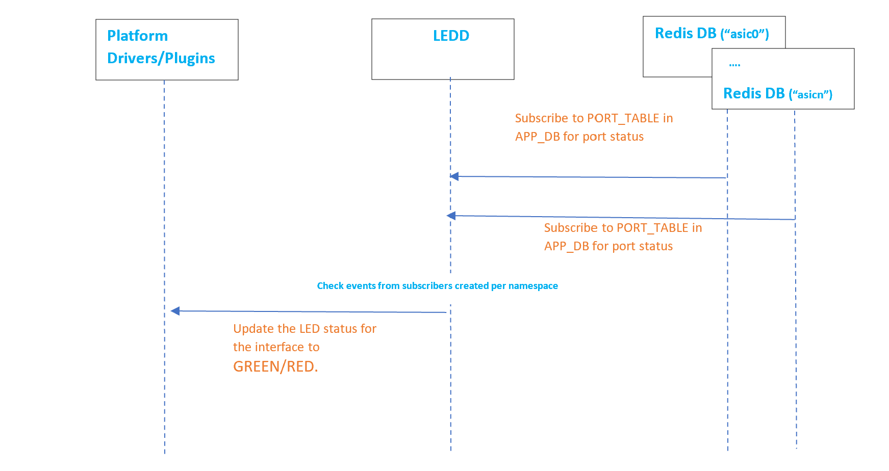
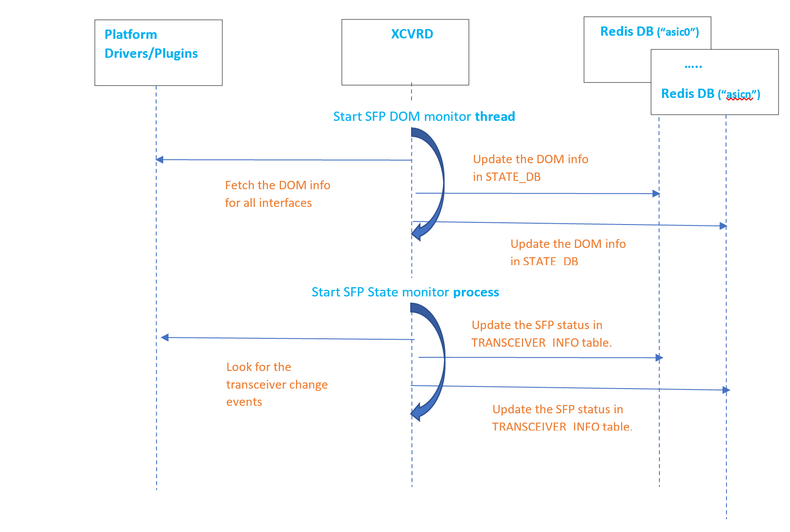

#

# **Platform Monitor design for Multi-Asic platforms**

In the Multi-asic architecture, there is a global database docker container running on the linux host and multiple database docker containers running in linux network namespaces. The DB instances in the redis server running in global database docker container will have the system wide config attributes like syslog, AAA etc., while those DB instances in the namespace database docker containers will have ASIC resources related data.

## **Design Approach**

For multi-asic platforms, the Platform monitor service will continue to be a single instance docker running in Linux host.

Following are the tables used/updated by various daemons in PMON docker,

- **PSU daemon:** CHASSIS\_INFO **,** PSU\_INFO tables in **state\_db**
- **Syseepromd daemon:** EEPROM\_INFO in **state\_db**
- **Thermalctld daemon:** FAN\_INFO, TEMPERATURE\_INFO in **state\_db**
- **Ledd daemon:** PORT\_TABLE in **app\_db**
- **Xcvrd daemon:** TRANSCEIVER\_INFO **,** TRANSCEIVER\_DOM\_SENSOR **,** TRANSCEIVER\_STATUS in **state\_db**. PORT\_TABLE in **app\_db**

The design approach taken is as given below,

- The **interface related platform tables** like TRANSCEIVER\_INFO **,** TRANSCEIVER\_STATUS etc. will be stored in the STATE\_DB instance of **Asic database** (the database docker running in asic network namespace)

- In the multi-asic design there are namespaces created for front-end and back-end ASIC's. Since PMON is interested only in the front-panel interfaces (not in the backplane interfaces between ASIC&#39;s) it works with the namespaces relating to front-end ASIC's.

- The **system wide platform tables** like PSU\_INFO, FAN\_INFO, EEPROM\_INFO etc. will be kept in the STATE\_DB instance of **Global database** (the database docker running in linux host)

- The platform plugins are generally agnostic of whether it is single-asic or multi-asic platform. It interacts with the platform drivers in the linux kernel, sys/proc filesystems.(In **Mellanox platforms** this is different as the events like transceiver plug in/out events are exposed by mlnx SDK which reside in syncd container. With multi-asic there is syncd per namespace, it would need a change in plugins for Mellanox multi-asic platforms)

- In the multi-asic platform there are port\_config.ini files per ASIC. They will be present in the directories named with the **asic_index** under the device/platform/hwsku directory. These files are parsed to create the **interface**  **to**  **asic\_id** mapping.

## **Design changes for multi-asic Architecture**

This section will detail more on the changes planned to various platform classes and daemons

#### **DaemonBase**

- Introduce namespace parameter to db\_connect to connect to DB in a namespace
- Additional API's needed for the following,
  - Check if it is multi-asic platform
  - Get the number of asic&#39;s in the device.
  - Get the namespaces mapped to front-end ASIC&#39;s in the device.

#### **SfpUtilHelper/ SfpUtilBase**

This **platform\_sfputil** class handles parsing the port\_config.ini file to **create the port list**.
For multi-asic platform support, the functionality here needs to be extended to

- Parse multiple port\_config.ini files and create a single port list irrespective of which ASIC/namespace they belong to.
- Only the front-panel interfaces will be added to the port list
- Introduce a new map struct (while parsing each port\_config.ini file) the store the **interface**  **to**  **asic\_id** relation. This will be helpful to get the asic\_index directly from the interface name.

## **Platform monitor daemons**

This section details the changes that would be needed in various PMON daemons for multi-asic architecture.

### **Psud**

The power supply unit daemon connects to STATE\_DB and updates the following tables viz. CHASSIS\_INFO and PSU\_INFO. In multi-asic architecture, this daemon continues to update the STATE\_DB which is present in the global database instance running in the host. **No change needed here.**

### **Syseepromd:**

Syseepromd connects to STATE\_DB and updates the EEPROM\_INFO table. In multi-asic architecture, this daemon continues to update the STATE\_DB which is present in the global database instance running in the host. **No change needed here**

### **Thermalctld:**

Thermalctld connects to STATE\_DB and updates the following tables viz. FAN\_INFO and TEMPERATURE\_INFO. In multi-asic architecture, this daemon continues to update the STATE\_DB which is present in the global database instance running in the host. **No change needed here**

###

### **Ledd:**

LED daemon which updates the port LED based on the port state change events from PORT\_TABLE, currently does the following
- connect to the APPL\_DB
- subscribe to port state change events from PORT\_TABLE
- Call the platform plugin API's to update the port LED in the device.

```python
      # Open a handle to the Application database
      # Subscribe to PORT table notifications in the Application DB
      ……
      while True:
         (state, c) = sel.select(SELECT_TIMEOUT)
         (key, op, fvp) = sst.pop()
         ……
         led_control.port_link_state_change(key, fvp_dict["oper_status"])
```

The design changes for multi-asic platform would be to subscribe for port state change events from PORT\_TABLE present in the APP\_DB instance present in different namespaces.

 

- Connect to APPL\_DB&#39;s in all front-end namespaces and get the db\_connectors.
- **Create multiple subscribers, one per namespace for**  **PORT\_TABLE in APP\_DB**  **and add to the select object**. With this it should get the port state change events from the PORT\_TABLE in each namespace.
```python
     for namespace in namespaces:
         # Open a handle to the Application database, in all namespaces
         appl_db[namespace] = daemon_base.db_connect("APPL_DB", namespace=namespace)
         sst[namespace] = swsscommon.SubscriberStateTable(appl_db[namespace], ..)
         sel.addSelectable(sst[namespace])
```
- In the select while(true) loop, I check if there data to be retrieved from any of the selectable objects which we created earlier per namespace and pop it out. If the event is for a Backplane interface skip processing it.
```python
   while True:
     (state, c) = sel.select(SELECT_TIMEOUT)
     # Get the namespace from the selectable object and use it to index the SubscriberStateTable handle.
     ns=c.getDbNamespace()
     (key, op, fvp) = sst[ns].pop()	            
     ……
     led_control.port_link_state_change(key, fvp_dict["oper_status"])
```

**Alternative approach for Ledd daemon:**

In Ledd process we could spawn multiple threads, one thread per ASIC to handle events for interfaces which it owns. Each thread would subscribe for the events from PORT\_TABLE in the APP\_DB of the namespace mapped to the ASIC. **Didn&#39;t opt this as this would result in more threads depending on the number of ASIC&#39;s.**


###

### **Xcvrd:**

Xcvrd currently will spawn two threads
1. a thread to wait for the SFP plug in/out event, when event received, it will update the DB entries accordingly.
2. A timer will be started to periodically refresh the DOM sensor information.

These threads updates the transceiver info in various tables viz. TRANSCEIVER\_INFO, TRANSCEIVER\_DOM\_SENSOR, TRANSCEIVER\_STATUS.

In the multi-asic architecture since the interfaces are spread among databases in different namespaces, this daemon needs intelligence to update the STATE\_DB instance in the correct namespace.

#### **Approach 1**

In this approach

- Continue the current **Xcvrd process architecture** (1 xcvrd daemon which is the parent process + 2 threads to update the sfp, dom status).
- The Xcvrd daemon will wait for the &quot;PortInitDone&quot; in the PORT\_TABLE in the APP\_DB of all the front-panel namespaces.
- The xcvr thread would poll/monitor platform plugins and update the transceiver tables in the STATE\_DB instance in the respective namespace where the interface belongs.s




####

The changes with this approach will be

1. Use SfpUtil helper routines to parse multiple port\_config.ini files. This would have created the interface **to**  **asic\_id** mapping for the front-panel interfaces.
2. Connect to the APP\_DB and STATE\_DB in various namespaces, store the db\_connector/table handle objects indexed by the **&quot;asic id&quot;.**
3. Use the **interface**  **to**  **asic\_id** mapping which is populated by the **platform\_sfputil** to fetch the correct db\_connector/table handle created in step 2.
4. In the Xcvrd API&#39;s pass the correct db\_connector/table handle based on the interface\_name.

  ```python
  def post_port_sfp_info_to_db(logical_port_name, table, ..) 
  def post_port_dom_threshold_info_to_db(logical_port_name, table,..)
  def post_port_dom_info_to_db(logical_port_name, table,..)
  def update_port_transceiver_status_table(logical_port_name, status_tbl,..)
  def delete_port_from_status_table(logical_port_name, status_tbl)
  def detect_port_in_error_status(logical_port_name, status_tbl)
  ```

####

#### **Approach 2**

In this approach we could spawn **multiple XCVR threads** per asic/namespace.

1. Parse the port\_config.ini files for the asic using sfphelper util routines, in the respective threads and create the port\_list.
2. Currently Xcvrd has a main daemon process + 2 additional python process/thread for SFP-monitor, DOM-update tasks. Here in this approach we have to spawn these 3 threads/processes for all front-end namespaces.
3. Pass the **&quot;asic\_id&quot;** while creating thread as an argument or as the thread class attribute. This attribute would be used in each thread to to connect to the DB instance in that namespace.

#### **Pros and Cons**

Here are the pros and cons of both the approaches,

- Approach1 will take less cpu/memory compared to Approch2 as we don&#39;t spawn more threads. Using the ASIC count as the constraint to spawn threads might not scale with more asic&#39;s.
- Approach2 might have less code change in the xcvrd daemon as we can keep the same code in most places and pass a different asic\_id while creating the process/thread. Each thread/process talks only to the DB&#39;s of a particular namespace.

#### **Conclusion**

**Approach 1** above was taken as there is no real need of increasing the number of python threads since we have only at max 64 interfaces currently.The problem we are trying to solve is to post the data into DB&#39;s in different namespaces which can be easily achieved with **interface**  **to**  **asic\_id** mapping table.


## **Namespace support in swss-common DBConnector**

The swss-common::DBconnector class needs to be enhanced to use the **&quot;namespace&quot;** context information to connect to the DB instance in that namespace.

The DB connector classes will have capability to parse the new &quot;database\_global.json&quot; file and retrieve the namespaces present in the platform and the database instances in each namespace. 
Please refer [multi_namespace_db_instances design document](https://github.com/sonic-net/SONiC/blob/master/doc/database/multi_namespace_db_instances.md) for more details.

##

## Config/Show commands changes

There are **configuration commands** below will have additional argument **&quot;-n namespace&quot;** if the user needs to specify the interface namespace – else if not given, it will derive the namespace from the interface name.

- &quot;config interface transceiver lpmode&quot;
- &quot;config interface reset&quot;

The sfputil scripts needs to be updated to parse multiple port\_config.ini files for multi-asic.

**The show commands** for displaying the transceiver info viz. &quot;show interfaces transceiver&quot; also needs update to fetch data from DB&#39;s in different namespaces.

## SNMP changes

The snmp agent needs to connect to the STATE\_DB in different namespaces depending on the interface and get the transceiver information.

##

## Open questions

1. In the case of chassis based platforms, the interfaces are fine, will be in the DB&#39;s in respective namespaces – but what about the system wide tables like PSU, EEPROM, TEMPERATURE control etc will it be in the global DB in the linecard or in the supervisor ?

- The PSU tables will be in the supervisor card while that of EEPROM and TEMPERATURE CONTROL would be in both the supervisor/linecard DB&#39;s. There could be different ways to sync the linecard DB data with the Chassis DB in supervisor.

1. Which daemon in Sonic takes care of the **system/unit** LED&#39;s?

- It is being planned [https://github.com/sonic-net/sonic-buildimage/pull/4835](https://github.com/sonic-net/sonic-buildimage/pull/4835)
