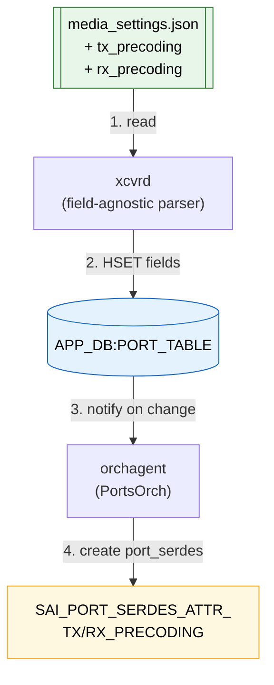

# Configuration of precoding for ASIC SERDES

## Table of Content

- [Configuration of precoding for ASIC SERDES](#configuration-of-precoding-for-asic-serdes)
  - [Table of Content](#table-of-content)
    - [1. Revision](#1-revision)
    - [2. Scope](#2-scope)
      - [2.1 Out-of-Scope](#21-out-of-scope)
    - [3. Definitions](#3-definitions)
    - [4. Background](#4-background)
      - [4.1 Why manual precoding is needed](#41-why-manual-precoding-is-needed)
    - [5. Requirements](#5-requirements)
    - [6. Architecture Design](#6-architecture-design)
    - [7. High-Level Design](#7-high-level-design)
      - [7.1 `media_settings.json` schema additions](#71-media_settingsjson-schema-additions)
      - [7.2 APP DB to SAI Attribute Mapping](#72-app-db-to-sai-attribute-mapping)
    - [8. Configuration and Management](#8-configuration-and-management)
    - [9. Testing](#9-testing)
    - [10. Open Items / Future Work](#10-open-items--future-work)

---

### 1. Revision

| Rev | Date       | Author        | Change Description                                                      |
| --- | ---------- | ------------- | ----------------------------------------------------------------------- |
| 0.1 | 2026-05-12 | Natanel Gerbi | Initial draft.                                                          |


---

### 2. Scope

This HLD covers ASIC/SerDes precoding configuration on platforms where module firmware does not yet support APSU.

In scope:

1. Extending `media_settings.json` with per-lane `tx_precoding` / `rx_precoding` fields.
2. Extending orchagent (PortsOrch) to map the new fields to `SAI_PORT_SERDES_ATTR_{TX,RX}_PRECODING`.
3. Extending APP_DB database scheme with new `tx_precoding` / `rx_precoding` fields.

#### 2.1 Out-of-Scope

This HLD is NOT covering transceiver module precoding.

---

### 3. Definitions

| Term      | Definition |
| --------- | ---------- |
| CMIS      | Common Management Interface Specification |
| APSU      | Autonomous Path Start-Up (IEEE 802.3dj Annex 178B) — end-to-end protocol that extends iLT with in-band precoding negotiation |
| iLT       | Initial Link Training — per-lane electrical handshake between switch SERDES and module host CDR |
| SAI       | Switch Abstraction Interface |

---

### 4. Background

APSU stands for Autonomous Path Start-Up. It is part of IEEE 802.3dj and is used during link bring-up to coordinate link training and precoding across the link.

When APSU is enabled, the link can negotiate the required behavior automatically; when it is disabled, software or firmware must configure precoding manually.

#### 4.1 Why manual precoding is needed

APSU is a capability defined in IEEE 802.3dj and is still being adopted across both ASICs and modules.
Until APSU is supported end to end across the full link path, the system may need to rely on explicit manual precoding configuration instead of autonomous negotiation.

---

### 5. Requirements

| #  | Requirement |
| -- | ----------- |
| R1 | Precoding shall be configured on the ASIC/SERDES side. |
| R2 | The standard SONiC/SAI flow (`media_settings.json` → APP_DB → SAI) shall be used. |
| R3 | The flow shall be a no-op on platforms / modules where `media_settings.json` does not declare precoding fields (backward compatible). |

---

### 6. Architecture Design

End-to-end flow — same path used today by every other SI parameter (`pre1`, `main`, `idriver`, …):



Steps:

1. **xcvrd reads `media_settings.json`** — on module insert (or boot), it locates the entry that matches the inserted module's `<EEPROM_VENDOR_NAME>-<EEPROM_VENDOR_PN>` and active `<SPEED_KEY>`.
2. **xcvrd writes the matched SI fields to `APP_DB:PORT_TABLE|<lport>`** via `HSET`, including the new `tx_precoding` / `rx_precoding` keys when present.
3. **orchagent is notified of the `APP_DB:PORT_TABLE` change**.
4. **orchagent creates the port-serdes SAI object** with the resulting `PortSerdesAttrMap_t`. When `tx_precoding` / `rx_precoding` are set, the map includes `SAI_PORT_SERDES_ATTR_{TX,RX}_PRECODING` and SAI programs the ASIC SerDes accordingly.

---

### 7. High-Level Design

#### 7.1 `media_settings.json` schema additions

Two new keys are added under each `speed:<lane_speed_key>` block, using the same per-lane shape as the existing parameters (`pre1`, `main`, etc.):

- `tx_precoding` — per-lane Tx precoding (`0x0` = NO-CHANGE(ASIC Default), `0x1` = ENABLE, `0x2` = DISABLE).
- `rx_precoding` — per-lane Rx precoding (`0x0` = NO-CHANGE(ASIC Default), `0x1` = ENABLE, `0x2` = DISABLE).

Example — one global entry that matches a specific vendor + PN pattern for ports 1–64 at speed `200GAUI-1`, programming `tx_precoding` and `rx_precoding` to ENABLE on all 8 lanes alongside the existing SI parameters (`pre1`, `main`, …):

```json
{
  "GLOBAL_MEDIA_SETTINGS": {
    "1-64": {
      "VENDOR-MODEL-XX[AB]": {
        "speed:200GAUI-1": {
          "pre1": { "lane0": "0x00000000",
                    "...": "..."
                  },
          "main": { "lane0": "0x0000003f", 
                    "...": "..."
                  },
          "tx_precoding": {
            "lane0": "0x00000001",
            "...": "...",
            "lane7": "0x00000001"
          },
          "rx_precoding": {
            "lane0": "0x00000001",
            "...": "...",
            "lane7": "0x00000001"
          }
        }
      }
    }
  }
}
```

Key shape:

| Element                  | Meaning |
| ------------------------ | ------- |
| `1-64`                   | Front-panel port range the entry applies to. |
| `VENDOR-MODEL-XX[AB]`    | Regex matched against `<EEPROM_VENDOR_NAME_UPPER>-<EEPROM_VENDOR_PN>` of the inserted module. |
| `speed:200GAUI-1`        | Lane-speed bucket — `speed:` + first whitespace-token of CMIS `host_electrical_interface_id`. |
| `lane0` … `lane<N-1>`    | One per-lane value|

#### 7.2 APP DB to SAI Attribute Mapping

| APP_DB:PORT_TABLE field   | `PortSerdes_t` member | SAI attribute                       |
| -------------- | --------------------- | ----------------------------------- |
| `tx_precoding` | `serdes.tx_precoding` | `SAI_PORT_SERDES_ATTR_TX_PRECODING` |
| `rx_precoding` | `serdes.rx_precoding` | `SAI_PORT_SERDES_ATTR_RX_PRECODING` |


---

### 8. Configuration and Management

—

---

### 9. Testing

| # | Test                                              | Validates |
| - | ------------------------------------------------- | --------- |
| UT1 | `portsorch_ut.cpp::PortAdvancedConfig` (extended) | `PortHelper::parsePortSerdes` accepts `tx_precoding` / `rx_precoding`; the resulting SAI attribute map contains `SAI_PORT_SERDES_ATTR_TX_PRECODING` / `RX_PRECODING` with the per-lane values from `APP_DB`. |

---

### 10. Open Items / Future Work

