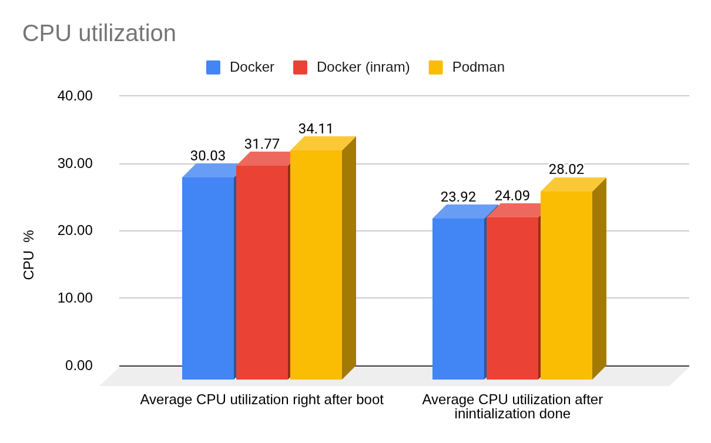
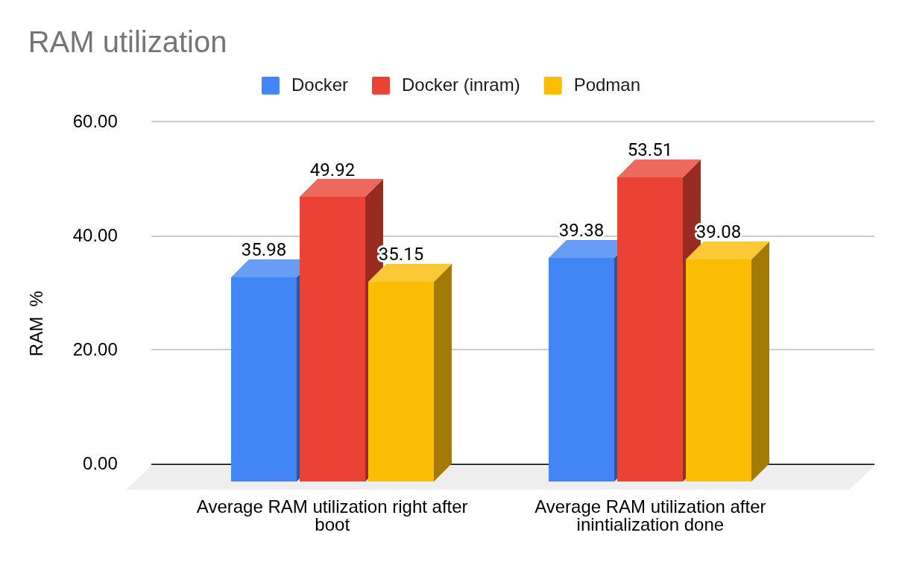
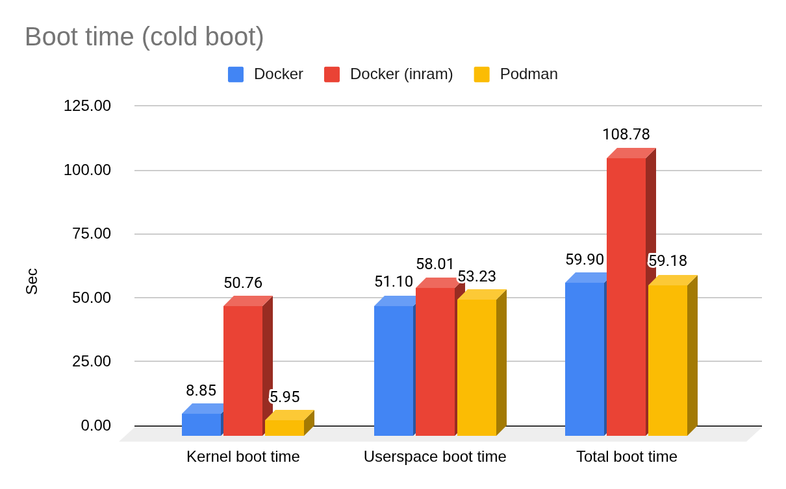
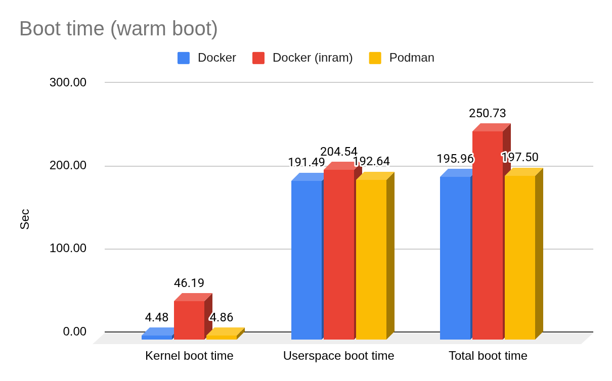
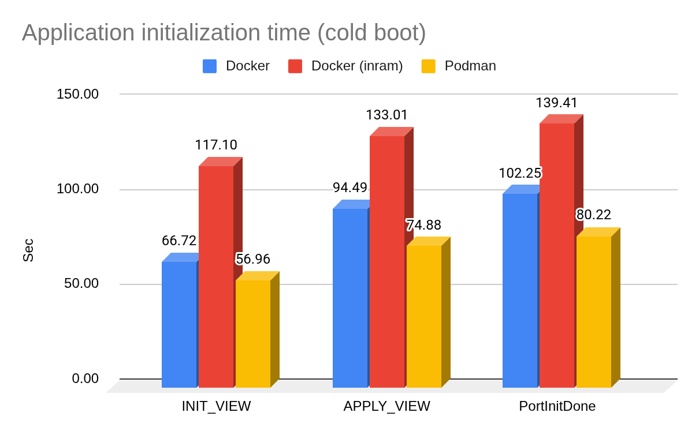
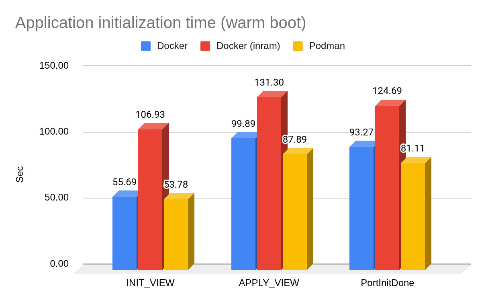
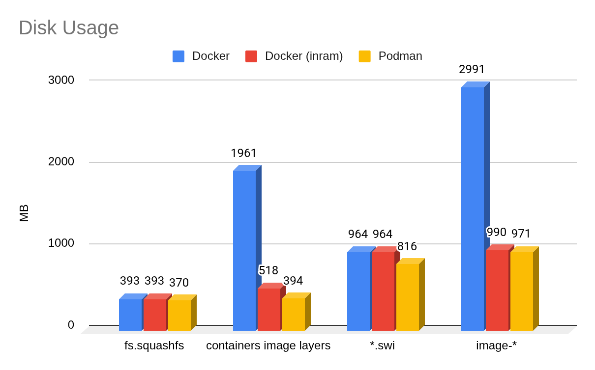

# Podman Container Runtime HLD

## Table of Contents

- [Revision](#revision)
- [Scope](#scope)
- [Definitions/Abbreviations](#definitionsabbreviations)
- [Overview](#overview)
- [Requirements](#requirements)
- [Architecture Design](#architecture-design)
- [High-Level Design](#high-level-design)
    - [Build time](#build-time)
    - [Installation](#installation)
    - [Boot time](#boot-time)
    - [Run time](#run-time)
    - [Compatibility](#compatibility)
- [Resource usage evaluation](#resource-usage-evaluation)
    - [CPU utilization](#cpu-utilization)
    - [RAM Utilization](#ram-utilization)
    - [Boot time](#boot-time-1)
    - [Application initialization time](#application-initialization-time)
    - [Disk Usage](#disk-usage)
- [SWSS and syncd](#swss-and-syncd)
- [Warm reboot / fast reboot](#warm-reboot--fast-reboot)
- [Serviceability and debug](#serviceability-and-debug)
- [SAI API](#sai-api)
- [Configuration and management](#configuration-and-management)
    - [CLI / YANG](#cli--yang)
    - [Config DB](#config-db)
- [Restrictions/Limitations](#restrictionslimitations)
- [Testing](#testing)

## Revision

| **Rev** | **Rev Date** | **Author**                | **Change Description**  |
| ------- | ------------ | ------------------------- | ----------------------- |
| v0.1    | 2026-09-07   | Krzysztof Kościuszkiewicz | Initial draft           |

## Scope

This document outlines **Podman** as an **alternative container management tool** for SONiC, discussing both its advantages and potential drawbacks.

## Definitions/Abbreviations

| **Term**                         | **Definition**                                                                                                                  |
| -------------------------------- | ------------------------------------------------------------------------------------------------------------------------------- |
| **OCI**                          | Open Container Initiative image and runtime specifications.                                                                     |
| **Podman**                       | Daemonless container engine (rootful or rootless) compatible with many Docker workflows.                                        |
| **Docker CE**                    | Docker Engine and CLI as installed from Docker’s Debian repository in the default SONiC build path.                             |
| **`REPLACE_DOCKER_WITH_PODMAN`** | Build-time flag (`y` / `n`) selecting Podman vs Docker for the target filesystem.                                               |
| **`podmanfs.squashfs`**          | A squashfs artifact carrying packaged Podman local storage from image build.                                                    |
| **`dockerfs`**                   | Existing tarball/squashfs path for Docker graph storage in the default layout (unchanged conceptually when Docker is selected). |

## Overview

**Podman** (Pod Manager) is an open-source, **daemonless** container engine oriented toward **OCI**-compliant images on Linux. It is designed as a secure, lightweight alternative to Docker, featuring a near-identical CLI, native Kubernetes pod support, and no background daemon process.

For SONiC, the motivation to evaluate Podman alongside Docker CE includes:

- **Disk and image layout:** Podman supports **additional image stores**, so read-only image data can live outside the primary writable graph (for example on a **compressed squashfs** mount). Keeping layers in compressed, read-only storage can **reduce on-disk footprint** compared to a fully expanded Docker graph on the root filesystem (caused by the overlay-over-overlay issue).
- **Host footprint:** The engine and dependencies pulled into the image can be **smaller** than a typical Docker CE + containerd stack, which may slightly reduce pressure on the root filesystem image (for example `fs.squashfs`), again depending on distro pins and options.
- **Operator familiarity:** Podman’s CLI is intentionally **Docker-like**; workflows that shell out to `docker` can often be preserved via compatibility shims (`docker` as `podman`, socket URL conventions, environment variables), which limits behavioral surprise relative to today’s SONiC images.

Therefore, Podman can be a valuable option for platforms where disk space is limited, providing a more efficient storage footprint at the cost of slightly higher CPU usage.

Community SONiC today assumes a **Docker daemon** on the host, a **Docker CLI** for operators and scripts, and systemd-driven **container lifecycle** glue (for example `docker_image_ctl` and related templates). A Podman-based target would preserve the **same logical service topology** and **OCI images** for control-plane components (swss, syncd, BGP stack, database, PMON, and so on); the change is **which engine runs on the host** and **how image storage is laid out and mounted**, not the applications inside the containers.

## Requirements

These requirements state **intent** for a future community integration; a given branch may implement them incrementally.

1. A **build-time** configuration SHALL be able to select either Docker CE or Podman as the container management engine, with a **default value** - Docker.
2. SONiC OCI service images SHALL load and start under the selected engine **without** changing application logic inside the containers.
3. Host-side tooling that uses the Docker-compatible HTTP API over a Unix socket SHALL work against Podman’s API endpoint when Podman is selected (for example via explicit `base_url` or deterministic filesystem detection).
4. The **installer** payload SHALL remain **self-describing** so install scripts can unpack the correct storage artifacts for the selected engine (exact filenames are implementation-defined but MUST be discoverable from the image layout or metadata).
5. **Initramfs** / early-boot mount logic SHALL mount Podman-specific storage when a Podman image layout is present, and otherwise preserve the existing Docker path.
6. There is no reason to use Docker-in-RAM and Podman at the same time, as both are designed to optimize disk usage through similar mechanisms. When both are selected, the build should fail with an appropriate reason to avoid undefined behaviour/expectation.

## Architecture Design

The SONiC software stack—including swss, syncd, orchagent, BGP stack, PMON, and similar components—remains architecturally unchanged, with processes continuing to run inside containers orchestrated from the host; the only modification is the substitution of the host container engine implementation. No new control-plane feature modules are introduced, and existing integration between image build and on-switch runtime is maintained through established mechanisms such as build templates (`*.j2`), `build_debian.sh`, `slave.mk`, initramfs templates, and the installer.

## High-Level Design

### Build time

At build time, the process for creating application container images remains unchanged. Service images are built using the standard Docker engine and workflows, exactly as in the default Docker-based SONiC builds. This approach maintains compatibility with existing Docker-oriented scripts and CI logic already present in the build environment.

However, during the final root filesystem (rootfs) assembly stage, when the `REPLACE_DOCKER_WITH_PODMAN` option is selected, Podman will be installed in place of Docker as the host container engine with appropriate additional configuration, permissions, groups, systemd services etc. At this point, instead of pre-loading images into the Docker graph root, the built Docker images are loaded into Podman's local storage. This Podman storage (the preloaded image graph root) is then **compressed into a squashfs filesystem artifact** `podmanfs.squashfs`. This squashfs image replaces the legacy `dockerfs.tar.gz` archive in the final SONiC image payload.

This design ensures the build pipeline remains compatible with existing Docker-centric OCI image production while only changing the engine and storage format for the assembled system image when Podman is selected.

### Installation

The installation workflow changes slightly with Podman integration. During installation, the installer script is responsible for detecting which container engine (Docker or Podman) the image was built with. This detection is automatic and relies on the payload layout delivered in the installation media.

- **Payload detection:** The installer inspects the image payload for the presence of engine-specific storage artifacts. If `podmanfs.squashfs` is found, the installer recognizes the target as a Podman-enabled image. If a `dockerfs.tar.gz` is present instead, the installer defaults to Docker.

- **Extraction and mounting:** For Podman-enabled images, the `podmanfs.squashfs` file is extracted to the appropriate image folder without modification. For Docker-based images, the installer extracts the `dockerfs.tar.gz` to the image folder.

This approach allows the same installer logic to seamlessly support both Docker and Podman images, as the provided payload layout is consistent and self-describing.

### Boot time

At boot time, the initramfs system analyzes the image layout and mounts the appropriate image storage accordingly. For Podman-enabled images, it detects the presence of `podmanfs.squashfs` in the image folder and mounts it under `/var/lib/containers_ro,` along with a bind mount of `/host/${image_dir}/containers` to `/var/lib/containers`.

To maintain behavioral parity with Docker, Podman is configured to run as a persistent service using a listening Unix socket. While Podman is natively daemonless and capable of rootless operation, this service-based approach ensures that rootful legacy workflows continue to function as expected within the SONiC environment.

To ensure system stability and minimize the need for sweeping configuration changes, a symbolic link for `docker.service` is created, pointing directly to `podman.service`. This strategy preserves existing boot-time dependencies and ensures that other systemd services relying on a container runtime can initialize correctly without modifying their individual unit files.

### Run time

Podman is configured to use `/var/lib/containers_ro` as an additional image store and `/var/lib/containers` as the main graph root. This setup allows Podman to read image layers directly from a squashfs-backed, read-only filesystem while creating writable container layers on the ext4-backed `/var/lib/containers` directory.

Example Podman configuration:

```
[storage]
driver = "overlay"
graphroot = "/var/lib/containers/storage"
runroot = "/run/containers/storage"

[storage.options]
additionalimagestores = ["/var/lib/containers_ro"]
```

This design avoids the "overlay over overlay" issue, maintaining efficient storage by keeping image layers compressed, while still supporting writable layers on a standard filesystem.

### Compatibility

Podman is designed as a drop-in replacement for Docker and closely emulates its CLI and API. CLI compatibility is achieved simply by providing **`docker` CLI command alias to `podman`**: Tools, scripts, and users that invoke the `docker` command will transparently use Podman instead, receiving the same command output and behavior. If the current approach is insufficient or if critical differences emerge between the Docker and Podman CLIs in the future, **`docker` CLI command alias** could be replaced with a wrapper that will convert outputs and negotiate those differences.

Tools and scripts that communicate with the Docker API over a Unix socket will continue to function, as Podman's API is designed to match the expected Docker API endpoint. Configuring the Podman socket with the same path as in Docker allows for seamless communication with the Podman engine.

These measures ensure that existing workflows, automations, and integrations remain functional when transitioning from Docker to Podman.

## Resource usage evaluation

The evaluation was done on the `x86_64-arista_7060_cx32s` switch and **master(c3ad7a70a)** based images for 3 variants:

- Docker - regular SONiC image.
- Docker (inram) - regular SONiC image with `dockers.tar.gz` compressed on the disk and extracted to ZRAM(zstd compressed RAM partition) on the boot.
- Podman - regular SONiC image with Podman instead of Docker. Image layers are in a zstd compressed squashfs file.

Resource utilization was monitored over a ten-minute interval. All measurements were conducted in three times, and the resulting data was averaged.

### CPU utilization

Both Docker inram and Podman variants use a bit more CPU due to compression overhead. Podman shows the highest usage, **<40%** during the system boot time, then drops to **<30%** after the system is initialized.



### RAM Utilization

Podman variant shows comparatively the same(a bit lower) RAM utilisation as the Docker variant, which is significantly lower than the Docker inram variant.



### Boot time

Boot time in both cases (cold/warm) is slightly lower for the Podman variant, which can be explained by the missing Docker daemon overhead





### Application initialization time

Based on the syslog timestamps for specific syslog messages





### Disk Usage

All variants were built without any additional disk optimisation like `BUILD_REDUCE_IMAGE_SIZE.`

Docker image layers are:

- Docker - uncompressed data.
- Docker (inram) - `dockers.tar.gz` compressed by the gzip algorithm.
- Podman - `podmanfs.squashfs` file with zstd compression.



## SWSS and syncd

**No functional change** is required in swss or syncd **solely** due to Podman selection, beyond whatever is already implied by existing container start ordering and shared volumes.

## Warm reboot / fast reboot

**No functional change** is required in the Warm and Fast reboot flows.

From a performance point of view, the Podman enabled image shows even better initialisation time despite slightly higher CPU usage.

Internal testing shows that during the **advanced warm reboot test**, the longest gap between **LACP** packets on the Podman-enabled image is **\~10 seconds** shorter than on the regular Docker image

## Serviceability and debug

- Operators MAY use `docker` on the PATH (Podman alias) or `podman` directly.
- Logs remain per-container under existing SONiC conventions; engine logs come from `podman` / systemd journal instead of `dockerd`.
- Podman logs directly to syslog

## SAI API

**No SAI API changes** are introduced by replacing Docker with Podman on the host. SAI objects and attributes used by syncd and vendor SAI libraries are unchanged.

## Configuration and management

### CLI / YANG

**No new CLI or YANG** is required for selecting Podman vs Docker; selection is by **image build**. Existing CLIs that shell out to `docker` benefit from the `docker`→`podman` compatibility approach where installed.

No updates to [Command-Reference](https://github.com/sonic-net/sonic-utilities/blob/master/doc/Command-Reference.md) are **mandated** solely for engine swap, except if a future revision documents engine-specific troubleshooting commands explicitly.

### Config DB

**No Config DB schema changes** for engine selection.

## Restrictions/Limitations

SONiC package manager (SPM) compatibility is not expected at this stage and is not part of this document. However, there are no critical issues that would block SPM bringup for Podman-enabled images; it is merely a matter of implementation. The main concern is that, for Podman images, layers are stored in a read-only squashfs file. Extending this would require full decompression, which is unacceptable due to resource constraints.

During migration, Podman only needs to migrate unique image layers, as it can reference common layers in additional storage. At a high level, there are a few possible options:

1. Simply migrate the necessary images to the uncompressed Podman graph root.
2. Define additional storage, migrate the required layers into it, and compress it the same way as during the build. Podman allows the configuration of multiple additional storage locations.

Kubernetes compatibility is not expected at this stage and is not part of this document. While Kubernetes is compatible with Podman, the exact mechanism differs depending on the Kubelet version.

ZTP has a plugin that allows for image updates, which may require modification if such functionality is not provided in the SONiC community. The solution should be similar to what will be used in SPM.

## Testing

From a functional perspective, there should be no differences between SONiC images running Docker and those running Podman. Therefore, no new specific test cases are required solely due to the engine swap. A Podman-enabled SONiC image is expected to pass the same test suites and achieve the same results as a standard Docker-based SONiC image.

However, certain tests remain closely tied to the specific Docker implementation, such as those checking for the existence of the Docker bridge or other low-level technical details. To accurately evaluate Podman-enabled images, these tests may require modifications or extensions.

### Upgrade plan

Upgrading from a Docker-enabled image to a Podman-enabled image is out of scope for this phase and is planned as follow-up work.
