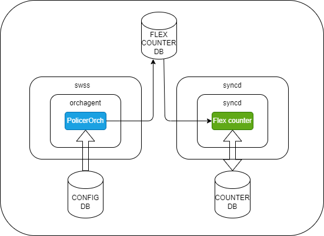
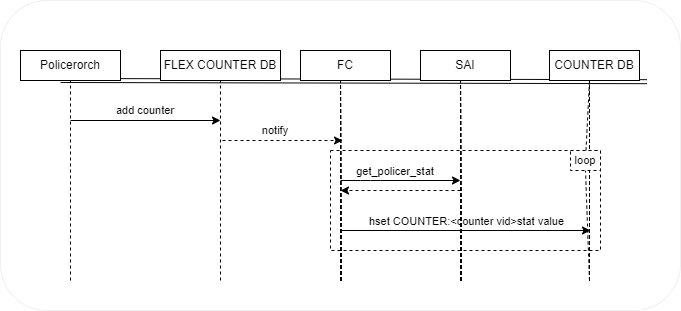
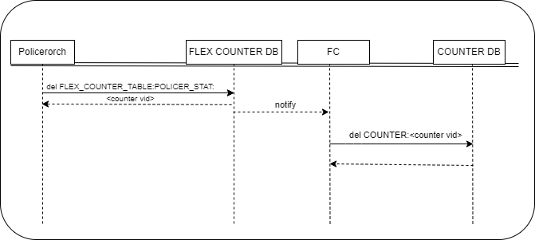

# POLICER Counter #

## Table of Content
* [Revision](#revision)
* [Scope](#scope)
* [Defintions/Abbreviation](#definitionsabbreviation)
* [Overview](#overview)
* [Requirements](#requirements)
* [Architecture Design](#Architecture-Design)
  - [High-Level Design](#High-Level-Design)
  - [Orchagent](#orchagent)
  - [Syncd](#syncd)
  - [SAI APIs](#sai-apis)
  - [Counters DB](#counters-db)
  - [CLI](#cli)
  - [Flows](#flows)
  - [POLICER counter registration in FC](#policer-counter-registration-in-FC)
  - [POLICER counter de-registration in FC](#policer-counter-de-registration-in-FC)
- [Configuration and management](#configuration-management)
  - [CLI/YANG model Enhancements](#cli-yang)
  - [Config DB Enhancements](#config-db)
- [Warmboot and Fastboot Design Impact](#warmboot-fastboot)
- [Restrictions/Limitations](#restrictions-limitations)
- [Testing Requirements/Design](#testing)
  - [Unit Test cases](#unit-test)
  - [System Test cases](#system-test)
- [Open/Action items](#open-item)

### Revision

| Rev |     Date    |       Author       | Change Description                |
|:---:|:-----------:|:------------------:|-----------------------------------|
| 0.1 |             | Shira Ezra         | Initial version                   |

### Scope

This document provides general information about Policer counter feature in SONiC.

### Definitions/Abbreviations 

| Definitions/Abbreviation | Description                                |
|--------------------------|--------------------------------------------|
| API                      | Application Programmable Interface         |
| FC                       | Flex Counter                               | 
| VID                      | SAIRedis Virtual object identifier |
| SAI                      | Switch Abstraction Interface               |

### Overview 

Policer Counters provides a simple and scalable approach for monitoring and analyzing traffic policing statistics. 
This design leverages the existing FC infrastructure, to efficiently collect, process, and store policer statistics such as total packets/bytes and color-based (green/yellow/red) packet/byte counts. By offering real-time visibility into traffic patterns and policy enforcement, this feature enhances network management capabilities, facilitates troubleshooting, and enables fine-tuning of network policies. 

### Requirements

- Support for configuring and managing policer counters through the Flex Counter infrastructure.
- Ability to retrieve policer counter values, including green, yellow, and red packet/byte counters.
- Integration with the existing SONiC Flex Counter configuration and management interfaces.
- Compatibility with the SAI for platform-independent implementation.
- Using the exsiting  ```counterpoll``` CLI command we are adding support for enabling and disabling polling, and changing polling interval, based on user configuration.

### Architecture Design 

No SONiC architecture changes are required as an existing flex counter infrastructure is being used.

### High-Level Design

<p align=center>

</p>

### SAI

The attributes that are being queried:

| SAI Attribute                | Description 
|------------------------------|----------------------|
| SAI_POLICER_STAT_PACKETS  | Get/set packet count | 
| SAI_POLICER_STAT_ATTR_BYTES   | Get/set byte count   |
| SAI_POLICER_STAT_GREEN_PACKETS | Get/set green packet count | 
| SAI_POLICER_STAT_GREEN_BYTES   | Get/set green byte count   |
| SAI_POLICER_STAT_YELLOW_PACKETS | Get/set yellow packet count | 
| SAI_POLICER_STAT_YELLOW_BYTES   | Get/set yellow byte count   |
| SAI_POLICER_STAT_RED_PACKETS | Get/set red packet count | 
| SAI_POLICER_STAT_RED_BYTES   | Get/set red byte count   |

### Orchagent

A new type of FC has been added to flex_counter/flex_counter_manager.h for its corresponding SAI object, along with a new FC group named "POLICER":

Counter Type:
```c++
CounterType::POLICER
```

PolicerOrch holds a new object of type FlexCounterManager and is initialized to ```StatsMode::READ```
and a default polling interval of 10 sec and disable by default:
```c++
FlexCounterManager m_pc_manager;
```

#### Additionally, the following mapping should be added for the CLI:
- "COUNTERS_POLICER_NAME_MAP" - maps the POLICER oid to its name

### Syncd

Added POLICER FC group support in syncd/FlexCounter.cpp.

### SAI API

No new SAI API is needed.

### COUNTERS DB

Counters table in COUNTERS DB:

- "COUNTERS:oid:<policer_counter_vid>"
  - key: SAI_POLICER_STAT_PACKETS
  - value: Get packet count [uint64_t]
  - key: SAI_POLICER_STAT_ATTR_BYTES
  - value: Get byte count [uint64_t]
  - key: SAI_POLICER_STAT_GREEN_PACKETS
  - value: Get green packet count [uint64_t]
  - key: SAI_POLICER_STAT_GREEN_BYTES
  - value: Get green byte count [uint64_t]
  - key: SAI_POLICER_STAT_YELLOW_PACKETS
  - value: Get yellow packet count [uint64_t]
  - key: SAI_POLICER_STAT_YELLOW_BYTES
  - value: Get yellow byte count [uint64_t]
  - key: SAI_POLICER_STAT_RED_PACKETS
  - value: Get red packet count [uint64_t]
  - key: SAI_POLICER_STAT_RED_BYTES
  - value: Get red byte count [uint64_t]

```
; Defines information for policer counter
    key           = "COUNTERS:counter_oid"    ; policer counter statistic
    ;field        = value
    SAI_POLICER_STAT_PACKETS            = number                   ; packets
    SAI_POLICER_STAT_ATTR_BYTES         = number                   ; uint64
    SAI_POLICER_STAT_GREEN_PACKETS      = number                   ; packets
    SAI_POLICER_STAT_GREEN_BYTES        = number                   ; uint64
    SAI_POLICER_STAT_YELLOW_PACKETS     = number                   ; packets
    SAI_POLICER_STAT_YELLOW_BYTES       = number                   ; uint64
    SAI_POLICER_STAT_RED_PACKETS        = number                   ; packets
    SAI_POLICER_STAT_RED_BYTES          = number                   ; uint64
```


```
127.0.0.1:6379[2]> hgetall COUNTERS:oid:0x100000000037a
1) "SAI_POLICER_STAT_PACKETS"
2) "1000"
3) "SAI_POLICER_STAT_ATTR_BYTES"
4) "1024000"
5) "SAI_POLICER_STAT_GREEN_PACKETS"
6) "600"
7) "SAI_POLICER_STAT_GREEN_BYTES"
8) "6144000"
9) "SAI_POLICER_STAT_YELLOW_PACKETS"
10) "300"
11) "SAI_POLICER_STAT_YELLOW_BYTES"
12) "307200"
13) "SAI_POLICER_STAT_RED_PACKETS"
14) "100"
15) "SAI_POLICER_STAT_RED_BYTES"
16) "102400"
```

Mapping hash table in COUNTERS_DB:
- "COUNTERS_POLICER_NAME_MAP"
  - key: POLICER name (e.g: "span_policer")
  - value: OID of the POLICER counter

```
; Defines information for COUNTERS_POLICER_NAME_MAP
    key           = COUNTERS_POLICER_NAME_MAP   ; policer name to its oid
    ;field        = value
    <policer_name_to_counter>        = STRING                  ; name of the policer, value is the counter OID
```

E.g:

```
127.0.0.1:6379[2]> hgetall COUNTERS_POLICER_NAME_MAP
 1) "span_policer"
 2) "oid:0x100000000037a"
```
### Flows

The orchagent read from the CONFIG_DB the policer:

Exmaple for adding policer to mirror sessions:

```
{
    "MIRROR_SESSION": {
        "span": {
            "type": "SPAN",
            "src_port": "Ethernet0",
            "dst_port": "Ethernet1",
            "policer": "span_policer"
        }
    },
    "POLICER": {
        "span_policer": {
        "cbs": "700",
        "cir": "700",
        "color": "aware",
        "meter_type": "packets",
        "mode": "sr_tcm",
        "red_packet_action": "drop" 
        }
    }
}
```


### POLICER counter registration in FC
<p align=center>

</p>


### POLICER counter de-registration in FC
<p align=center>

</p>

### CLI

The *policerstat* utility is added to reads counters from the COUNTERS DB using the POLICER table in CONFIG DB and the COUNTERS_POLICER_NAME_MAP. It maps each POLICER to its VID and fetches counter values. If a map entry or VID is missing, it shows N/A, indicating either the POLICER was created without a counter, the policer/map entry isn't created yet, polling is disabled, or syncd hasn't updated the COUNTERS DB.

```
admin@sonic:~$ policerstat 
  Name        Green Packets    Green Bytes    Yellow Packets    Yellow Bytes    Red Packets   Red Bytes
-------      ---------------  -------------  ----------------  --------------- ------------- ------------
span_policer     600             6144000            300             307200           100           102400

```

Added a flag in  ```show policer``` to show policer counter
```
show policer -c [policer_name]
```

Added a new CLI command - uses the policerstat utility
```
sonic-clear policercounters [policer_name]
```

### Configuration and management 
#### CLI/YANG model Enhancements 
#### Config DB Enhancements  

Enable POLICER counter polling:
```
admin@sonic:~$ counterpoll policer enable
```

Disable POLICER counter polling (NOTE: POLICER counter objects are still configured in HW):
```
admin@sonic:~$ counterpoll policer disable
```

Set POLICER counter polling interval:
```
admin@sonic:~$ counterpoll policer interval [INTERVAL IN MS]
```

Config DB schema with POLICER key in FLEX COUNTER table:

```json
{
    "FLEX_COUNTER_TABLE": {
        "POLICER": {
            "FLEX_COUNTER_STATUS": "enable",
            "POLL_INTERVAL": "10000"
        }
    }
}
```

Flex Counter YANG model with POLICER group:

```yang
  container POLICER {
      /* POLICER_FLEX_COUNTER_GROUP */
      leaf FLEX_COUNTER_STATUS {
          type flex_status;
      }
      leaf FLEX_COUNTER_DELAY_STATUS {
          type flex_delay_status;
      }
      leaf POLL_INTERVAL {
          type poll_interval;
      }
  }
```
		
### Warmboot and Fastboot Design Impact  

Counter polling is delayed at system startup.

### Restrictions/Limitations  
* Policers must be supported
* Color based policing must be supported

### Testing Requirements/Design  

#### Unit Test cases  

##### sonic-utilities

CLI Level Tests:

1. TestCounterpoll::test_update_policer_counter_status (Add new case for `counterpoll policer <status>`)
    - Verify command run successfully with valid parameter enable/disable
    - Verify CONFIG DB is correctly updated

2. TestCounterpoll::test_update_policer_counter_interval (Add new case for `counterpoll policer interval <time_in_msec>`)
    - Verify command run successfully with valid parameter (interval value in allowed range)
    - Verify CONFIG DB is correctly updated
    - Verify command abort with invalid parameter

3. TestCounterpoll::test_show (Extend existing case for `counterpoll show`)
    - Verify new counter group is in the output

4. TestPolicerStat::show_pattern (Add new case for `policerstats`)
    - Verify command output with normal format
    - Verify command output with JSON format

5. TestPolicerStat::show_policer (Add new case for `show policer -c [policer_name]`)
    - Verify command output with normal format
    - Verify command output with JSON format

6. TestPolicerStat::clear_policer (Add new case for `sonic-clear policercounters [policer_name]`)
    - Verify stats value can be cleared


##### sonic-swss

Functional Tests: 

1. TestFlexCounters::test_flex_counters (Extend existing case)
    - Enable policer counter group
    - Verify new entry in FLEX_COUNTER_TABLE and name map
    - Set policer counter group interval
    - Verify interval value in FLEX_COUNTER_GROUP_TABLE
    - Disable trap counter group
    - Verify the counter group is disabled and all data in DB are cleared

2. TestFlexCounters::test_add_remove_counter
    - Enable policer counter group and set policer
    - Verify counter automatically bind
    - Remove the policer
    - Verify counter is automatically unbind


#### System Test cases

- POLICER tests suite in sonic-mgmt covers the POLICER counter functionality.
- Warm/Fast reboot tests to check the changes do not break these features.


