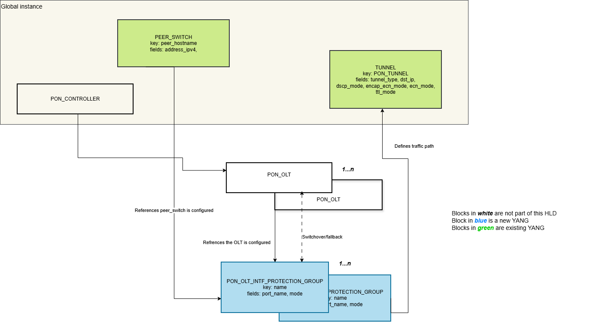

# Dual Homed PON Gateway

## Table of Contents

- [1. Revision History](#1-revision-history)
- [2. Scope](#2-scope)
- [3. Definitions and Abbreviations](#3-definitions-and-abbreviations)
- [4. Overview](#4-overview)
  - [4.1 Introduction](#41-introduction)
  - [4.2 Network Design](#42-network-design)
  - [4.3 Protection](#43-protection)
- [5. Requirement](#5-requirement)
- [6. Architecture Design](#6-architecture-design)
- [7. Configuration and management](#7-configuration-and-management)
  - [7.1 Configuration model](#71-configuration-model)
  - [7.2 YANG model and Configuration Example](#72-yang-model-and-configuration-example)
    - [7.2.1 PON Protection Group](#721-pon-protection-group)
    - [7.2.2 CONFIG\_DB example](#722-config_db-example)
  - [7.3 CLI Commands](#73-cli-commands)
    - [CLICK-based](#click-based)
    - [KLISH-based](#klish-based)
  - [7.4 CONFIG\_DB](#74-config_db)
  - [7.5 APPL\_DB](#75-appl_db)
  - [7.6 STATE\_DB](#76-state_db)
- [8. High-Level Design](#8-high-level-design)
  - [8.1 Modules](#81-modules)
    - [8.1.1 PON Protection Daemon (ponprotd)](#811-pon-protection-daemon-ponprotd)
    - [8.1.2 PON Sync Daemon (dcpon-syncd)](#812-pon-sync-daemon-dcpon-syncd)
    - [8.1.3 PON Orchestrator (PonOrch)](#813-pon-orchestrator-ponorch)
  - [8.2 Component Interaction Flow](#82-component-interaction-flow)
  - [8.3 Standby to Active OLT Interface transitions](#83-standby-to-active-olt-interface-transitions)
  - [8.4 Failover Scenarios Handling](#84-failover-scenarios-handling)
    - [8.4.1 Ethernet Interface Failure - Active OLT interface](#841-ethernet-interface-failure---active-olt-interface)
    - [8.4.2 Ethernet Interface Failure - Standby OLT interface](#842-ethernet-interface-failure---standby-olt-interface)
    - [8.4.3 Active OLT Interface Failure](#843-active-olt-interface-failure)
  - [8.5 Traffic Shift Away (TSA) Handling](#85-traffic-shift-away-tsa-handling)
    - [Gateway](#gateway)
    - [Peer Gateway](#peer-gateway)
- [9. SAI APIs](#9-sai-apis)
  - [9.1 New SAI APIs](#91-new-sai-apis)
  - [9.2 Existing SAI APIs Reused](#92-existing-sai-apis-reused)
- [10. Warmboot and Fastboot design impact](#10-warmboot-and-fastboot-design-impact)
  - [10.1 Fastboot/Cold Boot](#101-fastbootcold-boot)
  - [10.2 Warmboot](#102-warmboot)
- [11. Memory consumption](#11-memory-consumption)
- [12. Restrictions and Limitations](#12-restrictions-and-limitations)
- [13. Testing Requirements](#13-testing-requirements)
  - [13.1 Unit Tests](#131-unit-tests)
    - [SWSS Unit Tests](#swss-unit-tests)
    - [Data Plane Tests](#data-plane-tests)
  - [13.2 System Test Cases](#132-system-test-cases)

## 1. Revision History

| Rev | Date | Author | Description |
| --- | --- | --- | --- |
| 0.1 | 2026-06-08 | Anurag Prakash, Ciena | Initial draft |

## 2. Scope

This document describes the high-level design of a Dual Homed Gateway with active/standby OLT interface solution leveraging PON for interconnecting Gateway switches to servers and other devices.

## 3. Definitions and Abbreviations

| Term | Definition |
| --- | --- |
| ponprotd | PON Protection Daemon — the new standalone forwarding decision daemon. |
| OLT Interface State | Observed role of the local OLT interface: ACTIVE / STANDBY / UNKNOWN — FSM dimension 1. |
| Link State | Ethernet Interface State - Physical uplink state: UP / DOWN — FSM dimension 2. |
| Composite State | Composite State - ACTIVE / STANDBY / UNKNOWN. Derived from 2-tuples: OLT Interface State, Link State. |
| PonOrch | New Orch class inside Orchagent for programming forwarding entries. |
| TNH | Tunnel next hop. |
| TSA | Traffic Shift Away — operator initiated or network convergence drain action. |

## 4. Overview

### 4.1 Introduction

The Dual Homed Gateway PON deployment utilizes a Point-to-Multipoint (P2MP) architecture, connecting Gateway switches to multiple servers/devices through passive splitters. The primary components include:

- Optical Line Terminal (OLT): The PON head-end device.
- Optical Network Unit (ONU): A PON subscriber-side endpoint.
- Optical Distribution Network (ODN): This is the physical fiber infrastructure between the OLT and ONU.
- Passive Optical Splitters: This component divides the signal from one fiber into multiple paths, allowing one OLT port to provide connectivity to multiple ONUs.
- Optical Fiber Cables: Single-mode fiber cables that transmit light, using wavelength division multiplexing (WDM) to separate downstream and upstream data.

The diagram below illustrates the connectivity model between the Gateway switches and servers/devices where PON is leveraged for connectivity:


### 4.2 Network Design

- An OLT interface will be deployed on each of the Dual Homed PON Gateway switches.
  - The OLT Interface on one Gateway will be in active mode. The associated Ethernet interface will be UP.
  - The OLT Interface on another Gateway will be in standby mode. The associated Ethernet interface will be UP.
- Gateway Configuration
  - Both OLT interfaces will have the same VLAN and Virtual MAC configuration for OLT interfaces.
  - Both OLT interfaces will advertise the same IPv4 and IPv6 addresses associated with the VLAN interfaces to upstream routers.
  - Upstream routers will see two available next hops to reach servers/devices.
- Downstream Traffic (Gateway to Server/Device)
  - Upstream routers distributes traffic to both Gateway switches.
  - The Active OLT interface send traffic to downstream servers/devices directly.
  - The standby OLT interface will forward all traffic destined to downstream servers/devices towards the Gateway switch with the active OLT interface using an IPinIP tunnel.
- Upstream Traffic (Server/Device to OLT interface)
  - Servers send traffic upstream to the ONU.
  - Although the passive optical splitter provides a physical path to both OLT interfaces, only the active OLT interface maintains the PON protocol session (ONU registration, ranging, and Dynamic Bandwidth Allocation) with the ONUs.
  - The standby OLT interface does not grant upstream timeslots to the ONUs.
  - Therefore, upstream traffic from ONUs is only received by the active OLT interface.

### 4.3 Protection

- Overview
  - The OLT interface Active Standby mode is a redundancy mechanism designed to ensure high availability and network reliability.
  - It operates to provide seamless failover between an active and a standby Optical Line Terminal (OLT) port.
  - When the active OLT interface fails or OLT fails, the system automatically switches to the standby OLT interface or standby OLT to maintain connectivity.
- Protection BehaviorStandby OLT Interface → ActiveONU
  - Active OLT Interface → Fails
    - When the active OLT interface fails, the OLT interface state transition triggers the Gateway to remove the direct routes associated with the failed interface and install IPinIP tunnel routes, redirecting traffic to the peer Gateway that hosts the Standby OLT interface.
  - Standby OLT Interface → Active
    - The Standby OLT interface detects the active OLT interface failure and turns on its laser to become active.
    - When the Standby OLT interface transitions to Active, the Gateway removes the IPinIP tunnel routes and installs direct routes, forwarding traffic directly to the newly active OLT interface towards the Server/device.
  - ONU
    - The ONU sees light from the newly active OLT interface and registers with the OLT to resume packet forwarding.

## 5. Requirement

Ability to switch to a backup OLT interface on peer Gateway switch when there is failure on local Gateway OLT interface.

## 6. Architecture Design

Below diagram illustrates the integration of Dual Home PON (Passive Optical Network) Gateway with SONiC architecture. It provides an overview of the interactions between existing SONiC components, newly introduced modules for Dual Homed PON Gateway solution, and vendor-specific elements.


| Label | Path | Description |
| --- | --- | --- |
| A | CONFIG_DB → ponprotd | Config updates for PEER_SWITCH and PON_OLT_INTF_PROTECTION_GROUP. |
| B | STATE_DB → ponprotd | State change updates for OLT interface and associated switch port. |
| C | ponprotd → APPL_DB | Composite protection state updates from ponprotd FSM. |
| D | APPL_DB → PonOrch | Protection state change updates for the OLT interface. |
| E | PonOrch → ASIC_DB | Route updates based on OLT interface protection state. |

## 7. Configuration and management

### 7.1 Configuration model

Each container and their leaf shown here are to describe their relationship with the other containers in order to represent the Dual Homed PON Gateway configuration.

The list of yang containers are:

1. PON_CONTROLLER — Configures the local PON management instance (logging, ONUs discovery, mgmt interface) that discovers OLTs and registers XGS-PON ONUs.
2. PEER_SWITCH — Identifies the partner switch (hostname, loopback IPv4) used for controller-level HA and installing the tunnel.
3. PON_OLT — Per-OLT configuration bound to a switch front-panel port, holding XGS-PON parameters (FEC, encryption, framing, ranging) and protection attributes for the OLT.
4. PON_OLT_INTF_PROTECTION_GROUP — Defines a local OLT interface with failover policy (mode).
5. TUNNEL — Carries the underlay tunnel between the two controllers/switches over which traffic is redirected from peer gateway to local Gateway switch.



The main function and relationships are as follows:

| # | Functional area | Description |
| --- | --- | --- |
| 1. | Control | PON_CONTROLLER drives policy and maps controller-to-OLT role. |
| 2. | Protection | The PON_OLT_INTF_PROTECTION_GROUP holds configuration (port and mode) for each OLT interface. |
| 3. | Traffic context | TUNNEL \| PON_TUNNEL which is an IPinIP Tunnel used for redirecting traffic to the active OLT interface. |

### 7.2 YANG model and Configuration Example

Below is a new YANG models using SONiC terminology for sonic-pon-olt-intf-protection-group.yang

#### 7.2.1 PON Protection Group

```
module: sonic-pon-olt-intf-protection-group
    +--rw sonic-pon-olt-intf-protection-group
       +--rw PON_OLT_INTF_PROTECTION_GROUP
          +--rw PON_OLT_INTF_PROTECTION_GROUP_LIST* [name]
             +--rw name             string
             +--rw port             -> /prt:sonic-port/prt:PORT/prt:PORT_LIST/prt:name
             +--rw mode?            enumeration
```

**Amendment #1** The TUNNEL information uses the existing sonic-tunnel.yang, and everything stays the same in sonic-tunnel with small extension in the key for PON Tunnel description.

```
         container TUNNEL {
			description "TUNNEL configuration for DualToR and Dual Homed PON Gateway solution";
             list TUNNEL_LIST {
                 key "mux_tunnel";

                 leaf mux_tunnel {
					description "Tunnel name. Supports MuxTunnelN and PON_TUNNEL.";
                     type string {
						pattern "MuxTunnel[0-9]+|PON_TUNNEL[0-9]+";
                     }
```

#### 7.2.2 CONFIG_DB example

```
{
"//1": "===== Reused from existing SONiC config (DEVICE_METADATA) =====",
    "DEVICE_METADATA|localhost": {
        "peer_switch": "sonic-peer-02"
    },

"//2": "===== Reused from existing SONiC config (PORT, VLAN_SUB_INTERFACE, TUNNEL, PEER_SWITCH) =====",

    "PORT": {
        "Ethernet0": {
            "admin_status": "up",
            "alias": "Eth0",
            "index": "0",
            "lanes": "0,1,2,3",
            "mtu": "9100",
            "speed": "100000"
        },
        "Ethernet4": {
            "admin_status": "up",
            "alias": "Eth4",
            "index": "1",
            "lanes": "4,5,6,7",
            "mtu": "9100",
            "speed": "100000"
        }
    },

    "VLAN_SUB_INTERFACE": {
        "Eth0.100": {
            "admin_status": "up",
            "vlan": "100"
        },
        "Eth0.100|172.16.10.1/24":        {},
        "Eth0.100|fd00:10::1/64":         {},
        "Eth0.200": {
            "admin_status": "up",
            "vlan": "200"
        },
        "Eth0.200|172.16.20.1/24":        {},
        "Eth0.200|fd00:20::1/64":         {},
        "Eth4.300": {
            "admin_status": "up",
            "vlan": "300"
        },
        "Eth4.300|172.16.30.1/24":        {},
        "Eth4.300|fd00:30::1/64":         {},
        "Eth4.400": {
            "admin_status": "up",
            "vlan": "400"
        },
        "Eth4.400|172.16.40.1/24":        {},
        "Eth4.400|fd00:40::1/64":         {}
    },

   "TUNNEL": {
        "PON_TUNNEL0": {
            "tunnel_type":    "IPinIP",
            "src_ip":         "10.0.0.1",
            "dst_ip":         "10.0.0.2",
            "dscp_mode":      "uniform",
            "encap_ecn_mode": "standard",
            "ecn_mode":       "copy_from_outer",
            "ttl_mode":       "pipe"
        }
    },

    "PEER_SWITCH": {
        "sonic-peer-02": {
            "address_ipv4":  "10.0.0.2"
        }
    },

 "//3": "PON_OLT_INTF_PROTECTION_GROUP references existing DEVICE_METADATA, PORT, TUNNEL, and PEER_SWITCH entries. server_ipv4/server_ipv6 are derived from VLAN_SUB_INTERFACE prefixes.",
    "PON_OLT_INTF_PROTECTION_GROUP": {
        "pg-pon-01": {
            "port":           "Ethernet0",
            "mode":           "auto"
        },

        "pg-pon-02": {
            "port":           "Ethernet4",
            "mode":           "auto"
        }
    }
}

```

### 7.3 CLI Commands

#### CLICK-based

###### Config Commands

```
config pon protection-group add  <name> --port <Ethernet#> [--mode auto]
config pon protection-group set  <name> [--mode ...]
config pon protection-group del  <name>
```

###### Show commands

```
! Configuration
show pon protection-group         [<name>]

! Operational state
show pon protection-group state   [<name>]

! Detail / relationships
show pon protection-group members <name>
```

#### KLISH-based

###### Config Commands

```
sonic#                                  exec
sonic# configure terminal               → sonic(config)#
sonic(config)# pon protection-group <n> → sonic(config-pon-pg-<n>)#

An example configuration,
sonic(config)# pon protection-group pg-pon-01
sonic(config-pon-pg-pg-pon-01)# port Ethernet0
sonic(config-pon-pg-pg-pon-01)# mode auto
sonic(config-pon-pg-pg-pon-01)# commit
sonic(config-pon-pg-pg-pon-01)# exit

sonic(config)# no pon protection-group pg-pon-01
```

###### Show commands

```
! Configuration
show pon protection-group                 [<name>]

! Operational state
show pon protection-group state           [<name>]

! Detail / relationships
show pon protection-group members <name>

```

### 7.4 CONFIG_DB

| New/Existing Key | Table | Key | Field | Description |
| --- | --- | --- | --- | --- |
| New | PON_OLT_INTF_PROTECTION_GROUP | &lt;protection_intf_group_name&gt; |  | Protection group per OLT interface |
|  |  |  | port | port; port name |
|  |  |  | mode | "auto": Automatic detection of OLT Interface failures and recovery to initiate the dynamic reroute of traffic |
| Existing | PEER_SWITCH | &lt;switchname&gt; |  |  |
|  |  |  | address_ipv4 | IPv4 address; // peer Gateway ip address |
| Existing | TUNNEL | &lt;pon_tunnel&gt; |  |  |
|  |  |  | tunnel_type | "IPinIP" |
|  |  |  | src_ip | IPv4 address; // self-loopback address |
|  |  |  | dst_ip | IPv4 address; // Peer loopback address |
|  |  |  | dscp_mode | "uniform" |
|  |  |  | encap_ecn_mode | "standard" |
|  |  |  | ecn_mode | "copy_from_outer" |
|  |  |  | ttl_mode | "pipe" |
| Existing | DEVICE_METADATA | &lt;localhost&gt; |  |  |
|  |  |  | type | "ToRRouter" |
|  |  |  | peer_switch | hostname of peer switch |
| Existing | BGP_DEVICE_GLOBAL | &lt;state&gt; |  |  |
|  |  | &lt;tsa_enabled&gt; |  | "true \| false" |

### 7.5 APPL_DB

| New/Existing Key | Table | Key | Field | Description |
| --- | --- | --- | --- | --- |
| New | PON_OLT_INTF_PROTECTION_TABLE | &lt;portname&gt; |  | ponprotd notifies PonOrch to update route next hop targets (direct/tunnel) |
|  |  |  | state | "active \| standby \| unknown" |
|  |  |  | direction | "direct \| tunnel" |
|  |  |  | reason | "olt_intf_state \| tsa \| link_down \| commanded" |
|  |  |  | state_change_time | timestamp; |
| New | PON_OLT_INTF_PROTECTION_SWITCH_CMD | &lt;state&gt; |  | ponprotd notifies ponOrch to perform a switchover on active OLT interfaces for TSA events |
|  |  |  | role_switch_cmd | "enable \| disable" |

### 7.6 STATE_DB

| New/Existing Key | Table | Key | Field | Description |
| --- | --- | --- | --- | --- |
| New | HW_PON_OLT_INTF_PROTECTION_TABLE | &lt;portname&gt; |  | After successful route programming in ASIC, Orchagent uses this table to maintain health status |
|  |  |  | state | "active \| standby \| unknown" |
|  |  |  | state_change_time | timestamp; |
| New | PON_OLT_INTF_PROTECTION_RT_TABLE | &lt;portname&gt; |  | Control plane view of composite state and health |
|  |  |  | olt_intf_state | "active \| standby \| unknown" |
|  |  |  | link_state | "up \| down" |
|  |  |  | tsa_active | "true \| false" |
|  |  |  | composite_state | "active \| standby \| unknown"; |
|  |  |  | health | "healthy \| unhealthy" |
| New | PON_OLT_INTF_PROTECTION_STATE | &lt;portname&gt; |  | OLT interface state written by ponOrch |
|  |  |  | olt_intf_state | "active \| standby \| unknown" |
| New | PON_OLT_INTF_PROTECTION_METRICS_TABLE | &lt;portname&gt; |  | Per-switchover metrics updated by ponprotd. |
|  |  |  | switchover_start | timestamp; |
|  |  |  | switchover_end | timestamp; |
|  |  |  | switchover_count | Counter to track the switchover events |
| Existing | PORT_TABLE | &lt;portname&gt; |  | Ethernet interface state from portSyncd |
|  |  |  | netdev_oper_status | "up \| down" |

## 8. High-Level Design

### 8.1 Modules

The key Dual Homed PON Gateway components involved in a traffic forwarding and switchover are:

1. PON protection daemon (ponprotd)
2. PON sync daemon (dcpon-syncd)
3. PON orchestrator (PonOrch)

Note: The REDIS tables (`PON_OLT_INTF_STATE_LIST`, `protection-status`) and its values referenced in below sections are defined in the companion `pon_hld.md`; this document only describes their consumption by the Dual Homed PON Gateway protection flow.

#### 8.1.1 PON Protection Daemon (ponprotd)

To support Dual Homed PON Gateway solution - a new standalone daemon `ponprotd` is introduced that is the authority for programming routing entries related to OLT interfaces. `ponprotd` is created for PON semantics with a dedicated FSM-driven architecture. The `ponprotd` includes the following:

- ponprotd owns the composite state (derived from OLT Interface State, Link State) per protection group.
- ponprotd is the single writer of forwarding state to APPL_DB and STATE_DB.
- ponprotd operates as a new subsystem.

##### 8.1.1.1 ponprotd FSM Dimensions

`ponprotd`'s FSM is a **2-dimensional composite state machine**. The two dimensions are the OLT Interface State and Link State inputs that drive the FSM and produces the forwarding decision:

| Dimension | ponprotd | Possible Values | Key - Source |
| --- | --- | --- | --- |
| OLT Interface State | OLT interface state | ACTIVE, STANDBY, UNKNOWN | STATE_DB:PON_OLT_INTF_PROTECTION_STATE - PonOrch |
| Link State | Physical uplink state | UP, DOWN | STATE_DB:PORT_TABLE - orchagent/portSyncd |

The **Forwarding Decision** maps from composite state:

| Forwarding Decision | Action |
| --- | --- |
| DIRECT | Forward locally — no tunnel, PON-A serves ONUs |
| TUNNEL | IPinIP tunnel to peer — install tunnel routes |

##### 8.1.1.2 Composite State FSM Diagram


##### 8.1.1.3 Composite State and Transition Table

There are 3 composite states values (ACTIVE, STANDBY and UNKNOWN), each mapped to a deterministic forwarding decision (direction):

Health definition:

- The health determines the desired state of the Dual Homed PON Gateway system.
- Health is a per-protection-group indicator that reflects whether the data plane is consistent with the current control plane forwarding decision.
- ponprotd sets health to unhealthy immediately on every FSM state transition. Once the desired states of the system is achieved then health becomes healthy.

| # | OLT Interface State | Link State | Composite State | Action | Health | APPL_DB | STATE_DB |
| --- | --- | --- | --- | --- | --- | --- | --- |
| 1 | ACTIVE | UP | ACTIVE | Steady state - Normal Operation | healthy | state=active, direction=direct | composite state=ACTIVE, health=healthy |
| 2 | STANDBY | UP | STANDBY | Steady state - Normal Operation | healthy | state=standby, direction=tunnel | composite state=STANDBY, health=healthy |
| 3 | UNKNOWN | UP | UNKNOWN | Switch to protection | unhealthy | state=unknown, direction=tunnel, reason=olt_intf_state | composite state=UNKNOWN, health=unhealthy |
| 4 | ACTIVE | DOWN | UNKNOWN | Switch to protection | unhealthy | state=unknown, direction=tunnel, reason=link_state | composite state=UNKNOWN, health=unhealthy |
| 5 | STANDBY | DOWN | UNKNOWN | Switch to protection | unhealthy | state=unknown, direction=tunnel, reason=link_state | composite state=UNKNOWN, health=unhealthy |
| 6 | UNKNOWN | DOWN | UNKNOWN | Switch to protection | unhealthy | state=unknown, direction=tunnel, reason=olt_intf_state\|link_state | composite state=UNKNOWN, health=unhealthy |

##### 8.1.1.4 Boot and Initialization Sequence

1. ponprotd starts
2. Load CONFIG_DB: PON_OLT_INTF_PROTECTION_GROUP, DEVICE_METADATA, PEER_SWITCH
   → set mComponentInitState bit0 (ConfigLoaded)
3. Subscribe STATE_DB:
     PON_OLT_INTF_PROTECTION_STATE           → OLT interface State(Dimension 1, written by PonOrch)
     PORT_TABLE                         → Link State (Dimension 2, written by orchagent/portsyncd)
     HW_PON_OLT_INTF_PROTECTION_TABLE        → HwOltStateEvent (SAI ACK feedback from PonOrch)
   Subscribe CONFIG_DB:
     BGP_DEVICE_GLOBAL|STATE → TSA event handler (field: tsa_enabled)
4. Read initial OLT Interface State from STATE_DB (written by PonOrch)
   → set mComponentInitState bit1 (OltIntfState Seed)
5. Read initial Link State from STATE_DB PORT_TABLE
   → set mComponentInitState bit2 (LinkState Seed)
6. Read BGP_DEVICE_GLOBAL|STATE: if tsa_enabled=true → set tsa_active=true
   (defaults to tsa_active=false)
7. Both bits set → FSM activates:
   Evaluate initial composite state
   Apply tsa_active flag to health
   → enter into desired composite steady states
8. Write PON_OLT_INTF_PROTECTION_RT_TABLE: composite_state, tsa_active, health=unhealthy
   (health remains unhealthy until HW_PON_OLT_INTF_PROTECTION_TABLE confirms direct/tunnel route programming)
9. ponprotd begins normal event-driven operation

#### 8.1.2 PON Sync Daemon (dcpon-syncd)

- The dcpon-syncd daemon, during its initialization, registers a callback with the vendor SDK to get the port name and OLT interface state (Active/Standby/Unknown) information. The below diagram captures the flow for updating the OLT Interface state into the STATE_DB.

##### 8.1.2.1 Data flow diagram


##### 8.1.2.2 Operations

| # | Operation | STATE_DB data |
| --- | --- | --- |
| 1. | OLT interface config added | Table PON_OLT_INTF_STATE_LIST is updated with port name and OLT Interface state as Standby/Unknown. |
| 2. | OLT interface config removed | Corresponding port entry is removed from PON_OLT_INTF_STATE_LIST . |
| 3. | OLT Interface State active | Table protection-status is updated with port name and OLT Interface state as Active. |
| 4. | OLT Interface State standby | Table protection-status is updated with port name and OLT interface state as Standby. |
| 5. | OLT plug pulled out/port admin down | The FSM will move based on link state (DOWN). |
| 6. | OLT plug inserted/port admin up | The FSM will move based on link status (UP). |

#### 8.1.3 PON Orchestrator (PonOrch)

- The Orchestration Agent (OrchAgent) is responsible for programming IP routes and tunnels on the Gateway to control traffic forwarding to servers/devices.
- New OrchAgents will be introduced to support a Dual Homed PON Gateway solution in conjunction with an OLT interface active/standby solution.
  - PonProtCfgOrch subscribes to the CONFIG_DB updates related to the Dual Homed PON Gateway solution.
  - PonProtSwoOrch subscribes to the APPL_DB updates for OLT interface active/standby state changes.

##### 8.1.3.1 OrchAgent: Config update sequence (PonProtCfgOrch)

- Peer Switch Configuration
  - Peer switch configuration identifies the peer Gateway switch and creates IPinIP tunnels between the Gateway switches.
  - IPinIP tunnel creation leverages the SAI_TUNNEL_ATTR_LOOPBACK_PACKET_ACTION attribute during tunnel creation to prevent looping or unintended packet re-encapsulation when both OLT ports are in the standby state.
  - When PEER_SWITCH is configured, tunnel is created which is referred in PonProtCfgOrch to create the TNH id.
- PON Protection Group Configuration
  - The PON-Protection group configure a OLT port as part of the PON protection group.
  - Each OLT port in the protection group will have an initial default state of standby.
  - In the standby state, traffic destined for the standby OLT port are re-directed via the tunnel to forward traffic to the peer Gateway.


##### 8.1.3.2 OrchAgent: State update sequence (PonProtSwoOrch)

- On Active OLT interface state notification for a OLT port:
  - Enable neighbor.
  - Update the associated routes to use directly connected local interface instead of TNH.
  - Delete tunnel route for all neighbor prefixes.
- On Standby OLT interface state notification for a OLT port:
  - Update the associated routes to use TNH instead of neighbor NH.
  - Create tunnel route for all neighbor prefixes.
  - Disable neighbor.


##### 8.1.3.3 OrchAgent:  IPinIP Tunnel Route Programming

The diagram below provides a configuration example of Gateway (G-B) with the PON OLT protection group in a standby state illustrating the IPinIP tunnel which redirects traffic to the other Gateway switch (G-A).

- Neighbors that are part of the IP subnet configured on Gateway (G-B) port with the OLT Interface in a standby state will be redirected via the IPinIP tunnel.


##### 8.1.3.4 Special cases of Neighbor handling

- The neighbor handling mechanism is adapted from the SONiC DualToR solution - Active ToR: Neighbor miss after decap of tunneled packets
- In DualToR, when the Active ToR decapsulates tunneled packets from the Standby ToR, it must resolve the server neighbor before forwarding. Similarly, in this design, when an active OLT interface decapsulates packets tunneled from a standby OLT interface, it must resolve the neighbors behind the OLT interface.

### 8.2 Component Interaction Flow

- The design follows SONiC conventions: Redis DB-centric state management.
- The following diagram illustrates the component interaction flow for a boot and steady states.
- Health transition rule:
  - ponprotd changes the healthy to be unhealthy immediately on any FSM state entry.
  - PonOrch provides an acknowledgement after the SAI API successfully updates routes for directly connected interfaces or IP-in-IP tunnels.
  - ponprotd changes the health to be healthy when:
    - Active OLT interface - APPL_DB reports state as Active, SAI API have successfully programmed direct routes and protection-status is Armed.
    - Standby OLT interface - APPL_DB reports state as Standby, SAI API have successfully programmed IPinIP tunnel routes and protection-status is Armed.


### 8.3 Standby to Active OLT Interface transitions

- Standby OLT interface transition is the mechanism by which standby OLT interface takes over as the active forwarder when the active OLT interface can no longer serve traffic.
- It is triggered by three classes of events: a Traffic Shift Away (TSA) drain command, an Ethernet interface failure, or an OLT interface failure on a Gateway.
- The promotion is driven by OLT interface state change events supplied by the OLT SDK. When PON-A active OLT interface on the Gateway yields its active role — the OLT SDK on the peer Gateway independently detects the vacancy and promotes PON-B OLT interface to active. No explicit communication between the Gateways required. OLT interface reacts solely to its own OLT SDK event.
- Upon receiving the PON-B OLT interface state change event, the standby OLT interface ponprotd transitions its state FSM. This causes PonOrch to remove the IPinIP tunnel routes and program direct forwarding routes in the ASIC, making the standby OLT interface the sole active forwarder for all attached subscribers.


### 8.4 Failover Scenarios Handling

The diagrams below illustrate some failover scenarios. Events that produce the same DB state change (and therefore the same FSM path) are grouped into a single diagram and distinguished with a trigger note.

#### 8.4.1 Ethernet Interface Failure - Active OLT interface

**Scenarios covered:**

- Ethernet interface admin down.
- Ethernet interface admin up/restored.

**Operations:**

- Trigger: The active OLT interface goes down, due to an admin shutdown operation.
- Active OLT interface behavior: ponprotd detects the link loss and immediately switches to tunnel forwarding. The IPinIP tunnel routes are installed so that traffic is redirected through the peer OLT interface while the link is down.
- Standby OLT interface behavior: The OLT SDK detects that peer OLT interface has lost its link and informs SAI layer which then automatically promotes local OLT interface to active, switches to direct forwarding, and removes its tunnel routes.
- Recovery: When ethernet interface comes back up (admin no-shutdown), ponprotd re-evaluates the OLT interface state, confirms the IPinIP tunnel routes and continue forwarding via IPinIP tunnel.


#### 8.4.2 Ethernet Interface Failure - Standby OLT interface

**Scenarios covered:**

- Ethernet interface admin down.
- Ethernet interface admin up/restored.

**Operations:**

- Trigger: The standby OLT interface goes down, either due to an admin shutdown operation.
- Standby OLT interface behavior: ponprotd detects the link loss and marks health as unhealthy. However, it does not change the forwarding decision — tunnel routes are retained as-is. This avoids unnecessary SAI re-programming and allows faster recovery when the link comes back.
- Active OLT interface behavior: The active OLT interfaces on Gateway is completely unaffected. It remains in active forwarding mode with no role change and no route update.
- Recovery: When ethernet interface comes back up (admin no-shutdown), ponprotd re-evaluates the OLT interface state, confirms the IPinIP tunnel routes and continue forwarding via IPinIP tunnel.


#### 8.4.3 Active OLT Interface Failure

**Scenarios covered:**

- OLT interface admin down.
- OLT cable unplugged or Fiber cut.
- OLT interface admin up/restored.

**Operations:**

- Trigger: The active OLT interface is unplugged or is administratively shutdown. The SDK reports the state as unknown or standby.
- Active OLT interface behavior: ponprotd receives an OLT state change event indicating the OLT interface is no longer active. It immediately issues a protection switch command and installs IPinIP tunnel routes so traffic continues flowing through peer OLT interface.
- Standby OLT interface behavior: The SDK automatically promotes OLT interface, switches to direct forwarding, and removes its IPinIP tunnel routes.
- Recovery: When OLT interface recovers, the SDK reports it as standby, ponprotd re-evaluates the OLT interface state, confirms the IPinIP tunnel routes and continue forwarding via IPinIP tunnel.


.png)

### 8.5 Traffic Shift Away (TSA) Handling

Traffic Shift Away (TSA) is a SONiC-wide drain mechanism. This is the standard SONiC signal that guides the local Gateway to stop forwarding traffic and rather hand it to its peer Gateway. It temporarily forces all ports on Gateway to standby while the BGP process reconverges. The TSA action is performed to ensure the traffic from the Gateway can be drained out completely. In a PON deployment TSA is handled in below fashion:

#### Gateway

- Gateway is being drained down due to TSA event.
- ponprotd detects the drain signal and immediately marks itself as unhealthy — no traffic should be considered reliably forwarded from this point.
- ponprotd initiates the switchover sequence with OLT hardware: "you are no longer the active forwarder, switch to standby role."
- The OLT hardware executes the optical role switch. The tunnel routes are updated after the OLT role switch has been invoked. This action moves all active OLT interfaces on the Gateway to operate in standby mode.
- ponprotd receives the hardware confirmation that the OLT is now in standby role.
- Only now does ponprotd switch the state to standby and instructs PonOrch to installs tunnel routes so that any traffic still arriving is encapsulated and forwarded to the peer Gateway.
- Health stays unhealthy even after the hardware confirms — because the drain is still active. The operator must explicitly cancel the drain or network reconverges before this Gateway can be considered healthy again.
- If the OLT hardware spontaneously re-promotes itself to active during the drain procedure, ponprotd detects this and immediately re-issues the standby switch command to keep the Gateway drained.
- Note: Traffic can be drained from an individual OLT interface by leveraging general PON maintenance commands.

#### Peer Gateway

- The peer Gateway has no knowledge of the drain command — it does not read the peer's configuration.
- The OLT hardware on the peer Gateway independently detects that PON-A has yielded and promotes itself PON-B to the active optical role.
- This OLT interface state change from Standby to Active fires an event up to the software stack.
- ponprotd on the peer Gateway receives OLT interface state change event confirming it is now the active forwarder.
- ponprotd changes forwarding: it removes the IPinIP tunnel routes and switches to direct forwarding — traffic now flows locally to ONUs without encapsulation.
- Once the SAI acknowledgment for deletion of IPinIP tunnel route arrives, the drain flag is not set and the protection status is Armed on this OLT interface, ponprotd marks the health as healthy.


## 9. SAI APIs

This section enumerates SAI API interactions required for the Dual Homed PON Gateway design. The table distinguishes new APIs introduced for PON protection semantics and some of the existing SAI APIs reused.

### 9.1 New SAI APIs

Below two SAI APIs are required to accommodate the Dual Homed PON Gateway semantics:

| # | API / Interface | Execution Path | Description |
| --- | --- | --- | --- |
| 1. | sai_pon_olt_intf_protection_switch | ponprotd → PON_OLT_INTF_PROTECTION_TABLE reason=tsa, PON_OLT_INTF_PROTECTION_SWITCH_CMD role_switch_cmd=enable → PonOrch → dcpon-syncd → OLT SDK | TSA-commanded OLT role switch to STANDBY. |
| 2. | sai_pon_olt_intf_state_change_notification / SAI_SWITCH_ATTR_PON_OLT_INTF_STATE_CHANGE_NOTIFY | OLT SDK fires → dcpon-syncd callback → STATE_DB:PON_OLT_INTF_PROTECTION_STATE (via PonOrch) | See pon_hld.md for mechanism. In the dual-homed case this drives FSM Dimension 1 (OLT interface State) in ponprotd. |

### 9.2 Existing SAI APIs Reused

Below APIs are standard SAI spec APIs already implemented in SONiC. The PonOrch calls these through the same `ASIC_DB → stock syncd → Vendor SAI` path used by all existing Orch classes:

| # | SAI API | Triggers | Description |
| --- | --- | --- | --- |
| 1. | sai_route_api_t::create_route_entry/ remove_route_entry | Every FSM forwarding state change | Install or remove IPinIP tunnel (standby path) or direct/local routes (active path). |
| 2. | sai_tunnel_api_t::create_tunnel / remove_tunnel | PonOrch startup, container restart | Creates the IPinIP tunnel object (src/dst loopback, DSCP/ECN/TTL mode). |
| 3. | sai_port_api_t::get_port_attribute / set_port_attribute | Link up/down events | Used by PonOrch to update portSyncd to read oper_status changes and write STATE_DB:PORT_TABLE — drives FSM Dimension 2 (LinkState). |

## 10. Warmboot and Fastboot design impact

### 10.1 Fastboot/Cold Boot

- ponprotd
  - ponprotd runs the same init sequence as mentioned in 8.1.1.4.
- PonOrch

  - ponProtCfgOrch runs the same init sequence as mentioned in 8.1.3.1.
- dcpon-syncd
  - dcpon-syncd runs the same init sequence as mentioned in 8.1.2 and 8.1.2.1.
- There is no fastboot impact on deployments that do not include the PON built-in containers.

### 10.2 Warmboot

- There is no warmboot impact on deployments that do not include the PON built-in containers.
- Deployments that use these containers will not support warm boot - the PON layer will restart, thus impacting traffic.

## 11. Memory consumption

Memory on the Gateway switches grows linearly with the number of configured protection groups (per OLT interface), the number of IP subnets per port, and the number of ONUs and servers attached.

The table below uses a single OLT interface and a single server IP as the unit basis. We can derive total consumption at any scale by extrapolating the numbers.

**Summary table**

| Component | Fixed (one-time) | Per OLT Interface | Per server IP |
| --- | --- | --- | --- |
| ponprotd | ~15-20 MB | ~1.5 KB |  |
| dcpon-syncd (dynamic only) |  | ~1 KB |  |
| PonOrch (within orchagent) |  | ~1 KB | ~400 bytes |
| REDIS (new keys) |  | ~1.1 KB |  |
| ASIC route entries |  |  | ~300 bytes |
| Total | ~15-20 MB | ~4.6 KB | 700 bytes (~1 KB) |

Hence Scale formula is derived as follows for N OLT ports with S subnets per OLT port:

Total=15–20 MB​​ (ponprotd fixed) + (N×4.6 KB) + (N×S×1 KB)

## 12. Restrictions and Limitations

None.

## 13. Testing Requirements

### 13.1 Unit Tests

The following testing is planned for this feature:

- SWSS unit tests
- Data Plane tests

#### SWSS Unit Tests

1. Config handling Tests:

| # | Test Case | Verification |
| --- | --- | --- |
| 1 | Create Peer switch configuration | Verify tunnel and TNH is created in ASIC_DB with configured IP. |
| 2 | Create Protection group config | Verify port context is created and all IP interface routes of that port is programmed with TNH until explicit active transition. |
| 3 | Create Multiple protection groups | Verify each port has independent context and protection state, IP interface routes of that port is programmed with TNH, all sharing the same tunnel NH from peer switch config. |
| 4 | Delete Protection group | Verify port context removed; if port was standby, routes are restored to use local interface. TNH should not be removed (owned by peer switch). |
| 5 | Delete Peer switch config | Verify TNH, and tunnel cleaned up from ASIC_DB. |

2. State change handling Tests:

| # | Test Case | Verification |
| --- | --- | --- |
| 1 | OLT interface state transition from active → standby | Verify existing route next hop for all the IP interface routes on that port are redirected to TNH. |
| 2 | OLT interface state transition from standby → active | Verify route next hop for all the IP interface routes on that port restored to use local interface. |
| 3 | OLT interface state transition to unknown state | Verify treated as standby (traffic tunneled). |
| 4 | OLT interface state transition from Standby → standby | No-op. |
| 5 | OLT interface state transition from Active → active | No-op. |

3. Subnet Discovery Tests:

| 1 | Port with single VLAN, single IP | Verify the IP subnet configured on the port is identified and next hop is updated in IP interface route based on protection state. |
| --- | --- | --- |
| 2 | Port with multiple VLANs, multiple IPs | Verify all IP subnets configured on the port is identified and next hop is updated in all its IP interface routes based on protection state. |
| 3 | Port with IPv4 and IPv6 subnets | Verify both v4 and v6 IP interface routes next hop is updated based on the protection state. |

#### Data Plane Tests

| # | Test Case | Verification |
| --- | --- | --- |
| 1 | Downstream traffic on active OLT interface | Verify packets forwarded directly to server via active OLT interface. |
| 2 | Downstream traffic on standby OLT interface | Verify packets encapsulated in IPinIP tunnel toward peer Gateway via standby OLT interface. |
| 3 | OLT interface state switchover from active → standby | Verify traffic redirected to tunnel; no packet loss beyond switchover window. |
| 4 | OLT interface state switchover from standby → active | Verify traffic switches from tunnel to direct forwarding. |
| 5 | Upstream traffic from server | Verify packets received on Gateway having active OLT interface and forwarded upstream. |

### 13.2 System Test Cases

| S.No | Testcase | Description |
| --- | --- | --- |
| 1 | Downstream dual-stack traffic | Verify IPv4 and IPv6 unicast and multicast traffic is correctly forwarded on both OLT interfaces:Packets received on active OLT interface are directly forwarded and Packets received on standby OLT interface are encapsulated in IPinIP tunnel toward peer Gateway via standby OLT interface |
| 2 | Upstream dual-stack traffic | Verify IPv4 and IPv6 unicast and multicast traffic from the server is taking only active OLT interface Gateway path |
| 3 | Active OLT interface failure | Verify the traffic is carried by the new active OLT interface on Gateway B. The traffic on standby OLT interface on Gateway A must be tunneled to active OLT interface on Gateway B. |
| 4 | Peer link flap | Verify total traffic is carried by active OLT interface Gateway alone, and verify that both Gateways are not trying to claim the same IP/MAC. |
| 5 | Both Gateways restarted simultaneously | After restart both OLT interfaces need to take desired roles and traffic should distribute accordingly. |
| 6 | Old active OLT interface bringup | Verify that traffic distribution is happening on both OLT interfaces and traffic coming to standby OLT interface on Gateway A is tunneled to standby OLT interface on Gateway B. |
| 7 | Jumbo frames | Send traffic with 9000 MTU. Verify both Gateway's OLT interfaces are carrying this traffic. |
| 8 | Verify logging and syslogs | Verify state change syslogs. |
