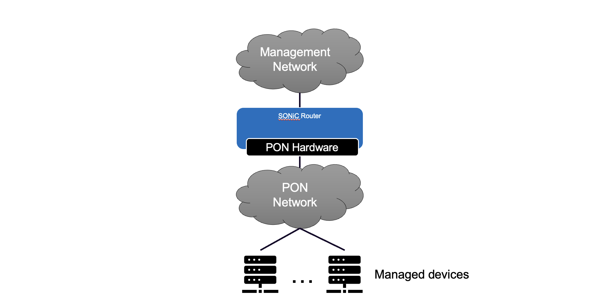
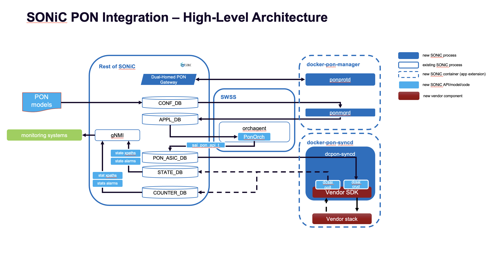

# PON HLD

## Table of Contents

- [Revision Table](#revision-table)
- [Scope](#scope)
- [Definitions / Abbreviations](#definitions--abbreviations)
- [Overview](#overview)
- [Requirements](#requirements)
- [Architecture Design](#architecture-design)
- [High-Level Design](#high-level-design)
- [SAI API](#sai-api)
- [Configuration and Management](#configuration-and-management)
- [Warmboot and Fastboot Design Impact](#warmboot-and-fastboot-design-impact)
- [Memory Consumption](#memory-consumption)
- [Restrictions and Limitations](#restrictions-and-limitations)
- [Testing Requirements and Design](#testing-requirements-and-design)

## Revision Table

| Revision | Date | Author | Change Description |
|---|---|---|---|
| 0.1 | 2026-06-03 | Kyle Gosselin-Harris, Ciena | Initial draft |

## Scope
Scope is limited to PON provisioning, operational state, and statistics for the datacenter use case.
PON parameters or standards not required for datacenter service provisioning are out of scope and
will not be included in the YANG model.

Multicast GEM provisioning is in scope to the extent required for the datacenter use case (e.g., bulk
ONU firmware distribution, link-local protocol forwarding). Residential multicast services (e.g., IPTV,
IGMP snooping for subscriber video) are out of scope.

## Definitions / Abbreviations

| Term              | Meaning                                                                     |
|-------------------|-----------------------------------------------------------------------------|
| PON               | Passive Optical Network                                                     |
| OLT               | Optical Line Terminal — the PON head-end device managed by this feature.    |
| OLT Interface     | An optical interface associated with an OLT, which is connected to a set of downstream ONUs. |
| OLT Plug          | aka micro OLT (uOLT) — a small form factor optical plug that combines the OLT function and the OLT interface into one device. |
| ONU               | Optical Network Unit — a PON subscriber-side endpoint.                      |
| dcpon-syncd       | PON companion syncd process; PON_ASIC_DB consumer, drives the PON SAI.          |
| docker-pon-manager | Platform-specific built-in container hosting `ponmgrd` and `ponprotd`.               |
| docker-pon-syncd  | Platform-specific built-in container hosting `dcpon-syncd` and the PON SAI vendor `.so`. |
| PonOrch           | New Orch class inside `orchagent` translating APPL_DB PON entries to PON_ASIC_DB. |
| ponmgrd           | PON manager daemon translating CONFIG_DB intent into APPL_DB programming.   |
| ponprotd          | PON protection daemon (see Dual-Homed HLD).                                  |

### Mapping PON into a SONiC router

There are two high level approaches to incorporating PON into a router.  In both approaches, the router
interfaces from the ASIC map to PON OLT interfaces, and traffic flows from router interface to OLT interface
to ONU.

In some architectures, the OLTs are prior to the physical interfaces of the box - multiple physical
OLT interfaces are managed by one OLT.  So there are may router interfaces mapped to one OLT,
which then maps to many OLT interfaces.

In other architectures, micro-OLTs (uOLT) are packaged in
small form factor plugs and inserted in standard router pluggable ports.  The interface correspondence
in these architectures is 1:1:1 router interface, OLT, OLT interface.

The distinction between these architectures is largely transparent to this HLD, but in a few cases,
such as firmware management for pluggables, the distinction becomes user visible.

## Overview

PON provides a cost-effective out-of-band management fabric for downstream devices such as GPUs, consoles,
and other datacenter endpoints.  This feature allows SONiC to operate on routers and/or switches that
have PON hardware, either bundled together on the platform, or integrated via pluggable OLTs.

## Requirements

### Functional Requirements

1. Manage PON OLT interfaces, including polling period, FEC, encryption, PON ID/Tag, and switching and forwarding configuration for the PON
1. Discover and manage pluggable OLT modules.
1. Provision and manage PON ONUs identified by FSAN serial number (4-character vendor ID + 8-hex serial number).
1. Provision up to 8 services (T-CONT + GEM port) per ONU.
1. Apply upstream and downstream OLT DBA SLA profiles with guaranteed and best-effort rates.
1. VLAN tag match and transformation (push/pop) per ONU UNI and OLT service.
1. Managed ONU UNI Ethernet ports and console server.
1. Monitor PON network and diagnostics, including ONU registration status, optical levels, laser temperatures, fiber breaks, and hardware/device failures.
1. Monitor performance of the PON network, including FEC/CRC32/HEC/BIP Errors and transmit and receive packet counters for each OLT and ONU PON interface; per service and ONU UNI transmit and receive packet counters.
1. Download and upgrade firmware for ONUs and pluggable OLT modules.
1. Provide KLISH CLI (pon ..., show pon ...) and a YANG model covering all configuration.
1. Publish OLT and ONU operational state and statistics to STATE_DB and COUNTERS_DB.
1. Integrate as a pair of platform-specific built-in containers, following the gearbox enable/disable model.

### Operational Requirements (HA, failover, recovery)

Dual-homed gateway protection is covered by a separate HLD.

### Exemptions / Non-Requirements

Any PON requirement, behavior, or standard that is not directly relevant to datacenter
applications is explicitly out of scope.

## Architecture Design

This feature does not require significant architectural changes to existing
SONiC subsystems.  It adds two new platform-specific built-in containers
(`docker-pon-manager`, `docker-pon-syncd`), a new `PonOrch` module
in the `orchagent` process, and an orthogonal PON SAI
library loaded by the new `dcpon-syncd`.

Configuration flows through `CONFIG_DB` → `APPL_DB` → `PON_ASIC_DB` in PON-prefixed
table names (e.g. `PON_OLT_INTF`, etc) The new `PON_ASIC_DB` is used so that the `dcpon-syncd`
libsairedis context is separate from the main `syncd`'s ASIC_DB.

`dcpon-syncd` writes operational state and statistics into `STATE_DB` and `COUNTERS_DB` under PON-prefixed table names
(`PON_ONU_STATE`, `PON_ONU_STATISTICS_ACCUMULATING_OLT_PON`, etc.).

## High-Level Design

### System Architecture Overview

#### Physical System View



#### PON Software Layering View


### Module and Component Overview

The PON feature is delivered via two platform-specific built-in containers.  All components deployed
as part of this feature, with the exception of orchagent, are new processes and/or libraries
shipped inside these platform-specific built-in containers.

The new containers follow the gearbox design pattern.  These containers could be launched
through platform specific triggers (following the gearbox syncd model explicitly)
or via corresponding configuration for cases where PON functionality is
optional for the hardware platform (this will be necessary for uOLT deployments).

#### docker-pon-manager

`docker-pon-manager` is the vendor-agnostic PON manager container. It hosts `ponmgrd` and
`ponprotd`.

#### docker-pon-syncd

`docker-pon-syncd` is the vendor-specific PON syncd container.
This container hosts `dcpon-syncd` and the PON SAI vendor library, which is statically bound into the container image at build time.

#### Container Pair Lifecycle

`docker-pon-manager` and `docker-pon-syncd` are always launched and stopped as a pair; they do not run independently. The decision to start the pair is made at boot time using the following logic:

```
PLATFORM=$(sonic-cfggen -H -v DEVICE_METADATA.localhost.platform)
CONFIGFILE="/usr/share/sonic/device/${PLATFORM}/dcponsyncd.ini"

if CONFIGFILE exists:
    use CONFIGFILE contents to determine how to start the container pair
    (i.e. which vendor-specific docker-pon-syncd image to use)
else:
    use sonic-cfggen to check CONFIG_DB for keys that indicate the
    container pair should be started; specific keys or key values may
    also select a vendor-specific docker-pon-syncd variant
```

#### ponmgrd — CONFIG_DB Consumer / APPL_DB Producer

`ponmgrd` is the PON configuration manager. It runs inside
`docker-pon-manager` and owns the CONFIG_DB → APPL_DB hop for the PON
feature, following the manager-daemon pattern. `ponmgrd` consumes the operator-provisioned PON
CONFIG_DB tables (e.g. `PON_CONTROLLER`, `PON_OLT_INTF`, `PON_ONU`) and produces
the corresponding PON APPL_DB tables (e.g. `PON_CONTROLLER_TABLE`,
`PON_OLT_INTF_TABLE`, `PON_ONU_TABLE`) for `PonOrch` to consume.

#### ponprotd — Dual Homed PON Gateway Redundancy

`ponprotd` is the PON route protection daemon which runs inside
`docker-pon-manager` alongside `ponmgrd`. The details of the Dual Homed PON Gateway architecture
will be documented in a separate HLD.

#### orchagent PonOrch — APPL_DB Consumer and SAI Translator

`PonOrch` is a new Orch class implementation added in the `orchagent` process
inside the `swss` container. It owns the APPL_DB → PON_ASIC_DB hop, subscribing to
the PON APPL_DB tables produced by `ponmgrd` and writing the
corresponding PON_ASIC_DB SAI object operations that `dcpon-syncd` consumes.

At init, `PonOrch` uses `sai_query_attribute_capability()` to discover which
optional vendor-specific SAI attributes are supported.

#### dcpon-syncd — Companion Syncd with PON SAI and Vendor SDK

`dcpon-syncd` is the companion syncd process for the PON device domain
which runs inside `docker-pon-syncd` and loads the PON SAI vendor library.
It uses the sai-redis data flow to consume PON_ASIC_DB entries
written by `PonOrch` and drives the PON SAI implementation, which in turn
talks directly to the PON vendor layer. It also
maintains PON STATE_DB tables (e.g. `PON_CONTROLLER_STATE`, `PON_OLT_INTF_STATE`,
`PON_ONU_STATE`) and PON COUNTERS_DB tables (e.g. `PON_ONU_STATISTICS_ACCUMULATING_OLT_PON`) via SAI `get()`
patterns.

#### PON SAI Vendor Library

The PON SAI vendor library is an orthogonal SAI implementation supplied as a
vendor-specific shared object (`.so`) that is statically bound into
`docker-pon-syncd` at container build time, following the same packaging
approach used by gbsyncd. `dcpon-syncd` loads the library at startup and
drives it directly to configure and manage the PON hardware. Because the
library is linked into the container image rather than installed at runtime,
the vendor binding is an image-level concern: each vendor ships a distinct
`docker-pon-syncd` image while all other PON components remain vendor-agnostic.

### Repositories

The bulk of the new code will live in a new PON repository. Modifications to existing repositories are expected to be minor:

* **[sonic-dcpon]**: New repo — PON manager daemons (`ponmgrd`, `ponprotd`), `PonOrch`, `dcpon-syncd`, YANG models, and SAI header files
* **[sonic-swss-common]**: add `PON_ASIC_DB` to `database_config.json`
* **[sonic-swss]**: minor changes (e.g. `PonOrch` wiring into `orchagent`)
* **[sonic-buildimage]**: system-level changes to instantiate the new containers (following the gbsyncd model)

### Linux and Docker Dependencies

When PON is enabled, this feature requires the two optional companion
containers, which will use standard SONiC permissions, namespace
configuration, etc. The docker-pon-syncd container will require visibility to the Linux
interface or interfaces that are required for OMCI frame I/O.  This interface
may need to be configured with VLANs in certain architectures.

uOLT based architectures do not require additional permissions.
Vendors that have integrated hardware (PON ASICs, etc) may require
additional container permissions in order to enable hardware access.

`docker-pon-syncd` requires a bind-mount of `/var/firmwareupdate/pon/` from the host in order to access firmware image files during OLT plug and ONU firmware staging operations.

### Logging and Serviceability

#### Logging

Standard logging is instrumented for new components, for example:
1. `ponmgrd`, `ponprotd`, `PonOrch`:
   * `SWSS_LOG_XXX`
2. `dcpon-syncd`:
   * `SAI_LOG_LEVEL_XXX`

## SAI API

### Overview

PON objects flow through the SONiC pipeline: `CONFIG_DB → APPL_DB → PON_ASIC_DB`. `PON_ASIC_DB` is a new Redis DB instance required to support the sai-redis interactions with `dcpon-syncd`.

PON uses an orthogonal SAI library packaging and container architecture similar to gearbox: a separate vendor `.so` bound into `docker-pon-syncd` at build time, with a dedicated per-context DB instance (`PON_ASIC_DB`) so that `dcpon-syncd`'s libsairedis context is isolated from the main `syncd`'s `ASIC_DB`.

### Example Attribute Tables

The below tables represent a selection of SAI attributes for the main PON object types. The complete set of tables will be derived from
the data model described in detail by [pon_db_schema.md](pon_db_schema.md)

| PON component | SAI attribute |
|---|---|
| Controller name | `SAI_PON_CONTROLLER_ATTR_NAME` |
| Device ID | `SAI_PON_CONTROLLER_ATTR_DEVICE_ID` |
| Allow unprovisioned ONUs | `SAI_PON_CONTROLLER_ATTR_ALLOW_UNPROVISIONED_ONUS` |
| OLT timeout | `SAI_PON_CONTROLLER_ATTR_OLT_TIMEOUT` |
| Statistics sample interval | `SAI_PON_CONTROLLER_ATTR_STATISTICS_SAMPLE` |
| OLT management interface | `SAI_PON_CONTROLLER_ATTR_OLT_MGMT_INTERFACE_NAME` |
| Operational version (state) | `SAI_PON_CONTROLLER_ATTR_VERSION` |
| Operational interface (state) | `SAI_PON_CONTROLLER_ATTR_INTERFACE` |

| PON component | SAI attribute |
|---|---|
| OLT interface name | `SAI_PON_OLT_INTF_ATTR_NAME` |
| Parent controller reference | `SAI_PON_OLT_INTF_ATTR_CONTROLLER_ID` |
| Device ID | `SAI_PON_OLT_INTF_ATTR_DEVICE_ID` |
| PON enable | `SAI_PON_OLT_INTF_ATTR_PON_ENABLE` |
| GPON discovery period | `SAI_PON_OLT_INTF_ATTR_GPON_DISCOVERY_PERIOD` |
| GPON downstream FEC | `SAI_PON_OLT_INTF_ATTR_GPON_DOWNSTREAM_FEC` |
| GPON encryption mode | `SAI_PON_OLT_INTF_ATTR_GPON_ENCRYPTION` |
| GPON encryption key rotation time | `SAI_PON_OLT_INTF_ATTR_GPON_ENCRYPTION_KEY_TIME` |
| GPON guard time | `SAI_PON_OLT_INTF_ATTR_GPON_GUARD_TIME` |
| GPON max frame size | `SAI_PON_OLT_INTF_ATTR_GPON_MAX_FRAME_SIZE` |
| GPON PON ID | `SAI_PON_OLT_INTF_ATTR_GPON_PON_ID` |
| Debug log level | `SAI_PON_OLT_INTF_ATTR_DEBUG_LOG_LEVEL` |
| Operational encryption mode (state) | `SAI_PON_OLT_INTF_ATTR_GPON_ENCRYPTION_OPER` |
| Operational discovery period (state) | `SAI_PON_OLT_INTF_ATTR_GPON_DISCOVERY_PERIOD_OPER` |
| MAC address (state) | `SAI_PON_OLT_INTF_ATTR_MAC_ADDRESS` |
| Protection status (state) | `SAI_PON_OLT_INTF_ATTR_PROTECTION_STATUS` |
| Loss of signal (state) | `SAI_PON_OLT_INTF_ATTR_LOSS_OF_SIGNAL` |

| PON component | SAI attribute |
|---|---|
| ONU name | `SAI_PON_ONU_ATTR_NAME` |
| Parent OLT interface reference | `SAI_PON_ONU_ATTR_OLT_ID` |
| Device ID | `SAI_PON_ONU_ATTR_DEVICE_ID` |
| Template reference | `SAI_PON_ONU_ATTR_TEMPLATE_REF` |
| C-VLAN ID | `SAI_PON_ONU_ATTR_ONU_CVLAN_ID` |
| ONU encryption mode | `SAI_PON_ONU_ATTR_ONU_ENCRYPTION` |
| Firmware bank pointer | `SAI_PON_ONU_ATTR_ONU_FW_BANK_PTR` |
| Realtime stats enable | `SAI_PON_ONU_ATTR_ONU_REALTIME_STATS` |
| Service config | `SAI_PON_ONU_ATTR_ONU_SERVICE_CONFIG` |
| OMCC alloc ID (state) | `SAI_PON_ONU_ATTR_ALLOC_ID_OMCC` |
| Equipment ID (state) | `SAI_PON_ONU_ATTR_EQUIPMENT_ID` |
| Host MAC address (state) | `SAI_PON_ONU_ATTR_HOST_MAC_ADDRESS` |
| Temperature (state) | `SAI_PON_ONU_ATTR_TEMPERATURE` |
| Serial number (state) | `SAI_PON_ONU_ATTR_SERIAL_NUMBER` |
| Server state (state) | `SAI_PON_ONU_ATTR_SERVER_STATE` |
| Registration ID (state) | `SAI_PON_ONU_ATTR_REGISTRATION_ID` |
| OMCC version (state) | `SAI_PON_ONU_ATTR_OMCC_VERSION` |

### Dual Homed PON Gateway Integration

The Dual Homed PON Gateway Integration feature will require two PON SAI APIs.  Their use is described in more detail in the feature HLD.

| API | Description |
| --- | --- |
| sai_pon_olt_intf_protection_switch | ponprotd uses this to signal to the dcpon-syncd layer when a protection event occurs |
| sai_pon_olt_intf_state_change_notification | dcpon-syncd uses this to signal to PonOrch that an OLT interface state change has occurred |

### Initialization and Notification Callbacks

`dcpon-syncd` will use a new SAI API to initialize the PON SAI layer:

```c
sai_api_query(SAI_API_PON_CONTROLLER, &pon_api);
pon_api->create_pon_controller(&pon_controller_oid, attr_count, attrs);
```

State-change notification callbacks (e.g. `SAI_PON_CONTROLLER_ATTR_OLT_INTF_STATE_CHANGE_NOTIFY`) are passed as attributes on this create call, following the same pattern used for `sai_create_switch()`. `dcpon-syncd` updates `STATE_DB` with the data from the callbacks.

## Configuration and Management

### Container Integration Manifest

N/A — PON is delivered as platform-specific built-in containers, not a SONiC Application Extension.

### CLI/YANG Model Enhancements

#### YANG Model

PON configuration and operational state are modeled in a new `sonic-pon.yang` module.

The sonic-pon YANG module provides control of all parameter values required
to fully provision data center PON services. It does not include all parameters
defined by the BBF TR-385 YANG model. Instead, it provides all parameter value
inputs required by the PON vendor sdk to fully provision services using the TR-385 model.
Some of the attributes in the model may be vendor specific. See [pon_db_schema.md](pon_db_schema.md) for details.

The tree below shows a subset of containers from this model.

```
module: sonic-pon
  +--rw sonic-pon
     +--rw PON_CONTROLLER
     |  +--rw PON_CONTROLLER_LIST* [controller-name]
     |     +--rw name                             string
     |     +--rw device-id                        string
     |     +--rw allow-unprovisioned-onus?        boolean
     |     +--rw olt-timeout?                     uint32
     |     +--rw statistics-sample?               uint32
     |     +--rw logging-controller-{console,file,syslog,database}? logging-level
     |     +--rw logging-olt-{console,file,syslog}?  logging-enable
     |     +--rw logging-tapi-{console,file,syslog}? logging-level
     |     +--rw olt-management-interface-name?   string
     +--rw PON_OLT_INTF
     |  +--rw PON_OLT_INTF_LIST* [olt-name port-id]
     |     +--rw olt-name                         string
     |     +--rw device-id                        string
     |     +--rw debug-log-level?                 logging-level
     |     +--rw fw-bank-ptr?                     uint16
     |     +--rw pon-enable?                      boolean
     |     +--rw gpon-discovery-period?           uint32
     |     +--rw gpon-downstream-fec?             boolean
     |     +--rw gpon-encryption?                 olt-encryption-mode
     |     +--rw gpon-encryption-key-time?        uint16
     |     +--rw ... (additional GPON / PON scalars; see source)
     +--rw PON_ONU
     |  +--rw PON_ONU_LIST* [onu-name]
     |     +--rw name                             string
     |     +--rw device-id                        string
     |     +--rw template-ref?                    leafref
     |     +--rw onu-cvlan-id?                    uint16
     |     +--rw onu-encryption?                  onu-encryption-mode
     |     +--rw onu-fw-bank-ptr?                 uint16
     |     +--rw onu-service-config?              string
     |     +--rw ... (FW upgrade scalars; see source)
     +--ro PON_CONTROLLER_STATE          {sonic-ext:db-name "STATE_DB"}
     |  +--ro PON_CONTROLLER_STATE_LIST* [name]
     |     +--ro name                             string
     |     +--ro ... (operational scalars; see source)
     +--ro PON_OLT_INTF_STATE                 {sonic-ext:db-name "STATE_DB"}
     |  +--ro PON_OLT_INTF_STATE_LIST* [olt-name port-id]
     |     +--ro name                             string
     |     +--ro ... (operational mirror of PON_OLT_INTF scalars; see source)
     +--ro PON_ONU_STATE                 {sonic-ext:db-name "STATE_DB"}
     |  +--ro PON_ONU_STATE_LIST* [onu-name]
     |     +--ro name                             string
     |     +--ro ... (operational ONU scalars; see source)
     +--ro PON_ONU_STATISTICS_ACCUMULATING_OLT_PON  {sonic-ext:db-name "COUNTERS_DB"}
        +--ro PON_ONU_STATISTICS_ACCUMULATING_OLT_PON_LIST* [onu-name]
           +--ro onu-name                         -> /sonic-pon/PON_ONU_STATE/PON_ONU_STATE_LIST/onu-name
           +--ro rx-optical-level?                decimal64
           +--ro tx-optical-level?                decimal64
           +--ro rx-registrations?                uint64
           +--ro ... (full ONU counter set; see source)
...
```
#### CLI Commands

PON adds a `pon` subtree to the KLISH CLI. Example commands:

| Mode      | Command                                                                                | DB touched                                                |
|-----------|----------------------------------------------------------------------------------------|-----------------------------------------------------------|
| config    | `pon controller <name>` → `device-id <id>` / `olt-timeout <sec>` / `allow-unprovisioned-onus` | CONFIG_DB `PON_CONTROLLER\|<name>`                  |
| config    | `pon olt-intf <name>` → `device-id <id>` / `pon-enable` / ...    | CONFIG_DB `PON_OLT_INTF\|<olt-name>\|<port-id>`          |
| config    | `pon onu <name>` → `device-id <id>` / `template-ref <tmpl>` / `onu-encryption <mode>`  | CONFIG_DB `PON_ONU\|<name>`                               |
| config    | `no pon controller <name>` / `no pon olt-intf <name>` / `no pon onu <name>`                 | CONFIG_DB row delete (downstream APPL_DB / PON_ASIC_DB delete) |
| exec      | `show pon controller [<name>]`                                                         | CONFIG_DB `PON_CONTROLLER\|<name>`                        |
| exec      | `show pon olt-intf [<name>]`                                                                | CONFIG_DB `PON_OLT_INTF\|<olt-name>\|<port-id>`          |
| exec      | `show pon onu [<name>]`                                                                | CONFIG_DB `PON_ONU\|<name>`                               |
| exec      | `show pon controller state [<name>]` / `show pon olt-intf state [<name>]` / `show pon onu state [<name>]` | STATE_DB `PON_*_STATE\|<name>`              |
| exec      | `show pon olt-intf counters [<name>]` / `show pon onu counters [<name>]`                    | COUNTERS_DB `PON_*_STATISTICS\|<name>\|<id>`              |

#### gNMI Streaming Telemetry Paths

Telemetry will be available over gNMI for STATE_DB and COUNTERS_DB entries.

Example xpaths:

| Group     | target        | Representative xpath                                                                                        |
|-----------|--------------|-------------------------------------------------------------------------------------------------------------|
| State     | `STATE_DB`   | `/PON_ONU_STATE/PON_ONU_STATE_LIST[name=<onu-name>]`                                                        |
| Counters  | `COUNTERS_DB`| `/PON_ONU_STATISTICS_ACCUMULATING_OLT_PON/PON_ONU_STATISTICS_ACCUMULATING_OLT_PON_LIST[onu-name=<onu-name>]` |

### ponutil

`ponutil` is a standalone utility for PON operations, similar to `sfputil`. Operational commands write action entries to APPL_DB; `dcpon-syncd` consumes them and issues the corresponding SAI calls. Firmware commands write to CONFIG_DB, triggering SAI attribute sets.

```
ponutil
|--- olt-plug
|    |--- reset <olt-name>
|
|--- onu
|    |--- reset <onu-name>
|
|--- firmware
     |--- image
     |    |--- download -t <olt-plug|onu> -u <url> --hash-file <url> --manufacturer <m> --model <m> --version <v>
     |    |--- show [-t <olt-plug|onu>]
     |
     |--- olt-plug
     |    |--- stage <olt-name> --bank <n> --file <filename> --version <ver>
     |    |--- activate <olt-name> --bank <n>
     |    |--- show [<olt-name>]
     |
     |--- onu
          |--- stage <onu-name> --bank <n> --file <filename> --version <ver>
          |--- stage all <olt-name> --bank <n> --file <filename> --version <ver>
          |--- activate <onu-name> --bank <n>
          |--- show [<onu-name>]
```

#### Operational Commands (`ponutil olt-plug`, `ponutil onu`)

`reset` writes an action entry to APPL_DB; `dcpon-syncd` consumes the entry and issues the corresponding SAI call.

#### Firmware Management (`ponutil firmware`)

Firmware bank switching is traffic disruptive. The disruption time is vendor-specific. Operators should use traffic drain to move traffic away from the device if disruption is not acceptable. The workflow has four steps: download the firmware image to the local NOS image registry, stage it to a device bank (non-disruptive), activate by switching the bank pointer (disruptive), and show status.

#### Firmware Image Registry (`ponutil firmware image`)

Firmware binaries are stored on the host at `/var/firmwareupdate/pon/`. `download` fetches a binary from a URL into that directory, fetches the hash from `--hash-file`, verifies the binary against it, and writes a `PON_FIRMWARE_IMAGE` CONFIG_DB entry including the hash. The hash algorithm is inferred from the hash file extension (e.g. `.sha256`, `.sha512`). `show` lists registered images and their integrity status from `PON_FIRMWARE_FILENAME_STATE` and `PON_FIRMWARE_METADATA_STATE`.

#### OLT Plug Firmware (`ponutil firmware olt-plug`)

`stage` writes `PON_OLT_PLUG_FW_BANK_FILE|<olt-name>|<bank-id>` entries to CONFIG_DB, triggering a `sai_pon_set_attribute` call on the OLT plug SAI object. Before invoking SAI, `dcpon-syncd` performs an integrity check against the stored hash and writes the result to `PON_FIRMWARE_METADATA_STATE`; if the check fails, the status is updated and the SAI call is skipped. Otherwise, the vendor SAI initiates the vendor-specific transfer to the module. This is non-disruptive.

`activate` writes `fw-bank-ptr` to CONFIG_DB, triggering a `sai_pon_set_attribute` call; the module resets onto the new bank and ONU sessions on the OLT interface are interrupted briefly.

`show` reads `PON_OLT_PLUG_FW_BANK_VERSION_STATE` for per-bank versions and `PON_OLT_PLUG_FW_UPGRADE_STATUS` for the current or last upgrade status.

Firmware compatibility rules across OLT plugs, whether within the same chassis or across different chassis in HA deployments, are vendor-specific. The `sai_pon_set_attribute()` call may return an error if such rules are violated.

#### ONU Firmware (`ponutil firmware onu`)

`stage` writes `PON_ONU_FW_BANK_FILE|<onu-name>|<bank-id>` entries to CONFIG_DB, triggering a `sai_pon_set_attribute` call on the ONU SAI object. Before invoking SAI, `dcpon-syncd` performs an integrity check against the stored hash and writes the result to `PON_FIRMWARE_METADATA_STATE`; if the check fails, the status is updated and the SAI call is skipped. Otherwise, the vendor SAI initiates the OMCI file transfer to the ONU. This is non-disruptive. `stage all` targets all ONUs on an OLT interface and may use multicast GEM for efficient bulk transfer.

`activate` writes `fw-bank-ptr` to CONFIG_DB, triggering a `sai_pon_set_attribute` call; the ONU resets onto the new bank and service is interrupted briefly.

`show` reads `PON_ONU_FW_BANK_VERSION_STATE` for per-bank versions and the upgrade progress fields (`status`, `progress`, `bank`, `upgrade-time`) from `PON_ONU_STATE`.

### Config DB Enhancements

New tables are added to CONFIG_DB for the feature.  No existing CONFIG_DB tables are
modified, and no tables are deleted.

### Counter Collection

`dcpon-syncd` uses three counter collection mechanisms:

| Type | Tables | Mechanism |
|---|---|---|
| Accumulating | `PON_*_STATISTICS_ACCUMULATING_*` | Batch poll via `FLEX_COUNTER_DB` |
| Binned | `PON_*_STATISTICS_BINNED_*` | Vendor SAI callback on PM interval boundary |

#### Accumulating Counter Collection

`dcpon-syncd` listens to `PON_*` related table names in `FLEX_COUNTER_DB`. By default, ONUs are partitioned into their parent OLT interface shard. The number of default OLT shards (and thus collection threads) is determined at OLT provisioning time by querying `SAI_PON_OLT_INTF_ATTR_STATS_COLLECTION_CONCURRENCY` via `pon_api->get_pon_olt_intf_attribute()`. Operators can create additional named groups to isolate specific ONUs or OLT interfaces at different collection rates.

Not all 26 accumulating table types are enabled by default. The default-enabled set is:

| Scope | Default tables |
|---|---|
| OLT | `PON_OLT_STATISTICS_ACCUMULATING`, `PON_OLT_STATISTICS_ACCUMULATING_ENV`, `PON_OLT_STATISTICS_ACCUMULATING_PON_FLOODING`, `PON_OLT_STATISTICS_ACCUMULATING_PON_FLOODING_NNI_NETWORK`, `PON_OLT_STATISTICS_ACCUMULATING_TEMP` |
| ONU | `PON_ONU_STATISTICS_ACCUMULATING_OLT_PON`, `PON_ONU_STATISTICS_ACCUMULATING_ONU_FEC_PM` |

All other ONU tables — including the high-volume `OLT_PON_OMCC` (102 fields) and `OLT_PON_SERVICE` (98 fields) — are opt-in via `counterpoll`. Default intervals: 5m OLT, 15m ONU.

**Default collection burst** — 48-port OLT, 76 ONUs/port (3,648 ONUs):

| Scope | `bulkGetStats()` calls/cycle | `HSET` commands/cycle (global) | `HSET` commands/cycle (per shard) |
|---|---|---|---|
| OLT (5m, 5 tables) | 5 | 5,904 | 123 |
| ONU (15m, 2 tables) | 2 | 65,664 | 1,368 |

Each OLT shard fires independently. Shards are offset at init using binary partitioning: shard `i` of `N` starts at offset `(i / N) × interval`, spacing 48 OLT shards 18.75s apart at 15m interval. Per-shard burst at cycle boundary: 1,368 `HSET` commands (~14ms Redis time). Enabling all 21 ONU tables increases the per-shard burst 24× to 33,288 commands.

### Backward Compatibility

No backward compatibility considerations for non-PON features.

## Warmboot and Fastboot Design Impact

There is no warmboot or fastboot impact on deployments that do not include the PON built-in containers.

Deployments that use these containers will not support warm boot - the PON layer will
restart, thus impacting traffic.

## Memory Consumption

Memory grows linearly with the number of configured OLT interfaces and ONUs.

| DB | Scope | Fields | Est. per object |
|---|---|---|---|
| CONFIG_DB | Per ONU (basic: `PON_ONU` + 4 services + 1 UNI + 4 networks) | ~60 across ~10 keys | ~5 KB |
| STATE_DB | Per ONU (`PON_ONU_STATE` + `PON_ONU_UNI_STATE`) | ~61 across 2 keys | ~4 KB |
| COUNTERS_DB | Per ONU (53 statistics sub-tables) | ~1,068 across 53 keys | ~75 KB |
| CONFIG_DB | Per OLT (`PON_OLT_INTF`) | ~25 across 1 key | ~2 KB |
| STATE_DB | Per OLT (`PON_OLT_INTF_STATE`) | ~40 across 1 key | ~3 KB |
| COUNTERS_DB | Per OLT (11 statistics sub-tables) | ~312 across 11 keys | ~21 KB |
| — | `docker-pon-manager` (`ponmgrd`) process base | fixed | ~15–20 MB |
| — | `docker-pon-syncd` (`dcpon-syncd` + vendor SAI `.so`) process base | fixed | ~30–50 MB |
| — | `PonOrch` increment inside `orchagent` | fixed | negligible |

When the PON feature is not deployed, there is no impact on memory footprint.

## Restrictions and Limitations

None

## Testing Requirements and Design

Test cases below are representative examples; `sonic-pon.yang` defines the full set of objects to be covered.

### Unit Test Cases

| ID    | Component | Scenario                                                                                                  | Expected behavior                                                                                                |
|-------|-----------|-----------------------------------------------------------------------------------------------------------|------------------------------------------------------------------------------------------------------------------|
| UT-01 | `PonOrch` | APPL_DB SET on `PON_CONTROLLER_TABLE:<name>`                                                              | `sai_create_pon_controller_fn` invoked once with the expected attribute list.                                    |
| UT-02 | `PonOrch` | APPL_DB SET on `PON_OLT_INTF_TABLE:<olt-name>\|<port-id>` after controller exists                          | `sai_create_pon_olt_fn` invoked with `SAI_PON_OLT_ATTR_CONTROLLER_ID` set to the controller OID.                |
| UT-03 | `PonOrch` | APPL_DB SET on `PON_OLT_INTF_TABLE:<olt-name>\|<port-id>` before parent controller exists                 | Operation deferred and retried after the parent appears; no SAI create issued out of order.                     |
| UT-04 | `PonOrch` | APPL_DB SET on `PON_ONU_TABLE:<name>` after parent OLT Interface exists                                   | `sai_create_pon_onu_fn` invoked with `SAI_PON_ONU_ATTR_OLT_ID` set to the OLT Interface OID.                    |
| UT-05 | `PonOrch` | APPL_DB DEL on `PON_OLT_INTF_TABLE:<olt-name>\|<port-id>` while child ONU rows still exist                | Children removed first (or remove deferred until children removed); no orphaned ONU SAI objects.                |
| UT-06 | `PonOrch` | APPL_DB attribute-only SET on `PON_OLT_INTF_TABLE:<olt-name>\|<port-id>` (e.g. `pon-enable` toggled)     | `sai_set_pon_olt_attribute_fn` invoked once with the changed attribute; no create / remove issued.              |
| UT-07 | `PonOrch` | Mock SAI reports a vendor-specific attribute as not supported at init; APPL_DB entry contains that attribute | SAI call triggered by `PonOrch` does not contain the unsupported attribute; no error raised. |

### Integration Test Cases

| ID    | Boundary covered                       | Scenario                                                                                                      | Expected behavior                                                                                  |
|-------|----------------------------------------|---------------------------------------------------------------------------------------------------------------|----------------------------------------------------------------------------------------------------|
| IT-01 | CONFIG_DB → APPL_DB                    | Operator writes `PON_CONTROLLER\|<name>`; `ponmgrd` runs against a real CONFIG_DB                            | `PON_CONTROLLER_TABLE:<name>` appears in APPL_DB with the canonical field set.                    |
| IT-02 | CONFIG_DB → APPL_DB                    | Operator writes `PON_OLT_INTF\|<olt-name>\|<port-id>` then `PON_ONU\|<name>`                                | `PON_OLT_INTF_TABLE` and `PON_ONU_TABLE` appear in APPL_DB with parent references resolved.       |
| IT-03 | APPL_DB → PON_ASIC_DB                      | Test driver writes the canonical APPL_DB rows; `PonOrch` runs against a real APPL_DB and a mock SAI         | PON_ASIC_DB rows for the corresponding PON SAI object types appear with the expected key attributes.    |
| IT-04 | PON_ASIC_DB → SAI                          | Test driver injects PON_ASIC_DB rows; `dcpon-syncd` runs with a mock PON SAI                                     | Mock SAI receives `create_pon_*` calls in the expected order with the expected attributes.        |
| IT-05 | SAI get() → STATE_DB                   | Mock SAI returns READ_ONLY attribute values; `dcpon-syncd` runs its polling loop                             | `PON_CONTROLLER_STATE`, `PON_OLT_INTF_STATE`, `PON_ONU_STATE` rows appear in STATE_DB.                 |
| IT-06 | SAI get_stats() → COUNTERS_DB          | Mock PON SAI returns counter values for `sai_get_pon_olt_stats` and `sai_get_pon_onu_stats`; `dcpon-syncd` runs its stats-polling loop | `PON_ONU_STATISTICS_ACCUMULATING_OLT_PON` rows appear in COUNTERS_DB on the configured cadence with the expected counter fields. |

### System Test Cases

| ID    | Scenario                                                                                                  | Expected behavior                                                                                                |
|-------|-----------------------------------------------------------------------------------------------------------|------------------------------------------------------------------------------------------------------------------|
| ST-01 | Provision a controller (`configure terminal` → `pon controller <name>`)                                   | `PON_CONTROLLER_TABLE` and PON_ASIC_DB controller object both appear; `show pon controller` returns the row.        |
| ST-02 | Provision an OLT Interface under that controller (`configure terminal` → `pon olt-intf <name>`)                | OLT Interface object created in PON_ASIC_DB; OLT Interface becomes operationally `up` in `PON_OLT_INTF_STATE`.           |
| ST-03 | Provision an ONU under that OLT Interface (`configure terminal` → `pon onu <name>`)                       | ONU object created; ONU registers and appears in `PON_ONU_STATE`.                                               |
| ST-04 | Read controller / OLT Interface / ONU configuration                                                       | `show pon ... <name>` returns the configured values directly from CONFIG_DB.                                    |
| ST-05 | Read state                                                                                                | `show pon controller state`, `show pon olt-intf state`, `show pon onu state` reflect the live operational values.    |
| ST-06 | Read counters after sustained PON traffic                                                                 | `show pon olt-intf counters` and `show pon onu counters` return non-zero values; corresponding `PON_ONU_STATISTICS_ACCUMULATING_OLT_PON` rows in COUNTERS_DB advance on the configured cadence. |
| ST-07 | gNMI subscribe to the canonical state / counter xpaths                                                    | gNMI client receives updates corresponding to STATE_DB / COUNTERS_DB transitions.                                |
| ST-08 | Delete a configured ONU then OLT Interface then controller (cleanup ordering)                             | PON_ASIC_DB rows removed in dependency-safe order; STATE_DB rows for the deleted objects disappear.                |
| ST-09 | Container-pair startup: bring up `database`, then `docker-pon-syncd`, then `swss`, then `docker-pon-manager` | End-to-end pipeline converges; controller create succeeds.                                              |

### Regression Test Cases

| ID    | Coverage                                                                                                    |
|-------|-------------------------------------------------------------------------------------------------------------|
| RT-01 | All ST-01 through ST-09 scenarios run on every SONiC release branch tagged for PON.                        |
| RT-02 | YANG validation of the representative PON CONFIG_DB tables (e.g. `PON_CONTROLLER`, `PON_OLT_INTF`, `PON_ONU`) on every change to `sonic-pon.yang`. |
| RT-03 | `PonOrch` unit tests UT-01 through UT-06 run as part of the standard `swss` unit-test gate.                |
| RT-04 | Disable-PON regression: with neither PON built-in container installed, the SONiC pipeline (non-PON traffic, port management, BGP, etc.) is unaffected. |
