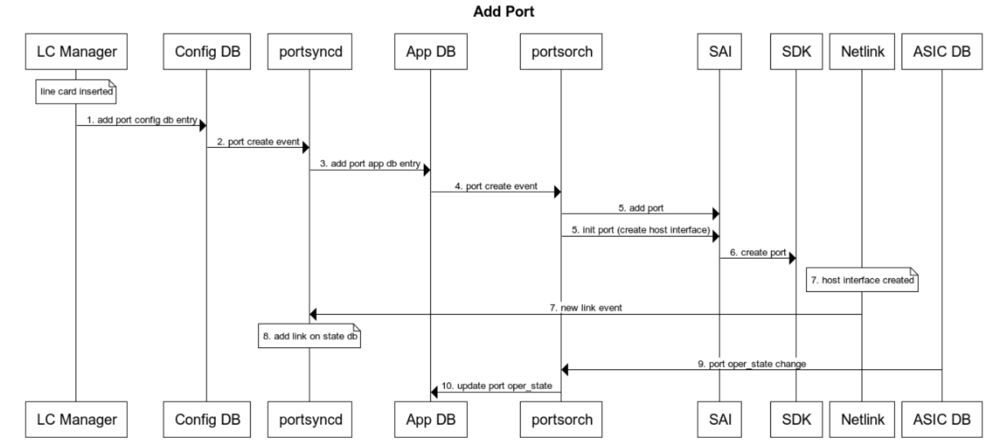
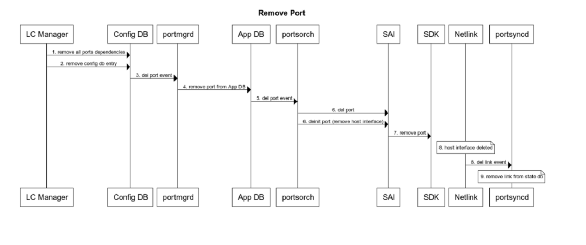
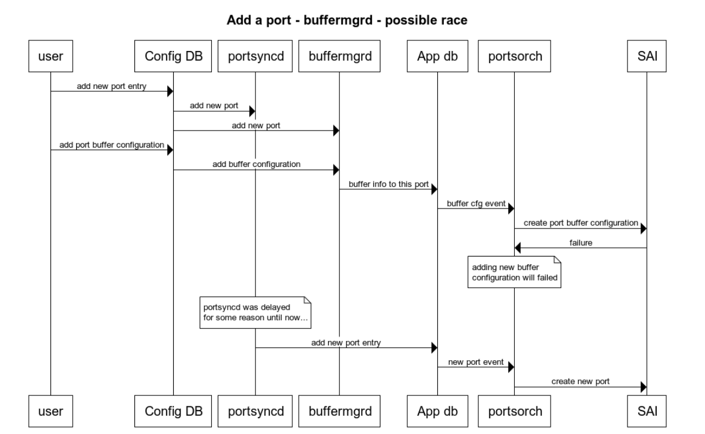
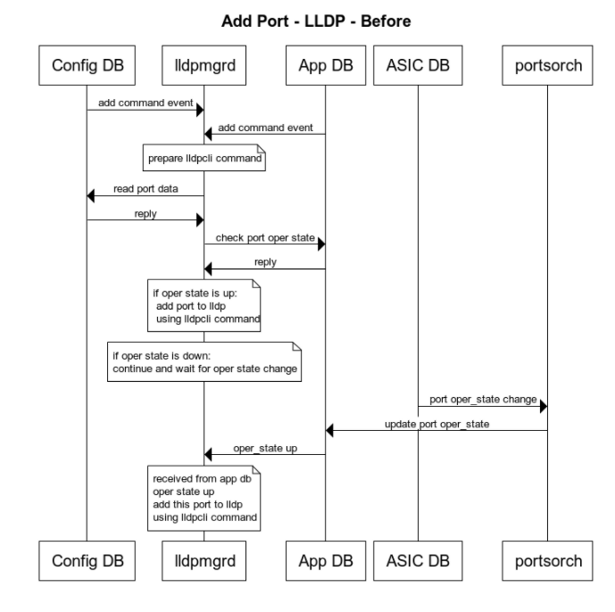
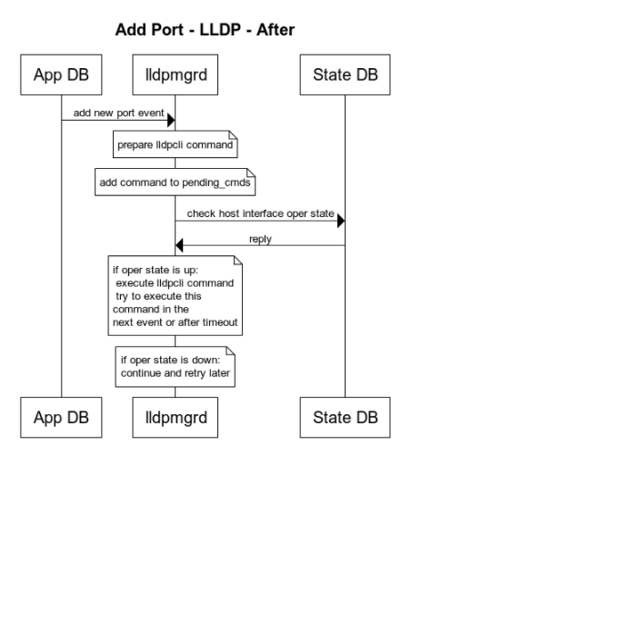

# Enhancements to add or del ports dynamically

# Table of Contents
  * [Revision](#revision)            
  * [About This Manual](#about-this-manual)
  * [Scope](#scope)                        
  * [Initialization stage](#init-stage)
  * [Post init stage](#post-init)
  
  

#### Revision
| Rev |  Date   |       Author       | Change Description |
|:---:|:-------:|:------------------:|:------------------:|
| 0.1 | 2021-09 |    Tomer Israel    | Initial Version    |

## Motivation
The feature is to support adding or removing ports from the system dynamically after init stage.
The system can start with all the ports on config db or only several ports from the full ports or without any ports on config db (zero ports system).
The ports will be added or removed through the port table on config db.
Before removing a port the user is responsible to remove all dependencies of this port before removing it.

# About this Manual
This document provides general information about ports creation or removal in SONiC. The creation of ports on the init stage and creating or removing ports after init stage.
# Scope                                                                                  
This document describes the high level design of orchagent and the impact of creating/removing ports dynamically on other services. The design describes the current implementaion and suggestion to changes that needs to be implemented in order to fully support the dynamic create/remove of ports.

## Relevant PRs
[PR #7999 Allow cfggen to work on system without ports](https://github.com/sonic-net/sonic-buildimage/pull/7999) 
[PR #1860 Remove buffer drop counter when port is deleted](https://github.com/sonic-net/sonic-swss/pull/1860) 
[PR #1808 [swss]: Allow portsyncd to run on system without ports](https://github.com/sonic-net/sonic-swss/pull/1808) 
[PR #2019 [orchagent] add & remove port counters dynamically each time port was added or removed](https://github.com/sonic-net/sonic-swss/pull/2019) 
[PR #2022 Dynamic port configuration - add port buffer cfg to the port ref counter](https://github.com/sonic-net/sonic-swss/pull/2022) 

## Design

# Initialization stage 

 
 
 
- **Portsyncd** read port config db info and push it to App db and will set PortConfigDone on App db when finished.
- **Portsorch** (orchagent) for every port added to the APP DB … will create port through SAI call and create also host interface for each time port is added to port APP table.
- **Portsyncd** will receive netlink notification for each host interface that was created, and update an entry on state db
- When all host interfaces are created **Portsyncd** is setting PortInitDone.

### App DB flags:
PortConfigDone – finished to configure ports on init
PortInitDone – all host interfaces were created 

Some services are waiting for these flags before they continue to run:
Orchagent is waiting for PortConfigDone before continuing to create the ports on SAI.
Xcvrd, buffermgrd, natmgr, natsync – waiting for PortInitDone

## Init types:
The Dynamic port add/remove configuration will be supported for all types of init types: 
•   Start the system with full ports on config db  
•   Start the system without some of the ports on config db 
•   Start the system with zero ports on config db 

**Note:** This is a new type of init that was never tested and will be supported. 
The zero-port system is a special case of this feature.  
Few PRs were already added in order to support zero ports init: 
[PR #7999 Allow cfggen to work on system without ports](https://github.com/sonic-net/sonic-buildimage/pull/7999) 
[PR #1860 Remove buffer drop counter when port is deleted](https://github.com/sonic-net/sonic-swss/pull/1860) 
[PR #1808 [swss]: Allow portsyncd to run on system without ports](https://github.com/sonic-net/sonic-swss/pull/1808) 

after init stage we can add/remove ports dynamically through redis call to add/remove entry to/from port table on config db ("PORT")

## Init with zero ports:
Starting with zero ports requires new SKU for zero ports with these changes: 
**Hwsku.json** – without interfaces 
**Platform.json** – without interfaces 
**Sai profile** needs to be without port entries.  

On this zero ports SKU the sonic-cfggen will generate config_db.json file without any ports. 
 

# Post init stage - dynamically

#### Add port:

 

1.  A process or a user can add port entry to the port table on Config DB. For example, the line card manager will add port entry to the port table.
2.  On portsyncd - Port set event is received from Config DB.
3.  Portsyncd is adding the new port info to App DB
4.  On portsorch (orchagent) - Port set event is received from App DB.
5.  Portsorch is creating the port on SAI.
6.  SDK is creating the port and the host interfaces.
7.  Host interface is created and Netlink event received on portsyncd.
8.  Portsyncd is adding a new port entry on state db.
9.  Events from ASIC DB received on portsorch when operstate are changing (up or down).
10. Portsorch are updating the operstate on App DB

#### Del port:

Del Port – Remove port element from config DB
Note: before removing a port, the port needs to be without any dependencies (ACL, VLAN, LAG, buffer pg).
For example: we need to remove the buffer pg that configured to a port and then remove the port.

 

1.  Before we remove a port, we need to remove all dependencies of these ports (vlan, acl, buffer…)
2.  A process or a user can remove port entry from the port table on Config DB. For example, line card manager will remove port entry.
3.  On portmgrd we receive delete event from Config DB.
4.  Portmgrd will remove this entry on App DB.
5.  Portsorch will receive remove entry event from the App DB.
6.  Portsorch will delete the port and the host interface on SAI.
7.  SAI will remove this port on SDK
8.  Host interface will be removed and netlink event will be received on portsyncd.
9.  Portsyncd will remove the port entry from state db

## Modules that “listen” to changes on config port table, App port table and State port table

#### SWSS - Portsyncd:
•   ADD PORT - Receive new port from port config table, add the port info to APP DB (update speed, interface_type, autoneg, adv_speeds, adv_interface_types). 
when host interface was created add this port entry to state db 
•   DEL PORT – portmgrd is removing this entry from app db. 
when host interface was removed remove this port entry from state db

#### SWSS - Portsorch:

•   ADD PORT - Receive new port from port APP table -> create port on SAI -> create host interface -> add Flex counters 
Receive notification from ASIC DB when oper_state is changing, update the port oper_state on APP db.
•   DEL PORT - Receive del port from port APP table -> remove flex counters -> del port on SAI -> del host interface 

Currently the orchagent is adding/removing these flex counters:
-   PORT_BUFFER_DROP_STAT_FLEX_COUNTER_GROUP 
-   PORT_STAT_COUNTER_FLEX_COUNTER_GROUP 

Changes needs to be added: 
We need to add more port counters that will be add/removed dynamically whenever port is created or removed:
-   Queue port counters (queue & queue watermark counters)
-   PG counters
-   Debug counters: port ingress drops  (DEBUG_COUNTER config table)
-   Debug counters: port egress drops 
-   Pfc watchdog counters

In the current implementation these counters were created for all ports only after init stage is done.

** Counters PR: **  
[https://github.com/sonic-net/sonic-swss/pull/2019](https://github.com/sonic-net/sonic-swss/pull/2019)
 

#### PortMgrd:
- ADD Port: Set (admin_status, mtu, learn_mode, tpid) from config db to App db  
- Del port: Receive del port operation from port config table, remove this port from APP DB. 

**No need to change the code**

#### Sflowmgr:
Add port: Event from config db - Update the speed to sflow internal db. 
Del port: Delete event from config db - remove the speed from sflow internal db. 

**No need to change the code**

#### Teammgrd:
Listen to events from config db:
set event -> add the port to lag (check before if entry exist on state db - host interface exist) 
del event -> remove port from lag 

Listen to events from state db:
set event -> add the port to lag (the below content is taken from the teammgr code to describe this flow):  
When a port gets removed and created again, notification is triggered
when state dabatabase gets updated. In this situation, the port needs
to be enslaved into the LAG again.
del event -> do nothing  

**No need to change the code**

#### Macsecmgr:
Listen to events on cfg port table – the service will enable or disable macsec if macsec was configured on the port cfg table (using the macsec field) 

**No need to change the code**

#### snampagent:
•   Add/remove port has no special treatment. 
each time the snmpagent needs information from ports (oper_state, mtu, speed..) it reads from APP port table. Will be triggered on mib requests. 

**No need to change the code**

#### PMON - Xcvrd:
Listen to events on cfg port table and update transeiver information  

implemented on those PRs:
https://github.com/sonic-net/sonic-buildimage/pull/8422  
https://github.com/sonic-net/sonic-platform-daemons/pull/212

## Buffermgrd:

##### Add port:  
- If a port is added without a buffer configuration the buffer configuration the SDK will “decide” the default buffer values for this port.
- The user can add the port on admin state down -> later add the buffer configuration (static or dynamic) -> enable this port.
For example, in the line-card system case:
-   When line card is provisioned the line card manager is adding a port to config db, need to add the port with admin state “down”.
-   Line card manager will add the buffer configuration for this port through a default buffer cfg template.
-   Line cart manager will enable the port.

•   Pg_profile_lookup file has values that will be used for static buffer configuration.
for each port speed and cable length we have buffer size value, xon and xoff value  
For example:

|speed cable | cable | size  |  xon  |  xoff |  threshold |
|:----------:|:-----:|:-----:|:-----:|:-----:|:----------:|
|  10000     | 5m    | 49152 | 19456 | 29696 |      0     |
|  25000     | 5m    | 49152 | 19456 | 29696 |      0     |
|  40000     | 5m    | 49152 | 19456 | 29696 |      0     |
|  50000     | 5m    | 49152 | 19456 | 29696 |      0     |

On the line-card system we will use different types of line cards (maybe with different gearboxes), the values on the pg_profile_lookup will be used for all the types. 
we may need to consider using pg_profile_lookup.ini for each line card type. 
•   When port is added to the config db – the speed and the admin state is saved on internal db 
•   After port was added the user can add buffer configuration to this port (dynamic or static configuration) and only then the buffermgr will set the buffer configuration on App table 

•   We have rare situation of race condition in the add port flow: 

 

in order to avoid this issue we need to check first if port exist on App db before adding the buffer cfg to the App db.

##### Del port:
•   Before removing a port all buffer configuration needs to be removed 

We have also possible way for race condition: 

 

•   If the portsyncd is “quicker” than the buffermgr the orchagent will try to remove the port from SAI before the buffer configuration was removed. 
•   Need to test this scenario in order to check if this race condition is reproducing or it’s rare scenario 
•   Solution for this:  
Need to add to orchagent the ability to add the buffer configuration of a port and increase a reference counter for each port, in the same way ACL cfg on port is working. We already have infrastructure for this just need to add the buffer cfg to use it. If a port has with buffer cfg on – this port will not be removed.

If we will not use this mechanism we will get a lot of SAI error and with this ref counter method we will receive only one warning. Also we wanted the buffer configuration to be the same as ACL/VLAN/INTERFACE configuration, which uses the ref counter for the dependencies, and before removing a port we check this ref counter.

** Buffer changes PR: **  
[https://github.com/sonic-net/sonic-swss/pull/2022](https://github.com/sonic-net/sonic-swss/pull/2022)

#### LLDP – lldpmgrd – implementation today:
•   Add port: receive port entry set on port config db -> check if oper state is up or wait until oper state up event is received from app db  add lldp port entry  with lldpcli command
•   Del port: when host interface is removed from system lldp configuration is removed also.
 

 

The Problem:
-   when a port is added - the lldpcli execution can failed since the host interface is not yet up. oper_state on on APP DB is up but host interface is not up yet.
-   when lldp is removed immediatly after add the lldpcli command wasn't executed yet, the command is still on pending_cmds, there is treatment to remove a     port, on lldpmgrd, the command for this port will stay forever on the pending_cmds end each 10 seconds (timeout value) the command will be executed and failed since the host interface is no longer exist.

Suggested change:
-   Before executing lldpcli command we will check if host interface is up by checking the port status on state db 
-   When receiving del event from App db we will remove the command (if exist) from pending_cmds  
-   in the current implementation we receive events on port create/update from config db and app db and later read from config db again - this implementation is unnecessary and can be problematic in several cases.
-   The lldpcli is a tool that we can use in order to add ports to lldp. 

 
 
 
### VS test

1.  Basic test (init with full ports):  
    - Start the system with full ports on system  
    - Remove one port  
    - Verify port was removed properly  
    - Add the port back to the system  
    - Verify port was added properly  
    - do the above in a loop several times
    - Run ping and verify basic functionality of ports  
2.  Basic test (init with full ports):  
    - Start the system with full ports on system  
    - Remove all the ports  
    - Verify all ports were removed properly  
    - Add the ports back to the system  
    - Verify ports was added properly  
    - Run traffic and verify basic functionality of ports  
    - do the above in a loop several times
 
