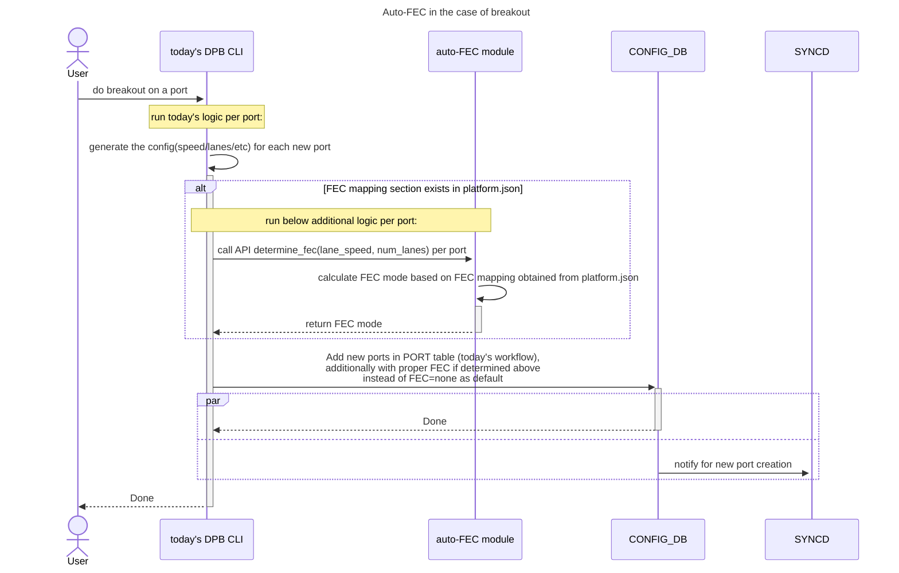
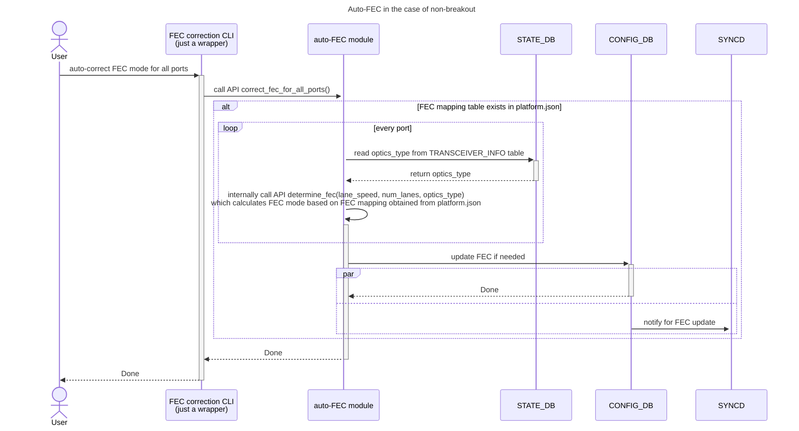

#### Flow For Breakout And Non-Breakout Use Cases





> [!NOTE]
> In the above usecases, user needs to save config, so that changed FEC modes can be saved to config_db.json, and persists across config/system reload.

#### API design
```
def determine_fec(lane_speed: int, num_lanes: int, optics_type: Optional[str] = None) -> str:
    """
    Determines the appropriate Forward Error Correction (FEC) type based on lane speed, number of lanes, and optics type for a specific port.
    This logic is based on FEC mapping rules defined in platform.json.

    Parameters:
    - lane_speed (int): The speed of each lane in GB.
    - num_lanes (int): The total number of lanes.
    - optics_type (Optional[str]): The type of optics in use. Can be None if not applicable.

    Returns:
    - str: The recommended FEC type based on the rules in platform.json.
           If no matched entry is found in the rules or no rules are defined in platform.json, return None.

    Example:
    >>> determine_fec(25, 4, "100G-SR4")
    "rs"

    """
```

#### (optional) Platform Prequisite

FEC mapping rules are defined in platform.json:
1. For now, there are two mapping rules
    - ```fec_mapping_based_on_speed_lane```: This will be looked up if lane_speed and num_lanes are provided in parameters of determine_fec API.
    - ```fec_mapping_based_on_optics_type```: This will be looked up if optics_type is provided in parameters of determine_fec API.
2. In ```fec_mapping_based_on_speed_lane```, if there are multiple FEC values (e.g. ```rs``` and ```none```) in the field of ```fec```, preferably choose the first value (in this example, ```rs```).
3. If a port has matched FEC entry in both ```fec_mapping_based_on_speed_lane``` and ```fec_mapping_based_on_optics_type```, then prefers FEC entry in ```fec_mapping_based_on_optics_type```, which is the first mapping rule defined in platform.json.
```
{
"fec_mapping_based_on_optics_type": [
    {
        "optics_type": "100G-DR",
        "fec": ["none"]
    },
    {
        "optics_type": "100G-FR",
        "fec": ["none"]
    }
    ....
],
"fec_mapping_based_on_speed_lane": [
    {
        "lane_speed": 10,
        "num_lanes": 4,
        "fec": ["kr", "none"]
    },
    {
        "lane_speed": 20,
        "num_lanes": 2,
        "fec": ["none"]
    },
    {
        "lane_speed": 25,
        "num_lanes": 2,
        "fec": ["rs(kp4/kr4)", "none"]
    },
    {
        "lane_speed": 25,
        "num_lanes": 4,
        "fec": ["rs(kp4/kr4)", "none"]
    },
    {
        "lane_speed": 25,
        "num_lanes": 8,
        "fec": ["rs kp4"]
    },
    {
        "lane_speed": 50,
        "num_lanes": 1,
        "fec": ["rs(kp4/kr4)"]
    },
    {
        "lane_speed": 50,
        "num_lanes": 4,
        "fec": ["rs(kp4)"]
    },
    {
        "lane_speed": 50,
        "num_lanes": 8,
        "fec": ["rs(kp4)"]
    },
    {
        "lane_speed": 50,
        "num_lanes": 16,
        "fec": ["rs(kp4)"]
    },
    {
        "lane_speed": 50,
        "num_lanes": 2,
        "fec": ["rs(kp4/kr4/kp4_fi)"]
    }
]
}
```
