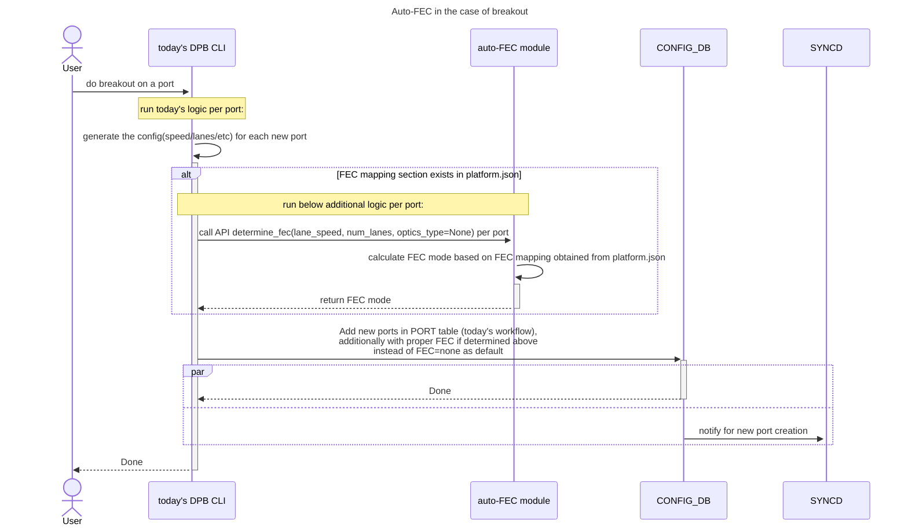

#### Flow For Breakout And Non-Breakout Use Cases




> [!NOTE]
> In the above usecases, user needs to save config, so that changed FEC modes can be saved to config_db.json, and persists across config/system reload.

#### Platform Support

FEC mapping in platform.json:
1. In fec_mapping_based_on_speed_lane, If there are both rs and none in the field of "fec", preferably choose rs
2. If a port has a matched entry in both fec_mapping_based_on_speed_lane and fec_mapping_based_on_optics_type, then prefers fec_mapping_based_on_optics_type.
```
{
"fec_mapping_based_on_speed_lane": [
    {
        "lane_speed": 10,
        "num_lanes": 4,
        "fec": ["none", "kr"]
    },
    {
        "lane_speed": 20,
        "num_lanes": 2,
        "fec": ["none"]
    },
    {
        "lane_speed": 25,
        "num_lanes": 2,
        "fec": ["none", "rs(kp4/kr4)"]
    },
    {
        "lane_speed": 25,
        "num_lanes": 4,
        "fec": ["none", "rs(kp4/kr4)"]
    },
    {
        "lane_speed": 25,
        "num_lanes": 8,
        "fec": ["rs kp4"]
    },
    {
        "lane_speed": 50,
        "num_lanes": 1,
        "fec": ["rs(kp4/kr4)"]
    },
    {
        "lane_speed": 50,
        "num_lanes": 4,
        "fec": ["rs(kp4)"]
    },
    {
        "lane_speed": 50,
        "num_lanes": 8,
        "fec": ["rs(kp4)"]
    },
    {
        "lane_speed": 50,
        "num_lanes": 16,
        "fec": ["rs(kp4)"]
    },
    {
        "lane_speed": 50,
        "num_lanes": 2,
        "fec": ["rs(kp4/kr4/kp4_fi)"]
    }
]

"fec_mapping_based_on_optics_type": [
    {
        "optics_type": "100G-DR",
        "fec": ["none"]
    },
    {
        "optics_type": "100G-FR",
        "fec": ["none"]
    }
    ....
]
}
```
