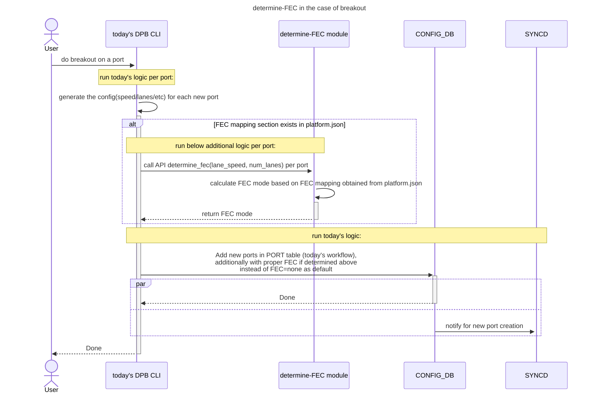
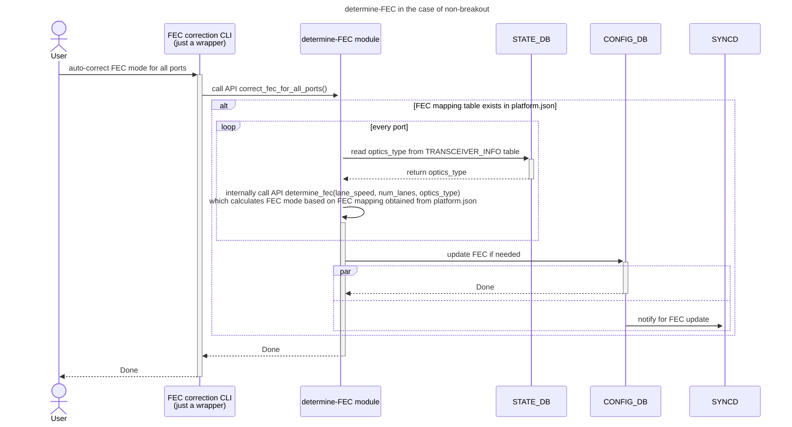

#### Background

If not configured in CONFIG_DB, FEC mode is default to none, which might not be the correct FEC for this port/optics, and link might not come up.

#### Flow For Different Use Cases





> [!NOTE]
> 1. In the above use cases, automatically determined FEC mode is saved in running config, user needs to do ```config save``` to save it permanently, which will persist across config/system reload.
> 2. For non-breakout use case, in the future, determine-fec module can be further enhanced to integrated with xcvrd, which can be triggered automatically during transceiver insertion, without human intervention.

#### API design
```
def determine_fec(lane_speed: int, num_lanes: int, optics_type: Optional[str] = None) -> str:
    """
    Determines the appropriate Forward Error Correction (FEC) type based on lane speed, number of lanes, and optics type for a specific port.
    This logic is based on FEC mapping rules defined in platform.json.

    Parameters:
    - lane_speed (int): The speed of each lane in GB.
    - num_lanes (int): The total number of lanes.
    - optics_type (Optional[str]): The type of optics in use. Can be None if not applicable.

    Returns:
    - str: The recommended FEC type based on the rules in platform.json. It can be either 'none'/'rs'/'fc'.
           If no matched entry is found in the rules or no rules are defined in platform.json, return None.

    Example:
    >>> determine_fec(25, 4, "100G-SR4")
    "rs"

    """
```

#### Platform Prequisite (optional)

FEC mapping rules are defined in platform.json:
1. FEC mapping rule is optional in platform.json. If platform/vendor doesn't define it, it's no-op in terms of FEC auto determination.
2. For now, there are two mapping rules (More rules can be added in the future if required)
    - ```fec_mapping_based_on_speed_lane```: This will be looked up if lane_speed and num_lanes are provided in parameters of determine_fec API.
    - ```fec_mapping_based_on_optics_type```: This will be looked up if optics_type is provided in parameters of determine_fec API.
3. In ```fec_mapping_based_on_speed_lane```, if there are multiple FEC values (e.g. ```rs``` and ```none```) in the field of ```fec```, preferably choose the first value (in this example, ```rs```).
4. If a port has matched FEC entry in both ```fec_mapping_based_on_speed_lane``` and ```fec_mapping_based_on_optics_type```, then prefers FEC entry in ```fec_mapping_based_on_optics_type```, which is the first mapping rule defined in platform.json. (e.g. 100G-DR will have a match in both rules, the matched FEC entry in ```fec_mapping_based_on_optics_type``` will be preferably choosen, which is ```none```)

Open questions:
1. What is FC FEC mode for 40G in [saiport.h](https://github.com/opencomputeproject/SAI/blob/4cb229c2d55cbe36c2ac10204d1fe4476f4937bd/inc/saiport.h#L191-L222)? what FEC we should put in ```fec_mapping_based_on_optics_type``` for ```optics_type=40G```? And what FEC to be put for ```lane_speed=10, num_lanes=4``` in ```fec_mapping_based_on_speed_lane```?
2. For ```100G-ER4``` ```100G-LR4``` and ```100G AOC```, shall we put FEC=rs for non-low-BER, and FEC=none for low-BER? And how do we tell if it's low-BER/non-low-BER based on optics_type? If optics_type is not enough to tell, what specific field we need to tell the BER, and shall we add another column in the mapping rule?
```
{
    "fec_mapping_based_on_optics_type": [
        {
            "optics_type": "40G",
            "fec": ["fc"]
        },
        {
            "optics_type": "100G-DR",
            "fec": ["none"]
        },
        {
            "optics_type": "100G-FR",
            "fec": ["none"]
        },
        {
            "optics_type": "100G-LR",
            "fec": ["none"]
        },
        {
            "optics_type": "100G-LR4",
            "fec": ["none"]
        },
        {
            "optics_type": "100G-ER4",
            "fec": ["none"]
        },
        {
            "optics_type": "100G AOC",
            "fec": ["none"]
        },
        {
            "optics_type": "400G",
            "fec": ["rs"]
        },
        {
            "optics_type": "ALL_OTHER",
            "fec": ["rs"]
        },
    ],
    "fec_mapping_based_on_speed_lane": [
        {
            "lane_speed": 10,
            "num_lanes": 4,
            "fec": ["fc", "none"]
        },
        {
            "lane_speed": 20,
            "num_lanes": 2,
            "fec": ["none"]
        },
        {
            "lane_speed": 25,
            "num_lanes": 2,
            "fec": ["rs", "none"]
        },
        {
            "lane_speed": 25,
            "num_lanes": 4,
            "fec": ["rs", "none"]
        },
        {
            "lane_speed": 25,
            "num_lanes": 8,
            "fec": ["rs"]
        },
        {
            "lane_speed": 50,
            "num_lanes": 1,
            "fec": ["rs"]
        },
        {
            "lane_speed": 50,
            "num_lanes": 2,
            "fec": ["rs"]
        },
        {
            "lane_speed": 50,
            "num_lanes": 4,
            "fec": ["rs"]
        },
        {
            "lane_speed": 50,
            "num_lanes": 8,
            "fec": ["rs"]
        },
        {
            "lane_speed": 50,
            "num_lanes": 16,
            "fec": ["rs"]
        },
    ]
}
```
#### Platform Common Dependency
A new ```optics_type``` field (human-readable type for optics, such as ```100G-DR```, ```100G-FR```, etc) will be added to TRANSCEIVER_INFO table, so that determine-FEC module can read it for the non-breakout use case.

To implement this, ```optics_type``` can be determined based on today's transceiver_info, and be added as part of output of API [get_transceiver_info()](https://github.com/sonic-net/sonic-platform-common/blob/1988b37c7668394f38f155c86f5462a4461fe82e/sonic_platform_base/sonic_xcvr/api/xcvr_api.py#L42-L71) in ```sonic-platform-common``` repo.

```optics_type``` field can also provide benefits in readability/service-ability/debug-ability:
1. help user/engineer to easily and quickly identify what optics are plugged onto the router (if it can be added to show CLI output later)
2. test script can easily figure out the optics type based on this single ```optics_type``` field and do test actions accordingly.

#### Difference between other design
1. [[FEC] Design for auto-fec](https://github.com/sonic-net/SONiC/pull/1416):
    - FEC mode will be decided automatically at SAI/SDK(and HW) level as part of auto-negotiation feature, if auto-neg is implemented and enabled for this platform.
    - fec=```auto``` in CONFIG_DB
2. determine-FEC module (this HLD's design):
    - FEC mode will be decided automatically above CONFIG_DB level based on platform provided rules, and be pushed into CONFIG_DB. (flow: CONFIG_DB->syncd->orcagent->SAI/SDK)
    - fec=```none```/```rs```/```fc``` in CONFIG_DB
