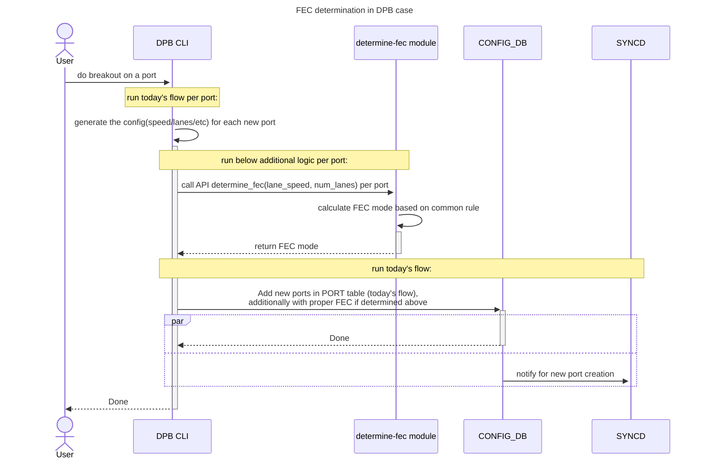
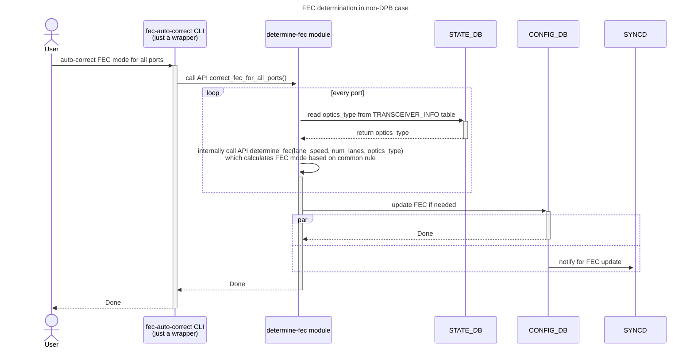

# SONiC FEC Auto Determination Design #

## Table of Content

- [Revision](#revision)
- [Scope](#scope)
- [Definitions/Abbreviations](#definitions/abbreviations)
- [Overview](#overview)
- [High-Level Design](#high-level-design)
- [API design](#api-design)
- [Common Rule for FEC Determination](#common-rule-for-fec-determination)
    - [Table 1: FEC Mapping Based on Optics Type](#table-1-fec-mapping-based-on-optics-type)
    - [Table 2: FEC Mapping Based on Lane Speed and Number of Lanes](#table-2-fec-mapping-based-on-lane-speed-and-number-of-lanes)
- [Diagram For Different Use Cases](#diagram-for-different-use-cases)
- [Dependency](#dependency)

### Revision

 | Rev |     Date    |       Author        | Change Description                         |
 |:---:|:-----------:|:-------------------:|--------------------------------------------|
 | 0.1 |             |     Shyam Kumar, Longyin Huang   | Initial version                            |

### Scope
This document is the design document for FEC auto-determination feature on SONiC.

### Definitions/Abbreviations
| **Term**       | **Definition**                                   |
| -------------- | ------------------------------------------------ |
| FEC            | Forward Error Correction                         |
| DPB            | Dynamic Port Breakout                            |

### Overview

FEC mode is a critical configuration for a port, which needs to be configured properly for the port to come up.

There are below scenarios that can end up with wrong FEC mode:
1. In DPB(Dynamic Port Breakout) case, today's DPB CLI doesn't generate FEC config for newly created ports, FEC mode is default to `none` at [SAI/SDK](https://github.com/opencomputeproject/SAI/blob/a94bbbe43242a4d9e1a4d9f70780ea9251127f5d/inc/saiport.h#L1012) layer.
2. In non-DPB case,
    - Some platforms have no FEC configured in CONFIG_DB by default. The FEC mode can be either default to `none` at SAI/SDK layer or manually configured by user who might not have enough domain knowledge.
    - Some platforms have default FEC defined in `port_config.ini`, which however might not be suitable for the specific port/optics on the system.

The feature in this document is to address the issue in both of above scenarios in a common platform-independent way, since the rule to determine FEC for a given port/optics is common for all platforms.

### High-Level Design

Add `determine-fec` module which can determine FEC mode based on common rule for a given port with a given optics. This module provides a `determine_fec` API which can be invoked in below use cases:
1. DPB use case: Enhance today's DPB CLI to automatically determine and configure FEC in CONFIG_DB for dynamically created ports, based on determine-fec module.
2. non-DPB use case: Add a user-triggered CLI `fec-auto-correct` to automatically determine and configure FEC in CONFIG_DB for existing ports, based on determine-fec module.
    - Future plan: determine-fec module can be further enhanced to be integrated with xcvrd, which can be triggered automatically during transceiver insertion, without human intervention. (details TBD)

### API design
```
def determine_fec(lane_speed: int, num_lanes: int, optics_type: Optional[str] = None) -> str:
    """
    Determines the appropriate Forward Error Correction (FEC) type based on lane speed, number of lanes, and optics type for a specific logical port.
    This logic is based on FEC mapping rules common for all platforms.

    Parameters:
    - lane_speed (int): The speed of each lane in GB.
    - num_lanes (int): The total number of lanes.
    - optics_type (Optional[str]): The type of optics in use. Can be None if not applicable.

    Returns:
    - str: The recommended FEC type based on the common rules. It can be either 'none'/'rs'/'fc'.

    Example:
    >>> determine_fec(25, 4, "100G-SR4")
    "rs"

    """
```

### Common Rule for FEC Determination

#### Table 1: FEC Mapping Based on Optics Type
| Optics Type | FEC  |
|-------------|------|
| 40G         | none |
| 100G-DR     | none |
| 100G-FR     | none |
| 100G-LR     | none |
| 100G-LR4    | none |
| 100G-ER4    | none |
| 100G AOC    | none |
| 400G        | rs   |
| ALL_OTHER   | rs   |

#### Table 2: FEC Mapping Based on Lane Speed and Number of Lanes
| Lane Speed | Number of Lanes (per Logical Port) | FEC  |
|------------|-----------------------------------|------|
| 10         | 1                                 | none |
| 10         | 4                                 | none |
| 20         | 2                                 | none |
| 25         | 1                                 | rs   |
| 25         | 2                                 | rs   |
| 25         | 4                                 | rs   |
| 25         | 8                                 | rs   |
| 50         | 1                                 | rs   |
| 50         | 2                                 | rs   |
| 50         | 4                                 | rs   |
| 50         | 8                                 | rs   |
| 50         | 16                                | rs   |

Above tables can be defined as JSON file, and be loaded by determine-fec module. Platform can also override the default FEC mapping by providing its own JSON file.

> [!NOTE]
> If a port has matched FEC entry in both above tables, then prefers FEC entry in first table. (Only exception: For `lane_speed=10, num_lane=1 or 4`, we prefer FEC entry in second table)


### Diagram For Different Use Cases





> [!NOTE]
> In the above use cases, automatically determined FEC mode is saved in running config, user needs to do ```config save``` to save it permanently.

### Dependency
A new ```optics_type``` field (human-readable type for optics, such as ```100G-DR```, ```100G-FR```, etc) will be added to TRANSCEIVER_INFO table, so that determine-fec module can read it for the non-DPB use case.

To implement this, ```optics_type``` can be determined based on today's transceiver_info, and be added as part of output of API [get_transceiver_info()](https://github.com/sonic-net/sonic-platform-common/blob/1988b37c7668394f38f155c86f5462a4461fe82e/sonic_platform_base/sonic_xcvr/api/xcvr_api.py#L42-L71) in ```sonic-platform-common``` repo.

```optics_type``` field can also provide benefits in readability/service-ability/debug-ability:
1. help user/engineer to easily and quickly identify what optics are plugged onto the router (if it can be added to show CLI output later)
2. test script can easily figure out the optics type based on this single ```optics_type``` field and do test actions accordingly.
