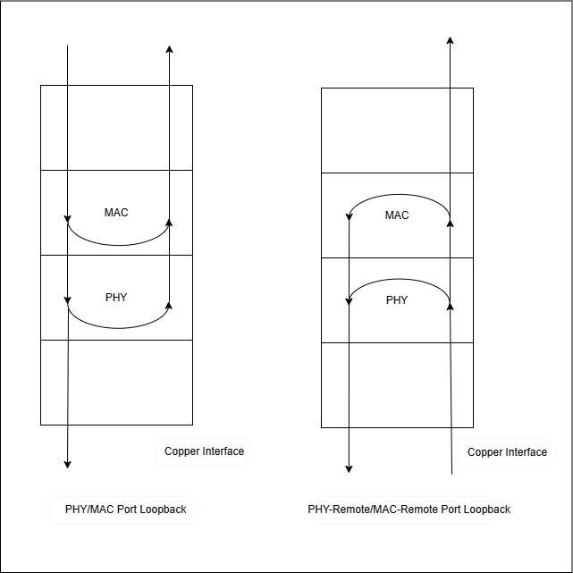
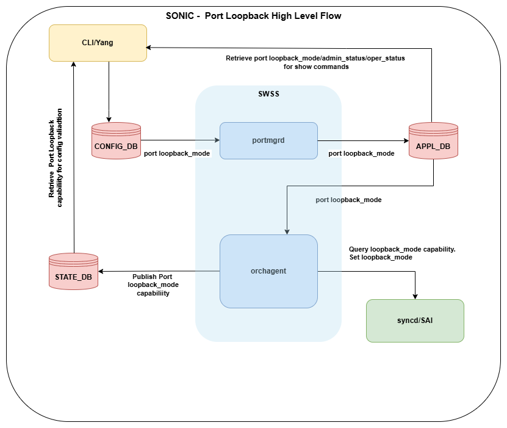
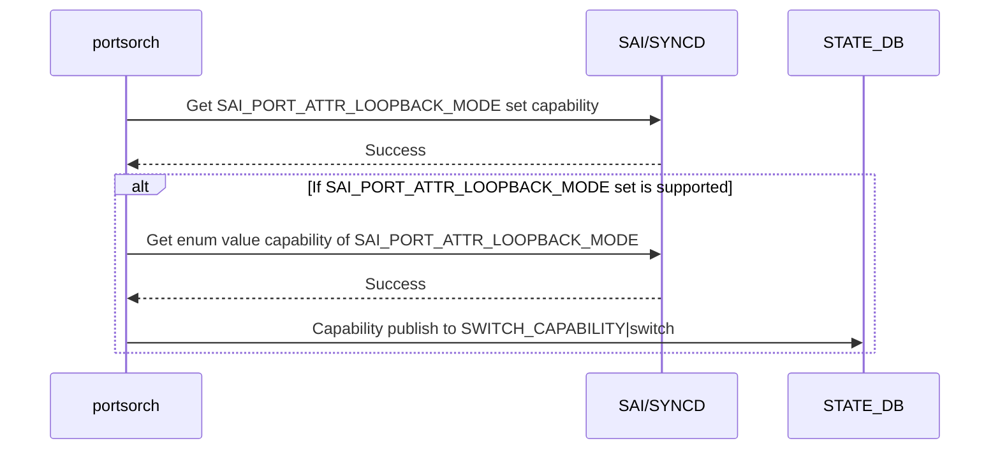
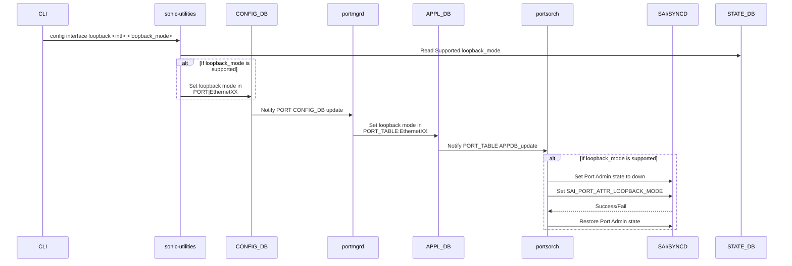
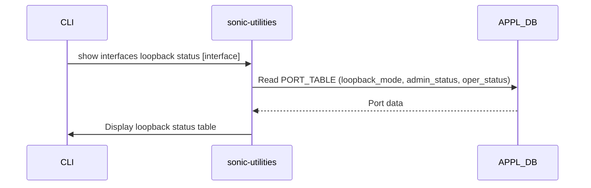

# Port Loopback Mode in SONiC

## Table of Contents

- [1. Revision](#1-revision)
- [2. Scope](#2-scope)
- [3. Definitions/Abbreviations](#3-definitionsabbreviations)
- [4. Overview](#4-overview)
- [5. Requirements](#5-requirements)
  - [5.1 Functional Requirements](#51-functional-requirements)
  - [5.2 Scalability Requirements](#52-scalability-requirements)
- [6. Architecture Design](#6-architecture-design)
- [7. High-Level Design](#7-high-level-design)
  - [7.1 Overview](#71-overview)
  - [7.2 Module Interfaces and Dependencies](#72-module-interfaces-and-dependencies)
  - [7.3 DB Schema](#73-db-schema)
    - [7.3.1 CONFIG_DB](#731-config_db)
    - [7.3.2 APPL_DB](#732-appl_db)
    - [7.3.3 STATE_DB](#733-state_db)
  - [7.4 Sequence Diagram](#74-sequence-diagram)
- [8. SAI API](#8-sai-api)
- [9. Configuration and Management](#9-configuration-and-management)
  - [9.1 CLI Enhancements](#91-cli-enhancements)
  - [9.2 YANG Model](#92-yang-model)
- [10. Warmboot and Fastboot Design Impact](#10-warmboot-and-fastboot-design-impact)
- [11. Restrictions/Limitations](#11-restrictionslimitations)
- [12. Testing Requirements/Design](#12-testing-requirementsdesign)
  - [12.1 Unit Test Cases](#121-unit-test-cases)

---

### 1. Revision

| Rev | Date       | Author                        | Change Description |
|-----|------------|-------------------------------|--------------------|
| 0.1 | 04/17/2026 | Keshav Gupta, Naveen Rampuram | Initial version    |

### 2. Scope

This document describes the design and implementation of the Port Loopback Mode feature in SONiC. The feature enables network operators to configure port-level loopback modes (PHY, MAC, PHY-remote, MAC-remote) on ASIC physical ports for diagnostics and testing, with full CLI, orchestration, and YANG model support.

### 3. Definitions/Abbreviations

| **Term** | **Meaning** |
|----------|------------|
| MAC | Media Access Control |
| PHY | Physical Layer |
| SAI | Switch Abstraction Interface |
| OA | Orchestration Agent |
| CLI | Command Line Interface |
| ASIC | Application-Specific Integrated Circuit |
| APPL | Application |

### 4. Overview

Port loopback mode is a diagnostic and testing capability that allows network traffic to be looped back at various points within the port's data path. This is useful for verifying port functionality, diagnosing link issues, and performing hardware validation without requiring an external link partner.

This feature extends SONiC to provide port-level loopback configuration, enabling operators to:
- Configure loopback mode on ASIC physical ports with support for PHY, MAC, PHY-remote, and MAC-remote modes
- View loopback mode configuration per port through CLI show commands

The following diagram is a representational diagram showing port loopback modes:



### 5. Requirements

#### 5.1 Functional Requirements

1. **Per-Interface Control**
   - Loopback modes configuration individually on each physical port

2. **Supported Modes**
   - The following loopback modes shall be configurable: `none`, `phy`, `mac`, `phy-remote`, `mac-remote`

3. **Show Commands**
   - Provide CLI commands to display per-port loopback mode configuration

4. **Config Commands**
   - Provide CLI commands to configure per-port loopback mode (`none` / `phy` / `mac` / `phy-remote` / `mac-remote`)

#### 5.2 Scalability Requirements

- The loopback mode feature operates only on physical ports and must be supported across all physical ports in the system

### 6. Architecture Design

The port loopback mode feature integrates into the existing SONiC architecture without requiring fundamental architectural changes. The feature utilizes the standard SONiC database infrastructure and orchestration framework.



### 7. High-Level Design

#### 7.1 Overview

This is a built-in SONiC feature that adds port loopback mode configuration.

#### 7.2 Module Interfaces and Dependencies

**CLI → STATE_DB (read) -> CONFIG_DB(write):**
- Read: PORT_LOOPBACK_MODE_CAPABILITY_LIST field of SWITCH_CAPABILITY|switch table from state_db to get supported loopback_mode
- Validate: Interface existence and verify if the specified loopback mode exists in the supported loopback_mode list; reject with error if not supported
- Write: `PORT|<interface>` with `loopback_mode` field in CONFIG_DB

**portmgrd → APPL_DB:**
- Subscribe: CONFIG_DB `PORT` table
- Write: APPL_DB `PORT_TABLE` with `loopback_mode` field

**PortsOrch (doPortTask):**
- PortsOrch detects `loopback_mode` field changes in APPL_DB
- Validate if loopback_mode is supported; log an error if it is not supported
- Brings the port admin state down
- Calls `setPortLoopbackMode()` to program the SAI attribute
- Restores the port admin state

**PortsOrch → SAI:**
- At PortsOrch init time, query `sai_query_attribute_capability` for `SAI_PORT_ATTR_LOOPBACK_MODE` to determine if set implementation is supported; if supported, query `sai_query_attribute_enum_values_capability` to get the supported port loopback modes and update STATE_DB
- `setPortLoopbackMode`: Set `SAI_PORT_ATTR_LOOPBACK_MODE`

**PortsOrch -> STATE_DB:**
- Write the supported loopback modes to the `PORT_LOOPBACK_MODE_CAPABILITY_LIST` field of `SWITCH_CAPABILITY|switch` in STATE_DB


#### 7.3 DB Schema

##### 7.3.1 CONFIG_DB

###### 7.3.1.1 Extend Existing Table PORT

The `loopback_mode` field is added to the existing `PORT` table.

```abnf
; Defines schema for loopback_mode (extends existing PORT table)

key                  = PORT|<ifname>              ; Interface name (Ethernet only). Must be unique
loopback_mode        = "none" /                   ; Normal operation, No loopback
                       "phy" /                    ; PHY-level local loopback
                       "mac" /                    ; MAC-level local loopback
                       "phy-remote" /             ; PHY-level remote loopback
                       "mac-remote"               ; MAC-level remote loopback
```

**Sample JSON:**

**PORT Table with MAC Loopback Enabled:**
```json
{
  "PORT|Ethernet0": {
    "value": {
      "loopback_mode": "mac"
    }
  }
}
```

##### 7.3.2 APPL_DB

###### 7.3.2.1 Extend Existing Table PORT_TABLE

The `portmgrd` propagates loopback_mode configuration from CONFIG_DB to APPL_DB.

```abnf
; Defines schema for loopback_mode (propagated from CONFIG_DB)

key                  = PORT_TABLE:<ifname>         ; Interface name (Ethernet only)
loopback_mode        = "none" /                    ; Normal operation, no loopback
                       "phy" /                     ; PHY-level local loopback
                       "mac" /                     ; MAC-level local loopback
                       "phy-remote" /              ; PHY-level remote loopback
                       "mac-remote"                ; MAC-level remote loopback
```

**Sample JSON:**
```json
{
  "PORT_TABLE:Ethernet0": {
    "value": {
       "loopback_mode": "mac"
    }
  }
}
```

##### 7.3.3 STATE_DB

###### 7.3.3.1 Extend Existing Table SWITCH_CAPABILITY

The `PORT_LOOPBACK_MODE_CAPABILITY_LIST` field is added to the existing STATE_DB `SWITCH_CAPABILITY` table during
PortsOrch agent init time. This is populated by querying `sai_query_attribute_enum_values_capability` for
`SAI_PORT_ATTR_LOOPBACK_MODE` attribute per switch.

```abnf
; Defines schema of PORT_LOOPBACK_MODE_CAPABILITY_LIST (extends existing SWITCH_CAPABILITY table)

key                                  = SWITCH_CAPABILITY|switch
PORT_LOOPBACK_MODE_CAPABILITY_LIST   = loopback_mode_list     ; Comma-separated list of supported loopback modes
loopback_mode_list                   = loopback_mode *("," loopback_mode)
loopback_mode                        = "none" / "phy" / "mac" / "phy-remote" / "mac-remote"
```

**Sample JSON:**
```json
{
  "SWITCH_CAPABILITY|switch": {
    "value": {
      "PORT_LOOPBACK_MODE_CAPABILITY_LIST": "none,phy,mac,phy-remote,mac-remote"
    }
  }
}
```

#### 7.4 Sequence Diagram

**PortsOrch Agent Init Flow:**




**Port Loopback Configuration Flow:**




**Show Port Loopback Status Flow:**



### 8. SAI API

The following table lists the SAI APIs used and their relevant attributes.

**SAI attributes used for Port Loopback Mode:**

| API   | Function                                   | Attribute                       |
|:------|:-------------------------------------------|:--------------------------------|
| PORT  | sai_set_port_attribute_fn                  | SAI_PORT_ATTR_LOOPBACK_MODE     |
| PORT  | sai_get_port_attribute_fn                  | SAI_PORT_ATTR_LOOPBACK_MODE     |
| PORT  | sai_query_attribute_capability             | SAI_PORT_ATTR_LOOPBACK_MODE     |
| PORT  | sai_query_attribute_enum_values_capability | SAI_PORT_ATTR_LOOPBACK_MODE     |

**SAI Port Loopback Mode Values:**

| SAI Enum Value                       | String Mapping | Description                              |
|:-------------------------------------|:---------------|:-----------------------------------------|
| SAI_PORT_LOOPBACK_MODE_NONE         | none           | Normal operation, no loopback            |
| SAI_PORT_LOOPBACK_MODE_PHY          | phy            | PHY-level local loopback                 |
| SAI_PORT_LOOPBACK_MODE_MAC          | mac            | MAC-level local loopback                 |
| SAI_PORT_LOOPBACK_MODE_PHY_REMOTE   | phy-remote     | PHY-level remote loopback               |
| SAI_PORT_LOOPBACK_MODE_MAC_REMOTE   | mac-remote     | MAC-level remote loopback               |


### 9. Configuration and Management

#### 9.1 CLI Enhancements

**Configuration Commands:**

1. **Set Loopback Mode**
```bash
config interface loopback <interface> {none|phy|mac|phy-remote|mac-remote}

# Examples:
config interface loopback Ethernet0 mac
config interface loopback Ethernet0 phy
config interface loopback Ethernet0 phy-remote
config interface loopback Ethernet0 mac-remote
config interface loopback Ethernet0 none          # Disable loopback (restore normal operation)
```


**Show Commands:**

1. **Show Loopback Status (all ports — no arguments)**
```bash
show interfaces loopback status [--json]

# Example output:
Interface       Loopback Mode     Admin Status    Oper Status
-----------     -------------     ------------    -----------
Ethernet0       mac               up              up
Ethernet2       phy               down            down
Ethernet3       phy-remote        up              up
```

2. **Show Loopback Status (per-interface)**
```bash
show interfaces loopback status Ethernet0

# Example output:
Interface       Loopback Mode     Admin Status    Oper Status
-----------     -------------     ------------    -----------
Ethernet0       mac               up              up
```

#### 9.2 YANG Model

**YANG Model Changes** (`sonic-port.yang`):

- A new field is added to the existing PORT YANG.
- The field is optional and is only present when loopback mode is explicitly configured

```yang
module sonic-port {
  ...
  container PORT {
    list PORT_LIST {
      ...
      leaf loopback_mode {
        type string {
          pattern "none|phy|mac|phy-remote|mac-remote";
        }
        description
          "Port loopback mode:
           none (No loopback),
           phy (PHY-level local loopback),
           mac (MAC-level local loopback),
           phy-remote (PHY-level remote loopback),
           mac-remote (MAC-level remote loopback).";
      }
      ...
    }
  }
  ...
}
```


**Configuration Persistence:**
- The loopback mode configuration persists in CONFIG_DB across reboots

### 10. Warmboot and Fastboot Design Impact

**Warmboot:**
- No special handling is required for warmboot
- The loopback mode configuration is persisted in CONFIG_DB and reapplied through the standard port configuration flow during restart
- The existing `doPortTask()` processing in `portsorch` handles configuration replay

**Fastboot:**
- No impact on fastboot performance

### 11. Restrictions/Limitations

None.

### 12. Testing Requirements/Design

#### 12.1 Unit Test Cases

Unit tests shall be added in `src/sonic-utilities/tests/` and `src/sonic-swss/tests/`.

**src/sonic-utilities/tests/**

| # | Test Case | Description |
|---|-----------|-------------|
| 1 | Test config interface loopback set mac | Set `loopback_mode` = `mac` on Ethernet0; verify CONFIG_DB write |
| 2 | Test config interface loopback set phy | Set `loopback_mode` = `phy` on Ethernet0; verify CONFIG_DB write |
| 3 | Test config interface loopback set phy-remote | Set `loopback_mode` = `phy-remote`; verify CONFIG_DB write |
| 4 | Test config interface loopback set mac-remote | Set `loopback_mode` = `mac-remote`; verify CONFIG_DB write |
| 5 | Test config interface loopback set none | Set `loopback_mode` = `none` (disable); verify CONFIG_DB write |
| 6 | Test config interface loopback invalid mode | Set `loopback_mode` = `invalid`; expect CLI rejection |
| 7 | Test config interface loopback non-existent port | Configure on non-existent interface; expect CLI error |
| 8 | Test show interfaces loopback status (all ports) | Mock CONFIG_DB; verify tabulated output |
| 9 | Test show interfaces loopback status per interface | Mock CONFIG_DB; verify single-port output |

**src/sonic-swss/tests/**

| # | Test Case | Description |
|---|-----------|-------------|
| 1 | Test loopback CONFIG_DB to APPL_DB propagation | Set `loopback_mode` in CONFIG_DB PORT; verify portmgrd propagates to APPL_DB PORT_TABLE |
| 2 | Test set MAC loopback via SAI | Configure `loopback_mode` = `mac`; verify ASIC_DB shows `SAI_PORT_ATTR_LOOPBACK_MODE` = `SAI_PORT_LOOPBACK_MODE_MAC` |
| 3 | Test set PHY loopback via SAI | Configure `loopback_mode` = `phy`; verify ASIC_DB shows `SAI_PORT_ATTR_LOOPBACK_MODE` = `SAI_PORT_LOOPBACK_MODE_PHY` |
| 4 | Test set PHY-remote loopback via SAI | Configure `loopback_mode` = `phy-remote`; verify ASIC_DB shows `SAI_PORT_ATTR_LOOPBACK_MODE` = `SAI_PORT_LOOPBACK_MODE_PHY_REMOTE` |
| 5 | Test set MAC-remote loopback via SAI | Configure `loopback_mode` = `mac-remote`; verify ASIC_DB shows `SAI_PORT_ATTR_LOOPBACK_MODE` = `SAI_PORT_LOOPBACK_MODE_MAC_REMOTE` |
| 6 | Test disable loopback (set to none) | Enable loopback (`mac`), then set `none`; verify ASIC_DB shows `SAI_PORT_LOOPBACK_MODE_NONE` |
| 7 | Test reject invalid loopback mode | Set `loopback_mode` = `invalid`; verify configuration is rejected |
