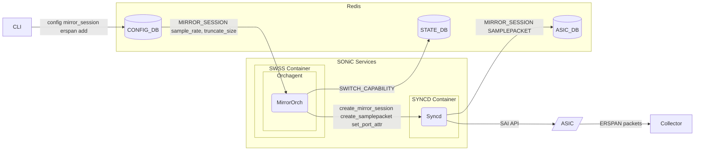
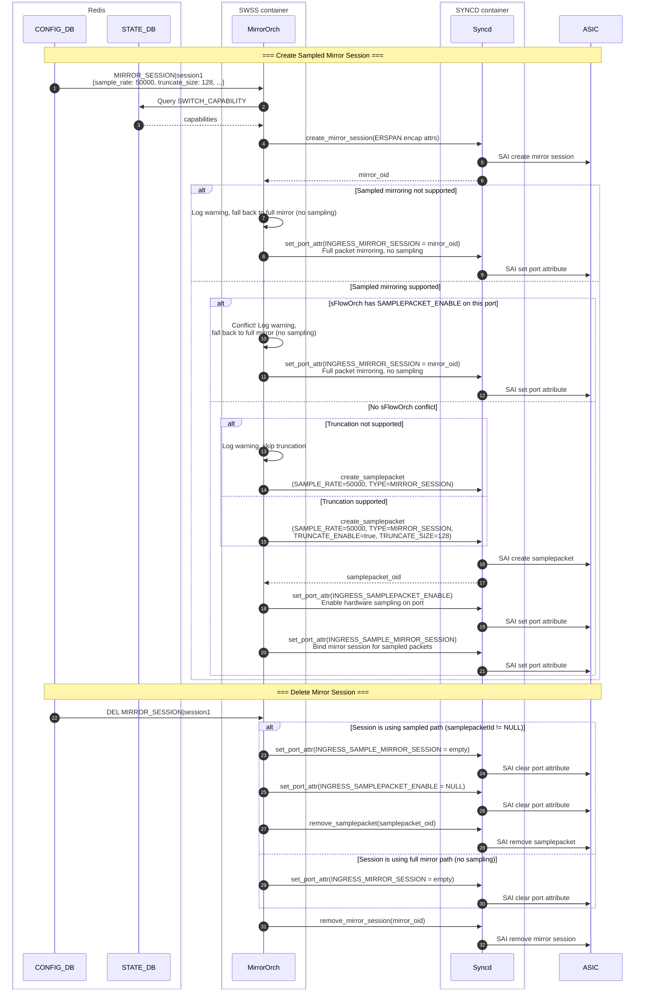

# SONiC Port Mirroring HLD
#### Rev 1.0

# Table of Contents
  * [List of Tables](#list-of-tables)
  * [Revision](#revision)
  * [About This Manual](#about-this-manual)
  * [Scope](#scope)
  * [Definition/Abbreviation](#definitionabbreviation)
  * [1. Requirements Overview](#1-requirement-overview)
      * [1.1 Functional Requirements](#11-functional-requirements)
      * [1.2 Configuration and Management Requirements](#12-configuration-and-management-requirements)
      * [1.3 Scalability Requirements](#13-scalability-requirements)
      * [1.4 Warm Boot Requirements](#14-warm-boot-requirements)
  * [2. Functionality](#2-functionality)
      * [2.1 Functional Description](#21-functional-description)
  * [3. Design](#3-design)
      * [3.1 Overview](#31-overview)
          * [3.1.1 Architecture Overview](#311-architecture-overview)
          * [3.1.2 Data Format](#312-data-format)
      * [3.2 DB Changes](#32-db-changes)
          * [3.2.1 CONFIG DB](#321-config-db)
          * [3.2.2 APP_DB](#322-app_db)
          * [3.2.3 STATE_DB](#323-state_db)
          * [3.2.4 ASIC_DB](#324-asic_db)
          * [3.2.5 COUNTER_DB](#325-counter_db)
      * [3.3 Switch State Service Design](#33-switch-state-service-design)
          * [3.3.1 Orchestration Agent](#331-orchestration-agent)
          * [3.3.2 Other Process](#332-other-process)
      * [3.4 Mirror Capability Discovery](#34-mirror-capability-discovery)
      * [3.5 SAI](#35-sai)
         * [3.5.1 Port Mirroring SAI APIs](#351-port-mirroring-sai-apis)
         * [3.5.2 Sampled Port Mirroring SAI APIs](#352-sampled-port-mirroring-sai-apis)
      * [3.6 CLI](#36-cli)
          * [3.6.1 Data Models](#361-data-models)
          * [3.6.2 Configuration Commands](#362-configuration-commands)
          * [3.6.3 Show Commands](#363-show-commands)
          * [3.6.4 Clear Commands](#364-clear-commands)
          * [3.6.5 Debug Commands](#365-debug-commands)
          * [3.6.6 Rest API Support](#366-rest-api-support)
          * [3.6.7 GNMI Support](#367-gnmi-support)
  * [4. Flow Diagrams](#4-flow-diagrams)
  * [5. Error Handling](#5-Error-Handling)
  * [6. Serviceability and Debug](#6-serviceability-and-debug)
  * [7. Warm Boot Support](#7-warm-boot-support)
  * [8. Scalability](#8-scalability)
  * [9. Unit Test](#9-unit-test)
      * [9.1 CLI Test Cases](#91-cli-test-cases)
      * [9.2 Mirror Capability Test Cases](#92-mirror-capability-test-cases)
      * [9.3 Sampled Port Mirroring Test Cases](#93-sampled-port-mirroring-test-cases)
          * [9.3.1 Swss Virtual Switch Tests](#931-swss-virtual-switch-tests)
          * [9.3.2 System Tests](#932-system-tests)
  * [Appendix A: Problem Statement](#appendix-a-problem-statement)
  * [Appendix B: Bandwidth Estimation](#appendix-b-bandwidth-estimation)

# List of Tables
[Table 1: Abbreviations](#table-1-abbreviations)


# Revision
| Rev |     Date    |       Author       | Change Description                         |
|:---:|:-----------:|:------------------:|--------------------------------------------|
| 0.1 | 05/17/2019  |   Rupesh Kumar      | Initial version                            |
| 0.2 | 09/05/2025  |   Stephen Sun      | Added mirror capability discovery and validation |
| 0.3 | 04/16/2026  |   Janet Cui        | Added sampled port mirroring with truncation support on ERSPAN sessions |

# About this Manual
This document provides general information about extending mirroring implementation in SONiC.
# Scope
This document describes the high-level design of the Mirroring feature in SONiC, including enhancements for per-port
sampled mirroring and packet truncation support for ERSPAN (Enhanced Remote Switched Port Analyzer) sessions.

Sampled mirroring enables users to configure a sampling rate on port mirror sessions so that only a statistical
subset of packets is mirrored, reducing bandwidth consumption on the monitor port and the collector. Packet
truncation further reduces bandwidth by mirroring only the first N bytes of each sampled packet.

# Definition/Abbreviation
### Table 1: Abbreviations
| **Term**                 | **Meaning**                         |
|--------------------------|-------------------------------------|
|   SPAN                   |  Switched Port ANalyzer                |
|   ERSPAN                 |  Encapsulated Remote Switched Port ANalyzer                |
|   SAI                    | Switch Abstraction Interface |
|   ASIC                   | Application-Specific Integrated Circuit |
|   MirrorOrch             | Orchagent module that manages mirror sessions |
|   CoPP                   | Control Plane Policing |


# 1 Requirement Overview
## 1.1 Functional Requirements

1. Port/Port-channel mirroring support
     - Add support to mirror ingress traffic on port/port-channel to SPAN/ERPSAN mirror session.
     - Add support to mirror egress traffic on port/port-channel to SPAN/ERSPAN mirror session.
     - Add support to mirror both ingress/egress traffic on port/port-channel to SPAN/ERSPAN mirror session.

2. Dynamic session management
    - Allow multiple source to single destination.
    - Mirror session on source portchannel will be active if at least one port is part of portchannel.
    - Mirror session on source portchannel will become inactive when portchannel has no members.
    - ERSPAN session will be active/inactive based on destination IP reachability.

3. ACL rules can continue to use port/ERSPAN sessions as the action.

4. Configuration CLI for mirror session
    - CLI allows all flavors of mirror sessions.
    - CLI validation for all mandatory parameters in ERSPAN configuration.
    - CLI validation for all mandatory parameters in port/portchannel mirroring.
    - CLI to allow mirror session configuration only with destination port.
    - CLI command: `config mirror_session erspan add ... --sample_rate <value> --truncate_size <value>`
    - Show command displays sample rate and truncate size when configured

5. Sampled Port Mirroring with Truncation Support on ERSPAN Session
    - Support configuring a sample rate on ERSPAN mirror sessions (e.g., 1:50000)
    - Sample rate is per-port, applied at ingress
    - When sample rate is configured, use SAI_OBJECT_TYPE_SAMPLEPACKET (TYPE=MIRROR_SESSION) instead of direct port mirror binding
    - Support egress sampled mirroring (if SAI capability permits)
    - Backward compatible — existing mirror sessions without sample rate continue to work as before (full mirroring)
    - Support configuring truncate size on sampled mirror sessions (e.g., 128 bytes)
    - Truncation requires SAI_SAMPLEPACKET_ATTR_TRUNCATE_ENABLE and SAI_SAMPLEPACKET_ATTR_TRUNCATE_SIZE
    - SAI capability check to gracefully handle platforms that do not support truncation

## 1.2 Configuration and Management Requirements
- Existing CLI 'config mirror_session add/remove'to be extended to include source port/portchannel.
- Existing CLI 'config mirror_session add/remove' to be extended to include destination port/portchannel.
- Existing CLI 'show mirror session' is extended to support all flavors of mirror sessions.


## 1.3 Scalability Requirements
- Up to max ASIC capable mirror sessions to be supported.
- Once max mirror sessions are created and user attempts to create new session, error will be logged in syslog.


## 1.4 Warm Boot Requirements
- Mirroring functionality should continue to work across warm reboot.

To support planned system warm boot.
To support SWSS docker warm boot.


# 2 Functionality

Refer section 1

## 2.2 Functional Description
Refer section 1.1

## 2.3 Functional Description

Mirroring to destination VLAN (RSPAN) is not supported in this release.

# 3 Design
## 3.1 Overview

This HLD describes the design of port mirroring in SONiC, covering SPAN and ERSPAN session management, per-port/port-channel source binding, dynamic session lifecycle based on destination reachability, and ACL-based mirroring integration.

Additionally, this HLD covers per-port sampled port mirroring with packet truncation on ERSPAN sessions (added in revision 0.3), and mirror capability discovery. See [Appendix A](#appendix-a-problem-statement) for the problem statement and [Appendix B](#appendix-b-bandwidth-estimation) for bandwidth estimation.

### 3.1.1 Architecture Overview
The following diagram shows the end-to-end control flow for sampled port mirroring with truncation:



### 3.1.2 Data Format

The mirrored packet goes through the following processing in the ASIC hardware pipeline:
1. Sampling: For each ingress packet on the monitored port, a hardware counter is incremented. When the counter reaches N (the configured sample rate), the packet is selected for mirroring.
2. Truncation: The selected packet is truncated to the configured truncate size (e.g., 128 bytes). Only the packet headers are retained.
3. GRE encapsulation: The truncated packet is encapsulated with outer headers for tunneling to the collector.
4. Forwarding: The encapsulated mirror packet is forwarded to the monitor port and routed to the collector. The original packet continues normal forwarding unaffected.

Encapsulation format (GRE type 0x8949):

 

Total mirror packet size: 128B + 62B overhead = 190 bytes (estimated)

Encapsulation overhead: 62 bytes. The overhead includes the outer Ethernet header (14B), outer IP header (20B), and GRE with vendor-specific header (28B).


## 3.2 DB Changes
### 3.2.1 CONFIG DB

Existing table PORT_MIRROR_TABLE is enhanced to accept new source and destination configuration options  in the configuration database. This table is filled by the management framework.

#### CONFIG_PORT_MIRROR_TABLE

    ;Configure SPAN/ERSPAN mirror session.
    ;storm control type - broadcast / unknown-unicast / unknown-multicast
    key       = PORT_MIRROR:mirror_session_name ; mirror_session_name is
                                                      ; unique session
                                                      ; identifier
    ;field  = value
    type = SPAN or ERSPAN ; SPAN or ERSPAN session.
    destination_port = PORT_TABLE:ifname    ; ifname must be unique across PORT TABLE.
    source_port = PORT_TABLE:ifname    ; ifname must be unique across PORT,LAG TABLES
    direction     = RX or TX or BOTH           ; Direction RX or TX or BOTH.

    mirror_session_name = 1*255VCHAR

#### Sampled Mirroring Extension

Extend the existing `MIRROR_SESSION` table with two new optional fields:

    ```
    MIRROR_SESSION|{{session_name}}  
        "sample_rate": {{uint32}}   (Optional)  
        "truncate_size": {{uint32}} (Optional)

    key = MIRROR_SESSION|session_name 
    ; field = value 
    sample_rate = uint32 ; Sampling rate. 0 = full mirror (default), N = mirror 1-in-N packets. 
    truncate_size = uint32 ; Truncation size in bytes. 0 = no truncation (default).
    ```

### 3.2.2 APP_DB
No tables are introduced in APP_DB
### 3.2.3 STATE_DB

#### Table SWITCH_CAPABILITY

Table `SWITCH_CAPABILITY` is not a new table. It has been designed to represent various switch object capabilities supported on the platform.

The following fields are introduced in this design for mirror capability discovery:

```text
PORT_INGRESS_MIRROR_CAPABLE            = "true" | "false"    ; whether SAI attribute SAI_PORT_ATTR_INGRESS_MIRROR_SESSION is supported
PORT_EGRESS_MIRROR_CAPABLE             = "true" | "false"    ; whether SAI attribute SAI_PORT_ATTR_EGRESS_MIRROR_SESSION is supported
PORT_INGRESS_SAMPLE_MIRROR_CAPABLE     = "true" | "false"    ; whether SAI_PORT_ATTR_INGRESS_SAMPLE_MIRROR_SESSION is supported
PORT_EGRESS_SAMPLE_MIRROR_CAPABLE      = "true" | "false"    ; whether SAI_PORT_ATTR_EGRESS_SAMPLE_MIRROR_SESSION is supported
SAMPLEPACKET_TRUNCATION_CAPABLE        = "true" | "false"    ; whether SAI_SAMPLEPACKET_ATTR_TRUNCATE_ENABLE is supported
```

These capabilities are discovered during system initialization by SwitchOrch using `sai_query_attribute_capability()` and stored in STATE_DB under the key `SWITCH_CAPABILITY|switch`.

**Example STATE_DB entry:**
```text
SWITCH_CAPABILITY|switch
  PORT_INGRESS_MIRROR_CAPABLE: "true"
  PORT_EGRESS_MIRROR_CAPABLE: "false"
  PORT_INGRESS_SAMPLE_MIRROR_CAPABLE: "true"
  PORT_EGRESS_SAMPLE_MIRROR_CAPABLE: "false"
  SAMPLEPACKET_TRUNCATION_CAPABLE: "true"
```

This indicates that the ASIC supports ingress mirror sessions but does not support egress mirror sessions. The platform also supports ingress sampled port mirroring and packet truncation on sampled sessions. The actual values depend on the platform and vendor SAI implementation. MirrorOrch checks these capabilities at runtime and gracefully falls back when a capability is not supported.

### 3.2.4 ASIC_DB
No changes are introduced in ASIC_DB.·
### 3.2.5 COUNTER_DB
No changes are introduced in COUNTER_DB.·

## 3.3 Switch State Service Design
### 3.3.1 Orchestration Agent

Mirror Orchestration agent is modified to support this feature:
   - Handle both SPAN and ERSPAN sessions separately·
   - No changes to ERSPAN functionality.
   - Configure mirror session based on CONFIG_DB parameters.
   - Port mirror session will be active in below cases.
        - Session with destination port only config becomes active when session is created in SAI. These sessions can be used for ACL mirroring.
        - Session with source/destination/direction config will be active once the session created from SAI is programmed on the source ports.
   - Populates the mirror attribute SAI structures and pushes the entry to ASIC_DB.·

#### Sampled Port Mirroring Extension

MirrorOrch is extended to manage the lifecycle of SamplePacket SAI objects alongside the existing mirror session objects. When `sample_rate` is configured, MirrorOrch creates a SamplePacket and binds it to the port using `INGRESS_SAMPLEPACKET_ENABLE` + `INGRESS_SAMPLE_MIRROR_SESSION`, instead of the existing `INGRESS_MIRROR_SESSION` used for full-packet mirroring. See Section 3.1.1 for the architecture overview and Section 4 for the detailed workflow.

## 3.4 Mirror Capability Discovery

The mirror capability discovery feature provides runtime detection and validation of ASIC mirror capabilities to ensure proper configuration and graceful error handling.

### 3.4.1 Capability Discovery Process

The capability discovery process involves multiple layers:

1. **SAI Layer Discovery**: SwitchOrch queries SAI for port mirror capabilities using `sai_query_attribute_capability()` for:
   - `SAI_PORT_ATTR_INGRESS_MIRROR_SESSION`
   - `SAI_PORT_ATTR_EGRESS_MIRROR_SESSION`
   - `SAI_PORT_ATTR_INGRESS_SAMPLE_MIRROR_SESSION`
   - `SAI_PORT_ATTR_EGRESS_SAMPLE_MIRROR_SESSION`
   - `SAI_SAMPLEPACKET_ATTR_TRUNCATE_ENABLE`

2. **STATE_DB Storage**: Discovered capabilities are stored in STATE_DB under `SWITCH_CAPABILITY|switch`:
   - `PORT_INGRESS_MIRROR_CAPABLE`: "true"/"false"
   - `PORT_EGRESS_MIRROR_CAPABLE`: "true"/"false"
   - `PORT_INGRESS_SAMPLE_MIRROR_CAPABLE`: "true"/"false"
   - `PORT_EGRESS_SAMPLE_MIRROR_CAPABLE`: "true"/"false"
   - `SAMPLEPACKET_TRUNCATION_CAPABLE`: "true"/"false"

3. **Runtime Validation**: MirrorOrch validates capabilities before configuring mirror sessions

### 3.4.2 Capability Validation Flow

The capability validation follows this sequence:

1. **User CLI Command**: User executes a mirror session configuration command
2. **CLI Validation**: `is_port_mirror_capability_supported()` function is called
3. **STATE_DB Query**: System queries STATE_DB for mirror capabilities
4. **Direction Validation**: System validates if the requested mirror direction is supported
5. **Result**: Command proceeds if supported, or returns error message if not supported

### 3.4.3 Error Handling

- **CLI Level**: Early validation prevents invalid configurations
- **OrchAgent Level**: Runtime validation with detailed error logging
- **Graceful Degradation**: System continues to function with unsupported features disabled

### 3.4.4 Implementation Components

#### SwitchOrch Enhancements
- New capability constants: `SWITCH_CAPABILITY_TABLE_PORT_INGRESS_MIRROR_CAPABLE`, `SWITCH_CAPABILITY_TABLE_PORT_EGRESS_MIRROR_CAPABLE`, `SWITCH_CAPABILITY_TABLE_PORT_INGRESS_SAMPLE_MIRROR_CAPABLE`, `SWITCH_CAPABILITY_TABLE_PORT_EGRESS_SAMPLE_MIRROR_CAPABLE`, `SWITCH_CAPABILITY_TABLE_SAMPLEPACKET_TRUNCATION_CAPABLE`
- `querySwitchPortMirrorCapability()`: Discovers and stores port mirroring capabilities
- `querySwitchSampledMirrorCapability()`: Discovers and stores sampled mirroring and truncation capabilities
- Public interface methods: `isPortIngressMirrorSupported()`, `isPortEgressMirrorSupported()`, `isPortIngressSampleMirrorSupported()`, `isPortEgressSampleMirrorSupported()`, `isSamplepacketTruncationSupported()`

#### MirrorOrch Enhancements
- Capability validation in `setUnsetPortMirror()`
- Separate validation for ingress and egress directions
- Detailed error logging for unsupported operations

#### CLI Enhancements
- `is_port_mirror_capability_supported()`: Queries STATE_DB for capabilities
- Integration with `validate_mirror_session_config()`
- User-friendly error messages for unsupported directions

## 3.5 SAI
### 3.5.1 Port Mirroring SAI APIs
Mirror SAI interface APIs are already defined.
More details about SAI API and attributes are described below SAI Spec @

https://github.com/opencomputeproject/SAI/blob/master/inc/saimirror.h
```
    /**
     * @brief SAI type of mirroring
     */
    typedef enum _sai_mirror_session_type_t
    {
        /** Local SPAN */
        SAI_MIRROR_SESSION_TYPE_LOCAL = 0,

        /** Remote SPAN */
        SAI_MIRROR_SESSION_TYPE_REMOTE,

        /** Enhanced Remote SPAN */
        SAI_MIRROR_SESSION_TYPE_ENHANCED_REMOTE,
    } sai_mirror_session_type_t;

    /**
     * @brief Destination/Analyzer/Monitor Port.
     *
     * @type sai_object_id_t
     * @flags MANDATORY_ON_CREATE | CREATE_AND_SET
     * @objects SAI_OBJECT_TYPE_PORT, SAI_OBJECT_TYPE_LAG
     * @condition SAI_MIRROR_SESSION_ATTR_MONITOR_PORTLIST_VALID == false
     */
    SAI_MIRROR_SESSION_ATTR_MONITOR_PORT,
```
https://github.com/opencomputeproject/SAI/blob/master/inc/saimirror.h

```
    /**
     * @brief Enable/Disable Mirror session
     *
     * Enable ingress mirroring by assigning list of mirror session object id
     * as attribute value, disable ingress mirroring by assigning object_count
     * as 0 in objlist.
     *
     * @type sai_object_list_t
     * @flags CREATE_AND_SET
     * @objects SAI_OBJECT_TYPE_MIRROR_SESSION
     * @default empty
     */
    SAI_PORT_ATTR_INGRESS_MIRROR_SESSION,

    /**
     * @brief Enable/Disable Mirror session
     *
     * Enable egress mirroring by assigning list of mirror session object id as
     * attribute value Disable egress mirroring by assigning object_count as 0
     * in objlist.
     *
     * @type sai_object_list_t
     * @flags CREATE_AND_SET
     * @objects SAI_OBJECT_TYPE_MIRROR_SESSION
     * @default empty
     */
    SAI_PORT_ATTR_EGRESS_MIRROR_SESSION,
```
### 3.5.2 Sampled Port Mirroring SAI APIs
Sampled port mirroring leverages the SAI SamplePacket object to enable per-port hardware-based sampling with optional truncation. The key change is that MirrorOrch creates an additional `SamplePacket` SAI object and binds it to the port using `INGRESS_SAMPLEPACKET_ENABLE` + `INGRESS_SAMPLE_MIRROR_SESSION`, instead of the existing `INGRESS_MIRROR_SESSION` used for full-packet mirroring.

#### SamplePacket Attributes

More details about the [SamplePacket SAI API](https://github.com/opencomputeproject/SAI/blob/master/inc/saisamplepacket.h).

```
    /**
      * @brief Sampling rate: 1 out of every N packets is sampled.
      *
      * @type sai_uint32_t
      * @flags MANDATORY_ON_CREATE | CREATE_AND_SET
      */
     SAI_SAMPLEPACKET_ATTR_SAMPLE_RATE,
 
     /**
      * @brief SamplePacket type.
      * MIRROR_SESSION type directs sampled packets to a mirror session (hardware path).
      * SLOW_PATH type directs sampled packets to CPU (used by sFlow).
      *
      * @type sai_samplepacket_type_t
      * @flags CREATE_ONLY
      * @default SAI_SAMPLEPACKET_TYPE_SLOW_PATH
      */
     SAI_SAMPLEPACKET_ATTR_TYPE,
 
     /**
      * @brief Enable truncation on sampled packets.
      *
      * @type bool
      * @flags CREATE_AND_SET
      * @default false
      */
     SAI_SAMPLEPACKET_ATTR_TRUNCATE_ENABLE,
 
     /**
      * @brief Truncation size in bytes. Only valid when TRUNCATE_ENABLE is true.
      *
      * @type sai_uint32_t
      * @flags CREATE_AND_SET
      * @validonly SAI_SAMPLEPACKET_ATTR_TRUNCATE_ENABLE == true
      * @default 0
      */
     SAI_SAMPLEPACKET_ATTR_TRUNCATE_SIZE,
```

#### Port Attributes for Sampled Mirroring

More details about the [Port SAI API](https://github.com/opencomputeproject/SAI/blob/master/inc/saiport.h)

```
    /**
      * @brief Enable/Disable SamplePacket session on port.
      *
      * Enable ingress sampling by assigning samplepacket object id.
      * Disable ingress sampling by assigning SAI_NULL_OBJECT_ID.
      *
      * @type sai_object_id_t
      * @flags CREATE_AND_SET
      * @objects SAI_OBJECT_TYPE_SAMPLEPACKET
      * @allownull true
      * @default SAI_NULL_OBJECT_ID
      */
     SAI_PORT_ATTR_INGRESS_SAMPLEPACKET_ENABLE,
 
    /**
      * @brief Enable/Disable sample ingress mirroring.
      *
      * Enable sample ingress mirroring by assigning list of mirror object ids.
      * Disable sample ingress mirroring by assigning object_count as 0.
      *
      * @type sai_object_list_t
      * @flags CREATE_AND_SET
      * @objects SAI_OBJECT_TYPE_MIRROR_SESSION
      * @default empty
      */
     SAI_PORT_ATTR_INGRESS_SAMPLE_MIRROR_SESSION,
```

#### SAI API Call Sequence

**Create sampled mirror session:**
 
 1. `sai_mirror_api->create_mirror_session()` — Create ERSPAN mirror session with encapsulation attributes (src_ip, dst_ip, gre_type, dscp, ttl, etc.)
 2. `sai_samplepacket_api->create_samplepacket()` — Create SamplePacket object with `SAMPLE_RATE`, `TYPE=SAI_SAMPLEPACKET_TYPE_MIRROR_SESSION`, and optionally `TRUNCATE_ENABLE` + `TRUNCATE_SIZE`
 3. `sai_port_api->set_port_attribute(SAI_PORT_ATTR_INGRESS_SAMPLEPACKET_ENABLE)` — Bind SamplePacket to port for ingress sampling
 4. `sai_port_api->set_port_attribute(SAI_PORT_ATTR_INGRESS_SAMPLE_MIRROR_SESSION)` — Bind mirror session to port for sampled packet destination
 
**Delete sampled mirror session (reverse order):**
 
 1. `sai_port_api->set_port_attribute(SAI_PORT_ATTR_INGRESS_SAMPLE_MIRROR_SESSION)` — Clear mirror session binding (objlist count = 0)
 2. `sai_port_api->set_port_attribute(SAI_PORT_ATTR_INGRESS_SAMPLEPACKET_ENABLE)` — Clear SamplePacket binding (SAI_NULL_OBJECT_ID)
 3. `sai_samplepacket_api->remove_samplepacket()` — Remove SamplePacket object
 4. `sai_mirror_api->remove_mirror_session()` — Remove mirror session

**SAI Header References:**
- saisamplepacket.h: https://github.com/opencomputeproject/SAI/blob/master/inc/saisamplepacket.h
- saimirror.h: https://github.com/opencomputeproject/SAI/blob/master/inc/saimirror.h
- saiport.h: https://github.com/opencomputeproject/SAI/blob/master/inc/saiport.h

## 3.6 CLI
### 3.6.1 Data Models
SONiC Yang model  and OpenConfig extension models will be introduced for this feature.

## openconfig-mirror-ext
```diff
  +--rw mirror
     +--rw config
     +--ro state
     +--rw sessions
        +--rw session* [name]
           +--rw name      -> ../config/name
           +--rw config
           |  +--rw name?        string
           |  +--rw dst-port?    oc-if:base-interface-ref
           |  +--rw src-port?    oc-if:base-interface-ref
           |  +--rw direction?   mirror-session-direction
           |  +--rw src-ip?      oc-inet:ip-address
           |  +--rw dst-ip?      oc-inet:ip-address
           |  +--rw dscp?        uint8
           |  +--rw gre-type?    string
           |  +--rw ttl?         uint8
           |  +--rw queue?       uint8
           +--ro state
              +--ro name?           string
              +--ro dst-port?       oc-if:base-interface-ref
              +--ro src-port?       oc-if:base-interface-ref
              +--ro direction?      mirror-session-direction
              +--ro src-ip?         oc-inet:ip-address
              +--ro dst-ip?         oc-inet:ip-address
              +--ro dscp?           uint8
              +--ro gre-type?       string
              +--ro ttl?            uint8
              +--ro queue?          uint8
              +--ro status?         string
              +--ro monitor-port?   oc-if:base-interface-ref
              +--ro dst-mac?        oc-yang:mac-address
              +--ro route-prefix?   oc-inet:ip-address
              +--ro vlan-id?        uint16
              +--ro next-hop-ip?    oc-inet:ip-address

```
| Prefix |     Module Name    |
|:---:|:-----------:|
| oc-mirror-ext | openconfig-mirror-ext  |
| oc-ext | openconfig-extensions  |
| oc-yang | openconfig-yang-types  |
| oc-inet | openconfig-inet-types  |
| oc-if | openconfig-interfaces  |

## sonic-mirror-session
```diff
  +--rw sonic-mirror-session
     +--rw MIRROR_SESSION
     |  +--rw MIRROR_SESSION_LIST* [name]
     |     +--rw name         string
     |     +--rw src_ip?      inet:ipv4-address
     |     +--rw dst_ip?      inet:ipv4-address
     |     +--rw gre_type?    string
     |     +--rw dscp?        uint8
     |     +--rw ttl?         uint8
     |     +--rw queue?       uint8
     |     +--rw dst_port?    union
     |     +--rw src_port?    union
     |     +--rw direction?   enumeration
     +--ro MIRROR_SESSION_TABLE
        +--ro MIRROR_SESSION_TABLE_LIST* [name]
           +--ro name            string
           +--ro status?         string
           +--ro monitor_port?   -> /prt:sonic-port/PORT/PORT_LIST/ifname
           +--ro dst_mac?        yang:mac-address
           +--ro route_prefix?   inet:ipv4-address
           +--ro vlan_id?        -> /svlan:sonic-vlan/VLAN/VLAN_LIST/name
           +--ro next_hop_ip?    inet:ipv4-address

```
#### Updated YANG Model (Sampled Port Mirroring)

The following leaves are added to `MIRROR_SESSION_LIST` in `sonic-mirror-session.yang` for sampled port mirroring:

```yang
leaf sample_rate {
    when "current()/../type = 'ERSPAN'";
    type uint32 {
        range "0|256..8388608" {
            error-message "Sample rate must be 0 (no sampling/full mirroring) or 256-8388608";
            error-app-tag sample-rate-invalid;
        }
    }
    default 0;
    description
        "Sampling rate for mirrored packets. 0 means full mirroring
         (no sampling). N means mirror 1 out of every N packets.";
}

leaf truncate_size {
    when "current()/../type = 'ERSPAN'";
    type uint32 {
        range "0|64..9216" {
            error-message "Truncate size must be 0 (no truncation) or 64-9216 bytes";
            error-app-tag truncate-size-invalid;
        }
    }
    default 0;
    description
        "Truncation size in bytes for mirrored packets.
         0 means no truncation. When set, only the first N bytes
         of each mirrored packet are sent.";
}
```

### 3.6.2 Configuration Commands

Existing mirror session commands are enhanced to support this feature.
```
    # Modify existing ERSPAN configuration as below.
    config mirror_session add erspan <session-name> <src_ip> <dst_ip> <gre> <dscp>  [ttl] [queue] --policer <policer>

    #Configure Destination only span mirror session.
    config mirror_session add span <session-name> <destination_ifName>

    # Modify existing ERSPAN configuration to accept source port and direction
    config mirror_session add erspan <session-name> <src_ip> <dst_ip> <gre> <dscp>  [ttl] [queue] [src_port] [rx/tx/both] --policer <policer>

    #Configure Port mirror span mirror session.
    config mirror_session add span <session-name> <destination_ifName> <source_ifName> <rx/tx/both> [queue] --policer <policer>
```

KLISH CLI Support.

    # SPAN config
    # **switch(config)# [no] mirror-session <session-name>** <br>
    **switch(config-mirror-<session-name>)# [no] destination <dest_ifName> [source <src_ifName> direction <rx/tx/both>]** <br>
    dest_ifName can be port only
    src_ifName can be port/port-channel>

    # ERSPAN config
    **switch(config)# [no] mirror-session <session-name>** <br>
    **switch(config-mirror-<session-name>)# [no] destination erspan src_ip <src_ip> dst_ip <dst_ip> dscp < dscp > ttl < ttl > [ gre < gre >] [queue <queue>] [source <src_ifName> direction <rx/tx>**] [policer <policer>]<br>

#### Sampled Port Mirroring on ERSPAN

Extend the existing config mirror_session erspan add command with two new optional parameters (`--sample_rate` and `--truncate_size`):
```
    config mirror_session erspan add <session_name> \
        <src_ip> <dst_ip> <dscp> <ttl> \
        [gre_type] [queue] [src_port] [direction] \
        [--policer <policer_name>] \
        [--sample_rate <value>] [--truncate_size <value>]
```

### 3.6.3 Show Commands

The following show command display all the mirror sessions that are configured.

    # show mirror-session
    ERSPAN Sessions
    Name       Status   SRC IP    DST IP      GRE    DSCP    TTL  Queue    Policer    Monitor Port    SRC Port    Direction
    ---------  ------   --------  --------  -----  ------  -----  -------  ---------  --------------  ----------  -----------
    everflow0  active   10.1.1.1  12.1.1.1      0      10     10

    SPAN Sessions
    Name    Status    DST Port    SRC Port    Direction    Queue    Policer
    ------  --------  ----------  ----------  -----------  -------  ---------
    sess1   active    Ethernet24  Ethernet32  rx

KLISH show mirror-session is same as above.

#### Sampled Port Mirroring on ERSPAN

The show mirror_session output is extended with two new columns (`Sample Rate` and `Truncate Size`):

```
    admin@sonic:~$  show mirror_session
    ERSPAN Sessions
    Name    Status    SRC IP      DST IP      GRE      DSCP    TTL  Queue    Policer    Monitor Port    SRC Port    Direction      Sample Rate    Truncate Size
    ------  --------  ----------  ----------  -----  ------  -----  -------  ---------  --------------  ----------  -----------  -------------  ---------------
    test1   error     10.0.1.192  10.0.1.193              8     64                                                                       50000              128
```

###  3.6.4 Clear Commands
No command variants of config commands take care of clear config.

### 3.6.5 Debug Commands
Not applicable

### 3.6.6 REST API Support

- Please check all REST API from link @ https://<switch_ip>/ui link. 
- This webserver provides user information about all the REST URLS, REST Data. Return codes. 
- This webserver also provides interactive support to try REST queries.

- Following REST SET and GET APIs will be supported

The following show command display all the mirror sessions that are configured.
```
    # Get all mirror sessions
    # curl -X GET "https://<switch_ip>/restconf/data/sonic-mirror-session:sonic-mirror-session" -H "accept: application/yang-data+json"

    # Create SPAN session
    # curl -X POST "https://<switch_ip>/restconf/data/sonic-mirror-session:sonic-mirror-session" -H "accept: application/yang-data+json" -H "Content-Type: application/yang-data+json" -d "{ \"sonic-mirror-session:MIRROR_SESSION\": { \"MIRROR_SESSION_LIST\": [ { \"name\": \"sess1\", \"dst_port\": \"Ethernet10\", \"src_port\": \"Ethernet8\", \"direction\": \"rx\" } ] }}"

    # Delete all mirror sessions
    # curl -X DELETE "https://<switch_ip>/restconf/data/sonic-mirror-session:sonic-mirror-session" -H "accept: application/yang-data+json"

    # Delete specific mirror session
    # curl -X DELETE "https://<switch_ip>/restconf/data/sonic-mirror-session:sonic-mirror-session/MIRROR_SESSION/MIRROR_SESSION_LIST=mirr3" -H "accept: application/yang-data+json"
```

### 3.6.7 GNMI Support

- Following GNMI set and get commands will be supported.
```
    # Get all mirror sessions
    # gnmi_get -xpath /sonic-mirror-session:sonic-mirror-session -target_addr 127.0.0.1:8080 -insecure

    # Create SPAN session. mirror.json includes json payload same as rest-api above.
    # gnmi_set -update /sonic-mirror-session:sonic-mirror-session/:@./mirror.json -target_addr 127.0.0.1:8080 -insecure

    # Delete all mirror sessions
    # gnmi_set -delete /sonic-mirror-session:sonic-mirror-session -target_addr 127.0.0.1:8080 -insecure

    # Delete specific mirror session
    # gnmi_set -delete /sonic-mirror-session:sonic-mirror-session/MIRROR_SESSION/MIRROR_SESSION_LIST[name=Mirror1] -target_addr 127.0.0.1:8080 -insecure
```


# 4 Flow Diagrams

The following diagram shows the create and delete workflow for sampled mirror sessions, including fallback paths for unsupported platforms and sFlowOrch conflict handling:


# 5 Error Handling

## 5.1 Basic Error Handling

- show mirror_session command will display any errors during session configuration and current status of session.
- Internal processing errors within SwSS will be logged in syslog with ERROR level
- SAI interaction errors will be logged in syslog

## 5.2 Enhanced Mirror Capability Error Handling

### 5.2.1 Capability Validation Errors

The enhanced error handling system provides comprehensive validation and user-friendly error messages for mirror capability issues:

#### CLI Level Validation
- **Early Detection**: Capability validation occurs before configuration attempts
- **User-Friendly Messages**: Clear error messages indicating unsupported directions
- **Example Error Messages**:
  ```
  Error: Port mirror direction 'rx' is not supported by the ASIC
  Error: Port mirror direction 'tx' is not supported by the ASIC
  Error: Port mirror direction 'both' is not supported by the ASIC
  ```

#### OrchAgent Level Validation
- **Runtime Validation**: MirrorOrch validates capabilities before SAI operations
- **Detailed Logging**: Comprehensive error logging for debugging
- **Graceful Degradation**: System continues to function with unsupported features disabled

### 5.2.2 Error Handling Flow

The error handling follows a two-stage validation process:

**Stage 1: CLI Validation**
1. **Configuration Attempt**: User attempts to configure mirror session
2. **CLI Validation**: Early validation checks are performed
3. **Capability Check**: System queries STATE_DB for mirror capabilities
4. **Decision Point**:
   - If supported: Proceed to OrchAgent
   - If not supported: Return error message to user

**Stage 2: OrchAgent Validation**
1. **OrchAgent Validation**: Runtime validation before SAI operations
2. **Final Decision Point**:
   - If supported: Configure SAI attributes
   - If not supported: Log error and skip operation

### 5.2.3 Error Recovery and Status Reporting

- **Error Prevention**: CLI validation prevents invalid configurations from being applied
- **Status Reporting**: Clear status reporting in show commands
- **Logging**: Comprehensive logging for troubleshooting and monitoring
- **Graceful Rejection**: System rejects unsupported configurations with clear error messages

### 5.2.4 Backward Compatibility

- **Legacy Support**: Existing configurations continue to work
- **Graceful Migration**: New capability checks don't break existing functionality
- **Default Behavior**: When capability detection fails, system assumes full support for backward compatibility

# 6 Serviceability and Debug

# 7 Warm Boot Support
The mirroring configurations be retained across warmboot so that source traffic gets mirrored properly to destination port.

Warmboot/fastboot support is not required in Sampled Port Mirroring.

# 8 Scalability

Max mirror sessions supported are silicon specific. 

###### Table 3: Scaling limits
|Name                      |   Scaling value    |
|--------------------------|--------------------|
| Max mirror sessions      | silicon specific   |

# 8.1 Backward Compatibility

## 8.1.1 Mirror Capability Feature Compatibility

The mirror capability discovery and validation feature is designed to be fully backward compatible:

### 8.1.2 Existing Configurations
- **Legacy Support**: All existing mirror session configurations continue to work without modification
- **No Breaking Changes**: Existing CLI commands and configurations remain unchanged
- **Graceful Migration**: New capability checks are additive and don't interfere with existing functionality

### 8.1.3 Capability Detection Fallback
- **Default Behavior**: When capability detection fails, the system assumes full support for backward compatibility
- **Error Handling**: If STATE_DB is unavailable or capability queries fail, the system continues to function
- **Logging**: Capability detection failures are logged but don't prevent normal operation

### 8.1.4 CLI Compatibility
- **Command Compatibility**: All existing CLI commands work exactly as before
- **Error Message Enhancement**: New error messages are only shown when capabilities are explicitly checked
- **Optional Validation**: Capability validation is only performed when direction parameters are specified

### 8.1.5 OrchAgent Compatibility
- **Runtime Validation**: New capability validation is performed at runtime without affecting existing sessions
- **Graceful Degradation**: Unsupported operations are logged but don't crash the system
- **State Preservation**: Existing mirror sessions continue to function regardless of capability status

# 9 Unit Test

## 9.1 CLI Test Cases

This feature comes with a full set of virtual switch tests in SWSS.
| S.No | Test case synopsis                                                                                                                      |
|------|-----------------------------------------------------------------------------------------------------------------------------------------|
|  1   | Verify that session with only destination port can be created.                                                                          |
|  2   | Verify that session becomes active with single source, destination, direction.                                                          |
|  3   | Verify that session becomes active with multiple source ports.                                                                          |
|  4   | Verify that session becomes active with policer and destination port.                                                                   |
|  5   | Verify that session becomes active with source, destination, policer , queue config.                                                    |
|  6   | Verify that session becomes active with multiple source, different policer config.                                                      |
|  7   | Verify that session becomes active with LAG as source port.                                                                             |
|  8   | Verify that mirror config on LAG ports gets deleted when member port is deleted from LAG.                                                            |
|  9   | Verify that session can be created with multiple source ports and LAG ports.                                                            |
| 10   | Verify that ERSPAN session can be created with source ports.                                                                            |
| 11   | Verify that ERSPAN session becomes active when next hop is reachable and source port will be configured with mirror config.             |
| 12   | Verify that ERSPAN session with next hop on VLAN and source port will be configured with mirror config.                                 |
| 13   | Verify that ERSPAN session with next hop on LAG and source ports will be configured with mirror config.                                 |
| 14   | Verify that ERSPAN session with next hop on LAG and source port as LAG.                                                                 |
| 15   | Verify that mirror config on source LAG gets deleted when destination IP is not reachable.                                              |
| 16   | Verify that mirror config on source LAG gets deleted when destination IP on LAG becomes not reachable.                                  |
| 17   | Verify that ERSPAN mirror config on source LAG gets deleted when port is removed from portchannel                                       |
| 18   | Verify that rx/tx/both directions in SPAN mirror session.                                                                               |
| 19   | Verify that rx/tx/both directions in ERSPAN mirror session.                                                                             |


Sample virtual switch test outputs captured below.

```
platform linux2 -- Python 2.7.13, pytest-4.6.2, py-1.8.1, pluggy-0.13.1 -- /usr/bin/python
cachedir: .pytest_cache
rootdir: /home/brcm/tests
collected 12 items

test_mirror_port_erspan.py::TestMirror::test_PortMirrorERSpanAddRemove PASSED                                                                                                                                                          [  8%]
test_mirror_port_erspan.py::TestMirror::test_PortMirrorToVlanAddRemove PASSED                                                                                                                                                          [ 16%]
test_mirror_port_erspan.py::TestMirror::test_PortMirrorToLagAddRemove PASSED                                                                                                                                                           [ 25%]
test_mirror_port_erspan.py::TestMirror::test_PortMirrorDestMoveVlan PASSED                                                                                                                                                             [ 33%]
test_mirror_port_erspan.py::TestMirror::test_PortMirrorDestMoveLag PASSED                                                                                                                                                              [ 41%]
test_mirror_port_erspan.py::TestMirror::test_LAGMirrorToERSPANLagAddRemove PASSED                                                                                                                                                      [ 50%]
test_mirror_port_span.py::TestMirror::test_PortMirrorAddRemove PASSED                                                                                                                                                                  [ 58%]
test_mirror_port_span.py::TestMirror::test_PortMirrorMultiSpanAddRemove PASSED                                                                                                                                                         [ 66%]
test_mirror_port_span.py::TestMirror::test_PortMirrorPolicerAddRemove PASSED                                                                                                                                                           [ 75%]
test_mirror_port_span.py::TestMirror::test_PortMirrorPolicerMultiAddRemove PASSED                                                                                                                                                      [ 83%]
test_mirror_port_span.py::TestMirror::test_PortMirrorPolicerWithAcl PASSED                                                                                                                                                             [ 91%]
test_mirror_port_span.py::TestMirror::test_LAGMirorrSpanAddRemove PASSED                                                                                                                                                               [100%]
```

## 9.2 Mirror Capability Test Cases

### 9.2.1 CLI Capability Validation Tests

The following test cases validate the mirror capability discovery and validation functionality:

| S.No | Test Case Synopsis |
|------|-------------------|
| 20 | Verify that capability checking fails when direction is not supported |
| 21 | Verify that CLI returns appropriate error messages for unsupported directions |
| 22 | Verify that CLI allows configuration when capabilities are supported |

### 9.2.2 Swss Mock Tests

| S.No | Test Case Synopsis |
|------|-------------------|
| 25 | Verify that capability checking fails when direction is not supported |
| 26 | Verify that the mirror capability is inserted into the STATE_DB |

## 9.3 Sampled Port Mirroring Test Cases

### 9.3.1 Swss Virtual Switch Tests

| S.No | Test Case Synopsis |
|------|-------------------|
| 27 | Verify that SAMPLEPACKET object is created in ASIC_DB when sample_rate > 0 |
| 28 | Verify that SAMPLEPACKET has correct TYPE=MIRROR_SESSION and SAMPLE_RATE attributes |
| 29 | Verify that port attributes INGRESS_SAMPLEPACKET_ENABLE and INGRESS_SAMPLE_MIRROR_SESSION are set correctly |
| 30 | Verify that no SAMPLEPACKET is created when sample_rate = 0 (backward compatibility) |
| 31 | Verify that SAMPLEPACKET and port attributes are removed in correct order on session deletion |
| 32 | Verify that truncation attributes (TRUNCATE_ENABLE, TRUNCATE_SIZE) are set when truncate_size > 0 |

### 9.3.2 System Tests

| S.No | Test Case Synopsis |
|------|-------------------|
| 33 | Verify that sampled mirror session can be created via CLI with --sample_rate and --truncate_size |
| 34 | Verify that show mirror_session displays Sample Rate and Truncate Size columns |
| 35 | Verify that mirrored traffic rate matches expected sampling ratio (1:N) |
| 36 | Verify that mirrored packets are truncated to configured size |
| 37 | Verify backward compatibility: mirror session without sample_rate works as full mirror |
| 38 | Verify fallback to full mirror when platform does not support sampled mirroring |

# Appendix A: Problem Statement

In large-scale AI clusters, network traffic monitoring is critical for debugging backend issues, optimizing job scheduling, and analyzing traffic patterns. Operators need visibility into metrics such as RDMA operation distribution, congestion hotspots, and per-job traffic behavior across thousands of switches.

Current SONiC ERSPAN port mirroring mirrors every packet in full on the monitored port(s). At high line rates (e.g., 51 Tbps for a 64x800G switch), this creates several problems:

- Exceed monitor port bandwidth: Mirroring at full rate with ERSPAN encapsulation overhead causes mirror packet loss

- Overwhelm the collector: The collector cannot process full line-rate mirrored traffic from thousands of switches

- Waste bandwidth and storage: Full packet payloads are unnecessary when header-level statistical sampling is sufficient for monitoring

Sampled port mirroring solves this by only mirroring 1 out of every N packets, providing statistical visibility while keeping bandwidth consumption manageable. Packet truncation further reduces mirror bandwidth by discarding payload beyond the header bytes needed for analysis.

# Appendix B: Bandwidth Estimation

The following table shows the mirror bandwidth estimation for a 51T switch (64x800G ports) with an average packet size of 3.7KB at 100% line rate:

| Metric | Value |
|---|---|
| Total ingress throughput | ~1.72G pps |
| After 1:50,000 sampling | ~34,400 pps |
| Mirror BW without truncation | ~1.03 Gbps per switch |
| Mirror BW with 128B truncation (+ 62B encap overhead) | ~52 Mbps per switch |

Truncation reduces mirror bandwidth by approximately 95%, making it feasible to collect sampled traffic from thousands of switches simultaneously.
