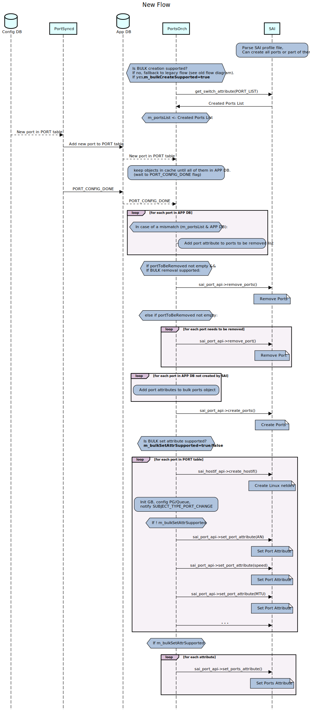

# Port Profile Init HLD #

## Table of Content
 - [Revision](#revision)
 - [Scope](#scope)
 - [Definitions/Abbreviations](#definitions/abbreviations)
 - [Overview](#overview)
 - [Requirements](#requirements)
 - [Architecture Design](#architecture-design)
 - [High-Level Design](#high-level-design)
    - [Initialization Flow](#initialization-flow)
    - [doPortTask Flow](#doPortTask-flow)
    - [Error Flow](#error-flow)
 - [SAI API](#sai-api)
 - [Configuration and Management](#configuration-and-management)
    - [CLI/YANG model Enhancements](#cli/yang-model-enhancements)
    - [Config DB Enhancements](#configdb-enhancements)
 - [Warmboot and Fastboot Design Impact](#warmboot-and-fastboot-design-impact)
 - [Restrictions/Limitations](#restrictions/limitations)
 - [Testing Requirements/Design](#testing-requirements/design)
    - [Unit Test cases](#unit-test-cases)
 - [Open/Action items](#open/action-items)


### Revision

 | Rev |     Date    |       Author       | Change Description                |
 |:---:|:-----------:|:------------------:|-----------------------------------|
 | 0.1 |             |       Noa Or       | Initial version                   |

### Scope

This document is the design document for Port Profile Init feature in SONiC.

### Definitions/Abbreviations

N/A

### Overview

Port configuration is currently done in 2 phases.
* **Static phase:** SAI parses SAI profile file and creates all ports there one by one.
* **Dynamic phase:** SONiC PortsOrch has a comparison process between the pre-created ports from SAI, and ports configurations in CONFIG DB. In case there is a mismatch with one of the ports, PortsOrch will remove the port and recreate it with right lanes and attributes.

The above logic requires multiple calls to SAI APIs and can take significant amount of time, which can challenge fast-boot time restriction.

SAI introduced new capability which allows using bulk operation for creating any type of object. Using these capability will allow us saving API calls and decrease ports creation time.

### Requirements

* SONiC will support both bulk approach and legacy approach.
* Before creating the ports, SONiC will check if bulk creation operation is supported by SAI. If not, it will fallback to legacy approach.
* SONiC will check if SAI created ports in create_switch() phase. If so, it will save them for later comparison logic.
* In case there is a mismatch between pre-created ports by SAI and configured ports from APP DB - a ports removal shall be performed.

    * In case remove_ports() API is supported, the bulk removal will be performed.
    * Otherwise, ports removal will be done one by one as before.


* SONiC will send the bulk request only when all ports are configured in APP DB, PORT table. Meaning, only when "PortConfigDone" flag is raised.


* In case one of the port Bulk APIs is called with an empty list of ports, SONiC expects SAI to return a status different from SAI_STATUS_NOT_IMPLEMENTED or SAI_STATUS_NOT_SUPPORTED. This call will be made in order to check if bulk approach is supported and implemented in vendor's SAI.

* Setting ports attributes will be performed after ports creation:
    * In case set_ports_attribute() is supported, the bulk set will be performed.
    * Otherwise, it will set ports attribute one by one as before.

* After feature is implemented, SAI initialization time should be reduced. Hence, we expect fast-boot up time to meet max 30 seconds restriction.


### Architecture Design

This feature does not change the existing SONiC architecture, while it has to change the configuration flow for ports. This change will be covered in orchagent - PortsOrch.


### High-Level Design

There will be no changes in CLI, DB schema, YANG model or warm-reboot support.

In order to support feature in SONiC side, Port configuration flow will be changed in sonic-swss PortsOrch module.

<p align=left>

</p>


<p align=left>

</p>


The above sequence diagram shows that a lot of calls to SAI and SDK APIs are being saved.
In terms of Fast Reboot, when system is going up, it can save a lot of time and not challenge the 30 seconds restriction.

Notes:

* Multi-Asic is covered for these changes. In Multi-Asic environment, there are multiple instances of swss and Redis DB and each DB has it's own PORT table. Hence, port configuration is per Asic.

* When one of the Bulk APIs is called with an empty list of ports, SONiC expects SAI to return any status except of SAI_STATUS_NOT_IMPLEMENTED or SAI_STATUS_NOT_SUPPORTED. This call will be performed in order to validate the API is supported or not.

#### Initialization Flow

As part of PortsOrch initialization we query for all pre-configured ports in SAI and put that in a list for the later comparison logic.

This logic will remain, and pre-created ports will be saved.

Few checks will be performed in initialization flow.
1. Is bulk creation supported? It will be checked using the following flow:

    * If sai_port_api->create_ports() is NULL --> Not supported.
    * If not NULL, call it (with an empty list of ports).
    * If return status is SAI_STATUS_NOT_IMPLEMENTED or SAI_STATUS_NOT_SUPPORTED --> Not supported.
    * Otherwise, supported.

    If not supported, fallback to legacy flow (old flow diagram).


2. Are ports configured in SAI?

    In order to check this, we will query the ports list created in SAI using sai_switch_api->get_switch_attribute() API, while attr id is SAI_SWITCH_ATTR_PORT_LIST.
    If there are ports in the list taken from SAI, they will be proceessed as before and saved in a list for the later comparison logic.


#### doPortTask Flow

Currently, in case a new port was added to PORT table in APP DB, PortsOrch compares the new port configurations in APP DB, to the pre configured port attributes queried from SAI. In case of a mismatch, it will remove the configured port and recreate port with attributes taken from APP DB.

According to new logic, in case BULK creation option is supported, the function will wait for PortConfigDone flag to be raised. Meaning, all ports from Config DB are now in APP DB.

Then, the comparison logic will be performed. In case there are ports need to be removed: If bulk removal is supported, remove_ports() will be called.
Otherwise, usual removal will be performed.

Then, per each port needs to be created, SONiC will add it's attributes to sai_attribute_t list. After all attributes are added, sai_port_api->create_ports() API will be called.

The same flow will be performed for ports attribute setting.
If bulk set_attribute is supported, set_ports_attribute() API will be called.
Otherwise, setting SAI attributes will be done one by one as before.

\* Creating Host Interfaces will be done one by one as beofre.


An important Note:

In order to use SAI bulk APIs, the global flag in syncd (-l / --enableBulk) should enable the bulk opertaion.
If this flag will not be provided upon syncd startup, bulk operation will be translated to regular operation. Hence, time will not be enhanced.
Each vendor should enable the flag for it's config_syncd_vendor function in syncd_init_common.sh script.
Note that this flag will enable bulk opertaions for all available options (e.g. route, vlan and now ports).


#### Error Flow
In SAI Bulk APIs, one of the parameters is a list of objects typs sai_status_t.

```
sai_status_t create_ports(_In_ sai_object_id_t switch_id, _In_ uint32_t object_count, _In_ const uint32_t *attr_count, _In_ const sai_attribute_t **attr_list, _In_ sai_bulk_op_error_mode_t mode, _Out_ sai_object_id_t *object_id, _Out_ sai_status_t *object_statuses);

sai_status_t remove_ports(_In_ uint32_t object_count, _In_ const sai_object_id_t *object_id, _In_ sai_bulk_op_error_mode_t mode, _Out_ sai_status_t *object_statuses);

sai_status_t set_ports_attribute(_In_ uint32_t object_count, _In_ const sai_object_id_t *object_id, _In_ const sai_attribute_t *attr_list, _In_ sai_bulk_op_error_mode_t mode, _Out_ sai_status_t *object_statuses);

sai_status_t get_ports_attribute(_In_ uint32_t object_count, _In_ const sai_object_id_t *object_id, _In_ const uint32_t *attr_count, _Inout_ sai_attribute_t **attr_list, _In_ sai_bulk_op_error_mode_t mode, _Out_ sai_status_t *object_statuses);
```

After each Bulk API call, SONiC will go over all statuses in the list and make sure all of them are success.
In case Bulk create/remove contains status which is not success, it will throw runtime error as being done today. The exception will be caught by Orch, which will clear the request.

If setting Bulk attribute for all ports returned a non-success status, it will just not add the attribute as being done today.


### SAI API

https://github.com/opencomputeproject/SAI/pull/1460/files SAI PR introduces new SAI APIs to support bulk creation.

sai_port module will now have the following APIs:

```
sai_bulk_object_create_fn              create_ports;
sai_bulk_object_remove_fn              remove_ports;
sai_bulk_object_set_attribute_fn       set_ports_attribute;
sai_bulk_object_get_attribute_fn       get_ports_attribute;
```

### Configuration and management

N/A

#### CLI/YANG model Enhancements

N/A

#### Config DB Enhancements

There is no change in configurations for this feature.

### Warmboot and Fastboot Design Impact

Warm reboot part will not be affected by this HLD code changes.
In warm reboot cases, HW is already configured. Hence, we will not get into this flow.

Fast reboot up time is expected to be enhanced after the feature implementation.
In original flow there were a lot of APIs calls and now most of them are reduced.

### Restrictions/Limitations

N/A

### Testing Requirements/Design

After feature is implemented in both SONiC and SAI side, few tests will need to be performed.
* Execute regression test for fast boot and perform time analyze, in order to make sure fast-boot time decreased as expected. In addition, manual time testing for fast-reboot up time.
* A new sonic-mgmt test will need to be added. the test will check fast-reboot with dynamic port breakout.
* A full regression testing to make sure evertything is working as before.


#### Unit Test cases

A new test will be added to DVS tests.

The test will push ports configuration to Config DB and expect ASIC_STATE:SAI_OBJECT_TYPE_PORT* keys count to be as the number of the ports in Config DB.

In addition, current PortsOrch unitests populates APP DB PORT table with ports information taken from SAI.
As this behavior will change after implementation, the flow in the test will be changed as well and ports will be taken from a static list.

### Open/Action items

N/A
