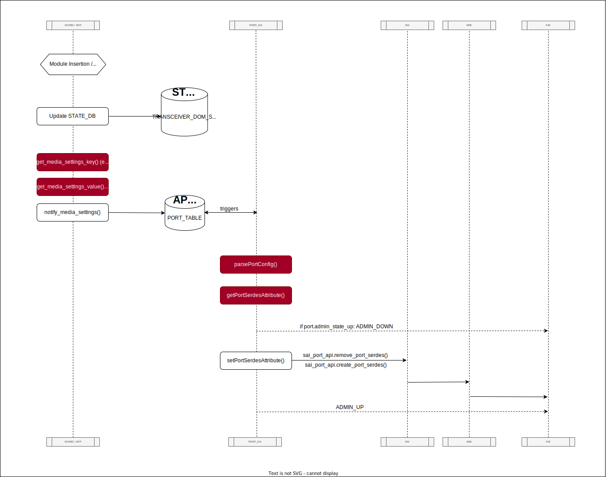
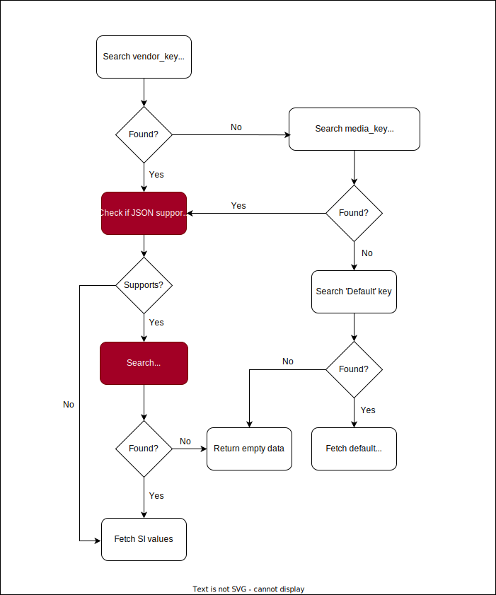

# Feature Name
Port Signal Integrity Per Speed Enhancements </br></br>
# High Level Design Document
#### Rev 0.2

</br>

# Table of Contents
  * [General Information](#general-information)
    * [Revision](#revision)
    * [About This Manual](#about-this-manual)
    * [Definitions/Abbreviations](#definitionsabbreviations)
    * [Reference](#reference)
  * [Feature Motivation](#feature-motivation)
  * [Design](#design)
    * [New SERDES parameters](#new-serdes-parameters)
      * [Application DB Enhancements](#application-db-enhancements)
      * [Json Format For SI Parameters](#json-format-for-si-parameters)
      * [How are we going to use this json?](#how-are-we-going-to-use-this-json)
    * [Port SI configuration (flows)](#port-si-configuration-flows)
  * [Changes to support the enhancements](#changes-to-support-the-enhancements)
  * [Unit Test](#unit-test)

</br></br>

# General Information 

## Revision
| Rev |     Date    |       Author       | Change Description                                       |
|:---:|:-----------:|:------------------:|-----------------------------------                       |
| 0.1 | 08/28/2023  | Tomer Shalvi       | Base version                                             |

## About this Manual
This document is the high level design of the Port SI Per Speed Enhancements feature.

## Definitions/Abbreviations
| Term     |     Description                                   |
|:--------:|:-------------------------------------------------:|
| SAI      |     Switch Abstraction Interface                  |
| SONiC    |     Software for Open Networking in the Cloud     |
| xcvrd    |     Transceiver Daemon     |

## Reference
| Document                                                                                                                                       |     Description                                                  |
|:----------------------------------------------------------------------------------------------------------------------------------------------:|:----------------------------------------------------------------:|
| [cmis-init.md](https://github.com/sonic-net/SONiC/blob/master/doc/sfp-cmis/cmis-init.md)                                                       |     CMIS initialization HLD.                                     |
| [Media based port settings in SONiC](https://github.com/sonic-net/SONiC/blob/master/doc/media-settings/Media-based-Port-settings.md)           |     Media based port settings HLD.                               |
</br></br>

# Feature Motivation
Today SONIC has the capability to apply port SI configuration. To achieve optimal configuration of their SerDes, some vendors wish to have the option to configure SerDes SI based on lane speeds.</br>
This design will focus on enhancing the current ASIC configuration to provide support for configurations that take into account lane speed.
</br></br>


# Design

The functionality of configuring the SerDes with the NOS currently exists; However, the configuration is currently limited to the plugged-in module and lacks the capability to differentiate between various lane speeds of a module. </br>
The suggested enhancements will introduce the following additions:

   1. The ability to support different port SI configurations for different lane speeds.
   2. Expansion of the existing set of supported SI parameters.

Important note: Backward compatibility will be maintained. Vendors who wish to continue configuring port SI irrespective of the lane speed will be able to do so without making any code changes.
 </br></br>
 

# New SERDES parameters

## Application DB Enhancements

6 new fields: **ob_m2lp**, **ob_alev_out**, **obplev**, **obnlev**, **regn_bfm1p**, **regn_bfm1n**, will be added to **PORT_TABLE**:

```
ob_m2lp             = 1*8HEXDIG *( "," 1*8HEXDIG) ; list of hex values, one per lane              ; ratio between the central eye to the upper and lower eyes (for PAM4 only)
ob_alev_out         = 1*8HEXDIG *( "," 1*8HEXDIG) ; list of hex values, one per lane              ; output common mode
obplev              = 1*8HEXDIG *( "," 1*8HEXDIG) ; list of hex values, one per lane              ; output buffers input to Common mode PMOS side
obnlev              = 1*8HEXDIG *( "," 1*8HEXDIG) ; list of hex values, one per lane              ; output buffers input to Common mode NMOS side
regn_bfm1p          = 1*8HEXDIG *( "," 1*8HEXDIG) ; list of hex values, one per lane              ; voltage regulator to pre output buffer PMOS side
regn_bfm1n          = 1*8HEXDIG *( "," 1*8HEXDIG) ; list of hex values, one per lane              ; voltage regulator to pre output buffer NMOS side
```

</br>
Here is the table for mapping the new SI fields and SAI attributes:

| Parameter     |              sai_port_attr_t                      |
|:-------------:|:-------------------------------------------------:|
| ob_m2lp	      |     SAI_PORT_SERDES_ATTR_TX_PAM4_RATIO            |
| ob_alev_out   |     SAI_PORT_SERDES_ATTR_TX_OUT_COMMON_MODE       |
| obplev        |     SAI_PORT_SERDES_ATTR_TX_PMOS_COMMON_MODE      |
| obnlev        |     SAI_PORT_SERDES_ATTR_TX_NMOS_COMMON_MODE      |
| regn_bfm1p    |     SAI_PORT_SERDES_ATTR_TX_PMOS VLTG_REG         |
| regn_bfm1n    |     SAI_PORT_SERDES_ATTR_TX_NMOS VLTG_REG         |


These new SAI attributes were code reviewed by the SAI community and are now merged, available in the latest version of the sai_port.h file: https://github.com/opencomputeproject/SAI/blob/master/inc/saiport.h#L3653C29-L3653C29
</br></br>


## Json format for SI parameters

To ensure that these SI values are transmitted properly to SDK, a JSON file, called _media_settings.json_, is used.</br>
The format of this JSON is going to be modified to support the dependency on lane speed and the new SI parameters added to APP_DB. </br>
The updated format is the following: 


Within the "PORT_MEDIA_SETTINGS" section (or "GLOBAL_MEDIA_SETTINGS" if dealing with port ranges, instead of individual ports), the SI values for each port are organized into four levels of hierarchy:

* The first level relates to the vendor_key/media_key level
* The second hierarchy level is the lane_speed_key level, which specifies the port speed and lane count.
* On the third level, we encounter the names of the SI fields.
* Finally, at the last hierarchy level, the corresponding values for these fields are presented.

The lane_speed_key is the only new hierarchy level in this JSON. All other hierarchy levels already exist in the current format.
The parser for media_settings.json has been updated to be compatible with JSONs of both the updated format and the current format. This ensures that vendors whose JSON does not include lane_speed_key hierarchy level can continue working with their existing JSONs without changing anything.
</br></br>


## How are we going to use this json?

The flow of using this json will be referred to as the **_Notify-Media-setting-Process_**:


</br>_The red blocks in this diagram represent required changes in the code._
</br>


## Port SI configuration (flows)

Currently, the Notify-Media-Settings-Process is carried out only in the initialization phase of xcvrd and whenever a module is plugged in. After applying the port SI per speed enhancements, it will also be carried out upon port speed change events: Whenever a port speed change is detected by listening to STATE_DB, Notify-Media-Settings-Process will be called to send the most applicable SI values in the JSON to SAI.
Port speed changes require invoking the Notify-Media-Settings-Process becuase after such a change, the lane_speed_key used for lookup in the JSON changes accordingly, and the previously configured SI values in the ASIC are no longer relevant.
</br></br>


# Changes to support the enhancements


1. Changes in SfpStateUpdateTask thread:</br></br>
    With the port SI per speed enhancements applied, we rely on the lane speed when we lookup in _media_settings,json_. Hence, this flow has to be triggered not only by insertion/removal of modules, but by speed configuration changes as well.</br>
    In order to establish the dependency of port SI configurations on lane speed, we need to be able to monitor speed configuration changes. Therefore, we will add to the SfpStateUpdateTask a listener to detect such changes: a new member will be added to SfpStateUpdateTask to listen to changes in STATE_DB.PORT_TABLE, and once such change is detected, _notify_media_settings()_ will be trigerred. Additionally, the SfpStateUpdateTask thread will have a new dictionary that will store the speed and number of lanes for each port.
</br></br>


2. The _XCVRD::Notifty_media_settings()_ function should be modified to support the updated format of _media_settings_json_:

   - The method _get_media_settings_key()_ should be extended:

      We need to extend the key used for lookup in the '_media_settings.json_' file to consider lane speed. </br>
      Currently, there are two types of keys: 'vendor_key' (vendor name + vendor part number, for example: 'AMPHENOL-1234') and 'media_key' (media type + media_compliance_code + media length, for example: 'QSFP28-40GBASE-CR4-1M'). </br>
      In the new format of '_media_settings.json_', the '_get_media_settings_key()_' method will return three values instead of the two values described above. The additional value returned from this method will be the 'lane_speed_key', for example: '400GAUI-8' (where '400' refers to the port speed and '8' refers to the lane count). </br></br>

      How will the 'lane_speed_key' be calculated? </br>
      Each module contains a list called Application Advertisements in its EEPROM, which is a list of all speeds the module is compatible with. For example:
      
      ```
      Application Advertisement: 
        400GAUI-8 C2M (Annex 120E) - Host Assign (0x1) - Active Cable assembly with BER < 2.6x10^-4 - Media Assign (0x1)
        IB EDR (Arch.Spec.Vol.2) - Host Assign (0x11) - Active Cable assembly with BER < 10^-12 - Media Assign (0x11)
        200GAUI-4 C2M (Annex 120E) - Host Assign (0x11) - Active Cable assembly with BER < 2.6x10^-4 - Media Assign (0x11)
        CAUI-4 C2M (Annex 83E) without FEC - Host Assign (0x11) - Active Cable assembly with BER < 10^-12 - Media Assign (0x11)
      ```

      We will use this list to derive the lane_speed_key. We will iterate over this list and return the item whose port speed and lane count match the port speed and lane count for the corresponding port that were extracted from STATE_DB into the newly added dictionary (The mapping between ports and their speeds and lane counts as described earlier).
      The existing method '_get_cmis_application_desired()_' performs exactly this task, so we will use it to calculate the new key.

    </br>


   - The method _get_media_settings_value()_ needs to be modified to enable lookup in both the extended format JSON and the current one:

      The following diagram describes the updated parser flow for _media_settings.json_:</br>
     
     </br>_The red blocks represent additions to the existing flow._

      Determining whether the JSON file supports per-speed SI parameters or not will be done by searching for the presence of the string "speed:" in the relevant hierarchy level, which is the prefix of each lane_speed_key. This determination is essential to ensure the compatibility of the code with vendors whose '_media_settings.json_' does not include per-speed SI parameters.

      Its important to notice that this lookup mechanism maintains backward compatibility - the parser is capable of handling JSONs that contain the lane speed key as well as JSONs without it.

      Here is the full code: 

      ```python #10-16
      def get_media_settings_value(physical_port, key):

        if PORT_MEDIA_SETTINGS_KEY in g_dict:
          for keys in g_dict[PORT_MEDIA_SETTINGS_KEY]:
              if int(keys) == physical_port:
                  media_dict = g_dict[PORT_MEDIA_SETTINGS_KEY][keys]
                  break

          if vendor_key in media_dict:
            if is_si_per_speed_supported(media_dict[vendor_key]):     # new code
                if lane_speed_key in media_dict[vendor_key]:          # new code
                    return media_dict[vendor_key][lane_speed_key]     # new code
                else:                                                 # new code
                    return {}                                         # new code
            else:
                return media_dict[vendor_key]
          elif media_key in media_dict:
            if is_si_per_speed_supported(media_dict[media_key]):      # new code
                if lane_speed_key in media_dict[media_key]:           # new code
                    return media_dict[media_key][lane_speed_key]      # new code
                else:                                                 # new code
                    return {}                                         # new code
            else:
                return media_dict[media_key]
          elif DEFAULT_KEY in media_dict:
              return media_dict[DEFAULT_KEY]
          elif len(default_dict) != 0:
              return default_dict

        return {}
      ```

</br>

3. Ports Orchagent Additions: Introducing the new SI parameters into the current data flow between APP_DB and SAI.
</br></br>

# Unit Test
- Generation of keys in the new format: Expand the _test_get_media_settings_key()_ method to create a dictionary that contains a mapping between a port and its port speed and lane count. Then call _get_media_settings_key()_ with that dictionary and assert that a valid lane_speed_key was composed.

- The lookup functionality works seamlessly with both the new and legacy JSON formats: Create a new test, _test_get_media_settings_value()_, that gets the (vendor_key, media_key, lane_speed_key) tuple. This test will perform the lookup using this tuple in two instances of the media_settings.json file: one from the updated format and one from the current format. The only difference between these two JSONs is that the first contains the hierarchy level that corresponds to the lane_speed_key received, while the latter doesn't. Everyhing else is similar for the two JSONs. Both lookup should end up with a match, extracting the same values from the JSONs.
This test verifies backward compatibility and ensures that the updated JSON format does not cause any issues for other vendors.

- PortsOrchagent tests:
Verify the SAI object is created properly with the new SI parameters: Create an instance of _media_settings.json_ that contains all 6 new SI parameters for a certain module, call to _notify_media_setting()_ and ensure PortOrchagent creates SAI object that contains all new parameters