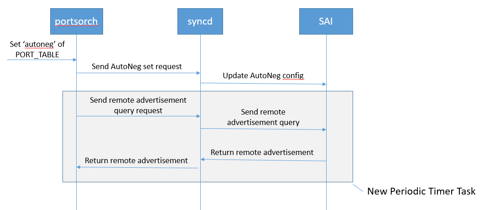

# SONiC Port Auto Negotiation Design #

## Table of Content

- [Revision](#revision)
- [Scope](#scope)
- [Definitions/Abbreviations](#definitions/abbreviations)
- [Overview](#overview)
- [Requirements](#requirements)
- [Architecture Design](#architecture-design)
- [High-Level Design](#high-level-design)
- [SAI API Requirement](#sai-api-requirement)
- [Configuration and management ](#configuration-and-management)
  - [CLI Enhancements](#cli-enhancements)
    - [Config auto negotiation mode](#config-auto-negotiation-mode)
    - [Config advertised speeds](#config-advertised-speeds)
    - [Config interface type](#config-interface-type)
    - [Config advertised interface types](#config-advertised-interface-types)
    - [Show interfaces auto negotiation status](#show-interfaces-auto-negotiation-status)
    - [CLI validation](#cli-validation)
  - [Config DB Enhancements](#config-db-enhancements)
  - [Application DB Enhancements](#application-db-enhancements)
  - [State DB Enhancements](#state-db-enhancements)
  - [YANG Model Enhancements](#yang-model-enhancements)
  - [DB Migrator Enhancements](#db-migrator-enhancements)
  - [SWSS Enhancements](#swss-enhancements)
  - [portsyncd and portmgrd Consideration](#portsyncd-and-portmgrd-consideration)
  - [Port Breakout Consideration](#port-breakout-consideration)
  - [PMON xcvrd Consideration](#pmon-xcvrd-consideration)
- [Warmboot and Fastboot Design Impact](#warmboot-and-fastboot-design-impact)
- [Restrictions/Limitations](#restrictions/limitations)
- [Testing Requirements/Design](#testing-requirements/design)
  - [Unit Test cases](#unit-test-cases)
  - [System Test cases](#system-test-cases)
- [Open/Action items - if any](#open/action-items---if-any)

### Revision

 | Rev |     Date    |       Author        | Change Description                         |
 |:---:|:-----------:|:-------------------:|--------------------------------------------|
 | 0.1 |             |      Junchao Chen   | Initial version                            |
 | 0.2 |             |      Junchao Chen   | Fix review comment                         |
 | 0.3 |             | Dante (Kuo-Jung) Su | Add support for SFPs and operational states|
 | 0.4 |             |      Junchao Chen   | Port incremental configuration             |

### Scope
This document is the design document for port auto negotiation feature on SONiC. This includes the requirements, CLI change, DB schema change, DB migrator change, yang model change and swss change.

### Definitions/Abbreviations
N/A

### Overview

The IEEE 802.3 standard defines a set of Ethernet protocols that are comprised of speed rate and interface type. It allows for configuring multiple values at the same time for port provisioning and advertising to the remote side. However, on SONiC, user can configure the speed of port, and user can configure auto negotiation mode via config DB. Port attributes such as interface type, advertised speeds, advertised interface types are not supported.

The feature in this document is to address the above issues, and support the following medium typs

- Twisted-pair cables (Non-Gearbox design)
- SFP/QSFP/QSFPDD CR/KR transceivers (Non-Gearbox design)

The complexities behind vendor-specific SAI implementation is outside the scope of this document.

### Requirements

The main goal of this document is to discuss the design of following requirement:

- Allow user to configure auto negotiation via CLI
- Allow user to configure advertised speeds
- Allow user to configure interface type
- Allow user to configure advertised interface types

### Architecture Design

This feature does not change the existing SONiC architecture.

This feature introduces a few new CLI commands which will fit in sonic-utilities. And this feature also requires to change the configuration flow for port auto negotiation attributes which will be covered in orchagent.

### High-Level Design

- SAI API requirements is covered in section [SAI API Requirement](#sai-api-requirement).
- 5 new CLI commands will be added to sonic-utilities sub module. These CLI commands support user to configure auto negotiation mode, advertised speeds, interface type， advertised interface types for a given interface as well as show port auto negotiation status. See detail description in section [CLI Enhancements](#cli-enhancements).
- A few new fields will be added to existing table in APP_DB and CONFIG_DB to support auto negotiation attributes. See detail description in section [Config DB Enhancements](#config-db-enhancements) and [Application DB Enhancements](#application-db-enhancements).
- YANG Model needs update according to the DB schema change. See detail description in section [YANG Model Enhancements](#yang-model-enhancements)
- DB migrator need handle the existing autoneg configuration and migrate to the new configuration. See detail description in section [DB Migrator Enhancements](#db-migrator-enhancements)
- Port speed setting flow will be changed in orchagent of sonic-swss. See detail description in section [SWSS Enhancements](#swss-enhancements).

### SAI API Requirement

Currently, SAI already defines a few port attributes to support port auto negotiation. Vendor specified SAI implementation is not in the scope of this document, but there are some common requirements for SAI:

1. SAI implementation must return error code if any of the auto negotiation related attribute is not supported, swss and syncd must not crash.
2. SAI implementation must keep backward compatible. As long as swss and SAI keep backward compatible, user need not change anything after this feature is enabled in SONiC.
3. If autoneg is enabled and adv_speeds is not configured or empty, SAI must advertise it with all supported speeds.
4. If autoneg is enabled and adv_interface_types is not configured or empty, SAI must advertise it with all supported interface types.
5. If autoneg is disabled and interface_type is not configured, SAI must use SAI_PORT_INTERFACE_TYPE_NONE.
6. If autoneg is enabled, the administrative port speed updates should not disable the autoneg. The configured speed should be cached in swss#orchagent and gets replayed when autoneg is transitioned from enabled to disabled.
7. If autoneg is enabled, while the administrative interface type updates via CONFIG_DB should be blocked, the dynamic interface type updates from pmon#xcvrd via APPL_DB should be delivered to the SAI to update the autoneg advertisement. Please refer to [PMON xcvrd Consideration](#pmon-xcvrd-consideration) for details.
8. If autoneg is enabled on a SFP/QSFP/QSFPDD port, SAI should also activate the link-training to dynamically tune the TX FIR.
9. If autoneg is enabled on a SFP/QSFP/QSFPDD port, when it's transitioned to disabled, the port speed, FEC, interface type and TX FIR should be restored with the corresponding values in the APPL_DB. If the individual configuration is not present in the APPL_DB, the SAI driver defaults should be restored. Precisely speaking, default interface type is SAI_PORT_INTERFACE_TYPE_NONE, default fec mode is SAI_PORT_FEC_MODE_NONE and TX FIR is vendor-specific, as it's NOT a set of constants applicable to all switch ASIC.
10. If autoneg is enabled on a SFP/QSFP/QSFPDD port, the "fec" field of APPL_DB should override the result of autoneg.

The related port attributes are listed below:
```cpp
    /**
     * @brief Auto Negotiation configuration
     *
     * @type bool
     * @flags CREATE_AND_SET
     * @default false
     */
    SAI_PORT_ATTR_AUTO_NEG_MODE,
    /**
     * @brief Speed in Mbps
     *
     * On get, returns the configured port speed.
     *
     * @type sai_uint32_t
     * @flags MANDATORY_ON_CREATE | CREATE_AND_SET
     */
    SAI_PORT_ATTR_SPEED,
    /**
     * @brief Query/Configure list of Advertised port speed (Full-Duplex) in Mbps
     *
     * Used when auto negotiation is on. Empty list means all supported values are enabled.
     *
     * @type sai_u32_list_t
     * @flags CREATE_AND_SET
     * @default empty
     */
    SAI_PORT_ATTR_ADVERTISED_SPEED,
    /**
     * @brief Configure Interface type
     *
     * @type sai_port_interface_type_t
     * @flags CREATE_AND_SET
     * @default SAI_PORT_INTERFACE_TYPE_NONE
     */
    SAI_PORT_ATTR_INTERFACE_TYPE,

    /**
     * @brief Configure advertised interface type list
     *
     * Used when auto negotiation is on. Empty list means all supported values are enabled.
     *
     * @type sai_s32_list_t sai_port_interface_type_t
     * @flags CREATE_AND_SET
     * @default empty
     */
    SAI_PORT_ATTR_ADVERTISED_INTERFACE_TYPE,
```

Please note that `SAI_PORT_ATTR_ADVERTISED_INTERFACE_TYPE` is a new attribute introduced in SAI 1.7.1. Vendors need to implement this attribute in their SAI implementation.

### Configuration and management

#### CLI Enhancements

A few new CLI commands are designed to support port auto negotiation.

##### Config auto negotiation mode

```
Format:
  config interface autoneg <interface_name> <mode>

Arguments:
  interface_name: name of the interface to be configured. e.g: Ethernet0
  mode: auto negotiation mode, can be either "enabled" or "disabled"

Example:
  config interface autoneg Ethernet0 enabled
  config interface autoneg Ethernet0 disabled

Return:
  error message if interface_name or mode is invalid otherwise empty
```

##### Config advertised speeds

Configuring advertised speeds takes effect only if auto negotiation is enabled. If auto negotiation is disabled, this command still saves advertised speeds value to CONFIG_DB.

```
Format:
  config interface advertised-speeds <interface_name> <speed_list>

Arguments:
  interface_name: name of the interface to be configured. e.g: Ethernet0
  speed_list: a list of speeds to be advertised or "all". e.g: 40000,100000.

Example:
  config interface advertised-speeds Ethernet0 40000,100000
  config interface advertised-speeds Ethernet0 all

Return:
  error message if interface_name or speed_list is invalid otherwise empty

Note:
  speed_list value "all" means all supported speeds
```

This command always replace the advertised speeds instead of append. For example, say the current advertised speeds value are "10000,25000", if user configure it with `config interface advertised-speeds Ethernet0 40000,100000`, the advertised speeds value will be changed to "40000,100000".

##### Config interface type

Configuring interface type takes effect only if auto negotiation is disabled. If auto negotiation is enabled, this command still saves interface type value to CONFIG_DB.

```
Format:
  config interface type <interface_name> <interface_type>

Arguments:
  interface_name: name of the interface to be configured. e.g: Ethernet0
  interface_type: interface type, valid value include: KR4, SR4 and so on. A list of valid interface type could be found at saiport.h.

Example:
  config interface type Ethernet0 KR4

Return:
  error message if interface_name or interface_type is invalid otherwise empty
```

##### Config advertised interface types

Configuring advertised interface types takes effect only if auto negotiation is enabled. If auto negotiation is disabled, this command still saves advertised interface types value to CONFIG_DB.

```
Format:
  config interface advertised-types <interface_name> <interface_type_list>

Arguments:
  interface_name: name of the interface to be configured. e.g: Ethernet0
  interface_type_list: a list of interface types to be advertised or "all". e.g: KR4,SR4.

Example:
  config interface advertised-types Ethernet0 KR4,SR4
  config interface advertised-types Ethernet0 all

Return:
  error message if interface_name or interface_type_list is invalid otherwise empty

Note:
  interface_type_list value "all" means all supported interface type
```

This command always replace the advertised interface types instead of append. For example, say the current advertised interface types value are "KR4,SR4", if user configure it with `config interface advertised-types Ethernet0 CR4`, the advertised interface types value will be changed to "CR4".

##### Show interfaces auto negotiation status

As command `show interfaces status` already has 11 columns, a new CLI command will be added to display the port auto negotiation status. All data of this command are fetched from **APPL_DB** and **STATE_DB**.

```
Format:
  show interfaces autoneg status <interface_name>

Arguments:
  interface_name: optional. Name of the interface to be shown. e.g: Ethernet0. If interface_name is not given, this command shows auto negotiation status for all interfaces.

Example:
  show interfaces autoneg status
  show interfaces autoneg status Ethernet0

Return:
  error message if interface_name is invalid otherwise:

  Interface    Auto-Neg Mode    Speed    Adv Speeds    Rmt Adv Speeds    Type    Adv Types    Oper    Admin
-----------  ---------------  -------  ------------  ----------------  ------  -----------  ------  -------
  Ethernet0          enabled     400G           N/A              400G     CR4          CR4      up       up
  Ethernet8          enabled     400G           N/A               N/A     KR4          KR4    down       up
 Ethernet16          enabled     400G           N/A              400G     CR4          CR4      up       up
 Ethernet24              N/A     400G           N/A               N/A     N/A          N/A    down       up
 Ethernet32         disabled     400G           N/A               N/A     N/A          N/A    down       up
```

##### CLI validation

Currently, there are some commands to configure interface attribute, e.g: `configure interface speed <interface_name> <speed>`. The config speed command does not validate the input speed value at all. If user gives a invalid speed value, CLI will save it to CONFIG_DB and finally orchagent will validate it. User only gets an error message from syslog which is not so convenient. In order to help user better understand the configuration result, commands for configuring autoneg, adv_speeds, interface_type and adv_interface_types will do validation at CLI side.

For autoneg, the valid value are "enabled" or "disabled", other values are treated as error and will not be passed to CONFIG_DB.

For interface_type and adv_interface_types, there is no SAI API to get supported interface type list. There is only a enum defined in saiport.h to specify all the supported interface type in SAI API:

```cpp
typedef enum _sai_port_interface_type_t
{
    /** Interface type none */
    SAI_PORT_INTERFACE_TYPE_NONE,

    /** Interface type CR */
    SAI_PORT_INTERFACE_TYPE_CR,

    /** Interface type CR2 */
    SAI_PORT_INTERFACE_TYPE_CR2,

    /** Interface type CR4 */
    SAI_PORT_INTERFACE_TYPE_CR4,

    /** Interface type SR */
    SAI_PORT_INTERFACE_TYPE_SR,

    /** Interface type SR2 */
    SAI_PORT_INTERFACE_TYPE_SR2,

    /** Interface type SR4 */
    SAI_PORT_INTERFACE_TYPE_SR4,

    /** Interface type LR */
    SAI_PORT_INTERFACE_TYPE_LR,

    /** Interface type LR4 */
    SAI_PORT_INTERFACE_TYPE_LR4,

    /** Interface type KR */
    SAI_PORT_INTERFACE_TYPE_KR,

    /** Interface type KR4 */
    SAI_PORT_INTERFACE_TYPE_KR4,

    /** Interface type CAUI */
    SAI_PORT_INTERFACE_TYPE_CAUI,

    /** Interface type GMII */
    SAI_PORT_INTERFACE_TYPE_GMII,

    /** Interface type SFI */
    SAI_PORT_INTERFACE_TYPE_SFI,

    /** Interface type XLAUI */
    SAI_PORT_INTERFACE_TYPE_XLAUI,

    /** Interface type KR2 */
    SAI_PORT_INTERFACE_TYPE_KR2,

    /** Interface type CAUI */
    SAI_PORT_INTERFACE_TYPE_CAUI4,

    /** Interface type XAUI */
    SAI_PORT_INTERFACE_TYPE_XAUI,

    /** Interface type XFI */
    SAI_PORT_INTERFACE_TYPE_XFI,

    /** Interface type XGMII */
    SAI_PORT_INTERFACE_TYPE_XGMII,

    /** Interface type MAX */
    SAI_PORT_INTERFACE_TYPE_MAX,

} sai_port_interface_type_t;
```

To validate interface type and advertised interface type, this enum will be transferred to a set on CLI side for validation:

```python
valid_interface_type_set = set(['CR', 'CR2', 'CR4', ...])
```

The advantage here is that user can get a list of valid interface type from CLI. The disadvantage here is that:

1. Once SAI add new interface type, the CLI part also needs to be updated.
2. Even if CLI validation pass, the given interface type might still be rejected by SAI.

For speed and adv_speeds, there is a SAI API to get the supported speed list for a given port. The idea here is to query supported speed after orchagent creating port object, and the supported speed list will be save to STATE_DB for CLI to validate. A new field **supported_speeds** will be added to **PORT_TABLE**. If this field is present, CLI will use this field to validate the input speed and adv_speeds argument, otherwise, no validation will be performed on CLI side. The STATE_DB change will be described in [State DB Enhancements](#state-db-enhancements).

#### Config DB Enhancements

SONiC already defined two fields related to port speed setting: **speed**, **autoneg**. 3 new fields **adv_speeds**, **interface_type**, **adv_interface_types** will be added to **PORT** table:

	; Defines information for port configuration
	key                     = PORT|port_name                 ; configuration of the port
	; field                 = value
    ...
	adv_speeds              = STRING                         ; advertised speed list
	interface_type          = STRING                         ; interface type
	adv_interface_types     = STRING                         ; advertised interface types

Valid value of the new fields are described below:

- adv_speeds: string value "all" or a list of speed value separated by commas. For example: "50000,100000", "all".
- interface_type: valid interface type value defined in IEEE 802.3. For example: "CR4", "SR4" and so on.
- adv_interface_types: string value "all" or a list of interface type values defined in IEEE 802.3. For example: "CR4,KR4,SR4", "all".

#### Application DB Enhancements

The change in APP_DB is similar to CONFIG_DB. 3 new fields **adv_speeds**, **interface_type**, **adv_interface_types** will be added to **PORT_TABLE** table:

	; Defines information for port configuration
	key                     = PORT_TABLE:port_name           ; configuration of the port
	; field                 = value
    ...
	adv_speeds              = STRING                         ; advertised speed list
	interface_type          = STRING                         ; interface type
	adv_interface_types     = STRING                         ; advertised interface types

Valid value of the new fields are the same as **PORT** table in CONFIG_DB.

Here is the table to map the fields and SAI attributes:
| **Parameter**       | **sai_port_attr_t**                            |
|---------------------|------------------------------------------------|
| adv_interface_types | SAI_PORT_ATTR_ADVERTISED_INTERFACE_TYPE        |
| adv_speeds          | SAI_PORT_ATTR_ADVERTISED_SPEED                 |
| autoneg             | SAI_PORT_ATTR_AUTO_NEG_MODE                    |
| interface_type      | SAI_PORT_ATTR_INTERFACE_TYPE                   |
| speed               | SAI_PORT_ATTR_SPEED                            |

#### State DB Enhancements

To support validate interface speed on CLI side, a new field **supported_speeds** will be added to **PORT_TABLE**.
To support checking remote advertised speeds, a new field **rmt_adv_speeds** will be added to **PORT_TABLE**.

	; Defines information for port state
	key                     = PORT_TABLE:port_name           ; state of the port
	; field                 = value
    ...
	supported_speeds        = STRING                         ; supported speed list
	speed                   = STRING                         ; operational speed
	rmt_adv_speeds          = STRING                         ; advertised speed list of the remote

- supported_speeds: A list of supported speeds separated by commas, for example, "10000,25000,40000,100000".
- speed: Operational speed, for example, "100000".
- rmt_adv_speeds: A list of supported speeds advertised by the connected remote, for example, "10000,25000,40000,100000".

Before this feature, port speed in APP DB indicates both the configured speed and the operational speed. It is OK without this feature because port operational speed must be configured speed or port operational status is down. However, this is not true with this feature. Consider following flow:

1. Configure port speed to 100G
2. Configure advertised speed to 50G and enable auto negotiation
3. Port operational speed turns to 50G
4. Configure any port attribute, e.g mtu, portsyncd would put all port attributes to APP DB
5. `show interface status` displays port speed as 100G which is incorrect

To overcome this issue, following changes are required:

1. Put port operational speed to STATE DB PORT_TABLE
2. intfutil, portstat, voqutil shall be change to get port operational speed from STATE DB first. For backward compatible, intfutil, portstat, voqutil shall still get port operational speed from APP DB if port speed is not available in STATE DB or port operational state is down.

Here is the table to map the fields and SAI attributes:
| **Parameter**       | **sai_port_attr_t**                            |
|---------------------|------------------------------------------------|
| rmt_adv_speeds      | SAI_PORT_ATTR_REMOTE_ADVERTISED_SPEED          |
| speed               | SAI_PORT_ATTR_SPEED                            |
| supported_speeds    | SAI_PORT_ATTR_SUPPORTED_SPEED                  |

#### YANG Model Enhancements

The port yang model needs to update according to DB schema change. The yang model changes of new fields are described below:

```
leaf autoneg {
  type string {
    pattern "off"|"on";
  }
}

leaf adv_speeds {
  type string {
    length 1..128;
  }
}

leaf interface_type {
  type string {
    length 1..128;
  }
}

leaf adv_interface_types {
  type string {
    length 1..128;
  }
}
```

These new yang leaf will be added to sonic-port.yang.

#### DB Migrator Enhancements

In current SONiC implementation, if auto negotiation is enabled, it uses the `speed` field as the advertised speeds. Since this feature introduced a new field `adv_speeds`, we need do DB migration to keep backward compatible. For example, the configuration:

```json
"Ethernet0": {
    ...
    "autoneg": "1",
    "speed": "100000"
}
```

Will be migrated to:

```json
"Ethernet0": {

    "autoneg": "1",
    "speed": "100000",
    "adv_speeds": "100000"
}
```

#### SWSS Enhancements

##### Setting Auto Negotiation

The current SONiC speed setting flow in PortsOrch can be described in following pseudo code:

```
port = getPort(alias)
if autoneg changed:
    setPortAutoNeg(port, autoneg)

if autoneg == true and speed is set:
    setPortAdvSpeed(port, speed)
else if autoneg == false and speed is set:
    setPortSpeed(port, speed)
```

The new SONiC speed setting flow can be described in following pseudo code:

```
port = getPort(alias)
if autoneg changed:
    setPortAutoNeg(port, autoneg)
    if autoneg == on:
        // Due to incremental port configuration support, we might only get an "autoneg" field change from APP_DB.
        // In this case, we will need to apply previous saved adv_speeds and adv_interface_types to SAI. If there
        // is no previous configuration, will use default empty adv_speeds and adv_interface_types which indicates
        // all supported speeds and all supported interface types.
        setPortAdvSpeed(port, port.adv_speeds)
        setPortAdvInterfaceType(port, port.adv_interface_types)
    elif autoneg == off:
        // Due to incremental port configuration support, we might only get an "autoneg" field change from APP_DB.
        // In this case, we will need to apply previous saved speed and interface_type to SAI. Speed is a mandatory configuration.
        // If there is no previous configuration for interface_type, it shall use SAI_PORT_INTERFACE_TYPE_NONE by default.
        setPortSpeed(port, port.speed)
        setInterfaceType(port, port.interface_type)

if adv_speeds changed:
    if autoneg == on:
        setPortAdvSpeed(port, adv_speeds) // empty adv_speeds means all supported speeds
    port.adv_speeds = adv_speeds

if adv_interface_types changed:
    if autoneg == on:
        setPortAdvInterfaceType(port, adv_interface_types)
    port.adv_interface_types = adv_interface_types

if speed changed:
    if autoneg != on:
        setPortSpeed(port, speed) // for autoneg is off/not_set, apply the speed to SAI, this is for backward compatible
    port.speed = speed

if interface_type changed:
    if autoneg == off:
        setInterfaceType(port, interface_type)
    port.interface_type = interface_type
```

##### Getting Remote Advertisement

A new periodic timer task will be introduced into PortsOrch, it periodically loops through physical ports and update the per-port remote advertisement if autoneg is enabled and the link is down.



##### Backward Compatibility Considerations

SONiC usually does not call SAI interface when there is no related configuration in APPL_DB. In order to keep backward compatible, this feature also apply this rule.

swss will do validation for auto negotiation related fields, although it still CANNOT guarantee that all parameters passed to SAI will be accepted by SAI. swss validation for these field are described below:

1. autoneg value from APPL_DB must be able to cast to 0 or 1. For invalid value, swss must catch the exception, log the error value and skip the rest configuration of this port.
2. adv_speeds value from APPL_DB must be able to transfer to a list of valid speed values. For invalid value, swss must catch the exception, log the error value and skip the rest configuration of this port.
3. interface_type value from APPL_DB must be able to transfer to a valid interface type value. For invalid value, swss must catch the exception, log the error value and skip the rest configuration of this port.
4. adv_interface_types value from APPL_DB must be able to transfer to a list of valid interface type values. For invalid value, swss must catch the exception, log the error value and skip the rest configuration of this port.


#### portsyncd and portmgrd Consideration

Due to historical reason, portsyncd and portmgrd both handle **PORT** table changes in **CONFIG_DB** and write **APPL_DB** according to configuration change. portmgrd handles fields including "mtu", "admin_status" and "learn_mode"; portsyncd handles all fields. There are a few issues here:

1. portsyncd is designed to listen to kernel port status change and fire the change event to high level, it should not handle **CONFIG_DB** change. portmgrd is the right place to handle port configuration change according to SONiC architecture.
2. Configuration change for "mtu", "admin_status" and "learn_mode" will be handled twice which is not necessary
3. portsyncd put all configuration to **APPL_DB** even if user only changes part of them. E.g. user changes "speed" of the port, portsyncd will put configuration like "mtu", "admin_status", "autoneg" to **APPL_DB**. This is not necessary too.

To address these issues, a few changes shall be made:

1. portsyncd no longer listen to **CONFIG_DB** changes
2. portmgrd shall be extended to handle all port configuration changes
3. portmgrd shall implement incremental configuration update. It means that portmgrd shall not put configuration to **APPL_DB** if the field is not changed compare to previous value.
4. portsorch shall be changed to handle incremental port configuration changes

#### Port Breakout Consideration

No changes for port breakout.

Currently, when user change port breakout mode, SONiC removes the old ports and create new ports in CONFIG_DB according to platform.json. For example, say Ethernet0 supports breakout mode 1x100G and 2x50G. The platform.json looks like:

```json
"interfaces": {
	"Ethernet0": {
	    "index": "1,1,1,1",
	    "lanes": "0,1,2,3",
	    "alias_at_lanes": "Eth1/1, Eth1/2, Eth1/3, Eth1/4",
	    "breakout_modes": "1x100G,2x50G"
	 },
 	 ...
 }
```

**Without port auto negotiation feature**,  the current configuration of Ethernet0 is:

```json
"Ethernet0": {
    "alias": "Eth1/1",
    "lanes": "0,1,2,3",
    "speed": "100000",
    "index": "1"
}
```

User change the port breakout mode via command `config interface breakout Ethernet0 2x50G`. According to platform.json, the configuration of Ethernet0 will change to:

```json
"Ethernet0": {
    "alias": "Eth1/1",
    "lanes": "0,1",
    "speed": "50000",
    "index": "1"
},
"Ethernet2": {
    "alias": "Eth1/3",
    "lanes": "2,3",
    "speed": "50000",
    "index": "1"
}
```

However, **with port auto negotiation feature**, the original configuration of Ethernet0 could be:

```json
"Ethernet0": {
    "alias": "Eth1/1",
    "lanes": "0,1,2,3",
    "speed": "100000",
    "index": "1",
    "autoneg": "true",
    "adv_speeds": "10000,25000,40000,50000,100000",
    "adv_interface_types": "CR4,KR4,SR4"
}
```

So if user breakout the port to 2x50G mode and we simply copy the old configuration to new ports, there are a few issues:

1. For field adv_speeds, value "10000,25000,40000,100000" are not suitable for 2x50G mode. The same issue also may apply to field adv_interface_types.
2. Since autoneg is true and port speed could be auto negotiated to value which is not 50G, it would confuse user: we breakout to 2x50G mode but the actual port speed is not 50G.

So I would suggest to not set the value of autoneg, adv_speeds and adv_interface_types in such situation. Then the configuration after port breakout is still:

```json
"Ethernet0": {
    "alias": "Eth1/1",
    "lanes": "0,1",
    "speed": "50000",
    "index": "1"
},
"Ethernet2": {
    "alias": "Eth1/3",
    "lanes": "2,3",
    "speed": "50000",
    "index": "1"
}
```

I choose this solution because:

1. It's simple. No code changes are required to existing port breakout implementation.
2. It's clear. User gets two new ports with expected speed.
3. It's backward compatible.
4. User can still set auto negotiation parameter after port breakout.

Dynamic port breakout feature also introduces a hwsku.json file to describe the port capability. It defines the default dynamic breakout mode for now. As we won't automatically set auto negotiation attributes for a port after port breakout, it is not necessary to change the hwsku.json in this feature.

#### PMON xcvrd Consideration

While it is possible to use CLI/CONFIG_DB for setting the port auto negotiation attributes, this feature is also available via [media_settings.json](https://github.com/sonic-net/SONiC/blob/master/doc/media-settings/Media-based-Port-settings.md)

- **Interface Type**  
  Unfortunately, it's not straightforward for users to identify which interface type is most appropriate to the attached transceivers, and the link will not get up unless the connected devices are both advertising the same interface type. This requires domain knowledge, correct EERPOM information and the individual hardware datasheet review process. Hence it's recommended to use [media_settings.json](https://github.com/sonic-net/SONiC/blob/master/doc/media-settings/Media-based-Port-settings.md) to automate the while process. A interface type update request from [media_settings.json](https://github.com/sonic-net/SONiC/blob/master/doc/media-settings/Media-based-Port-settings.md) is triggered by the transceiver detection of pmon#xcvrd, which leverages **APPL_DB** instead of **CONFIG_DB**, hence the requests will not be blocked by **portsyncd**. If the interface type update request arrives when autoneg is enabled, it should alter the advertisement and restart the autoneg. That said, if the user has interface type configured in both CONFIG_DB and media_settings.json, it wouldn't be possible to predict which would take precedence as there is no logic giving one priority over other. Hence please be sure to use either CLI/CONFIG_DB or media_settings.json at a time, never have both of them activated.

- **Pre-Emphasis**  
  Typically, prior to some process, such as transmission over cable, or recording to phonograph record or tape, the input frequency range most susceptible to noise is boosted. This is referred to as "pre-emphasis" - before the process the signal will undergo. While this is rarely necessay to the native RJ45 ports, it's important to SFP/QSFP/QSFPDD ports. For optical arrangements (e.g. SR/LR/DR transceivers), the loss is miniscule. The loss budget allocated for the host PCB board is small, which implies the pre-emphasis calibrated is supposed to work regardless of the fiber cable attached. On the other hand, on passive media, there is a significant amount of frequency dependent loss and the channel loss can range up to the CR/KR loss spec. It is therefore important and useful to activate Link-Training to "train" the TX FIR in both directions to help equalize that loss. IEEE 802.3 Clause 72, Clause 73 and Clause 93 define the auto-negotiation and link-training support for CR/KR transceivers, while the support of opticals (e.g. SR/LR/DR) are never in the scope. On the other hand, when autoneg is enabled, the link-training will also be activated, and the link-training handshake will only get started after negotiation if autoneg is enabled. Furtherly, link-training is to dynamically tune hardware signals at runtime, as a result, the static pre-emphasis parameters in media_setting.json is not necessary and will not be taken into autoneg process.

### Warmboot and Fastboot Design Impact

SAI and lower layer must not flap port during warmboot/fastboot no matter what auto negotiation parameter is given.

### Restrictions/Limitations

N/A

### Testing Requirements/Design

#### Unit Test cases

For sonic-utilities, we will leverage the existing unit test framework to test. A few new test cases will be added:

1. Test command `config interface autoneg <interface_name> <mode>`. Verify the command return error if given invalid interface_name or mode.
2. Test command `config interface advertised-speeds <interface_name> <speed_list>`. Verify the command return error if given invalid interface name or speed list.
3. Test command `config interface type <interface_name> <interface_type>`. Verify the command return error if given invalid interface name or interface type.
4. Test command `config interface advertised-types <interface_name> <interface_type_list>`. Verify the command return error if given invalid interface name or interface type list.

For sonic-swss, there is an existing test case [test_port_an](https://github.com/sonic-net/sonic-swss/blob/master/tests/test_port_an.py). The existing test case covers autoneg and speed attributes on both direct and warm-reboot scenario. So new unit test cases need cover the newly supported attributes:

1. Test attribute adv_speeds on both direct and warm-reboot scenario. Verify SAI_PORT_ATTR_ADVERTISED_SPEED is in ASIC_DB and has correct value.
2. Test attribute interface_type on both direct and warm-reboot scenario. Verify SAI_PORT_ATTR_INTERFACE_TYPE is in ASIC_DB and has correct value.
3. Test attribute adv_interface_types on both direct and warm-reboot scenario. Verify SAI_PORT_ATTR_ADVERTISED_INTERFACE_TYPE is in ASIC_DB and has correct value.

#### System Test cases

Will leverage sonic-mgmt to test this feature.

TBD

### Open/Action items - if any

