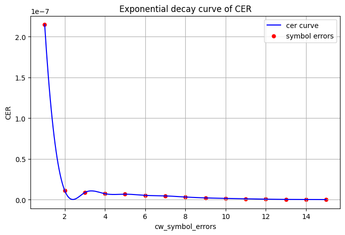
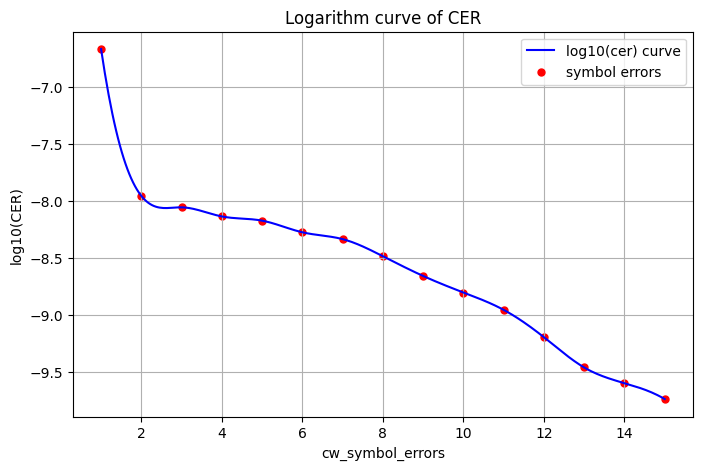
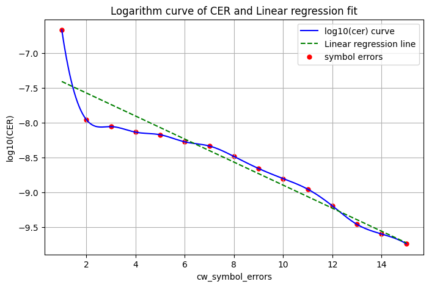

# FEC FLR support in SONiC #

## Table of Content
- [Revision](#revision)
- [Scope](#scope)
- [Definitions/Abbreviations](#abbreviations)
- [1 Overview](#1-overview)
- [2 Requirements](#2-requirements)
  - [2.1 Functional Requirements](#21-functional-requirements)
  - [2.2 CLI Requirements](#22-cli-requirements)
- [3 Architecture Design](#3-architecture-design)
- [4 High level design](#4-high-level-design)
  - [4.1 Assumptions](#41-assumptions)
  - [4.2 SAI counters used](#42-sai-counters-used)
  - [4.3 SAI API](#43-sai-api)
  - [4.4 FEC interleaving](#44-fec-interleaving)
  - [4.5 Observed FEC FLR](#45-observed-fec-flr)
  - [4.6 Predicted FEC FLR](#46-predicted-fec-flr)
- [5 Sample output](#5-sample-output)
- [6 Acknowledgements](#6-Acknowledgements)

### Revision

  | Rev |     Date    |       Author           | Change Description                |
  |:---:|:-----------:|:----------------------:|-----------------------------------|
  | 0.1 | 19-Mar-2025 | Pandurangan R S, Vinod Kumar Jammala (Arista Networks)| Initial version                   |
  | 0.2 | 07-Jul-2025 | Apoorv Sachan, Pandurangan R S, Vinod Kumar Jammala (Arista Networks)| Add predicted FEC FLR		|

### Scope

This document describes the implementation of Port Forward Error Correction (FEC) Frame Loss Ratio (FLR) support in SONiC.

### Definitions/Abbreviations

 | Term    |  Definition / Abbreviation                                            |
 |---------|-----------------------------------------------------------------------|
 | CER     | Codeword Error Ratio  |
 | FEC     | Forward Error Correction  |
 | FLR     | Frame Loss Ratio  |

### 1 Overview
Frame Loss Ratio (FLR) is a key performance metric used to measure the percentage of lost frames relative to the total transmitted frames over a network link.

FLR is expressed as,
	FLR = (Total Transmitted Frames - Total Received Frames) / Total Transmitted Frames

Based on the Forward Error Correction (FEC) data, receiver device can compute and estimate Codeword Error Ratio (CER), and FEC FLR will be calculated from CER.

## 2 Requirements
### 2.1 Functional Requirements
  This HLD introduces the following enhancements:
  - Calculation of FEC FLR at a configurable interval.
  - Storing per-interface FEC FLR in the Redis DB for telemetry streaming.
  - Enhancement of the `show interfaces counters fec-stats` CLI to include FEC FLR statistics.

### 2.2 CLI Requirements

 * The existing `show interfaces counters fec-stats` command will be enhanced to include the following FEC FLR columns:
   - FLR(O), to display observed FEC FLR values.
   - FLR(P), to display predicted FEC FLR values.
 * A new `counterpoll port` sub-command will be introduced to configure FEC FLR interval factor:
   - `counterpoll port flr-interval-factor FLR_INTERVAL_FACTOR`
     - The default value of FLR_INTERVAL_FACTOR will be 120.

## 3 Architecture Design

There are no changes to the current SONiC Architecture.

## 4 High-Level Design

 * SWSS changes:

   + port_flr.lua

     This new lua script will
       - Access the COUNTER_DB for already available counters for SAI_PORT_STAT_IF_IN_FEC_NOT_CORRECTABLE_FRAMES, SAI_PORT_STAT_IF_IN_FEC_CORRECTABLE_FRAMES,
         and SAI_PORT_STAT_IF_IN_FEC_CODEWORD_ERRORS_Si representing codewords with i symbol errors where i ranges from 0 to 15 in case of RS-544 FEC.
       - Compute both observed and predicted FEC FLR per port.
       - Store the computed FEC FLR values and the previous Redis counter values back into the Redis DB.
       - Perform the FEC FLR computation on each port once every `port_stat POLL_INTERVAL * FLR_INTERVAL_FACTOR` seconds, where FLR_INTERVAL_FACTOR is retrieved from the FLEX_COUNTER_DB.

   + portsorch.cpp
     - Link the new "port_flr.lua" script as a plugin to the existing PORT_STAT_COUNTER_FLEX_COUNTER_GROUP, alongside "port_rates.lua".

   + flexcounterorch.cpp
     - Enhance "FlexCounterOrch" to propagate FLR_INTERVAL_FACTOR from CONFIG_DB to FLEX_COUNTER_DB.

 * Utilities Common changes:

   + portstat.py:
     - Enhance the `portstat` command with the `-f` option (used by the CLI command `show interfaces counters fec-stats`) to include the FLR(O) and FLR(P) columns.

   + counterpoll/main.py:
     - Add a new argument `flr-interval-factor` to the exisiting `counterpoll port` command.

     ```
     root@sonic:~$ counterpoll port --help
     Usage: counterpoll port [OPTIONS] COMMAND [ARGS]...

       Port counter commands

     Options:
       --help  Show this message and exit.

     Commands:
       disable                  Disable port counter query
       enable                   Enable port counter query
       interval                 Set port counter query interval
       flr-interval-factor      Set port fec flr interval factor


     root@sonic:~$ counterpoll port flr-interval-factor --help
     Usage: counterpoll port flr-interval-factor [OPTIONS] FLR_INTERVAL_FACTOR

       Set port fec flr interval factor

     Options:
       --help  Show this message and exit.
     ```

### 4.1 Assumptions

SAI provide access to each interface the following attributes
- SAI_PORT_STAT_IF_IN_FEC_NOT_CORRECTABLE_FRAMES, which represents the number of uncorrectable FEC codewords.
  - return not support if its not working for an interface
- SAI_PORT_STAT_IF_IN_FEC_CORRECTABLE_FRAMES, which represents the number of correctable FEC codewords.
  - return not support if its not working for an interface
- SAI_PORT_STAT_IF_IN_FEC_CODEWORD_ERRORS_Si, which represents the number of codewords with i symbol errors.
  - return not support if its not working for an interface


### 4.2 Sai Counters Used

The following redis DB entries will be accessed for the FEC FLR calculations

|Redis DB |Table|Entries|New, RW| Format | Description|
|--------------|-------------|------------------|--------|----------------|----------------|
|COUNTER_DB |COUNTERS_PORT_NAME_MAP | oid  |R |string |Name to oid mapping |
|COUNTER_DB |COUNTERS |SAI_PORT_STAT_IF_IN_FEC_NOT_CORRECTABLE_FRAMES |R |number |Total number of uncorrectable codewords |
|COUNTER_DB |COUNTERS |SAI_PORT_STAT_IF_IN_FEC_CORRECTABLE_FRAMES |R |number |Total number of correctable codewords |
|COUNTER_DB |COUNTERS |SAI_PORT_STAT_IF_IN_FEC_CODEWORD_ERRORS_Si |R |number |Total number of codewords with i symbol errors |
|COUNTER_DB |RATES |FEC_FLR |New, RW| floating |calculated observed FEC FLR |
|COUNTER_DB |RATES |FEC_FLR_PREDICTED |New, RW| floating |calculated predicted FEC FLR |
|COUNTER_DB |RATES |SAI_PORT_STAT_IF_IN_FEC_NOT_CORRECTABLE_FRAMES_last |NEW, RW |number |Last uncorrectable codewords |
|COUNTER_DB |RATES |SAI_PORT_STAT_IF_IN_FEC_CORRECTABLE_FRAMES_last |NEW, RW |number |Last correctable codewords |
|COUNTER_DB |RATES |SAI_PORT_STAT_IF_IN_FEC_CODEWORD_ERRORS_Si_last |NEW, RW |number |Last codewords with i symbol errors |


### 4.3 SAI API

No change in the SAI API. No new SAI object accessed.

### 4.4 FEC interleaving
With FEC interleaving factor (X) incorporated, As per [IEEE 802.3df Logic Ad Hoc](https://www.ieee802.org/3/df/public/adhoc/logic/22_0630/opsasnick_3df_logic_220630a.pdf) FEC FLR is expressed as

FEC_FLR = CER * (1 + X * MFC)/MFC, where MFC (MAC frames per codeword) is 8 in the case of RS-544 FEC. Thus,

For X=1 (no interleaving), FEC_FLR = 1.125 * CER <br>
For X=2, FEC_FLR = 2.125 * CER <br>
For X=4, FEC_FLR = 4.125 * CER

To include the interleaving factor in the FEC FLR computation, a new SAI port attribute will be required to retrieve the underlying port interleaving factor.
Until such an attribute is available, the interleaving factor can be derived based on the following port speed to interleaving factor mapping:

| Port Speed | No. of lanes | FEC interleaving factor(X) |
|------------|--------------|----------------------------|
|      1600G |            8 |                          4 |
|       800G |            8 |                          4 |
|       400G |            8 |                          2 |
|       400G |            4 |                          2 |
|       200G |            4 |                          2 |
|       200G |            2 |                          2 |
|       100G |            2 |                          2 |
|       100G |            1 |    1 or 2 (autonegotiated) |

### 4.5 Observed FEC FLR

```
Step 1: calculate observed CER per interval
    Observed CER is expressed as, CER = Uncorrectable FEC codewords / Total FEC codewords Received, which can be expanded to

    CER = Uncorrectable FEC codewords / (Uncorrectable FEC codewords + Codewords with no symbol errors + Correctable FEC codewords)

    where, Uncorrectable FEC codewords = SAI_PORT_STAT_IF_IN_FEC_NOT_CORRECTABLE_FRAMES - SAI_PORT_STAT_IF_IN_FEC_NOT_CORRECTABLE_FRAMES_last
           Codewords with no symbol errors = SAI_PORT_STAT_IF_IN_FEC_CODEWORD_ERRORS_S0 - SAI_PORT_STAT_IF_IN_FEC_CODEWORD_ERRORS_S0_last
	   Correctable FEC codewords = SAI_PORT_STAT_IF_IN_FEC_CORRECTABLE_FRAMES - SAI_PORT_STAT_IF_IN_FEC_CORRECTABLE_FRAMES_last


Step 2: calculate FEC FLR using CER and considering interleaving factor (X)
    If X=1, FEC_FLR = 1.125 * CER
    If X=2, FEC_FLR = 2.125 * CER


Step 3: the following data will be updated and its latest value will be stored in the COUNTER_DB:RATES table after each computation

    FEC_FLR, SAI_PORT_STAT_IF_IN_FEC_NOT_CORRECTABLE_FRAMES_last, SAI_PORT_STAT_IF_IN_FEC_CORRECTABLE_FRAMES_last and SAI_PORT_STAT_IF_IN_FEC_CODEWORD_ERRORS_S0_last

```

### 4.6 Predicted FEC FLR

The goal is to estimate FEC FLR by extrapolating from observed codeword error distribution.
```
Step 1: Prepare codeword error index vector (x)

    x = { 1, 2, ..., max_correctable_cw_symbol_errors }

    where, max_correctable_cw_symbol_errors = 15 in case of RS-544

    For each index i in vector x, codeword_errors[i] represents number of codewords with i symbol errors in the
    current interval i.e SAI_PORT_STAT_IF_IN_FEC_CODEWORD_ERRORS_Si - SAI_PORT_STAT_IF_IN_FEC_CODEWORD_ERRORS_Si_last.
```


The codeword error ratio typically follows an exponential decay curve, as shown in the image below.


```
Step 2: Compute logarithm codeword error ratio vector (y)

    By applying a logarithm to the codeword error ratio, the exponential decay curve is transformed into a
    linear pattern, making it suitable for linear regression modeling.

    For each index i in vector x, compute logarithm of codeword error ratio y[i] as follows

    y[i] = log10( codeword_errors[i] / total_codewords )
    where, total_codewords is total number of codewords
           i.e Σ from i=0 to 15 of (SAI_PORT_STAT_IF_IN_FEC_CODEWORD_ERRORS_Si - SAI_PORT_STAT_IF_IN_FEC_CODEWORD_ERRORS_Si_last)
```


The image below shows the linear pattern of the codeword error ratio (CER) after applying a logarithm.


```
Step 3: Perform linear regresion to arrive at slope and intercept

    slope = (n * Σ(x*y) - Σx * Σy) / (n * Σ(x²) - (Σx)²)
    intercept = (Σy - slope * Σx) / n
    where, n: number of data points (length of x or y vector)

    This gives the best-fit line, y = slope * x + intercept.
```


The image below shows the linear regression line along with the logarithmic curve of the codeword error ratio (CER).


```
Step 4: Compute extrapolated CER

    Using linear regression line, predicted CER for an index representing j symbol errors is
    predicted_cer_j = 10 ^ ( j * slope + intercept )

    The predicted CER for a window of codewords with uncorrectable symbol errors is calculated as:
    predicted_cer = Σ from j=16 to 20 of predicted_cer_j

    Note: We use the uncorrectable symbol error window from 16 to 20 because for values above 20, the predicted CER becomes insignificant.
 

Step 5: Compute FLR from extrapolated CER by considering interleaving factor
   If X=1, FEC_FLR_PREDICTED = 1.125 * predicted_cer
   If X=2, FEC_FLR_PREDICTED = 2.125 * predicted_cer


Step 6: Store FEC_FLR_PREDICTED, SAI_PORT_STAT_IF_IN_FEC_CODEWORD_ERRORS_Si_last in the COUNTER_DB:RATES table
```

## 5 Sample CLI Output
```
root@sonic:~$ portstat -f
      IFACE    STATE    FEC_CORR    FEC_UNCORR    FEC_SYMBOL_ERR    FEC_PRE_BER    FEC_POST_BER    FLR(O)    FLR(P) (Accuracy)
-----------  -------  ----------  ------------  ----------------  -------------  --------------  --------  -------------------
  Ethernet0        U           0             0                 0       0.00e+00        0.00e+00         0                    0
  Ethernet8        U           0             0                 0       0.00e+00        0.00e+00         0                    0
 Ethernet16        X           0             0                 0       0.00e+00        0.00e+00         0                    0
 Ethernet24        X           0             0                 0       0.00e+00        0.00e+00         0                    0
 Ethernet32        U           0             0                 0       0.00e+00        0.00e+00         0                    0
 Ethernet40        D          21             0                 0       0.00e+00        0.00e+00         0                    0
 Ethernet48        X           0             0                 0       0.00e+00        0.00e+00         0                    0
 Ethernet56        X           0             0                 0       0.00e+00        0.00e+00         0                    0
 Ethernet64        U       1,334             0                 4       0.00e+00        0.00e+00         0                    0
 Ethernet72        U      28,531             0                31       0.00e+00        0.00e+00         0       2.68e-09 (79%)
 Ethernet80        U      25,890             0                25       0.00e+00        0.00e+00         0       6.03e-09 (79%)
 Ethernet88        U      21,909             0                49       0.00e+00        0.00e+00         0                    0
 Ethernet96        U       5,635             0                 8       0.00e+00        0.00e+00         0                    0
Ethernet104        U      21,141             0                 7       0.00e+00        0.00e+00         0       7.08e-09 (79%)
```

If FEC is not supported for an interface, the FLR(O) and FLR(P) fields will display `N/A` for the corresponding entry. If there is insufficient data to compute the FEC FLR (for example, if the link is performing well and there are not at least 2 bins with non-zero values for predicting FLR), both the observed (FLR(O)) and predicted (FLR(P)) FLR fields will display `0`. This choice is made for readability and consistency with user expectations in CLI output, as `0` is clearer and more concise than `0.00e+00` in this context.

## 6 Acknowledgements
Thanks to Prince and Cameron from Microsoft for sharing the details of the predicted FEC FLR algorithm and the mapping of port speed to interleaving factor.
