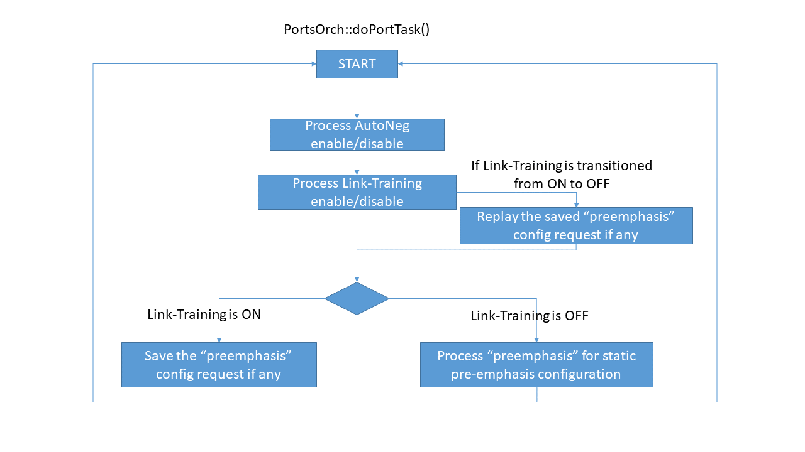
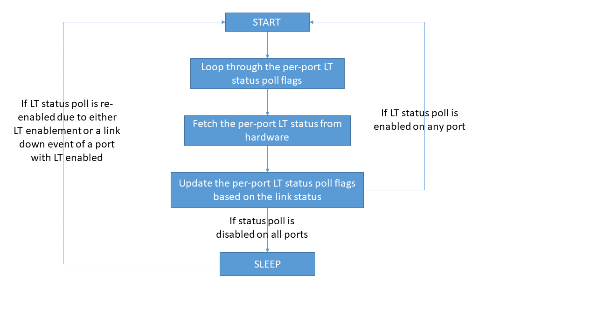

# SONiC Port Link Training Design #

## Table of Content

- [Revision](#revision)
- [Scope](#scope)
- [Abbreviations](#abbreviations)
- [Overview](#overview)
- [Requirements](#requirements)
- [Architecture Design](#architecture-design)
- [High-Level Design](#high-level-design)
- [SAI API Requirement](#sai-api-requirement)
- [Configuration and management ](#configuration-and-management)
  - [CLI Enhancements](#cli-enhancements)
    - [Config link training mode](#config-link-training-mode)
    - [Show link training status](#show-link-training-status)
  - [Config DB Enhancements](#config-db-enhancements)
  - [Application DB Enhancements](#application-db-enhancements)
  - [State DB Enhancements](#state-db-enhancements)
  - [YANG Model Enhancements](#yang-model-enhancements)
  - [DB Migration Considerations](#db-migration-considerations)
  - [SWSS Enhancements](#swss-enhancements)
- [Warmboot Design Impact](#warmboot-design-impact)
- [Limitations](#limitations)
- [Testing Requirements](#testing-requirements)
  - [Unit Test cases](#unit-test-cases)
  - [System Test cases](#system-test-cases)
- [Action items](#action-items)

### Revision

 | Rev |     Date    |       Author       | Change Description                |
 |:---:|:-----------:|:------------------:|-----------------------------------|
 | 0.1 |             | Dante (Kuo-Jung) Su| Initial version                   |
 | 0.2 |             | Dante (Kuo-Jung) Su| Addressing code review comments   |

### Scope
This document is the design document for port link training feature on SONiC. This includes the requirements, DB schema change, DB migrator change, yang model change and swss change.

The link-training hardware controls in this document is SAI specific, while the Gearbox design is outside the scope of this document.

### Abbreviations

 | Term    |     Meaning                             |
 |:-------:|:----------------------------------------|
 | ASIC    | Application-Specific Integrated Circuit |
 | BER     | Bit Error Rate                          |
 | FIR     | Finite Impulse Response                 |
 | SFP     | Small Form-factor Pluggable transceiver |

### Overview

Link training is a process by which the transmitter and receiver on a high-speed serial link communicate with each other in order to tune their equalization settings. In theory, link training enables automatic tuning of the FIR filter for each channel in an ASIC to achieve the desired bit error rate (BER)

In current SONiC implementation, user can leverage the platform-specific [media_settings.json](https://github.com/sonic-net/SONiC/blob/master/doc/media-settings/Media-based-Port-settings.md) to statically update the TX FIR per attached transceiver to improve BER. However, the ODM vendors rarely provide the pre-calibrated pre-emphasis for the CR/KR transceivers, which could result in the link reliability issues.

The IEEE 802.3 standard defines a set of link training protocols for various mediums, and the feature in this document is to focus on IEEE clause 72 and 93 to dynamically improve the link quality over the SFP coppers and backplanes.

This feature could be activated with or without port auto negotiation.

### Requirements

The main goal of this document is to discuss the design of following requirement:

- Allow user to configure link training
- Allow user to get the operational link training status

### Architecture Design

This feature does not change the existing SONiC architecture, while it has to change the configuration flow for port link training which will be covered in orchagent.

### High-Level Design

- SAI API requirements is covered in section [SAI API Requirement](#sai-api-requirement).
- A few new CLI commands will be added to sonic-utilities sub module. These CLI commands support user to configure link training mode as well as show port link training status. See detail description in section [CLI Enhancements](#cli-enhancements).
- A few new fields will be added to existing table in APPL_DB and CONFIG_DB to support link training attributes. See detail description in section [Config DB Enhancements](#config-db-enhancements), [Application DB Enhancements](#application-db-enhancements) and [State DB Enhancements](#state-db-enhancements)
- YANG Model needs update according to the DB schema change. See detail description in section [YANG Model Enhancements](#yang-model-enhancements)
- Port configuration setting flow will be changed in orchagent of sonic-swss. See detail description in section [SWSS Enhancements](#swss-enhancements).

### SAI API Requirement

First of all, we'll leverage the existing SAI port attributes listed below  

```cpp
    /**
     * @brief Enable/Disable Port Link Training
     *
     * @type bool
     * @flags CREATE_AND_SET
     * @default false
     */
    SAI_PORT_ATTR_LINK_TRAINING_ENABLE,

    /**
     * @brief Link training failure status and error codes
     *
     * @type sai_port_link_training_failure_status_t
     * @flags READ_ONLY
     */
    SAI_PORT_ATTR_LINK_TRAINING_FAILURE_STATUS,

    /**
     * @brief Status whether the receiver trained or not trained to receive data
     *
     * @type sai_port_link_training_rx_status_t
     * @flags READ_ONLY
     */
    SAI_PORT_ATTR_LINK_TRAINING_RX_STATUS,
```

On the other hand, a new port attribute will be introduced for the link-training ability query, and please note the link-training ability could be unavailable on the certain ports on a switch silicon (e.g. The uplink/management ports), hence we need to do the query at per-port basis.  

```cpp
    /**
     * @brief Query link-training support
     *
     * @type bool
     * @flags READ_ONLY
     */
    SAI_PORT_ATTR_SUPPORTED_LINK_TRAINING_MODE,
```

Vendor-specific SAI implementation is not in the scope of this document, but there are some common requirements for SAI:

1. swss must check the link-training abilities before making the corresponding requests to syncd.
2. SAI implementation must return error code if any of the above attributes is not supported, swss and syncd must not crash.
3. SAI implementation must keep port link training disabled by default for backward compatibility. As long as swss and SAI keep backward compatible, user need not change anything after this feature is implemented and available in SONiC.

### Configuration and management 

#### CLI Enhancements

A few new CLI commands are designed to support port link training.

##### Config link training mode


```
Format:
  config interface link-training <interface_name> <mode>

Arguments:
  interface_name: [mandatory] name of the interface to be configured. e.g: Ethernet0
  mode: [mandatory] link training mode, can be either "on" or "off"

Example:
  config interface link-training Ethernet0 on
  config interface link-training Ethernet0 off

Return:
  - error message if interface_name or mode is invalid
  - empty upon success
```

##### Show link training status

A new CLI command will be added to display the port link training status. All data of this command are fetched from **STATE_DB**.

```
Format:
  show interfaces link-training status <interface_name>

Arguments:
  interface_name: [optional] Name of the interface to be shown. e.g: Ethernet0.
                  If interface_name is not given, this command shows link training status for all interfaces.

Example:
  show interfaces link-training status
  show interfaces link-training status Ethernet0

Return:
  error message if interface_name is invalid otherwise:

admin@sonic:~$ show interfaces link-training status
  Interface      LT Oper    LT Admin    Oper    Admin
-----------  -----------  ----------  ------  -------
  Ethernet0      trained          on      up       up
  Ethernet8          off           -    down       up
 Ethernet16      trained          on      up       up
 Ethernet24          off           -    down       up
 Ethernet32  not trained          on    down       up
 Ethernet40          off           -    down       up
 Ethernet48          off           -    down       up
```


#### Config DB Enhancements  

A new field **link_training** will be added to **PORT** table:

	; Defines information for port configuration
	key                     = PORT|port_name     ; configuration of the port
	; field                 = value
	...
	link_training           = STRING             ; link training configuration

Valid value of the new fields are described below:

- link_training:  
String value, the administratively specified port link training configuration.
When "link_training" is not specified, the port link training should be disabled  

 | Mode |     Description                                                 |
 |:----:|:---------------------------------------------------------------:|
 | on   | Enable link-training                                            |
 | off  | Disable link-training                                           |

#### Application DB Enhancements

The following fields will be introduced into **PORT_TABLE** table:

	; Defines information for port configuration
	key                     = PORT_TABLE:port_name ; configuration of the port
	; field                 = value
	...
	link_training           = STRING               ; operational link training admin config

- link_training:  
String value, the port link training admin config.

#### State DB Enhancements

The following fields will be introduced into **PORT_TABLE** table:

	; Defines information for port link-training states
	key                  = PORT_TABLE:port_name ; port link-training states
	; field              = value
	link_training_status = STRING               ; port link-training operational status

- link_training_status:  
String value, the operational port link training status. The list of possible values is as follow  

  | Status      | Description                                                        |
  |:-----------:|:------------------------------------------------------------------:|
  | off         | Disabled                                                           |
  | on          | Enabled, while the further operational status is not yet available |
  | trained     | Enabled, while the pre-emphasis is tuned successfully              |
  | not_trained | Enabled, while the pre-emphasis is not yet tuned, no further failure is available |
  | frame_lock  | Enabled, while the training frame delineation is detected          |
  | snr_low     | Enabled, while the SNR low threshold is detected                   |
  | timeout     | Enabled, while the training process is timed out                   |

#### SAI attributes

Here is the table to map the fields and SAI attributes:  

| **Parameter**             | **sai_port_attr_t**                        |
|:--------------------------|:-------------------------------------------|
| link_training             | SAI_PORT_ATTR_LINK_TRAINING_ENABLE         |
| link_training_status      | SAI_PORT_ATTR_LINK_TRAINING_RX_STATUS, SAI_PORT_ATTR_LINK_TRAINING_FAILURE_STATUS |

#### YANG Model Enhancements

The port yang model needs to update according to DB schema change. The yang model changes of new fields are described below:

```
leaf link_training {
  type string {
    pattern "on|off";
  }
}
```

These new yang leaf will be added to sonic-port.yang.

#### DB Migration Considerations

By having port link training disabled if "link_training" is not specified in the CONFIG_DB, this feature is fully backward compatible.

#### SWSS Enhancements

##### Port Link-Training Ability Flag

During system startup, PortsOrch should query for the per-port link-training abilities from syncd, and have these per-port flags maintained in the **m_port_cap_lt** field of **Port** object.

i.e.
```cpp
class Port
{
    ......
    bool m_port_cap_lt = false; /* Port Capability - LinkTraining */
};
```

##### Port Link-Training Configuration Flow

in PortsOrch, the port Link-Training configuration flow is as follows, the link-training may or may not be disabled when auto-negotiation is activated, it depends on the switch ASIC limitations in the individual SAI implementation, and the pre-emphasis configuration request should be saved and replayed upon link-training configuration updates:



##### Port Link-Training Status Poll

A timer thread will be introduced into PortsOrch for polling link-training status, the per-port status poll will be activated upon the following events

- Link-Training is transitoned to be enabled on a port
- Link is down on a port with Link-Training enabled

On the other hand, the per-port status poll will be de-activated upon the following events

- Link-Training is transitoned to be disabled on a port
- Link is up on a port with Link-Training enabled

This timer is a single-threaded task that polls the status of all ports one by one, the program flow is as follows



### Warmboot Design Impact

SAI and lower layer must not flap port during warmboot no matter what link training parameter is given.

### Limitations

N/A

### Testing Requirements

#### Unit Test cases

For **sonic-swss**, we will leverage the existing [test_port.py](https://github.com/sonic-net/sonic-swss/blob/master/tests/test_port.py) for this. A few new test cases will be added:

1. Test attribute **link_training** on both direct and warm-reboot scenario. Verify SAI_PORT_ATTR_LINK_TRAINING_ENABLE is in ASIC_DB and has correct value.

For **sonic-utilities**, we will leverage the existing [unit test framework](https://github.com/sonic-net/sonic-utilities/tree/master/tests) for this. A few new test cases will be added:

1. Test command `config interface link-training <interface_name> <mode>`. Verify the command return error if given invalid interface_name or mode.

#### System Test cases

The following tests will be introduced into **sonic-mgmt** for this feature.

- test_link_training  
  Test all candidate ports by having interface/media type updated to copper followed by link-training enablement. Verification criteria:  
    - All ports are up when link-training is activated
    - All ports are up with link-training status equals to 'trained'
- test_link_training_negative  
  Test all candidate ports by having interface/media type updated to fiber followed by link-training enablement. Verification criteria:  
    - All ports are down when link-training is activated
    - All ports are down without link-training status equals to 'trained'

### Action items

TBD

