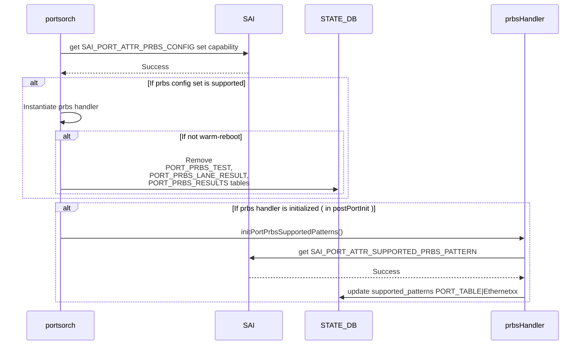
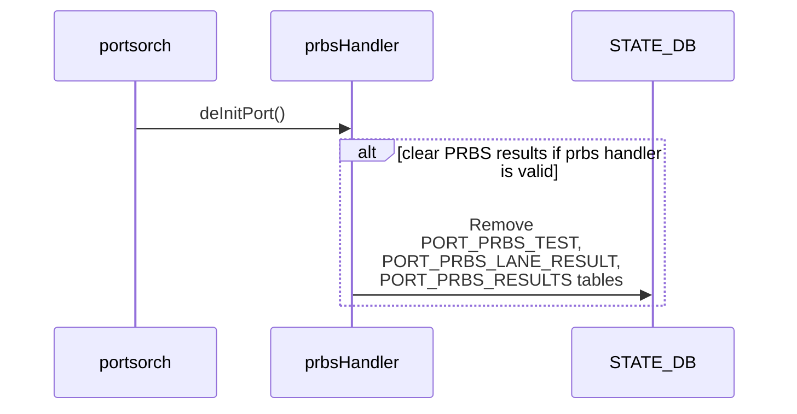
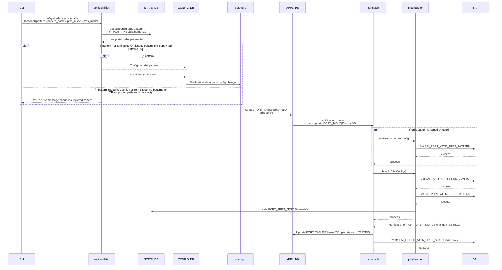
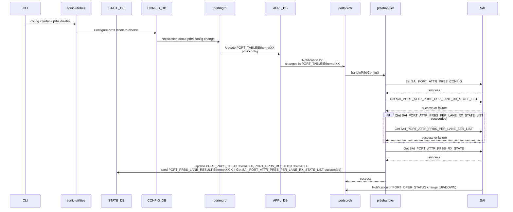
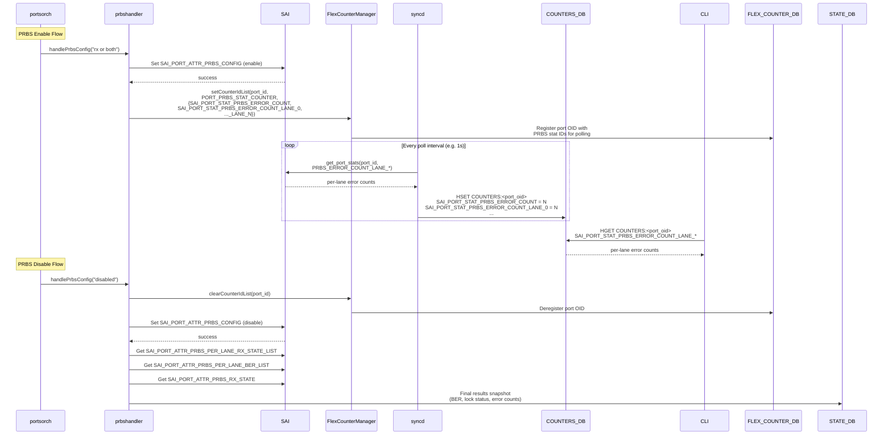

# PRBS Per-Lane Diagnostics Support

## Table of Contents

- [1. Revision](#1-revision)
- [2. Scope](#2-scope)
- [3. Definitions/Abbreviations](#3-definitionsabbreviations)
- [4. Overview](#4-overview)
- [5. Requirements](#5-requirements)
  - [5.1 Functional Requirements](#51-functional-requirements)
  - [5.2 Scalability Requirements](#52-scalability-requirements)
  - [5.3 Restrictions](#53-restrictions)
- [6. Architecture Design](#6-architecture-design)
- [7. High-Level Design](#7-high-level-design)
  - [7.1 Overview](#71-overview)
  - [7.2 Module Interfaces and Dependencies](#72-module-interfaces-and-dependencies)
  - [7.3 DB Schema](#73-db-schema)
    - [7.3.1 CONFIG_DB](#731-config_db)
    - [7.3.2 APPL_DB](#732-appl_db)
    - [7.3.3 STATE_DB](#733-state_db)
  - [7.4 Sequence Diagram](#74-sequence-diagram)
- [8. SAI API](#8-sai-api)
- [9. Configuration and Management](#9-configuration-and-management)
  - [9.1 CLI Enhancements](#91-cli-enhancements)
  - [9.2 YANG Model](#92-yang-model)
- [10. Warmboot and Fastboot Design Impact](#10-warmboot-and-fastboot-design-impact)
- [11. Restrictions/Limitations](#11-restrictionslimitations)
- [12. Testing Requirements/Design](#12-testing-requirementsdesign)
  - [12.1 Unit Test Cases](#121-unit-test-cases)
- [Appendix A: Example Use Cases](#appendix-a-example-use-cases)
- [Appendix B: BER Calculation and Interpretation](#appendix-b-ber-calculation-and-interpretation)

---

### 1. Revision

| Rev | Date       | Author                        | Change Description |
|-----|------------|-------------------------------|--------------------|
| 0.1 | 03/30/2026 | Pavan Naregundi, Parthiv Shah |  Initial version   |

### 2. Scope

This document describes the implementation of PRBS (Pseudo-Random Bit Sequence) per-lane diagnostics capabilities in SONiC. The feature enables network operators to configure, monitor, and troubleshoot link using PRBS at both port and individual lane levels with support for lock status, error counts, and Bit Error Rate (BER) metrics.

### 3. Definitions/Abbreviations

| **Term** | **Meaning** |
|----------|------------|
| PRBS | Pseudo-Random Bit Sequence |
| BER | Bit Error Rate |
| SAI | Switch Abstraction Interface |
| CLI | Command Line Interface |
| APPL_DB | Application Database |
| CONFIG_DB | Configuration Database |
| STATE_DB | State Database |
| SerDes | Serializer/Deserializer |

### 4. Overview

PRBS (Pseudo-Random Bit Sequence) is a critical diagnostic tool used to test the integrity of high-speed serial links by generating and checking random data patterns. It validates SerDes performance and physical connectivity between network devices.

This feature extends SONiC to provide comprehensive PRBS diagnostics with per-lane visibility when the underlying SAI implementation exposes per-lane attributes, and with graceful degradation to port-aggregated results when only port-level PRBS statistics are supported, enabling operators to:
- Configure PRBS tests on network interfaces with flexible mode (RX/TX/both) and polynomial pattern selection
- Monitor running PRBS tests with elapsed time tracking
- Capture and analyze per-lane results (lock status, error counts, and BER per lane) when **get** `SAI_PORT_ATTR_PRBS_PER_LANE_RX_STATE_LIST` succeeds, and port-level lock and error totals from `SAI_PORT_ATTR_PRBS_RX_STATE`
- Identify lane-specific issues that may be masked in port-level statistics on platforms that report per-lane data

The implementation follows an approach where PRBS tests run continuously, and results are captured only when the test is disabled, ensuring accurate and consistent measurements.

### 5. Requirements

#### 5.1 Functional Requirements

1. **PRBS Configuration**
   - Enable/disable PRBS on network interfaces
   - Support multiple PRBS modes: RX, TX, or both directions
   - Support PRBS polynomial patterns as defined in `sai_port_prbs_pattern_t`
   - Allow SAI SDK to select default polynomial pattern when `none` is specified or pattern is omitted (maps to `SAI_PORT_PRBS_PATTERN_AUTO`)
   - The port admin state must be UP to enable PRBS; once enabled, the port oper state is expected to transition to TESTING.
   - SDK is expected to block all the traffic to the port while PRBS is enabled.
   - Oper status of netdev is expected to be down to block the application from sending the frames.
   - When disabling PRBS, RX must be disabled before TX to ensure proper result capture.

2. **PRBS Monitoring**
   - Display PRBS test status (Running/Interrupted/Errored/Completed) across all ports

3. **PRBS Result Capture**
   - After PRBS is disabled (RX or both), capture results from SAI in a defined order with port-level fallback (see [Section 8 — SAI API](#8-sai-api))
   - When **get** `SAI_PORT_ATTR_PRBS_PER_LANE_RX_STATE_LIST` succeeds: populate `PORT_PRBS_LANE_RESULT` (and attempt **get** `SAI_PORT_ATTR_PRBS_PER_LANE_BER_LIST` for per-lane BER fields); derive or align port summary fields in `PORT_PRBS_RESULTS` from that data and/or `SAI_PORT_ATTR_PRBS_RX_STATE` per handler logic
   - When **get** `SAI_PORT_ATTR_PRBS_PER_LANE_RX_STATE_LIST` fails or is unsupported: omit `PORT_PRBS_LANE_RESULT` keys for that disable cycle; still query `SAI_PORT_ATTR_PRBS_RX_STATE` and populate `PORT_PRBS_RESULTS` with port-level lock status and error count when that get succeeds
   - Store results in STATE_DB for repeated queries
   - Provide per-lane RX status, error counts, and BER metrics
   - Compute port-level summary statistics (locked lanes, error-free lanes, total errors) at CLI level

#### 5.2 Scalability Requirements

- Support up to 16 lanes per port

#### 5.3 Restrictions

- Any port configuration changes (speed, FEC, MTU, admin state, etc.) should be avoided while a PRBS test is running; such changes may interrupt the test or produce unreliable results

### 6. Architecture Design

The PRBS per-lane diagnostics feature integrates into the existing SONiC architecture without requiring fundamental architectural changes. The feature utilizes the standard SONiC database infrastructure and orchestration framework.


### 7. High-Level Design

#### 7.1 Overview

This is a built-in SONiC feature that adds PRBS diagnostic capabilities through following changes:

**Modified Repositories:**
1. **sonic-utilities**: CLI implementation
   - `config/interface_prbs.py`: PRBS enable/disable commands
   - `show/interfaces/prbs.py`: PRBS status display commands
   - `clear/main.py`: PRBS results clear command
   - `utilities_common/prbs_util.py`: Helper functions formatting

2. **sonic-swss**: Orchestration logic
   - `orchagent/portsorch.cpp`: Query Capability and if PRBS is supported route PRBS operations to PrbsHandler
   - `orchagent/prbshandler.cpp/h`: New PRBS handler class

3. **sonic-sairedis**: SAI attribute serialization and deserialization support
   - Serialization and deserialization for new SAI PRBS per-lane attributes

4. **sonic-yang-models**: Configuration schema
   - `yang-models/sonic-port.yang`: Add PRBS field validation

#### 7.2 Module Interfaces and Dependencies

**CLI → STATE_DB (read) → CONFIG_DB (write):**
- Read: `PORT_TABLE|<interface>` from STATE_DB to get `supported_patterns` for the port
- Validate: If `--pattern` is specified, verify it exists in the per-port supported patterns list; reject with error if not supported or if list is empty
- Write: `PORT|<interface>` with `prbs_mode` and `prbs_pattern` fields to CONFIG_DB
- Validation: Interface existence, mode/pattern values

**PortsOrch Init → PrbsHandler:**
- During PortsOrch initialization, query `SAI_PORT_ATTR_PRBS_CONFIG` set capability via `sai_query_attribute_capability`
- If PRBS is supported, instantiate PrbsHandler
- If not a warm-reboot, clear stale STATE_DB entries (`PORT_PRBS_TEST`, `PORT_PRBS_RESULTS`, `PORT_PRBS_LANE_RESULT`)
- During `postPortInit`, queries `SAI_PORT_ATTR_SUPPORTED_PRBS_PATTERN` per port and writes the `supported_patterns` field to STATE_DB `PORT_TABLE|<interface>`

**PortsOrch Deinit → PrbsHandler:**
- On port removal, clear STATE_DB entries for the port

**PortsOrch → PrbsHandler (runtime):**
- PortsOrch detects PRBS field changes in APPL_DB
- Routes PRBS operations to PrbsHandler
- PrbsHandler manages SAI interaction and STATE_DB updates
- PRBS configuration is applied directly without modifying port admin state

**PrbsHandler → SAI:**

- Get `SAI_PORT_ATTR_SUPPORTED_PRBS_PATTERN` (per-port supported pattern list)
- Set `SAI_PORT_ATTR_PRBS_PATTERN`
- Set `SAI_PORT_ATTR_PRBS_CONFIG`
- Query `SAI_PORT_ATTR_PRBS_PATTERN` to get actual value used
- Set `SAI_PORT_ATTR_PRBS_CONFIG` to `SAI_PORT_PRBS_CONFIG_DISABLE`
- Query result attributes in this order: **get** `SAI_PORT_ATTR_PRBS_PER_LANE_RX_STATE_LIST`; only if that **get** succeeds, **get** `SAI_PORT_ATTR_PRBS_PER_LANE_BER_LIST` (for BER in lane rows). If the RX state list **get** fails or is unsupported, skip writing `PORT_PRBS_LANE_RESULT` for this disable. Always **get** `SAI_PORT_ATTR_PRBS_RX_STATE` for port-level lock status and error count and populate `PORT_PRBS_RESULTS` when that query succeeds

**PrbsHandler → STATE_DB:**
- Write: `PORT_PRBS_TEST`, `PORT_PRBS_RESULTS`, and `PORT_PRBS_LANE_RESULT` tables
- Write: `supported_patterns` field in `PORT_TABLE|<interface>` during init

#### 7.3 DB Schema

##### 7.3.1 CONFIG_DB

###### 7.3.1.1 Extend existing Table PORT

PRBS configuration fields are added to the existing PORT table.

```abnf
; defines schema for PRBS configuration attributes (extends existing PORT table)

key                   = PORT | ifname        ; Interface name (Ethernet only). Must be unique

; field               = value
prbs_mode             = "rx" / "tx" / "both" / "disabled"   ; PRBS operation mode
                                                 ; - "rx"      : Enable PRBS receiver only
                                                 ; - "tx"      : Enable PRBS transmitter only
                                                 ; - "both"    : Enable PRBS in both directions
                                                 ; - "disabled": PRBS disabled
prbs_pattern       = "none" / "PRBS7" / "PRBS9" / "PRBS10" / "PRBS11" /
                        "PRBS13" / "PRBS15" / "PRBS16" / "PRBS20" / "PRBS23" /
                        "PRBS31" / "PRBS32" / "PRBS49" / "PRBS58" /
                        "PRBS7Q" / "PRBS9Q" / "PRBS13Q" / "PRBS15Q" /
                        "PRBS23Q" / "PRBS31Q" / "SSPRQ"
                                                 ; PRBS pattern.
                                                 ; - "none" : maps to SAI_PORT_PRBS_PATTERN_AUTO
                                                 ;            (SAI SDK chooses default)
```

**Sample JSON:**
```json
{
  "PORT|Ethernet0": {
    "value": {
      "prbs_mode": "rx",
      "prbs_pattern": "PRBS31"
    }
  }
}
```

##### 7.3.2 APPL_DB

The `portmgrd` propagates PRBS configuration from CONFIG_DB to APPL_DB. APPL_DB PORT_TABLE mirrors the PRBS fields from CONFIG_DB PORT table.

###### 7.3.2.1 Extend existing Table PORT_TABLE

```abnf
; defines schema for PRBS attributes in PORT_TABLE (propagated from CONFIG_DB)

key                   = PORT_TABLE | ifname   ; Interface name. Must be unique

; field               = value
prbs_mode             = "rx" / "tx" / "both" / "disabled"   ; Propagated from CONFIG_DB
prbs_pattern       = "none" / "PRBS7" / "PRBS9" / "PRBS10" / "PRBS11" /
                        "PRBS13" / "PRBS15" / "PRBS16" / "PRBS20" / "PRBS23" /
                        "PRBS31" / "PRBS32" / "PRBS49" / "PRBS58" /
                        "PRBS7Q" / "PRBS9Q" / "PRBS13Q" / "PRBS15Q" /
                        "PRBS23Q" / "PRBS31Q" / "SSPRQ"
                                                 ; Propagated from CONFIG_DB
```

**Sample JSON:**
```json
{
  "PORT_TABLE:Ethernet0": {
    "prbs_mode": "rx",
    "prbs_pattern": "PRBS31"
  }
}
```

##### 7.3.3 STATE_DB

###### 7.3.3.0 Extend existing Table PORT_TABLE

The `supported_patterns` field is added to the existing STATE_DB `PORT_TABLE` during PrbsHandler init. This is populated by querying `SAI_PORT_ATTR_SUPPORTED_PRBS_PATTERN` per port.

```abnf
; defines schema for PRBS supported patterns (extends existing PORT_TABLE in STATE_DB)

key                   = PORT_TABLE | ifname        ; Interface name. Must be unique

; field               = value
supported_patterns    = pattern_list               ; Comma-separated list of supported PRBS patterns
                                                   ; e.g., "PRBS7,PRBS9,PRBS10,PRBS11,PRBS13,PRBS15,PRBS16,PRBS20,PRBS23,PRBS31,PRBS32,PRBS49,PRBS58,PRBS7Q,PRBS9Q,PRBS13Q,PRBS15Q,PRBS23Q,PRBS31Q,SSPRQ"
                                                   ; Empty string if SAI query fails or no patterns supported
```

**Sample JSON:**
```json
{
  "PORT_TABLE|Ethernet0": {
    "supported_patterns": "PRBS7,PRBS9,PRBS10,PRBS11,PRBS13,PRBS15,PRBS16,PRBS20,PRBS23,PRBS31,PRBS32,PRBS49,PRBS58,PRBS7Q,PRBS9Q,PRBS13Q,PRBS15Q,PRBS23Q,PRBS31Q,SSPRQ"
  }
}
```

###### 7.3.3.1 New Table PORT_PRBS_TEST

Test configuration, status, and metadata. Written by PrbsHandler when PRBS is enabled or disabled.

```abnf
; defines schema for PRBS test status and metadata

key                   = PORT_PRBS_TEST | ifname   ; Interface name. Must be unique per active test

; field               = value
status                = "failed" / "running" / "stopped" / "errored"   ; Test execution status
                                                 ; - "failed" : PRBS test failed during enable
                                                 ; - "running" : PRBS test is active
                                                 ; - "stopped" : PRBS disabled, results captured
                                                 ; - "errored" : Test encountered an error
mode                  = "both" / "rx" / "tx"     ; PRBS mode when test was running
pattern            = "AUTO" / "PRBS7" / "PRBS9" / "PRBS10" / "PRBS11" / "PRBS13" /
                        "PRBS15" / "PRBS16" / "PRBS20" / "PRBS23" / "PRBS31" /
                        "PRBS32" / "PRBS49" / "PRBS58" /
                        "PRBS7Q" / "PRBS9Q" / "PRBS13Q" / "PRBS15Q" /
                        "PRBS23Q" / "PRBS31Q" / "SSPRQ"     ; Actual pattern used by SAI
start_time            = 1*20DIGIT                ; Test start time (unix timestamp)
stop_time             = 1*20DIGIT                ; Test stop time when stopped (unix timestamp)
```

**Sample JSON:**
```json
{
  "PORT_PRBS_TEST|Ethernet0": {
    "value": {
      "status": "stopped",
      "mode": "rx",
      "pattern": "PRBS31",
      "start_time": "1774596853",
      "stop_time": "1774597020"
    }
  }
}
```

###### 7.3.3.2 New Table PORT_PRBS_RESULTS

Port-level PRBS summary results. Written by PrbsHandler when PRBS is disabled (rx or both modes only). TX-only mode does not create entries.

```abnf
; defines schema for PRBS port-level result summary

key                   = PORT_PRBS_RESULTS | ifname   ; Interface name. Must be unique

; field               = value
rx_status             = "OK" / "LOCK_WITH_ERRORS" / "NOT_LOCKED" / "LOST_LOCK"
                                                 ; Port-level RX status from SAI
error_count           = 1*20DIGIT                ; Port-level error count
total_lanes           = 1*2DIGIT                 ; Number of serdes lanes (1..16)
```

**Sample JSON:**
```json
{
  "PORT_PRBS_RESULTS|Ethernet0": {
    "value": {
      "error_count": "97502",
      "rx_status": "LOCK_WITH_ERRORS",
      "total_lanes": "8"
    }
  }
}
```

###### 7.3.3.3 New Table PORT_PRBS_LANE_RESULT

Per-lane RX results. Written by PrbsHandler when PRBS is disabled (rx or both modes only). TX-only mode does not create entries.

```abnf
; defines schema for PRBS per-lane result attributes

key                   = PORT_PRBS_LANE_RESULT | ifname | lane_num   ; Interface and lane (0-based)
                                                                   ; Must be unique per lane

; field               = value
rx_status             = "OK" / "LOCK_WITH_ERRORS" / "NOT_LOCKED" / "LOST_LOCK"
                                                 ; SAI PRBS RX status for the lane
                                                 ; - "OK"               : Locked, no errors
                                                 ; - "LOCK_WITH_ERRORS" : Locked with errors
                                                 ; - "NOT_LOCKED"       : Not locked
                                                 ; - "LOST_LOCK"        : Lock lost during test
error_count           = 1*20DIGIT                ; Error count for this lane
ber_mantissa          = 1*20DIGIT                ; BER mantissa (scientific notation)
ber_exponent          = 1*5DIGIT                 ; BER exponent (scientific notation)
```

**Sample JSON:**
```json
{
  "PORT_PRBS_LANE_RESULT|Ethernet0|0": {
    "value": {
      "ber_exponent": "15",
      "ber_mantissa": "681265",
      "error_count": "12055",
      "rx_status": "LOCK_WITH_ERRORS"
    }
  }
}
```

**Schema Notes:**
- Results are stored in STATE_DB until next PRBS enable (allows repeated queries)
- TX-only mode does not create PORT_PRBS_RESULTS or PORT_PRBS_LANE_RESULT entries
- Port-level-only ASICs: after disable, expect `PORT_PRBS_RESULTS` only (no `PORT_PRBS_LANE_RESULT*` keys) until per-lane SAI support is added on that platform
- `sonic-clear prbs results` deletes PORT_PRBS_TEST, PORT_PRBS_RESULTS, and PORT_PRBS_LANE_RESULT keys from STATE_DB

#### 7.4 Sequence Diagram
**Port Orchagent Init Flow:**

**Port Remove Flow:**

**PRBS Enable Flow:**


**PRBS Disable and Result Capture Flow:**


### 8. SAI API

The following table lists the SAI APIs used and their relevant attributes. This feature leverages the SAI per-lane PRBS enhancements as defined in SAI v1.18.

**SAI Port PRBS Configuration Attributes:**

| API   | Function                         | Attribute                                              |
|:------|:---------------------------------|:-------------------------------------------------------|
| PORT  | sai_set_port_attribute_fn / sai_get_port_attribute_fn | SAI_PORT_ATTR_PRBS_PATTERN        |
|       |                                  | SAI_PORT_ATTR_PRBS_CONFIG                              |

**SAI Port PRBS Capability Query Attributes:**

| API   | Function                         | Attribute                                              |
|:------|:---------------------------------|:-------------------------------------------------------|
| PORT  | sai_query_attribute_capability   | SAI_PORT_ATTR_PRBS_CONFIG                              |
| PORT  | sai_get_port_attribute_fn        | SAI_PORT_ATTR_SUPPORTED_PRBS_PATTERN                   |

**SAI Port PRBS Result Query Attributes:**

| API   | Function                         | Attribute                                              |
|:------|:---------------------------------|:-------------------------------------------------------|
| PORT  | sai_get_port_attribute_fn        | SAI_PORT_ATTR_PRBS_RX_STATE                            |
|       |                                  | SAI_PORT_ATTR_PRBS_PER_LANE_RX_STATE_LIST              |
|       |                                  | SAI_PORT_ATTR_PRBS_PER_LANE_BER_LIST                   |

**`sai_port_prbs_pattern_t` Enum — Pattern-to-SAI Mapping:**

| PRBS Pattern (string)  | SAI Enum Value                                |
|:-----------------------|:----------------------------------------------|
| none                   | SAI_PORT_PRBS_PATTERN_AUTO                    |
| PRBS7                  | SAI_PORT_PRBS_PATTERN_PRBS7                   |
| PRBS9                  | SAI_PORT_PRBS_PATTERN_PRBS9                   |
| PRBS10                 | SAI_PORT_PRBS_PATTERN_PRBS10                  |
| PRBS11                 | SAI_PORT_PRBS_PATTERN_PRBS11                  |
| PRBS13                 | SAI_PORT_PRBS_PATTERN_PRBS13                  |
| PRBS15                 | SAI_PORT_PRBS_PATTERN_PRBS15                  |
| PRBS16                 | SAI_PORT_PRBS_PATTERN_PRBS16                  |
| PRBS20                 | SAI_PORT_PRBS_PATTERN_PRBS20                  |
| PRBS23                 | SAI_PORT_PRBS_PATTERN_PRBS23                  |
| PRBS31                 | SAI_PORT_PRBS_PATTERN_PRBS31                  |
| PRBS32                 | SAI_PORT_PRBS_PATTERN_PRBS32                  |
| PRBS49                 | SAI_PORT_PRBS_PATTERN_PRBS49                  |
| PRBS58                 | SAI_PORT_PRBS_PATTERN_PRBS58                  |
| PRBS7Q                 | SAI_PORT_PRBS_PATTERN_PRBS7Q                  |
| PRBS9Q                 | SAI_PORT_PRBS_PATTERN_PRBS9Q                  |
| PRBS13Q                | SAI_PORT_PRBS_PATTERN_PRBS13Q                 |
| PRBS15Q                | SAI_PORT_PRBS_PATTERN_PRBS15Q                 |
| PRBS23Q                | SAI_PORT_PRBS_PATTERN_PRBS23Q                 |
| PRBS31Q                | SAI_PORT_PRBS_PATTERN_PRBS31Q                 |
| SSPRQ                  | SAI_PORT_PRBS_PATTERN_SSPRQ                   |

### 9. Configuration and Management

#### 9.1 CLI Enhancements

**Configuration Commands:**

1. **Enable PRBS**
```bash
config interface prbs <interface> enable [--mode <rx|tx|both>] [--pattern <pattern_name>]

# Examples:
config interface prbs Ethernet0 enable --mode rx --pattern PRBS31
config interface prbs Ethernet4 enable --mode both
config interface prbs Ethernet8 enable                                # Defaults: mode=rx, pattern=none (SAI SDK default)
config interface prbs Ethernet16 enable --mode rx --pattern none      # Explicit AUTO
```

Options:
- `--mode`: PRBS mode (default: rx)
  - `rx`: Enable receiver only
  - `tx`: Enable transmitter only
  - `both`: Enable both transmitter and receiver
- `--pattern`: PRBS pattern (default: `none`)
  - `none`: SAI SDK selects the default pattern (`SAI_PORT_PRBS_PATTERN_AUTO`)
  - Supported patterns: `PRBS7`, `PRBS9`, `PRBS10`, `PRBS11`, `PRBS13`, `PRBS15`, `PRBS16`, `PRBS20`, `PRBS23`, `PRBS31`, `PRBS32`, `PRBS49`, `PRBS58`, `PRBS7Q`, `PRBS9Q`, `PRBS13Q`, `PRBS15Q`, `PRBS23Q`, `PRBS31Q`, `SSPRQ`

Validation:
- If `--pattern` is a specific pattern (not `none`), CLI reads `supported_patterns` from STATE_DB `PORT_TABLE|<interface>` and verifies the requested pattern is in the list
- If the pattern is not in the supported list (or the list is empty), the command is rejected with an error message indicating unsupported pattern
- If `--pattern` is `none` or omitted, no validation is performed and SAI SDK selects the default via `SAI_PORT_PRBS_PATTERN_AUTO`

Behavior:
- Fails if PRBS is already enabled (must disable first to capture results)

2. **Disable PRBS**
```bash
config interface prbs <interface> disable

# Example:
config interface prbs Ethernet0 disable
```

**Maintenance Commands:**

1. **Clear PRBS Results**
```bash
sonic-clear prbs results [-i <interface_name>]

# Examples:
sonic-clear prbs results                     # Clear results for all interfaces
sonic-clear prbs results -i Ethernet0        # Clear results for specific interface
```

Behavior:
- Without `-i`: deletes all `PORT_PRBS_TEST*`, `PORT_PRBS_RESULTS*`, and `PORT_PRBS_LANE_RESULT*` keys from STATE_DB
- With `-i <interface>`: validates interface exists in CONFIG_DB PORT table, then deletes `PORT_PRBS_TEST|<interface>`, `PORT_PRBS_RESULTS|<interface>`, and `PORT_PRBS_LANE_RESULT|<interface>*` keys
- Reports number of records deleted

**Show Commands:**

1. **Show PRBS Status (all ports — no arguments)**
```bash
show interface prbs status [--json]
```

Example output:
```
Interface    Mode    Pattern    Status       RX Status          Error Count  BER            Start Time           Duration
-----------  ------  ---------  -----------  -----------------  -----------  -------------  -------------------  ----------
Ethernet0    both    PRBS31     Running      --                 --           --             2026-02-05 14:20:00  00:03:45
Ethernet4    rx      PRBS23     Running      --                 --           --             2026-02-05 14:18:30  00:05:15
Ethernet8    rx      PRBS31     Completed    LOCK_WITH_ERRORS   15633        1.15 × 10⁻⁸    2026-02-05 13:10:00  00:30:00
Ethernet12   both    PRBS9      Interrupted  --                 --           --             2026-02-05 12:00:00  --
Ethernet16   tx      PRBS31     Completed    --                 --           --             2026-02-05 11:45:00  00:01:50
```

Column descriptions:
- **RX Status**: Raw port-level RX status from `PORT_PRBS_RESULTS` (e.g., `OK`, `LOCK_WITH_ERRORS`, `NOT_LOCKED`, `LOST_LOCK`). `--` when results are not available.
- **Error Count**: From `PORT_PRBS_RESULTS`. `--` when results are not available.
- **BER**: Average Bit Error Rate across all lanes, computed as sum of per-lane BER divided by number of lanes. `--` when lane results are not available.

**Status derivation logic:**
- **Errored**: `prbs_status == errored` (independent of oper_status)
- **Running**: `prbs_status == running` AND `oper_status == TESTING`
- **Interrupted**: `prbs_status == running` AND `oper_status != TESTING`
- **Completed**: `prbs_status == stopped`
- Duration: Running=live elapsed, Completed=start→stop, Errored/Interrupted=`--`

JSON output:
```json
{
  "Ethernet8": {
    "mode": "rx",
    "pattern": "PRBS31",
    "status": "Completed",
    "rx_status": "LOCK_WITH_ERRORS",
    "error_count": 15633,
    "ber": "1.15e-08",
    "start_time": "2026-02-05 13:10:00",
    "duration": "00:30:00"
  },
  "Ethernet16": {
    "mode": "tx",
    "pattern": "PRBS31",
    "status": "Completed",
    "rx_status": null,
    "error_count": null,
    "ber": null,
    "start_time": "2026-02-05 11:45:00",
    "duration": "00:01:50"
  }
}
```

2. **Show PRBS Status (per-interface detailed view)**
```bash
show interface prbs status -i <interface> [--json]
```

**RX/both mode — per-lane results (after test completed):**
```
Interface: Ethernet0 | Mode: rx | Pattern: PRBS31 | Status: Completed | Duration: 00:01:41

  Lane  Lock    RX Status           Errors  BER
------  ------  ----------------  --------  ------------
     0  Locked  LOCK_WITH_ERRORS      2782  0
     1  Locked  LOCK_WITH_ERRORS      1426  1.18 × 10⁻⁸
     2  Locked  LOCK_WITH_ERRORS      3189  1.00e+00
     3  Locked  LOCK_WITH_ERRORS      5252  1.10 × 10⁻⁸
     4  Locked  LOCK_WITH_ERRORS       812  1.00e+00
     5  Locked  LOCK_WITH_ERRORS       700  1.19 × 10⁻⁸
     6  Locked  LOCK_WITH_ERRORS       225  1.18 × 10⁻¹⁴
     7  Locked  LOCK_WITH_ERRORS      1247  1.26 × 10⁻⁸
```

**TX-only mode (no per-lane results):**
```
Interface:       Ethernet96
Mode:            tx
Pattern:         PRBS31
Status:          Completed
Duration:        00:01:50
Note:            TX mode does not capture PRBS results
```

TX-only JSON:
```json
{
  "interface": "Ethernet96",
  "mode": "tx",
  "pattern": "PRBS31",
  "status": "Completed",
  "duration": "00:01:50",
  "message": "TX mode does not capture PRBS results"
}
```

**Running test (no results yet):**
```
Interface: Ethernet0 | Mode: both | Pattern: PRBS31 | Status: Running | Duration: 00:03:45

Note: No PRBS result data available
```

**Lock status derivation (CLI level):**
- OK, LOCK_WITH_ERRORS → "Locked"
- NOT_LOCKED, LOST_LOCK → "Not Locked"

#### 9.2 YANG Model

**YANG Model Changes** (`sonic-port.yang`):

```yang
module sonic-port{
  ...
  container sonic-port{

    container PORT {

      list PORT_LIST {
        ...
        leaf prbs_mode {
            type string {
                pattern "rx|tx|both|disabled";
            }
            description "PRBS mode: rx, tx, both (enable), or disabled";
        }

        leaf prbs_pattern {
            type string {
                pattern "none|PRBS7|PRBS9|PRBS10|PRBS11|PRBS13|PRBS15|PRBS16|PRBS20|PRBS23|PRBS31|PRBS32|PRBS49|PRBS58|PRBS7Q|PRBS9Q|PRBS13Q|PRBS15Q|PRBS23Q|PRBS31Q|SSPRQ";
            }
            description "PRBS pattern. 'none' string means SAI SDK chooses default.";
        }
      }
    }
  }
}
```

**Schema Evolution:**
- New fields added to existing PORT yang
- Fields are optional and only present when PRBS is configured

### 10. Warmboot and Fastboot Design Impact

- PRBS is compatible with warm boot; no special pre-warmboot steps are required

### 11. Restrictions/Limitations

1. **No runtime stats**: For simpler implementation, design chooses not to do any runtime polling of stats.

**Runtime PRBS Stats Polling (future enhancement):**



**Key design points for runtime polling:**
- A dedicated flex counter group (`PORT_PRBS_STAT_COUNTER`) is used, separate from the standard `PORT_STAT_COUNTER` group, so PRBS stats are only polled for ports actively running PRBS
- Stats are dynamically registered on PRBS enable and deregistered on PRBS disable
- Only raw error counts are available as SAI stats; BER (mantissa/exponent) and lock status remain attribute-only and are still captured at disable time via `capturePrbsResults()`

### 12. Testing Requirements/Design

#### 12.1 Unit Test Cases

Unit tests shall be added in `src/sonic-utilities/tests/`, `src/sonic-swss/tests/`, and `src/sonic-sairedis/tests/` (including `unittest/`).

**src/sonic-utilities/tests/**

| # | Test Case | Description |
|---|-----------|-------------|
| 1 | Test config interface prbs enable | PRBS enable with mode (rx, tx, both) and pattern; verify CONFIG_DB write |
| 2 | Test config interface prbs enable validation | Invalid interface, invalid mode, invalid pattern; expect failure |
| 3 | Test config interface prbs enable with default pattern | Enable without --pattern; verify empty/default handling |
| 4 | Test config interface prbs enable while running | Enable when PRBS already enabled; expect failure |
| 5 | Test config interface prbs disable | PRBS disable; verify CONFIG_DB update |
| 6 | Test show interface prbs status (all ports) | Mock STATE_DB; verify summary output (Running/Interrupted/Errored/Completed) |
| 7 | Test show interface prbs status -i \<interface\> | Mock STATE_DB with PORT_PRBS_TEST and PORT_PRBS_LANE_RESULT; verify per-lane view |
| 8 | Test show interface prbs status --json | Verify JSON output format |
| 9 | Test sonic-clear prbs results (all interfaces) | Mock STATE_DB; verify PORT_PRBS_TEST* and PORT_PRBS_LANE_RESULT* keys deleted |
| 10 | Test sonic-clear prbs results -i \<interface\> | Mock STATE_DB; verify interface-specific keys deleted |
| 11 | Test sonic-clear prbs results invalid interface | Invalid or non-existent interface; expect failure |

**src/sonic-swss/tests/**

| # | Test Case | Description |
|---|-----------|-------------|
| 1 | Test PRBS CONFIG_DB to APPL_DB propagation | Set prbs_mode and prbs_pattern in CONFIG_DB PORT; verify portmgrd propagates to APPL_DB PORT_TABLE |
| 2 | Test PRBS config removal | Remove prbs fields from CONFIG_DB; verify APPL_DB PORT_TABLE updated |
| 3 | Test PRBS PrbsHandler STATE_DB write | Trigger PRBS disable flow; verify PORT_PRBS_TEST and PORT_PRBS_LANE_RESULT written to STATE_DB (requires platform with PRBS SAI support or mock) |

**src/sonic-sairedis/tests/ (unittest/)**

| # | Test Case | Description |
|---|-----------|-------------|
| 1 | Test PRBS attribute serialization | sai_serialize/sai_deserialize for SAI_PORT_ATTR_PRBS_PATTERN, SAI_PORT_ATTR_PRBS_CONFIG |
| 2 | Test PRBS per-lane struct serialization | sai_serialize/sai_deserialize for sai_prbs_per_lane_rx_state_t, sai_prbs_bit_error_rate_t |

---

## Appendix A: Example Use Cases

**Use Case 1: Troubleshooting Intermittent Link Issues**
```bash
# Switch1: Enable PRBS pattern on tx
config interface prbs Ethernet4 enable --mode tx --pattern PRBS31

# Switch2: Enable PRBS test on rx
config interface prbs Ethernet4 enable --mode rx --pattern PRBS31

# Check running status
show interface prbs status

# Switch2: Disable rx and analyze results
config interface prbs Ethernet4 disable
show interface prbs status -i Ethernet4

# Switch1: Disable tx
config interface prbs Ethernet4 disable
show interface prbs status -i Ethernet4

```

## Appendix B: BER Calculation and Interpretation

**BER Format:**
- BER = mantissa × 10^(-exponent)
- Example: mantissa=183, exponent=11 → BER = 1.83 × 10^-9
