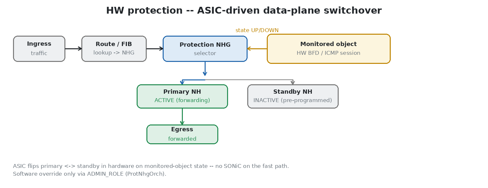
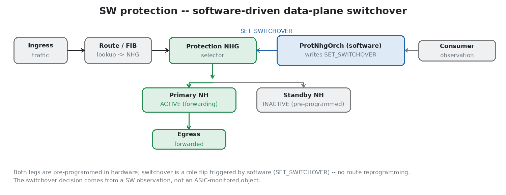
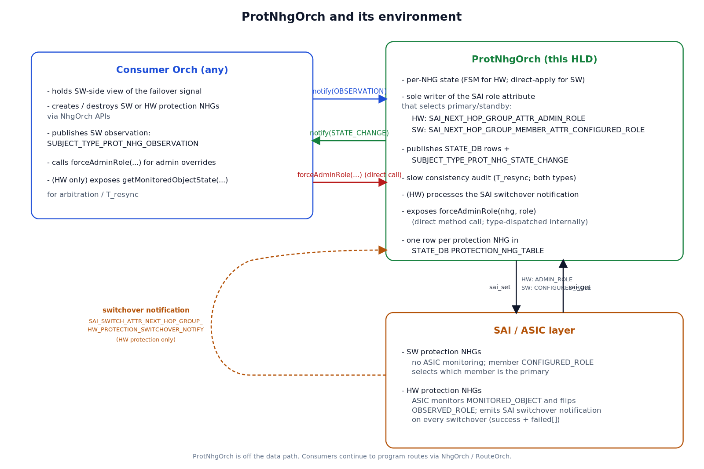
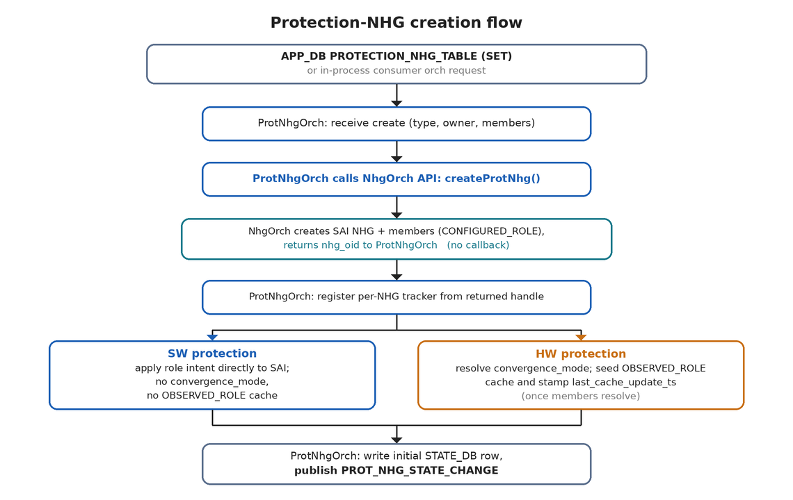
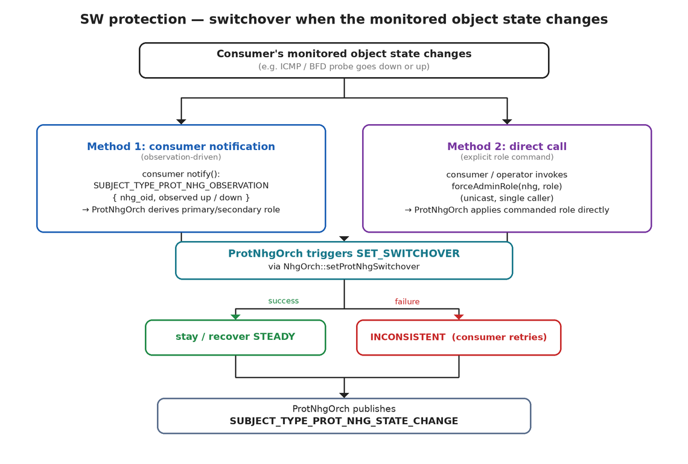
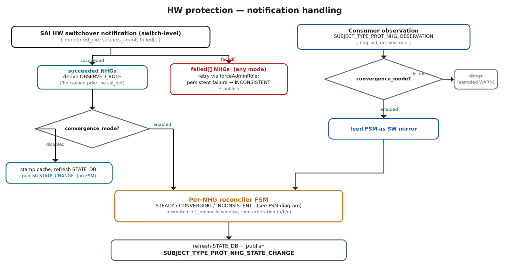
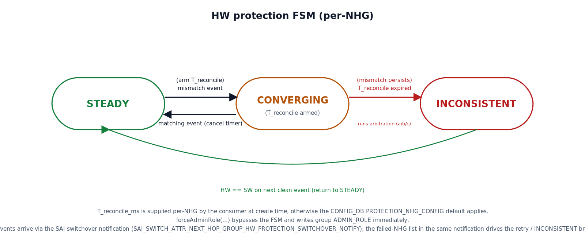

# ProtNhgOrch: Protection Next Hop Group Orchestrator
A protection next hop group (protection NHG) is a SAI object with a primary and a standby nexthop already programmed. On failure, traffic moves by one role change -- no route reprogramming, no extra NHG resolution, no FIB churn. This is the base for fast failover in SONiC (for example, dual-ToR mux switchover, FRR fast reroute, and BFD-driven protection).

ProtNhgOrch owns SAI protection NHGs of both types: `SAI_NEXT_HOP_GROUP_TYPE_PROTECTION` (SW) and `SAI_NEXT_HOP_GROUP_TYPE_HW_PROTECTION` (HW). For software protection, switchover is triggered by setting `SAI_NEXT_HOP_GROUP_ATTR_SET_SWITCHOVER` on the protection group -- `true` moves traffic to the standby, `false` returns it to the primary. For hardware protection, the ASIC initiates switchover on its own based on the monitored object's state; the group's `ADMIN_ROLE` is then used to reconcile the ASIC's decision with the software view of that object. The mechanism maintains eventual consistency between the software and hardware observed roles at minimal cost, taking action only when the two views diverge.

## Table of Contents

<!-- @import "[TOC]" {cmd="toc" depthFrom=1 depthTo=6 orderedList=false} -->

<!-- code_chunk_output -->

- [1. Revision](#1-revision)
- [2. Scope](#2-scope)
- [3. Definitions/Abbreviation](#3-definitionsabbreviation)
- [4. Overview](#4-overview)
  - [4.1 Simple flow](#41-simple-flow)
  - [4.2 SW protection](#42-sw-protection)
  - [4.3 HW protection](#43-hw-protection)
- [5. Requirements](#5-requirements)
  - [5.1 SONiC Requirements](#51-sonic-requirements)
  - [5.2 ASIC Requirements](#52-asic-requirements)
- [6. Protection NHG Architecture](#6-protection-nhg-architecture)
  - [6.1 Data-plane forwarding pipeline](#61-data-plane-forwarding-pipeline)
  - [6.2 Control-plane architecture](#62-control-plane-architecture)
- [7. High-Level Design](#7-high-level-design)
  - [7.1 ProtNhgOrch](#71-protnhgorch)
    - [7.1.1 Interaction with NhgOrch](#711-interaction-with-nhgorch)
      - [7.1.1.1 Protection NHG Model](#7111-protection-nhg-model)
      - [7.1.1.2 Protection NHG Key Format](#7112-protection-nhg-key-format)
      - [7.1.1.3 NhgOrch and ProtNhgOrch Boundary](#7113-nhgorch-and-protnhgorch-boundary)
      - [7.1.1.4 Tunnel Nexthops](#7114-tunnel-nexthops)
    - [7.1.2 Inter-Orch Communication](#712-inter-orch-communication)
    - [7.1.3 SW Protection Handling](#713-sw-protection-handling)
    - [7.1.4 HW Protection Handling](#714-hw-protection-handling)
      - [7.1.4.1 Convergence Mode](#7141-convergence-mode)
      - [7.1.4.2 Per-NHG Reconciler FSM](#7142-per-nhg-reconciler-fsm)
      - [7.1.4.3 Arbitration at Timer Expiry](#7143-arbitration-at-timer-expiry)
      - [7.1.4.4 SAI HW Switchover Notification Handling](#7144-sai-hw-switchover-notification-handling)
      - [7.1.4.5 Slow Consistency Sweep (T_resync)](#7145-slow-consistency-sweep-t_resync)
    - [7.1.5 Signal Debouncing (Out of Scope)](#715-signal-debouncing-out-of-scope)
    - [7.1.6 Performance, Cost, and Tunable Parameters](#716-performance-cost-and-tunable-parameters)
  - [7.2 Future Consumer Patterns](#72-future-consumer-patterns)
- [8. DB Schema Changes](#8-db-schema-changes)
  - [8.1 Config-DB](#81-config-db)
  - [8.2 App-DB](#82-app-db)
  - [8.3 State-DB](#83-state-db)
- [9. Command Line](#9-command-line)
  - [9.1 Show CLI](#91-show-cli)
- [10. Future Enhancements](#10-future-enhancements)
- [11. Limitations](#11-limitations)
- [12. Error Handling and Failure Scenarios](#12-error-handling-and-failure-scenarios)
- [13. Testing](#13-testing)
<!-- /code_chunk_output -->

## 1. Revision
| Rev |     Date    |         Author        |          Change Description      |
|:---:|:-----------:|:---------------------:|:--------------------------------:|
| 1.0 | 05/14/2026  | Manas Kumar Mandal    | Initial Version. |

## 2. Scope
**ProtNhgOrch** owns the lifecycle, reconciliation, and operator-visible state of all SAI protection NHGs. Two SAI types are in scope:

  * `SAI_NEXT_HOP_GROUP_TYPE_PROTECTION` (SW protection): primary/standby NHG; the orchagent (ProtNhgOrch) initiates switchover via `SAI_NEXT_HOP_GROUP_ATTR_SET_SWITCHOVER`.
  * `SAI_NEXT_HOP_GROUP_TYPE_HW_PROTECTION` (HW protection): primary/standby NHG with an ASIC-monitored `MONITORED_OBJECT`; the ASIC flips `OBSERVED_ROLE` and notifies orchagent. Software may override via the group's `ADMIN_ROLE`.

ProtNhgOrch works with all consumers in the same way, but handles SW and HW protection differently: HW uses FSM/arbitration, SW uses direct apply. The first planned consumer is DualToR.

ProtNhgOrch also lets external apps use `APP_DB PROTECTION_NHG_TABLE` (see [Section 8.2](#82-app-db)) to create protection NHGs directly with the key format in [Section 7.1.1.2](#7112-protection-nhg-key-format), without a dedicated consumer orch.

Two optional settings can reduce software work. Both are disabled by default.

  * **Per-consumer `convergence_mode`** (HW protection only). Determines whether ProtNhgOrch reconciles the ASIC's switchover against the software view of the monitored object. With `convergence: enabled` (default), ProtNhgOrch participates in the role decision and reconciles the two views. With `convergence: disabled`, ProtNhgOrch simply observes the switchover notification and publishes the state, without any attempt to reconcile and converge the software and hardware views. Details: [Section 7.1.4.1](#7141-convergence-mode).
  * **Global `t_resync_period_ms`** (HW protection only). Sets a periodic check (default 30 s; [Section 7.1.4.5](#7145-slow-consistency-sweep-t_resync)) that reads the hardware state (`sai_get`) and maintains eventual consistency between the software and hardware state. This is helpful for cases when notifications are lost. Set this field ([Section 8.1](#81-config-db)) to `0` to disable the periodic check and remove the recurring `sai_get` calls. Details: [Section 7.1.4.5](#7145-slow-consistency-sweep-t_resync); limits: [Section 11](#11-limitations).

Both opt-outs can be combined on the same HW-protection NHG. With `convergence: disabled` and `t_resync_period_ms = 0`, ProtNhgOrch performs no reconciliation and no periodic consistency check: the ASIC alone drives failover, there is no automatic recovery from a lost notification, and `forceAdminRole` is the only remaining software override.

## 3. Definitions/Abbreviation
| Term             | Definition |
|:----------------:|:-----------|
| NHG              | Next Hop Group. |
| SAI              | Switch Abstraction Interface. |
| HW               | Hardware (ASIC / SAI layer). |
| SW               | Software (SONiC / orchagent). |
| FRR              | Fast ReRoute. |
| MON_OBJ          | Monitored Object whose state drives a HW switchover (ICMP, BFD, link, etc.). HW protection only. |
| FSM              | Finite State Machine. |
| FDB              | Forwarding Database. |
| ADMIN_ROLE       | `SAI_NEXT_HOP_GROUP_ATTR_ADMIN_ROLE`. SW-writable group attribute that overrides the ASIC's primary/standby selection. HW protection only. ProtNhgOrch is the sole writer. |
| OBSERVED_ROLE    | `SAI_NEXT_HOP_GROUP_MEMBER_ATTR_OBSERVED_ROLE`. ASIC-written member attribute read back by SW to learn which member the ASIC currently selects (`ACTIVE` / `INACTIVE`). HW protection only. |
| CONFIGURED_ROLE  | `SAI_NEXT_HOP_GROUP_MEMBER_ATTR_CONFIGURED_ROLE`. Per-member role (`PRIMARY` / `STANDBY`) used to define primary/standby membership in both protection-NHG types (`SAI_NEXT_HOP_GROUP_TYPE_PROTECTION` and `SAI_NEXT_HOP_GROUP_TYPE_HW_PROTECTION`; set at member create). |
| SET_SWITCHOVER   | `SAI_NEXT_HOP_GROUP_ATTR_SET_SWITCHOVER`. SW trigger for runtime switchover in `SAI_NEXT_HOP_GROUP_TYPE_PROTECTION` (`true` to switch to standby, `false` to clear and return to primary). |
| Convergence      | Agreement between the SW consumer's view of the failover signal and the HW's `OBSERVED_ROLE`. HW protection only. The FSM converges by reconciling the two views before `T_reconcile` expires. |
| Convergence mode | Per-consumer setting (`enabled` default / `disabled`) controlling whether ProtNhgOrch participates in the role decision (`enabled`) or only publishes state (`disabled`). HW protection only. Rationale in [Section 7.1.4.1](#7141-convergence-mode). |
| Arbitration      | SW step that runs when `T_reconcile` expires with mismatch: ProtNhgOrch picks an authority (cached `OBSERVED_ROLE`, fallback SAI re-read, or the SW consumer) and re-asserts its decision via `ADMIN_ROLE`. HW + `convergence: enabled` only. See [Section 7.1.4.3](#7143-arbitration-at-timer-expiry). |
| Dual-master race | The race between two independent authorities for the same role decision -- the ASIC's autonomous switchover and a SW consumer observing the same monitored object. HW protection only. |
| T_reconcile      | Per-NHG short deadline (default 600 ms) that bounds the FSM's `CONVERGING` epoch. HW + `convergence: enabled` only. |
| T_resync         | Global periodic sweep (default 30 s) that re-reads SAI ground truth to catch lost edge events; `0` disables. Both types. |
| Consumer         | An orch or external app that creates protection NHGs and/or publishes failover observations; identified by `consumer_id` (or `owner` for APP_DB injection). ProtNhgOrch consumes this input and owns SAI role writes. |

## 4. Overview
### 4.1 Simple flow

1. A route uses a protection NHG that has two members: a **primary** and a **standby**.
2. In normal state, traffic uses the primary.
3. On failure, the role changes and traffic moves to the standby.
4. For **SW protection**, ProtNhgOrch triggers the switchover in software (`SET_SWITCHOVER`).
5. For **HW protection**, the ASIC switches over first; ProtNhgOrch keeps the software state aligned and intervenes via `ADMIN_ROLE` only when needed.

ProtNhgOrch is the single orchagent component for both types. It is the sole writer of the switchover control (`ADMIN_ROLE` for HW, `SET_SWITCHOVER` for SW) and publishes per-NHG state to `STATE_DB PROTECTION_NHG_TABLE` (and to subscriber orchs via the Observer/Subject `notify()` pattern). Centralizing both paths gives one orchestrator per NHG, one implementation across all consumers, and one STATE_DB surface for troubleshooting.

### 4.2 SW protection

There is no ASIC monitoring and no SAI switchover notification; ProtNhgOrch initiates the switchover and applies the role directly (`SET_SWITCHOVER`). The switchover can be driven by either of two mechanisms (exact mechanics are an implementation detail, not spelt out here):

  1. **Observation-driven.** A consumer registers with ProtNhgOrch and publishes only an observed up/down state for a given protection NHG; ProtNhgOrch derives the role and triggers `SET_SWITCHOVER`. The consumer does not need to program a monitored object: although SAI allows specifying one on a SW protection NHG, it is optional here because SAI does not act on it for this type.
  2. **Explicit role command.** A caller directly commands primary/standby (for example via `APP_DB PROTECTION_NHG_TABLE` or `forceAdminRole`), and ProtNhgOrch applies it without interpreting any observed state.

### 4.3 HW protection

The ASIC monitors a `MONITORED_OBJECT`, flips `OBSERVED_ROLE` on its own, and reports every switchover (success and failure) through the switch-level callback `SAI_SWITCH_ATTR_NEXT_HOP_GROUP_HW_PROTECTION_SWITCHOVER_NOTIFY` (payload `{ monitored_oid, switchover_success_count, failed[] }`). Software can override the ASIC by setting the group's `ADMIN_ROLE`.

This creates a **dual-master race**: the ASIC switches over on its own and sends a notification, while at the same time a software consumer (for example IcmpOrch for ICMP or BfdOrch for BFD) may be watching the same monitored object and reach its own conclusion. Because both can drive the role at once, their decisions can race.

To handle this, ProtNhgOrch owns a per-NHG FSM that arbitrates the HW switchover notification against the consumer's observation, and runs a periodic check (`T_resync`) that re-reads the hardware state and maintains eventual consistency between the software and hardware views (useful when a notification is lost).

## 5. Requirements

### 5.1 SONiC Requirements
**Common:**
- A single component (**ProtNhgOrch**) owns all protection NHGs, SW and HW.
- Consumer-agnostic integration via the SONiC Observer/Subject `notify()` pattern.
- Sole writer of the switchover control (`ADMIN_ROLE` for HW, `SET_SWITCHOVER` for SW). Consumers never write these directly.
- Publish per-NHG state to a single `STATE_DB PROTECTION_NHG_TABLE`.
- Let external apps (e.g., FRR via fpmsyncd) use `APP_DB PROTECTION_NHG_TABLE` to create/delete protection NHGs without a dedicated consumer orch; lifecycle semantics are the same as the NhgOrch-owned path ([Section 8.2](#82-app-db)).
- Provide a CLI to inspect protection NHGs, showing at least each NHG's protection type (SW or HW) and, for HW protection, its convergence mode.
- Query the platform/ASIC for protection NHG support (the SW type `SAI_NEXT_HOP_GROUP_TYPE_PROTECTION` and the HW type `SAI_NEXT_HOP_GROUP_TYPE_HW_PROTECTION`) and publish both to the standard `STATE_DB SWITCH_CAPABILITY|switch` row (fields `SW_NHG_PROTECTION_CAPABLE` and `HW_NHG_PROTECTION_CAPABLE`) so consumers and CLI can discover which protection types are available.
- Account every protection NHG and its members against CRM, consistent with regular next hop groups: increment `CRM_NEXTHOP_GROUP` on group creation and `CRM_NEXTHOP_GROUP_MEMBER` per synced member, and release both on removal. Protection NHGs draw from the same shared NHG/NHG-member resource pool, so capacity is checked before creation.

**SW protection only:**
- Apply each `SUBJECT_TYPE_PROT_NHG_OBSERVATION` by triggering `SET_SWITCHOVER` immediately.
- On SAI write failure: mark `INCONSISTENT` and publish; retry is left to the consumer orch (for example, by re-publishing its observation).

**HW protection only:**
- Per-NHG FSM ([Section 7.1.4.2](#7142-per-nhg-reconciler-fsm)): three-state for `convergence: enabled`; two-state (`STEADY`/`INCONSISTENT`) for `convergence: disabled`.
- Honour a per-consumer `convergence_mode` (`enabled` default, `disabled`); see [Section 7.1.4.1](#7141-convergence-mode) for behaviour deltas.
- Run a periodic consistency sweep (`T_resync`) to maintain eventual consistency between software and hardware. `t_resync_period_ms = 0` disables it; the startup sweep still runs.
- Configurable tunables (`T_reconcile`, `T_resync`, `T_cache_fresh_threshold`) for reconciliation cost and timing; consumers may supply a per-NHG `T_reconcile_ms` at create time, with defaults from CONFIG_DB. Cost rationale and the cache-first read goal are in [Section 7.1.6](#716-performance-cost-and-tunable-parameters).

### 5.2 ASIC Requirements
**SW protection:**
- `SAI_NEXT_HOP_GROUP_TYPE_PROTECTION` with primary/standby members.
- `SAI_NEXT_HOP_GROUP_MEMBER_ATTR_CONFIGURED_ROLE` (`PRIMARY` / `STANDBY`) -- per-member role used to define primary/standby membership.
- `SAI_NEXT_HOP_GROUP_ATTR_SET_SWITCHOVER` -- control-plane trigger to switch over in `SAI_NEXT_HOP_GROUP_TYPE_PROTECTION`.

**HW protection:**
- `SAI_NEXT_HOP_GROUP_TYPE_HW_PROTECTION` with primary/standby members.
- `SAI_NEXT_HOP_GROUP_MEMBER_ATTR_CONFIGURED_ROLE` (`PRIMARY` / `STANDBY`) -- per-member role used to define primary/standby membership.
- `SAI_NEXT_HOP_GROUP_ATTR_ADMIN_ROLE` (`PRIMARY` / `STANDBY` / unset) -- the software-writable group-level override.
- `SAI_NEXT_HOP_GROUP_MEMBER_ATTR_OBSERVED_ROLE` and `SAI_NEXT_HOP_GROUP_MEMBER_ATTR_MONITORED_OBJECT`.
- Switch-level switchover notification (`SAI_SWITCH_ATTR_NEXT_HOP_GROUP_HW_PROTECTION_SWITCHOVER_NOTIFY`): per monitored object, fires on every switchover, payload `{ monitored_oid, switchover_success_count, failed[] }`. Success drives the FSM; failure drives the retry/`INCONSISTENT` branch; no separate bulk-error channel.

The two type requirements are independent; an ASIC may support either, both, or neither. Future: per-NHG switchover counters scoped to `SAI_NEXT_HOP_GROUP_TYPE_HW_PROTECTION` (see [Section 10](#10-future-enhancements)).

## 6. Protection NHG Architecture

### 6.1 Data-plane forwarding pipeline
A protection NHG pre-programs **both** the primary and the standby leg in hardware, so failover is a single role change in the data plane -- no route reprogramming, no NHG re-resolution, no FIB churn. The two protection types share this fast path and differ only in **what drives the switchover decision**.

**HW protection.** The ASIC tracks the primary member's `MONITORED_OBJECT` and toggles forwarding between the primary and the standby entirely in hardware when that object's state changes; SONiC is not on the fast path. Software can override the ASIC's selection via the group's `ADMIN_ROLE`.



**SW protection.** Both legs are still pre-programmed in hardware, but the active leg is selected by software: ProtNhgOrch writes `SET_SWITCHOVER` on the group (`true` -> standby, `false` -> primary) in response to a consumer's observation of the monitored state. There is no ASIC-monitored object on the fast path; only the decision source differs from HW protection.



### 6.2 Control-plane architecture
ProtNhgOrch sits between SAI and consumer orchs. It is the only component that writes the SAI switchover control (`ADMIN_ROLE` for HW, `SET_SWITCHOVER` for SW), and the only component that consumes the SAI switchover notification.

Consumers integrate via three things (full detail in [Section 7.1.2](#712-inter-orch-communication)):

  * **Inbound notification `SUBJECT_TYPE_PROT_NHG_OBSERVATION`** -- consumer publishes its SW-side view of the monitored object's state (for example IcmpOrch's ICMP echo state, BfdOrch's BFD session state).
  * **Outbound notification `SUBJECT_TYPE_PROT_NHG_STATE_CHANGE`** -- ProtNhgOrch publishes the resolved per-NHG state on every FSM transition; subscribers receive it through the Observer/Subject `notify()` path ([Section 7.1.2](#712-inter-orch-communication)).
  * **Direct method call `forceAdminRole(nhg, role)`** -- consumer invokes this for admin overrides; bypasses the FSM.



ProtNhgOrch is not in the data path. Consumers still create protection NHGs and program routes through existing NhgOrch/RouteOrch paths. ProtNhgOrch only handles switchover control (`ADMIN_ROLE` for HW, `SET_SWITCHOVER` for SW), per-NHG state publication, and (for HW protection) reconciliation.

## 7. High-Level Design

### 7.1 ProtNhgOrch

ProtNhgOrch's responsibilities are the SONiC requirements in [Section 5.1](#51-sonic-requirements). This section starts with the shared foundation -- how protection NHGs are created and modelled ([Section 7.1.1](#711-interaction-with-nhgorch)) and how ProtNhgOrch communicates with consumer orchs ([Section 7.1.2](#712-inter-orch-communication)) -- and then covers the two type-specific handling paths: SW protection applies role intent directly ([Section 7.1.3](#713-sw-protection-handling)); HW protection adds reconciliation against the ASIC ([Section 7.1.4](#714-hw-protection-handling)). Signal debouncing ([Section 7.1.5](#715-signal-debouncing-out-of-scope)) and performance/tunables ([Section 7.1.6](#716-performance-cost-and-tunable-parameters)) close the section.

#### 7.1.1 Interaction with NhgOrch
NhgOrch is the SAI-side lifecycle owner for all NHGs including protection NHGs of both types. ProtNhgOrch issues all primary/standby flips via NhgOrch's APIs; NhgOrch remains consumer- and type-agnostic.

ProtNhgOrch drives all protection-NHG operations -- create/remove, role control, observed-role read-back, and ownership reference counting -- through NhgOrch's exposed protection-NHG APIs. Because ProtNhgOrch issues the create itself, it holds the returned NHG handle directly and registers the per-NHG tracker and `T_resync` participant inline -- there is no create/delete callback from NhgOrch.

Creation requests reach ProtNhgOrch from two sources, each carrying the SAI type and an owner identifier:

  * **`APP_DB PROTECTION_NHG_TABLE`** ([Section 8.2](#82-app-db)) -- ProtNhgOrch subscribes to this table; apps without a dedicated orch (FRR via fpmsyncd, configd, etc.) create or delete protection NHGs by writing the canonical key.
  * **In-process consumer orchs** (e.g., MuxOrch) -- request creation through a direct ProtNhgOrch call.

For each source, ProtNhgOrch maintains a `consumer_id -> { convergence_mode }` registry keyed by the owner identifier:

  * **Consumer orchs** declare `convergence_mode` once when they first register with ProtNhgOrch (default `enabled`).
  * **APP_DB injection** (see [Section 8.2](#82-app-db)): the owner comes from the row's `owner` field; `convergence_mode` is looked up in the optional `PROTECTION_NHG_OWNER_CONFIG|<owner>` row ([Section 8.1](#81-config-db)). Missing entry -> `enabled`.

The selected mode is stored on the per-NHG tracker at create time and is **fixed for the life of the NHG**. SW-protection NHGs ignore the mode. To change the mode, DEL + SET under the same key.

The end-to-end creation flow, from an APP_DB write (or in-process consumer request) through ProtNhgOrch and NhgOrch's exposed APIs, is:



NhgOrch owns the SAI object lifecycle ([Section 7.1.1.3](#7113-nhgorch-and-protnhgorch-boundary)); ProtNhgOrch drives create/remove through NhgOrch's exposed APIs and attaches its per-NHG tracking and initial state from the handle the create call returns. There is no asynchronous create/delete callback from NhgOrch.

##### 7.1.1.1 Protection NHG Model
A protection NHG is modelled as exactly two members: one **primary** and one **standby**. This matches the SAI protection-group model, which defines the group as a primary-backup **pair** (the SAI FRR proposal expects no more than two next hops in a protection group). The NHG itself carries an immutable **SAI type** -- HW protection or SW protection -- chosen at create time. Each member carries:

  * its role (primary / standby),
  * an optional `MONITORED_OBJECT` reference (HW protection only),
  * a read-back `OBSERVED_ROLE` (HW protection only).

A member is either an **individual nexthop** (e.g. a neighbor on a directly connected interface) or a **recursive NHG** (an existing ECMP set). Both forms are first-class; ProtNhgOrch and STATE_DB treat them uniformly.

Because the group is a strict pair, an N:M relationship (multiple primary paths protected by multiple standby paths) is expressed by making each member a **recursive ECMP NHG** -- the primary member points to the N-path NHG and the standby member to the M-path NHG. The inner NHG can be a plain ECMP group or a fine-grained NHG (consistent hashing), at the consumer's choice. How the members of such an inner ECMP NHG are created, populated, and maintained is owned by NhgOrch and the consumer that programs it; it is out of scope of ProtNhgOrch, which only references the inner NHG as an opaque member. Native multi-primary membership within a single protection group would require a SAI extension and is deferred to future work ([Section 10.2](#102-multi-tier-protection-nhgs)).

NH resolution is deferred: if a member's underlying nexthop is not yet resolved at create time, the protection NHG is created and the member is filled in once resolution arrives (the same pattern NhgOrch already uses for regular NHGs).

##### 7.1.1.2 Protection NHG Key Format
This HLD specifies the canonical string used to name a protection NHG. The same key identifies the NHG in `STATE_DB PROTECTION_NHG_TABLE`, in NhgOrch's lookup index, and on the operator-facing CLI ([Section 9.1](#91-show-cli)).

```
prot:<type>:<primary_members>|<standby_members>

where:
  <type>              = "hw"   for SAI_NEXT_HOP_GROUP_TYPE_HW_PROTECTION
                      = "sw"   for SAI_NEXT_HOP_GROUP_TYPE_PROTECTION
  <primary_members>   = comma-separated list of nexthop identifiers
                        (or, for a recursive member, the comma-separated
                         members of the primary ECMP set)
  <standby_members> = same encoding as <primary_members>
```

Nexthop identifiers use the standard `<ip>@<iface>` form, or `tunnel:<tunnel_name>@<endpoint_ip>` for tunnel NHs ([Section 7.1.1.4](#7114-tunnel-nexthops)). The `tunnel:` form is encapsulation-agnostic.

Three properties this format provides by construction:

  * **Deterministic** -- same membership and same type always produce the same key.
  * **Type-discriminated** -- same membership with different types produces distinct keys, so SW- and HW-protection variants of "the same" NHG can coexist.
  * **Idempotent create** -- re-creating with an existing key is a no-op.

Examples:

  * HW protection, individual-NH primary, tunnel standby (dual-ToR pattern):

    ```
    prot:hw:10.0.0.1@Ethernet0,10.0.0.2@Ethernet4|tunnel:MuxTunnel0@10.1.0.32
    ```

  * SW protection, recursive ECMP members on both legs:

    ```
    prot:sw:10.0.0.1@Ethernet0,10.0.0.2@Ethernet4|10.0.0.3@Ethernet8,10.0.0.4@Ethernet12
    ```

##### 7.1.1.3 NhgOrch and ProtNhgOrch Boundary
NhgOrch and ProtNhgOrch share ownership of a protection NHG along a clear boundary. The precise call surface is an implementation concern; the design boundary is:

  * **Lifecycle and SAI ownership: NhgOrch.** The SAI object creation, removal, member resolution, refcount tracking, and the usual validation (capacity, duplicates, deferred resolution) live in NhgOrch and are invoked through its exposed protection-NHG APIs. ProtNhgOrch is the caller of those APIs for both creation sources -- the `APP_DB PROTECTION_NHG_TABLE` it subscribes to ([Section 8.2](#82-app-db)) and in-process consumer orchs. NhgOrch never calls back into ProtNhgOrch.
  * **Role control: ProtNhgOrch.** ProtNhgOrch is the sole writer of the switchover control -- `SAI_NEXT_HOP_GROUP_ATTR_ADMIN_ROLE` for HW protection, `SAI_NEXT_HOP_GROUP_ATTR_SET_SWITCHOVER` for SW protection. The same write path serves SW direct-apply ([Section 7.1.3](#713-sw-protection-handling)), `forceAdminRole(...)` overrides, and `T_resync` re-writes ([Section 7.1.4.5](#7145-slow-consistency-sweep-t_resync)).
  * **HW state read-back: ProtNhgOrch, off the hot path.** Reads of `OBSERVED_ROLE` (per member) and `ADMIN_ROLE` (group) happen only on arbitration and `T_resync`. See the `sai_get` cost note in [Section 7.1.6](#716-performance-cost-and-tunable-parameters).
  * **`MONITORED_OBJECT` lifecycle: consumer.** Consumers attach and replace the monitored object on the primary member as their probe session changes. ProtNhgOrch never creates or destroys monitored objects.

##### 7.1.1.4 Tunnel Nexthops
Protection NHGs must be able to use a tunnel as one of their members, independent of the underlying encapsulation. Three design points support this generically:

  * **Identifier.** The nexthop identifier uses an encapsulation-agnostic form, `tunnel:<tunnel_name>@<endpoint_ip>`, with the same equality / hashing semantics as a regular nexthop identifier. The tunnel type is not part of the identifier; it is a property of the tunnel object owned by its tunnel orch.
  * **Resolution.** The tunnel type's owning subsystem registers / deregisters tunnel NHs with NeighOrch so they resolve through the same path as other nexthops. ProtNhgOrch does not care which subsystem registered the NH, only that the NH is resolvable.
  * **Consumer responsibility.** Consumers using a tunnel NH as a member must ensure the tunnel object and its NH registration exist before the NHG is created; otherwise the member stays unresolved and is filled in when registration eventually arrives.

Adding a new tunnel encapsulation is an extension on the corresponding tunnel orch and does not require any change in ProtNhgOrch or the protection-NHG key format.

#### 7.1.2 Inter-Orch Communication
ProtNhgOrch follows standard orchagent convention: state changes use `Observer`/`Subject` `notify()`, and commands use direct method calls.

  * **`SUBJECT_TYPE_PROT_NHG_OBSERVATION`** (new) -- *consumer -> ProtNhgOrch*. Payload `{ nhg_oid, derived_role }`. Consumer's SW-side view of whatever drives the failover (monitored object for HW, consumer's own state for SW). ProtNhgOrch `attach()`es to consumers emitting this subject. HW + `convergence: enabled` feeds it to the FSM; SW triggers direct apply. Consumers never write the SAI role attribute directly. **Observations targeting a `convergence: disabled` NHG are dropped with a sampled WARN** (rate-limited, e.g., once/minute/consumer).
  * **`SUBJECT_TYPE_PROT_NHG_STATE_CHANGE`** (new) -- *ProtNhgOrch -> consumers*. Payload `{ nhg_oid, nhg_type, fsm_state, observed_role, admin_role, configured_primary, inconsistent, monitored_object_state }`. HW-only fields are `n/a` for SW rows; `configured_primary` is populated for both types. Published on every state transition.
  * **`forceAdminRole(nhg, role)`** -- direct method (not a `notify()` broadcast: unicast command with one caller, consistent with other orchagent direct-call patterns). SW-driven override. HW: bypasses FSM, writes group `ADMIN_ROLE` immediately. SW: writes group `SET_SWITCHOVER` immediately (same path as a consumer observation, with override semantics in the published state).

**HW protection only:**

  * **`getMonitoredObjectState(mon_oid)`** -- direct method on the consumer, called by ProtNhgOrch during arbitration and `T_resync` (not on the hot path). Implementations should read from an existing consumer cache. Not called for `convergence: disabled` NHGs (see [Section 7.1.4.5](#7145-slow-consistency-sweep-t_resync)).

#### 7.1.3 SW Protection Handling
*`SAI_NEXT_HOP_GROUP_TYPE_PROTECTION`.* There is no ASIC monitoring and no second decision-maker: the consumer observation (or an explicit role command) is the only source of intent, and ProtNhgOrch applies it directly. No reconciliation is involved.

When a consumer's monitored object state changes, the new intent reaches ProtNhgOrch by one of two methods. Both converge on the same `SET_SWITCHOVER` write:



Method 1 lets ProtNhgOrch derive the role from an observed up/down signal; Method 2 commands the role outright without interpreting any observed state. On a simultaneous observation and `forceAdminRole` for the same NHG, `forceAdminRole` wins.

**Direct apply.** The SAI write is a group-level `SET_SWITCHOVER` trigger routed through NhgOrch (see [Section 7.1.1.3](#7113-nhgorch-and-protnhgorch-boundary)). Two states:

  * `STEADY` -- last observation applied successfully (`SET_SWITCHOVER` matches cached intent).
  * `INCONSISTENT` -- last SAI write failed.

Transitions:

  * `SUBJECT_TYPE_PROT_NHG_OBSERVATION` -> trigger `SET_SWITCHOVER` via NhgOrch. Success: stay `STEADY` (or recover `INCONSISTENT -> STEADY`). Failure: -> `INCONSISTENT` and publish; retry is left to the consumer orch (for example, by re-publishing its observation).
  * `forceAdminRole(nhg, role)` -> same `SET_SWITCHOVER` path, with override semantics in the published state. (The name is orchestrator-level; the SAI attribute written is `SET_SWITCHOVER`.)

All other (common) responsibilities from [Section 5.1](#51-sonic-requirements) apply.

#### 7.1.4 HW Protection Handling
*`SAI_NEXT_HOP_GROUP_TYPE_HW_PROTECTION`.* The ASIC monitors a `MONITORED_OBJECT` and flips `OBSERVED_ROLE` autonomously, delivering every switchover via a switch-level notification ([Section 7.1.4.4](#7144-sai-hw-switchover-notification-handling)). Because the ASIC and a SW consumer can each reach a role decision for the same monitored object, HW protection may need reconciliation; `convergence_mode` ([Section 7.1.4.1](#7141-convergence-mode)) selects whether ProtNhgOrch participates. When it does, reconciliation runs through a per-NHG FSM ([Section 7.1.4.2](#7142-per-nhg-reconciler-fsm)) bounded by a single shared reconcile timer (one timer for all NHGs, not one per NHG; scale design in [Section 7.1.6](#716-performance-cost-and-tunable-parameters)).

ProtNhgOrch handles two notification inputs -- the SAI HW switchover notification and the consumer observation. `convergence_mode` gates how each is processed: when enabled, both feed the per-NHG reconciler FSM; when disabled, the HW switchover notification updates cache/STATE_DB directly and the consumer observation is dropped. The failed list in the switchover notification is always retried, regardless of mode.



##### 7.1.4.1 Convergence Mode
HW protection has two sources of truth for the role choice:

  * the ASIC (`OBSERVED_ROLE` derived from the `MONITORED_OBJECT`), and
  * the SW consumer (the same signal, a different view).

If they disagree (latency, stale state, lost notification), SW arbitration resolves it via `ADMIN_ROLE`. This is the default, `convergence: enabled`. If the probe is fully HW-offloaded (HW BFD/ICMP), SW usually has no newer signal, so arbitration is extra cost (latency plus extra checks); `convergence: disabled` is the opt-out, where ProtNhgOrch only observes the switchover notification and publishes state.

Scope: per-consumer (per-owner for APP_DB injection), copied to the NHG at create time, and **fixed for the NHG lifetime** (a change requires DEL + SET). SW protection ignores this setting. Recovery bounds are in [Section 11](#11-limitations).

##### 7.1.4.2 Per-NHG Reconciler FSM
**`convergence: enabled` (default).** Three-state FSM, one instance per NHG:

  * `STEADY` -- consumer observation == HW `observed_role`; no reconcile deadline pending.
  * `CONVERGING` -- mismatch detected; a reconcile deadline is pending in the shared timer's heap.
  * `INCONSISTENT` -- reconcile deadline expired with mismatch; arbitration has run.

Transitions:

  * `STEADY -> CONVERGING`: mismatching event arrives (consumer `SUBJECT_TYPE_PROT_NHG_OBSERVATION` or SAI HW switchover); schedule a reconcile deadline at `now + T_reconcile_ms`.
  * `CONVERGING -> STEADY`: matching counterpart arrives before the deadline; cancel the deadline.
  * `CONVERGING -> INCONSISTENT`: reconcile deadline expires with mismatch; run arbitration ([Section 7.1.4.3](#7143-arbitration-at-timer-expiry)).
  * `INCONSISTENT -> STEADY`: any later event with HW and SW agreeing.

Authority by trigger:

  * `forceAdminRole(nhg, role)` -- SW-driven. Immediate group `ADMIN_ROLE` write, bypasses FSM.
  * `SUBJECT_TYPE_PROT_NHG_OBSERVATION` -- HW-driven. Used as a mirror to drive the reconciler; never forces `ADMIN_ROLE` on its own.
  * SAI HW switchover -- HW-driven. Reflected into internal state and `PROTECTION_NHG_TABLE`; the failed-NHG list drives the retry/`INCONSISTENT` branch in the same handler.



**`convergence: disabled`.** Two-state FSM, the same shape as SW direct-apply but driven by HW switchover notifications instead of consumer observations:

  * `STEADY` -- last switchover success was applied to the cache and STATE_DB; nothing pending.
  * `INCONSISTENT` -- the failure-list retry via `forceAdminRole` failed; alarm raised.

Transitions:

  * SAI HW switchover, success: stamp cache, refresh `STATE_DB`, publish `SUBJECT_TYPE_PROT_NHG_STATE_CHANGE`. Stay `STEADY` (or recover `INCONSISTENT -> STEADY`).
  * SAI HW switchover, failure: retry via `forceAdminRole`; on persistent failure go to `INCONSISTENT` and publish.
  * `forceAdminRole(nhg, role)`: immediate group `ADMIN_ROLE` write; same semantics as the convergence-enabled case.
  * `SUBJECT_TYPE_PROT_NHG_OBSERVATION`: dropped with sampled WARN. The consumer should not publish observations for a `convergence: disabled` NHG.

No `CONVERGING` state, no `T_reconcile`, no arbitration, no entry in the shared timer's heap. Cache-first reads ([Section 7.1.6](#716-performance-cost-and-tunable-parameters)) do not apply here -- there is nothing to reconcile. `T_resync` ([Section 7.1.4.5](#7145-slow-consistency-sweep-t_resync)), when enabled, is still the lost-notification safety net.

##### 7.1.4.3 Arbitration at Timer Expiry
*`convergence: enabled` only.* When the shared reconcile timer fires, ProtNhgOrch runs arbitration for each expired NHG (rare path). For each NHG it gets `OBSERVED_ROLE` through the **cache-first path** ([Section 7.1.6](#716-performance-cost-and-tunable-parameters)) and reads consumer state via `getMonitoredObjectState(mon_oid)` ([Section 7.1.2](#712-inter-orch-communication)). Three cases:

  * (a) MON_OBJ agrees with HW -> trust HW; refresh STATE_DB; log INFO (consumer SW lag).
  * (b) MON_OBJ agrees with consumer -> trust SW; force `ADMIN_ROLE`; log WARN (HW stuck or notification lost).
  * (c) MON_OBJ unavailable -> trust SW; force `ADMIN_ROLE`; log WARN; mark `INCONSISTENT`.

In all cases, publish `SUBJECT_TYPE_PROT_NHG_STATE_CHANGE` and rewrite `PROTECTION_NHG_TABLE` with the new state, arbitration case (`a`/`b`/`c`), the source of `OBSERVED_ROLE` (`cache` / `sai_get`), and timestamp.

##### 7.1.4.4 SAI HW Switchover Notification Handling
ProtNhgOrch registers the switch-level callback `SAI_SWITCH_ATTR_NEXT_HOP_GROUP_HW_PROTECTION_SWITCHOVER_NOTIFY` at startup (subscription is switch-level, not per-NHG). Each notification is per monitored object; success and failure share the **same** notification. Payload: `{ monitored_oid, switchover_success_count, failed[] }`.

  * For each **succeeded** NHG (affected minus failed): the new `observed_role` is **derived from the notification itself** -- a switchover flips the cached prior `observed_role` on each member (primary `ACTIVE -> INACTIVE`, standby `INACTIVE -> ACTIVE`). No `sai_get` on this hot path -- the cached prior is set by the previous switchover, the last `T_resync` tick, or the startup sweep. Rare drift is caught by `T_resync` ([Section 7.1.4.5](#7145-slow-consistency-sweep-t_resync)) when enabled. Dispatch by mode:
      - `convergence: enabled` -- feed the FSM as an HW-side transition; STATE_DB and `SUBJECT_TYPE_PROT_NHG_STATE_CHANGE` update as part of the transition.
      - `convergence: disabled` -- stamp the cache, refresh STATE_DB (`observed_role`, `last_cache_update_ts`), publish `SUBJECT_TYPE_PROT_NHG_STATE_CHANGE`. No FSM, no arbitration.
  * For each NHG in the **failed** list (regardless of `convergence_mode`): retry via `forceAdminRole`, sharing code with `admin_*` events to keep the recovery path narrow. On persistent failure, mark `inconsistent` and publish `SUBJECT_TYPE_PROT_NHG_STATE_CHANGE` ([Section 12](#12-error-handling-and-failure-scenarios)).

Success and failure sharing one notification removes the need for a separate bulk-error channel.

##### 7.1.4.5 Slow Consistency Sweep (T_resync)
*HW protection only.* This is the safety net for lost edge events (queue congestion, error paths, restart-time drops, SAI driver bugs). One timer (default 30 s; [Section 8.1](#81-config-db)) checks all HW protection NHGs each tick. This is the only periodic place ProtNhgOrch may issue `sai_get`, and cache freshness still gates it:

  * **`convergence: enabled`:** for each NHG, get `OBSERVED_ROLE` cache-first ([Section 7.1.6](#716-performance-cost-and-tunable-parameters)) -- use the cache when recent, otherwise issue a single bulk SAI read for the stale NHGs. Then call `getMonitoredObjectState(mon_oid)` (cheap; reads the consumer's cache, no SAI call) and feed any divergence into the FSM as a missed edge event.
  * **`convergence: disabled`:** same cache-first refresh, but `getMonitoredObjectState` is not called (the consumer is not a participant) and divergence is not fed to any FSM. If the refreshed cache disagrees with the last `ADMIN_ROLE` value ProtNhgOrch wrote via `forceAdminRole`, the sweep re-asserts intent with a corrective `ADMIN_ROLE` write. Divergence with no `forceAdminRole` intent in effect is logged INFO; the ASIC's autonomous decision is left in place.

**Disabling the periodic sweep (`t_resync_period_ms = 0`).** Setting the CONFIG_DB field ([Section 8.1](#81-config-db)) to `0` disables periodic sweep. The timer is not armed and recurring `sai_get` calls stop. Lost edge events are not auto-recovered; operator recovery uses `forceAdminRole`, and `inconsistent` is the alarm. Mid-life changes (either direction) apply on the next CONFIG_DB read.

The **startup sweep** always runs, regardless of `t_resync_period_ms`, reading SAI unconditionally so every NHG begins consistent with SAI. It seeds the `OBSERVED_ROLE` cache on every HW NHG -- HW protection needs the cache seeded because the switchover-notify handler ([Section 7.1.4.4](#7144-sai-hw-switchover-notification-handling)) derives new `OBSERVED_ROLE` by flipping the cached prior.

#### 7.1.5 Signal Debouncing (Out of Scope)
*Both types.* Debouncing transient flaps (ICMP loss bursts, BFD flap suppression, link holddown, etc.) belongs to the **monitored object** owner: IcmpOrch for ICMP, BfdOrch for BFD, PortsOrch for link state, and so on. ProtNhgOrch consumes only the **already-debounced** signal as `SUBJECT_TYPE_PROT_NHG_OBSERVATION` (and, for HW protection, the HW switchover notification).

`T_reconcile` in the HW FSM ([Section 7.1.4.2](#7142-per-nhg-reconciler-fsm)) is **not** a debounce of the underlying signal; it is a short window to let the two independent inputs (HW notify and SW observation) for the *same* edge converge before arbitration.

Tuning, hysteresis, and probe parameters of the monitored object are out of scope of this HLD; each monitored-object owner publishes its own tuning surface.

#### 7.1.6 Performance, Cost, and Tunable Parameters
*HW protection only (except where noted).* Reconciliation is not free: it needs a per-NHG deadline timer and, in the worst case, SAI reads (`sai_get`). ProtNhgOrch is designed so that this cost stays constant with NHG count and avoids SAI reads on the hot path. This section collects the scale mechanism, the `sai_get` cost goal, the cache-first read goal, and the tunable parameters. The core sections ([7.1.4.2](#7142-per-nhg-reconciler-fsm), [7.1.4.3](#7143-arbitration-at-timer-expiry), [7.1.4.5](#7145-slow-consistency-sweep-t_resync)) refer here for these details. These are implementation/optimization concerns and do not change the externally observable behaviour.

##### Tunable parameters
| Parameter (CONFIG_DB) | Default | Scope | Purpose |
|:----------------------|:--------|:------|:--------|
| `t_reconcile_default_ms` | 600 ms | per-NHG (overridable at create) | Bounds the `CONVERGING` epoch before arbitration runs. |
| `t_resync_period_ms` | 30 s | global | Period of the slow consistency sweep ([Section 7.1.4.5](#7145-slow-consistency-sweep-t_resync)); `0` disables it. |
| `t_cache_fresh_threshold_ms` | 1200 ms (= 2 × `t_reconcile_default_ms`) | global | How long a cached `OBSERVED_ROLE` is trusted before a `sai_get` fallback. |

Per-NHG `T_reconcile` overrides are passed by the consumer at NHG creation, not stored in CONFIG_DB. `t_cache_fresh_threshold_ms` is global and bounds the cache-first recency window (see "Cache-first reads" below).

##### Shared reconcile timer (scale)
The reconcile FSM ([Section 7.1.4.2](#7142-per-nhg-reconciler-fsm)) needs a per-NHG deadline to bound `CONVERGING -> {STEADY, INCONSISTENT}`. ProtNhgOrch may track hundreds or thousands of HW NHGs on a dual-ToR, so **scale efficiency is the main design goal**:

  * **O(1) kernel resources.** One timer per NHG would consume resources linearly with NHG count and add arm/teardown churn on every create/remove. Cost must not grow with NHG count.
  * **Zero idle cost.** No kernel wakeups when no NHG is `CONVERGING`.
  * **Coalesced expiry.** A burst of N simultaneous expirations produces **one** event-loop wakeup, not N (so a notify storm or restart-time replay does not multiply into N independent fires).
  * **Heterogeneous deadlines.** Different NHGs may have different `T_reconcile_ms` values (per-NHG override at create time; [Section 8.1](#81-config-db)); the mechanism must handle this without re-sorting on every event.
  * **Orchagent convention.** Orchs that track many entities use one timer per orch over the collection, not one per entity (`CrmOrch`, `PfcWdSwOrch`, `PortsOrch`, `FdbOrch`).

ProtNhgOrch uses one shared reconcile timer plus a per-NHG deadline queue. `STEADY -> CONVERGING` adds a deadline and re-arms the timer to the earliest one; `CONVERGING -> STEADY` removes the deadline and only re-arms if the earliest deadline changed; a timer fire processes all expired deadlines and runs arbitration ([Section 7.1.4.3](#7143-arbitration-at-timer-expiry)) in one callback. Cost stays constant regardless of NHG count.

##### sai_get cost (design goal)
`sai_get` is blocking and expensive at scale (per-call latency plus SAI-session contention with route programming). The design goal is to keep `sai_get` off the hot path entirely: switchover notifications, consumer observations, and `forceAdminRole` must be served from cached state and the notification payload, never a SAI read. SAI reads are confined to the cache-first arbitration / `T_resync` paths (only on a stale cache) and the startup sweep. Cache-first reads (below) keep those paths off SAI in the common case.

##### Cache-first reads (design goal)
*`convergence: enabled` only.* Arbitration and `T_resync` both need `OBSERVED_ROLE` to decide whether to write `ADMIN_ROLE`, and reading SAI on every decision is too expensive when arbitration is frequent. The design goal is cache-first: trust the cached `OBSERVED_ROLE` while it is recent and fall back to a single bulk SAI read only when it may be stale, with the recency window bounded by `t_cache_fresh_threshold_ms`. A dropped switchover notification self-heals -- the cache ages out and the next arbitration refreshes from SAI. `convergence: disabled` NHGs do not participate. The exact ledger, threshold bounds, and clamping are implementation details; operator-visible cache state is surfaced in STATE_DB ([Section 8.3](#83-state-db)).

### 7.2 Future Consumer Patterns
Consumers pick SW or HW protection by platform and latency needs, and may opt out of SW arbitration via `convergence: disabled`:

  * **HW BFD-driven, arbitrated** (`HW_PROTECTION`, `convergence: enabled`): monitored object is an offloaded BFD session; `BfdOrch::getSessionState` is the `getMonitoredObjectState`. The FSM resolves the race.
  * **HW-autonomous** (`HW_PROTECTION`, `convergence: disabled`): trust the ASIC entirely. No SW observation, no `getMonitoredObjectState`. Switchover latency = ASIC reaction. Suitable when the probe is fully offloaded (HW BFD/ICMP) and SW cannot add anything useful. Recovery from a lost switchover relies on `T_resync` -- or, with `t_resync_period_ms = 0`, on operator `forceAdminRole`.
  * **SW BFD-driven** (`PROTECTION`): no HW offload; BfdOrch transitions publish observations and ProtNhgOrch triggers `SET_SWITCHOVER` directly. Switchover latency = BfdOrch detection + one SAI write.
  * **Link-monitored** (`HW_PROTECTION` if available): port-op state from PortsOrch.
  * **Peer-reachability for VPN/SRv6** (`PROTECTION`): SW reachability state machine drives the direct-apply path.
  * **Static-route admin-controlled** (`PROTECTION`): role switched via `forceAdminRole(...)` on operator config only.

Consumer code stays small -- publish/subscribe plus one getter for arbitrated HW consumers, even less for HW-autonomous. Per-NHG state management comes for free.

## 8. DB Schema Changes

### 8.1 Config-DB
Optional `PROTECTION_NHG_CONFIG` global table for tunables (defaults shipped):

```
PROTECTION_NHG_CONFIG|global
  t_reconcile_default_ms      : integer    default 600     # used when no per-NHG override is supplied
  t_resync_period_ms          : integer    default 30000   # slow consistency sweep period.
                                                           # 0 disables the periodic sweep (timer not armed);
                                                           # the startup sweep still runs.
                                                           # Negative values are rejected at startup with WARN
                                                           # and fall back to the default 30000.
  t_cache_fresh_threshold_ms  : integer    default 1200    # = 2 * t_reconcile_default_ms. Arbitration (Section 7.1.4.3)
                                                           # and T_resync (Section 7.1.4.5) trust the cached OBSERVED_ROLE
                                                           # within this window; older entries refresh from SAI
                                                           # (see Section 7.1.6).
```

Per-NHG `T_reconcile` overrides are passed by the consumer at NHG creation, not stored in CONFIG_DB. `t_cache_fresh_threshold_ms` is global; the effective per-NHG threshold is derived from it and the NHG's `T_reconcile_ms` per [Section 7.1.6](#716-performance-cost-and-tunable-parameters).

Optional `PROTECTION_NHG_OWNER_CONFIG` per-owner table -- used when an APP_DB writer needs to declare `convergence_mode`. (Consumer orchs declare directly at registration; see [Section 7.1.1](#711-interaction-with-nhgorch).)

```
PROTECTION_NHG_OWNER_CONFIG|<owner>
  convergence_mode : enabled | disabled    default enabled
```

`<owner>` matches the `owner` field on the matching `APP_DB PROTECTION_NHG_TABLE` row ([Section 8.2](#82-app-db)). Missing entry means `enabled` (the default for the new field). The mode is read at NHG create time and is fixed for the life of the NHG -- to change it, DEL + SET the APP_DB row. SW protection ignores this field.

### 8.2 App-DB
ProtNhgOrch subscribes to `APP_DB PROTECTION_NHG_TABLE` so external apps can create protection NHGs without a dedicated consumer orch. On each SET/DEL, ProtNhgOrch drives the SAI lifecycle through NhgOrch's exposed protection-NHG APIs (see [Section 7.1.1.3](#7113-nhgorch-and-protnhgorch-boundary)) -- the same APIs it uses for in-process consumer requests. Typical writers: FRR via fpmsyncd, configd, or any app that knows the canonical key but does not run its own orch.

Key: the canonical protection-NHG key from [Section 7.1.1.2](#7112-protection-nhg-key-format). The key already encodes the SAI type and both member lists, so a minimal create is just the key with no fields.

```
PROTECTION_NHG_TABLE:<canonical-key>
  monitored_object  : <reference>          (hw_protection only; optional. May be empty
                                            if a separate orch will attach the
                                            monitored object later.)
  t_reconcile_ms    : <integer>            (hw_protection only; optional per-NHG override)
  owner             : <string>             (optional writer identifier; mirrored to the
                                            STATE_DB `consumer` field for operator clarity)
```

Semantics:

  * **SET** creates the NHG if absent; on an existing key, updates `monitored_object` / `t_reconcile_ms` / `owner`. Member lists are immutable -- to change membership, use DEL then SET under a new key.
  * **DEL** removes the NHG if its reference count is zero; otherwise the request is rejected and logged.
  * **Observations.** This surface only handles lifecycle. HW-protection NHGs are driven by the SAI HW switchover notification and need no SW-side observer. SW-protection NHGs created via this surface still require **some** publisher of `SUBJECT_TYPE_PROT_NHG_OBSERVATION` for the failover signal (either the writer itself if it runs an orch, or another orch wired to the same monitored signal). Without an observation source, a SW-protection NHG created here stays at its initial primary forever.
  * Other App-DBs that consumers own (e.g., `MUX_CABLE_TBL` for dual-ToR) are unaffected; they continue to drive their consumer's logic.

### 8.3 State-DB
`PROTECTION_NHG_TABLE` is ProtNhgOrch's operator surface, one row per protection NHG, keyed by the canonical protection-NHG key (`prot:hw:<primary>|<standby>` / `prot:sw:...`; see [Section 7.1.1.2](#7112-protection-nhg-key-format)). The same key correlates rows with `ASIC_DB` and consumer-side CLI.

```
PROTECTION_NHG_TABLE|NHG_NAME:
  nhg_type                 : sw_protection | hw_protection
  convergence_mode         : enabled | disabled                           (hw_protection only; "n/a" otherwise)
  fsm_state                : STEADY | CONVERGING | INCONSISTENT
  observed_role            : ACTIVE | INACTIVE | unknown                  (hw_protection only; "n/a" otherwise)
  admin_role               : PRIMARY | STANDBY | UNSET                    (hw_protection only; "n/a" otherwise)
  configured_primary       : <member_key>                                 (both types; static primary from `CONFIGURED_ROLE`)
  monitored_object_state   : <consumer-specific enum>                     (hw_protection + convergence: enabled only;
                                                                           "n/a" otherwise)
  inconsistent             : true | false
  t_reconcile_armed_at     : <RFC3339 timestamp or empty>                 (hw_protection + convergence: enabled only)
  last_arbitration_outcome : a | b | c | (none)                           (hw_protection + convergence: enabled only)
  last_arbitration_source  : cache | sai_get | (none)                     (hw_protection + convergence: enabled only)
  last_arbitration_ts      : <RFC3339 timestamp or empty>                 (hw_protection + convergence: enabled only)
  last_cache_update_ts     : <RFC3339 timestamp or empty>                 (hw_protection only; see Section 7.1.6)
  last_resync_ts           : <RFC3339 timestamp>                          (when t_resync_period_ms = 0, records only
                                                                           the startup-sweep time; advances per tick
                                                                           when the sweep is enabled)
  consumer                 : <consumer orch identifier, for operator clarity>
```

Field semantics:

  * **`nhg_type`** -- `sw_protection` or `hw_protection`. Gates which other fields are meaningful.
  * **`convergence_mode`** -- (HW only) `enabled` (default) or `disabled`, taken from the per-consumer registry ([Section 7.1.1](#711-interaction-with-nhgorch)). Gates the FSM, arbitration, and observation fields below.
  * **`fsm_state`** -- HW + convergence enabled: `STEADY`/`CONVERGING`/`INCONSISTENT`. HW + convergence disabled or SW: `STEADY`/`INCONSISTENT` only (`CONVERGING` never used).
  * **`observed_role`** -- (HW only) last `OBSERVED_ROLE` known to ProtNhgOrch for the primary member (cache value; `last_cache_update_ts` records when it was last refreshed from SAI).
  * **`admin_role`** -- (HW only) last `SAI_NEXT_HOP_GROUP_ATTR_ADMIN_ROLE` written by ProtNhgOrch, or `UNSET` when no override is active.
  * **`configured_primary`** -- (both types) member key configured as primary (`SAI_NEXT_HOP_GROUP_MEMBER_ATTR_CONFIGURED_ROLE = PRIMARY`; the other member is standby). This is identity/config, not the runtime active leg.
  * **`monitored_object_state`** -- (HW + convergence: enabled only) last value returned by `getMonitoredObjectState`.
  * **`inconsistent`** -- terminal flag. HW + convergence enabled: arbitration could not reconcile. HW + convergence disabled: failure-list retry exhausted. SW: SAI write and retry both failed. Cleared on the next clean apply.
  * **`t_reconcile_armed_at`** -- (HW + convergence: enabled only) when `T_reconcile` was armed, if any.
  * **`last_arbitration_outcome`** / **`last_arbitration_ts`** -- (HW + convergence: enabled only) most recent arbitration case (`a`/`b`/`c`) and timestamp.
  * **`last_arbitration_source`** -- (HW + convergence: enabled only) where the last arbitration sourced `OBSERVED_ROLE`: `cache` (served from cache, no SAI read) or `sai_get` (cache stale, SAI read issued). Telemetry for the §7.1.6 cache-first path.
  * **`last_cache_update_ts`** -- (HW only) RFC3339 wall-clock timestamp of when `OBSERVED_ROLE` was last refreshed from SAI ([Section 7.1.6](#716-performance-cost-and-tunable-parameters)); empty until the first refresh. Operator surface only.
  * **`last_resync_ts`** -- timestamp of the last `T_resync` tick that touched this NHG. With `t_resync_period_ms = 0` it records only the startup-sweep time and does not advance after that; the "stale value -> sweep not running" heuristic applies only when the sweep is enabled.
  * **`consumer`** -- owning orch identifier (e.g., `MuxOrch`, `BfdProtectionOrch`).

#### Protection NHG capability

ProtNhgOrch probes SAI for protection NHG support (whether `SAI_NEXT_HOP_GROUP_TYPE_PROTECTION` and `SAI_NEXT_HOP_GROUP_TYPE_HW_PROTECTION` are allowed next-hop-group types) and publishes both results into the standard switch-capability row in `STATE_DB` (`SWITCH_CAPABILITY|switch`), so consumers and CLI can discover which protection types are available before creating NHGs. A single probe determines both fields and the result is cached, so the query runs once.

```
SWITCH_CAPABILITY|switch:
  SW_NHG_PROTECTION_CAPABLE : true | false
  HW_NHG_PROTECTION_CAPABLE : true | false
  ...                                          (other switch capabilities)
```

  * **`SW_NHG_PROTECTION_CAPABLE`** -- `true` when the platform/ASIC supports `SAI_NEXT_HOP_GROUP_TYPE_PROTECTION`, `false` otherwise.
  * **`HW_NHG_PROTECTION_CAPABLE`** -- `true` when the platform/ASIC supports `SAI_NEXT_HOP_GROUP_TYPE_HW_PROTECTION`, `false` otherwise.

Both fields are published once when the capability is first probed. Consumers that request a protection type the platform reports as unavailable are rejected and logged.

## 9. Command Line

### 9.1 Show CLI
`show protection-nhg state` shows per-NHG state from `STATE_DB PROTECTION_NHG_TABLE` -- the main operator view for both NHG types and all consumers.

```
$ show protection-nhg state
NHG_NAME                TYPE           CONVERGENCE  CONSUMER          FSM_STATE     OBSERVED_ROLE  ADMIN_ROLE  CONFIGURED_PRIMARY     MON_OBJ_STATE  INCONSISTENT  LAST_ARBITRATION              LAST_RESYNC
----------------------  -------------  -----------  ----------------  ------------  -------------  ----------  ---------------------  -------------  ------------  ----------------------------  ----------------------------
prot-mux-Ethernet4-v4   hw_protection  enabled      MuxOrch           STEADY        ACTIVE         UNSET       10.0.0.4@Ethernet4     UP             false         (none)                        2026-05-14T13:35:00.000Z
prot-mux-Ethernet8-v4   hw_protection  enabled      MuxOrch           INCONSISTENT  INACTIVE       STANDBY     10.0.0.8@Ethernet8     UP             true          b @ 2026-05-14T12:34:56.789Z  2026-05-14T13:35:00.000Z
prot-bfd-peer-10.0.0.1  hw_protection  enabled      BfdProtectionOrch STEADY        ACTIVE         UNSET       10.0.0.1@Ethernet0     UP             false         (none)                        2026-05-14T13:35:00.000Z
prot-frr-10.0.0.5       hw_protection  disabled     fpmsyncd          STEADY        ACTIVE         UNSET       10.0.0.5@Ethernet0     n/a            false         n/a                           2026-05-14T08:00:00.000Z
prot-bfd-peer-10.0.0.2  sw_protection  n/a          BfdProtectionOrch STEADY        n/a            n/a         10.0.0.10@Ethernet20   n/a            false         n/a                           2026-05-14T13:35:00.000Z
prot-static-vpn-A       sw_protection  n/a          StaticRouteOrch   INCONSISTENT  n/a            n/a         10.0.0.20@Ethernet40   n/a            true          n/a                           2026-05-14T13:35:00.000Z
```

Filters:

  * `--type sw_protection` / `--type hw_protection` narrows by NHG type.
  * `--convergence enabled` / `--convergence disabled` narrows by convergence mode (HW rows only; SW rows are excluded when this filter is set).

`--verbose` adds `LAST_CACHE_UPDATE` and `LAST_ARBITRATION_SOURCE` for HW rows (the §7.1.6 cache-first telemetry). SW rows and `convergence: disabled` HW rows show `n/a` for `LAST_ARBITRATION_SOURCE`. When `t_resync_period_ms = 0`, `LAST_RESYNC` shows only the startup-sweep timestamp with a `(startup-only)` suffix for clarity.

`show protection-nhg config` displays the CONFIG_DB tunables (with `t_resync_period_ms = 0` rendered as `0 (disabled)`):

```
$ show protection-nhg config
KEY     T_RECONCILE_DEFAULT_MS  T_RESYNC_PERIOD_MS  T_CACHE_FRESH_THRESHOLD_MS
------  ----------------------  ------------------  --------------------------
global  600                     30000               1200
```

`show protection-nhg owner-config` lists the per-owner `convergence_mode` declarations from `PROTECTION_NHG_OWNER_CONFIG` ([Section 8.1](#81-config-db)). APP_DB writers without an entry default to `enabled`.

Per-consumer surfaces (e.g., dual-ToR's `show mux status`) are documented in the consumer's HLD.

## 10. Future Enhancements

### 10.1 Per-NHG Switchover Counters
SAI spec for per-NHG switchover counters on `SAI_NEXT_HOP_GROUP_TYPE_HW_PROTECTION` (event counts + timestamps), exposed via `show protection-nhg counters`.

### 10.2 Multi-Tier Protection NHGs
Support more than two members (e.g. multiple primaries, or a primary plus ordered backups) natively within a single protection group, for either NHG type. The current SAI spec models a protection group as a strict pair, so this needs a SAI extension (relaxed cardinality plus richer role semantics -- `ADMIN_ROLE` and `OBSERVED_ROLE` for HW, multi-member `CONFIGURED_ROLE` for SW). Until then, N:M is achieved through recursive ECMP members ([Section 7.1.1.1](#7111-protection-nhg-model)); the FSM, arbitration, and direct-apply logic generalize naturally once the SAI primitives exist.

### 10.3 Cross-Consumer Coalescing
When two consumers share the same monitored object, coalesce arbitration to avoid redundant `getMonitoredObjectState` calls. Out of scope for v1.

### 10.4 T_resync `sai_get` Skip for Fresh NHGs
**Promoted to v1.** Cache-first reads now apply to both `T_reconcile` arbitration and the `T_resync` sweep. See [Section 7.1.4.3](#7143-arbitration-at-timer-expiry), [Section 7.1.6](#716-performance-cost-and-tunable-parameters), and [Section 7.1.4.5](#7145-slow-consistency-sweep-t_resync).

### 10.5 Multiple Monitored Objects per Member (AND-of-monitors)
Today a protection-NHG member references at most one `MONITORED_OBJECT`, so HW switchover is driven by a single monitored object's state. A planned extension lets the **primary** member reference a **list** of monitored objects with an aggregation policy, so the ASIC initiates switchover to the standby only when **all** of the primary's monitored objects are down (logical AND); the group reverts to the primary as soon as any one of them comes back up.

This keeps the group a strict pair (no cardinality change) and is orthogonal to the recursive-ECMP N:M model in [Section 7.1.1.1](#7111-protection-nhg-model): the inner ECMP NHG still handles load-sharing and per-path liveness, while the monitored-object list expresses "the primary leg is healthy only while every tracked object is up."

Requirements:
  * **SAI extension.** Generalize `SAI_NEXT_HOP_GROUP_MEMBER_ATTR_MONITORED_OBJECT` from a single object to an object list, plus an aggregation-policy attribute (initially `ALL_DOWN` to trigger switchover; `ANY_DOWN` may be added later). The current single-object form remains the default (a one-element list with `ALL_DOWN` is equivalent to today's behavior).
  * **ProtNhgOrch.** Accept a list of monitored objects per member from the consumer / `APP_DB PROTECTION_NHG_TABLE`, program them on the member, and surface the aggregation policy and per-object state in STATE_DB (`monitored_object_state` becomes the aggregated result, with the individual object states available for diagnostics).
  * **Semantics unchanged elsewhere.** `OBSERVED_ROLE`, `ADMIN_ROLE`, and the dual-master arbitration are unaffected -- the ASIC still presents a single aggregated up/down decision for the primary leg; only the input to that decision becomes a set.

Until this lands, a consumer that needs "switch over only when several objects are all down" must aggregate the signals itself and program a single representative monitored object (or drive `SET_SWITCHOVER` / `forceAdminRole` from its own aggregation logic).

## 11. Limitations
- Warm/fast reboot with protection NHGs is not supported.
- Per-type ASIC support is independent (see [Section 5.2](#52-asic-requirements)). An ASIC supporting only SW protection is fully usable; consumers needing HW protection on such an ASIC fall back to either SW protection (if SW observation latency is acceptable) or a consumer-specific scheme (e.g., the dual-ToR HLD's software failover mode that reprograms routes).
- The convergence and `T_resync` opt-outs trade automatic recovery for reduced SAI cost. Recovery bound for a lost notification:
  - `convergence: disabled` alone: `T_resync_period_ms`.
  - `t_resync_period_ms = 0` alone: arbitration window for `convergence: enabled` HW NHGs (bounded by `t_cache_fresh_threshold_ms` once the cache goes stale); no automatic recovery for SW-protection drift or `convergence: disabled` HW NHGs.
  - Both together (HW-autonomous NHG, no sweep): no automatic recovery; the operator owns it via `forceAdminRole`.
- `convergence_mode` is fixed at NHG create time. Mid-life change requires DEL + SET on the same key.
- `convergence_mode` is per-consumer (per-owner for APP_DB injection), not per-NHG. A consumer that wants both behaviours has to register twice or split its NHGs across owners.

## 12. Error Handling and Failure Scenarios

**Common:**

- **ASIC does not support the requested NHG type:** NhgOrch returns the error; the consumer falls back (e.g., dual-ToR software failover mode, or SW protection as a degraded substitute). ProtNhgOrch holds no state for NHGs that were never created.
- **SAI switchover-control write failure** (`ADMIN_ROLE` for HW, `SET_SWITCHOVER` for SW): mark `inconsistent`, publish, retry on the next observation, edge event, or `T_resync` tick. With `t_resync_period_ms = 0`, retry only on the next observation or edge event.
- **Lost notifications / silent divergence:** `T_resync` (default 30 s) re-reads SAI ground truth and feeds divergence into the per-type state machine ([Section 7.1.4.5](#7145-slow-consistency-sweep-t_resync)), so visible divergence is bounded by `T_resync`. With `t_resync_period_ms = 0`, that safety net is off -- divergence is detected only by the next consumer observation (HW + convergence enabled) or operator `forceAdminRole`; startup sweep still seeds cache + STATE_DB on restart.
- **Consumer disconnect / orchagent restart:** ProtNhgOrch runs `T_resync` synchronously at startup before accepting consumer events (regardless of `t_resync_period_ms`). Late-arriving consumers re-register directly with ProtNhgOrch (or re-write their APP_DB row); ProtNhgOrch runs a targeted resync.
- **Misbehaving consumer writes the role attribute directly:** `T_resync` (when enabled) detects, logs WARN, re-asserts intent on the same tick. With `t_resync_period_ms = 0`, drift goes undetected until the next observation or operator action. Soft constraint, no hard SAI lock.
- **Misbehaving consumer publishes observations for a `convergence: disabled` NHG:** dropped with a sampled WARN naming the consumer and NHG (rate-limited to once per minute per consumer). No SAI state impact.

**HW protection only:**

- **Switchover failure:** the HW switchover notification reports failures along with successes. ProtNhgOrch retries each failed NHG via `forceAdminRole` (regardless of `convergence_mode`); on persistent failure it marks `inconsistent` and publishes `SUBJECT_TYPE_PROT_NHG_STATE_CHANGE`.
- **Monitored object deletion while NHG active:** the consumer clears `MONITORED_OBJECT` on the affected member.
  - `convergence: enabled`: ProtNhgOrch detects this on the next `T_resync`, sets `monitored_object_state = unknown`, and stays `STEADY` until the consumer replaces the object, converts to SW, or destroys the NHG.
  - `convergence: disabled`: the field stays `n/a` in STATE_DB and the ASIC's behaviour after the probe disappears is platform-defined.
- **Persistent HW divergence on a `convergence: disabled` NHG:** there is no SW-side arbitration to recover from a stuck or buggy ASIC switchover. Detected only by `T_resync` (when enabled) finding `OBSERVED_ROLE` disagrees with the cached prior, or by operator inspection. Operator response is `forceAdminRole` to re-assert intent.

**SW protection only:**

- **Consumer crash / observations stop:** ProtNhgOrch retains the last applied `SET_SWITCHOVER` intent and asserts it via `T_resync`. On consumer recovery the next observation re-applies normally. ProtNhgOrch's `last_resync_ts` keeps advancing (depends only on SAI reachability); operators detect stalled consumers via the consumer's own health metrics.

## 13. Testing

### 13.1 Quick-read test summary
For a quick review, these are the minimum checks:

- HW path converges correctly (`STEADY -> CONVERGING -> STEADY/INCONSISTENT`).
- SW path drives `SET_SWITCHOVER` correctly and recovers from write failures.
- `convergence: disabled` bypasses arbitration/FSM-converging path as intended.
- `t_resync_period_ms = 0` disables periodic sweep but still runs startup sweep.
- STATE_DB and CLI reflect the real state across SW/HW and enabled/disabled modes.

Detailed validation checklist follows.

**HW protection:**

- FSM unit tests:
    - `STEADY -> CONVERGING -> STEADY` (counterpart arrives in time).
    - `STEADY -> CONVERGING -> INCONSISTENT` (counterpart never arrives; arbitration (b)/(c)).
    - `INCONSISTENT -> STEADY` (clean re-converge).
    - `forceAdminRole` bypasses FSM; group `ADMIN_ROLE` written immediately.
    - Authority: simultaneous `forceAdminRole` + observation -- `forceAdminRole` wins.
- Shared reconcile timer:
    - N=1000 NHGs entering `CONVERGING` with clustered deadlines: exactly **one** timer-fire callback runs for the burst; ProtNhgOrch still uses exactly one shared timer.
    - All-converged: N NHGs enter `CONVERGING` and all counterparts arrive before any deadline; timer never fires.
    - Heterogeneous `T_reconcile_ms`: NHGs fire in deadline order; timer re-arms to the new head on each pop. Cancel-while-pending: erasing a non-head entry does not re-arm; erasing the head re-arms to the new head (or stops if empty).
- Arbitration cases (a)/(b)/(c): assert correct `ADMIN_ROLE` write, `inconsistent` flag, and STATE_DB row.
- SAI HW switchover notification handling:
    - Success-only for N NHGs: one FSM input per NHG.
    - Mixed success/failure: successes feed FSM, failures enter retry path.
    - Retry failure: NHG settles `INCONSISTENT` and publishes state change.
    - **`sai_get` cost goal:** with a mocked SAI driver that counts calls, drive 1000 HW switchover notifications, 1000 observations, and 1000 `forceAdminRole` calls and assert **zero** `sai_get` calls were issued (hot path stays off SAI).
- Cache-first reads ([Section 7.1.6](#716-performance-cost-and-tunable-parameters)):
    - **Recent cache:** when arbitration and the `T_resync` sweep run with caches refreshed recently, assert **zero** SAI reads.
    - **Stale cache:** when caches have aged out, assert arbitration/`T_resync` refresh from SAI and converge on the correct `ADMIN_ROLE`.
    - **Lost-notify recovery:** drop a HW switchover notify; after the cache ages out, the next arbitration refreshes from SAI, writes the correct `ADMIN_ROLE`, and clears the divergence with no operator action.
- Integration with the dual-ToR reference consumer:
    - E2E switchover under normal conditions; `PROTECTION_NHG_TABLE` row matches consumer view.
    - E2E `inconsistent` injection (HW switchover `failed[]` + retry failure); consumer surfaces the alarm.

**HW protection -- `convergence: disabled` opt-out:**

- FSM and timer:
    - A `convergence: disabled` NHG never enters the shared deadline heap; `STEADY -> CONVERGING` is unreachable. Drive 1000 HW switchover-notify events and assert the heap stays empty.
    - FSM exposes only `{STEADY, INCONSISTENT}`; assert `fsm_state` in STATE_DB reflects this.
- Switchover notification handler:
    - Success path stamps the cache, refreshes STATE_DB (`observed_role`, `last_cache_update_ts`), and publishes `SUBJECT_TYPE_PROT_NHG_STATE_CHANGE`. No FSM transition counters increment.
    - Failure path is identical to enabled mode (retry via `forceAdminRole`; persistent failure -> `INCONSISTENT`).
- Observation handling:
    - `SUBJECT_TYPE_PROT_NHG_OBSERVATION` from the owning consumer is dropped with a sampled WARN (assert WARN is rate-limited, not per-message).
    - `getMonitoredObjectState` is never called -- assert zero invocations on a mocked consumer.
- Mixed-mode soak: enabled and disabled HW NHGs co-resident; deadline heap holds only enabled NHGs; arbitration counters increment only for enabled NHGs.
- APP_DB owner config: `PROTECTION_NHG_OWNER_CONFIG|<owner>` with `disabled` applies to all NHGs from that owner; missing row defaults to `enabled`. A SET mid-life does not retroactively change existing NHGs.
- Lost-notify recovery with sweep enabled: drop a switchover notify on a disabled NHG; advance past `T_resync_period_ms`; sweep stamps the cache and re-asserts any `ADMIN_ROLE` intent.
- Mid-life mode change: registering the same consumer twice with conflicting `convergence_mode` is rejected (or applies only to new NHGs); existing NHGs keep their create-time mode.

**T_resync opt-out (`t_resync_period_ms = 0`):**

- Startup: the synchronous startup sweep runs and stamps `last_cache_update_ts` for every HW NHG; no periodic sweep timer is armed afterward.
- Steady state: drive 60 s of HW switchover notifications and SW observations; assert zero SAI reads for `OBSERVED_ROLE`/`ADMIN_ROLE` and zero `SET_SWITCHOVER` `sai_get` calls beyond startup.
- Mid-life enable: change `t_resync_period_ms` from `0` to `30000`; on the next CONFIG_DB read the timer is armed and the next tick runs the sweep.
- Mid-life disable: change `t_resync_period_ms` from `30000` to `0`; on the next CONFIG_DB read the timer is cancelled; no further sweeps.
- Convergence enabled + resync disabled: arbitration on a stale cache still refreshes from SAI per [Section 7.1.6](#716-performance-cost-and-tunable-parameters), independent of the periodic sweep.
- Convergence disabled + resync disabled (full HW-autonomous): drop a switchover notify; assert no recovery; `forceAdminRole` is the only path back to `STEADY`.
- Validation: `t_resync_period_ms = -1` is rejected at startup with WARN and falls back to default `30000`.
- STATE_DB / CLI: `last_resync_ts` records only the startup-sweep timestamp and does not advance; `show protection-nhg config` prints `0 (disabled)` for `T_RESYNC_PERIOD_MS`.

**SW protection:**

- Direct-apply unit tests:
    - `OBSERVATION(derived_role=PRIMARY)` -> exactly one `SET_SWITCHOVER` write with value `false`, `STEADY`. Symmetric for `SECONDARY` (`SET_SWITCHOVER=true`). Assert that no `ADMIN_ROLE` write is ever issued for SW protection.
    - Identical successive observations are coalesced (no redundant SAI write).
    - SAI write failure -> `INCONSISTENT`, `inconsistent = true`, state change published.
    - Recovery: next successful write (observation or `T_resync`) -> `STEADY`, alarm cleared.
    - `forceAdminRole` identical to observation with override semantics in STATE_DB; still writes `SET_SWITCHOVER`, not `ADMIN_ROLE`.
    - Negative: no reconcile deadline is ever scheduled (SW-protection NHGs never enter the shared timer's heap).
- Integration with a SW-protection reference consumer (SW BFD, static-route):
    - E2E failover: observation -> `SET_SWITCHOVER` write within one SAI write.
    - Misbehaving-write recovery: direct raw-SAI `SET_SWITCHOVER` write on the group -> `T_resync` detects, WARN, re-asserts intent.

**Common:**

- `T_resync` unit tests:
    - HW: stale FSM vs. SAI -- one tick re-runs arbitration. Missed switchover notify / missed observation -- same.
    - SW: `SET_SWITCHOVER` diverged from cached intent -- one tick re-asserts the cached intent, `STEADY`.
    - Startup sweep: orchagent restart with diverged SAI (both types coexisting); sweep runs before consumer events.
- Inter-orch communication:
    - `notify(OBSERVATION, ...)` reaches `update()` and dispatches to the correct per-type handler.
    - `attach()` subscriber gets `STATE_CHANGE` on every transition for both types; `nhg_type` populated; `admin_role` populated only for HW rows, `configured_primary` for both types.
    - `forceAdminRole` writes `ADMIN_ROLE` for HW and `SET_SWITCHOVER` for SW, in one SAI call.
    - `getMonitoredObjectState` called only for HW and only in arbitration/`T_resync`; never for SW.
- NhgOrch integration:
    - Create/delete via NhgOrch (both types) auto-registers/deregisters per-NHG state.
    - Switchover-control writes via ProtNhgOrch visible through NhgOrch read paths (`ADMIN_ROLE` for HW, `SET_SWITCHOVER` for SW).
- CRM resource accounting:
    - Creating a protection NHG (1 primary + 1 standby) increments `CRM_NEXTHOP_GROUP` by 1 and `CRM_NEXTHOP_GROUP_MEMBER` by 2; removing it returns both counters to baseline.
    - Counters balance for both SW and HW types and for recursive (NHG-member) protection NHGs; partial member-sync failures account only the members that were actually programmed.
- CLI:
    - `show protection-nhg state` reflects live STATE_DB for both types. HW-only fields (`admin_role`, `observed_role`, `monitored_object_state`) show `n/a` on SW rows; `configured_primary` is populated for both types; `convergence` shows `n/a` on SW rows; `monitored_object_state` shows `n/a` on `convergence: disabled` HW rows.
    - `--type sw_protection` / `--type hw_protection` and `--convergence enabled` / `--convergence disabled` filters.
    - `show protection-nhg config` reflects CONFIG_DB tunables and renders `T_RESYNC_PERIOD_MS = 0` as `0 (disabled)`.
    - `show protection-nhg owner-config` lists per-owner `convergence_mode`; missing owners default to `enabled`.
- Mixed-type, mixed-mode soak: DUT with SW + HW protection NHGs and a mix of `convergence: enabled` and `convergence: disabled` HW NHGs (10 switchovers/min HW, 1 observation/sec SW) for 1 h. Assert no false `inconsistent`, no role-attribute thrash, `T_resync` runs on schedule when enabled, and observations do not leak into `convergence: disabled` NHGs.
