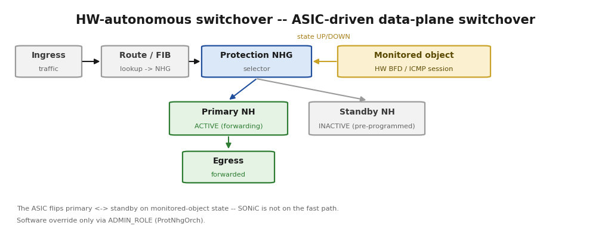
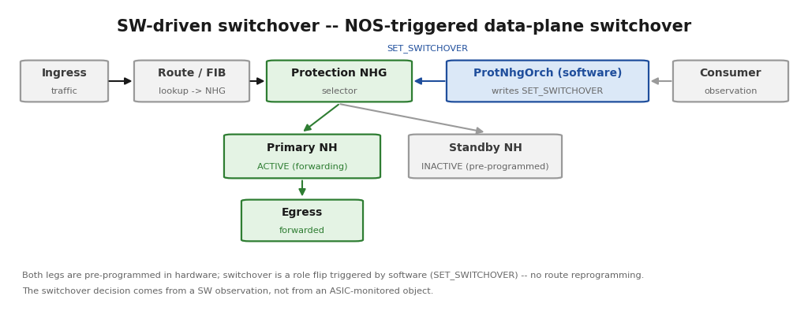
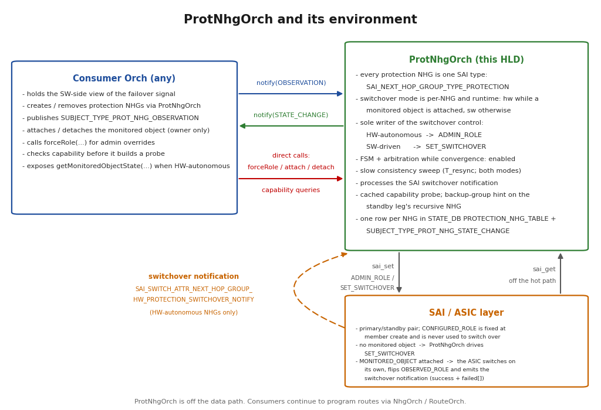
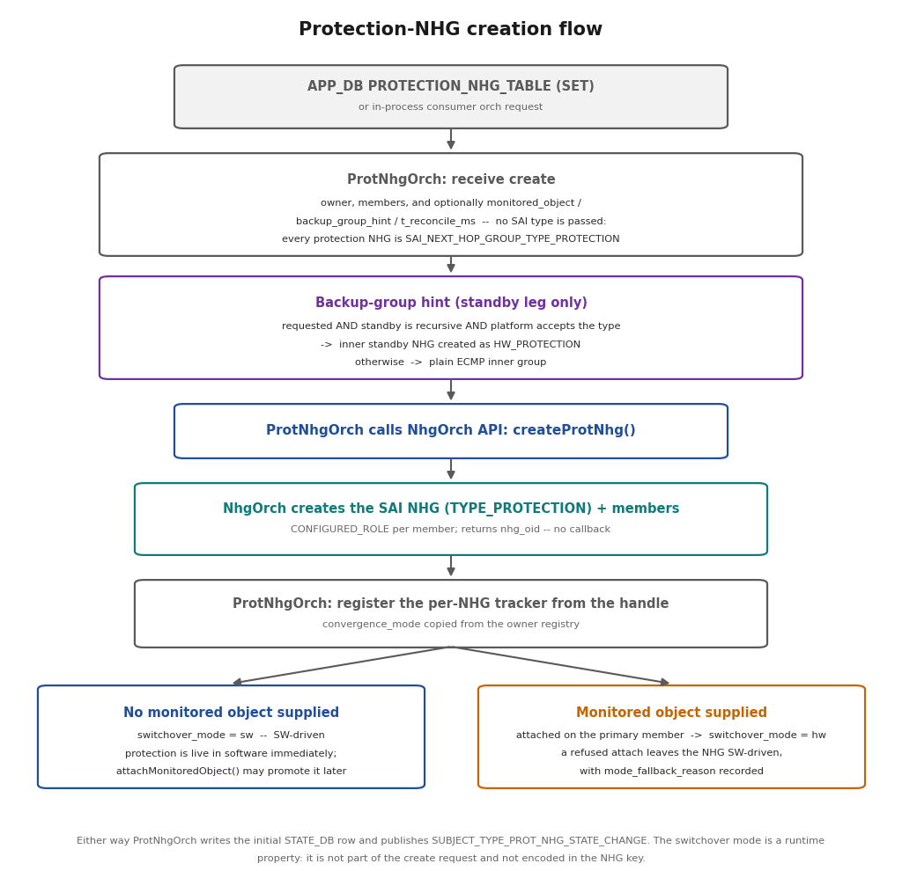
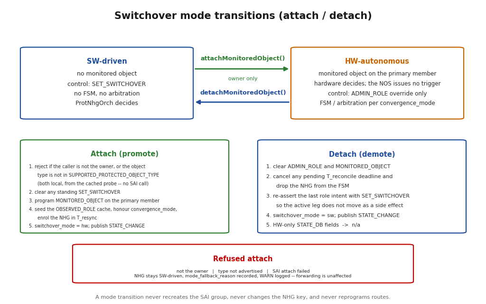
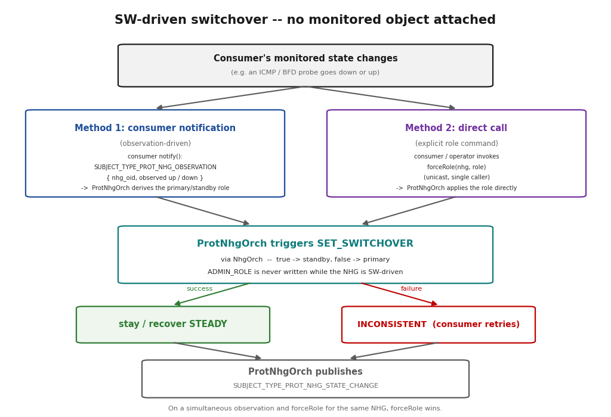
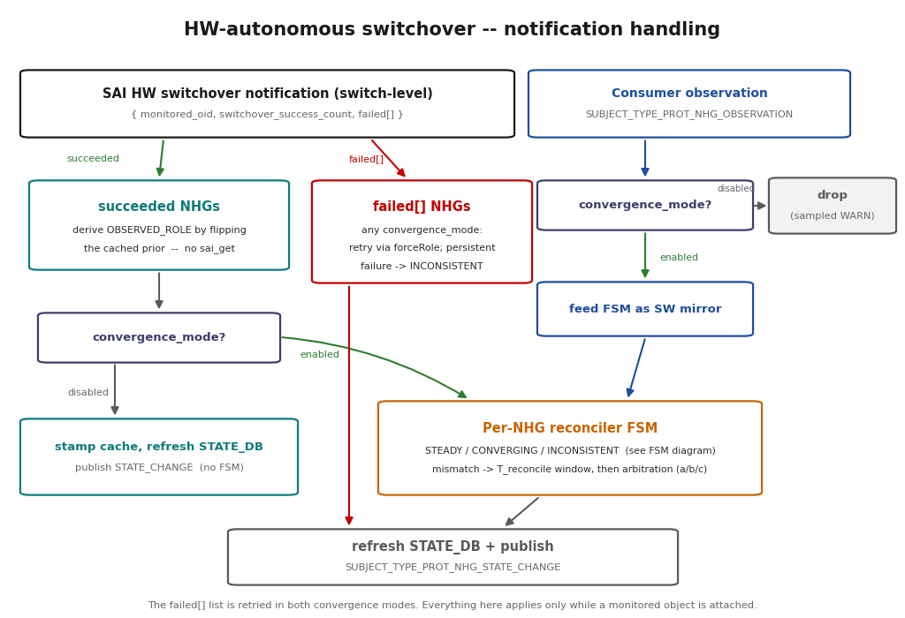
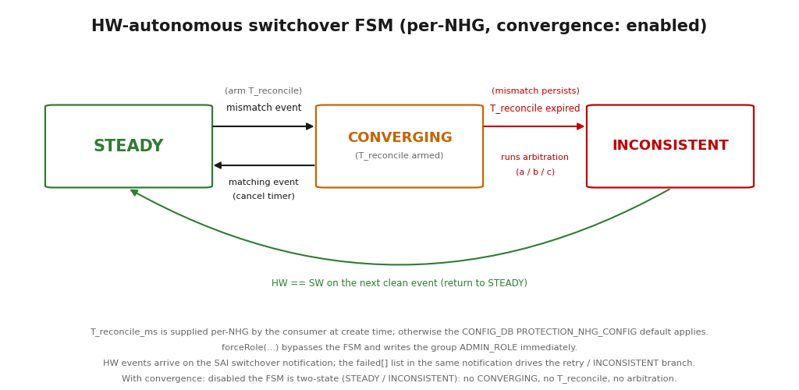

# ProtNhgOrch: Protection Next Hop Group Orchestrator
A protection next hop group (protection NHG) is a SAI object with a primary and a standby nexthop already programmed. On failure, traffic moves by one role change -- no route reprogramming, no extra NHG resolution, no FIB churn. This is the base for fast failover in SONiC (for example, dual-ToR mux switchover, FRR fast reroute, and BFD-driven protection).

ProtNhgOrch owns SAI protection NHGs. A protection NHG is a `SAI_NEXT_HOP_GROUP_TYPE_PROTECTION` group with a per-NHG **switchover mode**:

  * **SW-driven switchover** -- no monitored object attached. ProtNhgOrch triggers the switchover with `SAI_NEXT_HOP_GROUP_ATTR_SET_SWITCHOVER`: `true` moves traffic to the standby, `false` returns it to the primary.
  * **HW-autonomous switchover** -- a monitored object is attached to the primary member. The NOS relinquishes control of the selection: hardware switches between primary and standby on its own from that object's state, and the NOS issues no trigger. The group's `ADMIN_ROLE` is the NOS's only way back in, used when the software and hardware views of the object diverge.

Attaching a monitored object is the *only* thing that promotes a group from SW-driven to HW-autonomous; detaching it demotes the group back. Capability discovery splits the same way: protection support comes from the supported next-hop-group types, hardware switchover support from the supported monitored-object types ([Section 7.1.1.5](#7115-switchover-mode-and-capability-discovery)).

## Table of Contents

<!-- @import "[TOC]" {cmd="toc" depthFrom=1 depthTo=6 orderedList=false} -->

<!-- code_chunk_output -->

- [1. Revision](#1-revision)
- [2. Scope](#2-scope)
- [3. Definitions/Abbreviation](#3-definitionsabbreviation)
- [4. Overview](#4-overview)
  - [4.1 Simple flow](#41-simple-flow)
  - [4.2 SW-driven switchover](#42-sw-driven-switchover)
  - [4.3 HW-autonomous switchover](#43-hw-autonomous-switchover)
  - [4.4 Backup-group hint](#44-backup-group-hint)
- [5. Requirements](#5-requirements)
  - [5.1 SONiC Requirements](#51-sonic-requirements)
  - [5.2 ASIC Requirements](#52-asic-requirements)
- [6. Protection NHG Architecture](#6-protection-nhg-architecture)
  - [6.1 Data-plane forwarding pipeline](#61-data-plane-forwarding-pipeline)
  - [6.2 Control-plane architecture](#62-control-plane-architecture)
- [7. High-Level Design](#7-high-level-design)
  - [7.1 ProtNhgOrch](#71-protnhgorch)
    - [7.1.1 Protection NHG Lifecycle (Interaction with NhgOrch)](#711-protection-nhg-lifecycle-interaction-with-nhgorch)
      - [7.1.1.1 Protection NHG Model](#7111-protection-nhg-model)
      - [7.1.1.2 Protection NHG Key Format](#7112-protection-nhg-key-format)
      - [7.1.1.3 NhgOrch and ProtNhgOrch Boundary](#7113-nhgorch-and-protnhgorch-boundary)
      - [7.1.1.4 Tunnel Nexthops](#7114-tunnel-nexthops)
      - [7.1.1.5 Switchover Mode and Capability Discovery](#7115-switchover-mode-and-capability-discovery)
      - [7.1.1.6 Backup-Group Hint](#7116-backup-group-hint)
    - [7.1.2 Inter-Orch Communication](#712-inter-orch-communication)
    - [7.1.3 SW-Driven Switchover Handling](#713-sw-driven-switchover-handling)
    - [7.1.4 HW-Autonomous Switchover Handling](#714-hw-autonomous-switchover-handling)
      - [7.1.4.1 Convergence Mode](#7141-convergence-mode)
      - [7.1.4.2 Per-NHG Reconciler FSM](#7142-per-nhg-reconciler-fsm)
      - [7.1.4.3 Arbitration at Timer Expiry](#7143-arbitration-at-timer-expiry)
      - [7.1.4.4 SAI HW Switchover Notification Handling](#7144-sai-hw-switchover-notification-handling)
      - [7.1.4.5 Slow Consistency Sweep (T_resync)](#7145-slow-consistency-sweep-t_resync)
    - [7.1.5 Signal Debouncing (Out of Scope)](#715-signal-debouncing-out-of-scope)
    - [7.1.6 Performance, Cost, and Tunable Parameters](#716-performance-cost-and-tunable-parameters)
  - [7.2 Future Consumer Patterns](#72-future-consumer-patterns)
- [8. DB Schema Changes](#8-db-schema-changes)
  - [8.1 Config-DB](#81-config-db)
  - [8.2 App-DB](#82-app-db)
  - [8.3 State-DB](#83-state-db)
- [9. Command Line](#9-command-line)
  - [9.1 Show CLI](#91-show-cli)
- [10. Future Enhancements](#10-future-enhancements)
- [11. Limitations](#11-limitations)
- [12. Error Handling and Failure Scenarios](#12-error-handling-and-failure-scenarios)
- [13. Testing](#13-testing)
<!-- /code_chunk_output -->

## 1. Revision
| Rev |     Date    |         Author        |          Change Description      |
|:---:|:-----------:|:---------------------:|:--------------------------------:|
| 1.0 | 05/14/2026  | Manas Kumar Mandal    | Initial Version. |

## 2. Scope
**ProtNhgOrch** owns the lifecycle, reconciliation, and operator-visible state of all SAI protection NHGs. Every protection NHG is a `SAI_NEXT_HOP_GROUP_TYPE_PROTECTION` group -- a primary/standby pair with `CONFIGURED_ROLE` per member. What differs between deployments is not the type but the **switchover mode**, which follows monitored-object attachment ([Section 7.1.1.5](#7115-switchover-mode-and-capability-discovery)): SW-driven with no monitored object, HW-autonomous with one attached to the primary member.

The mode is not chosen at create time and is not encoded in the NHG key. A group created without a monitored object starts SW-driven and is promoted the moment a consumer attaches one; detaching demotes it back. The monitored object may be supplied at create as a convenience, but is never required then.

ProtNhgOrch works with all consumers in the same way but handles the two modes differently: HW-autonomous uses FSM/arbitration, SW-driven uses direct apply. The first planned consumer is DualToR. External apps with no dedicated orch create protection NHGs directly through `APP_DB PROTECTION_NHG_TABLE` ([Section 8.2](#82-app-db)), using the key format in [Section 7.1.1.2](#7112-protection-nhg-key-format).

**Out of scope as a protection-NHG type: `SAI_NEXT_HOP_GROUP_TYPE_HW_PROTECTION`.** In the current SAI definition it indicates that a group is a secondary/backup group for hardware; it carries no primary/standby pairing, monitored object, or switchover semantics, so it does not describe what a protection NHG needs. ProtNhgOrch uses it only as an optional **backup-group hint** on the recursive NHG behind the standby leg, exposed through explicit APIs ([Section 7.1.1.6](#7116-backup-group-hint)). The hint is advisory: forwarding is identical with and without it, and no ProtNhgOrch logic depends on it.

Two optional settings reduce software work. Both opt-outs are off by default.

  * **Per-consumer `convergence_mode`**, applied while an NHG is HW-autonomous. With `enabled` (default) ProtNhgOrch participates in the role decision, reconciling the ASIC's switchover against the software view of the monitored object; with `disabled` it only observes the switchover notification and publishes state ([Section 7.1.4.1](#7141-convergence-mode)).
  * **Global `t_resync_period_ms`**, a periodic `sai_get` check (default 30 s) that keeps software and hardware state eventually consistent and recovers from lost notifications. Set it to `0` ([Section 8.1](#81-config-db)) to drop the timer and the recurring reads ([Section 7.1.4.5](#7145-slow-consistency-sweep-t_resync)).

With both off on the same HW-autonomous NHG, the ASIC alone drives failover: no reconciliation, no automatic recovery from a lost notification, and `forceRole` as the only software override ([Section 11](#11-limitations)).

## 3. Definitions/Abbreviation
| Term             | Definition |
|:----------------:|:-----------|
| NHG              | Next Hop Group. |
| SAI              | Switch Abstraction Interface. |
| HW               | Hardware (ASIC / SAI layer). |
| SW               | Software (SONiC / orchagent). |
| FRR              | Fast ReRoute. |
| MON_OBJ          | Monitored Object whose state drives a HW-autonomous switchover (ICMP, BFD, link, etc.), referenced from the primary member. Attaching one is what puts the NHG in HW-autonomous mode. |
| FSM              | Finite State Machine. |
| FDB              | Forwarding Database. |
| Switchover mode  | Per-NHG runtime property: `sw` (no monitored object -- ProtNhgOrch drives `SET_SWITCHOVER`) or `hw` (monitored object attached -- hardware switches over autonomously). Not a SAI type and not part of the NHG key. See [Section 7.1.1.5](#7115-switchover-mode-and-capability-discovery). |
| ADMIN_ROLE       | `SAI_NEXT_HOP_GROUP_ATTR_ADMIN_ROLE`. SW-writable group attribute that overrides the ASIC's primary/standby selection. Meaningful only while the NHG is HW-autonomous. ProtNhgOrch is the sole writer. |
| OBSERVED_ROLE    | `SAI_NEXT_HOP_GROUP_MEMBER_ATTR_OBSERVED_ROLE`. ASIC-written member attribute read back by SW to learn which member the ASIC currently selects (`ACTIVE` / `INACTIVE`). HW-autonomous mode only. |
| CONFIGURED_ROLE  | `SAI_NEXT_HOP_GROUP_MEMBER_ATTR_CONFIGURED_ROLE`. Per-member role (`PRIMARY` / `STANDBY`) used to define primary/standby membership on every protection NHG; set at member create, independent of switchover mode. |
| SET_SWITCHOVER   | `SAI_NEXT_HOP_GROUP_ATTR_SET_SWITCHOVER`. SW trigger for runtime switchover (`true` to switch to standby, `false` to clear and return to primary). Used in SW-driven mode. |
| Backup-group hint | Optional, advisory use of `SAI_NEXT_HOP_GROUP_TYPE_HW_PROTECTION` when creating the recursive NHG that backs the standby leg, telling hardware this group is a secondary/backup group. Carries no switchover semantics. See [Section 7.1.1.6](#7116-backup-group-hint). |
| Convergence      | Agreement between the SW consumer's view of the failover signal and the HW's `OBSERVED_ROLE`. HW-autonomous mode only. The FSM converges by reconciling the two views before `T_reconcile` expires. |
| Convergence mode | Per-consumer setting (`enabled` default / `disabled`) controlling whether ProtNhgOrch participates in the role decision (`enabled`) or only publishes state (`disabled`). Applies while the NHG is HW-autonomous. Rationale in [Section 7.1.4.1](#7141-convergence-mode). |
| Arbitration      | SW step that runs when `T_reconcile` expires with mismatch: ProtNhgOrch picks an authority (cached `OBSERVED_ROLE`, fallback SAI re-read, or the SW consumer) and re-asserts its decision via `ADMIN_ROLE`. HW-autonomous + `convergence: enabled` only. See [Section 7.1.4.3](#7143-arbitration-at-timer-expiry). |
| Dual-master race | The race between two independent authorities for the same role decision -- the ASIC's autonomous switchover and a SW consumer observing the same monitored object. HW-autonomous mode only. |
| T_reconcile      | Per-NHG short deadline (default 600 ms) that bounds the FSM's `CONVERGING` epoch. HW-autonomous + `convergence: enabled` only. |
| T_resync         | Global periodic sweep (default 30 s) that re-reads SAI ground truth to catch lost edge events; `0` disables. Both modes. |
| Consumer         | An orch or external app that creates protection NHGs and/or publishes failover observations; identified by `consumer_id` (or `owner` for APP_DB injection). ProtNhgOrch consumes this input and owns SAI role writes. |

## 4. Overview
### 4.1 Simple flow

1. A route uses a protection NHG that has two members: a **primary** and a **standby**.
2. In normal state, traffic uses the primary.
3. On failure, the role changes and traffic moves to the standby.
4. If **no monitored object** is attached, ProtNhgOrch triggers the switchover in software (`SET_SWITCHOVER`).
5. If a **monitored object is attached** to the primary member, the ASIC switches over first; ProtNhgOrch keeps the software state aligned and intervenes via `ADMIN_ROLE` only when needed.

ProtNhgOrch is the single orchagent component for both modes. It is the sole writer of the switchover control (`ADMIN_ROLE` when HW-autonomous, `SET_SWITCHOVER` when SW-driven) and publishes per-NHG state to `STATE_DB PROTECTION_NHG_TABLE` and to subscriber orchs via the Observer/Subject `notify()` pattern. Centralizing both paths gives one orchestrator per NHG, one implementation across all consumers, and one STATE_DB surface for troubleshooting.

### 4.2 SW-driven switchover

*No monitored object attached.* There is no ASIC monitoring and no SAI switchover notification; ProtNhgOrch applies the role directly with `SET_SWITCHOVER`. Two mechanisms feed it:

  1. **Observation-driven.** A consumer registers with ProtNhgOrch and publishes an observed up/down state for a protection NHG; ProtNhgOrch derives the role.
  2. **Explicit role command.** A caller commands primary/standby outright (via `APP_DB PROTECTION_NHG_TABLE` or `forceRole`), and ProtNhgOrch applies it without interpreting any observed state.

This is also the mode a protection NHG runs in on a platform that cannot attach a monitored object at all, and the mode it falls back to when a consumer detaches one.

### 4.3 HW-autonomous switchover

*Monitored object attached to the primary member.* Once the attach succeeds, the NOS relinquishes control of the primary/standby selection for that group: hardware switches between the two autonomously from the monitored object's state, and the NOS issues no switchover trigger. Hardware flips `OBSERVED_ROLE` and reports every switchover -- success and failure -- through the switch-level callback `SAI_SWITCH_ATTR_NEXT_HOP_GROUP_HW_PROTECTION_SWITCHOVER_NOTIFY` (payload `{ monitored_oid, switchover_success_count, failed[] }`). The NOS takes control back for a specific group by setting its `ADMIN_ROLE`.

How a platform realizes this internally is deliberately unconstrained. The contract is what matters: after the attach the switchover decision is no longer the NOS's, and the NOS learns of each decision only through the notification and `OBSERVED_ROLE`.

This creates a **dual-master race**. The ASIC switches over and notifies, while a software consumer (IcmpOrch for ICMP, BfdOrch for BFD) may be watching the same monitored object and reaching its own conclusion. ProtNhgOrch resolves it with a per-NHG FSM that arbitrates the HW notification against the consumer's observation, backed by a periodic `T_resync` check that re-reads hardware state and catches lost notifications.

### 4.4 Backup-group hint

Some ASICs can pre-stage or de-prioritize a next-hop group known to be a *backup* group -- for example by keeping its members out of the primary hashing resource pool. In the current SAI spec this is conveyed by creating the group as `SAI_NEXT_HOP_GROUP_TYPE_HW_PROTECTION`, which marks it as a backup group without defining any switchover behaviour.

ProtNhgOrch therefore treats it purely as an opt-in hint on the **standby leg's recursive NHG** (the inner ECMP group behind the standby member), never on the protection NHG itself. The hint is **optional** (off unless asked for), **advisory** (forwarding is identical with and without it, and no logic depends on it), and **capability-gated** (applied only where the startup probe says the platform accepts the type; elsewhere the standby leg is a plain ECMP group and the outcome is recorded in STATE_DB).

Applications request it through dedicated APIs ([Section 7.1.1.6](#7116-backup-group-hint)) and the `backup_group_hint` field on the create surface ([Section 8.2](#82-app-db)). Both are expressed in terms of the hint rather than the SAI type, so the mechanism used to convey it stays internal to ProtNhgOrch.

## 5. Requirements

### 5.1 SONiC Requirements
**Common:**
- A single component (**ProtNhgOrch**) owns all protection NHGs, in both switchover modes.
- Create every protection NHG as `SAI_NEXT_HOP_GROUP_TYPE_PROTECTION`.
- Consumer-agnostic integration via the SONiC Observer/Subject `notify()` pattern.
- Sole writer of the switchover control (`ADMIN_ROLE` when HW-autonomous, `SET_SWITCHOVER` when SW-driven). Consumers never write these directly.
- Publish per-NHG state to a single `STATE_DB PROTECTION_NHG_TABLE`, including the current switchover mode.
- Let external apps (e.g., FRR via fpmsyncd) use `APP_DB PROTECTION_NHG_TABLE` to create/delete protection NHGs without a dedicated consumer orch; lifecycle semantics are the same as the NhgOrch-owned path ([Section 8.2](#82-app-db)).
- Provide a CLI to inspect protection NHGs, showing at least each NHG's switchover mode and, when HW-autonomous, its convergence mode.
- Account every protection NHG and its members against CRM like regular next hop groups: increment `CRM_NEXTHOP_GROUP` on group creation and `CRM_NEXTHOP_GROUP_MEMBER` per synced member, release both on removal, and check capacity before creation (protection NHGs draw from the same shared resource pool).

**Capability discovery:**
- Query protection-NHG support (`SAI_NEXT_HOP_GROUP_TYPE_PROTECTION` as an allowed next-hop-group type) and publish it to the standard `STATE_DB SWITCH_CAPABILITY|switch` row.
- Determine hardware switchover support from the **monitored object**, not from a next-hop-group type: read `SAI_SWITCH_ATTR_SUPPORTED_PROTECTED_OBJECT_TYPE`, which enumerates the object types usable as a `SAI_NEXT_HOP_GROUP_MEMBER_ATTR_MONITORED_OBJECT`. Non-empty means hardware switchover is available and defines the accepted types. Publish both the derived boolean and the type list ([Section 7.1.1.5](#7115-switchover-mode-and-capability-discovery)).
- Probe whether the platform accepts `SAI_NEXT_HOP_GROUP_TYPE_HW_PROTECTION` and publish it as the **backup-group hint** capability -- never as a protection-NHG type capability.
- Expose all three capabilities through ProtNhgOrch APIs as well as STATE_DB, so an in-process consumer need not read STATE_DB to make a create-time decision ([Section 7.1.2](#712-inter-orch-communication)).

**SW-driven switchover:**
- Apply each `SUBJECT_TYPE_PROT_NHG_OBSERVATION` by triggering `SET_SWITCHOVER` immediately.
- On SAI write failure: mark `INCONSISTENT` and publish; retry is left to the consumer orch (for example, by re-publishing its observation).

**HW-autonomous switchover:**
- Accept a monitored object either at create time or at any point afterwards; never require it at create. Promote an NHG to HW-autonomous on a successful attach and demote it on detach, without recreating the group or changing its key ([Section 7.1.1.5](#7115-switchover-mode-and-capability-discovery)).
- Reject a monitored-object attach from a consumer that does not own the NHG, and reject one on a platform that reports no hardware switchover support; in the latter case keep the NHG SW-driven and record the reason in STATE_DB.
- Per-NHG FSM ([Section 7.1.4.2](#7142-per-nhg-reconciler-fsm)): three-state for `convergence: enabled`; two-state (`STEADY`/`INCONSISTENT`) for `convergence: disabled`.
- Honour a per-consumer `convergence_mode` (`enabled` default, `disabled`); see [Section 7.1.4.1](#7141-convergence-mode) for behaviour deltas.
- Run a periodic consistency sweep (`T_resync`) to maintain eventual consistency between software and hardware. `t_resync_period_ms = 0` disables it; the startup sweep still runs.
- Configurable tunables (`T_reconcile`, `T_resync`, `T_cache_fresh_threshold`) for reconciliation cost and timing; consumers may supply a per-NHG `T_reconcile_ms` at create time, with defaults from CONFIG_DB. Cost rationale and the cache-first read goal are in [Section 7.1.6](#716-performance-cost-and-tunable-parameters).

**Backup-group hint:**
- Provide application-facing APIs to discover whether the hint is supported and to opt a protection NHG's standby leg into it ([Section 7.1.1.6](#7116-backup-group-hint)).
- Apply the hint only to the recursive NHG behind the standby member, never to the protection NHG.
- Gate its use on the probed capability: apply the hint only where the platform accepts the type, create a plain ECMP group otherwise, and surface the outcome in STATE_DB. The protection NHG is fully functional either way.
- Keep all switchover, FSM, arbitration, and resync logic independent of whether the hint was applied.

### 5.2 ASIC Requirements
**Mandatory (every protection NHG):**
- `SAI_NEXT_HOP_GROUP_TYPE_PROTECTION` with primary/standby members.
- `SAI_NEXT_HOP_GROUP_MEMBER_ATTR_CONFIGURED_ROLE` (`PRIMARY` / `STANDBY`) -- per-member role used to define primary/standby membership.
- `SAI_NEXT_HOP_GROUP_ATTR_SET_SWITCHOVER` -- control-plane trigger to switch over.

**Optional -- hardware-autonomous switchover:**
- **Autonomous behaviour** -- once a monitored object is attached, hardware selects between primary and standby from that object's state with no software trigger, and keeps doing so until the NOS overrides with `ADMIN_ROLE` or detaches the object. This is the defining requirement; no separate next-hop-group type is involved, and how the platform realizes it internally is unconstrained.
- `SAI_SWITCH_ATTR_SUPPORTED_PROTECTED_OBJECT_TYPE` -- readable on the switch object, listing the object types attachable as a monitored object (HW BFD session, HW ICMP/echo session, port, etc.). This is the sole capability SONiC uses to decide whether hardware switchover exists, so it must not advertise a type the platform cannot actually monitor. A platform without hardware switchover reports an empty list or does not implement the attribute; SONiC then never attempts an attach and drives every protection NHG in software.
- `SAI_NEXT_HOP_GROUP_MEMBER_ATTR_MONITORED_OBJECT` -- settable on the primary member for every type in that list.
- `SAI_NEXT_HOP_GROUP_MEMBER_ATTR_OBSERVED_ROLE` -- readable, so software can learn the ASIC's current selection.
- `SAI_NEXT_HOP_GROUP_ATTR_ADMIN_ROLE` (`PRIMARY` / `STANDBY` / unset) -- the software-writable group-level override.
- Switch-level switchover notification (`SAI_SWITCH_ATTR_NEXT_HOP_GROUP_HW_PROTECTION_SWITCHOVER_NOTIFY`) -- per monitored object, fires on every switchover, payload `{ monitored_oid, switchover_success_count, failed[] }`. Success drives the FSM, failure the retry/`INCONSISTENT` branch; no separate bulk-error channel.

**Optional -- backup-group hint:**
- Accept `SAI_NEXT_HOP_GROUP_TYPE_HW_PROTECTION` when creating a standalone next-hop group that SONiC uses as the standby leg's recursive group.
- Semantics are hint-only: forwarding must match an equivalent `SAI_NEXT_HOP_GROUP_TYPE_ECMP` group, and the type must not imply primary/standby pairing, a monitored object, or any switchover behaviour.

The three groups are independent. An ASIC supporting only the mandatory set is fully usable in SW-driven mode; hardware-autonomous switchover and the backup-group hint are additive. Future: per-NHG switchover counters ([Section 10](#10-future-enhancements)).

## 6. Protection NHG Architecture

### 6.1 Data-plane forwarding pipeline
A protection NHG pre-programs **both** the primary and the standby leg in hardware, so failover is a single role change in the data plane -- no route reprogramming, no NHG re-resolution, no FIB churn. Both switchover modes share this fast path and the same SAI group type; they differ only in **what drives the switchover decision**.

**HW-autonomous switchover.** The ASIC tracks the primary member's `MONITORED_OBJECT` and toggles forwarding between the primary and the standby entirely in hardware when that object's state changes; SONiC is not on the fast path. Software can override the ASIC's selection via the group's `ADMIN_ROLE`.



**SW-driven switchover.** Both legs are still pre-programmed in hardware, but the active leg is selected by software: ProtNhgOrch writes `SET_SWITCHOVER` on the group (`true` -> standby, `false` -> primary) in response to a consumer's observation of the monitored state. There is no ASIC-monitored object on the fast path; only the decision source differs.



### 6.2 Control-plane architecture
ProtNhgOrch sits between SAI and consumer orchs. It is the only component that writes the SAI switchover control (`ADMIN_ROLE` / `SET_SWITCHOVER`), and the only component that consumes the SAI switchover notification.

Consumers integrate via three things (full detail in [Section 7.1.2](#712-inter-orch-communication)):

  * **Inbound notification `SUBJECT_TYPE_PROT_NHG_OBSERVATION`** -- consumer publishes its SW-side view of the monitored object's state (for example IcmpOrch's ICMP echo state, BfdOrch's BFD session state).
  * **Outbound notification `SUBJECT_TYPE_PROT_NHG_STATE_CHANGE`** -- ProtNhgOrch publishes the resolved per-NHG state on every FSM transition and every switchover-mode change, through the Observer/Subject `notify()` path.
  * **Direct method calls** -- `forceRole(nhg, role)` for admin overrides (bypasses the FSM), plus the capability and backup-group-hint APIs.



ProtNhgOrch is not in the data path. Consumers still create protection NHGs and program routes through existing NhgOrch/RouteOrch paths. ProtNhgOrch only handles switchover control, per-NHG state publication, and (in HW-autonomous mode) reconciliation.

## 7. High-Level Design

### 7.1 ProtNhgOrch

ProtNhgOrch's responsibilities are the SONiC requirements in [Section 5.1](#51-sonic-requirements). [Section 7.1.1](#711-protection-nhg-lifecycle-interaction-with-nhgorch) covers the shared foundation -- how protection NHGs are created and modelled, how the switchover mode and capabilities are determined, and how the backup-group hint is exposed -- followed by consumer communication ([Section 7.1.2](#712-inter-orch-communication)) and the two mode-specific paths: SW-driven applies role intent directly ([Section 7.1.3](#713-sw-driven-switchover-handling)), HW-autonomous adds reconciliation against the ASIC ([Section 7.1.4](#714-hw-autonomous-switchover-handling)). Signal debouncing ([Section 7.1.5](#715-signal-debouncing-out-of-scope)) and performance/tunables ([Section 7.1.6](#716-performance-cost-and-tunable-parameters)) close the section.

#### 7.1.1 Protection NHG Lifecycle (Interaction with NhgOrch)
NhgOrch is the SAI-side lifecycle owner for all NHGs, protection NHGs included, and stays consumer- and mode-agnostic. ProtNhgOrch drives every protection-NHG operation -- create/remove, role control, observed-role read-back, monitored-object attach/detach, and ownership reference counting -- through NhgOrch's exposed protection-NHG APIs. Because ProtNhgOrch issues the create itself, it holds the returned handle directly and registers the per-NHG tracker and `T_resync` participant inline; there is no create/delete callback from NhgOrch.

Creation requests reach ProtNhgOrch from two sources, each carrying an owner identifier (but **not** a SAI type -- the type is always `SAI_NEXT_HOP_GROUP_TYPE_PROTECTION`):

  * **`APP_DB PROTECTION_NHG_TABLE`** ([Section 8.2](#82-app-db)) -- ProtNhgOrch subscribes to this table; apps without a dedicated orch (FRR via fpmsyncd, configd, etc.) create or delete protection NHGs by writing the canonical key.
  * **In-process consumer orchs** (e.g., MuxOrch) -- request creation through a direct ProtNhgOrch call.

For each source, ProtNhgOrch maintains a `consumer_id -> { convergence_mode }` registry keyed by the owner identifier:

  * **Consumer orchs** declare `convergence_mode` once when they first register with ProtNhgOrch (default `enabled`).
  * **APP_DB injection** (see [Section 8.2](#82-app-db)): the owner comes from the row's `owner` field; `convergence_mode` is looked up in the optional `PROTECTION_NHG_OWNER_CONFIG|<owner>` row ([Section 8.1](#81-config-db)). Missing entry -> `enabled`.

The selected mode is stored on the per-NHG tracker at create time and is **fixed for the life of the NHG**. It only takes effect while the NHG is HW-autonomous; a SW-driven NHG carries it inertly and starts honouring it if a monitored object is later attached. To change the mode, DEL + SET under the same key.

The end-to-end creation flow, from an APP_DB write (or in-process consumer request) through ProtNhgOrch and NhgOrch's exposed APIs, is:



##### 7.1.1.1 Protection NHG Model
A protection NHG is modelled as exactly two members: one **primary** and one **standby**, matching the SAI protection-group model (the SAI FRR proposal expects no more than two next hops in a protection group). Each member carries:

  * its role (primary / standby),
  * an optional `MONITORED_OBJECT` reference on the primary member -- present exactly when the NHG is in HW-autonomous mode,
  * a read-back `OBSERVED_ROLE` (meaningful in HW-autonomous mode).

A member is either an **individual nexthop** (e.g. a neighbor on a directly connected interface) or a **recursive NHG** (an existing ECMP set). Both forms are first-class; ProtNhgOrch and STATE_DB treat them uniformly.

Because the group is a strict pair, an N:M relationship (multiple primary paths protected by multiple standby paths) is expressed by making each member a **recursive ECMP NHG** -- the primary member points to the N-path NHG, the standby member to the M-path NHG. The inner NHG can be a plain ECMP group or a fine-grained NHG (consistent hashing), at the consumer's choice. Creating, populating, and maintaining that inner NHG belongs to NhgOrch and the consumer that programs it; ProtNhgOrch references it as an opaque member and owns exactly one property of it -- the optional backup-group hint on the standby side ([Section 7.1.1.6](#7116-backup-group-hint)). Native multi-primary membership within a single protection group needs a SAI extension and is deferred ([Section 10.2](#102-multi-tier-protection-nhgs)).

NH resolution is deferred: if a member's underlying nexthop is not yet resolved at create time, the protection NHG is created and the member is filled in once resolution arrives (the same pattern NhgOrch already uses for regular NHGs).

##### 7.1.1.2 Protection NHG Key Format
This HLD specifies the canonical string used to name a protection NHG. The same key identifies the NHG in `STATE_DB PROTECTION_NHG_TABLE`, in NhgOrch's lookup index, and on the operator-facing CLI ([Section 9.1](#91-show-cli)).

```
prot:<primary_members>|<standby_members>

where:
  <primary_members>   = comma-separated list of nexthop identifiers
                        (or, for a recursive member, the comma-separated
                         members of the primary ECMP set)
  <standby_members>   = same encoding as <primary_members>
```

Nexthop identifiers use the standard `<ip>@<iface>` form, or `tunnel:<tunnel_name>@<endpoint_ip>` for tunnel NHs ([Section 7.1.1.4](#7114-tunnel-nexthops)). The `tunnel:` form is encapsulation-agnostic.

The key carries no type or mode discriminator: there is a single SAI type, and the switchover mode is a runtime property that must survive attach/detach of the monitored object without renaming the NHG. What the group is doing right now is reported by `switchover_mode` in STATE_DB ([Section 8.3](#83-state-db)).

Membership-only identity gives three properties by construction:

  * **Deterministic** -- same membership always produces the same key.
  * **Mode-stable** -- the key does not change on promote or demote, so STATE_DB rows, CLI output, and consumer handles stay correlated across mode changes.
  * **Idempotent create** -- re-creating with an existing key is a no-op.

It also means two consumers asking for the same primary/standby pair share one NHG, so ownership of the switchover decision needs an explicit rule; see the attach-ownership rule in [Section 7.1.1.5](#7115-switchover-mode-and-capability-discovery).

Examples:

  * Individual-NH primary, tunnel standby (dual-ToR pattern):

    ```
    prot:10.0.0.1@Ethernet0,10.0.0.2@Ethernet4|tunnel:MuxTunnel0@10.1.0.32
    ```

  * Recursive ECMP members on both legs:

    ```
    prot:10.0.0.1@Ethernet0,10.0.0.2@Ethernet4|10.0.0.3@Ethernet8,10.0.0.4@Ethernet12
    ```

##### 7.1.1.3 NhgOrch and ProtNhgOrch Boundary
NhgOrch and ProtNhgOrch share ownership of a protection NHG along a clear boundary. The precise call surface is an implementation concern; the design boundary is:

  * **Lifecycle and SAI ownership: NhgOrch.** The SAI object creation, removal, member resolution, refcount tracking, and the usual validation (capacity, duplicates, deferred resolution) live in NhgOrch and are invoked through its exposed protection-NHG APIs. ProtNhgOrch is the caller of those APIs for both creation sources -- the `APP_DB PROTECTION_NHG_TABLE` it subscribes to ([Section 8.2](#82-app-db)) and in-process consumer orchs. NhgOrch never calls back into ProtNhgOrch.
  * **Role control: ProtNhgOrch.** ProtNhgOrch is the sole writer of the switchover control -- `SAI_NEXT_HOP_GROUP_ATTR_ADMIN_ROLE` when the NHG is HW-autonomous, `SAI_NEXT_HOP_GROUP_ATTR_SET_SWITCHOVER` when it is SW-driven. The same write path serves SW direct-apply ([Section 7.1.3](#713-sw-driven-switchover-handling)), `forceRole(...)` overrides, and `T_resync` re-writes ([Section 7.1.4.5](#7145-slow-consistency-sweep-t_resync)).
  * **HW state read-back: ProtNhgOrch, off the hot path.** Reads of `OBSERVED_ROLE` (per member) and `ADMIN_ROLE` (group) happen only on arbitration and `T_resync`. See the `sai_get` cost note in [Section 7.1.6](#716-performance-cost-and-tunable-parameters).
  * **`MONITORED_OBJECT` lifecycle: consumer decides, ProtNhgOrch programs.** Consumers own the monitored object itself -- ProtNhgOrch never creates or destroys one -- and ask ProtNhgOrch to attach or detach it on the primary member as their probe session changes. ProtNhgOrch performs the attach through NhgOrch, because the attach is what changes the NHG's switchover mode and its whole reconciliation posture ([Section 7.1.1.5](#7115-switchover-mode-and-capability-discovery)).
  * **Backup-group hint: ProtNhgOrch requests, NhgOrch creates.** When the hint is enabled, ProtNhgOrch asks NhgOrch to create the standby leg's recursive group with the hint type instead of ECMP, and handles the fallback ([Section 7.1.1.6](#7116-backup-group-hint)).

##### 7.1.1.4 Tunnel Nexthops
Protection NHGs must be able to use a tunnel as one of their members, independent of the underlying encapsulation. Three design points support this generically:

  * **Identifier.** The nexthop identifier uses an encapsulation-agnostic form, `tunnel:<tunnel_name>@<endpoint_ip>`, with the same equality / hashing semantics as a regular nexthop identifier. The tunnel type is not part of the identifier; it is a property of the tunnel object owned by its tunnel orch.
  * **Resolution.** The tunnel type's owning subsystem registers / deregisters tunnel NHs with NeighOrch so they resolve through the same path as other nexthops. ProtNhgOrch does not care which subsystem registered the NH, only that the NH is resolvable.
  * **Consumer responsibility.** Consumers using a tunnel NH as a member must ensure the tunnel object and its NH registration exist before the NHG is created; otherwise the member stays unresolved and is filled in when registration eventually arrives.

Adding a new tunnel encapsulation is an extension on the corresponding tunnel orch and does not require any change in ProtNhgOrch or the protection-NHG key format.

##### 7.1.1.5 Switchover Mode and Capability Discovery
The switchover mode is derived, not configured. There is one rule:

> A protection NHG is **HW-autonomous** exactly while a monitored object is attached to its primary member. Otherwise it is **SW-driven**.

The attach is a transfer of control: the NOS stops issuing switchover triggers and keeps only the `ADMIN_ROLE` override and the ability to detach. The mode gates which SAI control ProtNhgOrch writes, whether the FSM and arbitration run, and what STATE_DB reports.

The monitored object is **not required at create time**. A HW BFD session usually cannot be built until the neighbor resolves, so a group is normally created first and promoted when the object appears; requiring it up front would leave the prefix unprotected in the meantime. It may be supplied at create as a convenience ([Section 7.1.2](#712-inter-orch-communication)), and replacing a bouncing probe is a detach plus an attach, not an NHG rebuild.

Because the key is membership alone, consumers requesting the same member pair share one NHG, so the mode belongs to the shared object rather than to either request. The first creator owns the NHG and only the owner may attach or detach; a non-owner request is rejected and logged ([Section 12](#12-error-handling-and-failure-scenarios)). A joining consumer reads the mode it actually got from `switchover_mode` or `SUBJECT_TYPE_PROT_NHG_STATE_CHANGE`.

**Capability probe.** One cached startup probe answers both questions:

  1. **Protection support** -- is `SAI_NEXT_HOP_GROUP_TYPE_PROTECTION` an allowed value of `SAI_NEXT_HOP_GROUP_ATTR_TYPE`? If not, ProtNhgOrch creates nothing and rejects all consumer requests.
  2. **Hardware switchover support** -- `SAI_SWITCH_ATTR_SUPPORTED_PROTECTED_OBJECT_TYPE`, the list of object types usable as a `SAI_NEXT_HOP_GROUP_MEMBER_ATTR_MONITORED_OBJECT`. Non-empty means hardware switchover is available and the list *is* the accepted type set; empty or unimplemented means every protection NHG on the box stays SW-driven.

The list is authoritative, so there is no "try the attach and see" path: an unadvertised type is refused before any SAI call. Results reach consumers through `STATE_DB SWITCH_CAPABILITY|switch` ([Section 8.3](#83-state-db)) and the capability APIs ([Section 7.1.2](#712-inter-orch-communication)). SAI calls these *protected object types* on the switch attribute and a *monitored object* on the member attribute; they are the same thing, and this HLD says "monitored object" throughout.

**Attach (SW-driven -> HW-autonomous).** ProtNhgOrch:

  1. Rejects the request if the caller is not the owner, or if the object's type is not in the reported list (including when that list is empty). Both checks are local; the latter records `hw_switchover_unsupported` / `mon_obj_type_unsupported` in STATE_DB and leaves the NHG SW-driven.
  2. Clears any standing `SET_SWITCHOVER` so a sticky software override cannot fight the ASIC's first autonomous decision.
  3. Programs `MONITORED_OBJECT` on the primary member via NhgOrch.
  4. On success, seeds the `OBSERVED_ROLE` cache from SAI (the notify handler flips the cached prior; [Section 7.1.4.4](#7144-sai-hw-switchover-notification-handling)), starts honouring the NHG's `convergence_mode`, enrols it in `T_resync`, sets `switchover_mode = hw`, and publishes `SUBJECT_TYPE_PROT_NHG_STATE_CHANGE`.
  5. On failure, leaves the NHG SW-driven, logs WARN, and records the reason. Forwarding is unaffected -- both legs are already programmed.

**Detach (HW-autonomous -> SW-driven).** ProtNhgOrch clears `ADMIN_ROLE` and `MONITORED_OBJECT`, cancels any pending `T_reconcile` deadline, drops the NHG from the FSM, re-asserts its last role intent with a `SET_SWITCHOVER` write so the active leg does not move as a side effect, sets `switchover_mode = sw`, and publishes the state change. HW-only STATE_DB fields go to `n/a`.

Mode transitions never recreate the SAI group, change the NHG key, or disturb routes pointing at it.



##### 7.1.1.6 Backup-Group Hint
When the standby member is a **recursive NHG**, ProtNhgOrch can create that inner group as `SAI_NEXT_HOP_GROUP_TYPE_HW_PROTECTION` instead of `SAI_NEXT_HOP_GROUP_TYPE_ECMP`, hinting to hardware that the group is a secondary/backup group. This is the only use of that enum.

**What it is not.** It does not create a protection NHG, pair a primary with a standby, carry a monitored object, or influence any switchover -- the protection semantics live entirely in the outer `SAI_NEXT_HOP_GROUP_TYPE_PROTECTION` group. ProtNhgOrch behaves identically whether or not the hint was applied: it is an optimization opportunity for the ASIC, never a correctness input.

**APIs** (full signatures in [Section 7.1.2](#712-inter-orch-communication)); `APP_DB PROTECTION_NHG_TABLE` offers the same opt-in through a `backup_group_hint` field ([Section 8.2](#82-app-db)):

  * `isBackupGroupHintSupported()` -- capability, cached from the startup probe.
  * `createProtectionNhg(request)` -- carries a `backup_group_hint` flag; an unavailable hint is dropped, never fatal to the create.
  * `setBackupGroupHint(nhg, enable)` -- opt in or out after create; returns `unsupported` rather than silently succeeding, since the hint is this call's only job.
  * `getBackupGroupHintState(nhg)` -- `applied` / `not_requested` / `unsupported` / `not_applicable`.

**Applicability.** Two conditions, both answered locally from cache: the platform must accept the type ([Section 7.1.1.5](#7115-switchover-mode-and-capability-discovery)), and the standby leg must be a recursive NHG. Failing the first gives a plain ECMP inner group reported as `unsupported`, logged WARN once per consumer; failing the second reports `not_applicable`, logged INFO. The protection NHG is created normally either way -- an advisory hint never fails the operation that carried it. The log is rate-limited because on an unsupported platform every hint-requesting NHG would otherwise repeat the same message; the per-NHG outcome lives in STATE_DB.

Where both hold, ProtNhgOrch creates the inner group with the hint type. The platform has already stated it accepts the type, so a SAI failure there is an ordinary NHG-create failure and is handled as one.

Changing the hint on an existing NHG replaces the inner standby group: ProtNhgOrch builds the new group, swaps the standby member to it, then releases the old one, so the standby leg is never absent. The inner group's type is immutable in SAI, so this is the only way to change it.

#### 7.1.2 Inter-Orch Communication
ProtNhgOrch follows standard orchagent convention: state changes use `Observer`/`Subject` `notify()`, and commands and queries use direct method calls.

**Notifications:**

  * **`SUBJECT_TYPE_PROT_NHG_OBSERVATION`** (new) -- *consumer -> ProtNhgOrch*. Payload `{ nhg_oid, derived_role }`. Consumer's SW-side view of whatever drives the failover (the monitored object when HW-autonomous, the consumer's own state when SW-driven). ProtNhgOrch `attach()`es to consumers emitting this subject. A HW-autonomous NHG with `convergence: enabled` feeds it to the FSM; a SW-driven NHG triggers direct apply. Consumers never write the SAI role attribute directly. **Observations targeting a HW-autonomous `convergence: disabled` NHG are dropped with a sampled WARN** (rate-limited, e.g., once/minute/consumer).
  * **`SUBJECT_TYPE_PROT_NHG_STATE_CHANGE`** (new) -- *ProtNhgOrch -> consumers*. Payload `{ nhg_oid, switchover_mode, fsm_state, observed_role, admin_role, configured_primary, inconsistent, monitored_object_state, backup_group_hint }`. HW-only fields are `n/a` while the NHG is SW-driven; `configured_primary` is always populated. Published on every state transition **and on every switchover-mode change**, so a subscriber never has to poll to learn that its NHG was promoted or demoted.

**Commands:**

  * **`forceRole(nhg, role)`** -- software override, a unicast direct call rather than a `notify()` broadcast. Works in both modes and writes whichever SAI control is in effect: `ADMIN_ROLE` when the NHG is HW-autonomous (bypassing the FSM), `SET_SWITCHOVER` when it is SW-driven.
  * **`createProtectionNhg(request)`** -- the request carries both member lists, the owner identifier, and the optional `monitored_object`, `backup_group_hint`, and `t_reconcile_ms`. Two convenience overloads:
      - `createProtectionNhg(primary, standby)` -- create SW-driven; attach later, or never.
      - `createProtectionNhg(primary, standby, mon_oid)` -- create with the monitored object attached inline, for consumers whose probe already exists. Exactly equivalent to a create followed by `attachMonitoredObject`, including the failure behaviour: a refused attach still leaves the group created and SW-driven, and does **not** fail the create.
  * **`attachMonitoredObject(nhg, mon_oid)` / `detachMonitoredObject(nhg)`** -- promote/demote the NHG's switchover mode ([Section 7.1.1.5](#7115-switchover-mode-and-capability-discovery)). Callable only by the NHG's owner. The consumer still owns the monitored object's lifecycle, so rebuilding a probe is a detach plus an attach on the same NHG.
  * **`setBackupGroupHint(nhg, enable)`** -- opt the standby leg's recursive NHG into or out of the backup-group hint ([Section 7.1.1.6](#7116-backup-group-hint)).

**Queries (capability and state):**

  * **`isProtectionSupported()`** -- `SAI_NEXT_HOP_GROUP_TYPE_PROTECTION` is an allowed group type.
  * **`isHwSwitchoverSupported()`** and **`isHwSwitchoverSupported(mon_obj_type)`** -- whether any monitored object can be attached, and whether a specific object type can. Both are answered from `SAI_SWITCH_ATTR_SUPPORTED_PROTECTED_OBJECT_TYPE`. This is the capability a consumer checks before building a monitored object.
  * **`getSupportedMonitoredObjectTypes()`** -- the accepted-type list as reported by that attribute; empty means hardware switchover is unavailable.
  * **`isBackupGroupHintSupported()`** and **`getBackupGroupHintState(nhg)`** -- backup-group-hint capability and per-NHG outcome.
  * **`getSwitchoverMode(nhg)`** -- current mode (`sw` / `hw`), for consumers that need it outside the notification path.

All capability queries are served from the cached startup probe ([Section 7.1.1.5](#7115-switchover-mode-and-capability-discovery)) and issue no SAI call.

**HW-autonomous mode only:**

  * **`getMonitoredObjectState(mon_oid)`** -- direct method on the consumer, called by ProtNhgOrch during arbitration and `T_resync` (not on the hot path). Implementations should read from an existing consumer cache. Not called for `convergence: disabled` NHGs (see [Section 7.1.4.5](#7145-slow-consistency-sweep-t_resync)).

#### 7.1.3 SW-Driven Switchover Handling
*No monitored object attached.* There is no ASIC monitoring and no second decision-maker: the consumer observation (or an explicit role command) is the only source of intent, and ProtNhgOrch applies it directly, with no reconciliation. Intent arrives by one of two methods, both converging on the same `SET_SWITCHOVER` write:



Method 1 lets ProtNhgOrch derive the role from an observed up/down signal; Method 2 commands the role outright without interpreting any observed state. On a simultaneous observation and `forceRole` for the same NHG, `forceRole` wins.

**Direct apply.** The SAI write is a group-level `SET_SWITCHOVER` trigger routed through NhgOrch (see [Section 7.1.1.3](#7113-nhgorch-and-protnhgorch-boundary)). Two states:

  * `STEADY` -- last observation applied successfully (`SET_SWITCHOVER` matches cached intent).
  * `INCONSISTENT` -- last SAI write failed.

Transitions:

  * `SUBJECT_TYPE_PROT_NHG_OBSERVATION` -> trigger `SET_SWITCHOVER` via NhgOrch. Success: stay `STEADY` (or recover `INCONSISTENT -> STEADY`). Failure: -> `INCONSISTENT` and publish; retry is left to the consumer orch (for example, by re-publishing its observation).
  * `forceRole(nhg, role)` -> same `SET_SWITCHOVER` path, with override semantics in the published state.

`ADMIN_ROLE` is never written while the NHG is SW-driven. All other (common) responsibilities from [Section 5.1](#51-sonic-requirements) apply.

#### 7.1.4 HW-Autonomous Switchover Handling
*Monitored object attached to the primary member.* The ASIC monitors that object and flips `OBSERVED_ROLE` autonomously, delivering every switchover via a switch-level notification ([Section 7.1.4.4](#7144-sai-hw-switchover-notification-handling)). Because the ASIC and a SW consumer can each reach a role decision for the same object, this mode may need reconciliation, and `convergence_mode` ([Section 7.1.4.1](#7141-convergence-mode)) selects whether ProtNhgOrch participates:

  * **`enabled`** -- both the HW switchover notification and the consumer observation feed a per-NHG reconciler FSM ([Section 7.1.4.2](#7142-per-nhg-reconciler-fsm)), bounded by a single shared reconcile timer for all NHGs (scale design in [Section 7.1.6](#716-performance-cost-and-tunable-parameters)).
  * **`disabled`** -- the HW switchover notification updates cache and STATE_DB directly; the consumer observation is dropped.

The failed list in the switchover notification is retried in both cases. Everything in this section applies only while the NHG is HW-autonomous: a detach ([Section 7.1.1.5](#7115-switchover-mode-and-capability-discovery)) unwinds all of it -- pending deadline cancelled, FSM entry dropped, `ADMIN_ROLE` cleared -- and the NHG reverts to the direct-apply path in [Section 7.1.3](#713-sw-driven-switchover-handling).



##### 7.1.4.1 Convergence Mode
A HW-autonomous NHG has two sources of truth for the role choice:

  * the ASIC (`OBSERVED_ROLE` derived from the `MONITORED_OBJECT`), and
  * the SW consumer (the same signal, a different view).

If they disagree (latency, stale state, lost notification), SW arbitration resolves it via `ADMIN_ROLE`. This is the default, `convergence: enabled`. If the probe is fully HW-offloaded (HW BFD/ICMP), SW usually has no newer signal, so arbitration is extra cost (latency plus extra checks); `convergence: disabled` is the opt-out, where ProtNhgOrch only observes the switchover notification and publishes state.

Scope: per-consumer (per-owner for APP_DB injection), copied to the NHG at create time, and **fixed for the NHG lifetime** (a change requires DEL + SET). It is inert while the NHG is SW-driven and takes effect on promotion. Recovery bounds are in [Section 11](#11-limitations).

##### 7.1.4.2 Per-NHG Reconciler FSM
**`convergence: enabled` (default).** Three-state FSM, one instance per HW-autonomous NHG:

  * `STEADY` -- consumer observation == HW `observed_role`; no reconcile deadline pending.
  * `CONVERGING` -- mismatch detected; a reconcile deadline is pending in the shared timer's heap.
  * `INCONSISTENT` -- reconcile deadline expired with mismatch; arbitration has run.

Transitions:

  * `STEADY -> CONVERGING`: mismatching event arrives (consumer `SUBJECT_TYPE_PROT_NHG_OBSERVATION` or SAI HW switchover); schedule a reconcile deadline at `now + T_reconcile_ms`.
  * `CONVERGING -> STEADY`: matching counterpart arrives before the deadline; cancel the deadline.
  * `CONVERGING -> INCONSISTENT`: reconcile deadline expires with mismatch; run arbitration ([Section 7.1.4.3](#7143-arbitration-at-timer-expiry)).
  * `INCONSISTENT -> STEADY`: any later event with HW and SW agreeing.

Authority by trigger:

  * `forceRole(nhg, role)` -- SW-driven. Immediate group `ADMIN_ROLE` write, bypasses FSM.
  * `SUBJECT_TYPE_PROT_NHG_OBSERVATION` -- HW-driven. Used as a mirror to drive the reconciler; never forces `ADMIN_ROLE` on its own.
  * SAI HW switchover -- HW-driven. Reflected into internal state and `PROTECTION_NHG_TABLE`; the failed-NHG list drives the retry/`INCONSISTENT` branch in the same handler.



**`convergence: disabled`.** Two-state FSM, the same shape as SW direct-apply but driven by HW switchover notifications instead of consumer observations:

  * `STEADY` -- last switchover success was applied to the cache and STATE_DB; nothing pending.
  * `INCONSISTENT` -- the failure-list retry via `forceRole` failed; alarm raised.

Transitions:

  * SAI HW switchover, success: stamp cache, refresh `STATE_DB`, publish `SUBJECT_TYPE_PROT_NHG_STATE_CHANGE`. Stay `STEADY` (or recover `INCONSISTENT -> STEADY`).
  * SAI HW switchover, failure: retry via `forceRole`; on persistent failure go to `INCONSISTENT` and publish.
  * `forceRole(nhg, role)`: immediate group `ADMIN_ROLE` write; same semantics as the convergence-enabled case.
  * `SUBJECT_TYPE_PROT_NHG_OBSERVATION`: dropped with sampled WARN. The consumer should not publish observations for a `convergence: disabled` NHG.

No `CONVERGING` state, no `T_reconcile`, no arbitration, no entry in the shared timer's heap. Cache-first reads ([Section 7.1.6](#716-performance-cost-and-tunable-parameters)) do not apply here -- there is nothing to reconcile. `T_resync` ([Section 7.1.4.5](#7145-slow-consistency-sweep-t_resync)), when enabled, is still the lost-notification safety net.

##### 7.1.4.3 Arbitration at Timer Expiry
*`convergence: enabled` only.* When the shared reconcile timer fires, ProtNhgOrch runs arbitration for each expired NHG (rare path). For each NHG it gets `OBSERVED_ROLE` through the **cache-first path** ([Section 7.1.6](#716-performance-cost-and-tunable-parameters)) and reads consumer state via `getMonitoredObjectState(mon_oid)` ([Section 7.1.2](#712-inter-orch-communication)). Three cases:

  * (a) MON_OBJ agrees with HW -> trust HW; refresh STATE_DB; log INFO (consumer SW lag).
  * (b) MON_OBJ agrees with consumer -> trust SW; force `ADMIN_ROLE`; log WARN (HW stuck or notification lost).
  * (c) MON_OBJ unavailable -> trust SW; force `ADMIN_ROLE`; log WARN; mark `INCONSISTENT`.

In all cases, publish `SUBJECT_TYPE_PROT_NHG_STATE_CHANGE` and rewrite `PROTECTION_NHG_TABLE` with the new state, arbitration case (`a`/`b`/`c`), the source of `OBSERVED_ROLE` (`cache` / `sai_get`), and timestamp.

##### 7.1.4.4 SAI HW Switchover Notification Handling
ProtNhgOrch registers the switch-level callback `SAI_SWITCH_ATTR_NEXT_HOP_GROUP_HW_PROTECTION_SWITCHOVER_NOTIFY` at startup (subscription is switch-level, not per-NHG). Each notification is per monitored object, with payload `{ monitored_oid, switchover_success_count, failed[] }`; success and failure share the **same** notification, so no separate bulk-error channel is needed.

Because the monitored object is what makes an NHG HW-autonomous, `monitored_oid` identifies exactly which NHGs the notification can affect: ProtNhgOrch maps it through its monitored-object index to the NHGs currently attached to that object.

  * For each **succeeded** NHG (affected minus failed): the new `observed_role` is **derived from the notification itself** -- a switchover flips the cached prior `observed_role` on each member (primary `ACTIVE -> INACTIVE`, standby `INACTIVE -> ACTIVE`). No `sai_get` on this hot path -- the cached prior is set by the attach that promoted the NHG ([Section 7.1.1.5](#7115-switchover-mode-and-capability-discovery)), the previous switchover, the last `T_resync` tick, or the startup sweep. Rare drift is caught by `T_resync` ([Section 7.1.4.5](#7145-slow-consistency-sweep-t_resync)) when enabled. Dispatch by mode:
      - `convergence: enabled` -- feed the FSM as an HW-side transition; STATE_DB and `SUBJECT_TYPE_PROT_NHG_STATE_CHANGE` update as part of the transition.
      - `convergence: disabled` -- stamp the cache, refresh STATE_DB (`observed_role`, `last_cache_update_ts`), publish `SUBJECT_TYPE_PROT_NHG_STATE_CHANGE`. No FSM, no arbitration.
  * For each NHG in the **failed** list (regardless of `convergence_mode`): retry via `forceRole`, sharing code with `admin_*` events to keep the recovery path narrow. On persistent failure, mark `inconsistent` and publish `SUBJECT_TYPE_PROT_NHG_STATE_CHANGE` ([Section 12](#12-error-handling-and-failure-scenarios)).

A notification naming a monitored object with no attached NHG (a late notification after a detach, for example) is dropped with a sampled INFO.

##### 7.1.4.5 Slow Consistency Sweep (T_resync)
This is the safety net for lost edge events (queue congestion, error paths, restart-time drops, SAI driver bugs). One timer (default 30 s; [Section 8.1](#81-config-db)) checks all HW-autonomous NHGs each tick. This is the only periodic place ProtNhgOrch may issue `sai_get`, and cache freshness still gates it:

  * **`convergence: enabled`:** for each NHG, get `OBSERVED_ROLE` cache-first ([Section 7.1.6](#716-performance-cost-and-tunable-parameters)) -- use the cache when recent, otherwise issue a single bulk SAI read for the stale NHGs. Then call `getMonitoredObjectState(mon_oid)` (cheap; reads the consumer's cache, no SAI call) and feed any divergence into the FSM as a missed edge event.
  * **`convergence: disabled`:** same cache-first refresh, but `getMonitoredObjectState` is not called (the consumer is not a participant) and divergence is not fed to any FSM. If the refreshed cache disagrees with the last `ADMIN_ROLE` value ProtNhgOrch wrote via `forceRole`, the sweep re-asserts intent with a corrective `ADMIN_ROLE` write. Divergence with no `forceRole` intent in effect is logged INFO; the ASIC's autonomous decision is left in place.

SW-driven NHGs participate in the sweep too, but only to re-assert cached `SET_SWITCHOVER` intent; they need no `OBSERVED_ROLE` read.

**Disabling the periodic sweep (`t_resync_period_ms = 0`).** Setting the CONFIG_DB field ([Section 8.1](#81-config-db)) to `0` disables periodic sweep. The timer is not armed and recurring `sai_get` calls stop. Lost edge events are not auto-recovered; operator recovery uses `forceRole`, and `inconsistent` is the alarm. Mid-life changes (either direction) apply on the next CONFIG_DB read.

The **startup sweep** always runs, regardless of `t_resync_period_ms`, reading SAI unconditionally so every NHG begins consistent with SAI. It re-derives each NHG's switchover mode from whether a monitored object is attached, and seeds the `OBSERVED_ROLE` cache on every HW-autonomous NHG -- that cache is needed because the switchover-notify handler ([Section 7.1.4.4](#7144-sai-hw-switchover-notification-handling)) derives new `OBSERVED_ROLE` by flipping the cached prior.

#### 7.1.5 Signal Debouncing (Out of Scope)
*Both modes.* Debouncing transient flaps (ICMP loss bursts, BFD flap suppression, link holddown, etc.) belongs to the **monitored object** owner: IcmpOrch for ICMP, BfdOrch for BFD, PortsOrch for link state, and so on. ProtNhgOrch consumes only the **already-debounced** signal as `SUBJECT_TYPE_PROT_NHG_OBSERVATION` (and, in HW-autonomous mode, the HW switchover notification).

`T_reconcile` in the HW FSM ([Section 7.1.4.2](#7142-per-nhg-reconciler-fsm)) is **not** a debounce of the underlying signal; it is a short window to let the two independent inputs (HW notify and SW observation) for the *same* edge converge before arbitration.

Tuning, hysteresis, and probe parameters of the monitored object are out of scope of this HLD; each monitored-object owner publishes its own tuning surface.

#### 7.1.6 Performance, Cost, and Tunable Parameters
*HW-autonomous mode only (except where noted).* Reconciliation needs a per-NHG deadline timer and, in the worst case, SAI reads (`sai_get`). ProtNhgOrch keeps that cost constant with NHG count and off the hot path. Everything here is an implementation/optimization concern and does not change externally observable behaviour.

##### Tunable parameters
| Parameter (CONFIG_DB) | Default | Scope | Purpose |
|:----------------------|:--------|:------|:--------|
| `t_reconcile_default_ms` | 600 ms | per-NHG (overridable at create) | Bounds the `CONVERGING` epoch before arbitration runs. |
| `t_resync_period_ms` | 30 s | global | Period of the slow consistency sweep ([Section 7.1.4.5](#7145-slow-consistency-sweep-t_resync)); `0` disables it. |
| `t_cache_fresh_threshold_ms` | 1200 ms (= 2 × `t_reconcile_default_ms`) | global | How long a cached `OBSERVED_ROLE` is trusted before a `sai_get` fallback. |

Per-NHG `T_reconcile` overrides are passed by the consumer at NHG creation, not stored in CONFIG_DB. `t_cache_fresh_threshold_ms` is global and bounds the cache-first recency window (see "Cache-first reads" below).

##### Shared reconcile timer (scale)
The reconcile FSM ([Section 7.1.4.2](#7142-per-nhg-reconciler-fsm)) needs a per-NHG deadline to bound `CONVERGING -> {STEADY, INCONSISTENT}`. ProtNhgOrch may track thousands of HW-autonomous NHGs on a dual-ToR, so scale efficiency drives the design:

  * **O(1) kernel resources.** One timer per NHG would grow resources linearly and add arm/teardown churn on every create/remove.
  * **Zero idle cost.** No kernel wakeups when no NHG is `CONVERGING`.
  * **Coalesced expiry.** A burst of N simultaneous expirations produces **one** event-loop wakeup, so a notify storm or restart-time replay does not multiply into N independent fires.
  * **Heterogeneous deadlines.** NHGs may carry different `T_reconcile_ms` values (per-NHG override at create; [Section 8.1](#81-config-db)) without re-sorting on every event.
  * **Orchagent convention.** Orchs tracking many entities use one timer per orch over the collection, not one per entity (`CrmOrch`, `PfcWdSwOrch`, `PortsOrch`, `FdbOrch`).

ProtNhgOrch uses one shared reconcile timer plus a per-NHG deadline queue. `STEADY -> CONVERGING` adds a deadline and re-arms the timer to the earliest one; `CONVERGING -> STEADY` removes the deadline and only re-arms if the earliest deadline changed; a timer fire processes all expired deadlines and runs arbitration ([Section 7.1.4.3](#7143-arbitration-at-timer-expiry)) in one callback. Cost stays constant regardless of NHG count.

##### sai_get cost (design goal)
`sai_get` is blocking and expensive at scale (per-call latency plus SAI-session contention with route programming), so it stays off the hot path entirely: switchover notifications, consumer observations, and `forceRole` are served from cached state and the notification payload. SAI reads are confined to the cache-first arbitration / `T_resync` paths (and only on a stale cache), the monitored-object attach that promotes an NHG, and the startup sweep. Capability queries ([Section 7.1.2](#712-inter-orch-communication)) come from the cached startup probe.

##### Cache-first reads (design goal)
*`convergence: enabled` only.* Arbitration and `T_resync` both need `OBSERVED_ROLE` to decide whether to write `ADMIN_ROLE`, and reading SAI on every decision is too expensive when arbitration is frequent. So: trust the cached `OBSERVED_ROLE` while it is recent, and fall back to a single bulk SAI read only when it may be stale, with the recency window bounded by `t_cache_fresh_threshold_ms`. A dropped switchover notification self-heals -- the cache ages out and the next arbitration refreshes from SAI. `convergence: disabled` NHGs do not participate. The exact ledger, threshold bounds, and clamping are implementation details; operator-visible cache state is in STATE_DB ([Section 8.3](#83-state-db)).

### 7.2 Future Consumer Patterns
Consumers get SW-driven or HW-autonomous switchover by whether they attach a monitored object, and may opt out of SW arbitration via `convergence: disabled`:

  * **HW BFD-driven, arbitrated** (monitored object attached, `convergence: enabled`): monitored object is an offloaded BFD session; `BfdOrch::getSessionState` is the `getMonitoredObjectState`. The FSM resolves the race.
  * **HW-autonomous** (monitored object attached, `convergence: disabled`): trust the ASIC entirely. No SW observation, no `getMonitoredObjectState`. Switchover latency = ASIC reaction. Suitable when the probe is fully offloaded (HW BFD/ICMP) and SW cannot add anything useful. Recovery from a lost switchover relies on `T_resync` -- or, with `t_resync_period_ms = 0`, on operator `forceRole`.
  * **SW BFD-driven** (no monitored object): no HW offload; BfdOrch transitions publish observations and ProtNhgOrch triggers `SET_SWITCHOVER` directly. Switchover latency = BfdOrch detection + one SAI write.
  * **Link-monitored** (port as monitored object, if the platform accepts that type): port-op state from PortsOrch.
  * **Peer-reachability for VPN/SRv6** (no monitored object): SW reachability state machine drives the direct-apply path.
  * **Static-route admin-controlled** (no monitored object): role switched via `forceRole(...)` on operator config only.
  * **Deferred probe / upgrade in place:** a consumer may create the NHG before its probe exists, or start SW-driven on a platform without hardware switchover and attach later on a capable one -- protection is live in software immediately and upgrades on attach, with no key change, no group rebuild, and no route reprogramming. Checking `isHwSwitchoverSupported(type)` first tells the consumer whether the upgrade will ever come.

Consumer code stays small -- publish/subscribe plus one getter for arbitrated HW consumers, even less for HW-autonomous. Per-NHG state management comes for free.

## 8. DB Schema Changes

### 8.1 Config-DB
Optional `PROTECTION_NHG_CONFIG` global table for tunables (defaults shipped):

```
PROTECTION_NHG_CONFIG|global
  t_reconcile_default_ms      : integer    default 600     # used when no per-NHG override is supplied
  t_resync_period_ms          : integer    default 30000   # slow consistency sweep period.
                                                           # 0 disables the periodic sweep (timer not armed);
                                                           # the startup sweep still runs.
                                                           # Negative values are rejected at startup with WARN
                                                           # and fall back to the default 30000.
  t_cache_fresh_threshold_ms  : integer    default 1200    # = 2 * t_reconcile_default_ms. Arbitration (Section 7.1.4.3)
                                                           # and T_resync (Section 7.1.4.5) trust the cached OBSERVED_ROLE
                                                           # within this window; older entries refresh from SAI
                                                           # (see Section 7.1.6).
```

Per-NHG `T_reconcile` overrides are passed by the consumer at NHG creation, not stored in CONFIG_DB. `t_cache_fresh_threshold_ms` is global; the effective per-NHG threshold is derived from it and the NHG's `T_reconcile_ms` per [Section 7.1.6](#716-performance-cost-and-tunable-parameters).

Optional `PROTECTION_NHG_OWNER_CONFIG` per-owner table -- used when an APP_DB writer needs to declare `convergence_mode`. (Consumer orchs declare directly at registration; see [Section 7.1.1](#711-protection-nhg-lifecycle-interaction-with-nhgorch).)

```
PROTECTION_NHG_OWNER_CONFIG|<owner>
  convergence_mode : enabled | disabled    default enabled
```

`<owner>` matches the `owner` field on the matching `APP_DB PROTECTION_NHG_TABLE` row ([Section 8.2](#82-app-db)). Missing entry means `enabled` (the default for the new field). The mode is read at NHG create time and is fixed for the life of the NHG -- to change it, DEL + SET the APP_DB row. It applies only while the NHG is HW-autonomous.

### 8.2 App-DB
ProtNhgOrch subscribes to `APP_DB PROTECTION_NHG_TABLE` so external apps can create protection NHGs without a dedicated consumer orch. On each SET/DEL, ProtNhgOrch drives the SAI lifecycle through NhgOrch's exposed protection-NHG APIs (see [Section 7.1.1.3](#7113-nhgorch-and-protnhgorch-boundary)) -- the same APIs it uses for in-process consumer requests. Typical writers: FRR via fpmsyncd, configd, or any app that knows the canonical key but does not run its own orch.

Key: the canonical protection-NHG key from [Section 7.1.1.2](#7112-protection-nhg-key-format). The key encodes both member lists, so a minimal create is just the key with no fields.

```
PROTECTION_NHG_TABLE:<canonical-key>
  monitored_object   : <reference>          (optional. Attaching one puts the NHG in
                                             HW-autonomous mode; may be empty if a separate
                                             orch will attach the monitored object later,
                                             or if the NHG is meant to stay SW-driven.)
  backup_group_hint  : true | false         (optional, default false. Requests the
                                             backup-group hint on the standby leg's
                                             recursive NHG; Section 7.1.1.6. Dropped
                                             where the platform cannot honour it.)
  t_reconcile_ms     : <integer>            (optional per-NHG override; applies only while
                                             the NHG is HW-autonomous)
  owner              : <string>             (optional writer identifier; mirrored to the
                                             STATE_DB `consumer` field for operator clarity)
```

Semantics:

  * **SET** creates the NHG if absent; on an existing key, updates `monitored_object` / `backup_group_hint` / `t_reconcile_ms` / `owner`. Member lists are immutable -- to change membership, use DEL then SET under a new key.
  * **Setting `monitored_object`** on an existing row promotes the NHG to HW-autonomous; clearing it demotes the NHG back to SW-driven ([Section 7.1.1.5](#7115-switchover-mode-and-capability-discovery)). No other field and no key change is involved.
  * **Toggling `backup_group_hint`** rebuilds the standby leg's recursive NHG ([Section 7.1.1.6](#7116-backup-group-hint)); it is ignored when the standby is a single nexthop.
  * **DEL** removes the NHG if its reference count is zero; otherwise the request is rejected and logged.
  * **Observations.** This surface only handles lifecycle. A HW-autonomous NHG is driven by the SAI HW switchover notification and needs no SW-side observer. An NHG left SW-driven still requires **some** publisher of `SUBJECT_TYPE_PROT_NHG_OBSERVATION` for the failover signal (either the writer itself if it runs an orch, or another orch wired to the same monitored signal). Without an observation source, a SW-driven NHG created here stays at its initial primary forever.
  * Other App-DBs that consumers own (e.g., `MUX_CABLE_TBL` for dual-ToR) are unaffected; they continue to drive their consumer's logic.

### 8.3 State-DB
`PROTECTION_NHG_TABLE` is ProtNhgOrch's operator surface, one row per protection NHG, keyed by the canonical protection-NHG key (`prot:<primary>|<standby>`; see [Section 7.1.1.2](#7112-protection-nhg-key-format)). The same key correlates rows with `ASIC_DB` and consumer-side CLI.

```
PROTECTION_NHG_TABLE|NHG_NAME:
  switchover_mode          : sw | hw                                      (hw exactly while a monitored object
                                                                           is attached; Section 7.1.1.5)
  monitored_object         : <reference> | none
  mode_fallback_reason     : none | hw_switchover_unsupported |           (why an attach did not take effect)
                             mon_obj_type_unsupported | attach_failed
  backup_group_hint        : applied | not_requested |                    (Section 7.1.1.6)
                             unsupported | not_applicable
  convergence_mode         : enabled | disabled                           (meaningful while switchover_mode = hw;
                                                                           "n/a" otherwise)
  fsm_state                : STEADY | CONVERGING | INCONSISTENT
  observed_role            : ACTIVE | INACTIVE | unknown                  (switchover_mode = hw only;
                                                                           "n/a" otherwise)
  admin_role               : PRIMARY | STANDBY | UNSET                    (switchover_mode = hw only;
                                                                           "n/a" otherwise)
  configured_primary       : <member_key>                                 (both modes; static primary from
                                                                           `CONFIGURED_ROLE`)
  monitored_object_state   : <consumer-specific enum>                     (switchover_mode = hw +
                                                                           convergence: enabled only)
  inconsistent             : true | false
  t_reconcile_armed_at     : <RFC3339 timestamp or empty>                 (hw + convergence: enabled only)
  last_arbitration_outcome : a | b | c | (none)                           (hw + convergence: enabled only)
  last_arbitration_source  : cache | sai_get | (none)                     (hw + convergence: enabled only)
  last_arbitration_ts      : <RFC3339 timestamp or empty>                 (hw + convergence: enabled only)
  last_cache_update_ts     : <RFC3339 timestamp or empty>                 (switchover_mode = hw only;
                                                                           see Section 7.1.6)
  last_mode_change_ts      : <RFC3339 timestamp or empty>                 (last promote/demote)
  last_resync_ts           : <RFC3339 timestamp>                          (when t_resync_period_ms = 0, records only
                                                                           the startup-sweep time; advances per tick
                                                                           when the sweep is enabled)
  consumer                 : <consumer orch identifier, for operator clarity>
```

Field semantics:

  * **`switchover_mode`** -- `sw` or `hw`, derived from monitored-object attachment ([Section 7.1.1.5](#7115-switchover-mode-and-capability-discovery)). Gates which other fields are meaningful. There is no `nhg_type` field: with a single SAI type the type is not worth reporting, and a group that is SW-driven only because its attach was refused is distinguished by `mode_fallback_reason`.
  * **`monitored_object`** -- the attached monitored object, or `none`. This is the field an operator reads to explain why an NHG is in the mode it is in.
  * **`mode_fallback_reason`** -- why the NHG is still SW-driven despite an attach request: platform has no hardware switchover support, the object's type is not accepted, or the SAI attach failed. `none` when no attach was attempted or the attach succeeded.
  * **`backup_group_hint`** -- outcome of the hint on the standby leg's recursive NHG: `applied`, `not_requested`, `unsupported` (platform does not accept the type), or `not_applicable` (standby is a single nexthop). Diagnostic only -- forwarding is identical in every case.
  * **`convergence_mode`** -- `enabled` (default) or `disabled`, taken from the per-consumer registry ([Section 7.1.1](#711-protection-nhg-lifecycle-interaction-with-nhgorch)). Gates the FSM, arbitration, and observation fields below while the NHG is HW-autonomous.
  * **`fsm_state`** -- HW-autonomous + convergence enabled: `STEADY`/`CONVERGING`/`INCONSISTENT`. HW-autonomous + convergence disabled, or SW-driven: `STEADY`/`INCONSISTENT` only (`CONVERGING` never used).
  * **`observed_role`** -- last `OBSERVED_ROLE` known to ProtNhgOrch for the primary member (cache value; `last_cache_update_ts` records when it was last refreshed from SAI).
  * **`admin_role`** -- last `SAI_NEXT_HOP_GROUP_ATTR_ADMIN_ROLE` written by ProtNhgOrch, or `UNSET` when no override is active.
  * **`configured_primary`** -- (both modes) member key configured as primary (`SAI_NEXT_HOP_GROUP_MEMBER_ATTR_CONFIGURED_ROLE = PRIMARY`; the other member is standby). This is identity/config, not the runtime active leg.
  * **`monitored_object_state`** -- last value returned by `getMonitoredObjectState`.
  * **`inconsistent`** -- terminal flag. HW-autonomous + convergence enabled: arbitration could not reconcile. HW-autonomous + convergence disabled: failure-list retry exhausted. SW-driven: SAI write and retry both failed. Cleared on the next clean apply.
  * **`t_reconcile_armed_at`** -- when `T_reconcile` was armed, if any.
  * **`last_arbitration_outcome`** / **`last_arbitration_ts`** -- most recent arbitration case (`a`/`b`/`c`) and timestamp.
  * **`last_arbitration_source`** -- where the last arbitration sourced `OBSERVED_ROLE`: `cache` (served from cache, no SAI read) or `sai_get` (cache stale, SAI read issued). Telemetry for the §7.1.6 cache-first path.
  * **`last_cache_update_ts`** -- RFC3339 wall-clock timestamp of when `OBSERVED_ROLE` was last refreshed from SAI ([Section 7.1.6](#716-performance-cost-and-tunable-parameters)); empty until the first refresh. Operator surface only.
  * **`last_mode_change_ts`** -- when the NHG was last promoted or demoted. Empty for an NHG that has never changed mode.
  * **`last_resync_ts`** -- timestamp of the last `T_resync` tick that touched this NHG. With `t_resync_period_ms = 0` it records only the startup-sweep time and does not advance after that; the "stale value -> sweep not running" heuristic applies only when the sweep is enabled.
  * **`consumer`** -- owning orch identifier (e.g., `MuxOrch`, `BfdProtectionOrch`).

#### Protection NHG capability

ProtNhgOrch runs one cached startup probe ([Section 7.1.1.5](#7115-switchover-mode-and-capability-discovery)) and publishes the result into the standard switch-capability row in `STATE_DB` (`SWITCH_CAPABILITY|switch`), so consumers and CLI can discover what is available before creating NHGs or building monitored objects. The same values back the capability APIs in [Section 7.1.2](#712-inter-orch-communication).

```
SWITCH_CAPABILITY|switch:
  NHG_PROTECTION_CAPABLE               : true | false
  NHG_HW_SWITCHOVER_CAPABLE            : true | false
  NHG_MONITORED_OBJECT_TYPES           : <comma-separated list or empty>
  NHG_BACKUP_GROUP_HINT_CAPABLE        : true | false
  ...                                          (other switch capabilities)
```

  * **`NHG_PROTECTION_CAPABLE`** -- `true` when the platform/ASIC supports `SAI_NEXT_HOP_GROUP_TYPE_PROTECTION`. When `false`, ProtNhgOrch creates nothing.
  * **`NHG_HW_SWITCHOVER_CAPABLE`** -- `true` when `SAI_SWITCH_ATTR_SUPPORTED_PROTECTED_OBJECT_TYPE` returns a non-empty list, i.e. hardware can switch over autonomously. Derived from `NHG_MONITORED_OBJECT_TYPES`, published separately so consumers and CLI have a direct boolean.
  * **`NHG_MONITORED_OBJECT_TYPES`** -- the object types SAI reports as usable for a monitored object (e.g. `bfd_session,icmp_echo,port`). Authoritative: a type absent from this list is rejected without a SAI call. Empty means hardware switchover is unavailable.
  * **`NHG_BACKUP_GROUP_HINT_CAPABLE`** -- `true` when the platform accepts `SAI_NEXT_HOP_GROUP_TYPE_HW_PROTECTION` for the standby leg's recursive NHG ([Section 7.1.1.6](#7116-backup-group-hint)). A hint capability only; it says nothing about protection or switchover support.

The older `SW_NHG_PROTECTION_CAPABLE` / `HW_NHG_PROTECTION_CAPABLE` pair is not used: with a single SAI type, "SW protection capable" is just "protection capable," and "HW protection capable" was really asking about the monitored object.

All fields are published once when the capability is first probed. Consumers requesting something the platform reports as unavailable are rejected and logged.

## 9. Command Line

### 9.1 Show CLI
`show protection-nhg state` shows per-NHG state from `STATE_DB PROTECTION_NHG_TABLE` -- the main operator view for both switchover modes and all consumers.

```
$ show protection-nhg state
NHG_NAME                MODE  MON_OBJ            CONVERGENCE  CONSUMER           FSM_STATE     OBSERVED_ROLE  ADMIN_ROLE  CONFIGURED_PRIMARY    MON_OBJ_STATE  INCONSISTENT  LAST_ARBITRATION              LAST_RESYNC
----------------------  ----  -----------------  -----------  -----------------  ------------  -------------  ----------  --------------------  -------------  ------------  ----------------------------  ----------------------------
prot-mux-Ethernet4-v4   hw    bfd:10.0.0.4       enabled      MuxOrch            STEADY        ACTIVE         UNSET       10.0.0.4@Ethernet4    UP             false         (none)                        2026-05-14T13:35:00.000Z
prot-mux-Ethernet8-v4   hw    bfd:10.0.0.8       enabled      MuxOrch            INCONSISTENT  INACTIVE       STANDBY     10.0.0.8@Ethernet8    UP             true          b @ 2026-05-14T12:34:56.789Z  2026-05-14T13:35:00.000Z
prot-bfd-peer-10.0.0.1  hw    bfd:10.0.0.1       enabled      BfdProtectionOrch  STEADY        ACTIVE         UNSET       10.0.0.1@Ethernet0    UP             false         (none)                        2026-05-14T13:35:00.000Z
prot-frr-10.0.0.5       hw    icmp:10.0.0.5      disabled     fpmsyncd           STEADY        ACTIVE         UNSET       10.0.0.5@Ethernet0    n/a            false         n/a                           2026-05-14T08:00:00.000Z
prot-bfd-peer-10.0.0.2  sw    none               n/a          BfdProtectionOrch  STEADY        n/a            n/a         10.0.0.10@Ethernet20  n/a            false         n/a                           2026-05-14T13:35:00.000Z
prot-static-vpn-A       sw    none               n/a          StaticRouteOrch    INCONSISTENT  n/a            n/a         10.0.0.20@Ethernet40  n/a            true          n/a                           2026-05-14T13:35:00.000Z
```

A group that is SW-driven because its attach was refused looks the same here as one that was never meant to be hardware-driven; `--verbose` shows `MODE_FALLBACK_REASON`, which is non-`none` only in the first case.

Filters:

  * `--mode sw` / `--mode hw` narrows by switchover mode.
  * `--convergence enabled` / `--convergence disabled` narrows by convergence mode (HW-autonomous rows only; SW-driven rows are excluded when this filter is set).

`--verbose` adds `BACKUP_GROUP_HINT`, `MODE_FALLBACK_REASON`, `LAST_MODE_CHANGE`, `LAST_CACHE_UPDATE`, and `LAST_ARBITRATION_SOURCE`. SW-driven rows and `convergence: disabled` rows show `n/a` for `LAST_ARBITRATION_SOURCE`. When `t_resync_period_ms = 0`, `LAST_RESYNC` shows only the startup-sweep timestamp with a `(startup-only)` suffix for clarity.

`show protection-nhg capability` renders the capability row from [Section 8.3](#83-state-db), so an operator can tell at a glance why every NHG on a box is SW-driven:

```
$ show protection-nhg capability
PROTECTION_CAPABLE  HW_SWITCHOVER_CAPABLE  MONITORED_OBJECT_TYPES     BACKUP_GROUP_HINT_CAPABLE
------------------  ---------------------  -------------------------  -------------------------
true                true                   bfd_session,icmp_echo      false
```

`show protection-nhg config` displays the CONFIG_DB tunables (with `t_resync_period_ms = 0` rendered as `0 (disabled)`):

```
$ show protection-nhg config
KEY     T_RECONCILE_DEFAULT_MS  T_RESYNC_PERIOD_MS  T_CACHE_FRESH_THRESHOLD_MS
------  ----------------------  ------------------  --------------------------
global  600                     30000               1200
```

`show protection-nhg owner-config` lists the per-owner `convergence_mode` declarations from `PROTECTION_NHG_OWNER_CONFIG` ([Section 8.1](#81-config-db)). APP_DB writers without an entry default to `enabled`.

Per-consumer surfaces (e.g., dual-ToR's `show mux status`) are documented in the consumer's HLD.

## 10. Future Enhancements

### 10.1 Per-NHG Switchover Counters
SAI spec for per-NHG switchover counters on protection NHGs (event counts + timestamps), exposed via `show protection-nhg counters`.

### 10.2 Multi-Tier Protection NHGs
Support more than two members (e.g. multiple primaries, or a primary plus ordered backups) natively within a single protection group. The current SAI spec models a protection group as a strict pair, so this needs a SAI extension (relaxed cardinality plus richer role semantics -- multi-member `CONFIGURED_ROLE`, and `ADMIN_ROLE` / `OBSERVED_ROLE` generalized past a binary choice). Until then, N:M is achieved through recursive ECMP members ([Section 7.1.1.1](#7111-protection-nhg-model)); the FSM, arbitration, and direct-apply logic generalize naturally once the SAI primitives exist.

### 10.3 Cross-Consumer Coalescing
When two consumers share the same monitored object, coalesce arbitration to avoid redundant `getMonitoredObjectState` calls. Out of scope for v1.

### 10.4 T_resync `sai_get` Skip for Fresh NHGs
**Promoted to v1.** Cache-first reads now apply to both `T_reconcile` arbitration and the `T_resync` sweep. See [Section 7.1.4.3](#7143-arbitration-at-timer-expiry), [Section 7.1.6](#716-performance-cost-and-tunable-parameters), and [Section 7.1.4.5](#7145-slow-consistency-sweep-t_resync).

### 10.5 Multiple Monitored Objects per Member (AND-of-monitors)
Today a protection-NHG member references at most one `MONITORED_OBJECT`, so hardware switchover is driven by a single monitored object's state. A planned extension lets the **primary** member reference a **list** of monitored objects with an aggregation policy, so the ASIC initiates switchover to the standby only when **all** of the primary's monitored objects are down (logical AND); the group reverts to the primary as soon as any one of them comes back up.

This keeps the group a strict pair (no cardinality change) and is orthogonal to the recursive-ECMP N:M model in [Section 7.1.1.1](#7111-protection-nhg-model): the inner ECMP NHG still handles load-sharing and per-path liveness, while the monitored-object list expresses "the primary leg is healthy only while every tracked object is up."

Requirements:
  * **SAI extension.** Generalize `SAI_NEXT_HOP_GROUP_MEMBER_ATTR_MONITORED_OBJECT` from a single object to an object list, plus an aggregation-policy attribute (initially `ALL_DOWN` to trigger switchover; `ANY_DOWN` may be added later). The current single-object form remains the default (a one-element list with `ALL_DOWN` is equivalent to today's behavior).
  * **ProtNhgOrch.** Accept a list of monitored objects per member from the consumer / `APP_DB PROTECTION_NHG_TABLE`, program them on the member, and surface the aggregation policy and per-object state in STATE_DB (`monitored_object_state` becomes the aggregated result, with the individual object states available for diagnostics). The switchover-mode rule generalizes to "HW-autonomous while the list is non-empty."
  * **Semantics unchanged elsewhere.** `OBSERVED_ROLE`, `ADMIN_ROLE`, and the dual-master arbitration are unaffected -- the ASIC still presents a single aggregated up/down decision for the primary leg; only the input to that decision becomes a set.

Until this lands, a consumer that needs "switch over only when several objects are all down" must aggregate the signals itself and program a single representative monitored object (or drive `SET_SWITCHOVER` / `forceRole` from its own aggregation logic).

### 10.6 SAI Spec Convergence for the Backup-Group Hint
`SAI_NEXT_HOP_GROUP_TYPE_HW_PROTECTION` expresses a hint as a group type, which brings properties a hint should not have: a type is mutually exclusive with every other type and immutable after create. Expressing it instead as a next-hop-group **attribute** (for example a boolean `SAI_NEXT_HOP_GROUP_ATTR_IS_BACKUP` on an otherwise ordinary ECMP group) with documented hint-only semantics would let a group be a backup group without giving up its real type, and let the flag be set or cleared in place.

Because ProtNhgOrch's application-facing surface ([Section 7.1.1.6](#7116-backup-group-hint)) is written in terms of the hint rather than the enum, that migration is internal: `isBackupGroupHintSupported()` probes the new attribute, `setBackupGroupHint(nhg, enable)` becomes an in-place set and the group rebuild goes away, and the APP_DB and STATE_DB `backup_group_hint` fields keep their meaning. Consumers, the key format, and every switchover path are unaffected either way, because nothing depends on the hint for correctness.

## 11. Limitations
- Warm/fast reboot with protection NHGs is not supported.
- Hardware-autonomous switchover is optional ASIC functionality (see [Section 5.2](#52-asic-requirements)). An ASIC that supports protection NHGs but cannot attach a monitored object is fully usable in SW-driven mode; consumers needing hardware switchover on such a platform fall back to either SW-driven switchover (if SW observation latency is acceptable) or a consumer-specific scheme (e.g., the dual-ToR HLD's software failover mode that reprograms routes).
- ProtNhgOrch cannot verify that an ASIC advertising `MONITORED_OBJECT` support actually switches over autonomously; a platform that accepts the attach but never switches presents as a lost-notification case, bounded by `T_resync` and ultimately by operator `forceRole`.
- The backup-group hint is advisory and its effect is platform-defined. `backup_group_hint = applied` means the SAI create succeeded with the hint type, not that the ASIC did anything with it. No behavioural guarantee is offered or tested beyond "forwarding is unchanged."
- Changing the backup-group hint on an existing NHG rebuilds the standby leg's recursive group, because a SAI group's type is immutable. This goes away if SAI adopts the attribute form ([Section 10.6](#106-sai-spec-convergence-for-the-backup-group-hint)).
- The convergence and `T_resync` opt-outs trade automatic recovery for reduced SAI cost. Recovery bound for a lost notification:
  - `convergence: disabled` alone: `T_resync_period_ms`.
  - `t_resync_period_ms = 0` alone: arbitration window for `convergence: enabled` HW-autonomous NHGs (bounded by `t_cache_fresh_threshold_ms` once the cache goes stale); no automatic recovery for SW-driven drift or `convergence: disabled` NHGs.
  - Both together (HW-autonomous NHG, no sweep): no automatic recovery; the operator owns it via `forceRole`.
- Because the key is membership alone, consumers wanting different switchover ownership over the same primary/standby pair cannot have separate NHGs; they share one, and only its owner may attach or detach the monitored object ([Section 7.1.1.5](#7115-switchover-mode-and-capability-discovery)). A non-owner that needs a different mode has no recourse beyond observing the mode it got and declining to use the group.
- `convergence_mode` is fixed at NHG create time even though the switchover mode is not. An NHG created SW-driven and later promoted uses the `convergence_mode` its owner had registered at create time; a mid-life change requires DEL + SET on the same key.
- `convergence_mode` is per-consumer (per-owner for APP_DB injection), not per-NHG. A consumer that wants both behaviours has to register twice or split its NHGs across owners.

## 12. Error Handling and Failure Scenarios

**Common:**

- **ASIC does not support protection NHGs:** NhgOrch returns the error; the consumer falls back (e.g., dual-ToR software failover mode). ProtNhgOrch holds no state for NHGs that were never created.
- **SAI switchover-control write failure** (`ADMIN_ROLE` when HW-autonomous, `SET_SWITCHOVER` when SW-driven): mark `inconsistent`, publish, retry on the next observation, edge event, or `T_resync` tick. With `t_resync_period_ms = 0`, retry only on the next observation or edge event.
- **Lost notifications / silent divergence:** `T_resync` (default 30 s) re-reads SAI ground truth and feeds divergence into the per-mode state machine ([Section 7.1.4.5](#7145-slow-consistency-sweep-t_resync)), so visible divergence is bounded by `T_resync`. With `t_resync_period_ms = 0`, that safety net is off -- divergence is detected only by the next consumer observation (HW-autonomous + convergence enabled) or operator `forceRole`; startup sweep still seeds cache + STATE_DB on restart.
- **Consumer disconnect / orchagent restart:** ProtNhgOrch runs `T_resync` synchronously at startup before accepting consumer events (regardless of `t_resync_period_ms`), re-deriving each NHG's switchover mode from SAI. Late-arriving consumers re-register directly with ProtNhgOrch (or re-write their APP_DB row); ProtNhgOrch runs a targeted resync.
- **Misbehaving consumer writes the role attribute directly:** `T_resync` (when enabled) detects, logs WARN, re-asserts intent on the same tick. With `t_resync_period_ms = 0`, drift goes undetected until the next observation or operator action. Soft constraint, no hard SAI lock.
- **Misbehaving consumer publishes observations for a `convergence: disabled` NHG:** dropped with a sampled WARN naming the consumer and NHG (rate-limited to once per minute per consumer). No SAI state impact.

**Switchover mode and capability:**

- **Monitored-object attach on a platform with no hardware switchover support** (`SAI_SWITCH_ATTR_SUPPORTED_PROTECTED_OBJECT_TYPE` empty or unavailable): rejected up front from the cached capability ([Section 7.1.1.5](#7115-switchover-mode-and-capability-discovery)) without a SAI call; the NHG stays SW-driven, `mode_fallback_reason = hw_switchover_unsupported`, WARN logged once per consumer. The consumer must drive observations instead.
- **Monitored-object type not in the reported list:** same handling with `mode_fallback_reason = mon_obj_type_unsupported`, also with no SAI call.
- **Monitored-object attach or detach from a non-owner:** rejected and logged WARN naming the requesting consumer, the owner, and the NHG. This is a caller error rather than a platform limitation, so `mode_fallback_reason` is left at `none` and nothing changes.
- **Attach passes the capability check but the SAI write fails** (the platform advertised the type but rejects this object): NHG stays SW-driven, `mode_fallback_reason = attach_failed`, WARN logged, retried on the consumer's next attach request. Forwarding is unaffected -- both legs remain programmed and `SET_SWITCHOVER` still works.
- **Capability query itself fails** (`SAI_SWITCH_ATTR_SUPPORTED_PROTECTED_OBJECT_TYPE` returns an error other than not-implemented/not-supported): treated as "no hardware switchover," logged WARN once at startup. This fails safe -- protection NHGs are still created and driven in software.
- **Monitored object deleted while the NHG is HW-autonomous:** the consumer detaches it, which demotes the NHG to SW-driven ([Section 7.1.1.5](#7115-switchover-mode-and-capability-discovery)): `ADMIN_ROLE` cleared, last role intent re-asserted through `SET_SWITCHOVER` so the active leg does not move as a side effect, HW-only STATE_DB fields set to `n/a`. If the object disappears without a detach, the stale attach is caught on the next `T_resync` and treated as a detach.
- **Switchover notification for an unknown or detached monitored object:** dropped with a sampled INFO ([Section 7.1.4.4](#7144-sai-hw-switchover-notification-handling)).

**Backup-group hint:**

- **Hint requested but the platform does not accept the type:** caught by the cached capability with no SAI call; the hint is dropped, the standby leg's recursive NHG is created as plain ECMP, and `backup_group_hint = unsupported`. WARN logged once per consumer, not once per NHG. The protection NHG create succeeds -- an advisory hint never fails it. A direct `setBackupGroupHint` call additionally returns `unsupported` to its caller.
- **Hint requested on a single-nexthop standby:** ignored; `backup_group_hint = not_applicable`; INFO logged once per consumer.
- **Inner-group create fails at SAI with the hint applied:** the capability already stated the type is accepted, so this is an ordinary NHG-create failure (resources, member sync) and is handled as one -- the protection NHG create is rejected. No ECMP retry is attempted, because a failure here is not attributable to the hint.
- **Hint toggle mid-life:** the new inner group is built and swapped in before the old one is released, so the standby leg is never absent. If the new group cannot be built, the old one is kept and the request is rejected with WARN.

**HW-autonomous switchover:**

- **Switchover failure:** the HW switchover notification reports failures along with successes. ProtNhgOrch retries each failed NHG via `forceRole` (regardless of `convergence_mode`); on persistent failure it marks `inconsistent` and publishes `SUBJECT_TYPE_PROT_NHG_STATE_CHANGE`.
- **Persistent HW divergence on a `convergence: disabled` NHG:** there is no SW-side arbitration to recover from a stuck or buggy ASIC switchover. Detected only by `T_resync` (when enabled) finding `OBSERVED_ROLE` disagrees with the cached prior, or by operator inspection. Operator response is `forceRole` to re-assert intent.

**SW-driven switchover:**

- **Consumer crash / observations stop:** ProtNhgOrch retains the last applied `SET_SWITCHOVER` intent and asserts it via `T_resync`. On consumer recovery the next observation re-applies normally. ProtNhgOrch's `last_resync_ts` keeps advancing (depends only on SAI reachability); operators detect stalled consumers via the consumer's own health metrics.

## 13. Testing

### 13.1 Quick-read test summary
For a quick review, these are the minimum checks:

- Every protection NHG is created as `SAI_NEXT_HOP_GROUP_TYPE_PROTECTION`; no protection NHG is ever created as `SAI_NEXT_HOP_GROUP_TYPE_HW_PROTECTION`.
- Attaching a monitored object promotes an NHG to HW-autonomous and detaching demotes it, with no key change, no group recreate, and no active-leg movement. An NHG with no monitored object yet is protected in software, not unprotected.
- Consumers requesting the same member pair share one NHG, and only its owner can change the switchover mode.
- Hardware switchover support is decided from the monitored-object capability probe, not from a next-hop-group type probe.
- HW-autonomous path converges correctly (`STEADY -> CONVERGING -> STEADY/INCONSISTENT`).
- SW-driven path drives `SET_SWITCHOVER` correctly and recovers from write failures.
- `convergence: disabled` bypasses arbitration/FSM-converging path as intended.
- `t_resync_period_ms = 0` disables periodic sweep but still runs startup sweep.
- The backup-group hint is opt-in, gated on the probed capability, and changes no forwarding or switchover behaviour.
- STATE_DB and CLI reflect the real state across both modes and enabled/disabled convergence.

Detailed validation checklist follows.

**SAI type usage:**

- With a mocked SAI driver, create protection NHGs from every source (APP_DB, in-process consumer, both member shapes) and assert every `SAI_NEXT_HOP_GROUP_ATTR_TYPE` written for a protection NHG is `SAI_NEXT_HOP_GROUP_TYPE_PROTECTION`.
- Assert the only creates using `SAI_NEXT_HOP_GROUP_TYPE_HW_PROTECTION` are standby-leg recursive groups with the hint explicitly requested; assert zero such creates when no consumer requests the hint.

**Switchover mode and capability:**

- Capability probe: assert exactly one probe at startup; that hardware switchover support is decided by reading `SAI_SWITCH_ATTR_SUPPORTED_PROTECTED_OBJECT_TYPE` (not by an enum-values query on the HW-protection group type); and that every later capability query is served from cache with zero SAI calls.
- Probe result mapping: non-empty list -> `NHG_HW_SWITCHOVER_CAPABLE = true` with `NHG_MONITORED_OBJECT_TYPES` matching the list exactly; empty list -> `false`; attribute not implemented -> `false`; attribute returns an unexpected error -> `false` with a startup WARN. In every `false` case assert protection NHGs are still created and drive `SET_SWITCHOVER` correctly.
- Capability publication: `NHG_PROTECTION_CAPABLE`, `NHG_HW_SWITCHOVER_CAPABLE`, `NHG_MONITORED_OBJECT_TYPES`, `NHG_BACKUP_GROUP_HINT_CAPABLE` written once and matching the mocked SAI answers; assert the retired `SW_NHG_PROTECTION_CAPABLE` / `HW_NHG_PROTECTION_CAPABLE` fields are not written.
- Shared key: two consumers creating over the same primary/standby pair get one NHG with a refcount of two; the second create is an idempotent hit that does not alter mode, `convergence_mode`, or owner, and releasing one reference leaves the group intact for the other.
- Attach ownership: an attach or detach from a non-owner of a shared NHG is rejected and logged, with no SAI call and no STATE_DB mutation; the owner's own attach on the same NHG still succeeds afterwards.
- Deferred attach: create an NHG with no monitored object -> group is created, `switchover_mode = sw`, `mode_fallback_reason = none`, and SW observations drive `SET_SWITCHOVER` normally. Assert protection is functional in this state.
- Create-with-object overload: `createProtectionNhg(primary, standby, mon_oid)` is observably identical to a create followed by `attachMonitoredObject`; when the inline attach is refused the group is still created and SW-driven, and the create does not report failure.
- Promote: attach a monitored object on a SW-driven NHG -> `switchover_mode = hw`, standing `SET_SWITCHOVER` cleared, `OBSERVED_ROLE` cache seeded, NHG enrolled in `T_resync`, `SUBJECT_TYPE_PROT_NHG_STATE_CHANGE` published, key and NHG OID unchanged, active leg unchanged.
- Probe churn: detach + re-attach a replacement monitored object on the same NHG -> no group rebuild, no key change, no route write, correct final mode.
- Demote: detach -> `switchover_mode = sw`, `ADMIN_ROLE` cleared, pending `T_reconcile` deadline cancelled, NHG out of the deadline heap, last role intent re-asserted via `SET_SWITCHOVER`, active leg unchanged, HW-only STATE_DB fields `n/a`.
- Promote/demote churn: 100 attach/detach cycles on one NHG leave no stale FSM entry, no stale deadline, and a correct final active leg.
- Attach from a non-owner: rejected with WARN, zero SAI calls, `mode_fallback_reason` left at `none`, NHG state untouched.
- Unsupported platform: attach on a platform reporting an empty protected-object-type list is rejected with zero SAI calls; NHG stays SW-driven with `mode_fallback_reason = hw_switchover_unsupported`; SW observations continue to work.
- Unsupported type: attach with an object type absent from the reported list is rejected with zero SAI calls and `mode_fallback_reason = mon_obj_type_unsupported`; attach with a type present in the list proceeds to the SAI write.
- Attach SAI failure: NHG stays SW-driven with `mode_fallback_reason = attach_failed`; a subsequent successful attach clears the reason.
- Routes pointing at the NHG are not reprogrammed on any mode transition -- assert zero route writes.

**Backup-group hint:**

- `isBackupGroupHintSupported()` matches the probe; `createProtectionNhg(backup_group_hint = true)` on a capable platform creates the standby leg's recursive group with `SAI_NEXT_HOP_GROUP_TYPE_HW_PROTECTION` and reports `applied`.
- Not requested -> inner group is `SAI_NEXT_HOP_GROUP_TYPE_ECMP`, state `not_requested`.
- Unsupported platform -> ECMP, state `unsupported`, INFO logged, protection NHG still created and functional.
- Single-nexthop standby -> hint ignored, state `not_applicable`.
- Capability gating: on a platform reporting the type as unsupported, assert zero SAI creates are attempted with `SAI_NEXT_HOP_GROUP_TYPE_HW_PROTECTION`; the inner group is ECMP and the state is `unsupported`.
- Dropped hint is non-fatal: on an unsupported platform, `createProtectionNhg(backup_group_hint = true)` and the equivalent APP_DB row both succeed and yield a fully functional protection NHG; `setBackupGroupHint` on the same platform returns `unsupported` and leaves the NHG untouched.
- Log rate-limiting: create 500 hint-requesting NHGs from one consumer on an unsupported platform and assert exactly one WARN, with the per-NHG outcome visible only in STATE_DB.
- SAI create failure with the hint applied -> reported as an ordinary NHG-create failure with no ECMP retry; assert the state value `failed` is never produced.
- `setBackupGroupHint` toggle mid-life -> new inner group built and swapped before the old is released; standby member never unset; refcounts balance; failure keeps the old group and rejects the request.
- Behavioural equivalence: run the full switchover matrix (SW-driven, HW-autonomous, both convergence modes, arbitration cases) with the hint on and off and assert identical FSM transitions, identical SAI role writes, and identical STATE_DB output apart from the `backup_group_hint` field.
- APP_DB parity: `backup_group_hint : true|false` on the APP_DB row produces the same outcomes as the API.

**HW-autonomous switchover:**

- FSM unit tests:
    - `STEADY -> CONVERGING -> STEADY` (counterpart arrives in time).
    - `STEADY -> CONVERGING -> INCONSISTENT` (counterpart never arrives; arbitration (b)/(c)).
    - `INCONSISTENT -> STEADY` (clean re-converge).
    - `forceRole` bypasses FSM; group `ADMIN_ROLE` written immediately.
    - Authority: simultaneous `forceRole` + observation -- `forceRole` wins.
- Shared reconcile timer:
    - N=1000 NHGs entering `CONVERGING` with clustered deadlines: exactly **one** timer-fire callback runs for the burst; ProtNhgOrch still uses exactly one shared timer.
    - All-converged: N NHGs enter `CONVERGING` and all counterparts arrive before any deadline; timer never fires.
    - Heterogeneous `T_reconcile_ms`: NHGs fire in deadline order; timer re-arms to the new head on each pop. Cancel-while-pending: erasing a non-head entry does not re-arm; erasing the head re-arms to the new head (or stops if empty).
- Arbitration cases (a)/(b)/(c): assert correct `ADMIN_ROLE` write, `inconsistent` flag, and STATE_DB row.
- SAI HW switchover notification handling:
    - Success-only for N NHGs: one FSM input per NHG.
    - Mixed success/failure: successes feed FSM, failures enter retry path.
    - Retry failure: NHG settles `INCONSISTENT` and publishes state change.
    - Notification for a monitored object with no attached NHG (post-detach) is dropped with a sampled INFO and touches no state.
    - **`sai_get` cost goal:** with a mocked SAI driver that counts calls, drive 1000 HW switchover notifications, 1000 observations, and 1000 `forceRole` calls and assert **zero** `sai_get` calls were issued (hot path stays off SAI).
- Cache-first reads ([Section 7.1.6](#716-performance-cost-and-tunable-parameters)):
    - **Recent cache:** when arbitration and the `T_resync` sweep run with caches refreshed recently, assert **zero** SAI reads.
    - **Stale cache:** when caches have aged out, assert arbitration/`T_resync` refresh from SAI and converge on the correct `ADMIN_ROLE`.
    - **Lost-notify recovery:** drop a HW switchover notify; after the cache ages out, the next arbitration refreshes from SAI, writes the correct `ADMIN_ROLE`, and clears the divergence with no operator action.
- Integration with the dual-ToR reference consumer:
    - E2E switchover under normal conditions; `PROTECTION_NHG_TABLE` row matches consumer view.
    - E2E `inconsistent` injection (HW switchover `failed[]` + retry failure); consumer surfaces the alarm.

**HW-autonomous -- `convergence: disabled` opt-out:**

- FSM and timer:
    - A `convergence: disabled` NHG never enters the shared deadline heap; `STEADY -> CONVERGING` is unreachable. Drive 1000 HW switchover-notify events and assert the heap stays empty.
    - FSM exposes only `{STEADY, INCONSISTENT}`; assert `fsm_state` in STATE_DB reflects this.
- Switchover notification handler:
    - Success path stamps the cache, refreshes STATE_DB (`observed_role`, `last_cache_update_ts`), and publishes `SUBJECT_TYPE_PROT_NHG_STATE_CHANGE`. No FSM transition counters increment.
    - Failure path is identical to enabled mode (retry via `forceRole`; persistent failure -> `INCONSISTENT`).
- Observation handling:
    - `SUBJECT_TYPE_PROT_NHG_OBSERVATION` from the owning consumer is dropped with a sampled WARN (assert WARN is rate-limited, not per-message).
    - `getMonitoredObjectState` is never called -- assert zero invocations on a mocked consumer.
- Mixed-mode soak: enabled and disabled HW-autonomous NHGs co-resident; deadline heap holds only enabled NHGs; arbitration counters increment only for enabled NHGs.
- APP_DB owner config: `PROTECTION_NHG_OWNER_CONFIG|<owner>` with `disabled` applies to all NHGs from that owner; missing row defaults to `enabled`. A SET mid-life does not retroactively change existing NHGs.
- `convergence_mode` survives a promote: an NHG created SW-driven by a `disabled` owner honours `disabled` on promotion.
- Lost-notify recovery with sweep enabled: drop a switchover notify on a disabled NHG; advance past `T_resync_period_ms`; sweep stamps the cache and re-asserts any `ADMIN_ROLE` intent.
- Mid-life mode change: registering the same consumer twice with conflicting `convergence_mode` is rejected (or applies only to new NHGs); existing NHGs keep their create-time mode.

**T_resync opt-out (`t_resync_period_ms = 0`):**

- Startup: the synchronous startup sweep runs, re-derives every NHG's switchover mode from SAI, and stamps `last_cache_update_ts` for every HW-autonomous NHG; no periodic sweep timer is armed afterward.
- Steady state: drive 60 s of HW switchover notifications and SW observations; assert zero SAI reads for `OBSERVED_ROLE`/`ADMIN_ROLE` and zero `SET_SWITCHOVER` `sai_get` calls beyond startup.
- Mid-life enable: change `t_resync_period_ms` from `0` to `30000`; on the next CONFIG_DB read the timer is armed and the next tick runs the sweep.
- Mid-life disable: change `t_resync_period_ms` from `30000` to `0`; on the next CONFIG_DB read the timer is cancelled; no further sweeps.
- Convergence enabled + resync disabled: arbitration on a stale cache still refreshes from SAI per [Section 7.1.6](#716-performance-cost-and-tunable-parameters), independent of the periodic sweep.
- Convergence disabled + resync disabled (full HW-autonomous): drop a switchover notify; assert no recovery; `forceRole` is the only path back to `STEADY`.
- Validation: `t_resync_period_ms = -1` is rejected at startup with WARN and falls back to default `30000`.
- STATE_DB / CLI: `last_resync_ts` records only the startup-sweep timestamp and does not advance; `show protection-nhg config` prints `0 (disabled)` for `T_RESYNC_PERIOD_MS`.

**SW-driven switchover:**

- Direct-apply unit tests:
    - `OBSERVATION(derived_role=PRIMARY)` -> exactly one `SET_SWITCHOVER` write with value `false`, `STEADY`. Symmetric for `SECONDARY` (`SET_SWITCHOVER=true`). Assert that no `ADMIN_ROLE` write is ever issued while the NHG is SW-driven.
    - Identical successive observations are coalesced (no redundant SAI write).
    - SAI write failure -> `INCONSISTENT`, `inconsistent = true`, state change published.
    - Recovery: next successful write (observation or `T_resync`) -> `STEADY`, alarm cleared.
    - `forceRole` identical to observation with override semantics in STATE_DB; still writes `SET_SWITCHOVER`, not `ADMIN_ROLE`.
    - Negative: no reconcile deadline is ever scheduled (SW-driven NHGs never enter the shared timer's heap).
- Integration with a SW-driven reference consumer (SW BFD, static-route):
    - E2E failover: observation -> `SET_SWITCHOVER` write within one SAI write.
    - Misbehaving-write recovery: direct raw-SAI `SET_SWITCHOVER` write on the group -> `T_resync` detects, WARN, re-asserts intent.

**Common:**

- `T_resync` unit tests:
    - HW-autonomous: stale FSM vs. SAI -- one tick re-runs arbitration. Missed switchover notify / missed observation -- same.
    - SW-driven: `SET_SWITCHOVER` diverged from cached intent -- one tick re-asserts the cached intent, `STEADY`.
    - Monitored object vanished without a detach -- one tick treats it as a detach and demotes the NHG.
    - Startup sweep: orchagent restart with diverged SAI (both modes coexisting); sweep runs before consumer events and restores the correct mode per NHG.
- Inter-orch communication:
    - `notify(OBSERVATION, ...)` reaches `update()` and dispatches to the correct per-mode handler.
    - `attach()` subscriber gets `STATE_CHANGE` on every transition **and on every mode change**; `switchover_mode` populated; `admin_role`/`observed_role` populated only while HW-autonomous, `configured_primary` in both modes.
    - `forceRole` writes `ADMIN_ROLE` while HW-autonomous and `SET_SWITCHOVER` while SW-driven, in one SAI call, and picks the right one immediately after a promote or demote.
    - `getMonitoredObjectState` called only while HW-autonomous and only in arbitration/`T_resync`; never for SW-driven NHGs.
    - Capability APIs (`isProtectionSupported`, `isHwSwitchoverSupported`, `getSupportedMonitoredObjectTypes`, `isBackupGroupHintSupported`) return the probed values and issue zero SAI calls.
- NhgOrch integration:
    - Create/delete via NhgOrch auto-registers/deregisters per-NHG state.
    - Switchover-control writes via ProtNhgOrch visible through NhgOrch read paths (`ADMIN_ROLE` / `SET_SWITCHOVER`).
    - Monitored-object attach/detach routed through NhgOrch; NhgOrch never calls back into ProtNhgOrch.
- CRM resource accounting:
    - Creating a protection NHG (1 primary + 1 standby) increments `CRM_NEXTHOP_GROUP` by 1 and `CRM_NEXTHOP_GROUP_MEMBER` by 2; removing it returns both counters to baseline.
    - Counters balance for recursive (NHG-member) protection NHGs, with and without the backup-group hint, and across promote/demote cycles; partial member-sync failures account only the members that were actually programmed.
- CLI:
    - `show protection-nhg state` reflects live STATE_DB for both modes. HW-only fields (`admin_role`, `observed_role`, `monitored_object_state`) show `n/a` on SW-driven rows; `configured_primary` is populated in both modes; `convergence` shows `n/a` on SW-driven rows; `monitored_object_state` shows `n/a` on `convergence: disabled` rows.
    - `--mode sw` / `--mode hw` and `--convergence enabled` / `--convergence disabled` filters.
    - `--verbose` shows `BACKUP_GROUP_HINT`, `MODE_FALLBACK_REASON`, and `LAST_MODE_CHANGE`.
    - `show protection-nhg capability` matches the STATE_DB capability row.
    - `show protection-nhg config` reflects CONFIG_DB tunables and renders `T_RESYNC_PERIOD_MS = 0` as `0 (disabled)`.
    - `show protection-nhg owner-config` lists per-owner `convergence_mode`; missing owners default to `enabled`.
- Mixed-mode soak: DUT with SW-driven and HW-autonomous protection NHGs and a mix of `convergence: enabled` and `convergence: disabled` (10 switchovers/min HW, 1 observation/sec SW), plus periodic promote/demote of a subset, for 1 h. Assert no false `inconsistent`, no role-attribute thrash, no leaked FSM or deadline entries, `T_resync` runs on schedule when enabled, and observations do not leak into `convergence: disabled` NHGs.
