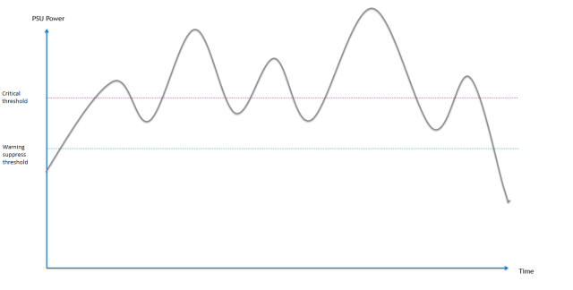

# SONiC PSU Daemon Design #

### Rev 0.4 ###

### Revision ###


 | Rev |     Date    |       Author       | Change Description                |
 |:---:|:-----------:|:------------------:|-----------------------------------|
 | 0.1 |             |      Chen Junchao  | Initial version                   |
 | 0.2 | August 4th, 2022 | Stephen Sun | Update according to the current implementation |
 | 0.3 | August 8th, 2022 | Or Farfara | Add input current, voltage and max power |
 | 0.4 | August 18th, 2022 | Stephen Sun | PSU power threshold checking logic |


## 1. Overview

The purpose of PSU daemon is to collect platform PSU data and trigger proper actions if necessary. Major functions of psud include:

- Collect constant PSU data during daemon boot up, such as PSU number.
- Collect variable PSU data periodically, including:
  - PSU entity information
  - PSU present status and power good status
  - PSU power, current, voltage and voltage threshold
  - PSU max power, input current and input voltage
  - PSU temperature and temperature threshold
- Monitor PSU event, set LED color and trigger syslog according to event type, including:
  - PSU present status and power good status
  - whether the PSU voltage exceeds the minimal and maximum thresholds
  - whether the PSU temperature exceeds the threshold
  - whether the total PSU power consumption exceeds the budget (modular switch only)
  - whether PSU power consumption exceeds the PSU threshold

### 1.1 PSU power threshold check

#### 1.1.1 Why we need it

An Ethernet switch is typically equipped with more than one PSU for redundancy. It can be deployed in different scenarios with different types of xSFP modules, traffic type and traffic load under different temperature. All these factors affect the power consumption of an Ethernet switch.

On some platforms, the capacity of a single PSU is not large enough to afford all the components and xSFP modules running at the highest performance at the same time. In this case, we do not have redundancy any longer and users should be notified of that, which is achieved via periodically checking the current power of PSUs against their maximum allowed power, AKA, power thresholds.

On some platforms, the maximum allowed power of the PSUs is not fixed but a dynamic value depending on other factors like temperature of certain sensors on the switch.

## 2. PSU data collection

PSU daemon data collection flow diagram:


Now psud collects PSU data via platform API, and it also support platform plugin for backward compatible. All PSU data will be saved to redis database for further usage.

### 2.1 PSU data collection specific to PSU power exceeding check

We will leverage the existing framework of PSU daemon, adding corresponding logic to perform PSU power check.

Currently, PSU daemon is waken up periodically, executing the following flows (flows in bold are newly introduced by the feature):

1. Check the PSUs' physical entity information and update them into database
2. Check the PSUs' present and power good information and update them to database
   - __It will check the capability of PSU power check via reading PSU power thresholds when a new PSU is detected.__
3. Check and update the PSUs' data
   - Fetch voltage, current, power via calling platform API
   - __Perform PSU power checking logic__
   - Update all the information to database

We will detail the new flows in the following sections.

#### New PSU is detected

Basically, there are two scenarios in which a new PSU can be detected:

- On PSU daemon starting, all PSUs installed on the switch are detected
- On new PSU pulgged, the new PSU is detected

When one or more new PSUs is detected and power is good, PSU daemon tries retrieving the warning-suppress and critical threshold for each PSU installed on the switch.

The PSU power checking will not be checked for a PSU if `NotImplemented` exception is thrown or `None` is returned while either threshold is being retrieved

#### Alarm raising and clearing threshold

We use asymmetric thresholds between raising and clearing the alarm for the purpose of creating a hysteresis and avoiding alarm flapping.

- an alarm will be raised when a PSU's power is rising accross the critical threshold
- an alarm will be cleared when a PSU's power is dropping across the warning-suppress threshold

In case a unified power threshold is used, the alarm status can flap when the power fluctuates around the threshold. For example, in the following picture, the alarm is cleared every time the PSU power drops across the critical threshold and raised every time the PSU power rises across the critical threshold. By having two thresholds, the alarm won't be cleared and raised so frequently.



#### PSU power checking logic

For each PSU supporting power checking:

1. Retrieve the current power
2. If flag `PSU power exceeded threshold` is `true`, compare the current power against the warning-suppress threshold
   - If `current power` < `warning-suppress threshold`
     - Set `PSU power exceeded threshold` to `false`
     - Message in NOTICE level should be logged: `PSU <x>: current power <power> is below the warning-suppress threshold <threshold>` where
       - `<x>` is the number of the PSU
       - `<power>` is the current power of the PSU
       - `<threshold>` is the warning-suppress threshold of the PSU
   - Otherwise: no action
3. Otherwise, compare the current power against the critical threshold
   - If `current power` >= `critical threshold`
     - Set `PSU power exceeded threshold` to `true`
     - Message in WARNING level should be logged: `PSU <x>: current power <power> is exceeding the critical threshold <threshold>` where
       - `<x>` is the number of the PSU
       - `<power>` is the current power of the PSU
       - `<threshold>` is the warning-suppress threshold of the PSU
   - Otherwise: no action

## 3. DB schema for PSU

PSU number is stored in chassis table. Please refer to this [document](https://github.com/sonic-net/SONiC/blob/master/doc/pmon/pmon-enhancement-design.md), section 1.5.2.

PSU information is stored in PSU table:

    ; Defines information for a psu
    key                       = PSU_INFO|psu_name              ; information for the psu
    ; field                   = value
    presence                  = BOOLEAN                        ; presence state of the psu
    model                     = STRING                         ; model name of the psu
    serial                    = STRING                         ; serial number of the psu
    revision                  = STRING                         ; hardware revision of the PSU
    status                    = BOOLEAN                        ; status of the psu
    change_event              = STRING                         ; change event of the psu
    fan                       = STRING                         ; fan_name of the psu
    led_status                = STRING                         ; led status of the psu
    is_replaceable            = STRING                         ; whether the PSU is replaceable
    temp                      = 1*3.3DIGIT                     ; temperature of the PSU
    temp_threshold            = 1*3.3DIGIT                     ; temperature threshold of the PSU
    voltage                   = 1*3.3DIGIT                     ; the output voltage of the PSU
    voltage_min_threshold     = 1*3.3DIGIT                     ; the minimal voltage threshold of the PSU
    voltage_max_threshold     = 1*3.3DIGIT                     ; the maximum voltage threshold of the PSU
    current                   = 1*3.3DIGIT                     ; the current of the PSU
    power                     = 1*4.3DIGIT                     ; the power of the PSU
    input_voltage             = 1*3.3DIGIT                     ; input voltage of the psu
    input_current             = 1*3.3DIGIT                     ; input current of the psu
    max_power                 = 1*4.3DIGIT                     ; power capacity of the psu
    power_overload            = "true" / "false"               ; whether the PSU's power exceeds the threshold
    power_warning_suppress_threshold   = 1*4.3DIGIT            ; The power warning-suppress threshold
    power_critical_threshold  = 1*4.3DIGIT                     ; The power critical threshold

Now psud only collect and update "presence" and "status" field.

## 4. PSU command

### 4.1 show platform psustatus
There is a sub command "psustatus" under "show platform"

```
admin@sonic:~$ show platform ?
Usage: show platform [OPTIONS] COMMAND [ARGS]...

  Show platform-specific hardware info

Options:
  -?, -h, --help  Show this message and exit.

Commands:
  fan          Show fan status information
  firmware     Show firmware status information
  mlnx         Show Mellanox platform information
  psustatus    Show PSU status information
  ssdhealth    Show SSD Health information
  summary      Show hardware platform information
  syseeprom    Show system EEPROM information
  temperature  Show device temperature information\
```

The current output for "show platform psustatus" looks like:

```
admin@sonic:~$ show platform  psustatus
PSU    Model          Serial        HW Rev      Voltage (V)    Current (A)    Power (W)  Status  LED
-----  -------------  ------------  --------  -------------  -------------  -----------  ------- -----
PSU 1  MTEF-PSF-AC-A  MT1629X14911  A3                12.08           5.19        62.62  WARNING green
PSU 2  MTEF-PSF-AC-A  MT1629X14913  A3                12.01           4.38        52.50  OK      green
```

The field `Status` represents the status of the PSU, which can be the following:
- `OK` which represents no alarm raised due to PSU power exceeding the threshold
- `Not OK` which can be caused by:
  - power is not good, which means the PSU is present but no power (Eg. the power is down or power cable is unplugged)
- `WARNING` which can be caused by:
  - power exceeds the PSU's power critical threshold

### 4.2 psuutil

`psuutil` fetches the information via calling platform API directly. Both warning-suppress and critical thresholds will be exposed in the output of psuutil status.
The "WARNING" state is not exposed because psuutil is a one-time command instead of a daemon, which means it does not store state information. It fetches information via calling platform API so it can not distinguish the following status:

1. The power exceeded the critical threshold but is in the range between the warning-suppress and critical thresholds, which means the alarm should be raised
2. The power didn't exceed the critical threshold and exceeds the warning-suppress threshold, which means the alarm should not be raised

An example of output
```
admin@sonic:~$ show platform psustatus
PSU   Model         Serial       HW Rev   Voltage (V)   Current (A)   Power (W)   Power Warn-supp Thres (W)   Power Crit Thres (W)    Status LED
----- ------------- ------------ -------- ------------- ------------- ----------- --------------------------- ---------------------- ------- -----
PSU 1 MTEF-PSF-AC-A MT1843K17965 A4               12.02          3.62       43.56                       38.00                  58.00 OK      green
PSU 2 MTEF-PSF-AC-A MT1843K17966 A4               12.04          4.25       51.12                       38.00                  58.00 OK      green

```

In case neither threshold is supported on the platform, `N/A` will be displayed.

## 5. PSU LED management

The purpose of PSU LED management is to notify user about PSU event by PSU LED or syslog. Current PSU daemon psud need to monitor PSU event (PSU voltage out of range, PSU too hot) and trigger proper actions if necessary.

### 5.1 PSU event definition

We define a few abnormal PSU events here. When any PSU event happens, syslog should be triggered with "Alert Message", PSU LED should be set to "PSU LED color"; when any PSU restores from previous abnormal state, syslog should be triggered with "Recover Message". PSU LED should be set to green only if there is no any abnormal PSU event happens.

#### 5.1.1 PSU voltage out of range

    Alert Message: PSU voltage warning: <psu_name> voltage out of range, current voltage=<current_voltage>, valid range=[<min_voltage>, <max_voltage>].

    PSU LED color: red.

    Recover Message: PSU voltage warning cleared: <psu_name> voltage is back to normal.

#### 5.1.2 PSU temperature too hot

    Alert Message: PSU temperature warning: <psu_name> temperature too hot, temperature=<current_temperature>, threshold=<threshold>.

    PSU LED color: red.

    Recover Message: PSU temperature warning cleared: <psu_name> temperature is back to normal.

#### 5.1.3 Power absence

    Alert Message: Power absence warning: <psu_name> is out of power. 

    PSU LED color: red.

    Recover Message: Power absence warning cleared: <psu_name> power is back to normal.

#### 5.1.4 PSU absence

    Alert Message: PSU absence warning: <psu_name> is not present. 

    PSU LED color: red. (PSU LED might not be available at this point)

    Recover Message: PSU absence warning cleared: <psu_name> is inserted back.

### 5.2 Platform API change

Some abstract member methods need to be added to [psu_base.py](https://github.com/sonic-net/sonic-platform-common/blob/master/sonic_platform_base/psu_base.py) and vendor should implement these methods.

```python

class PsuBase(device_base.DeviceBase):
    ...
    def get_temperature(self):
        raise NotImplementedError

    def get_temperature_high_threshold(self):
        raise NotImplementedError

    def get_voltage_high_threshold(self):
        raise NotImplementedError

    def get_voltage_low_threshold(self):
        raise NotImplementedError

    def get_input_voltage(self):
        raise NotImplementedError

    def get_input_current(self):
        raise NotImplementedError

    def get_psu_power_warning_suppress_threshold(self)
        """
        The value can be volatile, so the caller should call the API each time it is used.

        Returns:
            A float number, the warning-suppress threshold of the PSU in watts.
        """
        raise NotImplementedError

    def get_psu_power_critical_threshold(self)
        """
        Retrieve the critical threshold of the power on this PSU
        The value can be volatile, so the caller should call the API each time it is used.

        Returns:
            A float number, the critical threshold of the PSU in watts.
        """
        raise NotImplementedError
```

### 6. PSU daemon flow

Supervisord takes charge of this daemon. This daemon will loop every 3 seconds and get the data from psuutil/platform API and then write it the Redis DB.

- The psu_num will store in "chassis_info" table. It will just be invoked one time when system boot up or reload. The key is chassis_name, the field is "psu_num" and the value is from get_psu_num().
- The psu_status and psu_presence will store in "psu_info" table. It will be updated every 3 seconds. The key is psu_name, the field is "presence" and "status", the value is from get_psu_presence() and get_psu_num().
- The daemon query PSU event every 3 seconds via platform API. If any event detects, it should set PSU LED color accordingly and trigger proper syslog.

### 7. Test cases

#### 7.1 Unit test cases added for PSU power exceeding checking

1. Neither `get_psu_power_warning_suppress_threshold` nor `get_psu_power_critical_threshold` is supported by platform API when a new PSU is identified
   In `psu_status`, power exceeding check should be stored as `not supported` and no further function call.
2. Both `get_psu_power_warning_suppress_threshold` and `get_psu_power_critical_threshold` are supported by platform API when a new PSU is identified
   In `psu_status`, power exceeding check should be stored as `supported`
3. PSU's power was less than the warning-suppress threshold and is in the range (warning-suppress threshold, critical threshold): no action
4. PSU's power was in range (warning-suppress threshold, critical threshold) and is greater than the critical threshold
   1. if warning was raised, no action expected
   2. if warning was not raised, a warning should be raised
5. PSU's power was less than the warning-suppress threshold and is greater than the critical threshold: a warning should be raised
6. PSU's power was greater than the critical threshold and is in range (warning-suppress threshold, critical threshold): no action
7. PSU's power was in range (warning-suppress threshold, critical threshold) and is less than the warning-suppress threshold:
   1. if warning was raised, the warning should be cleared
   2. if warning was not raised, no action
8. PSU's power was greater than the critical threshold and is less than the warning-suppress threshold: the warning-suppress should be cleared
9. A PSU becomes absent
10. A PSU becomes `not power good`
