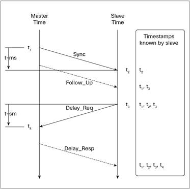

PTP support on SONiC

# Introduction

## Precision Time Protocol (PTP)

- Standardized protocol, IEEE1588
- Synchronize the clocks in local computing systems and devices
- Microsecond to sub-microsecond accuracy and precision
- Administration free 
	- Capability to autonomously decide time server(master)
	- called Best Master Clock Algorithm (BMCA)

## How PTP works

Time offset between master and slave clocks is calculated based on timestamps at packet sending and receiving.

path delay = ((t4-t1) - (t3-t2))/2

offset from master clock = (t2 - t1) - path delay

Achieving high precision requires hardware timestamping

- Hardware assisted timestamp at PHY or MAC layer
- Get time from PTP Hardware Clock (PHC) on NIC

## PTP on Linux

- PTP protocol is implemented on user-land
- Kernel feature for PTP
	- Socket option SO_TIMESTAMPING for packet timestamping
		- Hardware timestamping
	- PHC subsystem
		- Allow to access PHC via clock_gettime/settime/adjtime system calls

## LinuxPTP

- ptp4l
	- Implementation of PTP (Ordinary Clock, Boundary Clock)
- phc2sys
	- Synchronize two clocks (typically PHC and system clock)

ptp4l adjust PHC, phc2sys adjusts system clock.

### ptp4l servo

ptp4l has PI (proportional-integral) controller servo
- A kind of feedback loop
- Determine frequency set to PHC

# LinuxPTP on SONiC

Requirements:
- Trap PTP packet/events
	- https://github.com/opencomputeproject/SAI/pull/841
- NETDEV device support SO_TIMESTAMP option
	- https://www.kernel.org/doc/Documentation/networking/timestamping.txt
	- Section 3.1
- Develop PHC driver
	- https://www.kernel.org/doc/Documentation/ptp/ptp.txt

# Reference

- [Precision Time Protocol on Linux ~ Introduction to linuxptp](https://events.static.linuxfound.org/sites/events/files/slides/lcjp14_ichikawa_0.pdf) 
- [IEEE 1588 PTP on Cisco Nexus 3100 Platform and 9000 Series Switches](https://www.cisco.com/c/en/us/products/collateral/switches/nexus-9000-series-switches/white-paper-c11-733921.html)
